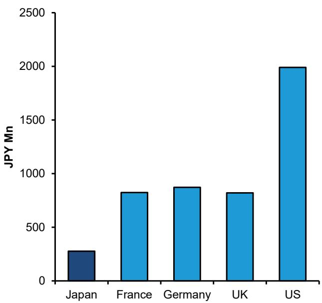
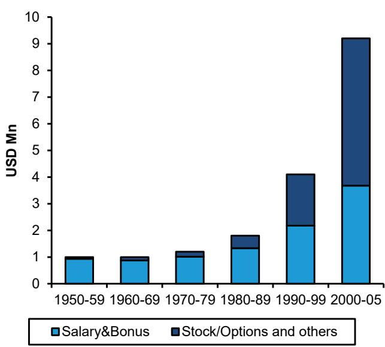
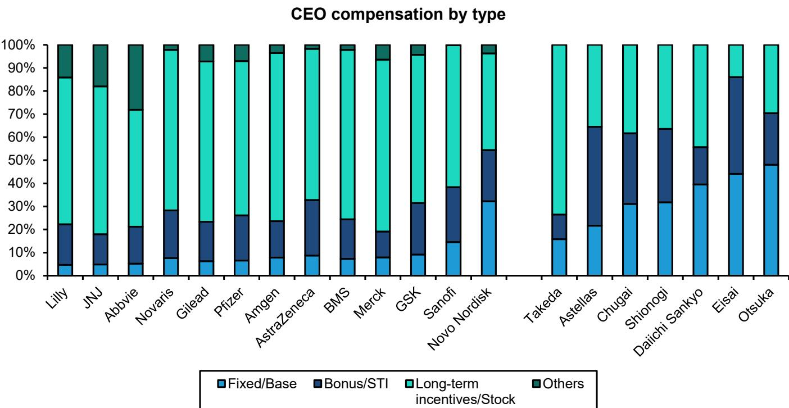
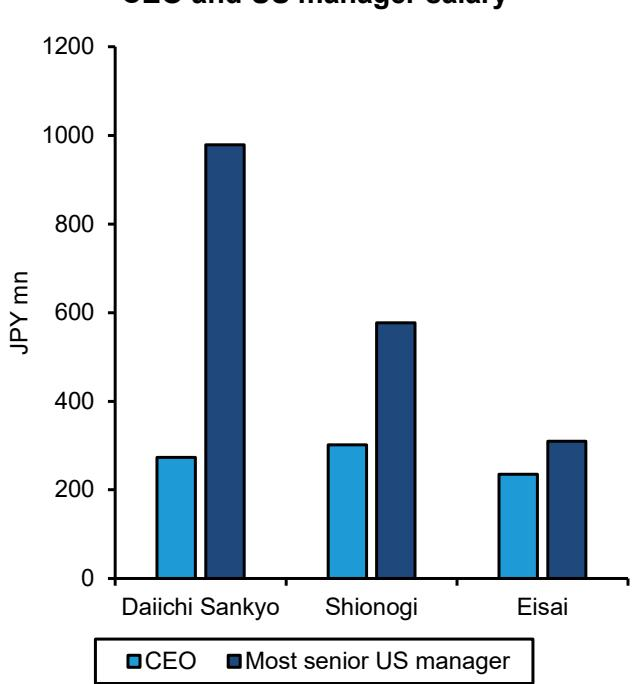
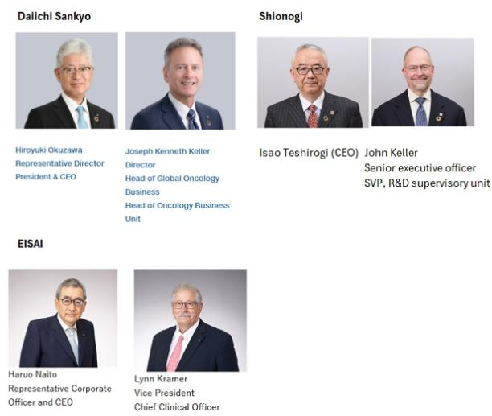
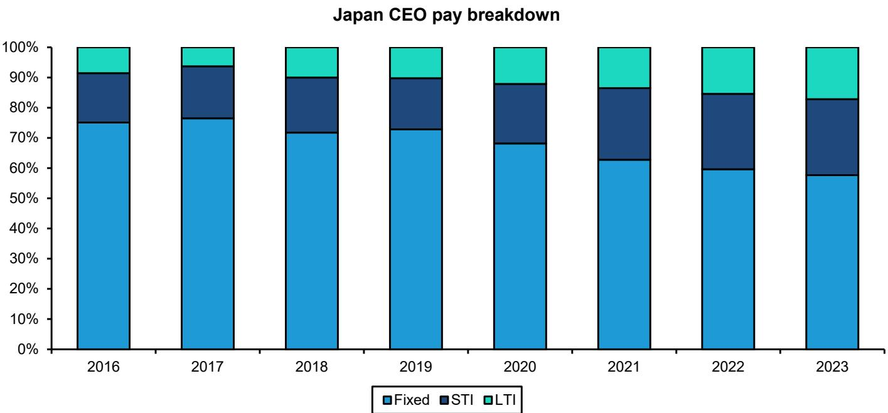

# 周末医疗健康观察：日本高管的薪酬水平是否真的偏低？

**研究团队**

Miki Sogi, Ph.D. +81 3 6777 6991 miki.sogi@bernsteinsg.com

Courtney Breen +1 917 344 8407 courtney.breen@bernsteinsg.com

Eve Burstein +1 917 344 8313 eve.burstein@bernsteinsg.com

Lee Hambright +1 917 344 8429 lee.hambright@bernsteinsg.com

Rebecca Liang, Ph.D. +852 2123 2656 rebecca.liang@bernsteinsg.com

Delphine Le Louet +33 1 42 13 92 93 delphine.le-louet@bernsteinsg.com

Susannah Ludwig +41 582 723 127 susannah.ludwig@bernsteinsg.com

Justin Smith +44 20 7762 5899 justin.smith@bernsteinsg.com

Lance Wilkes +1 917 344 8501 lance.wilkes@bernsteinsg.com

Jeffrey Walch, MD, Ph.D. +1 917 344 8613 jeffrey.walch@bernsteinsg.com

## 日本高管与欧美同行之间存在显著薪酬差距，这一现象值得关注

从美国来到日本的读者，往往会注意到一个与本国截然不同的现象：日本企业高管的薪酬水平明显低于全球同行。近期一项调查显示，日本CEO的薪酬仅为美国和欧洲同行的几分之一，差距约为3至7倍（图表1）。公司规模和盈利能力可以解释部分差异——美国企业在美元计价下通常规模更大、盈利更高。然而，仅凭规模因素远不足以解释如此大的差距。制药行业使这一现象更加突出。制药是全球国际化程度最高的行业之一，日本、欧洲和美国的公司在创新、治疗市场、人才和资金方面展开直接竞争。然而，高管薪酬实践却仍然高度本地化。根据我们对日本、欧洲和美国上市制药公司数据的整理，美国/欧洲制药公司高管的平均薪酬约为日本同行的6倍（图表2）。在本报告中，我们探讨了这一差距背后的结构性和文化性因素，以及日本公司开始调整高管激励结构以缩小差距的早期迹象——希望更重要的是，提升公司表现。

**图表1：日本CEO薪酬显著低于美国/欧洲同行**
CEO薪酬中位数（2023年）

注：收入超过1万亿日元公司的中位数
来源：WTW分析，Bernstein分析

**图表2：日本制药企业CEO薪酬远低于美国和欧洲同行**

注：Lilly、Pfizer、Gilead、Amgen、Merck、BMS和Abbvie由Breen覆盖，JNJ由Lee覆盖，AstraZeneca、Novartis、GSK、Sanofi和Novo Nordisk由Smith覆盖
来源：公司报告，Bernstein分析

## 文化、劳动法规、市场环境以及股权激励不足共同导致CEO薪酬差异

文化因素在其中扮演重要角色。日本企业传统上更看重资历和组织忠诚度，而非个人产出，这一规范根植于年功序列制雇佣体系和广为人知的终身雇佣实践：许多企业员工（即"工薪族"）在整个职业生涯中（约40年）为同一家公司工作。由于高管几乎都是从内部晋升，在服务第36年与第35年之间给予某人截然不同的薪酬，在结构上很难不打破数十年形成的内部薪酬规范。这些动态在数据中清晰可见：在美国、欧盟和日本的CEO中，日本制药企业负责人在担任最高职位前，平均在公司工作约37年，而全球同行仅为约21年（图表3）。这16年的差距并非四舍五入的误差，而是反映了通往最高管理层的根本不同路径——一条建立在内部晋升而非外部招聘或快速提拔基础上的路径，这自然压缩了在任何一个环节薪酬偏离现有结构的空间。

终身雇佣实践的副产品是外部高管在劳动力市场上的流动性受限。由于职业路径基本在内部，且解雇高管（或任何员工）较为困难，CEO很少从外部招聘，因此吸引和留住领导人才所需的薪酬溢价也较低。如图表3所示，在制药行业高管中，美国和欧洲既有内部晋升也有外部招聘，而日本CEO（除武田药品外）几乎都是同一组织内的长期资深员工。

**股权激励不足。** 历史上，日本高管薪酬主要由固定现金工资构成，绩效薪酬和股票期权很少使用。而在美国，股权奖励（股票期权、限制性股票单位（RSU，一种员工薪酬形式，通过可能持续数年的归属期进行限制）、绩效股票）构成了CEO薪酬的大部分。

在公司年数    担任CEO年数    美国/欧洲平均    日本平均

**图表3：日本制药企业CEO通常终身服务于同一家公司**

来源：公司报告，Bernstein分析

## 日本高管获得的股权激励远少于美国同行，机构压力不足是重要原因

在美国，股权已成为高管薪酬的主导形式，但历史上并非一直如此：从现金和奖金向股权的转变历经了数十年（图表4）。这一变化并非由单一因素驱动，而是公司治理改革、税收激励变化和会计准则演变的共同产物——这些因素使股权薪酬对公司和高管都更具吸引力，也更容易向股东解释。其背后的逻辑很直接：以股票支付高管薪酬，将其财务激励与股东关心的结果直接挂钩，这比与短期目标（如当年的财务和运营成果）挂钩的现金奖金更能实现利益一致。这一逻辑后来已固化为正式政策。许多美国制药公司现在要求高管持有最低限度的公司股票，通常以年薪的倍数表示。礼来公司就是一个很好的例子，其CEO被要求持有相当于12倍年薪的公司股票。

日本制药企业CEO的薪酬仍以现金和奖金为主，与美国同行形成鲜明对比（图表5）。这部分可以用结构性而非文化性因素来解释：日本上市公司长期处于复杂的交叉持股网络中，这种安排最初就是为了确保高管的工作保障，并使其免受市场纪律的约束。在这种体系下，管理者的工作保障依赖于同行企业和银行的善意，而非能够追究管理层责任的积极股东群体。由于缺乏持有个人股权或将个人财富与公司股价挂钩的机构压力，日本高管在结构上就没有像美国那样被推向股权薪酬的动力。

**图表4：美国CEO薪酬从以现金为主演变为以股权为主**
美国最大50家企业的CEO薪酬结构

来源：Frydman和Jenter，发表于NBER.org

**图表5：日本CEO的薪酬仍以非股权形式为主**

来源：公司报告，Bernstein分析

盐野义制药

## 管理层持股有利于公司表现和股东回报，日本正在缓慢但稳步地朝正确方向前进

管理层财富与公司股价脱钩，对股东而言并非最优安排。基于工资和奖金的薪酬方案确实激励日本高管推动会计指标的改善。然而，多项研究表明，日本高层管理者历来缺乏最大化股东财富的财务激励——当公司表现良好时他们的财富不会增加，表现不佳时也不会受到太大惩罚。此外，由于在工资和奖金制度下大公司往往支付更多，日本高管有动力扩大公司规模（即收入和员工人数），这有利于管理层的声望，而非提升股东回报率。从直觉上看，这并非高管利益与股东利益的最佳对齐方式。对于在全球运营的公司（如日本制药企业），当这些公司在日本或其他地方聘用美国或欧盟国籍的高管时，还会出现额外的问题。我们已在多家日本制药公司看到，非日本籍非CEO高管获得比CEO更高的薪酬。尴尬之处不止于此：由于美国高管的薪酬遵循美国薪酬结构，出现了拥有最多股份的员工只影响公司某个部门（如美国商业组织，图表6）的情况。解决这一问题的方法之一是向日本高管授予更多股份，并要求他们像美国那样持有更多股权。

## 政府一直在推动改革以增加公司高管的股权持有

日本的公司治理改革推动可追溯至2014年的《尽责管理守则》和2015年的《公司治理守则》，两者都是安倍政府提升日本企业资本效率和盈利能力的更广泛努力的一部分。2018年和2021年的后续修订进一步推进，将框架从宽泛原则转向对主要市场上市公司更具规范性的规则：明确建议CEO继任规划、独立薪酬委员会，以及薪酬与股东价值之间更紧密的联系。经济产业省（METI）也从政策层面加强了这一推动，自2017年以来多次更新其关于董事会成员激励计划的指导手册，推动公司采用股票挂钩和绩效挂钩的薪酬，作为更大胆、更快决策的杠杆。

CEO股权激励正在增加。数据显示，股权作为薪酬形式正在增加（图表8），但目前股票激励的比例仍远低于美国/欧洲。展望未来，更多的股权持有应能使高管激励与股东利益更加一致。

**图表6：日本制药公司通常向美国高管支付更高且不同形式的薪酬**

CEO和美国管理人员薪酬

\*总薪酬，现金和非现金

薪酬最高的（根据披露信息）美国管理人员：第一三共——全球肿瘤业务负责人/肿瘤业务部门负责人；盐野义——研发监管部门高级副总裁；卫材——副总裁/首席临床官
来源：公司报告，Bernstein分析

## 图表7：图表6中提到的高管

第一三共

奥泽宏幸
代表董事 总裁兼CEO

Joseph Kenneth Keller
董事
全球肿瘤业务负责人
肿瘤业务部门负责人

John Keller（CEO）
高级执行官
研发监管部门高级副总裁
卫材
代表公司执行官兼CEO
Lynn Kramer
副总裁
首席临床官
来源：公司报告，Bernstein分析

**图表8：日本CEO浮动薪酬占比持续增长**

来源：Hideaki等人，RIETI，Bernstein分析

## BERNSTEIN 观察表

<table><tr><td rowspan="2">代码</td><td colspan="4">2026年7月30日</td><td rowspan="2">TTM相对</td><td colspan="4">报告每股收益</td><td colspan="3">报告市盈率（倍）</td></tr><tr><td>评级</td><td>币种</td><td>收盘价</td><td>目标价</td><td>当前</td><td>2025A</td><td>2026E</td><td>2027E</td><td>2025A</td><td>2026E</td><td>2027E</td></tr><tr><td>4503.JP（安斯泰来）</td><td>M</td><td>JPY</td><td>2,287.00</td><td>2,200.00</td><td>16.3%</td><td>JPY</td><td>162.77</td><td>170.69</td><td>171.70</td><td>14.1</td><td>13.4</td><td>13.3</td></tr><tr><td>4578.JP（大冢控股）</td><td>M</td><td>JPY</td><td>11,305</td><td>11,600</td><td>18.9%</td><td>JPY</td><td>685.06</td><td>582.89</td><td>634.28</td><td>16.5</td><td>19.4</td><td>17.8</td></tr><tr><td>4568.JP（第一三共）</td><td>O</td><td>JPY</td><td>2,889.00</td><td>4,500.00</td><td>(58.3)%</td><td>JPY</td><td>140.37</td><td>152.26</td><td>216.35</td><td>20.6</td><td>19.0</td><td>13.4</td></tr><tr><td>4502.JP（武田药品）</td><td>O</td><td>JPY</td><td>5,718.00</td><td>6,900.00</td><td>(4.3)%</td><td>JPY</td><td>517.00</td><td>483.65</td><td>523.12</td><td>11.1</td><td>11.8</td><td>10.9</td></tr><tr><td>4519.JP（中外制药）</td><td>O</td><td>JPY</td><td>7,069.00</td><td>9,700.00</td><td>(41.0)%</td><td>JPY</td><td>263.73</td><td>317.24</td><td>370.07</td><td>26.8</td><td>22.3</td><td>19.1</td></tr><tr><td>4507.JP（盐野义制药）</td><td>M</td><td>JPY</td><td>3,041.00</td><td>3,000.00</td><td>(17.1)%</td><td>JPY</td><td>241.11</td><td>247.55</td><td>264.99</td><td>12.6</td><td>12.3</td><td>11.5</td></tr><tr><td>4523.JP（卫材）</td><td>O</td><td>JPY</td><td>5,031.00</td><td>5,300.00</td><td>(17.6)%</td><td>JPY</td><td>136.78</td><td>195.67</td><td>231.26</td><td>36.8</td><td>25.7</td><td>21.8</td></tr><tr><td>JPL</td><td></td><td></td><td>2,570.52</td><td></td><td></td><td></td><td></td><td></td><td></td><td></td><td></td><td></td></tr></table>

O - 跑赢大盘，M - 与大盘一致，U - 跑输大盘，NR - 未评级，CS - 暂停覆盖

4502.JP的预测为调整后每股收益；4502.JP的估值为调整后市盈率（倍）；

来源：彭博，Bernstein预测和分析。

## I. 必要披露

本披露中提及的"Bernstein"或"本公司"指以下实体：Bernstein Institutional Services LLC（2024年4月1日起）、Bernstein & Co., LLC（2024年4月1日前）、Bernstein Autonomous LLP、BSG France S.A.（2024年4月1日起）、Bernstein (Hong Kong) Limited 盛博香港有限公司、Bernstein (Canada) Limited、Bernstein (India) Private Limited（SEBI注册号 INH000006378）、Bernstein (Singapore) Private Limited、Bernstein Japan KK（サンフォード・C・バーンスタイン株式会社）以及根据Bernstein与SG之间的全球服务协议受聘于SG Africa Technologies & Services为Bernstein开展研究工作的分析师。

Bernstein是SG（SG）与AllianceBernstein, L.P.（AB）合资企业的一部分。除非另有明确说明，就本披露而言，Bernstein的"关联方"指SG和AB及其各自的关联公司。

## 估值方法

本研究覆盖六家或以上公司。有关估值方法和其他公司披露，请访问：https://bernstein-autonomous.bluematrix.com/sellside/Disclosures.action。

或致函：Director of Compliance, Bernstein Institutional Services LLC, 245 Park Avenue, New York, NY 10167。

## 风险

本研究覆盖六家或以上公司。有关风险和其他公司披露，请访问：https://bernstein-autonomous.bluematrix.com/sellside/Disclosures.action。
或致函：Director of Compliance, Bernstein Institutional Services LLC, 245 Park Avenue, New York, NY 10167。

## 评级定义、基准和分布

## 股票评级定义

## Bernstein品牌

Bernstein品牌根据未来12个月相对表现的预测对股票进行评级：美国和加拿大交易所上市股票对标S&P 500，欧洲交易所和亚太地区以外新兴市场交易所上市股票对标Bloomberg Europe Developed Markets Large and Mid Cap Price Return Index EUR (EDME)，日本交易所上市股票对标Bloomberg Japan Large and Mid Cap Price Return Index USD (JPL)，亚洲（除日本）交易所上市股票对标Bloomberg Asia ex-Japan Large and Mid Cap Price Return Index (ASIAX)——除非另有说明。

Bernstein品牌有三类评级：

- 跑赢大盘：股票将跑赢市场指数超过15个百分点
- 与大盘一致：股票表现将与市场指数一致，偏差在±15个百分点以内
- 跑输大盘：股票将跑输市场指数超过15个百分点

暂停覆盖：Bernstein品牌下对某公司的覆盖已暂停。评级和目标价暂时中止，不再有效，不应依赖。

未评级：当股票目前无法被准确估值或公司表现无法被准确预测时赋予的评级。覆盖分析师可能继续发布关于该公司的研究报告，向读者通报事件和进展。

未覆盖（NC）表示未被覆盖的公司。

Bernstein品牌股票评级基于12个月时间跨度。

## Autonomous品牌——普通股

Autonomous品牌按如下方式对普通股进行评级。我们使用的基准为：欧洲银行和支付行业使用Bloomberg Europe 600 Financials Price Return Index (E600BK)和Bloomberg Europe Dev Mkt Financials Large and Mid Cap Price Ret Index EUR (EDMFI)，欧洲保险公司使用Bloomberg Europe 600 Insurance Price Return Index (E600IN)，美国银行和支付覆盖使用S&P 500和S&P Financials，美国保险使用S5LIFE，美国非寿险公司覆盖使用S&P Insurance Select Industry (SPSIINS)，新兴市场银行、保险公司和支付行业使用Bloomberg Emerging Markets Financials Large, Mid and Small Cap Price Return Index (EMLSF)，日本金融业使用Bloomberg Japan Financials Large & Mid Cap Price Return Index (JPFILM)。评级相对于行业（而非市场）表述。

Autonomous品牌有三类普通股评级：

- 跑赢大盘（OP）：股票将跑赢相关指数超过10个百分点
- 中性（N）：股票表现将与市场指数一致，偏差在±10个百分点以内
- 跑输大盘（UP）：股票将跑输相关指数超过10个百分点

暂停覆盖：Autonomous研究品牌下对某公司的覆盖已暂停。评级和目标价暂时中止，不再有效，不应依赖。

未评级：当股票目前无法被准确估值或公司表现无法被准确预测时赋予的评级。覆盖分析师可能继续发布关于该公司的研究报告，向读者通报事件和进展。

标记为"重点"（如重点跑赢FOP、重点跑输FUP）的评级是我们的核心观点。

未覆盖（NC）表示未被覆盖的公司。

Autonomous品牌普通股评级基于12个月时间跨度。

## Autonomous品牌——优先股

Autonomous品牌有三类优先股评级：

- 跑赢大盘（OP）：预期该优先工具的总回报将在未来六个月内跑赢类似行业或评级类别中其他发行人的优先证券。
- 中性（N）：预期该优先工具的总回报将在未来六个月内与类似行业或评级类别中其他发行人的优先证券表现一致。
- 跑输大盘（UP）：预期该优先工具的总回报将在未来六个月内跑输类似行业或评级类别中其他发行人的优先证券。

Autonomous优先股评级基于6个月时间跨度。

## AUTONOMOUS信用研究

如果本报告包含对信用工具的研究交流（定义见《市场滥用条例》第3(1)(35)条），以下信息旨在满足其披露要求。

本报告可能还包含对Autonomous或Bernstein其他分析师就本报告所述发行人股票证券发布的观点的引用。请注意，本报告作者发布的信用工具研究交流可能与覆盖该发行人股票证券的分析师发布的观点不同，反之亦然。

## 信用评级定义

Autonomous品牌有三类信用评级：

- 信用跑赢（C-OP）：预期参考信用工具的总回报将在未来六个月内跑赢类似行业或评级类别中其他发行人债券的信用利差。
- 信用中性（C-N）：预期参考信用工具的总回报将在未来六个月内与类似行业或评级类别中其他发行人债券的信用利差表现一致。
- 信用跑输（C-UP）：预期参考信用工具的总回报将在未来六个月内跑输类似行业或评级类别中其他发行人债券的信用利差。

Autonomous信用评级基于6个月时间跨度。

本报告作者的所有研究交流列表及信用评级历史可应要求提供。

是否启动、更新和终止研究覆盖完全由本公司自行决定。本公司已建立、维护并依赖信息壁垒，以控制本公司一个或多个领域（即私密侧）内的信息流向本公司其他领域、单位、集团或关联方（即公开侧）。

## 股票评级/投资银行业务分布

<table><tr><td>股票评级</td><td>市场滥用条例（MAR）和FINRA评级类别</td><td>全球评级分布</td><td>投资银行关系*</td></tr><tr><td>跑赢大盘</td><td>买入</td><td>51.2%</td><td>15.3%</td></tr><tr><td>与大盘一致（Bernstein品牌）/ 中性（Autonomous品牌）</td><td>持有</td><td>35.8%</td><td>16.2%</td></tr><tr><td>跑输大盘</td><td>卖出</td><td>13.1%</td><td>13.6%</td></tr></table>

\* 这些数字代表Bernstein关联方在过去12个月内提供投资银行服务的各股票评级类别中公司的百分比。
截至2026年6月30日。所有数字每季度更新。

## 价格图表/评级和目标价历史

本研究覆盖六家或以上公司。有关价格图表和其他公司披露，请访问 https://bernstein-autonomous.bluematrix.com/sellside/Disclosures.action 或致函：Director of Compliance, Bernstein Institutional Services LLC, 245 Park Avenue, New York, NY 10167。

## 利益冲突

SG和/或其关联方实益拥有以下公司1%或以上的普通股权益类别：大冢控股。

SG和/或其关联方实益拥有以下公司[已发行股本总额/任何类别的普通股权益]的0.5%或以上，净[多头/空头]头寸为：大冢控股、第一三共株式会社和中外制药株式会社。

Bernstein和/或其关联方在过去十二个月内因非投资银行证券相关产品或服务从以下客户获得报酬：中外制药株式会社和盐野义制药株式会社。

Bernstein的某些关联方担任以下公司债务证券的做市商或流动性提供者：盐野义制药株式会社。

## 其他事项

本报告中列出的分析师所属法律实体及其所在地可通过其电话号码的国家代码确定，如下：

+1 Bernstein Institutional Services LLC；美国纽约州纽约市

+44 Bernstein Autonomous LLP；英国伦敦

+212 SG Africa Technologies & Services；摩洛哥卡萨布兰卡

+33 BSG France S.A.；法国巴黎

+34 BSG France S.A.；西班牙马德里

+41 Bernstein Autonomous LLP；瑞士日内瓦

+49 BSG France S.A.；德国法兰克福

+91 Bernstein (India) Private Limited；印度孟买

+852 Bernstein (Hong Kong) Limited 盛博香港有限公司；中国香港

+65 Bernstein (Singapore) Private Limited；新加坡

+81 Bernstein Japan KK；日本东京

如果本报告由非美国关联公司雇用的研究分析师编写，则该分析师（除非另有明确说明）未注册为Bernstein Institutional Services LLC或任何其他SEC注册经纪交易商的关联人士，也未获得FINRA研究分析师的执照或资格。因此，该分析师可能不受FINRA关于（其中包括）研究分析师与主题公司之间的沟通、研究分析师与投资银行人员之间的互动、研究分析师参与与投资银行交易相关的招揽和营销活动、研究分析师的公开露面以及研究分析师账户中持有证券的交易等限制。

如果本报告由SG Africa Technologies & Services（SG集团的一部分）雇用的研究分析师编写，则其是根据Bernstein与SG之间的全球服务协议代表Bernstein公司编写的。

## 认证

本报告中主要负责内容编写的每位研究分析师证明，本出版物中表达的所有观点准确反映了该分析师对任何及所有主题证券或发行人的个人观点，并且该分析师薪酬的任何部分过去、现在或将来都不会直接或间接与本出版物中的具体建议或观点相关。

## II. 附加全球冲突披露

是否启动、更新和终止研究覆盖完全由本公司自行决定。本公司已建立、维护并依赖信息壁垒，以控制本公司一个或多个领域（即私密侧）内的信息流向本公司其他领域、单位、集团或关联方（即公开侧）。

## III. 其他重要信息和披露

"Bernstein"和"Autonomous"研究产品保持独立品牌。

- Bernstein生产多种不同类型的研究产品，包括基础分析和定量分析，分别使用"Autonomous"和"Bernstein"品牌。一种研究产品中包含的建议可能与其他类型研究产品中的建议不同，原因可能是时间跨度、方法论或其他方面的差异。此外，一个品牌下发布的研究产品中的观点或建议可能与其他品牌下发布的同类型研究产品中的观点或建议不同。两个品牌的研究评级体系及与这些评级体系相关的其他信息包含在前一节中。

- Autonomous作为以下实体内的独立业务部门运营：Bernstein Institutional Services LLC、Bernstein Autonomous LLP、Bernstein (Hong Kong) Limited 盛博香港有限公司和Bernstein (India) Private Limited。有关"Autonomous"品牌产品（包括某些销售材料）的信息，请访问：www.autonomous.com。有关Bernstein品牌产品的信息，请访问：www.bernsteinresearch.com。

分析师的薪酬基于其对研究业务的整体贡献，以账户渗透率、生产力和投资观点的主动性来衡量。没有分析师的薪酬基于其在产生投资银行收入方面的表现或贡献。

本报告由独立分析师编写，定义见EU 596/2014《市场滥用条例》（"MAR"）第3(1)(34)(i)条，以及该条例经2018年《欧盟（退出）法案》成为英国国内法后在英国法律中的相同条款。

致美国读者：Bernstein Institutional Services LLC是一家在美国证券交易委员会（"SEC"）注册的经纪交易商，是美国金融业监管局（"FINRA"）的成员，在美国分发本出版物并对其内容负责。如果本材料包含对债务产品的分析，则该材料仅供机构读者使用，不受适用于为零售读者准备的债务研究的美国独立性和披露标准的约束。

Bernstein Institutional Services LLC可能作为自有账户的本金或作为他人（包括关联方）的代理人参与本报告主题任何证券的销售或购买。本报告不旨在满足任何特定个人、实体或账户的目标或需求。

致加拿大读者：如果本出版物涉及加拿大注册公司，则由Bernstein (Canada) Limited在加拿大分发，该公司获得加拿大投资监管组织许可并受其监管。如果出版物涉及非加拿大注册公司，则由Bernstein Institutional Services LLC（受SEC和FINRA双重许可和监管）根据国际交易商豁免在加拿大分发。

本文件不得传递给加拿大的任何人，除非该人符合NI 31-103第1.1节定义的"许可客户"。

致巴西读者：本报告由Bernstein Institutional Services LLC编写，Banco BTG Pactual S.A.（"BTG"）负责本报告在巴西的分发。

致英国读者：本出版物已由Bernstein Autonomous LLP在英国发布或批准发布，该公司受金融行为监管局授权和监管，地址为60 London Wall, London EC2M 5SH，电话+44 (0)20-7170-5000。在英格兰和威尔士注册，编号OC343985。

本文件仅分发给以下人士：(i) 具有《2000年金融服务和市场法（金融促销）令2005》（经修订，简称"金融促销令"）第19(5)条所述投资事务专业经验的人士，(ii) 属于金融促销令第49(2)(a)至(d)条（"高净值公司、非法人协会等"）的人士，(iii) 位于英国境外的人士，或(iv) 可以合法地以其他方式传达或促使其传达与任何证券发行或销售相关的投资活动邀请或诱因（见FSMA第21条含义）的人士（所有此类人士统称为"相关人士"）。本文件仅面向相关人士，非相关人士不得依据或依赖本文件。本文件涉及的任何投资或投资活动仅面向相关人士，且仅与相关人士进行。

致欧洲经济区成员国读者：本出版物由BSG France SA分发，该公司受审慎监管和决议管理局（ACPR）和金融市场管理局（AMF）授权和监管。

致香港读者：本出版物由Bernstein (Hong Kong) Limited 盛博香港有限公司在香港分发，该公司获香港证券及期货事务监察委员会许可和监管（中央实体编号 AXC846），可进行第4类（就证券提供意见）受规管活动，并受SFC公开注册册（https://www.sfc.hk/publicregWeb/corp/AXC846/details）中所述许可条件的约束。本出版物仅供专业读者使用，定义见《证券及期货条例》（第571章）。本报告的目的仅为分析本报告中提及的发行人，不旨在用于违反香港法律的任何目的。

致新加坡读者：本出版物由Bernstein (Singapore) Private Limited在新加坡分发，仅向《2001年证券及期货法》（新加坡）（"SFA"）定义的认可读者或机构读者提供。新加坡的接收者应就本出版物引起或与之相关的事项联系Bernstein (Singapore) Private Limited。Bernstein (Singapore) Private Limited受新加坡金融管理局监管，持有SFA下的资本市场服务牌照，可从事证券和集体投资计划等资本市场产品的交易，并作为豁免财务顾问就证券提供意见、发布和传播分析和报告。Bernstein (Singapore) Private Limited在新加坡注册，公司注册号20213710W，地址为8 Marina Boulevard, #12-01, Marina Bay Financial Centre, Singapore 018981，电话+65-6326-7000。

致中华人民共和国读者：本文件中提及的证券未在中华人民共和国（就本目的而言，不包括香港和澳门特别行政区或台湾，简称"中国"）发售或销售，也不得在违反中国任何适用法律的情况下直接或间接发售或销售。

本文件不构成在中国向任何非法向其发出要约或招揽的人出售任何证券的要约或招揽。

我们不表示本文件可以在中国合法分发，或任何证券可以在中国合法发行，符合中国任何适用的注册或其他要求，或根据其项下的豁免，也不承担促进任何此类分发或发行的责任。特别是，我们未采取任何行动允许在中国公开发行任何证券或分发本文件。因此，证券不会通过本文件或任何其他文件在中国境内发行或销售。本文件及任何广告或其他发行材料不得在中国分发或发布，除非在导致遵守任何适用法律法规的情况下。

致日本读者：本出版物由Bernstein Japan KK（サンフォード・C・バーンスタイン株式会社）在日本分发，该公司在日本注册为金融工具业务经营者，注册机构为关东财务局（注册号：关东财务局（FIBO）第3387号），受金融厅监管。它也是日本投资管理协会的成员。本出版物仅供日本合格机构读者使用，定义见《金融工具和交易法》第2条第(3)款第(i)项。

对于通过Daiwa集团（"Daiwa"）获得Bernstein网站访问权限的日本机构客户读者，您对本文件的访问不应被理解为Bernstein正在为您提供任何目的的研究交流。虽然Bernstein编写了本文件，但您的关系是与Daiwa的关系，且将继续与Daiwa保持关系，Bernstein与您既无合同关系，也对您不承担任何义务。

致澳大利亚读者：Bernstein (Hong Kong) Limited 盛博香港有限公司负责在澳大利亚分发研究。它受美国法律下的证券交易委员会、英国法律下的金融行为监管局监管，这与澳大利亚法律不同。Bernstein (Hong Kong) Limited 盛博香港有限公司根据《2001年公司法》豁免持有澳大利亚金融服务牌照的要求，可向批发客户提供以下金融服务：

- 提供金融产品建议；
- 交易金融产品；
- 为金融产品做市；以及
- 提供托管或存管服务。

致印度读者：本出版物由Bernstein (India) Private Limited（SCB India）在印度分发，该公司根据SEBI（研究分析师）条例2014获得证券交易委员会（"SEBI"）许可和监管，注册号INH000006378，并作为股票经纪人注册，注册号INZ000213537。SCB India目前从事研究和股票经纪服务业务。更多信息请访问www.bernsteinresearch.in。

- SCB India是根据《2013年公司法》于2017年4月12日成立的私人有限公司，公司识别号U65999MH2017FTC293762，注册办公地址为Level 3A, 4th Floor, First International Financial Centre, Plot Nos C-54 and C-55, G Block, Near CBI Office, Bandra Kurla Complex, Bandra (East), Mumbai 400098, Maharashtra, India（电话：+91-22-68421401）。

- 有关SCB India关联方（即关联公司/集团公司）的详细信息，请发送电子邮件至MUM-BERNSTEIN-InCompliance@bernsteinsg.com。

- 截至本报告日期，SCB India没有任何纪律处分记录。

- 除上述情况外，SCB India和/或其关联方（即关联公司/集团公司）、编写本报告的研究分析师及其亲属：

  - 在主题公司中没有任何财务利益；
  - 不实际/实益拥有主题公司1%或以上的证券；
  - 未参与印度公司的任何投资银行活动；
  - 在过去十二个月内未管理或共同管理任何印度公司的公开发行；
  - 在过去12个月内未从主题公司获得投资银行服务或商人银行服务的任何报酬；
  - 在过去十二个月内未从主题公司获得经纪服务报酬；
  - 未从主题公司或与本报告中的具体建议或观点相关的第三方获得任何报酬或其他利益；以及
  - 目前没有，但将来可能担任本报告所覆盖公司金融工具的做市商。
  - 截至本报告日期，与主题公司没有任何利益冲突。

- 除上述情况外，在本研究报告分发日期之前的十二个月内，主题公司不是SCB India的客户。SCB India及其关联方（即关联公司/集团公司）在过去十二个月内未从主题公司获得投资银行、商人银行或经纪服务以外的产品或服务报酬。

- 编写本报告的首席研究分析师、分析师团队成员及其家庭成员不是本报告所覆盖公司的高级管理人员、董事、员工或顾问委员会成员。

- 我们的合规官/申诉官是Rupal Talati女士，可通过+91-22-68421451或MUM-BERNSTEIN-InCompliance@bernsteinsg.com / Scbin-investorgrievance@bernsteinsg.com联系。

- SCB India的研究读者章程和条款及条件可在其网站上获取，可访问Bernstein (India) Private Limited（https://bernsteinresearch.in/）以供参考。

- 免责声明：SEBI的注册和NISM的认证绝不保证中介机构的业绩，也不提供对读者回报的任何保证。证券市场投资受市场风险影响。投资前请仔细阅读所有相关文件。

致瑞士读者：本文件由Bernstein Autonomous LLP在瑞士提供，仅向《瑞士集体投资计划法》（"CISA"）第10条及相关《集体投资计划条例》规定定义的合格读者提供，并严格遵守适用的瑞士法律法规。本文件中提及的产品可能不适合所有类型的读者。本文件基于瑞士银行家协会（SBA）2008年1月发布的《金融研究独立性指令》。

致中东读者：Bernstein Autonomous LLP DIFC分行的主要办公地址为Gate Village 06, DIFC, Dubai, UAE。Bernstein Autonomous LLP DIFC分行受迪拜金融服务管理局（DFSA）监管，注册号CL10040，获准从事投资交易安排和金融产品咨询。所有通信和服务仅面向专业客户和市场对手方（定义见DFSA规则手册）。零售客户等非专业客户和市场对手方不是我们通信
