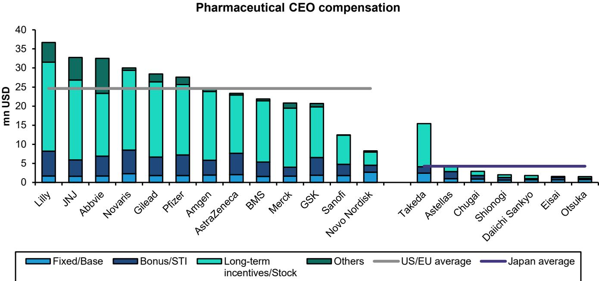
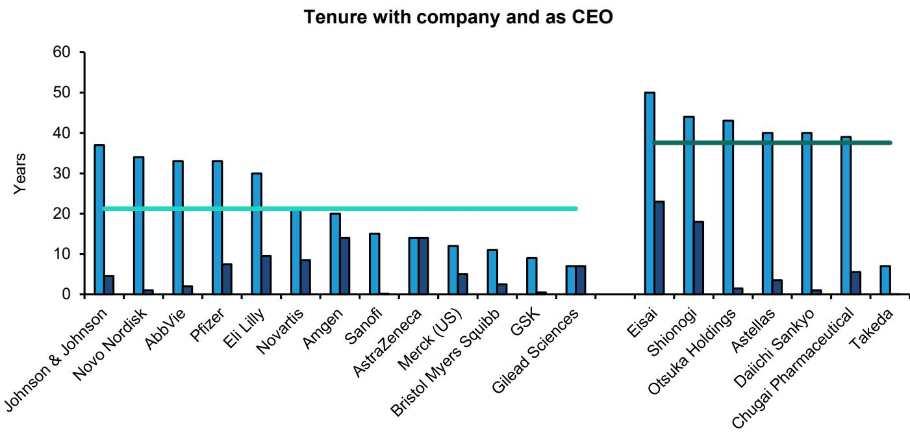

# Bernstein：日本药企高管薪酬与全球同行相差约六倍

日本制药公司的高管薪酬长期低于美国和欧洲同行，这一差距并非单纯由企业规模或盈利水平解释。Bernstein在最新一份覆盖日本、美国和欧洲上市药企的研报中给出一个具体数字：按中位数计算，美欧药企高管的平均薪酬约为日本同行的六倍。报告认为，这一差距背后是终身雇佣制、内部晋升文化和缺乏股权激励共同作用的结果，而日本企业正在缓慢调整。

这份报告的观察起点是制药行业的全球化程度。日本、欧洲和美国的药企在创新药、治疗市场和人才上直接竞争，但高管薪酬实践却始终停留在本地化状态。报告用一组数据说明问题：日本药企CEO在担任最高职务前，平均在同一家公司工作约37年，而美欧同行的平均年限约为21年。16年的差距反映的不是偶然，而是两条完全不同的晋升路径——一条依赖内部逐级晋升，另一条则包含外部招聘和快速提拔。

> **KC评论：** 薪酬差距的根源不在“日本人更节俭”，而在公司治理结构。终身雇佣制下，外部经理人市场几乎不存在，企业没有动力为高管支付市场溢价，股权激励也缺乏制度确定性。理解这一点，才能看懂日本药企薪酬改革为什么推进缓慢。

## 1. 日本药企高管薪酬以现金和奖金为主，股权占比远低于美欧同行

报告对比了日本、美国和欧洲药企高管的薪酬结构。美国高管的薪酬大部分由公司期权、限制性公司和绩效公司构成，而日本高管仍以固定现金薪酬和奖金为主。这种差异有历史原因：美国CEO薪酬从以现金为主转向以股权为主，经历了数十年，由公司治理改革、税收政策和会计准则变化共同推动。日本则长期处于交叉持股网络之中，管理层的工作保障依赖关联企业和银行的善意，而非股东监督，因此缺乏采用股权激励的结构性动力。

报告以礼来为例说明美国实践：该公司要求CEO持有相当于年薪12倍的公司。日本药企中，非日本籍高管的薪酬安排已经出现分化——部分美国业务负责人的薪酬超过日本CEO，因为他们按美国薪酬结构支付。这种内部不一致正在成为日本药企全球化运营中的实际问题。

## 2. 日本药企高管薪酬与美欧差距达三至七倍，规模因素无法完全解释

报告引用的调查数据显示，日本CEO薪酬整体约为美欧同行的三分之一到七分之一。企业规模和盈利能力只能解释部分差距——美国企业以美元计通常更大、更盈利，但这一因素远不足以覆盖如此宽的鸿沟。在制药行业，这一差距更加突出：日本、欧洲和美国的药企在全球市场正面竞争，但高管薪酬实践却保持本地化。

报告还指出，薪酬与绩效的关联度不足可能影响资源配置。在薪资加奖金的模式下，日本高管有动力扩大企业规模和员工人数，因为这直接关联薪酬水平，但这种方式对提升股东回报帮助有限。对于全球化运营的日本药企，这一问题还会因跨国薪酬差异而放大。

## 3. 日本监管框架正推动高管股权激励，但进展仍慢于美欧

日本的公司治理改革可以追溯到2014年的管理 stewardship 守则和2015年的公司治理守则，此后2018年和2021年的修订进一步细化了对Prime Market上市公司的要求，包括CEO继任规划、独立薪酬委员会以及薪酬与股东价值的关联。宏观环境产业省自2017年起多次更新董事会激励计划指引，推动企业采用公司和绩效挂钩薪酬。

报告数据显示，日本CEO的股权激励占比正在上升，但仍明显低于美欧水平。报告认为，更多股权持有将使高管利益与股东更一致，但这一过程需要时间。报告同时指出，日本高管薪酬中股权占比低的部分原因在于交叉持股网络的历史遗留——管理层的工作保障长期依赖关联企业和银行的善意，而非股东监督，因此缺乏采用股权激励的结构性动力。

> **KC评论：** 报告最值得注意的观察是：日本药企中薪酬最高的非日本籍高管，其薪酬可能超过CEO本人。当一家公司的股权激励只覆盖部分业务负责人时，利益对齐就停留在局部，而非整个管理层。这也是报告认为需要扩大股权授予范围的原因。

## 4. 高管持股与公司业绩的关联：日本企业正在缓慢调整

报告梳理了日本药企高管薪酬的演变路径。数据显示，日本CEO的变动薪酬占比正在上升，但股权激励的比例仍远低于美欧。报告认为，管理层财富与报价脱钩对股东不利——薪资加奖金模式激励高管追求会计指标，但缺乏提升股东回报的动力。对于全球化运营的日本药企，这一问题还会因跨国薪酬差异而放大。

报告同时提到，日本药企中已经出现非日本籍高管薪酬高于CEO的情况，这反映了美国薪酬结构在日本企业中的渗透。报告认为，解决这一问题的方式之一是向日本高管授予更多公司，并要求他们像美国同行一样持有一定数量的股权。日本政府层面的改革推动仍在继续，但报告没有给出这一进程的时间表。

For informational purposes only. Portions may be generated,translated,summarized,or edited with AI assistance based on source materials and may contain omissions or errors. Please verify independently. This is not investment,legal,tax,accounting,or other professional advice.

