# The Flow Show

# 信誉、干预与清算

**概览：** 年初至今，石油上涨45.7%，国际股票上涨8.7%，标普500指数上涨8.6%，现金回报2.1%，美元上涨1.6%，高收益债券上涨1.2%，投资级债券下跌1.2%，政府债券下跌2.5%，黄金下跌5.5%，比特币下跌26.1%。

**核心观察：** 市场正经历一轮信誉考验。美联储释放了明确的宽松信号，但市场环境可能持续收紧，直到政策制定者通过更积极的行动来重建信誉。我们倾向于建议从风险资产中适度调整或轮换，而非加码，直到通胀形势更为明朗，或市场出现迫使政策转向的明确信号（见图表5）。

**本周焦点：** 政策协调干预成为本周最重要的进展。多国政策制定者试图稳定汇率市场，防止资本流动出现无序状态。这也显示出在科技竞争背景下，政策制定者有意维护主要市场的稳定。政策层面将继续关注日本、韩国等市场的表现，以避免影响全球科技竞争格局。

**更大图景：** 部分市场出现调整信号。韩国创业板指数接近2022年10月低点（图表2），韩国最大券商股价回到2007年7月水平（图表3），部分美国零售热门股表现不佳。值得注意的是，在政策面偏暖、干预措施和清算事件并存的背景下，风险资产在中期选举前可能面临一定阻力。

## 图表2：韩国创业板

韩国小盘科技股（KOSDAQ）

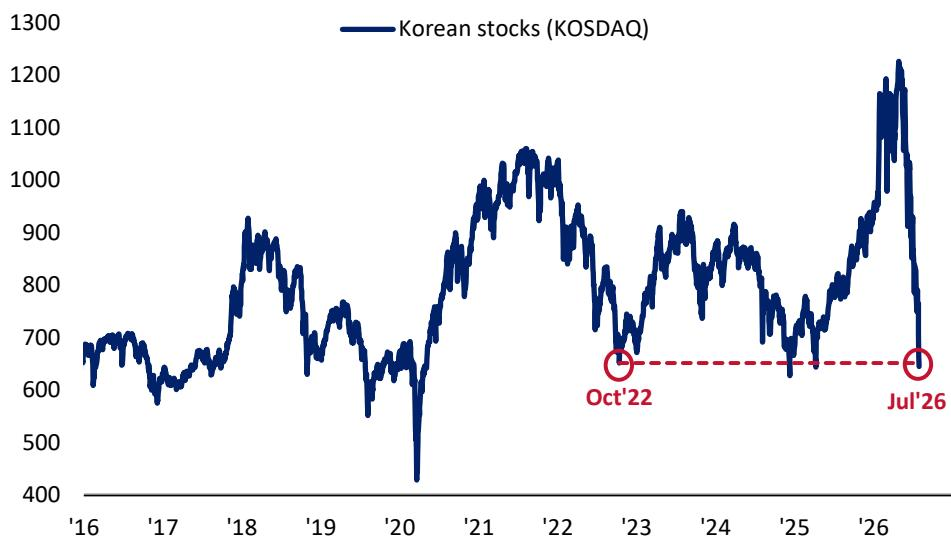  
来源：BofA全球投资策略，彭博  
BofA全球研究

更多内容见第2页...

本文讨论的交易思路和投资策略可能带来较大风险，并非适合所有读者。读者应具备相关市场经验，并有足够财务能力承担应用这些思路或策略可能产生的损失。
BofA与研究报告覆盖的发行人存在或寻求业务往来。因此，读者应知悉公司可能存在影响本报告客观性的利益冲突。读者应将本报告视为做出投资决策的单一参考因素。
重要披露请参见第12至14页。
13002280

## 2026年7月31日

投资策略全球

## BofA数据分析

Michael Hartnett
投资策略师
BofAS
+1 646 855 1508
michael.hartnett@bofa.com

Anya Shelekhin
投资策略师
BofAS
+1 646 855 3753
anya.shelekhin@bofa.com

Myung-Jee Jung
投资策略师
BofAS
+1 646 855 0389
myung-jee.jung@bofa.com

Jessica Guo
投资策略师
BofAS
+1 646 855 0033
jessica.guo@bofa.com

图表1：BofA牛熊指标
从9.6降至9.4  
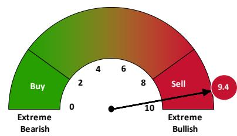  
来源：BofA全球投资策略。上述BofA牛熊指标仅为参考性指标，未经BofA全球研究事先书面同意，不得用作任何金融工具或合约的参考基准或业绩衡量标准，亦不得供第三方用于任何其他目的。该指标并非为充当基准而设立。  
BofA全球研究

**周度资金流向：** 股票流入637亿美元，债券流入125亿美元，现金流入50亿美元，黄金流入13亿美元，加密货币流出4亿美元。

## 值得关注的资金流向：

• 投资级债券：流入58亿美元，连续第17周净流入

\- 全球股票：流入637亿美元，逢低买入情绪持续

• 美股：流入304亿美元，为6周来最大单周流入

• 中国市场股票：流入159亿美元，创4周累计流入纪录（624亿美元——图表6）

\- 韩国股票：流入16亿美元，节奏有所放缓但过去一周未出现单日流出（图表7）

• 科技板块：流入157亿美元，创5周累计流入纪录（685亿美元——图表8）

\- 半导体ETF¹：流入53亿美元，年初至今累计流入530亿美元的趋势未逆转（图表9）

• 消费板块：流入6亿美元，为9周来最大单周流入

**BofA私人客户：** 管理资产4.5万亿美元...股票65.5%，债券17.5%，现金9.7%；私人客户继续增持股票...股票ETF份额年初至今增加6.1%，过去4周增加0.6%，过去一周增加0.3%；过去4周ETF操作中，私人客户买入市政债券、日本股票、新兴市场债券ETF，卖出低波动、银行贷款、贵金属ETF。

**BofA牛熊指标：** 因新兴市场债券流出，指标从9.6降至9.4；极端看多仓位仍是风险资产的阻力，自5月26日BofA牛熊指标触发"卖出信号"以来一直如此（期间出现较多轮换和少量撤退...医疗保健上涨9%，银行上涨8%，而全球股票指数下跌3%，大型科技股下跌8%，半导体指数下跌11%，石油下跌11%，比特币下跌15%）；"旧版"牛熊指标为7.4（参见BofA牛熊指标）。

## 关于组合配置：

\- 我们建议读者从风险资产中适度调整，或轮换至部分防御性板块（如必需消费）、久期资产（如REITs、小盘股、生物科技）和美元，这些资产对金融环境持续收紧的敏感度较低，相对于银行、工业、半导体等板块，对"无宏观着陆、无加息、无AI资本开支削减、无中期选举横扫"这一共识的失望情绪暴露较小。

\- 本周政策协调干预与市场清算的组合，通常是"去杠杆结束"的偏正面信号（注意券商指数和纽约综合指数反弹至高位），但政策制定者更多是在微调（试图限制）政府债券回报表现，而非采取货币层面的强力措施来扭转通胀预期并降低债券回报表现和资本成本（这也是大型科技股未能突破新高的原因）。

\- 政策制定者继续印证资产配置观点：股票市场"大而不能倒"，因为经济依赖财富效应和AI资本开支；政治领导人的支持率仍在波动（特朗普支持率再次回落——图表4），因此政府支出保持上行压力，直到通胀上升和"回报表现上升-美元走弱"的市场事件（图表5）迫使财政政策转向；只有到那时，债券的资产配置比例才会上升。

图表3：韩国最大券商未来资产股价回到2007年7月水平
未来资产证券股价（韩元）  
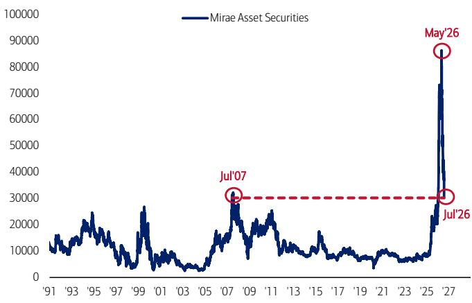  
来源：BofA全球投资策略，彭博  
BofA全球研究

图表4：特朗普支持率出现转折
特朗普支持率  
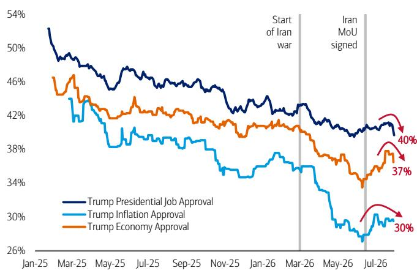  
来源：BofA全球投资策略，Real Clear Politics  
BofA全球研究

图表5：美债回报表现与美元相关性接近转负
美国30年期国债回报表现与美元——50日相关性  
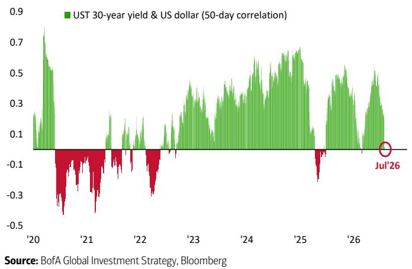  
来源：BofA全球投资策略，彭博  
BofA全球研究

图表6：中国市场股票基金创最大4周流入纪录
中国市场股票基金资金流向，周度vs 4周均值（十亿美元）  
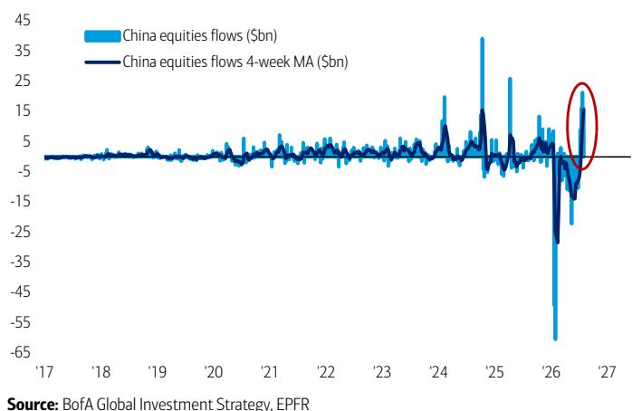  
来源：BofA全球投资策略，EPFR  
BofA全球研究

图表7：韩国股票基金周度流入仍为正值
韩国股票基金资金流向，周度vs 4周均值（十亿美元）  
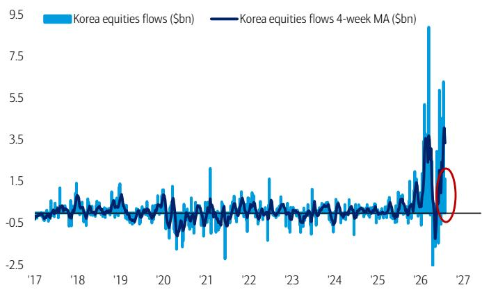  
来源：BofA全球投资策略，EPFR  
BofA全球研究

图表8：科技基金创最大5周流入纪录
科技股票基金资金流向，周度vs 4周均值（十亿美元）  
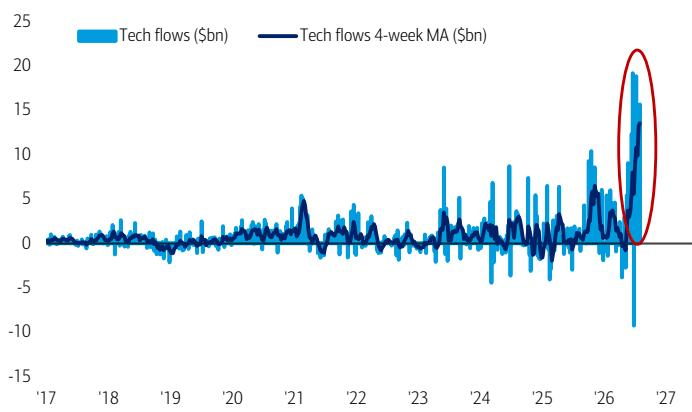  
来源：BofA全球投资策略，EPFR  
BofA全球研究

\*8大半导体ETF基金流向：SMH、SOXX、USD、XSD、FTXL、PSI、SOXQ、DRAM。

图表9：半导体ETF年初至今流入530亿美元
半导体ETF累计资金流向 vs SOX价格指数（右轴）  
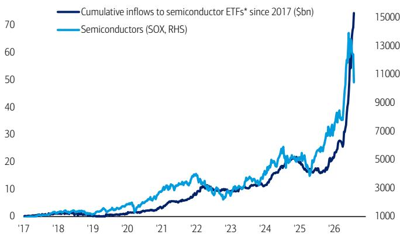  
来源：BofA全球投资策略，EPFR，彭博。

BofA全球研究

## 资产类别资金流向（表1）

股票：流入637亿美元（ETF流入711亿美元，共同基金流出74亿美元）

债券：连续66周净流入（125亿美元）

贵金属：连续4周净流入（13亿美元）

## 固定收益资金流向（图表10）

投资级债券连续17周净流入（58亿美元）

高收益债券连续2周净流入（4100万美元）

新兴市场债券流出恢复（2亿美元）

市政债券连续15周净流入（20亿美元）

政府/国债连续5周净流入（26亿美元）

通胀保值债券连续26周净流入（8亿美元）

银行贷款连续8周净流入（10亿美元）

## 股票资金流向（表2）

美国：流入恢复（304亿美元）

日本：连续8周净流入（12亿美元）

欧洲：连续2周净流出（23亿美元）

新兴市场：连续4周净流入（240亿美元）

按风格：美国大盘股流入（206亿美元），美国价值股流入（11亿美元），美国小盘股流出（6亿美元），美国成长股流出（19亿美元）。

表1：按资产类别年初至今累计资金流向
全球各资产类别资金流向，百万美元

<table><tr><td></td><td>周度%AUM</td><td>年初至今</td><td>年初至今%AUM</td></tr><tr><td>股票</td><td>0.1%</td><td>722,381</td><td>2.5%</td></tr><tr><td>ETF</td><td>0.3%</td><td>1,058,054</td><td>6.3%</td></tr><tr><td>长期开放式基金</td><td>-0.1%</td><td>-335,291</td><td>-2.6%</td></tr><tr><td>债券</td><td>0.2%</td><td>558,678</td><td>5.8%</td></tr><tr><td>大宗商品</td><td>0.5%</td><td>14,782</td><td>1.5%</td></tr><tr><td>货币市场</td><td>-0.3%</td><td>332,994</td><td>3.0%</td></tr></table>

\*截至2026年7月29日当周：来源：EPFR Global  
BofA全球研究

表2：发达市场股票年初至今大幅流入
全球股票区域资金流向，百万美元

<table><tr><td></td><td>周度%AUM</td><td>年初至今</td></tr><tr><td>股票总计</td><td>0.1%</td><td>722,381</td></tr><tr><td>长期开放式基金</td><td>-0.1%</td><td>-335,291</td></tr><tr><td>ETF</td><td>0.3%</td><td>1,058,054</td></tr><tr><td>新兴市场总计</td><td>1.0%</td><td>-41,718</td></tr><tr><td>巴西</td><td>1.7%</td><td>3,959</td></tr><tr><td>印度</td><td>0.0%</td><td>-9,923</td></tr><tr><td>中国</td><td>3.1%</td><td>-183,534</td></tr><tr><td>发达市场总计</td><td>0.0%</td><td>764,099</td></tr><tr><td>美国</td><td>0.0%</td><td>379,506</td></tr><tr><td>欧洲</td><td>-0.1%</td><td>-17,827</td></tr><tr><td>日本</td><td>0.1%</td><td>20,477</td></tr><tr><td>国际</td><td>0.1%</td><td>354,604</td></tr></table>

股票总计 = 新兴市场总计 + 发达市场总计。来源：EPFR Global  
BofA全球研究

按行业：科技流入（157亿美元），医疗保健流入（11亿美元），消费流入（6亿美元），金融流入（4亿美元），公用事业流入（1亿美元），房地产流入（400万美元）；原材料流出（1100万美元），通信服务流出（2亿美元），能源流出（5亿美元）。

图表10：大宗商品、银行贷款、国债的FICC资金流入
周度FICC资金流占AUM百分比

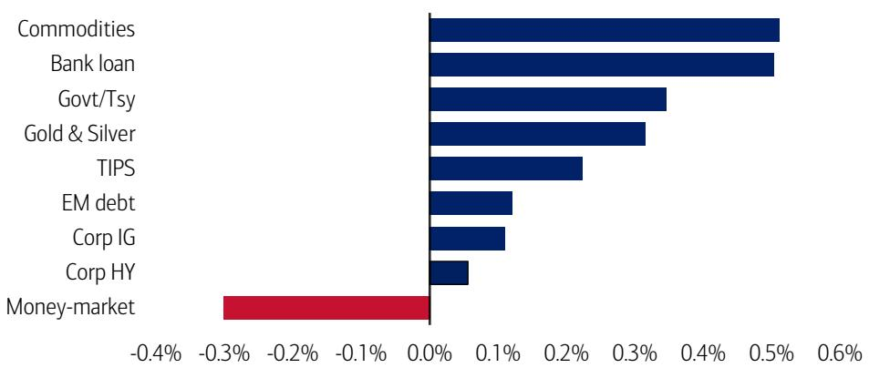  
来源：BofA全球投资策略，EPFR Global  
BofA全球研究

## BofA私人客户资金流向与配置

图表11：私人客户买入市政债券、日本、新兴市场债券
BofA私人客户4周ETF资金流占AUM百分比

BofA私人客户债券持仓占AUM百分比  
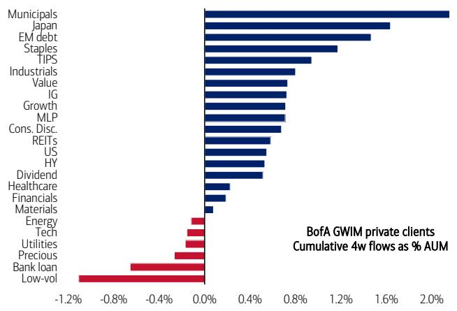  
来源：BofA全球投资策略

图表12：GWIM股票配置65%
BofA私人客户股票持仓占AUM百分比  
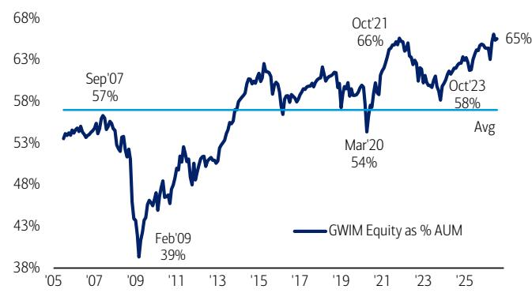  
来源：BofA全球投资策略  
BofA全球研究  
BofA全球研究

图表13：GWIM债券配置17%  
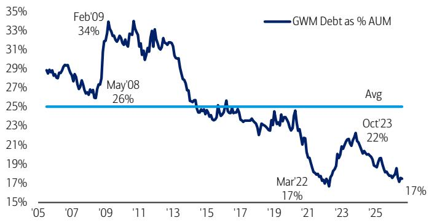  
来源：BofA全球投资策略  
BofA全球研究  
图表14：GWIM现金配置10%  
BofA私人客户现金持仓占AUM百分比

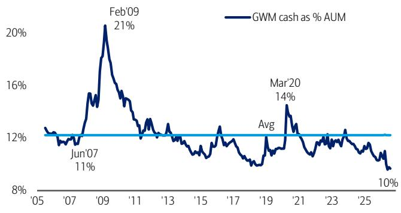  
来源：BofA全球投资策略  
BofA全球研究

图表15：GWIM股票ETF 21%、债券ETF 18%占AUM
BofA私人客户ETF持仓占AUM百分比  
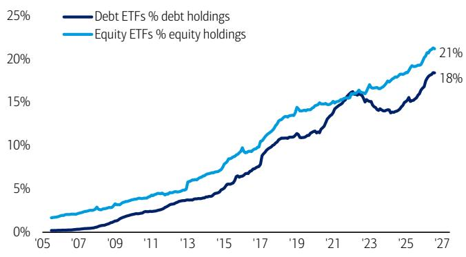  
来源：BofA全球投资策略  
BofA全球研究

图表16：2020年以来国债流入510亿美元 vs 国库券流入270亿美元
BofA私人客户2020年以来国债累计流入（十亿美元）  
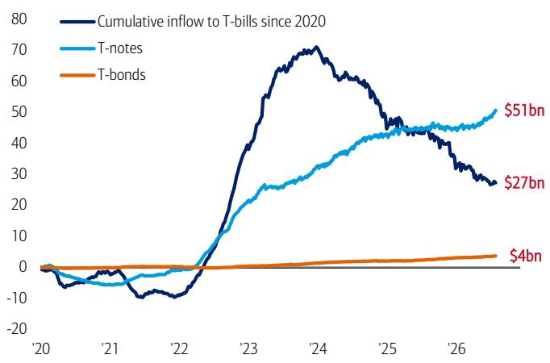  
来源：BofA全球投资策略  
BofA全球研究

## 资产类别总回报年度排名

图表17：各年度资产类别表现
跨资产年度回报排名

<table><tr><td>2007</td><td>2008</td><td>2009</td><td>2010</td><td>2011</td><td>2012</td><td>2013</td><td>2014</td><td>2015</td><td>2016</td><td>2017</td><td>2018</td><td>2019</td><td>2020</td><td>2021</td><td>2022</td><td>2023</td><td>2024</td><td>2025</td><td>2026*</td></tr><tr><td>MSCI新兴市场 39.8%</td><td>美国国债 14.0%</td><td>MSCI新兴市场 79.0%</td><td>黄金 29.2%</td><td>美国国债 9.8%</td><td>REITs 23.8%</td><td>标普500 32.4%</td><td>标普500 13.7%</td><td>标普500 1.4%</td><td>大宗商品 17.5%</td><td>MSCI新兴市场 37.8%</td><td>现金 1.8%</td><td>标普500 31.5%</td><td>黄金 24.8%</td><td>大宗商品 46.3%</td><td>大宗商品 31.1%</td><td>标普500 26.3%</td><td>黄金 26.7%</td><td>黄金 60.7%</td><td>大宗商品 55.6%</td></tr><tr><td>大宗商品 33.0%</td><td>黄金 4.3%</td><td>全球高收益 62.0%</td><td>MSCI新兴市场 19.2%</td><td>黄金 8.9%</td><td>全球高收益 19.3%</td><td>MSCI EAFE 23.3%</td><td>REITs 11.7%</td><td>美国国债 0.8%</td><td>全球高收益 14.8%</td><td>MSCI EAFE 25.9%</td><td>美国国债 0.8%</td><td>REITs 27.4%</td><td>MSCI新兴市场 18.8%</td><td>REITs 37.1%</td><td>现金 1.5%</td><td>MSCI EAFE 18.9%</td><td>标普500 25.0%</td><td>MSCI新兴市场 32.0%</td><td>REITs 16.8%</td></tr><tr><td>黄金 31.9%</td><td>现金 2.1%</td><td>MSCI EAFE 32.5%</td><td>REITs 15.9%</td><td>全球投资级 4.5%</td><td>MSCI新兴市场 18.6%</td><td>全球高收益 8.0%</td><td>美国国债 6.0%</td><td>现金 0.1%</td><td>标普500 12.0%</td><td>标普500 22.0%</td><td>黄金 -1.9%</td><td>MSCI EAFE 22.8%</td><td>标普500 18.4%</td><td>标普500 28.7%</td><td>黄金 -0.8%</td><td>全球高收益 13.4%</td><td>MSCI新兴市场 8.0%</td><td>MSCI EAFE 29.0%</td><td>MSCI新兴市场 12.5%</td></tr><tr><td>MSCI EAFE 11.6%</td><td>全球投资级 -8.3%</td><td>REITs 31.7%</td><td>标普500 15.1%</td><td>全球高收益 2.6%</td><td>MSCI EAFE 17.9%</td><td>REITs 0.7%</td><td>全球投资级 3.2%</td><td>MSCI EAFE -0.8%</td><td>MSCI新兴市场 11.2%</td><td>黄金 12.9%</td><td>全球高收益 -3.3%</td><td>大宗商品 20.1%</td><td>全球投资级 10.3%</td><td>MSCI EAFE 11.9%</td><td>美国国债 -12.9%</td><td>黄金 12.7%</td><td>全球高收益 7.5%</td><td>标普500 18.5%</td><td>MSCI EAFE 9.6%</td></tr><tr><td>美国国债 9.1%</td><td>全球高收益 -27.9%</td><td>标普500 26.5%</td><td>全球高收益 13.9%</td><td>标普500 2.1%</td><td>标普500 16.0%</td><td>全球投资级 0.1%</td><td>黄金 0.1%</td><td>REITs -3.4%</td><td>黄金 8.6%</td><td>REITs 11.5%</td><td>全球投资级 -3.4%</td><td>MSCI新兴市场 18.6%</td><td>MSCI EAFE 8.4%</td><td>全球高收益 1.4%</td><td>全球高收益 -13.2%</td><td>REITs 11.3%</td><td>大宗商品 5.5%</td><td>全球高收益 9.9%</td><td>标普500 7.6%</td></tr><tr><td>全球投资级 7.3%</td><td>标普500 -37.0%</td><td>大宗商品 26.1%</td><td>大宗商品 13.3%</td><td>现金 0.1%</td><td>全球投资级 11.1%</td><td>现金 0.1%</td><td>现金 0.0%</td><td>全球投资级 -3.8%</td><td>全球投资级 4.3%</td><td>全球高收益 10.2%</td><td>REITs -3.9%</td><td>黄金 17.9%</td><td>美国国债 8.2%</td><td>现金 0.0%</td><td>MSCI EAFE -13.9%</td><td>MSCI新兴市场 10.1%</td><td>现金 5.3%</td><td>全球投资级 9.8%</td><td>现金 2.1%</td></tr><tr><td>标普500 5.5%</td><td>大宗商品 -42.6%</td><td>黄金 25.0%</td><td>MSCI EAFE 8.2%</td><td>大宗商品 -2.6%</td><td>黄金 8.3%</td><td>大宗商品 -2.1%</td><td>全球高收益 -0.1%</td><td>全球高收益 -4.2%</td><td>REITs 1.3%</td><td>全球投资级 9.3%</td><td>标普500 -4.3%</td><td>全球高收益 13.7%</td><td>全球高收益 8.0%</td><td>MSCI新兴市场 -2.3%</td><td>全球投资级 -16.7%</td><td>全球投资级 9.5%</td><td>MSCI EAFE 4.4%</td><td>美国国债 6.1%</td><td>全球高收益 1.2%</td></tr><tr><td>现金 5.0%</td><td>MSCI EAFE -43.1%</td><td>全球投资级 19.2%</td><td>全球投资级 6.0%</td><td>REITs -9.4%</td><td>美国国债 2.2%</td><td>MSCI新兴市场 -2.3%</td><td>MSCI新兴市场 -1.8%</td><td>黄金 -10.4%</td><td>美国国债 1.1%</td><td>大宗商品 7.6%</td><td>大宗商品 -13.1%</td><td>全球投资级 11.4%</td><td>现金 0.5%</td><td>美国国债 -2.4%</td><td>标普500 -18.1%</td><td>现金 5.1%</td><td>REITs 3.2%</td><td>大宗商品 5.9%</td><td>美国国债 -0.5%</td></tr><tr><td>全球高收益 3.0%</td><td>REITs -50.2%</td><td>现金 0.2%</td><td>美国国债 5.9%</td><td>MSCI EAFE -11.7%</td><td>现金 0.1%</td><td>美国国债 -3.3%</td><td>MSCI EAFE -4.5%</td><td>MSCI新兴市场 -14.9%</td><td>MSCI EAFE 1.0%</td><td>美国国债 2.4%</td><td>MSCI EAFE -13.2%</td><td>美国国债 7.0%</td><td>REITs -4.4%</td><td>全球投资级 -3.0%</td><td>MSCI新兴市场 -19.8%</td><td>美国国债 3.9%</td><td>全球投资级 1.2%</td><td>现金 4.0%</td><td>全球投资级 -1.1%</td></tr><tr><td>REITs -10.0%</td><td>MSCI新兴市场 -53.2%</td><td>美国国债 -3.7%</td><td>现金 0.1%</td><td>MSCI新兴市场 -18.2%</td><td>大宗商品 -0.3%</td><td>黄金 -27.3%</td><td>大宗商品 -29.3%</td><td>大宗商品 -29.4%</td><td>现金 0.3%</td><td>现金 0.8%</td><td>MSCI新兴市场 -14.3%</td><td>现金 2.2%</td><td>大宗商品 -15.0%</td><td>黄金 -4.1%</td><td>REITs -25.2%</td><td>大宗商品 -3.5%</td><td>美国国债 0.5%</td><td>REITs 3.5%</td><td>黄金 -6.4%</td></tr></table>

来源：BofA全球投资策略，彭博。\*2026年年初至今  
BofA全球研究

## BofA牛熊指标（B&B）

我们的BofA牛熊指标为9.4...信号为卖出。

图表18：BofA牛熊指标9.4
从9.6降至9.4

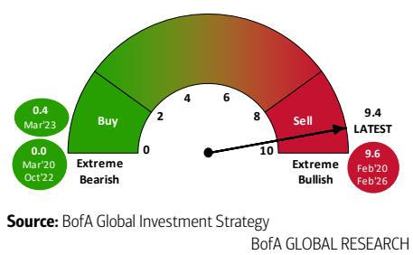

表4：BofA牛熊指标
BofA牛熊当前分项读数

<table><tr><td>分项</td><td>百分位</td><td>情绪</td></tr><tr><td>对冲基金仓位</td><td>81%</td><td>非常看多</td></tr><tr><td>股票资金流</td><td>98%</td><td>非常看多</td></tr><tr><td>债券资金流</td><td>66%</td><td>中性</td></tr><tr><td>信用市场技术面</td><td>75%</td><td>看多</td></tr><tr><td>全球股票指数广度</td><td>49%</td><td>中性</td></tr><tr><td>基金经理调查仓位</td><td>100%</td><td>非常看多</td></tr></table>

来源：BofA全球投资策略，彭博，EPFR Global，Lipper FMI，全球基金经理调查，CFTC，MSCI  
BofA全球研究  
图表19：BofA牛熊指标9.4
2002年以来BofA牛熊指标

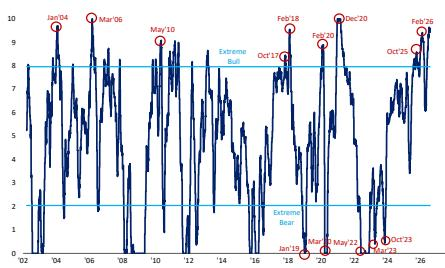  
来源：BofA全球投资策略，EPFR Global，基金经理调查，CFTC，MSCI。

免责声明：上述BofA牛熊指标、MVP模型、BofA全球广度规则、BofA新兴市场资金流交易规则、BofA全球资金流交易规则、BofA全球基金经理调查宏观指标、BofA全球基金经理调查现金规则、全球浪潮、卖方指标和全球金融压力指标仅为参考性指标，未经BofA全球研究事先书面同意，不得用作任何金融工具或合约的参考基准或业绩衡量标准，亦不得供第三方用于任何其他目的。这些指标并非为充当基准而设立。

本报告中BofA牛熊指标的分析经过回测，不代表任何账户或基金的实际表现。回测表现描述了特定策略在所示时间段内的假设性回测表现。未来期间，市场和经济状况将有所不同，相同策略不一定能产生相同结果。本文不保证任何实际投资组合可能达到本文所示的类似回报。事实上，回测回报与实际投资组合管理结果之间经常存在显著差异。回测业绩结果是通过将投资策略或方法应用于历史数据而创建的，试图表明如果产品在过去的某个时期存在，该策略在该时期可能的表现。回测结果具有固有限制，包括它们是在充分后见之明的情况下计算的，这允许调整证券选择方法以最大化回报。此外，所示结果不反映实际交易或重大经济市场因素在实际情况中对投资组合经理决策的影响。回测回报不反映咨询费、交易成本或其他费用开支。

## 2026年跨资产表现排名

## 表5：2026年年初至今回报排名

年初至今以美元计价的跨资产回报

<table><tr><td colspan="14">回报排名，美元计价（2026年年初至今）</td></tr><tr><td colspan="2">资产</td><td colspan="2">股票</td><td colspan="3">行业</td><td colspan="2">固定收益</td><td colspan="2">外汇vs美元</td><td colspan="3">大宗商品</td></tr><tr><td>1 石油</td><td>47.1%</td><td>1 韩国股票</td><td>50.0%</td><td>1 ACWI能源</td><td>26.7%</td><td>1 3个月国库券</td><td>2.0%</td><td>1 巴西雷亚尔</td><td>7.0%</td><td>1 大宗商品</td><td>55.6%</td><td></td><td></td></tr><tr><td>2 环太平洋（除日本）</td><td>13.4%</td><td>2 台湾股票</td><td>40.7%</td><td>2 ACWI信息技术</td><td>15.1%</td><td>2 美国高收益</td><td>1.5%</td><td>2 挪威克朗</td><td>5.2%</td><td>2 布伦特原油</td><td>49.1%</td><td></td><td></td></tr><tr><td>3 新兴市场股票</td><td>12.6%</td><td>3 新加坡股票</td><td>21.0%</td><td>3 ACWI银行</td><td>12.1%</td><td>3 新兴市场公司债</td><td>0.9%</td><td>3 澳元</td><td>4.2%</td><td>3 WTI原油</td><td>47.1%</td><td></td><td></td></tr><tr><td>4 日本股票</td><td>12.2%</td><td>4 希腊股票</td><td>18.2%</td><td>4 ACWI工业</td><td>9.6%</td><td>4 2年期国债</td><td>0.7%</td><td>4 人民币</td><td>3.3%</td><td>4 铜</td><td>9.2%</td><td></td><td></td></tr><tr><td>5 英国股票</td><td>10.9%</td><td>5 土耳其股票</td><td>15.1%</td><td>5 ACWI房地产</td><td>8.6%</td><td>5 通胀保值债券</td><td>0.6%</td><td>5 墨西哥比索</td><td>3.3%</td><td>5 黄金</td><td>-7.0%</td><td></td><td></td></tr><tr><td>6 工业金属</td><td>10.6%</td><td>6 葡萄牙股票</td><td>12.9%</td><td>6 ACWI必需消费</td><td>8.0%</td><td>6 美国抵押贷款</td><td>0.2%</td><td>6 新西兰元</td><td>0.7%</td><td>6 铁矿石</td><td>-9.6%</td><td></td><td></td></tr><tr><td>7 欧洲股票</td><td>8.2%</td><td>7 意大利股票</td><td>12.9%</td><td>7 ACWI金融</td><td>7.3%</td><td>7 新兴市场主权债</td><td>0.1%</td><td>7 韩元</td><td>-0.3%</
