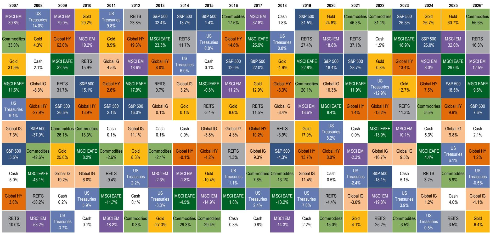
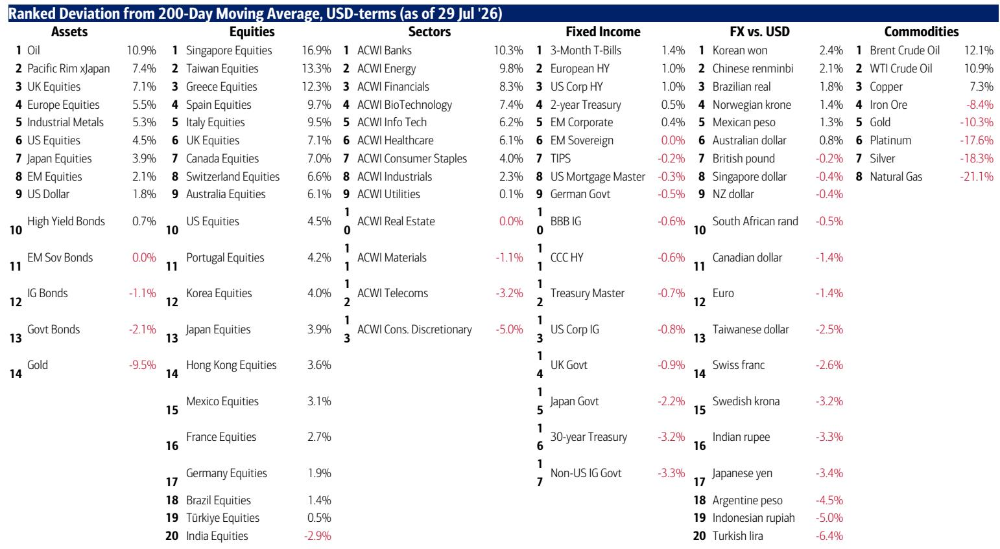
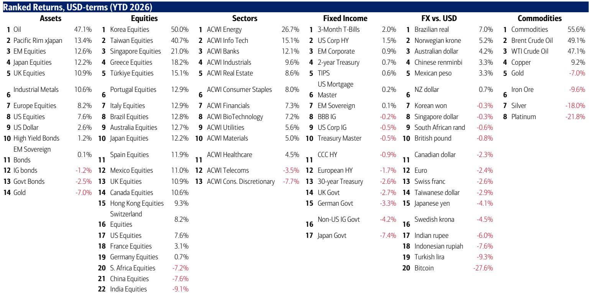

# 市场观察：政策信号与风险资产的新平衡

本周资金流向数据中最值得关注的数字，并非流入全球股票市场的637亿美元，也不是科技基金创纪录的157亿美元流入。真正值得留意的是比特币年初至今-26.1%的回报表现，以及韩国KOSDAQ指数（该国小盘科技指数）重新回到2022年10月低点的事实。这些现象并非孤立事件，而是具有指示意义的信号。市场正在经历一场表面平静的流动性调整，而政策应对措施可能使情况更加复杂。

当前存在明显的张力。美联储展现出明显的宽松倾向，试图通过温和的表态安抚市场，但金融环境仍在持续收紧。这种缺乏可信度的宽松表态，反而迫使市场承担了本应由政策制定者完成的工作，推动回报表现上行，直到美联储不得不通过更激进的行动来重建信誉。值得关注的日期是8月28日，新任美联储主席将在杰克逊霍尔发表讲话。这不是对软着陆的预测，而是对政策信誉事件的预警。

本周美国、日本和韩国协调进行的外汇干预是最重要的政策行动，但其意义与多数观察者的理解不同。这并非对日元或韩国资产价格的单纯救助，而更像是一种“AI价格维护操作”。政策制定者在传递一个信号：他们不会允许日本、韩国或台湾地区股市的波动阻碍与中国的AI战略竞争。问题在于，这种干预属于边际调整，只是为政府债券回报表现设定了上限，并未解决通胀的根本原因。这是对结构性问题的一种临时应对，难以推动风险资产创出新高。

对读者而言，策略含义是清晰的：适当收缩并调整配置，而非重新加仓。风险资产的看涨逻辑建立在“宏观平稳着陆、美联储不加息、AI资本开支不缩减、中期选举无意外”的共识之上。这一共识本身现在就是风险。从持仓数据看——BofA牛熊指标从9.6小幅降至9.4——市场仍处于高度乐观的定位状态。当共识如此拥挤时，逆向操作往往是更合理的选择。

## 牛熊指标仍处高位，极端持仓成为风险资产的主要阻力

BofA牛熊指标从9.6小幅回落至9.4，主要受新兴市场债券资金流出影响，但仍坚定地处于高位区域。该信号自5月26日以来持续有效，此后的市场表现更多呈现轮动而非整体撤退的特征：医疗保健板块上涨9%，银行板块上涨8%，但ACWI指数下跌3%，压力主要集中在此前的领涨板块。SOX半导体指数下跌11%，油价下跌11%，比特币下跌15%。这不是市场在广泛降低风险，而是从过去一年拥挤的交易中轮动离开。

指标的构成颇具说明性。基金经理持仓处于第100百分位，股票资金流处于第98百分位，对冲基金持仓处于第81百分位。每一项情绪指标都锚定在看涨极端。仅有的中性读数出现在全球股指宽度和债券资金流中，分别处于第49和第66百分位。这说明读者全面押注股票，已无更多资金可继续推高市场。该指标并非择时工具，而是风险管理工具——它提示当前的风险收益不对称性较差。

剔除部分特殊成分后的“旧版”牛熊指标为7.4，虽不那么极端但仍处于高位。报告的分析框架认为，极端的牛市持仓仍是市场面临的阻力，而指标仅从峰值小幅回落而非大幅下挫，意味着调整过程尚未完成。市场不会在情绪仅仅是“不那么看涨”时见底，而是在情绪转为看跌时见底。目前距离那一状态还有相当距离。

## 科技与中国市场的创纪录资金流入是反向信号，而非强势确认

资金流向数据呈现出一个悖论。全球股票市场录得637亿美元流入，美国股票市场录得304亿美元流入（为六周最大），中国市场录得624亿美元的四周流入（为历史最大）。科技基金吸收157亿美元，其68.5亿美元的五周流入为历史最大；半导体ETF录得53亿美元流入，尽管SOX指数下跌25%，年初至今530亿美元的大规模流入并未逆转。这看似是典型的“接飞刀”行为，但其规模暗示这更多是机构信念而非散户冲动。

报告将此描述为“无畏的逢低买入”行为。但个股数据揭示了不同图景。今年进入美国股票市场的普通读者平均处于浮亏状态：SPX较平均入场点低30%，NASA低36%，DRNZ低20%，DRAM低10%。资金在流入，但价格在下跌。这是派发的特征，而非吸筹。“弱势资金”在逢低买入，而“强势资金”正利用流动性退出。

中国市场的流入尤其值得关注。624亿美元的四周流入创下历史纪录，而此前经历了多年的持续流出。年初至今的资金流仍为深度负值（-1835亿美元），因此这是在极短时间内出现的急剧逆转。报告认为这受到政策驱动的买盘支撑，但其可持续性存疑。KOSDAQ处于2022年10月低点，韩国最大券商未来资产证券的股价回到2007年7月的水平。亚洲科技板块正受到政策干预的支撑，但潜在的流动性调整仍在进行中。资金流在与市场趋势对抗，而趋势目前占据上风。

## 韩国与半导体板块处于调整核心，政策干预支撑结构性下行

流动性调整最直观的证据在韩国。KOSDAQ（韩国版纳斯达克）回到2022年10月低点。韩国最大券商未来资产证券的股价与19年前的2007年7月持平。这不是简单的回调，而是结构性的长期下行。韩国上周录得16亿美元流入且无一日流出，表明政策干预在支撑市场，但趋势方向不容忽视。

报告将这种干预称为新型“AI价格维护操作”。美国、日本和韩国正在协调行动，防止亚洲科技股崩盘，因为这些资产对与中国的AI竞争具有战略意义。这是一种合理的解读，但隐含着一个严峻的含义：政策制定者正在与市场对价值的判断对抗。半导体板块年初至今下跌25%，尽管ETF录得创纪录流入。市场在传递信息：这些股票所隐含的盈利预期过高。而政策制定者在传递信息：他们并不在意这一点。

风险在于，这种干预可能催生一个最终破裂的“政策泡沫”。本周协调的外汇干预旨在阻止日元崩跌和日本国债回报表现飙升，但也表明政策制定者担心风险蔓延至韩国和台湾债券市场，以及资金无序流出美国国债。报告指出，这种干预“必须奏效”，因为否则将面临无序调整。问题在于，当基本面持续恶化时，干预很少能真正奏效。政策制定者试图为政府债券回报表现设定上限，但并未解决最初推动回报表现上行的通胀风险。

## 市场等待“监督者事件”迫使政策转向，在此之前风险资产上行空间受限

报告的核心论点是，市场正在等待一个“高回报表现-弱美元”的监督者事件，以迫使财政和货币政策转向。美国30年期国债回报表现与美元之间的相关性正接近转负（图表5）。当这一相关性翻转时，意味着市场对美国政策组合的信心正在流失。这是典型的“监督者”信号：债券市场要求更高回报表现，而货币贬值是因为市场不相信政策制定者会采取必要措施来控制通胀。

报告认为，只有这种情况才能推动资金持续配置债券。在此之前，政策制定者将继续“印证”股市大到不能倒的观点。经济依赖财富效应和AI资本开支，政治领导人正在为支持率挣扎——特朗普的支持率再次下降——因此他们将继续支出。结果是市场被政策支撑，但由于政策缺乏可信度，无法突破新高。

这意味着市场处于“上有顶、下有底”的格局。底部由政策干预和“大到不能倒”的动态提供。顶部由缺乏可信度和金融环境的持续收紧所决定。报告的建议是“收缩并轮动”至防御性板块、长久期资产和美元。这是一种防御性姿态，但并非看空。它承认在政策组合重置之前，风险收益比不佳。

## 未来六个月决策框架：轮动至防御与长久期，等待监督者事件

报告提供了一个清晰的应对框架，可归纳为若干可操作原则。第一，不要与牛熊指标对抗。该指标处于高位区域，自5月26日以来的信号一直准确。市场一直在轮动而非撤退，但轮动方向是从此前的领涨板块转向防御性板块。这就是当前的交易方向。

第二，报告建议轮动至“必需消费品、长久期资产（REITs、小盘股、生物科技）和美元”。这些资产类别受到金融环境持续收紧的保护，周期性脆弱性低于银行、工业股和半导体。逻辑在于这些板块已被重新定价，对“共识失望”的敞口较小——如果出现宏观不平稳着陆、美联储不加息、AI资本开支不缩减、中期选举无意外等情形。

第三，关于长久期。报告指出，政策制定者正在“微调”政府债券回报表现，而非采取“货币冲击疗法”（美联储和日本央行加息）。这意味着回报表现可能保持受限，这对长久期资产有利。报告特别提到REITs、小盘股和生物科技是低回报表现的受益者。这些板块受利率周期冲击最大，如果政策组合转变，它们提供最佳的风险收益比。

第四，也是最重要的，等待监督者事件。报告明确指出，只有在“高回报表现-弱美元”事件迫使财政政策转向后，债券配置才会上升。这是重置市场的催化剂。在此之前，市场可能保持区间震荡，风险收益比不佳。报告的建议是“收缩并轮动”，而非“重新加仓”。激进的时机将在政策转向之后，而非之前。

最后一个值得关注的数据点来自BofA私人客户（管理4.5万亿美元资产）的资金流。他们仍将65.5%配置于股票，17.5%配置于债券，9.7%配置于现金。他们继续增持股票，股票ETF份额年初至今增长6.1%。这是典型的“被动”买家。私人客户没有在轮动，而是在持有。这是牛市的最后阶段，也是最脆弱的阶段。当私人客户最终投降时，那将是底部。目前尚未到达那一时刻。

*仅供参考。部分内容可能基于原始材料由AI辅助生成、翻译、总结或编辑，可能包含遗漏或错误。请独立核实。本文不构成投资、法律、税务、会计或其他专业建议。*
