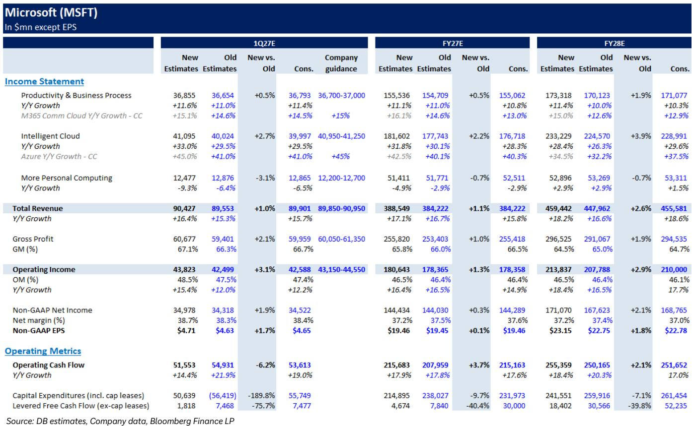
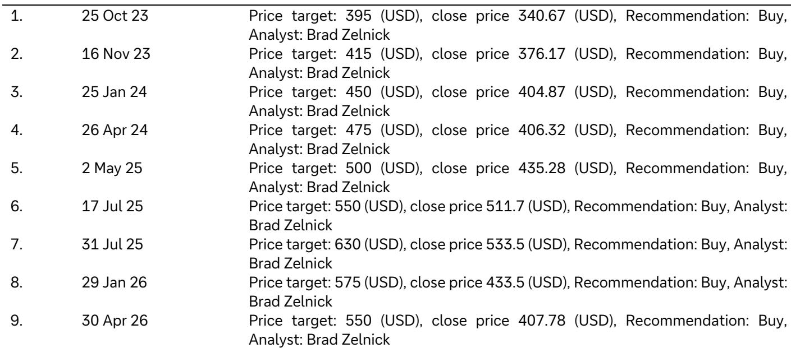
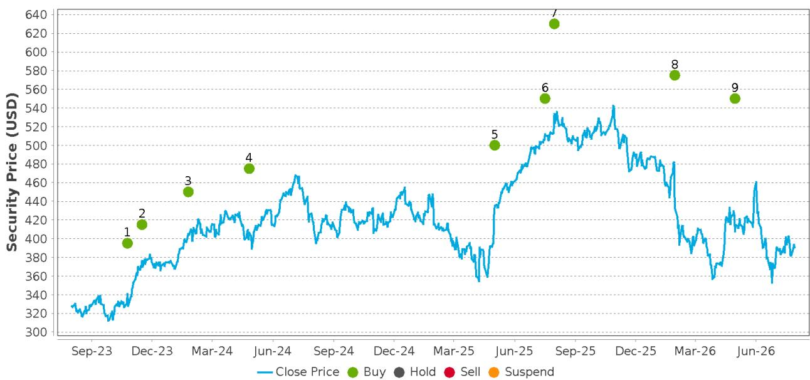

# 微软最新季报：AI竞争的关键在于“编排”，而非“拥有最好的模型”

微软本财年第四季度最重要的数字，并非647亿美元的营收，也不是Azure 43%的恒定汇率增长，而是一个隐藏在商业预订数据中的较小数字：剔除OpenAI带来的Azure承诺后，预订量同比增长18%，而商业剩余履约义务（RPO）的全部环比增长均来自前沿模型提供商以外的客户。这一区分，将“搭乘他人AI浪潮”的公司，与“成为整个企业AI经济不可或缺的基础设施层”的公司，清晰地区分开来。

微软公布的业绩在各大业务板块均超出预期，指引Azure在2027财年上半年加速增长，并披露M365 Copilot付费席位已突破3000万，较上一季度的2000万大幅增长。市场反应将聚焦于头条数据的超预期，但战略信号更为深远：微软的全栈优势已不再是一个理论构想。它现在可以通过应用层的加速增长、云业务供不应求的状态，以及管理层明确将前沿模型公司的贡献排除在外的业绩表述来衡量。本季度证明，AI时代的经济价值正流向模型、数据和流程的“编排者”，而非任何单一的模型提供商。

这是企业AI的生产现实首次在财报周期中变得清晰：应用程序依赖于精心架构的“控制框架、上下文、记忆与行动空间”，使得任何特定模型都可以随时被替换。微软在这一栈中的布局，从芯片到Copilot，意味着无论哪个前沿模型在基准测试中胜出，它都能捕获价值。对于观察者而言，这意味着微软的AI商业化比围绕任何单一模型的炒作周期更具持续性，财务结果现已证明了这一点。

## Azure 43%的增长是一个供给端的故事，这改变了研究框架

Azure按恒定汇率计算同比增长43%，比指引中点高出3.5个百分点，也远超市场预期的约40-41%。超预期表现来自CPU和GPU集群的效率提升、通过流程改进提前交付新产能，以及6月转向按用量计费后GitHub Copilot消费收入强于预期。但最值得关注的细节是管理层对增长性质的描述：各工作负载、客户细分和地理区域的需求持续超过供给。

这不是一个需求端的故事，而是一个供给端的故事，这一区别对如何构建未来几个季度的研究模型至关重要。当云业务受供给约束时，收入增长成为资本部署效率的函数，而非市场份额增长或定价能力的函数。微软能够从现有集群中榨取更多算力、通过流程改进提前交付新产能，并迅速将该产能变现，这意味着公司找到了一种无需等待下一代GPU即可加速增长的方法。

第一季度指引强化了这一解读。Azure预计按恒定汇率同比增长45%，较第四季度加速两个百分点，比市场共识高出四个百分点。管理层表示，这意味着净增量约为28亿美元，同比增长65%，且2027财年下半年应会进一步加速。随着资本支出在上半年持续攀升，并日益向短寿命资产倾斜，这一设定表明Azure的高增长态势可以持续多个季度。供给端的效率提升并非一次性收益，它们代表了微软资本部署方式的结构性改进。

战略含义在于，微软已有效地将其云增长与更广泛的AI基础设施周期脱钩。即使前沿模型开发步伐放缓，或竞争对手上线更多产能，Azure的增长轨迹现在由微软自身的资本部署和运营执行驱动。公司已成为自己的瓶颈，这远比依赖外部需求条件要好得多。

## Copilot 3000万席位表明应用层商业化正在兑现

长期AI主题最重要的数据点是M365 Copilot付费席位跃升至超过3000万，高于上一季度的2000多万。净新增付费席位环比增长超过一倍，而指引仅预期环比增长。M365商业云按恒定汇率计算同比增长14%（按报告口径），但剔除上年同期的一次性收入确认收益后，增长率为16%，较第三季度的15%有所加速。

席位增长很重要，但增长的结构更为关键。管理层将加速归因于6%的席位同比增长和由Copilot、E5及早期E7牵引的ARPU扩张。这是数据首次清晰表明，Copilot不仅是席位增加的故事，更是ARPU扩张的故事。企业不仅在购买更多Copilot许可证，还在购买将Copilot与安全、合规及其他高级功能捆绑的更高价值SKU。

M365商业云增长的加速尤其值得注意，因为这是在微软指引高利润率传统业务收入将更大幅度下滑的背景下实现的。Windows OEM和设备业务全年预计下降十几个百分点，M365商业产品和服务器产品均预计下降中个位数百分比。整体M365商业云在这些逆风下仍能加速，意味着云转型现在已不仅仅是抵消传统业务的衰退。

对于观察者而言，Copilot的数据回答了一个自ChatGPT发布以来一直悬而未决的问题：企业真的会大规模为AI生产力工具付费吗？至少对微软而言，答案是肯定的，而且采用步伐正在加速。3000万席位约占Microsoft 365商业席位安装基数的10%，这表明还有相当大的渗透空间。如果Copilot继续以这一速度增加席位，应用层可能在未来两年内成为微软增长的主要驱动力。

## 多模型战略是护城河，而非对冲

管理层对本季度的表述——强调剔除前沿模型公司贡献后的增长指标——揭示了一个容易被忽视的战略信念。微软并未将自己定位为任何单一AI实验室的分发渠道。它正在构建允许每个企业部署任何模型的基础设施，并随着前沿的发展保持切换的灵活性。

这一多模型战略在商业RPO数据中清晰可见。总商业RPO同比增长84%至6780亿美元，但关键在于，全部环比增长均由前沿模型提供商以外的客户承诺驱动。商业RPO的加权平均期限从2.5年降至2.3年，其中30%预计在未来12个月内确认，同比增长37%。期限缩短反映了从长期OpenAI承诺向合同条款更典型、更广泛的企业客户群的组合转变。

战略意义在于，微软的积压订单正变得不那么依赖单一客户，即使像OpenAI这样重要的客户也不例外。公司正在构建一个多元化的企业AI承诺基础，无论前沿模型格局如何变化，这一基础都将持续存在。这就是护城河：微软拥有企业在生产中部署AI所需的脚手架、护栏、数据集成和工作流层。任何模型都可以插入该栈，无论哪个模型胜出，微软都能通过基础设施变现。

二阶含义是，微软正成为AI经济的仲裁者。对锁定单一AI供应商持谨慎态度的企业，在微软平台上找到了提供选择和灵活性的方案。随着企业从实验转向生产部署，对供应商锁定和模型过时的担忧变得更加尖锐，这一定位尤其有价值。微软在云中提供最广泛的模型目录，并配以企业所需的关联脚手架和护栏，这是一种随着市场成熟而变得更加宝贵的竞争优势。

## 尽管处于AI投资周期，利润率依然稳健，这是管理层的选择

营业利润率45.1%，比隐含指引中点高出1.1个百分点，同比上升0.2个百分点，尽管毛利率同比下降1.4个百分点至67.2%。毛利率压力来自对AI基础设施的持续投资和AI产品使用量的增长，部分被Azure和M365商业云的效率提升所抵消。然而，全年营业利润率扩大至46.8%，上升超过一个百分点。

这并非偶然。它反映了管理层通过运营纪律抵消AI相关利润率压力的深思熟虑的做法。运营支出比指引中点高出约2.7%，但剔除一次性费用后，基本符合预期。员工人数同比下降2%，管理层指引全年营业利润率下降不到一个百分点，略好于此前预期的一个百分点降幅。

利润率的韧性对研究主题很重要，因为它回应了关于微软最常见的看空论点：AI建设将摧毁资本回报。数据表明并非如此。尽管资本支出大幅增加，微软通过收入超预期、效率提升和成本纪律的组合，维持了营业利润率。2027财年全年毛利率预估仅小幅下降至65.8%，这表明组合转变和组件成本上升带来的利润率逆风正被运营杠杆部分抵消。

资本支出情况需要仔细解读。CY26资本支出从此前约1900亿美元调整为约1750亿美元，但这一变化主要是会计驱动的。数据中心和办公楼宇的使用寿命从15年延长至25年，将更多未来数据中心租赁从融资租赁转为经营租赁，后者通常不计入资本支出。管理层重申CY26投资预期不变，并指引仅第一季度资本支出就超过500亿美元。

报告资本支出与实际投资之间的区别，对关注现金流量表的观察者很重要。微软预计在2027财年保持自由现金流为正，但会计变化在报告数字中制造了噪音。潜在投资轨迹未变，使用寿命的延长是对现代数据中心资产实际耐久性的合理反映。应关注潜在投资水平，而非会计呈现方式。

## 评估微软AI机会的决策框架

对于试图判断微软当前估值是否合理的观察者，本季度为未来几个季度提供了清晰的观察框架。第一个指标是Azure增长相对于指引的表现。管理层现已指引上半年加速，关键问题是供给端效率提升能否维持这一步伐。如果Azure继续超出指引三到四个百分点，市场将越来越多地定价云业务相对于其潜力存在结构性低估的可能性。

第二个指标是Copilot席位增长和ARPU扩张。一个季度内从2000万跃升至3000万令人鼓舞，但更重要的问题是，随着Copilot向下沉市场渗透，ARPU扩张能否持续。E7的早期牵引表明高端仍有空间，但中期轨迹取决于Copilot是成为M365的标准功能，还是保持高级附加组件的定位。

第三个指标是商业RPO的构成。全部环比增长来自非前沿模型客户是一个积极信号，但应关注这种多元化是否持续。如果微软的积压订单随时间推移减少对OpenAI承诺的依赖，盈利质量将改善，研究主题的风险特征也将发生实质性变化。

第四个指标是资本支出与自由现金流之间的关系。会计变化制造了噪音，但根本问题仍然是微软能否在其大规模基础设施投资上产生足够的回报。2027财年自由现金流为正的指引令人安心，但自由现金流转换率占净利润比例的轨迹，将是对AI投资主题的最终检验。

最后一个指标是传统业务的表现。Windows OEM和设备预计下降十几个百分点，M365商业产品和服务器产品预计下降中个位数百分比。这些下降是可控的，但它们减少了微软历来享有的利润率缓冲。问题在于云和AI业务的增长能否像本季度那样，更多抵消这些下降。

## 编排优势在复利，市场尚未完全定价

全年指引实现双位数营收和EBIT增长，营业利润率下降不到一个百分点，支持了微软能够以中双位数或更高速度持续多年复合每股收益增长的观点。Azure和M365增长的加速，加上稳健的营业利润率，应能增强对大规模资本支出和研发投入回报的信心。

战略图景比AI时代开始以来的任何时候都更加清晰。微软不仅仅是AI浪潮的受益者，它是企业级AI价值创造的主要推动者。公司的全栈优势，从基础设施到应用层，使其能够在AI价值链的多个节点捕获价值。多模型战略使其免受任何单一模型提供商失误的风险，商业RPO的多元化减少了对任何单一客户的依赖。

市场对头条数据的关注忽略了更深层的故事。本季度证明微软的AI商业化是真实的、加速的，且日益多元化。公司受供给约束而非需求约束，这意味着增长是资本部署和运营执行的函数，而非市场条件的函数。应用层商业化正在以比大多数观察者预期更快的速度发生，利润率的韧性表明AI投资周期并未摧毁回报。

研究主题并非没有风险。AI和公有云的竞争正在加剧，宏观环境可能恶化，大规模持续增长的预期也带来执行风险。25倍远期市盈率的估值并不便宜，但对于微软这样增长概况和竞争地位的公司而言是合理的。本季度提供了证据，表明AI机会正在转化为财务成果，编排优势正在复利。

*仅供参考。部分内容可能基于源材料由AI辅助生成、翻译、摘要或编辑，可能包含遗漏或错误。请独立核实。本文不构成投资、法律、税务、会计或其他专业建议。*

仅供参考。部分内容可能基于源材料由AI辅助生成、翻译、摘要或编辑，可能包含遗漏或错误。请独立核实。本文不构成投资、法律、税务、会计或其他专业建议。

