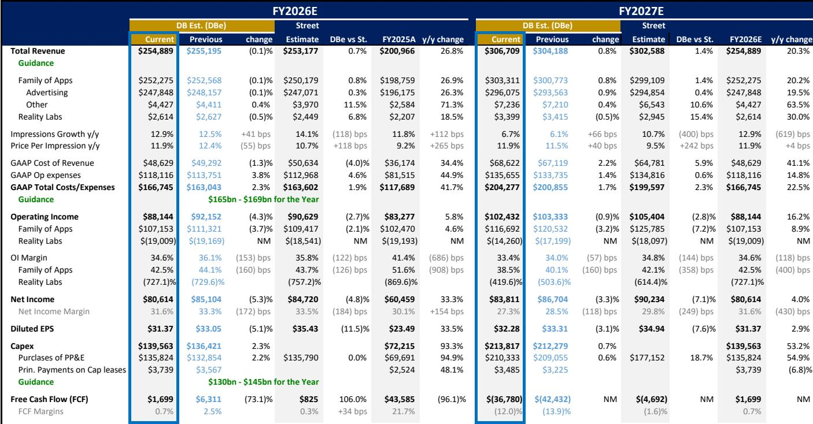
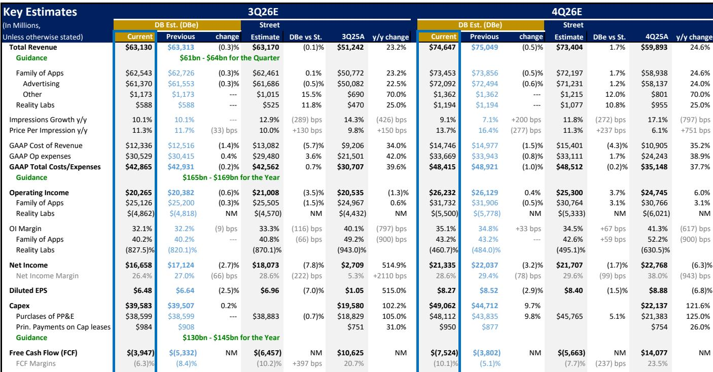
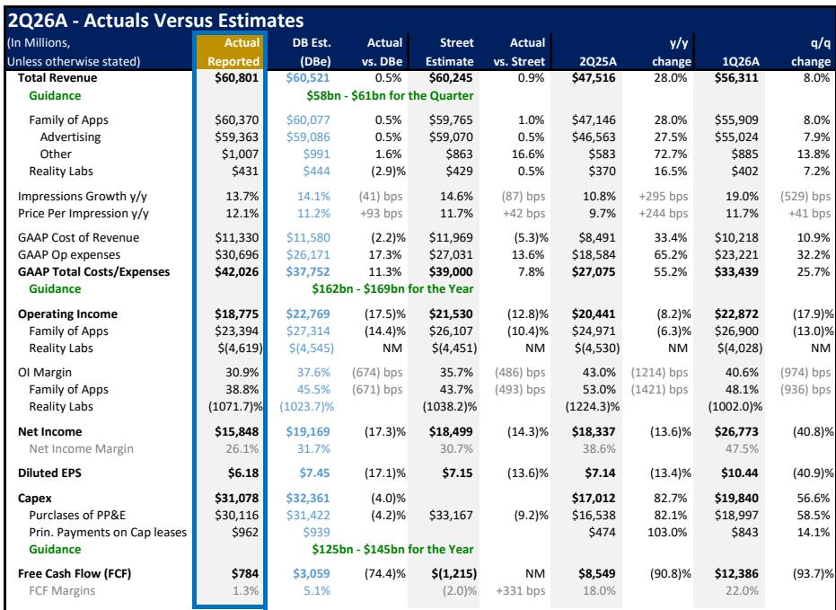

# DB：Meta核心与AI及近期数据观察

Meta二季度财报表面数字显得杂乱，但DB在7月30日发布的研报中给出了一个更清晰的判断：核心业务的盈利能力和增长势头，足以支撑公司正在推进的AI基础设施研究。这份报告的关键不在于季度数字本身，而在于它把Meta的AI战略拆解成了几条可以独立验证的路径。

报告认为，市场对Meta的谨慎反应过度聚焦于近期资本开支，却没有充分计入广告和用户参与度上已经可见的回报。二季度收入同比增长28%至608亿美元，剔除汇率影响后实际上超出了此前指引的高端。三季度收入指引高端为640亿美元，意味着即便面对更难的同比基数，增速节奏变化幅度也不到一个百分点。

## 1. 广告业务增长由AI驱动且已产生可量化回报

Family of Apps广告收入同比增长27%，展示量增长14%，单次广告均价上涨12%。AI同时作用于广告模式的两端：Instagram使用时长实现两位数增长，Facebook视频在美国和加拿大增长超过10%。Advantage+的年化收入运行率已达750亿美元，超过900万家小企业使用至少一种AI创意工具。

报告特别指出，用户理解模型、GEM排序模型和序列学习模型的组合，使Facebook广告点击量提升8.3%，转化率提升15.7%。这些数字说明AI基础设施的回报表现已经开始在广告业务中显现，而不是停留在概念阶段。

> **KC评论：** 广告点击和转化率的提升是判断AI投入是否有效的最直接指标。8.3%和15.7%的增幅来自模型组合的协同效应，而非单一技术突破，这比任何单点优化都更有参考价值。

## 2. 商业代理和付费消息构成新的收入来源

超过100万家企业在WhatsApp和Messenger上每周使用Meta Business Agents，公司计划在2026年下半年开始通过订阅和基于token用量的定价收费。Family of Apps其他收入首次突破10亿美元，同比增长73%，主要由付费消息和订阅驱动。

报告认为，Meta可以利用企业的社交帖子、广告资产、网站、商品目录和CRM数据，创建一站式销售和客服代理，降低独立企业级产品的接入摩擦和获客成本。长期来看，定价可能转向按结果付费，即企业仅在代理促成销售或其他明确成果时付费。

## 3. 算力销售可能在近期成为高利润增量

报告提出了一个市场尚未充分定价的可能性：Meta可能比读者预期的更早出售算力。公司收到的报价是其算力成本的数倍，这既说明算力稀缺性，也说明其组装中的基础设施的市场价值。

报告明确表示，其模型并未计入算力销售的影响，这意味着如果交易发生，将是对现有预测的高利润上行空间。长期来看，Meta认为通过消费者和企业产品出售智能比出售原始算力回报更高，因此合理的顺序是：在市场价格高企时选择性出售算力，同时推进代理、API和软件业务的规模化。

## 4. 基础设施策略区分两个时间窗口并保留灵活性

Meta将基础设施研究分为两个时间维度。2026至2027年，公司针对提到、广告、模型训练、推理和新产品的可见需求最大化产能，第三方云协议提供过渡性算力。2028年及以后，公司正在获取土地、电力、冷却、网络和数据中心基础设施等长期资产，同时保留服务器采购的灵活性。

1GW的El Paso项目体现了这一思路。该园区预计2028年开始上线，BlackRock管理的产品持有80%权益，Meta保留20%并以初始四年期租约承租。这一结构降低了Meta的前期资金需求，但租赁承诺和剩余价值担保仍使Meta承担宏观环境敞口。

## 5. 自研芯片比例提升可能改善2028年后基础设施宏观环境性

报告认为，Meta可能在2028年及以后上线的数据中心中部署更高比例的自研芯片。服务器和加速器占AI数据中心成本的多数，报告估计最高可达60%，因此即使加速器成本或功耗的小幅降低，在多个吉瓦产能上也能显著改善总拥有成本。

Meta可以继续使用Nvidia GPU进行前沿模型训练，同时将提到、广告排序和推理等可预测性较强的工作负载转移到自研加速器上。报告没有将大规模自研芯片收益纳入预测模型，因为产量、工作负载迁移和性能仍需更多证据，但推迟2028年后的服务器采购保留了这一选择权。

> **KC评论：** 自研芯片的价值不在于技术叙事，而在于它同时影响资本开支和运营成本两个维度。报告估计服务器和加速器占AI数据中心成本高达60%，这意味着即使芯片成本降低10%，对多个吉瓦产能的总拥有成本影响也是数量级的。

## 6. 费用指引调整主要反映法律费用而非经营出现变化

Meta将2026年费用指引上调至1650亿至1690亿美元，但低端上调主要反映二季度确认的24亿美元法律费用。当季还包含12亿美元遣散费，剔除这两项后，基础费用展望实际上低于此前区间。5月的裁员应改善2027年成本基础，公司季末员工数超过7.5万人，其中8000名受影响员工预计三季度末基本离开报告口径。

这份报告的价值在于它把Meta的AI故事从单一的基础设施投入叙事，拆解成广告回报、新收入来源、算力销售期权和自研芯片路径四个可以独立验证的维度。核心判断是：核心业务的现金流创造能力（二季度经营现金流319亿美元）足以支撑研究加速，而市场对资本开支的担忧可能低估了这些研究已经产生的回报。

For informational purposes only. Portions may be generated,translated,summarized,or edited with AI assistance based on source materials and may contain omissions or errors. Please verify independently. This is not investment,legal,tax,accounting,or other professional advice.

For informational purposes only. Portions may be generated,translated,summarized,or edited with AI assistance based on source materials and may contain omissions or errors. Please verify independently. This is not investment,legal,tax,accounting,or other professional advice.

