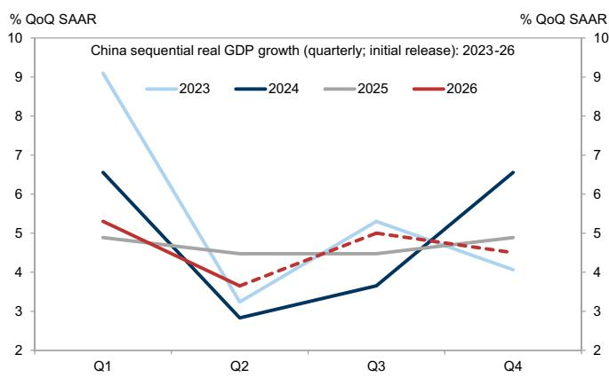
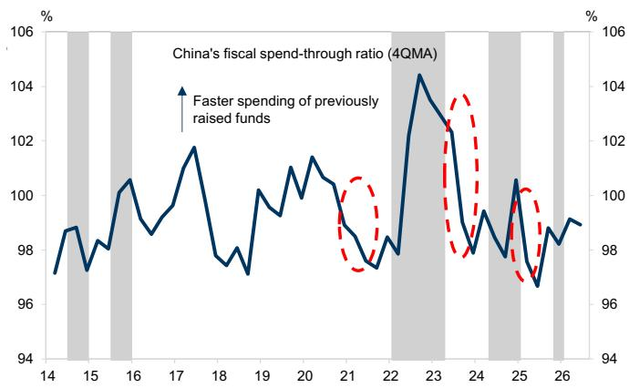
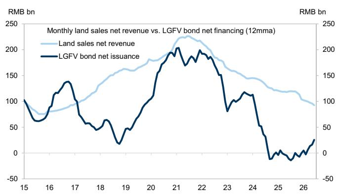
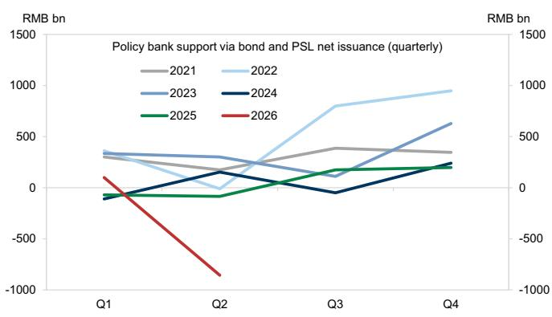
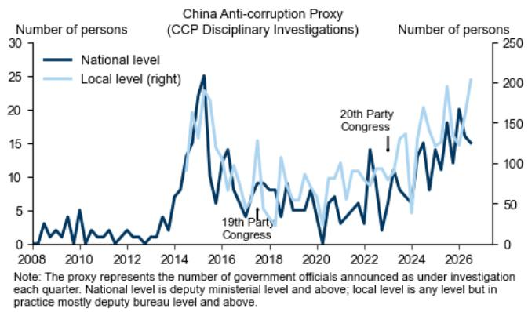
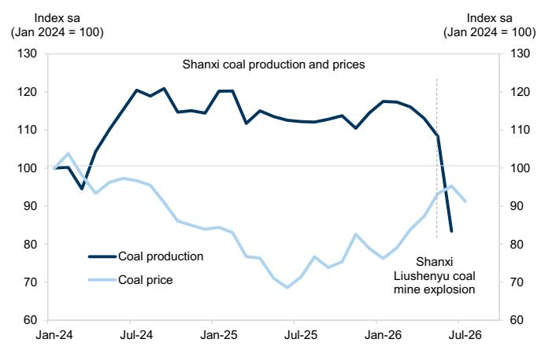
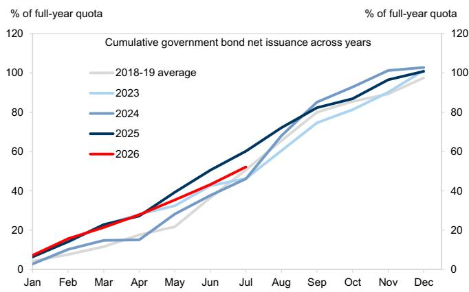
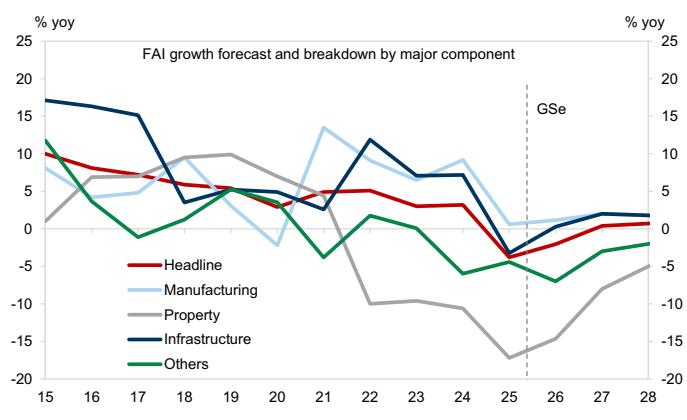
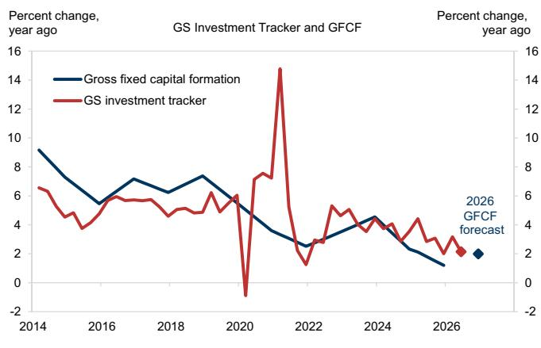

ASIA IN FOCUS

# 中国下半年财政展望：从收紧转向再平衡

自中国走出疫情阶段以来，财政政策已从预防性、全面性的刺激模式，转向更具应对性的“走走停停”式宽松路径，以稳定增长。国内需求仍偏弱，需要持续的政策支持，但政府债务水平较高、资本回报率下降、外部不确定性上升，以及对高技术制造和战略供应链的重视程度提高，使得近年来的政策宽松在规模上更小、时机上更晚、支出上更具针对性，与以往几轮大规模刺激周期形成对比。

王立升
+852-3966-4004 |
lisheng.wang@gs.com
GS（亚洲）有限责任公司

2026年上半年，预算内财政收入同比增长4.7%，高于预算执行进度，而预算外的政府性基金收入则明显落后，主要受土地出让收入同比下降31.5%的拖累。政府支出也明显低于预算目标。政策性银行支持在二季度大幅收缩，地方政府融资平台债券发行依然低迷。我们自建的广义财政赤字指标（AFD）在12个月移动平均基础上，从3月份的近期峰值11.2%收窄至6月份的10.2%。

■ 一季度GDP增长强劲，出口保持韧性，这很可能增强了高层对增长轨迹的信心，也降低了对增量宽松的紧迫感；与此同时，地方官员在政治换届、反腐压力和问责风险下变得更加谨慎。因此，财政脉冲在不利时点转负，而其他冲击也在二季度对增长构成压力。我们估计，负的财政脉冲贡献了二季度实际GDP环比增速放缓的近一半。

我们估计，下半年可用政府融资能力超过8万亿元人民币（相比之下，上半年使用了5.4万亿元），其中包括6.8万亿元未使用的新增政府债券发行额度、8000亿元新增政策性金融工具，以及更高的财政存款。近期的政策信号指向加快使用已规划的宽松措施，但由于4.5-5.0%的增长目标仍可触及，决策者可能认为大规模、全面新增刺激的紧迫性有限，除非增长进一步走弱。

我们预计，中央和地方政府将在未来几个月加快债券发行和资金使用进度，加快落实新增政策性金融工具，并在必要时为今年晚些时候的进一步宽松留出空间。正在实施和计划中的宽松措施仍偏向科技、投资和“高质量发展”，投资支持重点集中在高技术制造、战略供应链、绿色转型、城市更新和“六大网络”项目。

我们近期将2026年AFD预测下调0.5个百分点至GDP的11.5%，并在纳入二季度实际数据后，将2026年固定资本形成总额增长预测从此前的2.5%下调至2.0%。上行风险包括额外的预算外融资和新的需求侧措施，下行风险则包括中央层面的持续自满情绪以及地方执行约束的加剧。

## 中国下半年财政展望：从收紧转向再平衡

## 理解中国“走走停停”的财政宽松模式

自中国走出疫情阶段以来，财政政策已从预防性、全面性的刺激模式，转向更具应对性的“走走停停”式宽松路径，以稳定增长。国内需求仍偏弱，需要持续的政策支持，但政府债务水平较高和资本回报率下降，制约了宽松空间。外部不确定性的上升也促使决策者保留政策能力以应对更不利的情景。与此同时，中美科技竞争提高了支持高技术制造和关键供应链的中长期优先级。这些约束和优先级共同使得近年来的政策宽松在规模上更小、时机上更晚、支出上更具针对性，与以往几轮大规模刺激周期形成对比。

近年来，实际GDP的环比增速往往呈现年内“V型”或“U型”走势：一季度强劲，二季度偏软，必要时下半年追赶（图表1）。除2022年外，近年来的全年GDP增速均达到年度目标¹，但超目标的幅度在收窄。当全年目标在年底前基本无虞时——如2021年、2023年和2025年（主要是2025年上半年）增长超预期——决策者倾向于放慢支出节奏，并将部分资金结转到下一年（图表2）²。以2025年为例，中央和地方政府在12月前已基本完成全年债券发行额度，但财政存款仍显示净增加7000亿元人民币（较2024年末），这部分资金在年底前尚未支出。

图表1：近年来实际GDP环比增速往往呈现“V型”或“U型”走势  
  
国家统计局经常修正历史环比GDP增速。图中我们使用中国最初发布的实际GDP环比增速，因为我们认为其对于同期政策制定比修正后的数据更具参考意义。虚线为GS预测。  
资料来源：国家统计局、Haver Analytics、GS全球投资研究

图表2：当全年增长目标基本无虞时，财政“支出进度”比率往往下降——意味着此前筹集资金的支出速度放缓  
  
阴影区域表示中国年初至今实际GDP增速达到或低于全年目标的时期；圆圈标记近年政府支出放缓的典型阶段。  
资料来源：财政部、Wind、CEIC、GS全球投资研究

## 2026年上半年进展：财政收入超预算进度，支出落后

2026年上半年，预算内财政收入同比增长4.7%（2025年为-1.7%），高于财政部全年预算预测的+2.2%，主要得益于税收收入的明显改善。尽管全球能源供应冲击下的PPI通胀上升提供了支撑，但坊间证据也表明，一些财政紧张的地方政府收税更为积极。相比之下，2026年上半年预算内财政支出仅同比增长1.5%（2025年为+1.0%），远低于全年预算预测的4.4%和财政收入增速。

预算外方面，2026年上半年政府性基金收入同比下降21.6%（2025年为-7.0%），主要受土地出让收入同比下降31.5%（2025年为-14.7%）的拖累，表明全年预算预测的+0.6%增长目标很可能无法实现（图表3）。政府性基金支出在2026年上半年也同比下降16.4%（2025年为+11.3%），二季度同比增速较一季度明显放缓。综合一般公共预算和政府性基金预算，我们估计2026年上半年政府总收入增速从2025年的-2.8%改善至+1.0%，而政府总支出增速从+3.7%放缓至-2.9%。

在隐性政府债务融资渠道中，政策性银行支持在二季度明显减弱，政策性银行债券发行和央行抵押补充贷款均大幅收缩，与往年出现的稳定态势形成对比（图表4）。根据我们GS定义的口径估算，地方政府融资平台债券净融资在2026年上半年较2025年温和回升，但仍远低于2024年之前的水平。综合所有主要的预算内外融资渠道，我们自建的广义财政赤字指标在12个月移动平均基础上，从2025年12月的11.0%小幅扩大至2026年3月的11.2%，随后在2026年6月明显收窄至10.2%。

图表3：2026年上半年土地出让收入持续下降，地方政府融资平台债券净发行虽较2025年小幅改善但仍低迷  
  
我们假设“净”部分占土地出让总收入的30%，其余用于土地收购和再开发。  
资料来源：财政部、Wind、GS全球投资研究汇编数据

图表4：政策性银行支持在二季度大幅收缩，与往年出现的稳定态势形成对比  
  
政策性银行支持包括政策性银行债券净融资和央行PSL投放。  
资料来源：Wind、CEIC、GS全球投资研究

## 二季度财政脉冲转负：中央对增长轨迹的信心与地方执行约束并存

尽管决策者将今年增长目标从此前的“5%左右”下调至“4.5-5.0%”，但一季度实际GDP仍同比增长5.0%，得益于强劲的出口和前置的财政宽松。这可能使高层领导对年初以来的经济表现感到满意，并促使4月政治局会议上的宽松信号有所收敛。二季度政府债券发行和资金使用明显放缓，推动财政脉冲在不利时点转负，而全球能源供应冲击和不利的国内天气状况也对增长构成压力（图表5）。我们估计，负的财政脉冲贡献了二季度实际GDP环比增速放缓（从年化5.3%降至年化3.6%）的近一半。

图表5：二季度增长放缓时财政脉冲转负，我们预计下半年将转正  
  
资料来源：国家统计局、Haver Analytics、GS全球投资研究

图表6：我们构建的中国全国层面反腐代理指标仍处高位，地方层面在2026年二季度升至历史新高  
  
资料来源：中央纪委国家监委、GS全球投资研究汇编数据

今年地方层面的政治换届，为明年党的二十一大做准备，使地方官员比往常更加规避风险。在反腐调查力度加大（图表6）和“正确政绩观”更受重视的背景下，地方官员在启动大型投资项目时采取了更为谨慎的态度，即使资金到位也是如此，尤其是在债务风险较高的欠发达内陆省份。近期发生的重大事件，包括5月山西煤矿爆炸和7月广西严重洪灾，进一步强化了这一谨慎立场，因为额外投资带来的有限GDP增长可能被此类事件带来的问责风险所抵消（图表7）。例如，尽管煤价上涨，山西煤炭产量近几个月大幅下降，因为地方官员在5月严重煤矿爆炸后将安全放在首位，并开展了密集检查（图表8）。

图表7：2026年初以来中国发生的几起重大事件

<table><tr><td rowspan="2">重大事件</td><td rowspan="2">日期</td><td colspan="2">地点</td><td rowspan="2">详情与问责成本</td></tr><tr><td>省份</td><td>市/县</td></tr><tr><td>浏阳烟花厂爆炸</td><td>2026年5月5日</td><td>湖南</td><td>长沙市浏阳市（县级市）</td><td>事件引发国务院调查。一周内，六名地方官员被拘留或停职。</td></tr><tr><td>柳树峪煤矿特别重大瓦斯爆炸</td><td>2026年5月22日</td><td>山西</td><td>长治市沁源县</td><td>矿难被定性为“特别重大”事故，伤亡严重，并导致山西地方和行业层面官员的重大人事调整。</td></tr><tr><td>广西严重洪灾及六兰水库大坝溃坝</td><td>2026年7月初</td><td>广西</td><td>主要为南宁、横州和贵港</td><td>台风“美莎克”带来的暴雨引发严重洪灾，导致7月6日横州六兰水库大坝溃坝。事件引发国务院调查。</td></tr></table>

资料来源：政府网站、媒体报道、GS全球投资研究汇编数据

图表8：当地煤矿爆炸后山西煤炭产量大幅下降  
  
资料来源：Wind、GS全球投资研究汇编数据

## 下半年政府融资能力依然充足

我们估计下半年可用政府融资能力超过8万亿元人民币（相比之下，上半年使用了5.4万亿元）。其中包括截至6月底6.8万亿元未使用的新增政府债券发行额度（占全年11.9万亿元额度的57%；图表9）、今年8000亿元新增政策性金融工具（“新型政策性金融工具”，高于去年的5000亿元），以及财政存款余额同比增加超过4000亿元。

我们还估计，截至2025年底，前几年累积的未使用政府债券发行额度约为1.8万亿元——其中中央政府债券6000亿元、地方政府债券1.2万亿元——在财政部批准的情况下，如有需要可相对容易地动用（过往案例见此处和此处）。决策者还可以要求国有企业增加向预算的利润上缴，如2022年所做的那样。

## 三季度计划中的宽松措施有望加快落地

近期的政策信号指向适度增强的增长导向。7月13日，李强总理在与专家和企业家座谈时要求“加大逆周期调节力度，充分有效用好现有政策，研究储备增量政策”。7月22日，财政部发言人在新闻发布会上承诺合理加快政府资金使用进度，支持已规划政策措施的落地。7月23日，财政部长蓝佛安在《人民日报》撰文，承诺加强实施旨在促进内需的1000亿元财政金融协同政策包（“财政金融协同促内需一揽子政策”；由中央预算出资）。

在刚刚结束的7月政治局会议上，高层领导强化了宽松措辞——承诺“加大逆周期调节力度”，并要求宏观政策“发力提效”。在财政政策方面，会议要求“加快财政支出和债券资金使用进度，大力推动‘两重’项目（指高技术制造和关键供应链等具有战略重要性的投资项目和领域）以及消费品以旧换新和设备更新计划的实施”。

我们预计，中央和地方政府将在未来几个月加快债券发行和资金使用进度，加快落实8000亿元新增政策性金融工具，并在必要时为今年晚些时候的进一步宽松留出空间。在以往宽松倾向较强的年份，决策者通常要求地方政府在9月底前基本完成全年专项债券发行额度（见2022年和2023年的先例）。由于出口仍具韧性，全年4.5-5.0%的增长目标仍可触及（上半年实际GDP同比增长4.7%），决策者可能认为近期大规模、全面刺激的紧迫性有限。我们认为，下半年财政前景更多取决于已规划宽松措施的实施节奏，而非新增刺激的规模，除非增长动能进一步走弱并使全年GDP目标面临风险（图表10）。

图表9：上半年政府完成全年债券发行额度的43%，二季度发行节奏较一季度明显放缓

  
政府债券净发行包括中央和地方政府债券。地方政府用于债务化解的再融资债券发行不包括在内。  
资料来源：Wind、CEIC、GS全球投资研究  
图表10：决策者目前似乎并不急于大幅刺激经济，因为全年增长目标似乎仍在轨道上

  
资料来源：国家统计局、Haver Analytics、GS全球投资研究汇编数据

我们认为，需求侧财政扩张将是稳定增长和市场情绪的关键，而正在实施的宽松措施似乎偏向科技、投资和“高质量发展”（图表11）。与以往几轮大规模宽松周期相比，此次政府支出看起来将偏向高技术制造（如AI基础设施和数字经济）、战略供应链（如粮食、能源和半导体）、绿色转型、民生领域（如城市更新）以及“六大网络”项目（即水网、新型电力网、算力网、新一代通信网、城市地下管网和物流网）。我们认为，这反映了对“新质生产力”更强的政策支持。尽管近期的政策沟通再次强调提振消费，但重点仍主要在供给侧和长期层面，表明短期内增长拉动作用有限。

图表11：正在实施和计划中的政策宽松措施偏向科技、投资和“高质量发展”

<table><tr><td>宽松维度</td><td>2026年宣布的政策措施</td><td>说明</td><td>状态</td><td>对2026年GDP增长的估计影响</td></tr><tr><td rowspan="6">投资</td><td>“两重”战略性重大项目投资</td><td>8000亿元，与去年持平</td><td>进行中</td><td>无</td></tr><tr><td>设备更新计划</td><td>2000亿元，与去年持平</td><td>进行中</td><td>无</td></tr><tr><td>新增政策性金融工具</td><td>8000亿元（比去年多3000亿元），用于战略性重要投资</td><td>待实施</td><td>+50bp *</td></tr><tr><td>财政金融协同专项计划</td><td>1000亿元，用于促进内需（特别是民间投资和居民消费）</td><td>尚不明确</td><td>低于+10bp</td></tr><tr><td>国家级并购基金</td><td>为畅通创投退出、提高投资效率，发改委提到今年将设立国家级并购基金。</td><td>尚不明确</td><td>不适用</td></tr><tr><td>民营企业、科技创新、农业和小微企业再贷款计划</td><td>再贷款额度合计增加2.1万亿元，包括新增1万亿元民营企业计划、新增6000亿元支持科技创新及相关企业债券发行的额度，以及新增5000亿元农业和小微企业额度。各类再贷款利率下调25bp。</td><td>额度增加但尚未充分使用</td><td>不适用</td></tr><tr><td rowspan="4">消费</td><td>消费品以旧换新计划</td><td>2500亿元，比去年少500亿元</td><td>进行中</td><td>-5bp或更小</td></tr><tr><td>全国生育补贴</td><td>3岁以下新生儿每年每孩3600元（与去年持平）</td><td>进行中</td><td>低于+10bp *</td></tr><tr><td>加强社会保障网</td><td>城乡居民基础养老金最低标准每月提高20元（与去年调整一致）</td><td>进行中</td><td>低于+5bp</td></tr><tr><td>利率补贴</td><td>对符合条件的消费和服务业企业贷款利息给予1个百分点的临时财政补贴。</td><td>进行中</td><td>可忽略</td></tr><tr><td rowspan="2">住房</td><td>城市更新</td><td>官方估计“十五五”期间（2026-30年）城市更新总投资将超过15万亿元，即年均3万亿元，高于2023-24年平均2.8万亿元（2025年数据尚未公布）</td><td>进行中</td><td>不适用（部分项目可由“投资”部分中的措施提供资金）</td></tr><tr><td>住房公积金</td><td>拓宽住房公积金使用范围，以降低综合房贷利率，支持其他住房相关支出（如家装、物业费、租金）</td><td>进行中</td><td>不适用</td></tr><tr><td>其他</td><td>地方政府债务化解</td><td>今年计划2.8万亿元（与去年持平）</td><td>进行中</td><td>无</td></tr></table>

\* 部分宽松措施于2025年底推出，部分增长拉动作用落在2026年。  
资料来源：政府网站、GS全球投资研究

## 我们最新的2026年AFD和投资预测

我们近期将2026年全年AFD预测下调0.5个百分点至11.5%（2025年为11.0%），反映了土地出让和政策性银行支持弱于预期，以及税收收入征收强于预期（图表12）。尽管如此，在二季度财政明显收紧之后，我们的预测意味着下半年温和扩张，财政政策重新成为增长动力。纳入上半年实际数据（-31.5%）后，考虑到房地产行业持续调整和开发商融资条件仍然偏紧，我们现在预计今年土地出让收入将下降约20%。与上半年相比，我们预计政策性银行支持将随着新增政策性金融工具的推出而明显回升，而预算内财政支出将在下半年赶上收入进度。

图表12：我们近期将2026年AFD预测下调0.5个百分点至GDP的11.5%

<table><tr><td colspan="2"></td><td>占GDP百分比</td><td>2019</td><td>2020</td><td>2021</td><td>2022</td><td>2023</td><td>2024</td><td>2025</td><td>2026F</td><td>2026F变化</td></tr><tr><td>1</td><td rowspan="4">=3-(2+4)</td><td>官方预算内赤字</td><td>2.8</td><td>3.6</td><td>3.2</td><td>2.8</td><td>3.8</td><td>3.0</td><td>4.0</td><td>4.0</td><td>0.0</td></tr><tr><td>2</td><td>预算收入</td><td>18.9</td><td>17.7</td><td>17.3</td><td>16.5</td><td>16.8</td><td>16.3</td><td>15.4</td><td>15.0</td><td>-0.4</td></tr><tr><td>3</td><td>预算支出</td><td>23.7</td><td>23.7</td><td>20.9</td><td>21.1</td><td>21.2</td><td>21.1</td><td>20.5</td><td>20.1</td><td>-0.4</td></tr><tr><td>4</td><td>财政存款净动用及其他财政账户划转</td><td>2.0</td><td>2.5</td><td>0.5</td><td>1.8</td><td>0.7</td><td>1.8</td><td>1.1</td><td>1.1</td><td>0.0</td></tr><tr><td>5</td><td rowspan="2">=3-2</td><td>有效预算内赤字</td><td>4.8</td><td>6.1</td><td>3.7</td><td>4.6</td><td>4.5</td><td>4.8</td><td>5.1</td><td>5.1</td><td>0.0</td></tr><tr><td>6</td><td>地方政府专项债券</td><td>2.1</td><td>3.5</td><td>2.8</td><td>3.6</td><td>3.0</td><td>3.0</td><td>3.1</td><td>3.1</td><td>0.0</td></tr><tr><td>7</td><td rowspan="3">=8+9</td><td>地方政府融资平台债券和铁路建设债券净发行</td><td>1.3</td><td>2.2</td><td>2.1</td><td>1.0</td><td>1.0</td><td>-0.1</td><td>0.0</td><td>0.4</td><td>0.4</td></tr><tr><td>8</td><td>地方政府融资平台债券净发行</td><td>1.2</td><td>2.2</td><td>2.0</td><td>1.0</td><td>1.0</td><td>0.0</td><td>0.0</td><td>0.3</td><td>0.3</td></tr><tr><td>9</td><td>铁路建设债券净发行</td><td>0.0</td><td>0.1</td><td>0.1</td><td>0.0</td><td>-0.1</td><td>-0.1</td><td>0.0</td><td>0.1</td><td>0.1</td></tr><tr><td>10</td><td rowspan="7">=11+12</td><td>政策性银行支持（含PSL）</td><td>1.3</td><td>2.0</td><td>1.0</td><td>1.7</td><td>1.1</td><td>0.2</td><td>0.2</td><td>0.6</td><td>0.5</td></tr><tr><td>11</td><td>政策性银行债券发行</td><td>1.2</td><td>2.3</td><td>1.4</td><td>1.4</td><td>1.0</td><td>0.8</td><td>1.1</td><td>0.6</td><td>-0.5</td></tr><tr><td>12</td><td>PSL</td><td>0.2</td><td>-0.3</td><td>-0.4</td><td>0.3</td><td>0.1</td><td>-0.7</td><td>-1.0</td><td>0.1</td><td>1.0</td></tr><tr><td>13</td><td>信托贷款</td><td>-0.2</td><td>-0.5</td><td>-0.9</td><td>-0.2</td><td>0.1</td><td>0.1</td><td>0.1</td><td>0.1</td><td>0.0</td></tr><tr><td>14</td><td>土地出让净融资</td><td>2.2</td><td>2.4</td><td>2.2</td><td>1.6</td><td>1.3</td><td>1.1</td><td>0.9</td><td>0.7</td><td>-0.2</td></tr><tr><td>15</td><td>中央政府特别债券</td><td>0.0</td><td>1.0</td><td>0.0</td><td>0.0</td><td>0.0</td><td>0.7</td><td>1.3</td><td>1.1</td><td>-0.2</td></tr><tr><td>16</td><td>地方政府债务化解（置换/再融资/特殊再融资债券）</td><td>0.1</td><td>0.0</td><td>0.2</td><td>0.1</td><td>0.4</td><td>0.7</td><td>0.5</td><td>0.5</td><td>0.0</td></tr><tr><td>17</td><td>=5+6+7+10+13+14+15+16</td><td>广义财政赤字（AFD）</td><td>11.7</td><td>16.6</td><td>11.2</td><td>12.3</td><td>11.3</td><td>10.6</td><td>11.0</td><td>11.5</td><td>0.5</td></tr></table>

资料来源：财政部、CEIC、Haver Analytics、Wind、GS全球投资研究

国家统计局偶尔对先前高报数据进行“统计修正”，可能放大了近几个季度公布的固定资产投资增速波动。纳入弱于预期的上半年实际数据和较低的2026年AFD预测后，我们将2026年固定资产投资增速预测下调4个百分点至-2.0%。这仍意味着较2025年的-3.8%温和改善，且下半年较2026年上半年有所回升，受益于财政宽松和低基数（图表13）。我们还将2026年固定资本形成总额（GDP支出法组成部分）增长预测从此前的2.5%下调至2.0%（2025年为1.2%）。我们自建的投资追踪指标显示，中国实际投资增速从2025年四季度的2.0%回升至2026年一季度的3.2%，随后在二季度回落至2.1%，其波动性远小于近几个季度公布的固定资产投资增速所暗示的水平（图表14）。需要注意的是，我们的投资追踪指标与固定资本形成总额增速大致同步，但自2025年以来一直略高。

我们财政政策和投资展望的风险是双向的。上行方面，决策者可能增加预算外融资，并推出新的需求侧措施以支持投资和消费。下行方面，高层领导对经济表现的持续自满情绪，加上对反腐和财政纪律的更强强调，可能制约进一步宽松或降低其有效性。宏观政策立场频繁的季度间转变，也可能延缓甚至削弱消费者和民营企业家信心的重建。

图表13：纳入弱于预期的上半年实际数据后，我们将2026年固定资产投资增速预测下调至-2.0%  
  
资料来源：CEIC、GS全球投资研究

图表14：我们的投资追踪指标显示，中国实际投资增速二季度较一季度放缓  
  
资料来源：国家统计局、GS全球投资研究

## 王立升

作者感谢亚洲经济团队实习生Samson Yau对本报告的贡献。

## 中国经济团队

Andrew Tilton
+852-2978-1802
andrew.tilton@gs.com
GS（亚洲）有限责任公司

陈新泉
+852-2978-2418
xinquan.chen@gs.com
GS（亚洲）有限责任公司

闪辉
+852-2978-6634
hui.shan@gs.com
GS（亚洲）有限责任公司

杨雨婷
+852-2978-7283
yuting.y.yang@gs.com
GS（亚洲）有限责任公司

王立升
+852-3966-4004
lisheng.wang@gs.com
GS（亚洲）有限责任公司

宋切尔西
+852-2978-0106
chelsea.song@gs.com
GS（亚洲）有限责任公司

## 披露附录

## Reg AC

我，王立升，特此证明本报告中表达的所有观点均准确反映了我个人的观点，且未受到公司业务或客户关系考量的影响。

除非另有说明，本报告封面所列人员均为GS全球投资研究部分析师。

投稿作者：王立升 GS（亚洲）有限责任公司。

除非另有说明，本报告“投稿作者”披露中所列人员均为GS全球投资研究部分析师。

## 披露

## 监管披露

## 美国法律法规要求的披露

有关本报告提及公司的任何以下披露，请参见上述公司特定监管披露：未决交易中的主承销商或联合主承销商；1%或以上的所有权；特定服务的报酬；客户关系类型；以往期间的承销/联合承销公开发行；董事职位；就股票证券而言，做市和/或专家角色。GS交易或可能作为本报告讨论的发行人债务证券（或相关衍生品）的做市商。

以下为额外要求的披露：所有权和重大利益冲突：GS政策禁止其分析师、向分析师汇报的专业人员及其家庭成员持有分析师覆盖范围内的任何公司的证券。分析师薪酬：分析师的薪酬部分基于GS的盈利能力，其中包括投资银行业务收入。分析师作为高管或董事：GS政策通常禁止其分析师、向分析师汇报的人员或其家庭成员在分析师覆盖范围内的任何公司担任高管、董事或顾问。非美国分析师：非美国分析师可能不是GS & Co. LLC的关联人员，因此可能不受FINRA规则2241或FINRA规则2242关于与标的公司沟通、公开露面以及交易分析师所覆盖证券的限制。

## 美国以外司法辖区法律法规要求的额外披露

以下为指定司法辖区要求的披露，但根据美国法律法规已在上述作出的披露除外。澳大利亚：GS Australia Pty Ltd及其关联公司不是澳大利亚的授权存款机构（定义见《1959年银行法》（联邦）），不提供银行服务，也不在澳大利亚开展银行业务。本研究及其任何访问权限仅面向澳大利亚《公司法》含义内的“批发客户”，除非GS另有约定。在撰写研究报告时，GS Australia全球投资研究部的成员可能参加其研究报告所涉公司和其他实体主办或组织的实地考察和其他会议。在某些情况下，如果GS Australia认为在实地考察或会议的具体情况下适当且合理，此类实地考察或会议的部分或全部费用可能由相关发行人承担。如果本文件内容包含任何金融产品建议，则仅为一般性建议，由GS在未考虑客户的目标、财务状况或需求的情况下编制。客户在根据任何此类建议采取行动前，应考虑该建议是否适合其自身的目标、财务状况和需求。某些GS Australia和New Zealand利益披露以及GS澳大利亚卖方研究独立性政策声明的副本可在以下网址获取：https://www.goldmansachs.com/disclosures/australia-new-zealand/index.html。巴西：有关CVM第20号决议的披露信息可在https://www.gs.com/worldwide/brazil/area/gir/index.html获取。如适用，根据CVM第20号决议第20条定义，本研究报告内容的主要负责巴西注册分析师为本报告开头列出的第一作者，除非文末另有说明。加拿大：本信息仅供您参考，在任何情况下均不应被解释为GS & Co. LLC在加拿大为购买证券而进行的广告、要约或招揽。GS & Co. LLC未在加拿大任何司法辖区根据适用的加拿大证券法注册为交易商，通常不允许交易加拿大证券，并可能被禁止在加拿大某些司法辖区销售某些证券和产品。如果您希望在加拿大交易任何加拿大证券或其他产品，请联系GS Canada Inc.（GS Group Inc.的关联公司）或其他注册的加拿大交易商。香港：可应要求从GS（亚洲）有限责任公司获取本研究中提及的所覆盖公司证券的进一步信息。印度：可从GS (India) Securities Private Limited获取本研究中提及的标的公司或公司的进一步信息，研究分析师 - SEBI注册号INH000001493，地址：10th Floor, Ascent-Worli, Sudam Kalu Ahire Marg, Worli, Mumbai-400 025, India，公司识别号U74140MH2006FTC160634，电话+91 22 6616 9000，传真+91 22 6616 9001。GS可能实益拥有本研究报告提及的标的公司1%或以上的证券（该术语定义见印度《1956年证券合约（监管）法》第2(h)条）。SEBI授予的注册和NISM的认证不以任何方式保证中介机构的业绩，也不提供对读者回报的任何保证。GS (India) Securities Private Limited的合规官和读者投诉联系方式、年度合规审计报告副本以及其他相关信息和披露可在以下链接找到：

https://www.goldmansachs.com/worldwide/india/research-analyst。日本：见下文。韩国：本研究及其任何访问权限仅面向《金融服务和资本市场法》含义内的“专业读者”，除非GS另有约定。可从GS（亚洲）有限责任公司首尔分行获取本研究中提及的标的公司或公司的进一步信息。新西兰：GS New Zealand Limited及其关联公司不是新西兰的“注册银行”或“存款接受机构”（定义见《1989年新西兰储备银行法》）。本研究及其任何访问权限面向《2008年金融顾问法》含义内的“批发客户”，除非GS另有约定。某些GS Australia和New Zealand利益披露的副本可在以下网址获取：https://www.goldmansachs.com/disclosures/australia-new-zealand/index.html。俄罗斯：在俄罗斯联邦分发的研究报告不是俄罗斯法律定义的广告，而是不具有产品推广为主要目的的信息和分析，不提供俄罗斯评估活动法律含义内的评估。研究报告不构成俄罗斯法律法规定义的个人化研究交流，不针对特定客户，且未分析客户的财务状况、投资概况或风险概况。GS对客户或任何其他人基于本研究报告可能做出的任何投资决策不承担任何责任。新加坡：GS (Singapore) Pte.（公司编号：198602165W），受新加坡金融管理局监管，接受对本研究的法律责任，如有任何与本研究报告相关的事宜，应与其联系。台湾：本材料仅供参考，未经许可不得转载。读者应仔细考虑自身的投资风险。投资结果由个人读者自行负责。英国：在英国被归类为零售客户的人士（定义见
