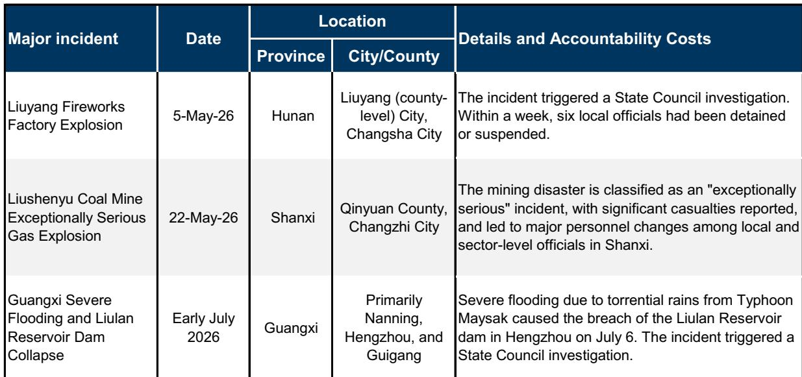
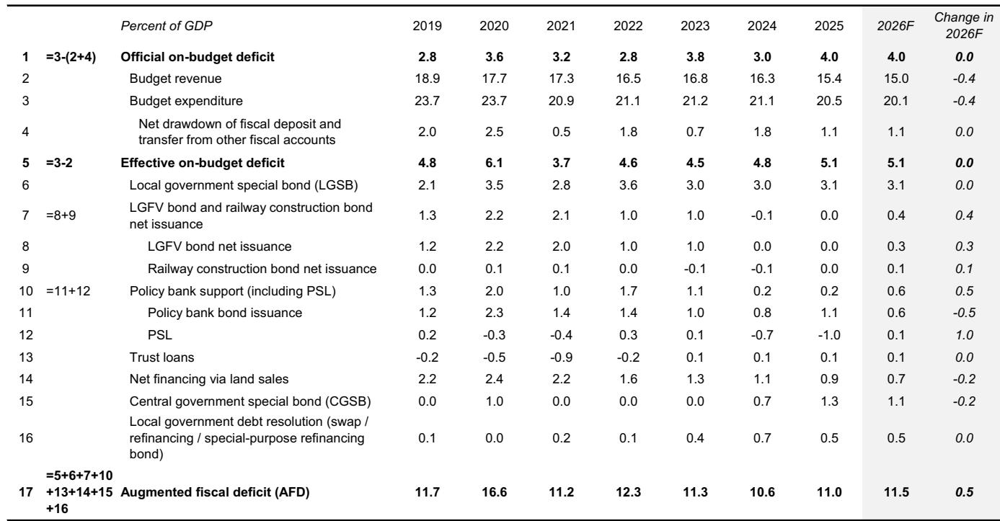
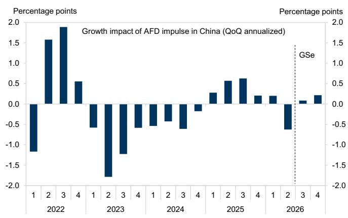

# GS：研究主题与行业变化观察

中国财政政策已逐步调整过往“提前发力、全面刺激”的模式。GS在最新发布的2026年下半年中国财政展望中提出一个核心判断：当前政策处于“走走停停”的宽松节奏中，下半年真正决定增长走向的，不是还有多少新增刺激，而是已规划资金能否按计划落地。

这份报告最值得注意的信号来自上半年的一组反差数据。一般公共预算收入同比增长4.7%，高于全年预算隐含的2.2%增速；但支出仅增长1.5%，明显低于4.4%的预算目标。收入好于预期、支出落后于计划，这种组合在近年并不多见。与此同时，政府性基金收入同比下降21.6%，其中土地出让收入下降31.5%，成为影响广义财政的最大单项因素。

## 1. 财政脉冲在二季度转负，对GDP环比节奏变化贡献近半

GS用自建的广义财政赤字（AFD）指标衡量财政脉冲。该指标在3月达到11.2%的近期高点后，6月收窄至10.2%。财政脉冲转负的时间点并不理想——二季度恰好遭遇全球能源供应冲击和不利天气，增长本身已承受额外不确定性。报告估算，财政脉冲转负对一季度到二季度实际GDP环比增速节奏变化的贡献接近一半。

二季度财政支出节奏变化并非资金不足。GS认为，一季度GDP同比增长5.0%且出口保持韧性，让决策层对增长轨迹感到安心，4月政治局会议后宽松信号有所回撤。地方层面则面临另一重约束：今年是政治换届前的关键年份，加上反腐调查强度处于高位，地方官员在推进大型研究项目时比以往更谨慎。山西煤矿事故后当地煤炭产量大幅下降，即便煤价上涨也未恢复，是这种不确定性规避心态的典型案例。

> **KC评论：** 财政脉冲转负对增长的影响接近一半，这个数字说明二季度增长节奏变化不完全是外部冲击造成的。政策节奏本身就是一个独立的增长变量，而且是一个可以观察、可以预判的变量。

## 2. 下半年可用资金超8万亿元，但花出去需要条件

GS估算，下半年可用的政府融资能力超过8万亿元，上半年实际使用了5.4万亿元。这包括6.8万亿元尚未使用的新增政府债券发行额度（占全年11.9万亿元额度的57%）、今年新增的8000亿元政策性金融工具，以及超过4000亿元的财政存款同比增加。此外，截至2025年底还积累了约1.8万亿元往年未使用的债券额度，经财政部批准后可相对容易地动用。

资金池是充足的，问题在于使用意愿。报告指出，地方官员在“正确政绩观”和问责不确定性下，即使资金到位也更倾向于谨慎行事，尤其是在债务不确定性较高的内陆欠发达省份。这意味着，下半年财政扩张的实际力度，很大程度上取决于中央如何通过考核导向和项目审批来调动地方的执行意愿。

## 3. 三季度是观察支出提速的关键窗口

7月以来的政策信号显示，决策层正在推动已规划措施加快落地。7月13日国务院座谈会提出“加大逆周期调节力度”，7月22日财政部发布会承诺合理加快资金使用，7月政治局会议则要求“宏观政策要发力提效”，并明确加快财政支出和债券资金使用进度。GS预计，中央和地方政府将在未来几个月加快债券发行和资金拨付，8000亿元政策性金融工具也会加速投放。

但报告同时强调，全年4.5%-5.0%的增长目标仍然可达——上半年实际GDP同比增长4.7%——决策层可能并不急于推出大规模新增刺激。在出口保持韧性的情况下，下半年财政前景更多取决于已规划宽松措施的实施节奏，而非新增刺激的规模。历史经验显示，在宽松倾向较强的年份，决策层通常要求地方在9月底前基本完成全年专项债发行额度，2022年和2023年均有先例。三季度能否重现这一节奏，是判断下半年财政力度的最直接观察点。

## 4. 支出结构偏向供给侧，消费刺激仍以长期为主

即使宽松措施全面落地，其结构也值得关注。GS梳理了2026年已宣布和计划中的宽松措施，发现资金投向明显偏向高科技制造业、战略供应链、绿色转型、城市更新和“六大网络”项目。这种配置与“新质生产力”的政策优先级一致，但对短期需求的拉动效果可能有限。

报告特别指出，尽管近期政策沟通再次强调提振消费，但实际措施仍以供给侧和长期为主。1000亿元财政资金协同促内需一揽子政策已经公布，但相对于整体宏观环境规模，其短期增长拉动作用有限。GS据此将2026年广义财政赤字预测下调0.5个百分点至GDP的11.5%，并将固定资产研究增长预测从2.5%下调至2.0%。

> **KC评论：** 观察下半年财政，与其盯着有没有新政策，不如跟踪两个指标：专项债发行进度是否在9月底前接近完成，以及政策性金融工具的实际投放节奏。资金额度是既定的，执行速度才是变量。

这份报告的价值在于提供了一个观察框架：中国财政政策已经从“规模驱动”转向“节奏驱动”。在债务约束和外部不确定性并存的环境下，政策制定者更倾向于保留政策空间，而不是一次性打光子弹。对市场参与者而言，这意味着需要调整对政策信号的解读方式——重要的不是政策声明的力度，而是资金实际流出的速度和方向。

For informational purposes only. Portions may be generated,translated,summarized,or edited with AI assistance based on source materials and may contain omissions or errors. Please verify independently. This is not investment,legal,tax,accounting,or other professional advice.

For informational purposes only. Portions may be generated,translated,summarized,or edited with AI assistance based on source materials and may contain omissions or errors. Please verify independently. This is not investment,legal,tax,accounting,or other professional advice.

