# AI 应用追踪

## 2026年7月：企业应用率升至21.5%

■ 我们更新了截至2026年7月的AI应用追踪数据。

与AI相关的投入增长依然强劲，尤其在半导体领域，行业研究人员预计到2026年底全球收入将达到8340亿美元（年化）。自2022年11月ChatGPT公开发布以来，存储器生产商的收入预期累计上调了1740亿美元（年化）。美国国民经济核算中与AI相关的硬件投入也在持续增长，目前较2022年水平高出4630亿美元（三个月年化均值；占GDP的1.4%）。来自台湾地区的AI相关硬件出货量自2022年以来增长了72%，美国AI硬件净进口在5月份进一步升至557亿美元。

Sarah Dong
+1(212)357-9741 | sarah.dong@gs.com
GS & Co. LLC

Joseph Briggs
+1(212)902-2163 |
joseph.briggs@gs.com
GS & Co. LLC

根据美国人口普查局商业趋势与展望调查（BTOS），企业AI应用率上升0.9个百分点至21.5%（预计未来6个月将进一步升至24.3%）。信息、专业服务和金融类企业继续引领应用趋势。在更细分的行业层面，计算、广播和网络搜索类企业的应用率已达到或超过50%，医疗保健和社会援助类企业则报告了未来六个月最大的预期增幅。员工人数超过250人的企业在应用率方面继续领先（38.3%；最近六次调查均值），且自2月份以来，250人以上企业与10人以下企业之间的应用差距已从13.2个百分点扩大至18.2个百分点。其他商业调查显示，47%的受访美国员工表示其所在组织已采用AI，高于上季度的41%。

AI对劳动力市场的影响仍然可见但范围有限。我们持续观察到在AI应用场景已较为成熟的特定行业中存在就业方面的调整，如市场营销、平面设计、客户服务以及部分技术类岗位。然而，数据中心相关类别的建筑就业增长对此形成了对冲——自2022年以来该类就业增加了29万（相对于更广泛的建筑就业趋势），近期月均增加约1.4万（最近6个月趋势）。技术类岗位在总就业中的占比继续低于2022年之前的趋势水平。AI应用与整体劳动力市场宽松指标之间的相关性仍然有限，但已出现与就业增长和工作时长增长之间存在负相关关系的早期迹象。6月份因AI而被披露的裁员公告涉及1.4万名员工，2026年上半年累计达到10.2万。在2026年第二季度财报电话会议中，25%的罗素3000指数成分公司提及了AI与劳动力相关的关键词。

我们继续观察到，在生成式AI已部署的有限领域中，其对劳动生产率的影响较为显著。学术研究显示平均生产率提升约23%，而企业案例反馈的效率提升幅度略高，约为32%。在官方数据中，AI应用率较高的行业在过去一年中显示出轻微的生产率增长加速迹象。

## 2026年7月：应用率升至21.5%

## AI投入

图表1：半导体公司收入预计到2026年底将升至8340亿美元（年化；对比2022年）
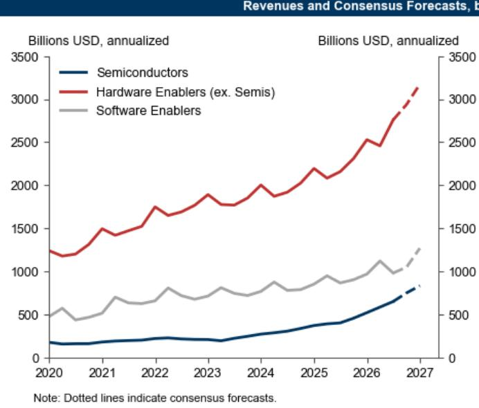
来源：FactSet，GS全球研究

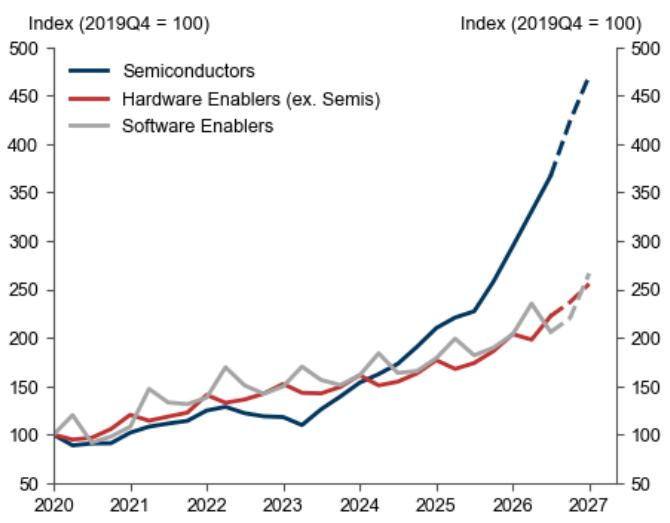
图表2：过去一个月存储器生产商的收入预期修正显著上升

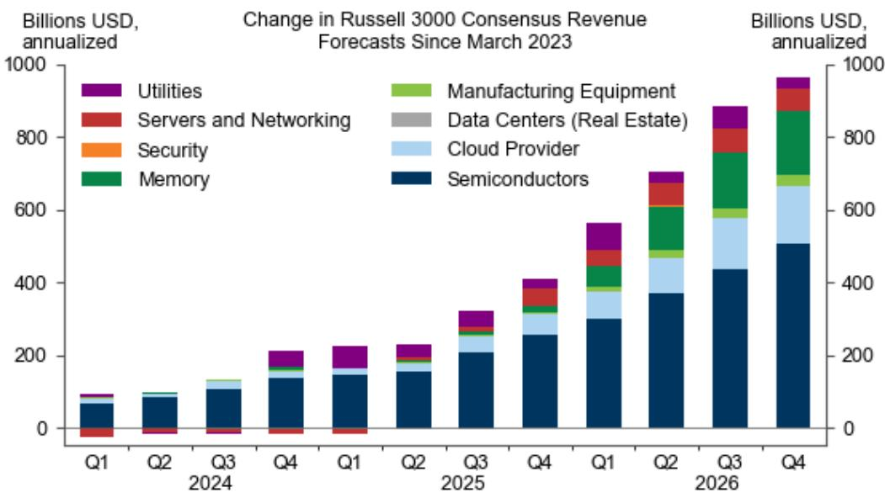
来源：FactSet，GS全球研究

## 图表3：美国国民经济核算中AI硬件投入自2022年以来增加4630亿美元（三个月年化口径）

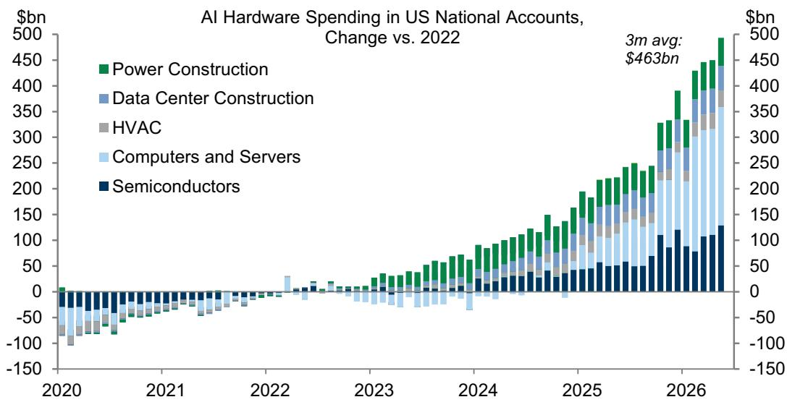
来源：人口普查局、经济分析局、Haver Analytics、GS全球研究

图表4：美国AI相关硬件和软件投入在Q1继续上升
AI相关投入类别：国民经济核算

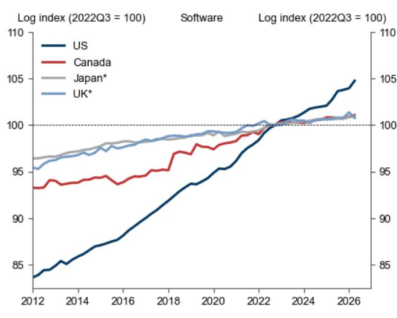
\*知识产权产品类别，包含软件。

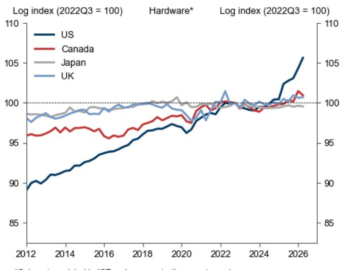
\*与ICT和通信设备相关的类别。
来源：Haver Analytics、GS全球研究

## 图表5：台湾地区AI相关制造业出货量自2022年以来增长72%...

来源：Haver Analytics、GS全球研究

图表6：...美国AI硬件净进口在5月份进一步升至557亿美元
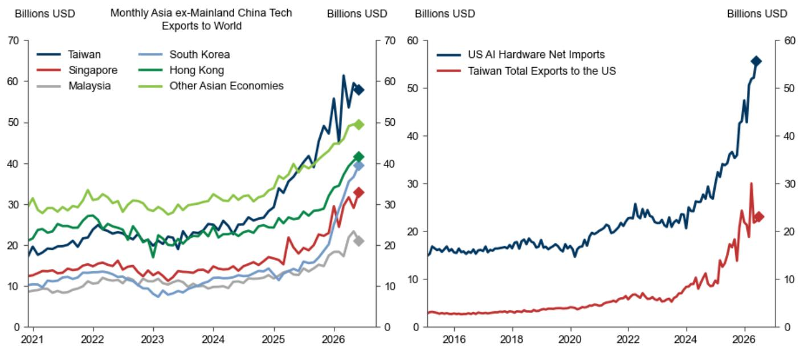
来源：Haver Analytics、GS全球研究

## 企业AI应用

注：美国人口普查局自2025年12月4日发布起，将问题表述从“生产商品和服务”中使用AI调整为“任何业务职能”中使用AI。新问题表述伴随水平变化，我们将继续按新口径追踪应用率。

图表7：21.5%的企业在日常业务职能中使用AI（较6月上升0.9个百分点）；24.3%预计在未来6个月内使用AI

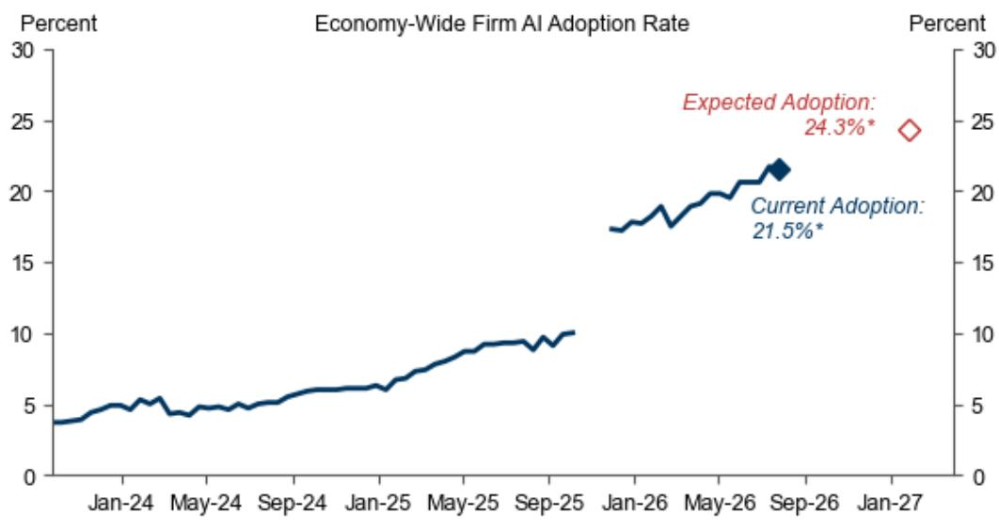
\*2025年12月4日起使用新问题表述。
来源：人口普查局、GS全球研究

## 图表8：多个主要行业的应用率已超过三分之一

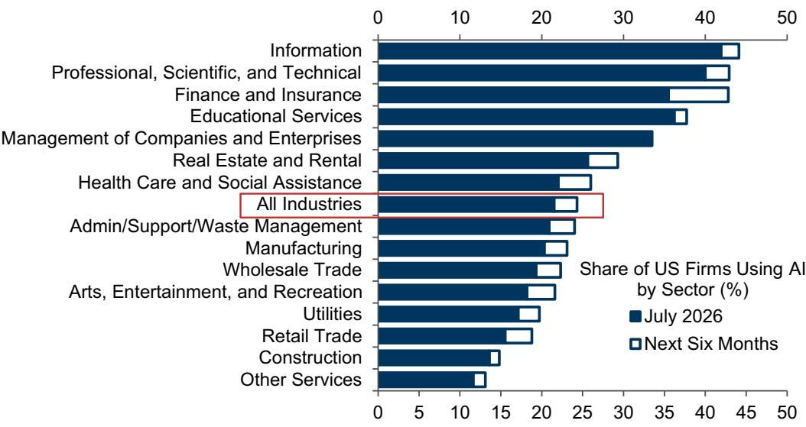
来源：人口普查局、GS全球研究

图表9：公用事业和教育服务类企业自上次更新以来应用率增幅最大

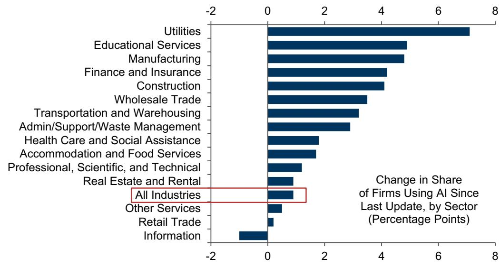
来源：人口普查局、GS全球研究

图表10：计算、网络搜索和广播类企业在细分行业层面继续引领应用

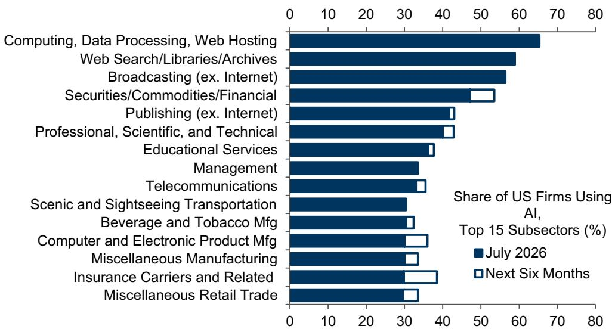
来源：人口普查局、GS全球研究

图表11：杂项医疗保健和社会援助类企业报告未来6个月预期应用增幅最大

来源：人口普查局、GS全球研究

图表12：43%的250人以上大型企业预计在6个月内使用AI
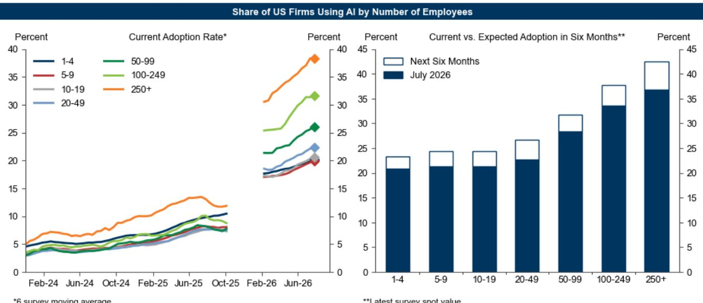
\*6次调查移动均值。
来源：人口普查局、GS全球研究

\*\*最新调查点值。

图表13：AI应用率与我们的细分行业AI自动化敞口评分保持强相关
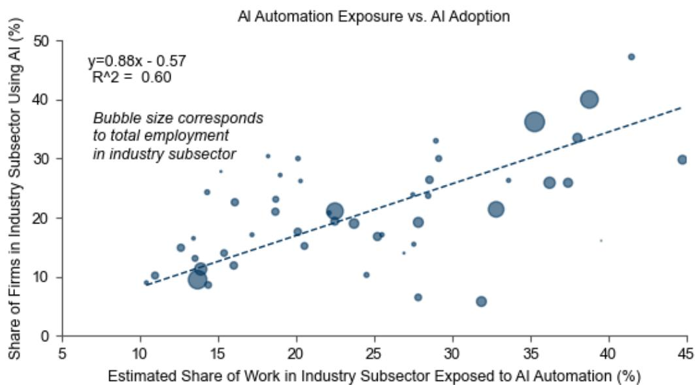
工作内容对AI自动化的敞口占比为GS基于“全球经济学分析：人工智能对经济增长的潜在巨大影响”（2023年3月26日）方法的估算。
来源：人口普查局、GS全球研究

图表14：47%的受访美国员工表示其组织已采用AI，高于上季度的41%

<table><tr><td>来源</td><td>日期</td><td>当前应用/影响</td><td>未来应用/影响</td></tr><tr><td>Gallup</td><td>2026年7月</td><td>Q2中47%的受访美国员工表示其组织已整合AI工具以提升工作场所生产率，高于上季度的41%。个人在工作中使用AI的比例也升至52%。在AI使用者中，最常见的用途为写作和编辑（51%）、搜索或研究（49%）、以及一般辅助或问题解决（39%）。</td><td>最高的生产率评价来自将AI用于编码辅助和自动化/流程自动化的员工。将AI用于更多种类任务的员工也更倾向于报告AI对其个人生产率产生积极影响。尽管企业应用率和AI认知度显著提升，仍有五分之一的员工不确定其组织是否已整合AI。</td></tr><tr><td>WRITER</td><td>2026年4月</td><td>52%的员工表示在过去一年中使用过AI代理。员工报告使用AI工具每周节省约6小时，高管报告节省时间约为其两倍，接近每周12小时。主要使用场景包括编辑和校对、个性化沟通、以及数据分析和洞察。少数受访领导者报告从生成式AI（29%）或AI代理（23%）中获得了显著的投入回报。</td><td>69%的高管表示因AI进行了裁员，但39%承认其公司没有正式的AI收入增长策略。</td></tr><tr><td>哈佛商业评论与Appian</td><td>2026年4月</td><td>大多数组织已超越AI试验阶段，58%的受访组织已将AI投入生产。69%的受访者报告遗留系统限制了其组织扩展AI的能力。大多数受访者从AI投入中获得了一定回报，但仅16%报告实现了较高程度的可衡量价值。</td><td>许多组织正在探索代理式AI系统（62%的受访者正在考虑，25%已在使用）。尽管几乎所有组织都认同需要为AI代理应用设定明确边界，但不到一半表示其组织已制定此类规则。</td></tr><tr><td>Gallup</td><td>2026年4月</td><td>半数受访成年人在工作中使用AI，在已采用AI的组织中，27%的员工表示过去一年工作场所因AI发生了颠覆性变化。65%的采用者表示AI提升了其生产率和效率，无论其个人使用AI的频率如何。</td><td>18%的美国员工表示未来五年内其工作因AI或自动化而被取消的可能性较大或有一定可能。在已采用AI的组织中，这一比例升至23%。然而，已采用AI组织的员工更倾向于同时报告当前的人员扩张和缩减。</td></tr><tr><td>NVIDIA</td><td>2026年3月</td><td>64%的受访者表示其组织正在运营中积极使用AI。28%表示仍处于评估阶段，8%表示未使用AI且无计划。各地区应用率分别为：北美70%、EMEA 65%、APAC 63%。规模较大的公司（员工超过1000人）应用更广泛，部署了更多使用场景，并报告了更高的投入回报。超过半数受访者（53%）表示员工生产率提升是AI对业务运营的最大影响之一。</td><td>86%的受访者表示今年AI预算将增加，近40%表示预算增幅将在10%或以上。受访者报告工作流程和运营、以及保留适当专业能力以扩展AI解决方案是应用的主要挑战。</td></tr><tr><td>Thomson Reuters</td><td>2026年2月</td><td>40%的受访者表示其组织正在使用生成式AI，高于一年前的22%。ChatGPT等公开可用工具仍是最常用的平台。相比之下，仅15%的受访者表示其组织使用代理式AI工具。</td><td>53%的受访者表示其组织正处于代理式AI的规划或考虑阶段。77%的专业人士预计到2030年代理式AI将成为其工作流程的核心部分。</td></tr><tr><td>Deloitte</td><td>2026年1月</td><td>最新调查中，34%的企业开始使用AI深度转型其业务，30%正在围绕AI设计关键流程，其余37%在表层使用AI，底层业务流程变化很小或没有变化。84%的企业尚未围绕AI能力重新设计岗位或工作任务。25%的受访领导者表示AI正在对其组织产生变革性影响，较一年前的12%翻了一倍以上。</td><td>调查结果显示，员工技能不足是将AI整合到现有工作流程中的最大障碍。近四分之三的受访企业预计两年内将至少中度使用代理式AI。</td></tr><tr><td>Gallup</td><td>2025年12月</td><td>每周至少使用几次AI的美国员工比例从2025年Q2的19%上升至Q3的23%。不出所料，知识型岗位（如技术或专业服务）的员工比一线岗位更倾向于使用AI。最常见的使用场景包括使用AI整合信息或数据、创意生成、以及自动化基本任务。用户最常使用AI聊天机器人和虚拟助手。</td><td>Gallup研究表明，员工AI应用与管理层对AI的支持力度以及AI在其岗位中的战略性整合密切相关，表明有效的AI应用需要以人为本的战略方法。</td></tr><tr><td>McKinsey</td><td>2025年11月</td><td>88%的受访组织在至少一项业务职能中定期使用AI，高于去年的78%。然而，大多数受访组织仍处于AI的试验/试点阶段，近三分之二尚未开始在整个企业中扩展AI。39%报告正在试验AI代理，AI代理的使用在TMT和医疗保健企业中最为常见。受访者报告AI在市场营销和销售、战略和企业财务、以及产品开发方面带来了最大的收入效益。多数受访者表示过去一年中AI使用对员工人数的影响很小或没有变化。</td><td>32%的受访者预计因AI使用将整体裁员3%或以上，规模较大的组织更倾向于预期裁员。不准确是AI相关风险中最常遇到的，也是组织未来优先应对的首要问题。</td></tr><tr><td>沃顿商学院人机交互研究与GBK Collective</td><td>2025年10月</td><td>企业领导者中生成式AI的使用率今年大幅上升，达到46%（同比+17个百分点）。最常见的使用场景包括数据分析、文档摘要、以及文档编辑/写作。近四分之三已看到生成式AI的积极投入回报，五分之四预计在两到三年内获得积极回报。年收入超过20亿美元的大型企业更倾向于报告“为时尚早”而无法衡量其AI举措的生产率成果，因为它们正在应对整合的复杂性。</td><td>88%的受访企业领导者预计未来12个月其组织的AI支出将增加（同比+16个百分点）。其中11%通过削减其他领域的支出来为AI提供资金，重新分配最常来自传统IT和人力资源项目。</td></tr></table>

绿色底纹表示自上次更新以来新增的调查。

图表16：AI与失业率或就业增长之间仍无统计学显著关系

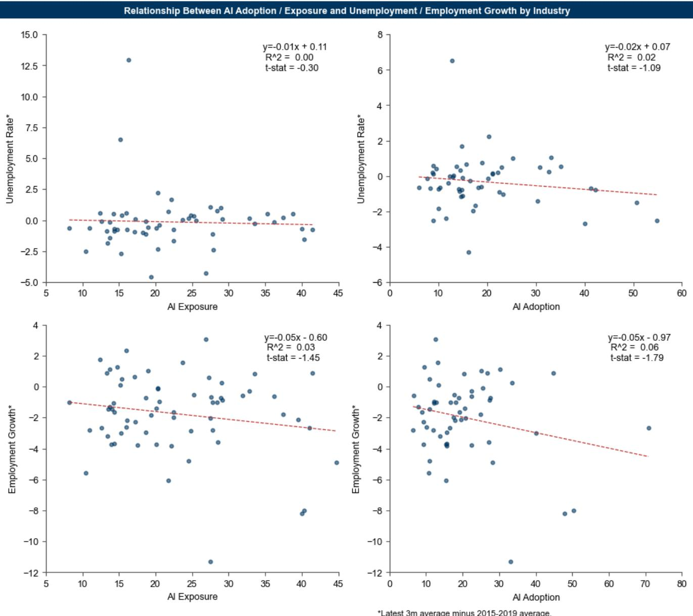
来源：美国劳工统计局、IPUMS、GS全球研究

图表17：在案例表明AI正在产生影响的职业（特别是技术类）中，就业增长继续低于趋势水平，但多个受影响的非技术行业的就业似乎正在趋稳

同比薪资增长相对2015-2019年趋势的偏离

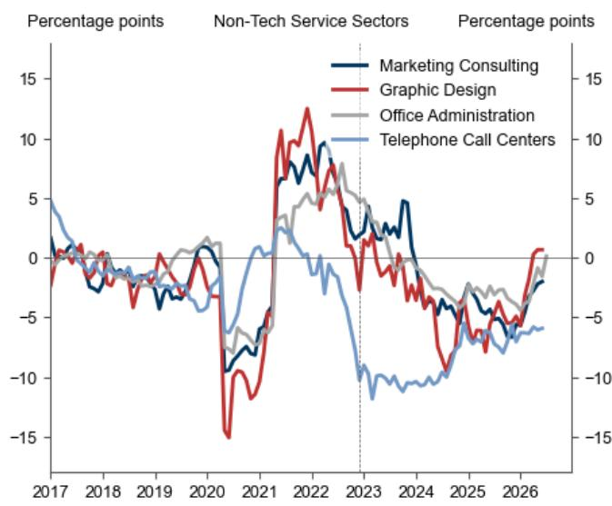
来源：美国劳工统计局、Haver Analytics、GS全球研究

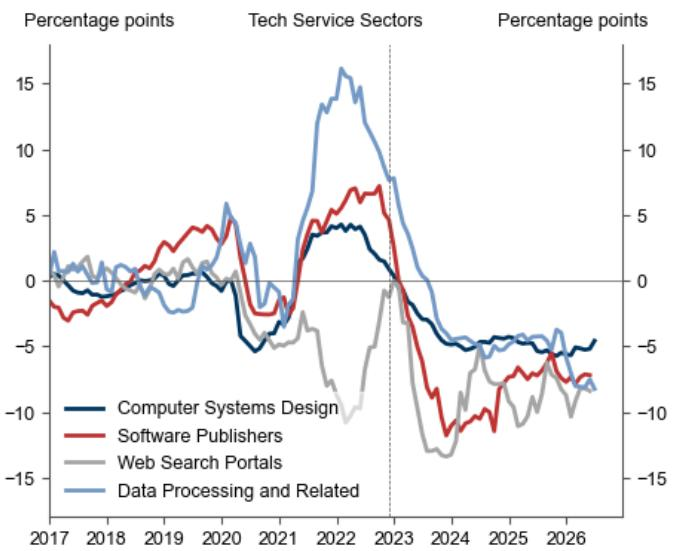

图表18：总体而言，我们估计AI受影响行业的增长拖累仅为-1k

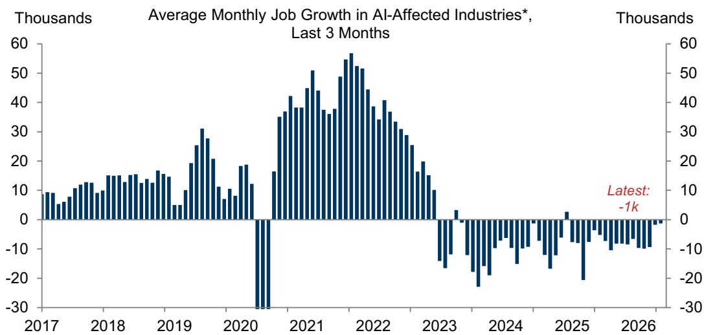
\*管理咨询、平面设计、办公室行政、电话呼叫中心、计算机系统、软件出版商、网络搜索、数据处理、电影制作、广播、出版、文档准备服务。

来源：美国劳工统计局、GS全球研究

图表19：技术类就业占比继续低于其长期趋势
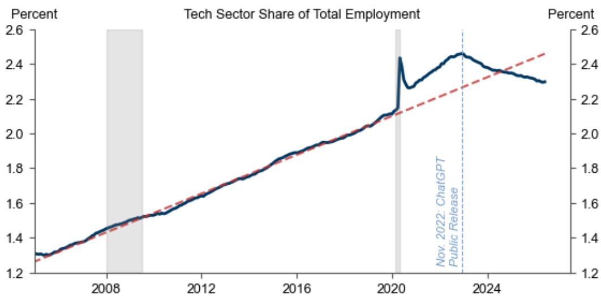
注：技术类指软件出版商、数据处理及相关、网络搜索及相关、以及计算机系统设计子行业。红线代表2007-2019年趋势。
来源：美国劳工统计局、Haver Analytics、GS全球研究

图表20：年轻技术工人的失业率已回落至与全体技术工人一致的水平
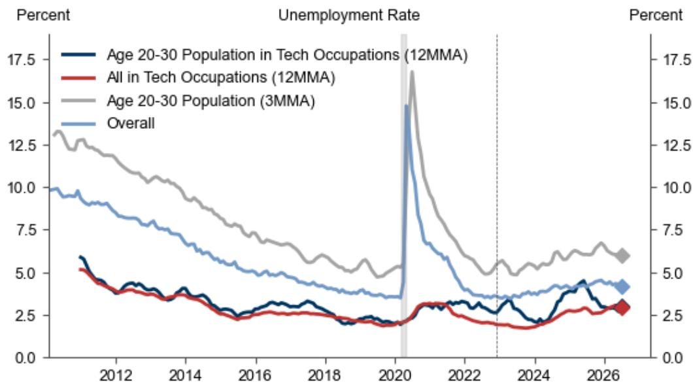
来源：美国劳工统计局、IPUMS、GS全球研究

\*最近6个月均值。气泡大小对应行业总就业人数。

图表21：我们继续观察到AI应用率与年轻工人失业率之间存在轻微正相关

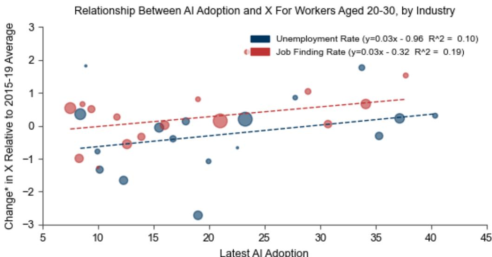
来源：IPUMS、美国劳工统计局、人口普查局、GS全球研究

图表22：6月份裁员公告中提及AI的涉及1.4万名员工
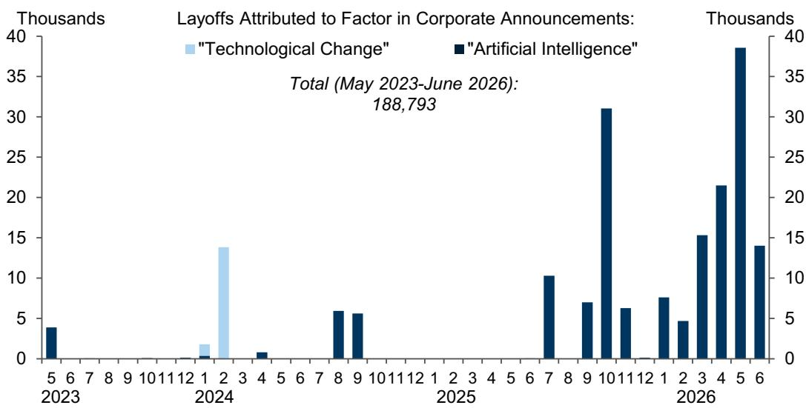
来源：Challenger, Gray & Christmas、GS全球研究

劳动力需求
图表23：美国活跃AI相关职位发布已超过8万个
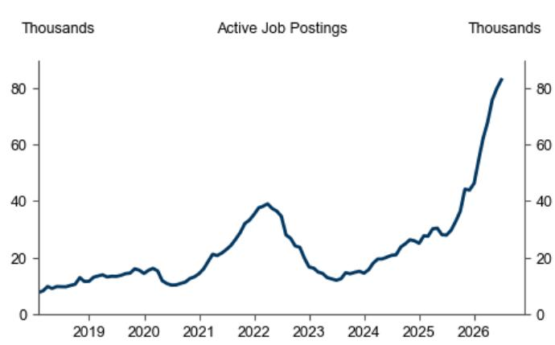

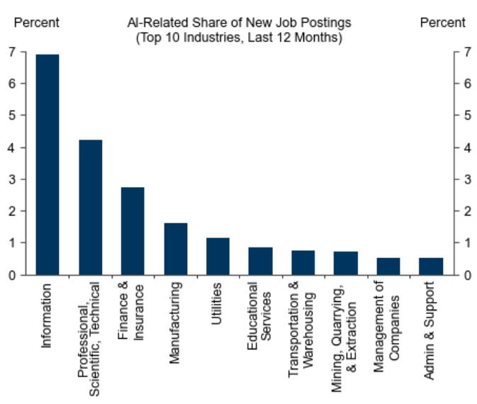
来源：马里兰大学、LinkUp、GS全球研究

图表24：大多数发达市场中AI相关职位发布占比上升，英国上月加速尤为明显
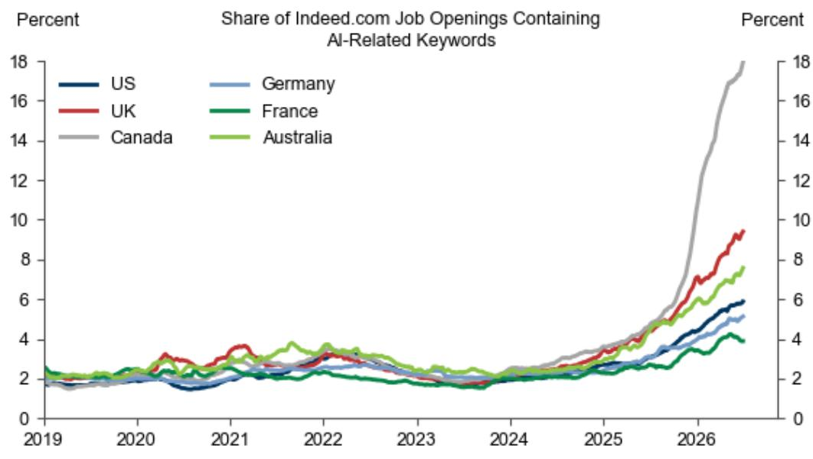
来源：Indeed Hiring Lab、GS全球研究

图表25：数据中心相关类别的建筑就业自2022年以来增加+29万，近几个月温和加速

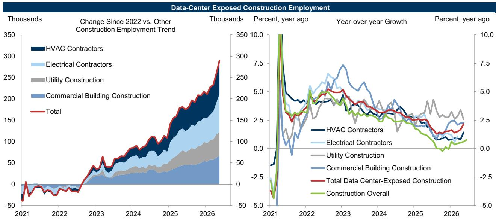
来源：美国劳工统计局、Haver Analytics、GS全球研究

## 图表26：25%的罗素3000指数公司在2026Q2财报电话会议中提及AI和劳动力相关关键词

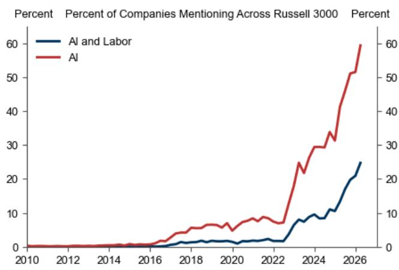
来源：GS Data Works、GS全球研究

企业财报电话会议中AI与劳动力的提及情况

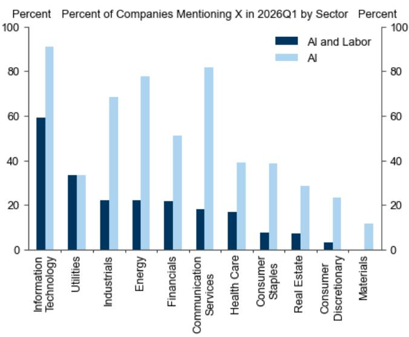

## AI对生产率的影响

图表27：学术研究证据表明AI应用平均提升劳动生产率约23%...

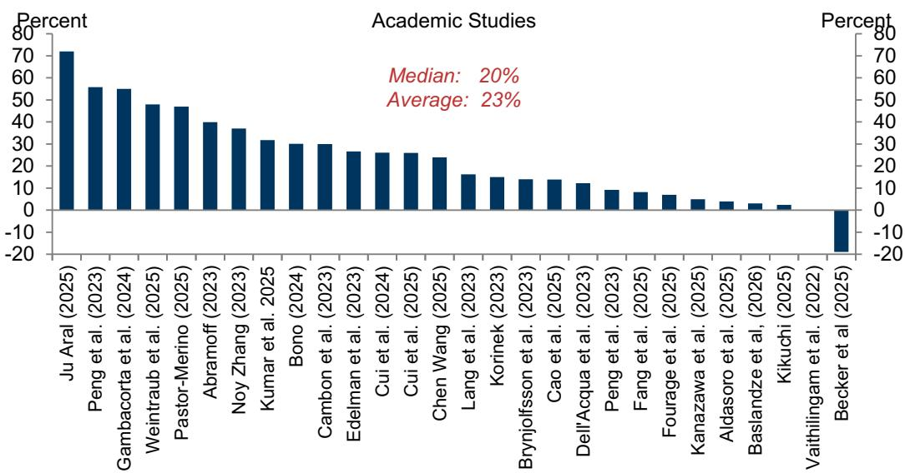
来源：GS全球研究

图表28：...企业案例反馈的平均生产率提升为32%
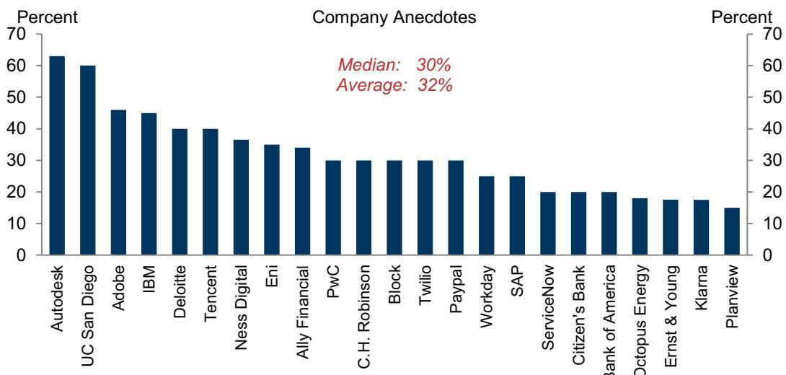
来源：企业数据、GS全球研究汇编

## 图表29：应用率较高的行业继续显示出略强的生产率增长

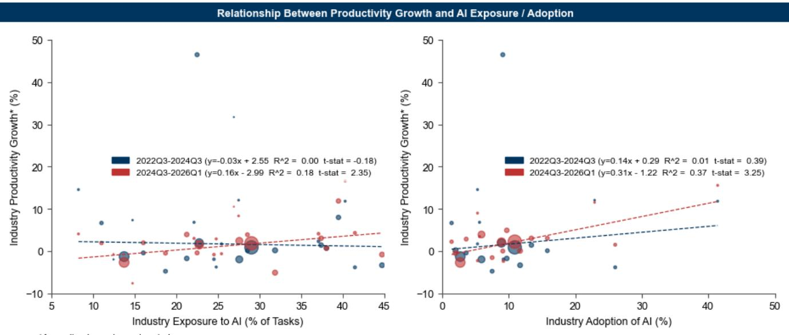
注：气泡大小对应行业总就业人数。
来源：美国劳工统计局、经济分析局、Haver Analytics、GS全球研究

图表30：企业层面AI敞口与利润率增长之间无显著关系
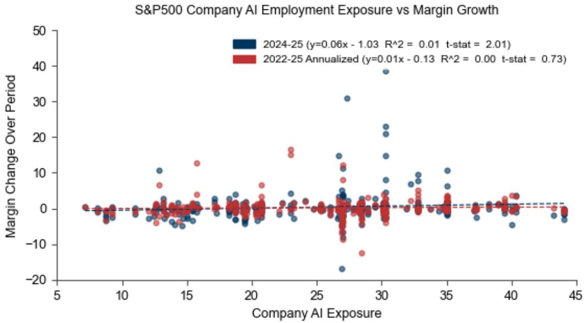
来源：FactSet、GS全球研究

## GS最新AI研究

信用笔记：超大规模企业债务发行的预期：自上而下的方法，7月27日

全球市场评论：区分AI风险——蛋糕的大小与份额，7月23日

全球市场日报：AI相关债务发行：规模与范围的界定，7月21日

美洲科技：软件：重新审视护城河VI——AI支出与安全AI支出之间的滞后；以及何时寻找拐点，7月21日

全球经济评论：AI通胀：美国被大幅低估的贡献，其他地区影响有限，7月9日

■ 中国AI模型导航：LLM入门：全球扩散的关键智能节点，7月9日

往季研究请参见我们发布门户上的人工智能页面。

全球经济团队

Jan Hatzius
+1(212)902-0394
jan.hatzius@gs.com
GS & Co. LLC

Joseph Briggs
+1(212)902-2163
joseph.briggs@gs.com
GS & Co. LLC

Megan Peters

Sarah Dong
+1(212)357-9741
sarah.dong@gs.com
GS & Co. LLC

+44(20)7051-2058

megan.l.peters@gs.com

GS International

## 披露附录

## Reg AC

我们，Sarah Dong和Joseph Briggs，特此证明本报告中表达的所有观点准确反映了我们的个人观点，未受公司业务或客户关系的影响。

除非另有说明，本报告封面所列人员均为GS全球投资研究部分析师。

撰稿作者：Sarah Dong GS & Co. LLC、Joseph Briggs GS & Co. LLC。

除非另有说明，本报告撰稿作者披露中所列人员均为GS全球投资研究部分析师。

## 披露

## 监管披露

## 美国法律法规要求的披露

有关本报告提及公司的任何以下披露，请参见上述公司特定监管披露：未决交易中的主承销商或联合主承销商；1%或以上的所有权；特定服务的报酬；客户关系类型；以往期间的承销/联合承销公开发行；董事职位；就股票证券而言，做市和/或专业角色。GS交易或可能以主体身份交易本报告所讨论发行人的债务证券（或相关衍生品）。

以下为额外要求的披露：所有权和重大利益冲突：GS政策禁止其分析师、向分析师汇报的专业人员及其家庭成员持有分析师覆盖范围内任何公司的证券。分析师薪酬：分析师的薪酬部分基于GS的盈利能力，其中包括投资银行业务收入。分析师作为高管或董事：GS政策通常禁止其分析师、向分析师汇报的人员或其家庭成员在分析师覆盖范围内的任何公司担任高管、董事或顾问。非美国分析师：非美国分析师可能不是GS & Co. LLC的关联人员，因此可能不受FINRA规则2241或FINRA规则2242关于与标的公司沟通、公开露面以及交易分析师所覆盖证券的限制。

## 美国以外司法管辖区法律法规要求的额外披露

以下为指定司法管辖区要求的披露，但已根据美国法律法规在上文作出的披露除外。澳大利亚：GS Australia Pty Ltd及其关联公司不是澳大利亚的授权存款机构（该术语定义见《1959年银行法》（联邦）），不提供银行服务，也不在澳大利亚开展银行业务。除非GS另有约定，本研究及其任何访问权限仅面向澳大利亚《公司法》含义内的“批发客户”。在撰写研究报告时，GS Australia全球投资研究部的成员可能参加其研究报告所涉公司和其他实体的实地考察和其他会议。在某些情况下，如果GS Australia认为在实地考察或会议的具体情况下适当且合理，此类实地考察或会议的部分或全部费用可能由相关发行人承担。如果本文件内容包含任何金融产品建议，则仅为一般性建议，由GS在未考虑客户的目标、财务状况或需求的情况下编制。客户在根据任何此类建议采取行动前，应考虑该建议是否适合其自身的目标、财务状况和需求。GS Australia和New Zealand的某些利益披露副本以及GS澳大利亚卖方研究独立性政策声明副本可在以下网址获取：https://www.goldmansachs.com/disclosures/australia-new-zealand/index.html。巴西：与CVM Resolution n. 20相关的披露信息可在https://www.gs.com/worldwide/brazil/area/gir/index.html获取。在适用情况下，根据CVM Resolution n. 20第20条定义的、主要负责本研究报告内容的巴西注册分析师为本报告开头列出的第一作者，除非文末另有说明。加拿大：本信息仅供您参考，在任何情况下均不应被解释为GS & Co. LLC在加拿大为购买证券而进行的广告、要约或招揽。GS & Co. LLC未在加拿大任何司法管辖区根据适用的加拿大证券法注册为交易商，通常不被允许交易加拿大证券，并可能被禁止在加拿大的某些司法管辖区销售某些证券和产品。如果您希望在加拿大交易任何加拿大证券或其他产品，请联系GS Canada Inc.（The GS Group Inc.的关联公司）或其他注册的加拿大交易商。香港：可应要求从GS (Asia) L.L.C.获取本研究中提及的所覆盖公司证券的进一步信息。印度：可从GS (India) Securities Private Limited获取本研究中提及的标的公司或公司的进一步信息，SEBI注册号INH000001493，地址：10th Floor, Ascent-Worli, Sudam Kalu Ahire Marg, Worli, Mumbai-400 025, India，公司识别号U74140MH2006FTC160634，电话+91 22 6616 9000，传真+91 22 6616 9001。GS可能实益拥有本研究报告所提及的标的公司或公司1%或以上的证券（该术语定义见印度《1956年证券合约（监管）法》第2(h)条）。SEBI颁发的注册和NISM的认证不以任何方式保证中介机构的业绩或向读者提供任何回报保证。GS (India) Securities Private Limited的合规官和读者投诉联系方式、年度合规审计报告副本以及其他相关信息和披露可在以下链接找到：

https://www.goldmansachs.com/worldwide/india/research-analyst。日本：见下文。韩国：除非GS另有约定，本研究及其任何访问权限仅面向《金融服务和资本市场法》含义内的“专业读者”。可从GS (Asia) L.L.C.首尔分行获取本研究中提及的标的公司或公司的进一步信息。新西兰：GS New Zealand Limited及其关联公司不是新西兰的“注册银行”或“存款接受者”（定义见《1988年新西兰储备银行法》）。除非GS另有约定，本研究及其任何访问权限仅面向“批发客户”（定义见《2008年金融顾问法》）。GS Australia和New Zealand的某些利益披露副本可在以下网址获取：https://www.goldmansachs.com/disclosures/australia-new-zealand/index.html。俄罗斯：在俄罗斯联邦分发的研究报告不是俄罗斯立法所定义的广告，而是信息和分析，不以产品推广为主要目的，不提供俄罗斯评估活动立法含义内的评估。研究报告不构成俄罗斯法律法规定义的个人化研究交流，不针对特定客户，且未分析客户的财务状况、投资概况或风险概况。GS不对客户或任何其他人基于本研究报告可能做出的任何投资决策承担责任。新加坡：GS (Singapore) Pte.（公司编号：198602165W），受新加坡金融管理局监管，对本研究承担法律责任，如有与本研究报告相关的事宜，应与其联系。台湾：本材料仅供参考，未经许可不得转载。读者应谨慎考虑自身投资风险。投资结果由个人读者自行负责。英国：在英国被归类为零售客户的个人（该术语定义见金融行为监管局规则）应结合先前GS关于本报告所涉公司的研究阅读本研究，并应参阅GS International已发送给他们的风险警告。这些风险警告的副本以及本报告中使用的某些金融术语的词汇表可应要求从GS International获取。

欧盟和英国：与欧洲委员会授权条例(EU) (2016/958)第6(2)条相关的披露信息（包括该授权条例在英国退出欧盟和欧洲经济区后转化为英国国内法律和法规的情况），涉及研究交流或其他建议或暗示投资策略的信息的客观呈现技术安排以及特定利益或利益冲突迹象的披露，可在https://www.gs.com/disclosures/europeanpolicy.html获取，该页面陈述了与投资研究相关的利益冲突管理欧洲政策。

日本：GS Japan Co., Ltd.是在关东财务局注册的金融工具交易商，注册号Kinsho 69，是日本证券业协会、日本金融期货协会、日本第二类金融工具交易商协会和日本投资管理协会的会员。股票买卖需支付与客户预先确定的佣金外加消费税。有关日本证券交易所、日本证券业协会或日本证券金融公司要求的任何适用披露，请参见公司特定披露。

## 全球产品；分发实体

GS全球投资研究在全球范围内为GS客户制作和分发研究产品。GS全球各办事处的分析师对行业和公司、以及宏观经济、货币、大宗商品和投资组合策略进行研究。本研究由以下机构分发：澳大利亚由GS Australia Pty Ltd（ABN 21 006 797 897）；巴西由GS do Brasil Corretora de Títulos e Valores Mobiliários S.A.；GS巴西公共沟通渠道：0800 727 5764和/或contatogoldmanbrasil@gs.com。工作日（节假日除外），上午9点至下午6点。Canal de Comunicação com o Público GS Brasil: 0800 727 5764 e/ou contatogoldmanbrasil@gs.com. Horário de funcionamento: segunda-feira à sexta-feira (exceto feriados), das 9h às 18h；加拿大由GS & Co. LLC；香港由GS (Asia) L.L.C.；印度由GS (India) Securities Private Ltd.；日本由GS Japan Co., Ltd.；韩国由GS (Asia) L.L.C.首尔分行；新西兰由GS New Zealand Limited；俄罗斯由OOO GS；新加坡由GS (Singapore) Pte.（公司编号：198602165W）；美国由GS & Co. LLC。GS International已批准本研究在英国的分发。

GS International（“GSI”），由审慎监管局（“PRA”）授权并由金融行为监管局（“FCA”）和PRA监管，已批准本研究在英国的分发。

欧洲经济区：GS Bank Europe SE（“GSBE”）是一家在德国注册的信贷机构，在单一监管机制下受欧洲中央银行直接审慎监管，在其他方面受德国联邦金融监管局（Bundesanstalt für Finanzdienstleistungsaufsicht，BaFin）和德意志联邦银行监管，并在欧洲经济区内分发研究。

## 一般披露

本研究仅供我们的客户使用。除与GS相关的披露外，本研究基于我们认为可靠的当前公开信息，但我们不保证其准确或完整，也不应依赖于此。本文所含信息、观点、估计和预测截至本文日期，如有变更恕不另行通知。我们力求适时更新我们的研究，但各种法规可能阻止我们这样做。除定期发布的某些行业报告外，大多数报告根据分析师的判断不定期发布。

GS开展全球全方位服务的综合投资银行、投资管理和经纪业务。我们与全球投资研究所覆盖的相当大比例的公司存在投资银行和其他业务关系。GS & Co. LLC是美国经纪交易商，是SIPC的成员（https://www.sipc.org）。

我们的销售人员、交易员和其他专业人员可能向我们的客户和自营交易台提供口头或书面的市场评论或交易策略，反映与本研究中表达的观点相反的观点。我们的资产管理部、自营交易台和投资业务可能做出与本研究中表达的建议或观点不一致的投资决策。

我们及我们的关联公司、高管、董事和员工将不时持有本研究提及的证券或衍生品（如有）的多头或空头头寸、以主体身份进行交易、以及买入或卖出，除非法规或GS政策另有禁止。

在GS安排的会议上由第三方演讲者（包括来自GS其他部门的个人）表达的观点不一定反映全球投资研究的观点，也不是GS的官方观点。

本文引用的任何第三方，包括任何销售人员、交易员和其他专业人员或其家庭成员，可能持有与本报告署名分析师所表达观点不一致的所提及产品的头寸。

本研究侧重于跨市场、行业和板块的投资主题。它不试图区分我们所描述的任何行业或板块内个别公司的前景或表现，也不提供对个别公司的分析。

本研究中与股票或信用证券或行业或板块内证券相关的任何交易建议反映了所讨论的投资主题，不是对任何此类证券的孤立建议。

本研究不构成在任何司法管辖区出售或招揽购买任何证券的要约，在该等要约或招揽为非法的司法管辖区不适用。它不构成个人建议，也未考虑个别客户的具体投资目标、财务状况或需求。客户应考虑本研究中的任何建议或推荐是否适合其特定情况，并在适当时寻求专业建议，包括税务建议。本研究中提及的投资的价格和价值及其收入可能会波动。过往表现不是未来表现的指引，未来回报不保证，可能发生原始资本损失。汇率波动可能对某些投资的价值或价格、或收入产生不利影响。

某些交易，包括涉及期货、期权和其他衍生品的交易，具有重大风险，不适合所有读者。读者应查阅当前期权和期货披露文件，可从GS销售代表或https://www.theocc.com/about/publications/character-risks.jsp和https://www.goldmansachs.com/disclosures/cftc\_fcm\_disclosures获取。期权策略中要求多次买入和卖出期权（如价差）的交易成本可能很高。支持文件将应要求提供。

全球投资研究提供的不同服务级别：GS全球投资研究向您提供的服务级别和类型可能与向GS内部和其他外部客户提供的服务有所不同，取决于各种因素，包括您对接收沟通频率和方式的个人偏好、您的风险概况和投资重点和视角（如全市场、特定板块、长期、短期）、您与GS的整体客户关系的规模和范围、以及法律和监管限制。

例如，某些客户可能要求在特定证券的研究发布时收到通知，某些客户可能要求将分析师基本面分析的特定基础数据通过数据源或其他方式以电子方式传送给他们。分析师基本面研究观点的任何变更（如评级、目标价或股票证券盈利预测的重大变化）不会在任何客户之前传达，而是包含在通过电子发布到我们内部客户网站或其他必要方式广泛分发给所有有权接收此类报告的研究报告中。

所有研究报告通过电子发布到我们内部客户网站同时向所有客户分发。并非所有研究内容都会重新分发给我们的客户或提供给第三方聚合商，GS也不对第三方聚合商重新分发我们的研究负责。对于可能与一个或多个证券、市场或资产类别相关的研究、模型或其他数据（包括相关服务），请联系您的GS代表或访问https://research.gs.com。

披露信息也可在https://www.gs.com/research/hedge.html或联系研究合规部，地址：200 West Street, New York, NY 10282。

## © 2026 GS。

您仅可为本人的使用目的存储、展示、分析、修改、重新格式化并打印通过本服务提供给您的信息。未经GS明确书面同意，您不得转售或逆向工程此信息以计算或开发任何指数用于披露和/或营销，或创建任何其他衍生作品或商业产品、数据或服务。未经GS明确书面同意，您不得以任何格式向任何第三方发布、传输或以其他方式复制此信息的全部或部分。前述限制包括但不限于使用、提取、下载或检索此信息的全部或部分，用于训练或微调机器学习或人工智能系统，或作为提示或输入提供给任何此类系统。
