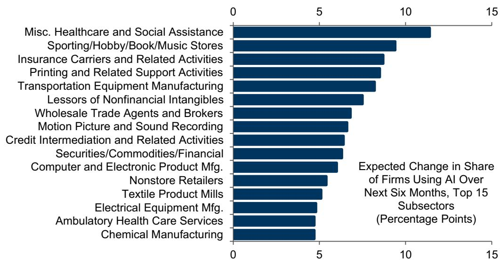
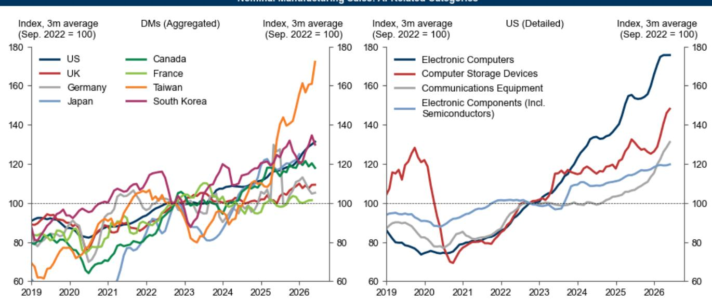

# GS：AI技术与行业应用观察

美国普查局商业趋势与展望调查（BTOS）的最新数据显示，截至2026年7月，美国企业中已有21.5%在日常业务职能中使用人工智能，较6月上升0.9个百分点。GS在7月更新的AI采用追踪报告中指出，未来六个月预计采用率将进一步升至24.3%。

这份报告的价值不在于单一数字，而在于它把研究、企业采用、劳动力市场三条线索放在同一时间轴上观察。半导体收入预期、数据中心建设、企业裁员声明和生产率数据同时指向一个阶段：AI正在从实验走向生产环境，但扩散速度在不同规模企业之间明显分化。

## 1. 半导体收入预期升至8340亿美元，硬件研究持续扩张

报告显示，公司分析师预计全球半导体公司收入到2026年底将达到8340亿美元（年化），而自2022年11月ChatGPT公开发布以来，内存生产商的共识收入预测累计上修了1740亿美元。美国国民账户中AI相关硬件研究较2022年水平增加4630亿美元（三个月年化均值，占GDP的1.4%）。台湾AI相关制造业出货量自2022年以来增长72%，美国AI硬件净进口在5月进一步升至557亿美元。

这些数字合在一起说明，AI资本开支周期仍在扩张阶段，且硬件需求从芯片到设备再到贸易流量的传导链条保持完整。数据中心建设相关的建筑就业自2022年以来增加29万人，月均增量约1.4万人，成为劳动力市场中少数持续受益的板块。

> **KC评论：** 内存收入预测上修1740亿美元这个数字值得单独看。它说明AI需求不是停留在概念层面，而是已经转化为对存储芯片的实际订单，这是判断资本开支周期是否可持续的一个先行指标。

## 2. 大企业采用率领先，小企业差距扩大至18.2个百分点

BTOS数据显示，员工超过250人的企业AI采用率为38.3%（最近六次调查均值），而员工少于10人的企业采用率明显落后。自2月以来，这两类企业之间的采用率差距从13.2个百分点扩大至18.2个百分点。信息、专业服务和资金行业继续领跑，计算、广播和网络搜索等细分行业的采用率已达到或超过50%。

医疗保健和社会援助行业报告未来六个月采用率预期增幅最大。Gallup调查显示，47%的美国员工表示所在组织已采用AI，高于上季度的41%。Deloitte的调查则发现，84%的公司尚未围绕AI能力重新设计工作岗位或任务。

采用率差距的扩大值得关注。如果大企业通过AI持续压缩成本、提升产出效率，而小企业因资源限制无法跟进，行业集中度可能进一步上升。这一动态对供应链关系和市场竞争格局的含义，可能比采用率本身更重要。

## 3. 劳动力市场影响仍集中于特定职业，整体影响约1千人

报告认为，AI对劳动力市场的影响仍然可见但范围有限。营销、平面设计、客户服务以及部分技术职业的就业持续承压，但数据中心相关建筑就业的增长部分抵消了这一影响。GS估计，AI受影响行业的整体就业影响约为每月1千人。

科技行业就业占比继续低于2007-2019年趋势线，但年轻科技工作者的失业率已回落至与全体科技工作者一致的水平。6月企业裁员公告中归因于AI的裁员人数为1.4万人，2026年上半年累计达10.2万人。罗素3000指数公司中，25%在2026年二季度财报电话会议中提及了AI与劳动力相关的关键词。

从宏观层面看，AI采用与失业率、就业增长之间仍未出现统计上显著的关系。但报告注意到，AI采用与就业增长、工时增长之间开始出现微弱的负相关迹象，且年轻工人群体中AI采用率与失业率之间存在轻微正相关。

> **KC评论：** 裁员公告中AI归因人数上半年累计10.2万，放在美国约1.6亿总就业人口里占比很小。但这类公告往往滞后于实际调整，且更多反映企业对外沟通策略而非内部真实决策，解读时需保留余地。

## 4. 已部署场景中的生产率提升约23%至32%

在生成式AI已实际部署的有限领域，生产率影响较为显著。学术研究显示平均生产率提升约23%，企业案例反馈的效率提升约为32%。官方数据中，AI采用率较高的行业在过去一年显示出轻微的生产率增长加速。

Gallup调查显示，使用AI进行编码辅助和流程自动化的员工报告的生产率提升最高。WRITER调查则发现，员工使用AI工具每周节省约6小时，高管报告节省近12小时。不过，仅29%的受访领导者表示从生成式AI中看到了显著的ROI，AI代理的该比例为23%。

生产率提升与ROI感知之间的落差，可能反映了一个时间差问题。企业部署AI的初期成本集中在基础设施、数据整理和流程改造上，而收益的释放需要更长的观察周期。报告引用的多项调查均显示，大多数组织仍处于试点或局部部署阶段，尚未实现企业级扩展。

## 5. 观察框架：从采用率、就业结构和资本开支三条线交叉验证

这份报告提供了一个可复用的观察框架：将企业采用率（BTOS调查）、劳动力市场结构变化（BLS就业数据）和资本开支周期（半导体收入、硬件研究、贸易流量）三条线索放在同一时间轴上对照。

单一指标容易误导。采用率上升可能伴随裁员增加，也可能伴随招聘扩张；资本开支增长可能反映真实需求，也可能只是库存周期波动。只有当三条线同时指向同一方向时，判断的置信度才更高。当前数据显示，研究端信号较强，采用率稳步上升，劳动力市场影响仍集中在特定职业群体。

报告也提示了一个方法论变化：普查局自2025年12月4日起调整了调查问题措辞，从询问AI在“生产商品和服务”中的使用改为询问AI在“任何业务职能”中的使用，导致采用率出现水平位移。后续跟踪需注意口径一致性。

对于关注AI产业进程的读者，这份报告的价值在于它提供了多个可交叉验证的数据节点。每个季度更新时，观察采用率增速是否节奏变化、内存收入预测是否继续上修、以及AI相关裁员是否从科技行业扩散到其他领域，比单看任何一个指标都更有信息量。

For informational purposes only. Portions may be generated,translated,summarized,or edited with AI assistance based on source materials and may contain omissions or errors. Please verify independently. This is not investment,legal,tax,accounting,or other professional advice.

For informational purposes only. Portions may be generated,translated,summarized,or edited with AI assistance based on source materials and may contain omissions or errors. Please verify independently. This is not investment,legal,tax,accounting,or other professional advice.

