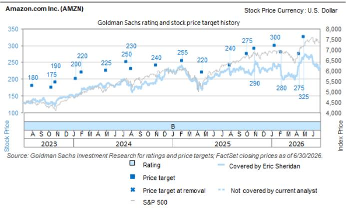

# Amazon.com Inc. (AMZN)

# Q2'26 财报观察：AWS 收入增长与运营利润率支撑 AI 投入的资本回报逻辑；整体利润率多年期叙事逐步成形

AMZN

12个月目标价：\$375.00

现价：\$235.50

潜在空间：59.2%

AMZN 的 Q2'26 财报呈现了几个关键主题：1) AWS 的收入增速（+37%）、运营利润率（+39%）以及芯片和 AI 业务（各自年化收入达 \$250 亿）的动能，持续显示出投入资本回报的清晰信号——公司在 AI 长期增长主题下的竞争位势，正围绕计算负载、定制芯片以及通过更多选择推动 AI 采用（管理层估计 AWS 年化收入有望达到 \$1 万亿）获得顺风；2) 资本开支（虽然 2026 年从 \$2000 亿上调至 \$2200 亿，以反映通胀性组件定价）继续被管理层视为回报可见性的信号，并支撑公司收入积压（目前为 \$4960 亿，同比增长 154%），这可能在接下来几个季度继续支撑 AWS 收入增长的加速；3) Amazon Prime 消费者的整体健康状况保持稳固，围绕更广泛供给（尤其是生鲜和家庭必需品）和地理扩张（本季度新增 80 个城市）、更快的配送时效以及 Alexa for Shopping 的持续采用（过去 12 个月新增 3.5 亿客户）等举措，支撑公司在覆盖范围内除 AI 之外较强劲的长期增长主题之一的相对位势；4) 广告收入增长（+26% 同比）继续受到核心电商运营以及 Prime Video（尤其是体育直播，如 NBA）、程序化广告等日益增长的组合推动。总体而言，这份财报完全支撑了公司的运营动能、当前投入节奏，以及中长期内对这些投入持续产生资本回报的能力（覆盖业务的多个领域）。

短期内，我们预计市场讨论将集中在 AWS 整体机会的斜率与规模（主要体现为 AI 动能，也包括向云迁移的更广泛运营要素）、资本开支增长的节奏与形态、全球消费环境的健康状况、AMZN 维持广告服务增长的能力（即使在收入增长基数效应变得更加困难后的正常化水平），以及任何较新的投入举措（AI、Project Leo、即时零售、供给阵列和地理扩张）可能如何影响运营利润增长的线性。在未来 12 个月以上，我们重申观点：Amazon 能够在多年期时间框架内实现收入增长与运营利润率扩张的强劲组合，同时持续进行对长期增长举措的关键投入。我们认为 AMZN 在未来表现中处于有利位置，因为：1) AWS 受益于企业客户需求变迁中的长尾结构性增长机会，并伴随 Gen AI 工作负载上量的顺风；2) 电商利润率继续受益于更高效物流网络上的更高单量以及单位服务成本的降低；3) 广告业务在零售媒体、程序化广告和不断演变的媒体消费习惯带来的市场机会中，继续以高利润率扩张。我们重申报告评级，并将 12 个月目标价从 \$335 上调至 \$375，以反映本次财报和最新管理层评论对前瞻运营预测的调整。在盘后价格 \$258 下，AMZN 目前交易于我们 2027 年 GAAP 每股收益预测的约 25 倍，而 2026 年 GAAP 每股收益同比增长为 23%。该公司在我们覆盖范围内呈现出最具吸引力的风险回报特征之一。

## Q2'26 积极与消极因素：

积极因素：a) Q2 合并收入超出指引上限及 GSe/FactSet 市场预期，达 \$2006 亿（+20% 同比），由 AWS（+37% 同比）、广告（+26% 同比）、北美和第三方卖家服务共同驱动；b) 芯片和 AI 业务持续强劲（各自同比增速达三位数，年化收入 \$250 亿），Graviton 的收入承诺环比增长近 3 倍，管理层表示 AWS 有潜力成为 \$1 万亿年化收入业务；c) 2Q AWS 运营利润率为 +39%（高于 GSe/市场预期的约 34%），来自新增 AI 和核心工作负载的增量利润率好于预期；d) 在零售端，即时零售的投入回报持续通过生鲜品类的牵引力（月活客户自年初以来增长 +50%）、Amazon Now 的扩张（2Q 新增 80 个城市）以及 Everyday Essentials 以显著快于美国其他品类的速度增长而显现。

消极因素：a) Q3'26 收入和运营利润指引分别低于 GSe/市场预期 (3)%/(2)% 和 (9)%/(3)%（中值），但其中包含约 80 个基点的汇率逆风和 400 个基点的 Prime Day 时间调整影响；b) 管理层将 FY26 资本开支指引上调至 \$2200 亿（此前为 \$2000 亿），并指出投入成本上升（即内存）是主要驱动因素。

## Q3'26 与 2026 年预测调整：

Q3'26：收入 \$2015 亿（此前为 \$2066.6 亿）；GAAP 运营利润 \$260.4 亿（此前为 \$268.2 亿）；GAAP 每股收益 \$1.90（此前为 \$1.96）。2026 年：收入 \$8251 亿（此前为 \$8276 亿）；GAAP 运营利润 \$1094 亿（此前为 \$1067.1 亿）；GAAP 每股收益 \$12.76（此前为 \$8.85）。

Exhibit 1：Q2'26 实际值 vs 预测（\$ 百万，除每股数据外）

<table><tr><td></td><td>实际值</td><td>GS</td><td>市场一致预期</td><td>指引</td><td>实际 vs GS</td><td>实际 vs 市场</td></tr><tr><td>总收入</td><td>\$ 200,606</td><td>\$ 197,611</td><td>\$ 196,687</td><td>\$194-199bn</td><td>1.5%</td><td>2.0%</td></tr><tr><td>AWS</td><td>\$ 42,232</td><td>\$ 40,752</td><td>\$ 40,490</td><td></td><td>3.6%</td><td>4.3%</td></tr><tr><td>北美销售</td><td>\$ 116,177</td><td>\$ 112,076</td><td>\$ 113,779</td><td></td><td>3.7%</td><td>2.1%</td></tr><tr><td>国际销售</td><td>\$ 42,197</td><td>\$ 44,783</td><td>\$ 42,623</td><td></td><td>-5.8%</td><td>-1.0%</td></tr><tr><td>在线商店</td><td>\$ 70,432</td><td>\$ 70,093</td><td>\$ 69,312</td><td></td><td>0.5%</td><td>1.6%</td></tr><tr><td>实体店</td><td>\$ 5,794</td><td>\$ 5,875</td><td>\$ 5,873</td><td></td><td>-1.4%</td><td>-1.3%</td></tr><tr><td>第三方卖家服务</td><td>\$ 46,780</td><td>\$ 46,400</td><td>\$ 46,088</td><td></td><td>0.8%</td><td>1.5%</td></tr><tr><td>广告服务</td><td>\$ 19,809</td><td>\$ 18,833</td><td>\$ 19,364</td><td></td><td>5.2%</td><td>2.3%</td></tr><tr><td>订阅服务</td><td>\$ 13,730</td><td>\$ 14,039</td><td>\$ 13,792</td><td></td><td>-2.2%</td><td>-0.4%</td></tr><tr><td>其他</td><td>\$ 1,829</td><td>\$ 1,619</td><td>\$ 1,662</td><td></td><td>13.0%</td><td>10.1%</td></tr><tr><td>GAAP 运营利润</td><td>\$ 27,461</td><td>\$ 23,826</td><td>\$ 23,730</td><td>\$20-24bn</td><td>15%</td><td>16%</td></tr><tr><td>利润率</td><td>13.7%</td><td>12.1%</td><td>12.1%</td><td></td><td>163 bps</td><td>162 bps</td></tr><tr><td>GAAP 每股收益</td><td>\$ 5.75</td><td>\$ 1.76</td><td>\$ 1.99</td><td></td><td>227%</td><td>189%</td></tr></table>

Q2 每股收益受益于 \$534 亿的其他收入
来源：公司数据、GS 全球投资研究、FactSet

## Exhibit 2：Q3'26、2026、2027 和 2028 年预测

\$ 百万，除每股数据外

<table><tr><td rowspan="2"></td><td colspan="3">Q3'26</td><td colspan="3">2026</td><td colspan="3">2027</td><td colspan="3">2028</td></tr><tr><td>旧</td><td>新</td><td>变化</td><td>旧</td><td>新</td><td>变化</td><td>旧</td><td>新</td><td>变化</td><td>旧</td><td>新</td><td>变化</td></tr><tr><td>总收入</td><td>\$ 206,662</td><td>\$ 201,505</td><td>-2%</td><td>\$ 827,600</td><td>\$ 825,055</td><td>0%</td><td>\$ 952,884</td><td>\$ 962,384</td><td>1%</td><td>\$ 1,081,038</td><td>\$ 1,100,176</td><td>2%</td></tr><tr><td>AWS</td><td>\$ 44,558</td><td>\$ 46,703</td><td>5%</td><td>\$ 171,285</td><td>\$ 177,756</td><td>4%</td><td>\$ 231,841</td><td>\$ 248,890</td><td>7%</td><td>\$ 292,119</td><td>\$ 319,824</td><td>9%</td></tr><tr><td>北美销售</td><td>\$ 114,768</td><td>\$ 113,174</td><td>-1%</td><td>\$ 470,779</td><td>\$ 470,744</td><td>0%</td><td>\$ 518,832</td><td>\$ 518,601</td><td>0%</td><td>\$ 569,323</td><td>\$ 569,182</td><td>0%</td></tr><tr><td>国际销售</td><td>\$ 47,335</td><td>\$ 41,627</td><td>-12%</td><td>\$ 185,536</td><td>\$ 176,555</td><td>-5%</td><td>\$ 202,211</td><td>\$ 194,893</td><td>-4%</td><td>\$ 219,596</td><td>\$ 211,170</td><td>-4%</td></tr><tr><td>在线商店</td><td>\$ 73,474</td><td>\$ 67,744</td><td>-8%</td><td>\$ 296,618</td><td>\$ 288,738</td><td>-3%</td><td>\$ 317,381</td><td>\$ 312,848</td><td>-1%</td><td>\$ 338,963</td><td>\$ 334,747</td><td>-1%</td></tr><tr><td>实体店</td><td>\$ 5,857</td><td>\$ 5,690</td><td>-3%</td><td>\$ 23,664</td><td>\$ 23,299</td><td>-2%</td><td>\$ 24,704</td><td>\$ 24,289</td><td>-2%</td><td>\$ 25,665</td><td>\$ 25,201</td><td>-2%</td></tr><tr><td>第三方卖家服务</td><td>\$ 46,310</td><td>\$ 45,248</td><td>-2%</td><td>\$ 191,329</td><td>\$ 190,119</td><td>-1%</td><td>\$ 212,789</td><td>\$ 208,842</td><td>-2%</td><td>\$ 235,770</td><td>\$ 229,204</td><td>-3%</td></tr><tr><td>广告服务</td><td>\$ 20,978</td><td>\$ 20,535</td><td>-2%</td><td>\$ 82,208</td><td>\$ 82,528</td><td>0%</td><td>\$ 96,854</td><td>\$ 97,653</td><td>1%</td><td>\$ 112,212</td><td>\$ 114,254</td><td>2%</td></tr><tr><td>订阅服务</td><td>\$ 13,957</td><td>\$ 13,957</td><td>0%</td><td>\$ 55,858</td><td>\$ 55,548</td><td>-1%</td><td>\$ 62,346</td><td>\$ 62,444</td><td>0%</td><td>\$ 68,991</td><td>\$ 69,156</td><td>0%</td></tr><tr><td>其他</td><td>\$ 1,528</td><td>\$ 1,627</td><td>6%</td><td>\$ 6,638</td><td>\$ 7,067</td><td>6%</td><td>\$ 6,970</td><td>\$ 7,420</td><td>6%</td><td>\$ 7,318</td><td>\$ 7,791</td><td>6%</td></tr><tr><td>GAAP 运营利润</td><td>\$ 26,821</td><td>\$ 26,037</td><td>-3%</td><td>\$ 106,711</td><td>\$ 109,373</td><td>2%</td><td>\$ 140,073</td><td>\$ 152,250</td><td>9%</td><td>\$ 179,773</td><td>\$ 197,148</td><td>10%</td></tr><tr><td>利润率</td><td>13.0%</td><td>12.9%</td><td>-6 bps</td><td>12.9%</td><td>13.3%</td><td>36 bps</td><td>14.7%</td><td>15.8%</td><td>112 bps</td><td>16.6%</td><td>17.9%</td><td>129 bps</td></tr><tr><td>GAAP 每股收益</td><td>\$ 1.96</td><td>\$ 1.90</td><td>-3%</td><td>\$ 8.85</td><td>\$ 12.76</td><td>44%</td><td>\$ 10.15</td><td>\$ 10.99</td><td>8%</td><td>\$ 12.84</td><td>\$ 14.02</td><td>9%</td></tr></table>

FY26 每股收益受益于 Q2 报告的 \$534 亿其他收入
来源：GS 全球投资研究

## 估值：维持报告评级；目标价上调至 \$375（此前为 \$335）

我们 12 个月目标价 \$375（此前为 \$335）基于分部加总法，对北美和 AWS 分部采用 EV/EBIT，对国际分部采用 EV/Sales，均基于 NTM+1 年预测。具体如下：

北美分部：16 倍 EV/GAAP EBIT（与之前持平）或 0.65 倍 EV/GAAP EBIT-增长率（此前为 0.63 倍），应用于我们 NTM+1 年北美分部预测。

国际分部：1.25 倍 EV/Sales（与之前持平）或 0.13 倍 EV/Sales-增长率（此前为 0.12 倍），应用于我们 NTM+1 年国际分部预测。

AWS 分部：29.0 倍 EV/GAAP EBIT（与之前持平）或 0.74 倍 EV/GAAP EBIT-增长率（此前为 0.80 倍），应用于我们 NTM+1 年 AWS 分部预测。

Exhibit 3：Amazon 估值分析 \$ 百万，除每股数据外

<table><tr><td>估值方法（SOTP）</td><td>下行</td><td>NTM+1 基准</td><td>上行</td></tr><tr><td colspan="4">北美分部：</td></tr><tr><td>收入</td><td>\$ 529,161</td><td>\$ 533,810</td><td>\$ 548,941</td></tr><tr><td>复合年增长率</td><td>8.0%</td><td>8.5%</td><td>10.0%</td></tr><tr><td>GAAP EBIT</td><td>\$ 47,624</td><td>\$ 52,251</td><td>\$ 57,639</td></tr><tr><td>利润率</td><td>9.0%</td><td>9.8%</td><td>10.5%</td></tr><tr><td>复合年增长率</td><td>19.0%</td><td>24.6%</td><td>30.9%</td></tr><tr><td>EV / GAAP EBIT</td><td>12.0x</td><td>16.0x</td><td>20.0x</td></tr><tr><td>EV / GAAP EBIT-增长率</td><td>0.63x</td><td>0.65x</td><td>0.65x</td></tr><tr><td>企业价值</td><td>\$ 571,494</td><td>\$ 836,008</td><td>\$ 1,152,775</td></tr><tr><td colspan="4">国际分部：</td></tr><tr><td>收入</td><td>\$ 206,261</td><td>\$ 209,723</td><td>\$ 213,900</td></tr><tr><td>复合年增长率</td><td>9.0%</td><td>9.9%</td><td>11.0%</td></tr><tr><td>EV / Sales</td><td>1.0x</td><td>1.3x</td><td>1.5x</td></tr><tr><td>EV / Sales-增长率</td><td>0.11x</td><td>0.13x</td><td>0.14x</td></tr><tr><td>企业价值</td><td>\$ 206,261</td><td>\$ 262,154</td><td>\$ 320,850</td></tr><tr><td colspan="4">AWS 分部：</td></tr><tr><td>收入</td><td>\$ 266,474</td><td>\$ 281,889</td><td>\$ 286,731</td></tr><tr><td>复合年增长率</td><td>34.0%</td><td>37.8%</td><td>39.0%</td></tr><tr><td>GAAP EBIT</td><td>\$ 93,266</td><td>\$ 105,842</td><td>\$ 111,825</td></tr><tr><td>利润率</td><td>35.0%</td><td>37.5%</td><td>39.0%</td></tr><tr><td>复合年增长率</td><td>30.6%</td><td>39.1%</td><td>43.0%</td></tr><tr><td>EV / GAAP EBIT</td><td>16.0x</td><td>29.0x</td><td>34.0x</td></tr><tr><td>EV / GAAP EBIT-增长率</td><td>0.52x</td><td>0.74x</td><td>0.79x</td></tr><tr><td>企业价值</td><td>\$ 1,492,256</td><td>\$ 3,069,425</td><td>\$ 3,802,058</td></tr><tr><td>总企业价值</td><td>\$ 2,270,010</td><td>\$ 4,167,587</td><td>\$ 5,275,683</td></tr><tr><td>净债务（现金）</td><td>\$ 59,220</td><td>\$ 59,220</td><td>\$ 59,220</td></tr><tr><td>市值（\$ 百万）</td><td>\$ 2,210,791</td><td>\$ 4,108,367</td><td>\$ 5,216,464</td></tr><tr><td>摊薄股数</td><td>10,974</td><td>10,974</td><td>10,974</td></tr><tr><td>12 个月目标价</td><td>\$ 200</td><td>\$ 375</td><td>\$ 475</td></tr><tr><td>上行/下行空间</td><td>-22.5%</td><td>45.3%</td><td>84.1%</td></tr></table>

来源：GS 全球投资研究

主要风险包括：(-) 竞争对电商或云增长的任何影响；高利润率业务（包括广告、云、第三方销售和订阅业务）规模化不成功；各项举措的投入对毛利或运营利润率造成压力；为遵守全球监管环境变化而进行的任何产品或平台调整；全球宏观环境波动以及增长型公司风险偏好的变化所带来的敞口。

## 披露附录

## Reg AC

我们，Eric Sheridan、Alex Vegliante（CFA）和 Sarah Boulos，特此证明本报告中表达的所有观点均准确反映了我们个人对相关公司及其证券的看法。我们还证明，我们的薪酬中没有任何部分直接或间接与本次报告中表达的具体建议或观点相关。

除非另有说明，本报告封面上列出的个人均为 GS 全球投资研究部分析师。

贡献作者：Eric Sheridan GS & Co. LLC、Alex Vegliante（CFA）GS & Co. LLC、Sarah Boulos GS & Co. LLC。

除非另有说明，本报告贡献作者披露中列出的个人均为 GS 全球投资研究部分析师。

## GS 因子画像

GS 因子画像通过将关键属性与市场（即我们评级的股票池）及其行业同行进行比较，为一只股票提供投资背景。四个关键属性为：增长、财务回报、倍数（即估值）和综合（增长、财务回报和倍数的复合）。增长、财务回报和倍数通过使用每只股票特定指标的标准化排名计算。各指标的标准化排名随后取平均并转换为相关属性的百分位。每个指标的具体计算可能因财年、行业和地区而异，但标准方法如下：

增长基于股票的前瞻性销售增长、EBITDA 增长和每股收益增长（对于金融股，仅每股收益和销售增长），百分位越高表示增长性越强。财务回报基于股票的前瞻性 ROE、ROCE 和 CROCI（对于金融股，仅 ROE），百分位越高表示财务回报越高。倍数基于股票的前瞻性 P/E、P/B、价格/股息（P/D）、EV/EBITDA、EV/FCF 和 EV/债务调整后现金流（DACF）（对于金融股，仅 P/E、P/B 和 P/D），百分位越高表示交易倍数越高。综合百分位计算为增长百分位、财务回报百分位和（100% - 倍数百分位）的平均值。

财务回报和倍数使用 GS 分析师在未来至少三个季度后的财年末预测。增长使用未来至少七个季度后的财年与未来至少三个季度后的财年相比的输入（所有指标均基于每股）。

有关我们如何计算 GS 因子画像的更详细说明，请联系您的 GS 代表。

## M&A 排名

在我们的全球覆盖范围内，我们使用 M&A 框架审视公司，考虑定性因素和定量因素（可能因行业和地区而异），以纳入某些公司可能被收购的潜在可能性。然后我们分配 M&A 排名，作为对我们评级覆盖范围内公司从 1 到 3 的评分方式，1 代表公司成为收购目标的高概率（30%-50%），2 代表中等概率（15%-30%），3 代表低概率（0%-15%）。对于排名为 1 或 2 的公司，按照我们标准部门指引，我们将 M&A 组成部分纳入目标价。M&A 排名为 3 被视为不重要，因此不计入我们的目标价，并且可能在研究中讨论或不讨论。

## Quantum

Quantum 是 GS 的专有数据库，提供详细的财务报表历史、预测和比率访问。它可用于对单一公司进行深入分析，或在不同部门和市场的公司之间进行比较。

## 披露

Amazon.com Inc. 的评级相对于其覆盖范围内的其他公司：ACV Auctions Inc.、Airbnb Inc.、Alphabet Inc.、Amazon.com Inc.、Angi Inc.、AppLovin Corp.、Bending Spoons S.p.A.、Booking Holdings Inc.、Bumble Inc.、Chewy Inc.、Clear Secure Inc.、Corsair Gaming Inc.、Coursera Inc.、Cricut Inc.、DoorDash Inc.、DoubleVerify Inc.、DraftKings Inc.、Duolingo Inc.、Ethos Technologies Inc.、Expedia Group、Fiverr International Ltd.、Frontdoor Inc.、Genius Sports Ltd.、GoodRx Holdings Inc.、Grindr Inc.、Groupon Inc.、Ibotta Inc.、Instacart、Liftoff Mobile Inc.、Lyft Inc.、Match Group、MediaAlpha Inc.、Meta Platforms Inc.、Netflix Inc.、Neutron Holdings Inc.、Nextdoor Holdings、Opera Ltd.、Pattern Group Inc.、Peloton Interactive Inc.、People Inc.、Pinterest Inc.、Playtika、Reddit Inc.、Roblox、Snap Inc.、Space Exploration Technologies Corp.、Sportradar Group、Spotify Technology S.A.、StubHub Holdings、Take-Two Interactive Software Inc.、Tripadvisor Inc.、Uber Technologies Inc.、Unity Software Inc.、Upwork Inc.、Wayfair Inc.、Webtoon Entertainment Inc.、Xometry Inc.、Yelp Inc.、ZipRecruiter Inc.

## 公司特定监管披露

以下披露涉及 GS Group, Inc.（及其关联公司，"GS"）与 GS 全球投资研究覆盖的公司之间的关系。

GS 在过去 12 个月中因投资银行服务获得报酬：Amazon.com Inc. (\$235.50)

GS 预计在未来 3 个月内获得或打算寻求投资银行服务报酬：Amazon.com Inc. (\$235.50)

GS 在过去 12 个月中因非投资银行服务获得报酬：Amazon.com Inc. (\$235.50)

GS 在过去 12 个月中与以下公司存在投资银行服务客户关系：Amazon.com Inc. (\$235.50)

GS 在过去 12 个月中与以下公司存在非投资银行证券相关服务客户关系：Amazon.com Inc. (\$235.50)

GS 在过去 12 个月中与以下公司存在非证券服务客户关系：Amazon.com Inc. (\$235.50)

GS 在过去 12 个月中管理或共同管理过公开或 Rule 144A 发行：Amazon.com Inc. (\$235.50)

GS 在以下公司的证券或衍生品中做市：Amazon.com Inc. (\$235.50)

## 评级/投资银行关系分布

GS 投资研究全球股票覆盖范围

报告日期 目标价（\$） 收盘价（\$）

<table><tr><td colspan="3">评级分布</td></tr><tr><td>买入</td><td>持有</td><td>卖出</td></tr><tr><td>50%</td><td>34%</td><td>16%</td></tr></table>

<table><tr><td colspan="3">投资银行关系</td></tr><tr><td>买入</td><td>持有</td><td>卖出</td></tr><tr><td>65%</td><td>59%</td><td>43%</td></tr></table>

截至 2026 年 7 月 1 日，GS 全球投资研究对 3,104 只股票有投资评级。GS 将股票分配为买入和卖出，纳入各区域投资清单；未纳入的股票被视为中性。此类分配等同于买入、持有和卖出，用于上述 FINRA 规则要求的披露。参见下方"评级、覆盖范围和相关定义"。投资银行关系图表反映了每个评级类别中 GS 在过去十二个月内提供过投资银行服务的标的公司的百分比。

## 目标价和评级历史图表

  
所示目标价应结合所有先前发布的 GS 报告（可能包含或不包含目标价）以及公司、行业和金融市场的发展来考虑。

## 目标价历史表 Amazon.com Inc. (AMZN)

<table><tr><td>08-Jul-26</td><td>335.00</td><td>243.62</td></tr><tr><td>30-Apr-26</td><td>325.00</td><td>265.06</td></tr><tr><td>13-Apr-26</td><td>275.00</td><td>239.89</td></tr><tr><td>06-Feb-26</td><td>280.00</td><td>210.32</td></tr><tr><td>13-Jan-26</td><td>300.00</td><td>242.60</td></tr><tr><td>31-Oct-25</td><td>290.00</td><td>244.22</td></tr><tr><td>03-Oct-25</td><td>275.00</td><td>219.51</td></tr><tr><td>01-Aug-25</td><td>240.00</td><td>214.75</td></tr><tr><td>21-Apr-25</td><td>220.00</td><td>167.32</td></tr><tr><td>07-Feb-25</td><td>255.00</td><td>229.15</td></tr><tr><td>01-Nov-24</td><td>240.00</td><td>197.93</td></tr><tr><td>02-Aug-24</td><td>230.00</td><td>167.90</td></tr><tr><td>15-Jul-24</td><td>250.00</td><td>192.72</td></tr><tr><td>01-May-24</td><td>225.00</td><td>179.00</td></tr><tr><td>02-Feb-24</td><td>220.00</td><td>171.81</td></tr><tr><td>10-Jan-24</td><td>200.00</td><td>153.73</td></tr><tr><td>27-Oct-23</td><td>190.00</td><td>127.74</td></tr><tr><td>12-Oct-23</td><td>175.00</td><td>132.33</td></tr><tr><td>04-Aug-23</td><td>180.00</td><td>139.57</td></tr></table>

表中所示目标价未针对公司行为进行调整。

## 监管披露

## 美国法律法规要求的披露

参见上方公司特定监管披露，了解本报告中提及公司的以下任何披露要求：待处理交易中的管理人或共同管理人；1% 或更多所有权；特定服务报酬；客户关系类型；先前期间管理/共同管理的公开发行；董事职位；对于股票证券，做市和/或专家角色。GS 交易或可能作为本金交易本报告中讨论的发行人的债务证券（或相关衍生品）。

以下为额外要求的披露：所有权和重大利益冲突：GS 政策禁止其分析师、向分析师汇报的专业人员及其家庭成员持有分析师覆盖范围内任何公司的证券。分析师薪酬：分析师的薪酬部分基于 GS 的盈利能力，其中包括投资银行收入。分析师作为高管或董事：GS 政策通常禁止其分析师、向分析师汇报的人员或其家庭成员在分析师覆盖范围内的任何公司担任高管、董事或顾问。非美国分析师：非美国分析师可能不是 GS & Co. LLC 的关联人员，因此可能不受 FINRA 规则 2241 或 FINRA 规则 2242 关于与标的公司沟通、公开露面以及交易分析师覆盖证券的限制。

## 美国以外司法管辖区法律和法规要求的额外披露

以下为指定司法管辖区要求的披露，除非已根据美国法律法规在上方作出。澳大利亚：GS Australia Pty Ltd 及其关联公司不是澳大利亚的授权存款机构（该术语在《1959 年银行法》（联邦）中定义），不提供银行服务，也不在澳大利亚从事银行业务。本研究及其任何访问仅面向澳大利亚《公司法》含义内的"批发客户"，除非 GS 另有约定。在撰写研究报告时，GS Australia 全球投资研究成员可能参加由其研究报告标的公司和实体主办或主持的现场访问和其他会议。在某些情况下，如果 GS Australia 认为在现场访问或会议的具体情况下适当且合理，此类现场访问或会议的部分或全部费用可能由相关发行人承担。如果本文件内容包含任何金融产品建议，则仅为一般性建议，由 GS 在未考虑客户目标、财务状况或需求的情况下编制。客户在根据任何此类建议采取行动前，应考虑该建议相对于自身目标、财务状况和需求的适当性。某些 GS Australia 和 New Zealand 利益披露以及 GS 澳大利亚卖方研究独立性政策声明的副本可在以下网址获取：https://www.goldmansachs.com/disclosures/australia-new-zealand/index.html。巴西：有关 CVM 决议第 20 号的披露信息可在 https://www.gs.com/worldwide/brazil/area/gir/index.html 获取。如适用，根据 CVM 决议第 20 号第 20 条定义，
