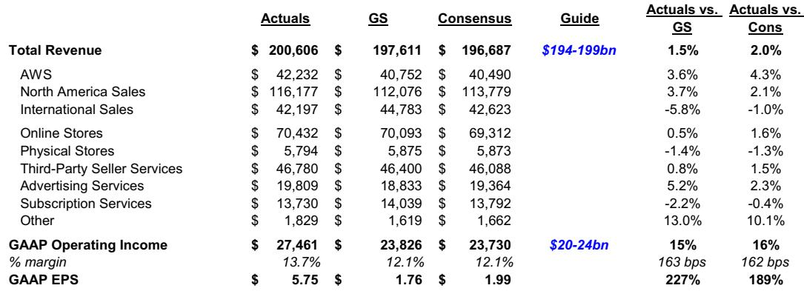
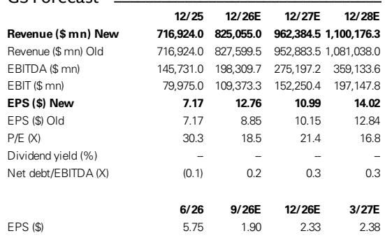
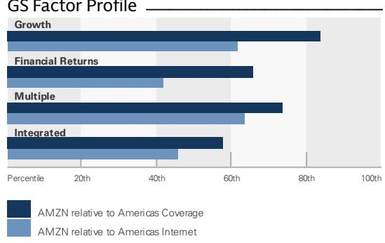

# GS：亚马逊AWS与AI及近期数据观察

这份GS研究报告的核心判断并不复杂：亚马逊Q2'26财报显示，AWS收入增速、运营利润率与AI业务规模三者同步走强，公司有底气继续扩大资本开支。报告将2026年资本开支指引从2000亿美元上调至2200亿美元，理由是内存等部件价格上涨，同时强调这笔投入有收入积压订单作为支撑。

报告给出的关键数字是AWS收入同比增长37%，运营利润率达到39%，高于GS和市场的约34%预期。芯片和AI业务各自达到250亿美元的年化收入运行率，Graviton芯片的收入承诺环比增长近3倍。管理层甚至提出AWS未来可能达到1万亿美元年收入规模。这些数据合在一起，指向一个正在兑现的回报表现逻辑：AI工作负载带来的增量收入，正在以高于预期的利润率进入AWS的财务表现。

## 1. 收入积压订单增长154%支撑资本开支扩张

报告最值得注意的财务锚点是收入积压订单达到4960亿美元，同比增长154%。这个数字解释了为什么管理层愿意把2026年资本开支从2000亿美元提高到2200亿美元——不是盲目扩张，而是有明确的客户承诺作为前提。

GS在报告中反复强调一个框架：资本开支不是成本，而是对回报可见度的信号。AWS的AI和芯片业务已经形成250亿美元的年化运行率，Graviton芯片收入承诺环比增长近3倍，这些是客户用真金白银锁定的需求。报告认为，这种收入积压会继续支撑AWS收入增速在未来几个季度保持加速。

> **KC评论：** 4960亿美元的收入积压是这份报告里最容易被忽视的数字。它比单季收入更能说明AWS的长期可见度，也是理解2200亿美元资本开支的关键背景——这不是押注，而是兑现既有承诺。

## 2. 零售业务与广告增速构成第二增长曲线

AWS之外，报告对亚马逊零售和广告业务的描述同样具体。Prime会员消费保持健康，生鲜和家庭必需品品类扩张明显，Amazon Now本季度新增80个城市，生鲜品类月活客户自年初增长50%。Alexa for Shopping在过去12个月积累了3.5亿客户。

广告业务收入同比增长26%，驱动力来自核心电商运营和Prime Video的直播体育内容，NBA赛事带动了广告参与度。GS认为，广告业务在零售媒体和程序化广告的市场机会中继续以高利润率扩张。这些业务合在一起，构成了AWS之外的另一个增长叙事：电商基础设施的效率提升和广告变现能力的持续释放。

## 3. 短期指引低于预期但包含一次性因素

报告没有回避Q3'26指引低于市场预期的事实。收入指引中值比GS和市场预期低3%和2%，运营利润指引低9%和3%。但报告指出，这包含约80个基点的汇率逆风和400个基点的Prime Day时间调整影响。

GS在财报后调整了2026年全年EPS预期，从8.85美元上调至12.76美元，主要反映Q2实际业绩超预期和其他收入项贡献。Q2 GAAP EPS达到5.75美元，大幅高于市场预期的1.99美元，但报告注明这受益于其他收入项。对于自由现金流，2026-2028年预计为负值，主要受资本开支节奏影响，这与公司处于研究密集期的判断一致。

## 4. 观察框架：用收入积压和利润率交叉验证AI投入

这份报告提供了一个可复用的分析框架：跟踪AI基础设施投入是否有效，不应只看资本开支数字本身，而应同时观察三个指标——收入积压订单的变化、AWS运营利润率的走向、以及芯片和AI业务的年化收入运行率。三者同步走强，说明投入正在转化为客户承诺和实际收入；如果只有资本开支增长而利润率持平或下滑，则需要重新审视回报周期。

，依据是财报后的盈利预测调整和管理层最新指引。报告认为亚马逊在覆盖范围内提供了较有吸引力的不确定性回报组合，核心逻辑是AWS的长期结构性增长、电商物流网络的成本效率提升，以及广告业务的高利润率扩张。

> **KC评论：** 这份报告最有价值的地方在于它给出了一个验证框架：当一家公司同时提高资本开支和收入积压订单时，市场应该关注的是后者是否跟得上前者。AWS 39%的运营利润率说明AI工作负载的增量收入质量不错，但未来几个季度能否维持这个水平，才是判断资本开支效率的关键。

For informational purposes only. Portions may be generated,translated,summarized,or edited with AI assistance based on source materials and may contain omissions or errors. Please verify independently. This is not investment,legal,tax,accounting,or other professional advice.

