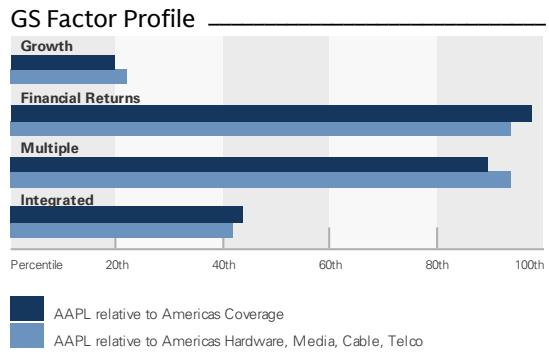
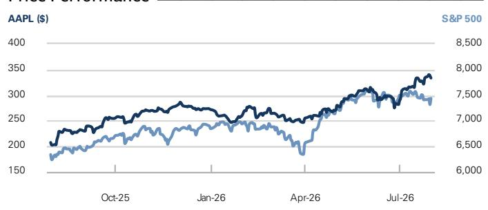

# Apple Inc. (AAPL)

# F3Q26 财报观察：供给约束与汇率因素下的业绩指引调整

AAPL

12个月目标价：\$360.00

现价：\$333.43

潜在空间：8.0%

AAPL F3Q26 每股收益为 \$1.91（不含关税退税带来的 +\$0.11 影响），与市场预期基本一致（GS/一致预期为 \$1.93/\$1.89）。营收方面，iPhone 和 Mac 表现超出预期，但 iPad 和服务业务未达预期；毛利率（48.1%）与预期持平（GS/一致预期为 48.2%/48.1%）。然而，F4Q26 的业绩指引未达预期，包含营收增长和毛利率两方面的下调：营收同比增长 9-11%（一致预期为 +12%），毛利率为 46-47%（不含关税退税约 1 个百分点的正面影响，一致预期为 47.3%）。F4Q26 服务业务营收增速预计将放缓 250 个基点（F3Q26 为同比增长 12%），主要受汇率因素影响；App Store 的增长放缓在两个季度中均为明显的拖累因素。

尽管本季度业绩和下一季度指引未达预期，我们认为未来 1-2 个季度市场情绪有望改善，原因包括：（1）产品提价（Mac、iPad，以及后续的 iPhone）和高端产品的价格/组合优化有望推动营收增长并缓解毛利率压力（同时需关注持续的成本上升）；（2）在可负担性措施（如 Apple Upgrade 计划）、新产品创新（如 Siri AI、新款 Mac、iPad、家居产品）以及教育和企业市场份额提升的推动下，销量下降幅度有望好于预期；（3）服务业务增长将受益于 iCloud+（代币）和 AppleCare+（产品动能）需求的增加而趋于稳定。

## 本季度要点

\- 需求强劲背景下的供给约束。AAPL 产品营收超出一致预期（\$787 亿，一致预期为 \$776 亿），主要得益于 iPhone 和 Mac 营收好于预期。

## 报告评级

Michael Ng, CFA
+1(212)902-8618 | michael.ng@gs.com
GS & Co. LLC

Lindsey Shema
+1(801)578-2673 | lindsey.shema@gs.com
GS & Co. LLC

Yash Goenka, CFA
+1(212)934-6312 | yash.goenka@gs.com
GS India SPL

## 关键数据

GS 预测

<table><tr><td colspan="5">CS 预测</td></tr><tr><td></td><td>9/25</td><td>9/26E</td><td>9/27E</td><td>9/28E</td></tr><tr><td>营收（百万美元）新</td><td>416,161.0</td><td>479,425.3</td><td>518,697.2</td><td>542,798.8</td></tr><tr><td>营收（百万美元）旧</td><td>416,161.0</td><td>482,632.9</td><td>517,583.9</td><td>539,330.7</td></tr><tr><td>EBITDA（百万美元）</td><td>144,748.0</td><td>171,212.0</td><td>174,582.7</td><td>183,652.7</td></tr><tr><td>EBIT（百万美元）</td><td>133,050.0</td><td>157,831.8</td><td>159,645.6</td><td>166,920.8</td></tr><tr><td>每股收益（美元）新</td><td>7.46</td><td>8.91</td><td>9.14</td><td>9.83</td></tr><tr><td>每股收益（美元）旧</td><td>7.46</td><td>8.92</td><td>9.73</td><td>10.27</td></tr><tr><td>市盈率（倍）</td><td>30.0</td><td>37.4</td><td>36.5</td><td>33.9</td></tr><tr><td>股息率（%）</td><td>0.5</td><td>0.3</td><td>0.3</td><td>0.3</td></tr><tr><td>净债务/EBITDA（倍）</td><td>(0.2)</td><td>(0.4)</td><td>(0.5)</td><td>(0.4)</td></tr><tr><td></td><td>6/26</td><td>9/26E</td><td>12/26E</td><td>3/27E</td></tr><tr><td>每股收益（美元）</td><td>2.02</td><td>2.03</td><td>2.86</td><td>2.09</td></tr></table>

GS 因子画像

  
资料来源：公司数据，GS 预测。详情请参阅披露说明。

评级起始日期：2023 年 3 月 5 日

比率与估值

<table><tr><td>比率与估值</td><td>9/25</td><td>9/26E</td><td>9/27E</td><td>9/28E</td></tr><tr><td>市盈率（倍）</td><td>30.0</td><td>37.4</td><td>36.5</td><td>33.9</td></tr><tr><td>EV/EBITDA（倍）</td><td>22.9</td><td>28.2</td><td>27.3</td><td>25.2</td></tr><tr><td>EV/营收（倍）</td><td>8.0</td><td>10.1</td><td>9.2</td><td>8.5</td></tr><tr><td>自由现金流回报表现（%）</td><td>3.0</td><td>3.0</td><td>3.0</td><td>3.2</td></tr><tr><td>EV/DACF（倍）</td><td>24.2</td><td>31.0</td><td>29.4</td><td>27.1</td></tr><tr><td>CROCI（%）</td><td>86.0</td><td>92.7</td><td>90.6</td><td>88.5</td></tr><tr><td>ROE（%）</td><td>171.4</td><td>141.2</td><td>113.4</td><td>111.2</td></tr><tr><td>净债务/EBITDA（倍）</td><td>(0.2)</td><td>(0.4)</td><td>(0.5)</td><td>(0.4)</td></tr><tr><td>净债务/权益（%）</td><td>(45.8)</td><td>(64.4)</td><td>(64.3)</td><td>(62.4)</td></tr><tr><td>利息保障倍数（倍）</td><td>31.7</td><td>37.6</td><td>38.0</td><td>39.7</td></tr><tr><td>库存天数</td><td>10.7</td><td>9.7</td><td>10.0</td><td>10.1</td></tr><tr><td>应收账款天数</td><td>32.1</td><td>32.1</td><td>32.3</td><td>32.4</td></tr><tr><td>应付账款天数</td><td>114.7</td><td>109.6</td><td>106.0</td><td>107.2</td></tr></table>

<table><tr><td colspan="5">增长与利润率（%）</td></tr><tr><td></td><td>9/25</td><td>9/26E</td><td>9/27E</td><td>9/28E</td></tr><tr><td>总营收增长</td><td>6.4</td><td>15.2</td><td>8.2</td><td>4.6</td></tr><tr><td>EBITDA 增长</td><td>7.5</td><td>18.3</td><td>2.0</td><td>5.2</td></tr><tr><td>每股收益增长</td><td>10.6</td><td>19.3</td><td>2.7</td><td>7.5</td></tr><tr><td>每股股息增长</td><td>4.1</td><td>3.9</td><td>3.8</td><td>3.6</td></tr><tr><td>毛利率</td><td>46.9</td><td>48.7</td><td>46.6</td><td>47.0</td></tr><tr><td>EBIT 利润率</td><td>32.0</td><td>32.9</td><td>30.8</td><td>30.8</td></tr></table>

价格表现  
  
资产负债表（百万美元）  
资料来源：FactSet。价格为 2026 年 7 月 30 日收盘价。

利润表（百万美元）

<table><tr><td colspan="5">利润表（百万美元）</td></tr><tr><td></td><td>9/25</td><td>9/26E</td><td>9/27E</td><td>9/28E</td></tr><tr><td>总营收</td><td>416,161.0</td><td>479,425.3</td><td>518,697.2</td><td>542,798.8</td></tr><tr><td>销售成本</td><td>(220,960.0)</td><td>(245,868.4)</td><td>(277,001.6)</td><td>(287,428.0)</td></tr><tr><td>销售、一般及管理费用</td><td>(27,601.0)</td><td>(29,761.0)</td><td>(30,334.0)</td><td>(31,134.0)</td></tr><tr><td>研发费用</td><td>(34,550.0)</td><td>(45,964.0)</td><td>(51,716.0)</td><td>(57,316.0)</td></tr><tr><td>其他营业收支</td><td>-</td><td>-</td><td>-</td><td>-</td></tr><tr><td>EBITDA</td><td>144,748.0</td><td>171,212.0</td><td>174,582.7</td><td>183,652.7</td></tr><tr><td>折旧与摊销</td><td>(11,698.0)</td><td>(13,380.1)</td><td>(14,937.0)</td><td>(16,731.9)</td></tr><tr><td>EBIT</td><td>133,050.0</td><td>157,831.8</td><td>159,645.6</td><td>166,920.8</td></tr><tr><td>净利息收支</td><td>(321.0)</td><td>1,020.0</td><td>844.7</td><td>972.9</td></tr><tr><td>联营公司损益</td><td>-</td><td>-</td><td>-</td><td>-</td></tr><tr><td>税前利润</td><td>132,729.0</td><td>158,851.8</td><td>160,490.4</td><td>167,893.7</td></tr><tr><td>所得税准备</td><td>(20,719.0)</td><td>(27,536.7)</td><td>(27,283.4)</td><td>(28,541.9)</td></tr><tr><td>少数股东权益</td><td>-</td><td>-</td><td>-</td><td>-</td></tr><tr><td>优先股股息</td><td>-</td><td>-</td><td>-</td><td>-</td></tr><tr><td>净利润（不含特殊项目）</td><td>112,010.0</td><td>131,315.1</td><td>133,207.0</td><td>139,351.7</td></tr><tr><td>净利润（含特殊项目）</td><td>112,010.0</td><td>131,315.1</td><td>133,207.0</td><td>139,351.7</td></tr><tr><td>每股收益（基本，不含特殊项目）（美元）</td><td>7.49</td><td>8.94</td><td>9.18</td><td>9.87</td></tr><tr><td>每股收益（摊薄，不含特殊项目）（美元）</td><td>7.46</td><td>8.91</td><td>9.14</td><td>9.83</td></tr><tr><td>每股收益（不含股权激励费用，摊薄）（美元）</td><td>--</td><td>--</td><td>--</td><td>--</td></tr><tr><td>每股股息（美元）</td><td>1.02</td><td>1.06</td><td>1.10</td><td>1.14</td></tr><tr><td>股息支付率（%）</td><td>13.6</td><td>11.9</td><td>12.0</td><td>11.6</td></tr><tr><td>加权平均股本（基本）（百万股）</td><td>14,947.7</td><td>14,687.4</td><td>14,508.8</td><td>14,120.4</td></tr><tr><td>加权平均股本（摊薄）（百万股）</td><td>15,004.7</td><td>14,745.4</td><td>14,567.4</td><td>14,179.0</td></tr></table>

<table><tr><td colspan="5">资产负债表（百万美元）</td></tr><tr><td></td><td>9/25</td><td>9/26E</td><td>9/27E</td><td>9/28E</td></tr><tr><td>现金及现金等价物</td><td>35,934.0</td><td>51,647.4</td><td>66,301.5</td><td>75,112.5</td></tr><tr><td>应收账款</td><td>39,777.0</td><td>44,669.2</td><td>47,124.5</td><td>49,227.3</td></tr><tr><td>存货</td><td>5,718.0</td><td>7,332.3</td><td>7,819.8</td><td>8,087.8</td></tr><tr><td>其他流动资产</td><td>66,528.0</td><td>74,490.2</td><td>74,246.4</td><td>74,990.4</td></tr><tr><td>流动资产合计</td><td>147,957.0</td><td>178,139.0</td><td>195,492.2</td><td>207,417.9</td></tr><tr><td>不动产、厂房及设备净额</td><td>49,834.0</td><td>52,992.7</td><td>60,059.7</td><td>66,329.6</td></tr><tr><td>无形资产净额</td><td>6,512.0</td><td>6,512.0</td><td>6,512.0</td><td>6,512.0</td></tr><tr><td>总投资</td><td>77,723.0</td><td>82,618.0</td><td>76,618.0</td><td>70,618.0</td></tr><tr><td>其他长期资产</td><td>77,215.0</td><td>91,387.0</td><td>91,387.0</td><td>91,387.0</td></tr><tr><td>总资产</td><td>359,241.0</td><td>411,648.7</td><td>430,068.9</td><td>442,264.5</td></tr><tr><td>应付账款</td><td>69,860.0</td><td>77,821.7</td><td>82,996.1</td><td>85,839.7</td></tr><tr><td>短期债务</td><td>20,329.0</td><td>13,004.0</td><td>13,004.0</td><td>13,004.0</td></tr><tr><td>流动租赁负债</td><td>-</td><td>-</td><td>-</td><td>-</td></tr><tr><td>其他流动负债</td><td>75,442.0</td><td>82,099.0</td><td>84,939.9</td><td>89,153.6</td></tr><tr><td>流动负债合计</td><td>165,631.0</td><td>172,924.7</td><td>180,940.0</td><td>187,997.4</td></tr><tr><td>长期债务</td><td>78,328.0</td><td>71,340.0</td><td>71,340.0</td><td>71,340.0</td></tr><tr><td>非流动租赁负债</td><td>-</td><td>-</td><td>-</td><td>-</td></tr><tr><td>其他长期负债</td><td>41,549.0</td><td>55,080.0</td><td>55,080.0</td><td>55,080.0</td></tr><tr><td>长期负债合计</td><td>119,877.0</td><td>126,420.0</td><td>126,420.0</td><td>126,420.0</td></tr><tr><td>总负债</td><td>285,508.0</td><td>299,344.7</td><td>307,360.0</td><td>314,417.4</td></tr><tr><td>优先股</td><td>-</td><td>-</td><td>-</td><td>-</td></tr><tr><td>普通股权益合计</td><td>73,733.0</td><td>112,304.0</td><td>122,709.0</td><td>127,847.1</td></tr><tr><td>少数股东权益</td><td>-</td><td>-</td><td>-</td><td>-</td></tr><tr><td>总负债及权益</td><td>359,241.0</td><td>411,648.7</td><td>430,068.9</td><td>442,264.5</td></tr><tr><td>每股账面价值（美元）</td><td>4.93</td><td>7.65</td><td>8.46</td><td>9.05</td></tr></table>

<table><tr><td colspan="5">现金流量表（百万美元）</td></tr><tr><td></td><td>9/25</td><td>9/26E</td><td>9/27E</td><td>9/28E</td></tr><tr><td>净利润</td><td>112,010.0</td><td>131,315.1</td><td>133,207.0</td><td>139,351.7</td></tr><tr><td>加回折旧与摊销</td><td>11,698.0</td><td>13,380.1</td><td>14,937.0</td><td>16,731.9</td></tr><tr><td>加回少数股东权益</td><td>-</td><td>-</td><td>-</td><td>-</td></tr><tr><td>营运资本变动净额</td><td>(25,000.0)</td><td>3,254.0</td><td>516.2</td><td>(857.2)</td></tr><tr><td>其他</td><td>12,774.0</td><td>11,828.2</td><td>14,558.4</td><td>15,286.3</td></tr><tr><td>经营活动现金流</td><td>111,482.0</td><td>159,777.4</td><td>163,218.6</td><td>170,512.8</td></tr><tr><td>资本支出</td><td>(12,715.0)</td><td>(11,067.8)</td><td>(19,204.1)</td><td>(20,201.8)</td></tr><tr><td>收购</td><td>-</td><td>-</td><td>-</td><td>-</td></tr><tr><td>剥离</td><td>-</td><td>-</td><td>-</td><td>-</td></tr><tr><td>其他</td><td>-</td><td>-</td><td>-</td><td>-</td></tr><tr><td>投资活动现金流</td><td>15,195.0</td><td>(21,079.8)</td><td>(11,204.1)</td><td>(12,201.8)</td></tr><tr><td>已支付股息</td><td>(15,421.0)</td><td>(15,755.3)</td><td>(16,022.4)</td><td>(16,161.9)</td></tr><tr><td>股份发行/回购</td><td>(96,671.0)</td><td>(92,988.0)</td><td>(121,338.0)</td><td>(133,338.0)</td></tr><tr><td>债务增减</td><td>-</td><td>-</td><td>-</td><td>-</td></tr><tr><td>其他</td><td>-</td><td>-</td><td>-</td><td>-</td></tr><tr><td>筹资活动现金流</td><td>(120,686.0)</td><td>(122,984.3)</td><td>(137,360.4)</td><td>(149,499.9)</td></tr><tr><td>总现金流</td><td>5,991.0</td><td>15,713.4</td><td>14,654.1</td><td>8,811.0</td></tr><tr><td>自由现金流</td><td>98,767.0</td><td>148,709.6</td><td>144,014.5</td><td>150,311.0</td></tr><tr><td>每股自由现金流（基本）（美元）</td><td>6.61</td><td>10.12</td><td>9.93</td><td>10.64</td></tr></table>

资料来源：公司数据，GS 预测。

首先，iPhone 营收同比增长 22%（绝大多数市场实现两位数增长），得益于 iPhone 17 系列的持续强劲需求，本季度活跃装机量创历史新高，升级用户数也创下纪录。其次，Mac 营收同比增长 29%，同样创下升级用户和新客户纪录。值得注意的是，公司持续观察到（a）Mac Mini 中 AI 应用的增长，以及（b）企业和教育市场从 Chromebook 转向 MacBook Neo 的趋势（美国教育机构购买的 MacBook Neo 中约有一半替代了 Windows 或 Chromebook 设备）。对于 9 月季度，AAPL 的营收指引为同比增长 9-11%（一致预期为 +12%），增速较 F3Q26 的 +16% 有所放缓，主要受供给约束（同比约 350 个基点的负面影响）和汇率因素（同比 -150 个基点或环比 -250 个基点）影响。AAPL 预计 iPhone 营收同比增长为中等两位数（较 F3Q26 的 22% 有所放缓），原因是 SoC 先进制程的供给约束。供给约束在 6 月季度主要影响 Mac，但在 9 月季度将影响 iPhone、Mac 和 iPad。AAPL 表示目前判断 iPad 和 Mac 提价的影响还为时过早，我们认为这可能为营收增长带来上行空间。

■ 汇率因素对服务业务营收的增量影响。F3Q26 服务业务营收未达预期（\$307 亿，GS/一致预期为 \$314 亿/\$314 亿），增速从 F2Q26 的 +16% 放缓至 +12%。汇率是服务业务营收增速环比放缓的主要因素，基本趋势与 AAPL 的预期大致一致（移动游戏领域略偏弱）。AAPL 强调，尽管法院裁决影响了链接外部交易，广告、AppleCare、音乐、视频和 App Store 均创下营收纪录。AAPL 预计服务业务营收增速将与 F3Q26 相近（同比增长 +12%），其中汇率因素带来 250 个基点的负面影响。

Siri AI 的早期反馈积极。AAPL 强调了开发者和公开测试版对 Siri AI 的积极反馈。公司目前正在争取 Siri AI 全球同步推出的审批，但在中国和欧洲仍可能面临延迟。虽然 AAPL 认为判断 Siri AI 对成本的影响还为时过早，但指出 Siri AI 可能根据使用情况为 Cloud+ 带来升级机会。总体而言，AAPL 采用第三方云和自有数据中心的混合模式，并全面增加了 AI 相关投入。

## ■ 毛利率指引低于预期，主要受内存成本影响

AAPL F3Q26 毛利率为 50.1%（不含关税退税约 2 个百分点的正面影响为 48.1%），与 GS/一致预期 48.2%/48.1% 基本一致。产品毛利率为 40.1%（GS 预测：37.3%，不含关税退税），超出 GS/一致预期 36.8%/36.0%，体现了持续的供应链执行能力。虽然公司 6 月已观察到内存成本显著上升，但预计 9 月成本将进一步上升。AAPL 预计通过部分非内存组件成本下降和 9 月库存消化来部分抵消成本上升的影响，但该正面效应将随时间递减。内存成本上升被认为是 AAPL 毛利率从 F3Q26 的 48.1% 环比下降至 F4Q26 的 46-47%（一致预期为 47.4%）的全部原因。含关税退税，AAPL 指引毛利率从 F3Q26 的 50.1% 下降至 47-48%。

业绩与指引：

每股收益为 \$2.02（不含关税退税 +\$0.11 为 \$1.91），与 GS/一致预期 \$1.93/\$1.89 基本一致。营收为 \$1,094 亿，低于 GS 的 \$1,101 亿，但高于一致预期的 \$1,090 亿；其中 iPhone 营收 \$543 亿，低于我们的 \$548 亿预测，但高于一致预期的 \$537 亿；服务业务营收 \$307 亿，低于 GS/一致预期 \$314 亿/\$314 亿。毛利率为 50.1%，高于 GS/一致预期 48.2%/48.1%；产品毛利率为 40.1%，高于 GS/一致预期 36.8%/36.0%。

■ 营收 \$1,094 亿，低于 GS 的 \$1,101 亿，但高于一致预期的 \$1,090 亿。产品营收 \$787 亿，与 GS 预测 \$787 亿持平，高于一致预期 \$776 亿。服务业务营收 \$307 亿（同比增长 12%），低于 GS/一致预期 \$314 亿/\$314 亿。

■ iPhone 和 Mac 营收超预期，iPad 未达预期。

☐ iPhone 营收 \$543 亿，低于 GS 预测 \$548 亿，但高于一致预期 \$537 亿。

☐ Mac 营收 \$104 亿，高于一致预期/GS 预测 \$87 亿/\$93 亿。

☐ iPad 营收 \$62 亿，低于 GS/一致预期 \$68 亿/\$71 亿。

☐ 可穿戴设备、家居及配件营收 \$79 亿，高于 GS 预测 \$78 亿，与一致预期 \$79 亿持平。

毛利润 \$548 亿，高于 GS/一致预期 \$531 亿/\$524 亿，毛利率为 50.1%，高于 GS 预测 48.2% 和一致预期 48.1%。产品毛利率为 40.1%（GS 预测：37.3%，不含关税退税），高于 GS/一致预期 36.8%/36.0%。服务业务毛利率为 75.6%，低于 GS 预测 76.7% 和一致预期 76.3%。

EBIT 为 \$357 亿，对应 32.6% 的利润率，高于 GS/一致预期 \$341 亿/\$334 亿（GS/一致预期利润率为 31.0%/30.6%）。营业费用 \$191 亿，高于 GS 预测 \$189 亿，与一致预期 \$190 亿持平。

■ AAPL 本季度回购约 \$251 亿股份（GS 预测 \$251 亿），较 F2Q26（约 \$123 亿）有所增加。

Apple 提供的 F4Q26 指引包括：（1）总营收同比增长 9-11%（一致预期为 +12%）；（2）iPhone 营收增长率为中等两位数；（3）服务业务增长 9.5%（与 6 月季度 +12% 的增速相近，汇率因素带来 250 个基点的环比负面影响）；（4）毛利率 47%-48%，含约 1 个百分点的关税退税正面影响（一致预期为 47.4%）；（5）营业费用 \$191-\$194 亿（一致预期为 \$190 亿）；（6）其他收支净额 \$3.5 亿；（7）税率 16.5%。

图表 1：实际值与 GS 预测及一致预期对比（百万美元，每股数据除外）

<table><tr><td rowspan="2">（百万美元）</td><td colspan="5">GS 预测</td><td colspan="4">一致预期</td><td>评论/指引</td></tr><tr><td>实际值</td><td>同比变动（%）</td><td>GS 预测</td><td>差异（百万美元）</td><td>差异（%）</td><td>FactSet</td><td>差异（百万美元）</td><td>差异（%）</td><td>同比变动（%）</td><td></td></tr><tr><td>营收</td><td>\$109,417</td><td>16%</td><td>\$110,103</td><td>(\$686)</td><td>-1%</td><td>\$109,039</td><td>\$378</td><td>0%</td><td>16%</td><td>14-17% 同比</td></tr><tr><td>毛利润</td><td>\$54,770</td><td>25%</td><td>\$53,051</td><td>\$1,719</td><td>3%</td><td>\$52,432</td><td>\$2,338</td><td>4%</td><td>20%</td><td></td></tr><tr><td>营业费用</td><td>\$19,075</td><td>23%</td><td>\$18,946</td><td>\$129</td><td>1%</td><td>\$19,018</td><td>\$57</td><td>0%</td><td>23%</td><td>\$188-\$191 亿</td></tr><tr><td>营业利润</td><td>\$35,695</td><td>27%</td><td>\$34,105</td><td>\$1,590</td><td>5%</td><td>\$33,414</td><td>\$2,281</td><td>7%</td><td>18%</td><td></td></tr><tr><td>其他收支净额</td><td>\$572</td><td>-435%</td><td>\$250</td><td>\$322</td><td>129%</td><td>\$43</td><td>\$529</td><td>1219%</td><td>-125%</td><td>\$2.5 亿</td></tr><tr><td>税前利润</td><td>\$36,267</td><td>29%</td><td>\$34,355</td><td>\$1,912</td><td>6%</td><td>\$33,457</td><td>\$2,810</td><td>8%</td><td>19%</td><td></td></tr><tr><td>税费（非 GAAP）</td><td>\$6,478</td><td></td><td>\$5,840</td><td>\$638</td><td>11%</td><td>\$5,708</td><td>\$770</td><td>13%</td><td></td><td></td></tr><tr><td>税率</td><td>16.4%</td><td></td><td>17.0%</td><td>(0.6%)</td><td></td><td>17.1%</td><td></td><td></td><td></td><td>17.0%</td></tr><tr><td>净利润（非 GAAP）</td><td>\$29,789</td><td>27%</td><td>\$28,514</td><td>\$1,275</td><td>4%</td><td>\$27,742</td><td>\$2,047</td><td>7%</td><td>18%</td><td></td></tr><tr><td>摊薄每股收益（非 GAAP）</td><td>\$2.02</td><td>29%</td><td>\$1.93</td><td
