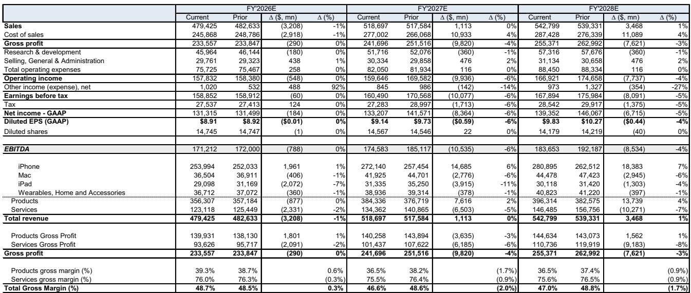
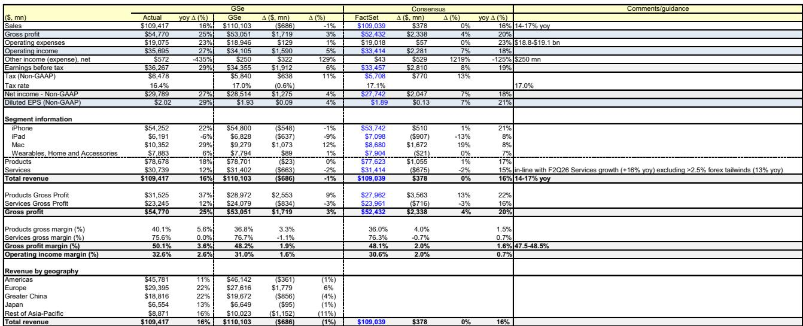
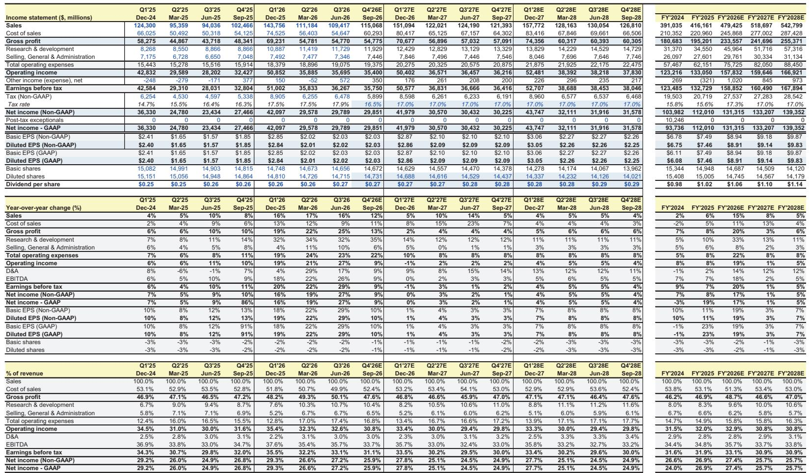

# GS：苹果F3Q26回顾与F4Q26指引受供应和汇率影响

苹果公司F3Q26财报本身并不算差，但真正让市场需要消化的，是下一季度的指引。GS在最新报告中指出，苹果给出的F4Q26收入增速为9%-11%同比，低于市场预期的12%同比；毛利率指引为46%-47%，同样低于共识的47.3%。供应约束和外汇逆风是主要影响，前者对iPhone、Mac和iPad均有影响，后者则额外压制服务收入增速约250个基点。

这份报告的判断是：短期指引令人失望，但未来一到两个季度内，市场情绪可能逐步修复。修复的动力来自三方面——产品提价与高端化带来的收入弹性、以旧换新和AI功能推动的需求韧性，以及服务收入增速的企稳。GS认为，当前报价已经计入较多悲观预期，而供应约束和外汇逆风都是可量化的暂时性因素。

## 1. F3Q26产品收入超预期，iPhone与Mac表现分化

F3Q26产品收入为787亿美元，高于共识的776亿美元。iPhone收入543亿美元，略低于GS预期的548亿美元，但高于共识的537亿美元，同比增长22%，创下活跃装机量和升级用户数的新纪录。Mac收入104亿美元，显著高于共识的87亿美元和GSe的93亿美元，同比增长29%。

值得留意的是，MacBook Neo在企业与教育市场的渗透。报告提到，美国教育机构购买的MacBook Neo中，约有一半替代了Windows或Chromebook设备。这个细节说明苹果在教育市场的份额获取不是靠低价，而是靠产品替代逻辑——Chromebook在教育市场的既有地位正在被重新定价。

iPad收入62亿美元，低于GSe的68亿美元和共识的71亿美元，是产品线中表现最弱的一环。可穿戴、家居与配件收入79亿美元，略高于GSe的78亿美元，与共识持平。

> **KC评论：** 产品收入超预期主要靠iPhone和Mac拉动，但iPad的缺口说明产品线之间的需求分化在加大。教育市场MacBook Neo对Chromebook的替代比例，是观察苹果在B端和公共部门份额变化的一个具体指标。

## 2. 供应约束从Mac蔓延至全线产品，SOC先进制程是瓶颈

F3Q26的供应约束主要影响Mac，但GS预计F4Q26的约束将扩大到iPhone、Mac和iPad。瓶颈集中在SOC的先进制程节点。iPhone在F4Q26的增速指引为中双位数，较F3Q26的22%同比明显节奏变化，供应约束是直接原因。

GS估算，供应约束对F4Q26收入增速的影响约为350个基点，外汇逆风额外贡献150个基点的谨慎影响。这两个因素叠加，解释了为什么苹果给出的收入指引比市场预期低约3个百分点。

苹果同时表示，iPad和Mac提价的影响目前还难以量化。GS认为，如果需求弹性低于预期，提价可能为收入增长带来上行空间。这个判断的前提是，供应约束在下一季度得到缓解，否则提价和缺货同时存在，反而会压制销量。

## 3. 服务收入增速节奏变化，App Store与外汇是主要变量

F3Q26服务收入307亿美元，低于GSe和共识的314亿美元，同比增速从F2Q26的16%节奏变化至12%。GS将节奏变化归因于外汇逆风，同时指出App Store的移动游戏业务出现一定疲软。广告、AppleCare、音乐、视频和App Store均创下收入纪录，但整体增速仍然被外汇和游戏影响。

F4Q26服务收入指引为同比增长9.5%，较F3Q26的12%进一步节奏变化，其中250个基点的增量外汇逆风是主要因素。GS认为，服务收入增速有望在后续季度企稳，驱动力来自iCloud+（基于使用量的AI功能升级）和AppleCare+（产品销量带动）的需求增长。

这里需要留意的是，苹果正在推进Siri AI的全球同步发布，但中国和欧洲的审批可能延迟。Siri AI对成本的影响尚不明确，但苹果已经明确表示，基于使用量的Cloud+升级是潜在的收入增量来源。AI对服务收入的拉动，目前更多是预期而非已兑现的数据。

> **KC评论：** 服务收入增速的节奏变化，市场容易归因于App Store监管或竞争，但这份报告给出的主因是外汇。250个基点的外汇逆风是季度性因素，如果后续汇率企稳，服务收入增速的基数效应会自然改善。

## 4. 毛利率指引低于共识，内存成本是全部原因

F3Q26毛利率为50.1%，剔除关税退税约2个百分点的贡献后为48.1%，与GSe和共识基本一致。产品毛利率40.1%，剔除关税退税后高于GSe和共识，说明供应链执行仍然稳健。但F4Q26的毛利率指引为47%-48%（含约1个百分点的关税退税），剔除后为46%-47%，低于共识的47.3%。

GS明确指出，内存成本上升是毛利率环比下降的全部原因。苹果在6月已经感受到内存成本上升，但9月预计成本更高。部分非内存组件的成本下降和库存递延可以部分对冲，但这一对冲效果会随时间递减。

毛利率指引的下降幅度，加上收入增速的节奏变化，构成了F4Q26指引中市场最需要消化的两个数字。GS认为，内存成本是行业性的供应周期问题，而非苹果自身的执行问题，但短期内确实压缩了利润率空间。

## 5. 观察框架：供应、汇率与成本三个变量的组合

这份报告提供了一个可复用的分析框架：把苹果的季度表现拆解为供应约束、外汇波动和组件成本三个变量。供应约束影响收入增速的上限，外汇影响服务收入和海外收入的折算，内存成本影响毛利率。三个变量都是外部因素，但影响路径不同——供应约束是物理瓶颈，外汇是会计折算，内存成本是采购价格。

对产业观察者而言，苹果的指引可以作为消费电子行业景气度的参考。iPhone增速从22%节奏变化至中双位数，部分是供应问题而非需求问题；Mac在教育市场的替代效应说明B端需求仍在；服务收入增速节奏变化主要是汇率而非用户行为变化。这三个信号合在一起，指向一个需求尚可但供给受限的行业状态。

GS在报告中对未来一到两个季度的情绪修复持相对积极的态度，依据是提价带来的收入弹性、以旧换新和AI功能对需求的支撑，以及服务收入增速的企稳。这些判断的前提是供应约束逐步缓解、内存成本不再继续攀升，以及Siri AI的全球发布按计划推进。任何一个前提发生变化，修复的时间表都需要重新评估。

For informational purposes only. Portions may be generated,translated,summarized,or edited with AI assistance based on source materials and may contain omissions or errors. Please verify independently. This is not investment,legal,tax,accounting,or other professional advice.

For informational purposes only. Portions may be generated,translated,summarized,or edited with AI assistance based on source materials and may contain omissions or errors. Please verify independently. This is not investment,legal,tax,accounting,or other professional advice.

