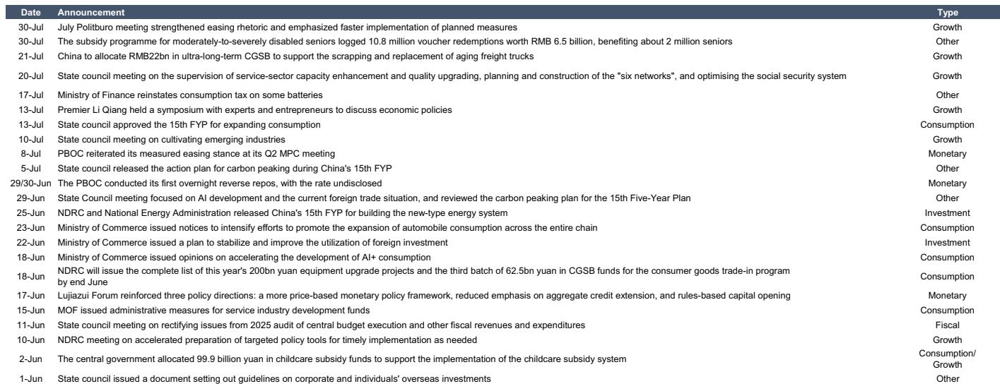
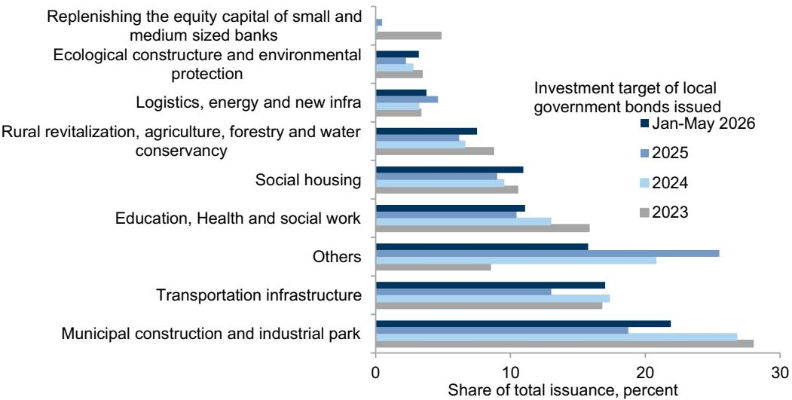

# GS：行业规则与主题变化观察

GS在7月31日更新的中国宏观环境活动与政策追踪报告中，将观察频率从月度提升至每周。调整的直接原因是能源价格供给冲击对宏观环境活动的传导需要更细颗粒度的追踪。这份报告覆盖消费与出行、生产与研究、其他宏观活动、市场与政策四组高频指标，其中最有信息量的部分不在单一数据的涨跌，而在几组数据之间的相互印证。

报告显示，7月最后一周30城新房日均成交面积环比回升，且高于去年同期水平；16城二手房日均成交面积环比回落，但仍高于去年同期。出行方面，国内客运航班量环比小幅下降，航班取消率环比上升，交通拥堵指数回落至与去年同期大致相当的水平。消费端信号并不一致：国家统计局消费者信心指数6月小幅回落，Morning Consult的消费者信心指数在过去一周也出现节奏变化。

> **KC评论：** 新房成交回升与消费者信心回落同时出现，说明当前地产成交的改善更多由供给端推盘和政策窗口驱动，而非居民收入预期修复的结果。两组数据放在一起看，比单独看任何一组都更有判断价值。

生产端延续了需求侧的谨慎基调。钢材需求连续回落，钢材产量同步下降；沿海省份电厂日耗煤量环比回升且高于去年同期，这与高温天气下的电力需求有关，未必代表工业活动扩张。港口集装箱吞吐量环比上升，但20个主要港口离港船舶货运量环比下降，出口动能的持续性仍需观察。GS的大宗商品团队将中国石油需求nowcast下调至每日1650万桶，同时可见原油库存环比增加，量价关系显示短期需求读数偏弱。

地方债发行是这份报告中值得单独关注的变量。截至7月末，年内地方政府专项债发行规模已达2.4万亿元。资金投向结构中，市政建设和产业园区在1-5月仍占最大份额。报告同时披露，经季节调整后，7月全国和地方层面的反腐代理指标均有所上升，该指标统计每月被宣布接受调查的政府官员数量。反腐节奏与项目落地速度之间的关系，是后续观察财政传导效率时不能忽略的维度。

政策层面，7月30日政治局会议强化了宽松措辞，并强调加快落实已规划措施。6月以来的一系列政策公告覆盖消费、研究、货币和财政多个方向：商务部推动汽车全链条消费扩张，发改委将在6月底前公布2000亿元设备更新项目清单及第三批625亿元消费品以旧换新超长期特别国债资金，财政部对部分电池恢复征收消费税，国务院发布“十五五”碳达峰行动方案。货币政策方面，央行在6月末首次开展隔夜逆回购操作，利率未披露；陆家嘴论坛明确了更加价格型的货币政策框架、降低对总量信贷扩张的侧重、以及规则化资本开放三个方向。

> **KC评论：** 政策密度不低，但市场更关心的是执行节奏。2.4万亿元专项债发行进度与政治局会议“加快落实”的表述之间的差距，基本决定了下半年基建和财政乘数的弹性空间。

这份报告的价值在于提供了一套可复用的观察框架：将需求侧的成交与信心数据、生产侧的产量与库存数据、政策侧的公告与资金落地数据放在同一时间轴上对照，而不是孤立解读任何单一指标。对于关注中国宏观环境的研究者，每周跟踪这四组数据的相对变化，比等待月度或季度数据公布更能捕捉拐点信号。报告将追踪频率改为每周，本身也说明当前阶段数据变化的信号密度高于往常。

For informational purposes only. Portions may be generated,translated,summarized,or edited with AI assistance based on source materials and may contain omissions or errors. Please verify independently. This is not investment,legal,tax,accounting,or other professional advice.

For informational purposes only. Portions may be generated,translated,summarized,or edited with AI assistance based on source materials and may contain omissions or errors. Please verify independently. This is not investment,legal,tax,accounting,or other professional advice.

