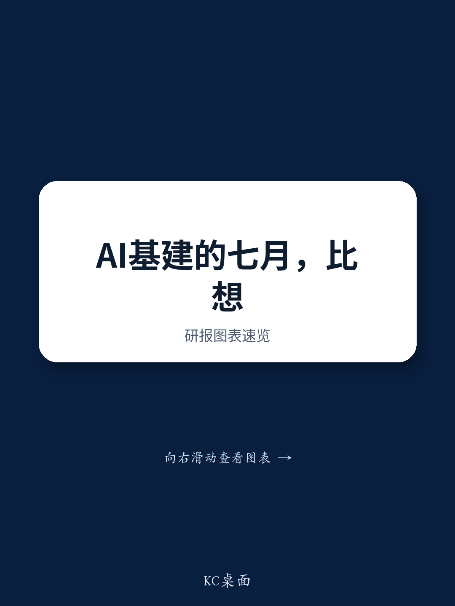

# GS：美洲科技硬件AI项目进展-2026年7月

这份GS研究梳理了2026年7月AI基础设施领域的主要项目进展，覆盖neocloud、主权AI与企业端三个层面。最值得注意的信号不是单个项目的规模，而是芯片厂商开始以收入保底和收益分成的方式介入算力流通环节——这正在改变AI算力的供给逻辑。

报告显示，英伟达向其neocloud客户提供GPU容量的最低收入保障，作为交换，英伟达在客户收入超过一定水平后参与分成。Firmus和Sharon AI是这一模式的两个早期合作方。这种"算力承销"机制降低了neocloud扩张的闲置不确定性，也让更多终端客户能够获得算力供给。GS认为，这对DELL和SMCI等AI服务器厂商构成持续需求支撑。

## 1. 英伟达以收入保底换取分成，算力流通机制出现变化

英伟达与Firmus在印尼Batam合作建设的360MW AI工厂园区是这一模式的具体案例。该园区规划配备17万颗英伟达加速器，覆盖Grace-Blackwell、Vera-Rubin和Vera系列，预计2027至2028年投运。英伟达既获得标准产品收入，也按约定比例分享云服务收入。

Sharon AI与一家未具名AI实验室签署了五年期、价值13.2亿美元的云计算合同，并将在新西兰部署其首个AI Factory，规划132MW总容量，其中116MW已签约，预计到2027年中部署超过6.2万颗英伟达GPU。这份合同包含9.5亿美元云服务协议和12.5亿美元容量协议。

> **KC评论：** 英伟达从卖芯片延伸到为算力流通背书，相当于把芯片销售和云服务运营的不确定性部分绑定。对neocloud来说，这降低了空置不确定性；对英伟达而言，这是在硬件收入之外建立经常性收益通道。观察后续是否有更多芯片厂商跟进这一模式，比关注单个订单金额更有意义。

## 2. 企业端AI应用从试点转向替代成熟软件

星巴克被报道正在开发内部AI辅助工具，用于库存追踪和维护管理，意图替代来自微软、IBM和Oracle的第三方软件。Bloomberg报道称，星巴克企业技术团队的目标是将预算削减约3000万美元，其中包括约1000万美元的软件支出。星巴克年度软件支出约为4亿美元，部分工具可能在2027年底前上线。

英国资金科技公司Revolut则展示了另一种路径。该公司在Nebius Cloud上使用H1000 GPU预训练了名为PRAGMA的行为模型，统一了原先分散的机器学习管线。Revolut的欺诈、信贷、营销和产品团队现在共享这一模型进行推理任务，报告称欺诈案件捕获量增加65%，信贷违约不确定性识别准确率提升2.3倍，产品提到相关性提高41%。

GS认为，企业端AI采用扩大对面向企业的硬件OEM（DELL、HPE）和IT分销商（SNX、INGM）构成利好。

## 3. 主权AI项目从概念进入执行阶段，区域分布多元化

7月的主权AI项目显示，这一领域已从政策宣示转向具体基础设施研究。Pantheon Atlas在克罗地亚Topusko的1GW超大规模AI数据中心园区获得电网接入批准，总研究500亿欧元，首期120亿欧元，按英伟达GW-Scale AI Factory标准设计，计划2027年初开工，2029年一季度投运。

沙特阿拉伯方面，Napster、DETECON AL SAUDIA（DETASAD）与联想合作，在利雅得部署完全本地化的主权AI基础设施，包括Tier III/Tier IV数据中心能力、托管运营和网络安全服务，并计划扩展至海湾合作委员会其他国家。

## 4. 大型科技公司与资管机构合作持有数据中心资产

Meta与BlackRock达成战略合资协议，在得克萨斯州El Paso开发并持有1GW AI数据中心园区。BlackRock管理的产品持有80%权益，Meta保留20%，项目总研究140亿美元，预计2028年开始分批上线，租期最长20年（初始4年，含四个5年续约选项）。

这一结构值得关注：科技公司不再独自承担数据中心的重资产负担，而是引入资管机构的长期资本共同持有。IREN则在7月20日宣布获得28亿美元新客户合同，客户包括微软、英伟达、Perplexity、Figure AI等，并将2026年年度经常性收入目标提高至40亿美元以上。

> **KC评论：** 数据中心的所有权结构正在分化。一边是BlackRock这类资管机构以财务参与者身份进入，另一边是Nebius推出轻资产模式——由合作伙伴融资并持有物理基础设施，Nebius提供系统架构、软件栈和销售能力。两种模式都在降低单一主体的资本占用，但不确定性分配逻辑不同，前者靠长期租约锁定回报，后者靠平台运营能力获取分成。

## 5. 观察框架：从项目公告中识别算力供需的真实信号

面对每月大量的AI基础设施公告，可以建立三个筛选维度。第一，看融资结构而非项目规模——谁出资、谁持有、谁承担闲置不确定性，比总装机量更能说明项目的商业可行性。第二，看客户签约而非规划容量——IREN的28亿美元合同和Sharon AI的13.2亿美元合同都明确了客户和签约时间，而部分项目仍停留在土地和电力审批阶段。第三，看算力流向——英伟达的收入保底机制、Nebius的轻资产扩张、Meta与BlackRock的合资结构，分别代表了芯片厂商、云平台和科技公司在算力供给中的不同不确定性承担方式。

报告也提示，这些项目公告是选择性呈现，不代表AI基础设施机会的全貌。部分项目的客户身份未披露，实际投运时间仍取决于建设和并网进度。

For informational purposes only. Portions may be generated,translated,summarized,or edited with AI assistance based on source materials and may contain omissions or errors. Please verify independently. This is not investment,legal,tax,accounting,or other professional advice.

