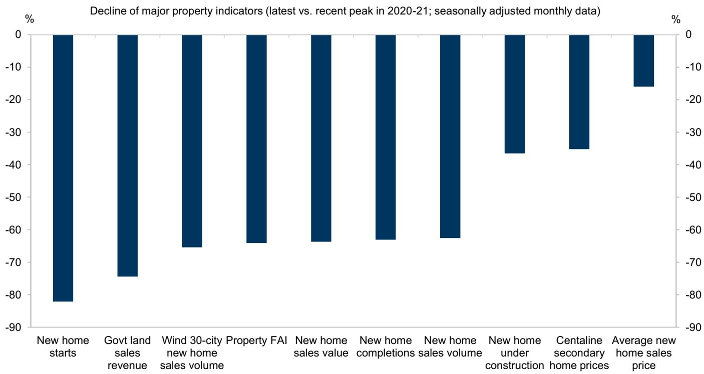
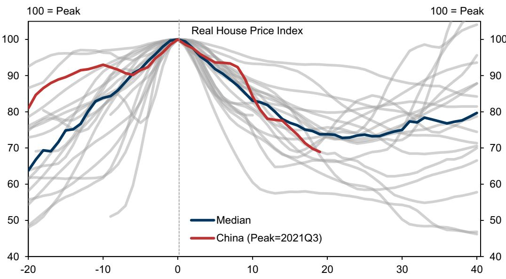
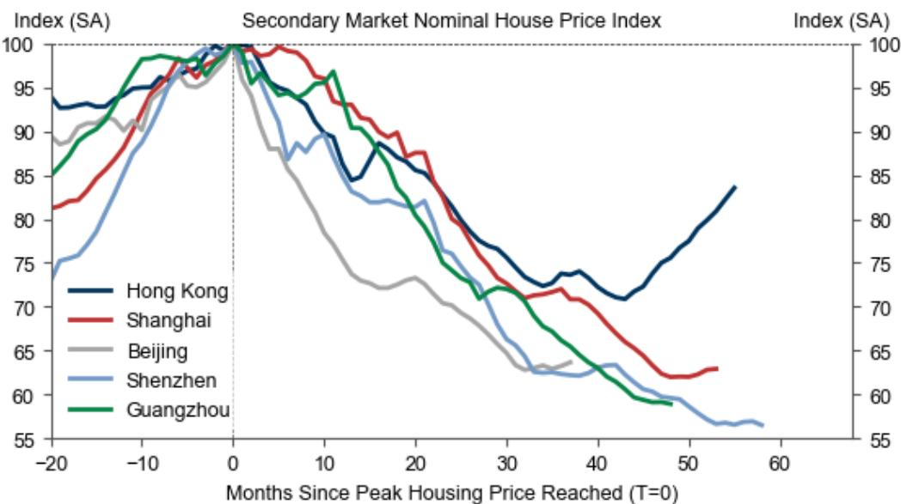

# 中国2026年上半年投资周期观察：政策节奏的调整与后续空间

中国投资周期在2026年上半年经历了一轮完整的起伏，而这一过程的形态比最终结果更具参考意义。实际投资增速从2025年四季度的同比2.0%升至2026年一季度的3.2%，随后在二季度回落至2.1%。反弹真实但短暂，而回落并非仅由私人需求偏弱所致。直接原因在于，在全球经济给中国制造业带来新一轮能源供应冲击之际，财政政策出现了明显的阶段性收紧。据某国际投行经济团队估算，负面的财政脉冲贡献了二季度实际GDP环比增速放缓的近一半——从一季度环比年化5.3%降至二季度的3.6%。

这并非市场失灵的故事，而是政策节奏安排的问题。在强劲的一季度GDP和出口数据支撑下，决策层选择在二季度放慢了政府债券发行和预算外融资的节奏，与此同时地方官员面临的反腐与问责压力也使其支出行为更加谨慎。结果是财政收缩放大了外部冲击，而非起到缓冲作用。好消息是，下半年的政策空间相对清晰：政府具备财政余力、政策授权和制度工具来扭转此前的收紧态势。关键在于能否及时行动，避免二季度的放缓演变为更持久的减速。

当前投资领域存在三个结构性分化：国有企业与民营企业之间、内陆省份与沿海地区之间、高技术制造业与其他行业之间。每个分化都对应着下一轮政策支持可能落地的方向——以及不会触及的领域。报告自建的投资跟踪指标对官方固定资产投资数据中的统计偏差进行了调整，相比总量数据能更清晰地呈现这些结构性特征。

## 官方固定资产投资数据波动被放大，但潜在放缓确实存在

如果仅依赖官方固定资产投资数据，会得出中国投资周期剧烈波动的结论。国家统计局近期对部分此前高报的数据进行了“统计修正”，这放大了近几个季度官方固定资产投资数据的波动。报告采用的替代指标——包括建筑业新签合同、钢材和水泥产量以及投资相关PMI——均指向二季度出现温和但明确的放缓。

这一区分对解读至关重要。实际固定资产投资隐含的商品需求波动远大于钢材和水泥的实际产量，表明官方数据在一定程度上扭曲了真实图景。钢材和水泥是实物投入品，事后无法进行统计修正。它们在二季度的回落确认了投资放缓的真实性，但其相对有限的波动幅度说明实际降幅并不像官方固定资产投资总量数据所暗示的那么剧烈。报告跟踪指标通过对商品增加值应用分行业乘数，测算出二季度实际投资增速为同比2.1%——较一季度的3.2%有所回落，但仍为正值，远非对官方数据的简单解读所暗示的“崩塌”。

放缓的结构同样具有信息量。官方固定资产投资数据的波动主要集中在建筑安装活动，而设备购置仍保持正贡献。这一区分至关重要。建筑安装支出与房地产开发和地方基建项目高度相关——恰恰是政策收紧和地方谨慎态度影响最直接的领域。相比之下，设备购置反映的是制造业投资，尤其是中央政策积极引导资源的高技术领域。设备购置在建筑支出波动时仍保持正增长，说明政策驱动的投资向战略性产业转移正在按计划推进，即便整体投资周期有所走弱。

对观察者而言，这意味着官方固定资产投资数据作为衡量潜在动能的指标，其可靠性已有所下降。报告跟踪指标平滑了统计噪声，是更好的参考。它显示的经济正在减速但并未失速，且投资结构正在发生总量数据难以呈现的变化。

## 二季度财政收紧是主动选择而非意外，其影响已有所显现

二季度财政脉冲转负，原因更多在于政治层面而非经济层面。一季度强劲增长和出口韧性降低了高层加码宽松的紧迫感，而地方官员在政治过渡和反腐压力下变得更加谨慎。报告的反腐强度代理指标在二季度仍处高位，被调查官员数量持续增加。这为地方干部形成了强烈的激励，避免可能引起关注的激进支出行为，即便项目本身合规。

财政数据印证了收紧态势。二季度政府收入在PPI上行和征管力度加强的支撑下继续增长，但支出环比下降。基建相关财政支出——包括节能环保、农林水、交通运输和城乡社区事务——放缓尤为明显。政府债券发行开始落后于2025年的节奏，资金拨付进度也有所放缓。有效财政赤字率在四季度移动平均基础上收窄，财政存款相对去年同期仍处高位，表明资金沉淀在政府账户中而非投入实体经济。

预算外融资的收缩更为显著。作为地方政府重要资金来源的土地出让收入延续了两位数的同比下滑。政策性银行支持大幅收缩，PSL和债券净发行均有所下降。这些并非边际调整，而是在全球能源供应冲击已对增长形成压力的背景下，投资管道获得的金融支持出现了实质性缩减。

报告估算负财政脉冲贡献了近一半的GDP环比放缓，这一量化结果清晰呈现了政策节奏的影响。这意味着若没有二季度的财政收紧，二季度增长年化水平可能接近4.5%而非3.6%。这不是微不足道的差异——它介于温和减速与接近停滞之间。收紧是主动选择，这既令人遗憾，也意味着反转的可能性更大。

## 房地产行业仍是关键约束，下行周期已超过美国次贷危机时期

房地产行业的新屋开工降幅已超过全球金融危机期间美国房地产泡沫破裂时的水平，房价跌幅也略大于上世纪60年代以来全球“大型房地产下行周期”的平均幅度。多数房地产活动指标较2020-21年峰值下降60%至80%，其中新屋开工和土地出让收入降幅居前。开工与竣工之间的领先滞后关系意味着，当前开工端的疲弱将持续压制未来数年的建筑活动和竣工量。

积极信号存在但较为集中且脆弱。香港房价自2025年年中以来回升约18%，内地部分一线城市出现初步企稳迹象。在新建商品住宅销售改善的带动下，住宅库存近月有所消化。但自2024年底以来，房地产宽松政策的推进节奏明显放缓，政策应对呈渐进式而非变革式。新增按揭利率仍高于住宅租金回报表现，意味着购房出租仍是负carry交易。这一根本性定价失衡将继续抑制投机性购房，限制复苏空间。

房地产行业的调整不仅是住房问题，也是财政问题。土地出让一直是地方政府的重要资金来源，其收缩直接加剧了前述财政收紧。报告指出，二季度土地出让收入在多项口径下均保持两位数同比下滑，国家统计局已暂停发布开发商土地购置金额数据——这本身就说明官方数据已面临较大压力。银行业对房地产行业的贷款继续同比收缩，且二季度降幅有所扩大。

国际比较值得关注。中国房价跌幅略大于上世纪60年代以来15个经济体大型房地产下行周期的平均幅度，新屋开工降幅已超过美国次贷危机时期的经验。这并非普通的周期性下行，而是仍在消化过程中的结构性调整。报告数据表明，房地产行业在可预见的未来仍将对投资和财政收入形成拖累，一线城市的积极信号短期内不太可能快速扩散至更广泛的市场。

## 投资展望需要财政重新发力，政策信号已趋于一致

报告将2026年全年固定资产投资预测下调了GDP的0.5个百分点至11.5%，将固定资本形成总额预测从同比2.5%下调至2.0%。但预测仍隐含下半年温和扩张，报告作者预计财政立场将从二季度的增长拖累转为下半年的温和推动力。逻辑清晰：政府具备财政空间，债券发行额度尚未用尽，政策信号正指向加速。

7月政治局会议提出“加大逆周期调节力度，着力扩大国内需求、优化供给结构”，这是决策层认识到需要政策支持的最明确信号。报告预计中央和地方政府将在未来数月加快债券发行和资金拨付进度，并加快8000亿元新政策性金融工具的落地实施。若需要，年内仍有进一步宽松的空间。

支出重点继续偏向高技术制造业、战略性供应链、绿色转型、城市更新和“六大网络”项目。这是明确的产业政策选择：政府正利用财政资源加速经济结构转型，即便房地产和传统基建对增长形成拖累。结果是双轨投资周期——政策支持领域稳健增长，市场驱动领域停滞或收缩。

风险双向存在。上行风险可能来自额外的预算外资金和新的需求侧措施，这将提供超出当前预期的更大刺激。下行风险源于中央层面可能延续的乐观情绪——正是这种情绪导致了二季度的收紧——以及地方执行层面的约束增加。反腐行动对治理而言是必要的，但对地方支出产生了难以量化但在数据中清晰可见的抑制效应。

## 应对中国双轨投资周期的分析框架

对市场参与者和企业战略制定者而言，报告的发现可转化为一个实用的分析框架。第一步是认识到中国投资周期已不再是单一周期，而是由不同力量驱动的两个并行周期。政策驱动周期——高技术制造、战略性供应链、绿色转型、城市更新——受中央财政支出支撑，无论整体放缓程度如何，都可能保持较强韧性。市场驱动周期——房地产、传统基建、地方项目——受财政收紧、反腐压力和结构性过剩约束，可能持续偏弱。

第二步是区分官方数据与实际情况。国家统计局的统计修正使官方固定资产投资总量数据可靠性下降，报告的替代指标——商品产量、建筑合同、PMI——能更好地反映实际动能。应建立基于实物指标的跟踪体系，而非依赖报告期总量数据。

第三步是密切跟踪财政传导机制。关键指标不是政治局会议表态，而是债券发行的实际节奏、资金拨付进度和预算外融资情况。报告指出财政存款仍处高位，意味着大量资金沉淀在政府账户中等待投放。当投放加速时，投资周期将随之响应。二季度的收紧是政策选择，同样可以快速反转。

第四步是认识房地产行业的持续拖累并相应调整预期。下行周期已超过历史基准，领先滞后关系意味着即便新建住宅销售企稳，阵痛仍将持续。一线城市的积极信号真实但范围有限，按揭利率与租金回报表现之间的根本性错配尚未解决。在错配得到修正之前，对房地产相关领域——无论是开发商、建材还是地方融资平台——应保持审慎态度。

最后一步是为政策转向做好准备。政策空间清晰可见：政府具备财政余力、政策授权和制度工具来扭转二季度的收紧。7月政治局会议提供了政策方向，后续落地实施可能在数月内跟进。报告预测隐含下半年温和扩张，但如果外部环境进一步恶化，风险偏向更大规模的刺激。即使时机和规模尚不确定，也应对下半年财政发力保持关注。

上半年的周期起伏反映的是政策节奏问题，而非结构性失灵。中国经济的内在动能仍然积极，但越来越依赖政策支持来对冲房地产拖累和外部冲击。2026年下半年将检验决策层能否从二季度的经验中吸取教训，在放缓固化之前有效运用财政资源。信号是积极的，但最终验证将体现在债券发行数据中，而非政策表态中。

*仅供参考。部分内容可能基于原始材料由AI辅助生成、翻译、摘要或编辑，可能存在遗漏或错误。请独立核实。本文不构成投资、法律、税务、会计或其他专业建议。*
