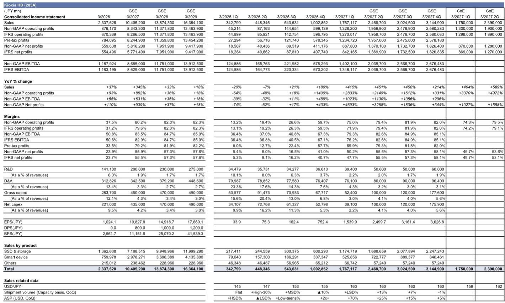
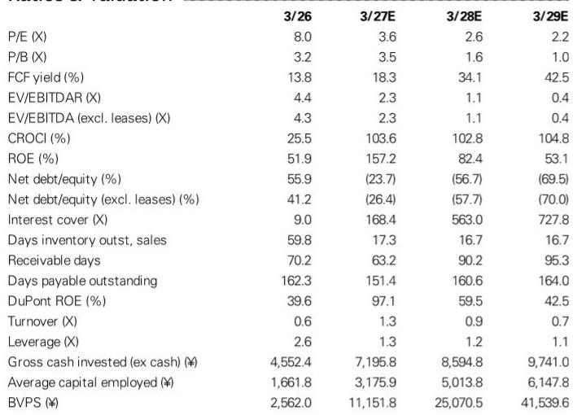
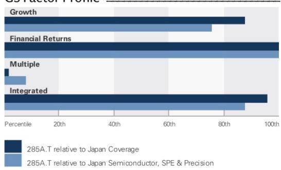

# 铠侠的盈利引擎已不再呈现周期性，市场尚未充分认知其持续性

铠侠最新业绩中最引人注目的数字，并非季度运营利润1.33万亿日元，也非下一季度指引的1.9万亿日元，而是基于该指引所隐含的估值水平——截至2027年3月财年的市盈率约为3.6倍，下一财年约为2.6倍。一家投入资本回报率超过100%、净现金头寸正迈向1.5万亿日元、且管理层刚刚宣布8000亿日元回购计划的半导体存储企业，其报价却仿佛其盈利能力将在下行周期初现端倪时迅速消散。市场正在将NAND闪存的历史剧本套用于一家已从根本上改变自身业务经济模型的公司。

7月31日收盘后公布的第一季度业绩略低于一致预期，但总体在预期范围内。非GAAP运营利润1.33万亿日元，低于某全球投资银行估计的1.42万亿日元和彭博一致预期的1.37万亿日元，但差异可归因于可识别的非经营性项目：约500亿日元的年度专项员工奖金，以及560亿日元的IFRS口径诉讼拨备和股权激励费用。出货量在第二季度也有所回落，掩盖了潜在需求的强度。第二季度非GAAP运营利润指引为1.9万亿日元，与该投行估计的1.97万亿日元及一致预期的1.95万亿日元较为接近。

重要的不是单季度本身，而是指引所揭示的这轮盈利周期的持续性。管理层预计以美元计价的收入环比增长34%，其中价格贡献大于出货量增长。第二季度约一半的出货量已锁定价格，其余部分正在协商中。对于一家历史上始终无法将定价权维持足够久以产生持续自由现金流的公司而言，这种定价可见性是一种结构性转变，而非周期性波动。

市场的怀疑可以理解，毕竟行业过往留下了深刻印记。NAND闪存二十年来一直是竞争激烈的业务，以繁荣-萧条周期、同质化和长期产能过剩为特征。惯性思维是任何盈利激增都会在18至24个月内被新增供给抹平。但铠侠的业绩、指引、资本配置和客户合约中积累的证据表明，这一轮周期在性质上有所不同，而不仅仅是程度上的差异。需求驱动力已不再是智能手机和个人电脑——这些领域的出货量增长已趋饱和，换机周期较长。现在的驱动力是推理和智能体AI，其计算架构本身对存储的消耗速度已超出行业扩充产能的能力。

## 需求曲线形态已改变，AI推理正在重写NAND的增长逻辑

铠侠管理层明确指出，推理和智能体AI对NAND的需求正在显著增长，但仍处于起步阶段。公司预计非常强劲的需求将持续并超过供给，直至2027日历年。这是一个三年的可见性窗口，对于大宗存储供应商而言非同寻常。历史上，NAND需求预测的可靠周期大约只有两个季度便会面临修正。现在的不同之处在于，AI推理工作负载不仅仅是在消耗更多存储空间；它们正在改变计算与存储的比例关系，从而使单台服务器的NAND含量成倍增加。

智能体AI系统通过串联多次推理调用来完成任务，对存储尤为敏感。智能体工作流中的每一步都需要读写模型权重、中间状态和上下文窗口。存储占用随步骤数量扩展，而不仅仅取决于模型规模。这就是铠侠认为尽管行业在扩充产能，需求仍将持续超过供给直至2027年的原因。AI推理仍处于起步阶段，当前AI服务器的存量仅相当于三年后规模的一小部分。

第二个层面的含义是，NAND需求对价格的弹性正在降低。在消费和移动市场中，20%的涨价会抑制需求，因为OEM厂商会推迟采购或减少存储配置。而在AI推理场景中，存储成本仅占系统总成本的一小部分，额外存储的边际价值很高，因为它直接降低延迟并支持更复杂的智能体工作流。服务器运营商不会为了节省3%的系统成本而牺牲推理性能。这种低弹性使得铠侠能够在季度开始前就锁定第二季度一半出货量的价格。

供给端同样受限。NAND制造是资本密集且技术难度极高的行业，领先节点的晶圆厂每条产线需要数十亿美元投入。行业已整合为少数几家参与者，2022-23年下行周期后形成的资本纪律得以延续。铠侠明确表示将继续进行有纪律的投资，强调盈利而非追逐市场份额。这句话在以往的上升周期中从未出自NAND制造商之口。公司还指出，如果需求大幅上调，其有灵活性增加资本开支，但默认姿态是资本纪律。

## 回购是信心的信号，而非仅仅是资本回报机制

铠侠宣布了最高8000亿日元的股份回购，涉及3000万股，约占已发行股份的5.5%，同时公布了3比1的股票分割计划，登记日为9月30日。时机选择颇具深意。回购决议是在股价快速回调后做出的，管理层明确将其描述为改善资本效率的良好机会。一个对自身现金流生成能力有足够信心、在市场恐慌时刻部署8000亿日元的管理团队，正在传递一个信号：盈利轨迹不存在疑问。

资本配置政策保持不变：在资本开支、研发和人力资本投入之后，铠侠将约50%的剩余现金流用于股东回报。但公司补充称，正在探索包括股息在内的额外股东回报方式，因为从第二季度起现金将持续积累。资产负债表轨迹支持这一判断。净债务预计将从2026财年的5770亿日元转为2027财年1.57万亿日元的净现金头寸，2028财年达7.7万亿日元，2029财年达15.5万亿日元。自由现金流预计2027财年为3.85万亿日元，2028财年为7.18万亿日元，2029财年为8.94万亿日元。

这些数字与3.6倍前瞻市盈率的报价难以调和。市场实际上是在假设当前盈利水平是周期性峰值，将在两年内回归历史平均盈利。但资本回报计划是对这一假设的直接反驳。一家回购5.5%已发行股份、自由现金流回报表现达18%至42%的公司，其行为方式不像是一个预期下行周期的管理团队。它更像是一个相信盈利能力具有持续性、且市场对该股权定价存在偏差的管理团队。

股票分割也是一个信号，尽管更为微妙。在股价约为11.6万日元时进行3比1分割，使每股价格进入散户读者更容易触及的范围。这不仅仅是表面功夫；它扩大了股东基础并增加了流动性。与回购相结合，表明管理团队在积极管理其资本市场形象，而非被动地报告业绩。该全球投资银行的报告指出，此举很可能使铠侠赢得一个能够在资本市场灵活行动的管理团队声誉。这种声誉本身具有价值，因为它降低了股权成本，并为公司未来的融资提供了更多选择。

## 长期协议是需求可见性与投资确定性之间的结构性桥梁

铠侠管理层从三个角度将长期协议视为重要战略：长期需求可见性、增长投资支撑以及与关键客户的技术合作。公司表示在2028日历年出货量50%的LTA覆盖率目标方面正稳步推进，部分谈判已开始涉及2028年以后的期间。这是整个故事中最被低估的方面。

在以往的NAND周期中，产能投资基于推测性的需求预测，预测与现实之间不可避免的错配产生了繁荣-萧条模式。LTA从根本上改变了这一动态。当超大规模云服务商或服务器OEM签署覆盖2028年特定NAND数量的LTA时，实际上是在为产能投资提供担保。铠侠可以在确信产出已售出的情况下承诺资本开支。这降低了业务的风险特征，并支撑更高的估值倍数，即使盈利的相对水平存在波动。

2028年50%覆盖率目标意义重大，因为它意味着公司未来收入的一半在产能建成之前就已签约。剩余50%将在现货市场销售，如果需求强于预期则提供上行空间，如果需求弱于预期则提供缓冲。这与100%在现货市场销售的公司有着根本不同的风险特征。LTA结构还使铠侠能够与关键客户进行技术合作，这意味着铠侠正在与将消费这些产品的公司共同开发下一代存储解决方案。这创造了转换成本，并将关系深化到简单的买卖交易之外。

报告指出，2028年以后的期间谈判已开始，这意味着LTA覆盖范围超出了当前预测视野。这是一个领先指标，表明铠侠的客户也相信需求具有持续性。超大规模云服务商不会为预期供过于求的产品签署多年协议。他们愿意提前数年承诺数量和价格条款，这是NAND需求曲线已发生永久性转变的最有力证据。

## 盈利周期已上移，市场尚未与这一现实达成和解

该全球投资银行的预测修正颇具说明性。该行将2027财年运营利润预测下调1%以计入拨备，但将2028和2029财年预测分别上调3%和4%，主要由于美元兑日元汇率假设从155调整至160。修正的方向比幅度更重要。该行并非因需求走弱而下调预测；而是在调整一次性项目和汇率因素。潜在盈利轨迹完好无损。

以任何历史标准衡量，运营利润率轨迹都非同寻常。EBIT利润率预计2027财年为79.6%，2028财年为82.0%，2029财年为82.3%。对于一家制造企业而言，这些利润率几乎闻所未闻。它们反映了供给紧张、需求低弹性以及高利用率晶圆厂固有的运营杠杆的综合作用。EBITDA利润率预计在82.9%至85.0%之间，意味着公司在折旧前几乎将所有收入转化为现金流。

投入资本回报率预计2027财年为103.6%，2028财年为102.8%，2029财年为104.8%。一家在单一年份赚取超过其全部资本基础的公司，正在以足以证明相对账面价值大幅溢价的速率创造经济价值。市净率预计2027财年为3.5倍，2028财年降至1.6倍，2029财年降至1.0倍。一家以账面价值交易、同时实现100%资本回报率的公司，要么被严重低估，要么市场正在预期盈利将灾难性下滑。

市场的怀疑植根于历史模式，但历史模式已不再适用。NAND行业已整合，需求结构已改变，合约机制已演进。铠侠已不是经历2018-19年和2022-23年下行周期的同一家公司。它拥有不同的成本结构、不同的客户基础和不同的资本配置理念。市场最终会认识到这一点，但这种认识可能只有在连续数个季度盈利超预期之后才会到来。

## 评估这轮周期是否不同的决策框架

对于观察者而言，问题不在于铠侠当前盈利是否便宜，而在于盈利是否具有持续性。构建判断框架的依据来自本报告中的证据。第一个检验是需求可见性。铠侠对需求超过供给拥有三年可见性，LTA覆盖率接近2028年出货量的50%，且谈判延伸至更远期间。这不是预测；这是合约现实。第二个检验是定价能力。公司在季度开始前已锁定第二季度一半出货量的价格，管理层预计价格对收入增长的贡献将大于出货量。一家能够提前设定价格的公司，并不面临历史上困扰该行业的大宗商品动态。

第三个检验是资本纪律。铠侠明确将盈利置于市场份额之上，其资本开支计划可根据需求修正灵活调整。这与以往导致下行周期的行为截然相反——彼时制造商在上升市场中竞相扩充产能，然后降价以填满晶圆厂。第四个检验是资产负债表实力。公司正从净债务转向净现金头寸，预计2029财年将达到15.5万亿日元。拥有如此资产负债表的公司能够抵御任何下行周期，并具有通过回购和股息向股东返还资本的灵活性。

第五个检验是管理层行为。在股价大幅下跌后执行的8000亿日元回购，展示了言语无法匹敌的对盈利轨迹的信心。管理层正在用自己的资本为其预测背书。第六个检验是客户基础的结构。AI推理客户不像消费OEM那样对价格敏感，且其需求正从较小的基数增长。AI推理仍处于起步阶段，意味着增长仍在前方，而非身后。

应用这一框架，证据指向一个具有持续性的盈利周期。市场对铠侠的定价仿佛历史模式将重演，但需求、供给和合约机制的结构性变化表明情况并非如此。风险不在于周期转向；而在于市场花费太长时间才认识到周期已被新的均衡所取代。对于能够透视拨备和出货节奏等短期噪音的观察者而言，机会在于拥有一个以市场尚未定价的速率产生现金流的业务。

最后的考虑是当市场确实认识到这种持续性时会发生什么。该全球投资银行的观点是，随着市场认识到未来两到三年的盈利水平将高于其预期且具有可持续性，估值倍数将扩张。盈利已经在那里；倍数才是变量。随着资产负债表积累现金、回购减少股份，每股盈利轨迹将变得更加引人注目。

铠侠不再是一只周期性股票。它是一个穿着存储制造商外衣的结构性增长故事。市场尚未看穿这层外衣，但证据正在积累。未来几个季度将决定市场是否最终接受数据一直在说明的事实。

*仅供参考。部分内容可能基于原始材料由AI辅助生成、翻译、摘要或编辑，可能包含遗漏或错误。请独立核实。本文不构成投资、法律、税务、会计或其他专业建议。*

仅供参考。部分内容可能基于原始材料由AI辅助生成、翻译、摘要或编辑，可能包含遗漏或错误。请独立核实。本文不构成投资、法律、税务、会计或其他专业建议。

