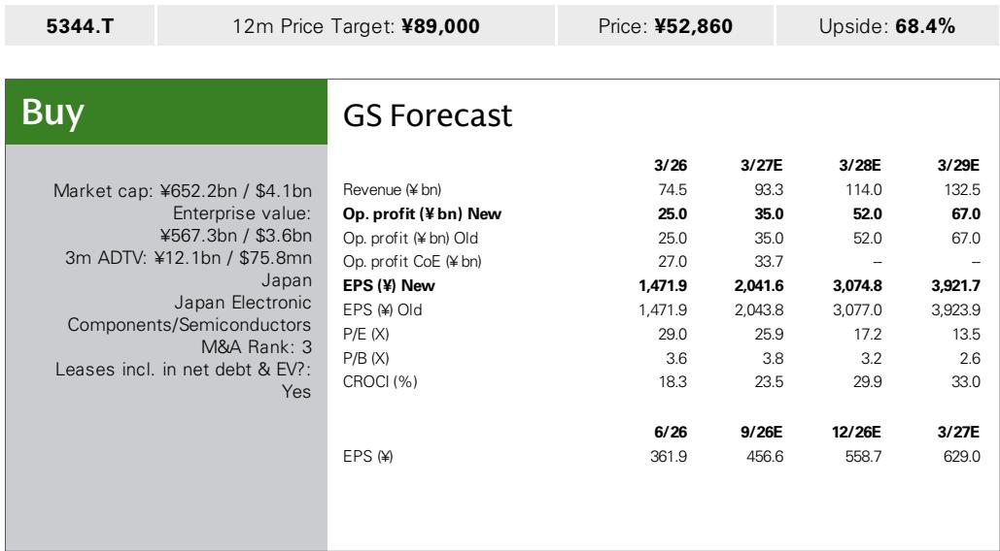
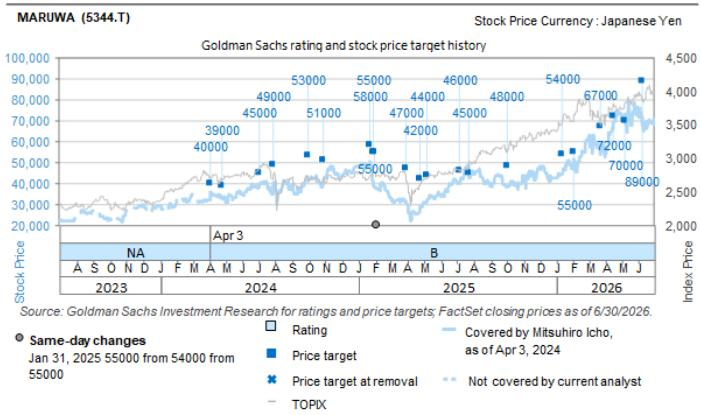

# GS：MARUWA与AI及近期数据观察

7月31日上午，日本陶瓷元件厂商MARUWA举行一季度业绩说明会。GS当天发布的纪要显示，公司对AI应用全年销售增长的指引从原先的+50%大幅上调至+110%，并将半导体应用全年增长指引从+14%上调至+20%。这不是一次常规的季度微调，而是伴随CPO产品确认四季度导入、两处工厂产能提前启动的一连串动作。

这份报告最值得关注的判断是：MARUWA管理层对AI相关需求的可见度正在从“预测”转为“已确认订单”，而产能投放节奏的提前则说明需求强度已超出年初规划。，但认为当前指引仍存在进一步上修空间。

## 1. AI应用指引上调至110%，CPO产品四季度开始导入

通信部门一季度销售额为92亿日元。管理层将AI应用全年销售增长指引从+50%大幅上调至+110%，理由是年初的强劲预测已转化为确认订单，可见度明显改善。公司预计濑户第二工厂从三季度开始量产并贡献收入，第三工厂原定于FY3/28完工投产，虽然季度排期尚未确定，但管理层明确表示将采取措施提前生产。

CPO相关产品从四季度开始导入是此次AI指引上调的直接因素之一。报告显示，该产品线的订单规模已经很大，量产安排在FY3/28。这意味着CPO不再只是技术储备，而是已经进入可确认收入的阶段。

> **KC评论：** 指引从+50%跳到+110%，不是渐进式修正。CPO产品四季度导入且订单已具规模，说明AI光模块产业链的需求传导比市场此前预期的更早到达陶瓷基板环节。

## 2. 半导体应用上调至+20%，三春工厂两栋新楼提前启动

半导体部门一季度销售额为22亿日元，公司预计二季度约30亿日元，下半年每季度超过30亿日元。全年销售增长指引从+14%上调至+20%，但管理层语气暗示，以当前询单强度看仍有上行可能。

产能端的变化更直接：三春工厂两栋新楼的启动时间从原定的下半年提前到二季度，产能较此前水平增加至少50%。报告指出，这将形成能够应对未来需求增长的生产体系。把产能提前一个季度以上投入，通常意味着在手订单能见度已经足够支撑新增折旧。

## 3. 汽车部门指引小幅上修，xEV与差异化产品支撑增长

汽车部门一季度销售额为35亿日元，xEV应用销售保持稳健。主要现有客户的询单在增加，公司预计差异化产品将实现销售增长。全年销售增长指引从+2%上修至+6%。

这个幅度不算大，但方向与通信、半导体部门一致。三个终端部门指引同时上修，说明需求不是单一产品线的偶发波动，而是公司整体业务组合在同步走强。

## 4. 一季度利润率环比下降的成因与二季度预期

一季度营业利润符合公司预期。营业利润率环比下降的主要原因是：一季度出货了四季度生产的在产品库存，而当时新产品出现了良率问题。这批低利润率库存的出货已在一季度全部完成，管理层因此预计利润率从二季度起改善。

这是一个值得留意的细节。良率问题导致的低毛利库存一次性出清，意味着二季度的利润率基数会更干净。GS在报告中维持FY3/27-FY3/29营业利润预测不变，仅对季度分布和每股收益做了不到1%的微调，也印证了这一判断。

## 5. 观察框架：如何判断指引是否还有上修空间

这份纪要提供了一个可复用的跟踪框架。第一，看AI应用指引的“订单转化率”——年初预测转化为确认订单的速度，决定了+110%是否会被再次上调。第二，看产能启动节奏——濑户第二工厂三季度量产、第三工厂提前生产、三春工厂两栋新楼二季度启动，这三个时间节点如果继续前移，说明需求仍在加速。第三，看CPO产品从四季度导入到FY3/28量产的过渡——这是AI应用能否在下一财年维持高增长的关键变量。

GS在报告末尾提到，当前报价尚未完全反映FY3/27起的盈利增长潜力。，估值锚定在FY28E EBITDA与历史EV/EBITDA倍数相关性上。主要不确定性包括AI/通用服务器、xEV、半导体设备等终端研究节奏变化，供应链中断与库存调整导致的需求下降，以及替代技术的出现。

For informational purposes only. Portions may be generated,translated,summarized,or edited with AI assistance based on source materials and may contain omissions or errors. Please verify independently. This is not investment,legal,tax,accounting,or other professional advice.

For informational purposes only. Portions may be generated,translated,summarized,or edited with AI assistance based on source materials and may contain omissions or errors. Please verify independently. This is not investment,legal,tax,accounting,or other professional advice.

