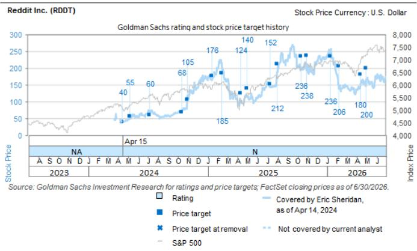

# Reddit Inc. (RDDT)

# Q2'26 复盘：运营动能延续（收入与利润率），投入与管理层聚焦用户增长与参与度

RDDT

12个月目标价：\$215.00

现价：\$178.04

潜在空间：20.8%

在Reddit（RDDT）Q2'26财报中，管理层围绕几个关键主题阐述了运营成果与前瞻指引：1）核心广告业务在规模化收入增长方面持续展现出强劲的执行力与运营产出（广告产品表现改善、定向投放举措推进、转化率提升及广告主基数扩大）；2）各流量来源的用户增长存在一定波动，公司正通过产品优化推动用户行为向直接使用与更规律参与转化，重点聚焦移动应用、留存与个性化；3）管理层认为，随着AI应用普及度提升，Reddit平台内容价值持续上升，同时也承认AI在不同互联网平台（如搜索）的渗透影响仍呈非线性且存在不确定性（需要通过产品创新或行业合作关系的进一步深化来应对）；4）运营杠杆仍是超越收入预期的重要支撑（并足以覆盖平台与产品举措以及用户转化计划方面的持续投入）；5）数据授权续约进展未提供更新，读者对授权合作伙伴核心关系、续约方式以及平台数据/内容整体价值在未来数年可能带来的商业化潜力持续关注。总体而言，尽管公司在搜索流量及AI对整体用户流量的影响方面仍需应对一定波动，管理层仍专注于规模化用户行为建设、商业化成果以及在此基础上运营杠杆的整体轨迹。

短期内的读者讨论可能仍将聚焦于用户增长与参与度的线性及持续性趋势，同时关注2026年下半年整体广告宏观环境与竞争格局的变化。我们将持续关注管理层在未来几个季度的执行情况（对照此前关于增长机会的一致表述），以获取更清晰的判断依据。总体来看，我们认为Reddit在数字广告（数字媒体占总媒体支出及用户参与度的渗透率持续提升）与AI（包括规模化数据授权机会及平台内快速演进的AI搜索产品）两大长期结构性增长主题中处于有利位置。我们维持中性评级，并将12个月目标价从\$220调整至\$215，以反映本次财报及管理层评论后对前瞻运营预期的更新。

图表1：Reddit - 总收入拆分（预测）\$mm，2023-2030E

  
来源：公司数据，GS全球投资研究

## Q2'26 积极与待观察因素：

积极因素：a）Q2总收入超出预期及指引，Q3收入指引亦高于此前预期，核心广告业务表现强劲（广告全漏斗、行业垂直领域及销售渠道普遍增长，规模化渠道收入同比弹性较高）；b）管理层指出AI/ML投入与广告产品创新带来可量化的改善（如Reddit Max采用率提升带动广告主增长60%，收入环比增长150%以上）；c）Q2调整后EBITDA显著高于此前管理层及预期水平（同比+106%），受益于收入超预期与持续的成本效率提升。

待观察因素：a）Q3美国日活跃用户环比下降，总日活跃用户环比净增亦有所减少，尽管公司持续加大营销投入以改善用户获取；b）管理层指出本季度搜索推荐流量存在波动，预计Q3仍将构成一定影响（但程度有所缓和）；c）管理层对数据授权交易及更广泛AI生态的长期增长潜力保持乐观，但本季度未宣布新的大型合作伙伴关系（续约时间与进展可见度有限）。

## Q3'26 及 FY2026 预期调整：

Q3'26：收入\$868mm（此前\$796mm）；调整后EBITDA \$391mm（此前\$349mm）；GAAP EPS \$1.23（此前\$1.14）。2026全年：收入\$33.8亿（此前\$31.6亿）；调整后EBITDA \$15.3亿（此前\$14.0亿）；GAAP EPS \$5.28（此前\$4.73）。

图表2：Q2'26 实际 vs. 预期 mm，除每股数据外

<table><tr><td></td><td>实际</td><td>GS</td><td>一致预期</td><td>指引</td><td>实际 vs. GS</td><td>实际 vs. 一致</td><td>环比</td><td>同比</td></tr><tr><td>日活跃用户（总）</td><td>130.3</td><td>131.3</td><td>130.1</td><td></td><td>-1%</td><td>0%</td><td>3%</td><td>18%</td></tr><tr><td>美国日活跃用户</td><td>53.2</td><td>54.5</td><td>54.1</td><td></td><td>-2%</td><td>-2%</td><td>-1%</td><td>6%</td></tr><tr><td>国际日活跃用户</td><td>77.1</td><td>76.8</td><td>76.0</td><td></td><td>0%</td><td>1%</td><td>5%</td><td>28%</td></tr><tr><td>收入（总）</td><td>\$805</td><td>\$722</td><td>\$729</td><td>\$715-725m</td><td>11%</td><td>10%</td><td>21%</td><td>61%</td></tr><tr><td>美国收入</td><td>\$638</td><td>\$581</td><td>\$569</td><td></td><td>10%</td><td>12%</td><td>21%</td><td>56%</td></tr><tr><td>国际收入</td><td>\$167</td><td>\$141</td><td>\$160</td><td></td><td>19%</td><td>4%</td><td>21%</td><td>84%</td></tr><tr><td>GAAP EBITDA</td><td>\$236</td><td>\$174</td><td>\$189</td><td></td><td>36%</td><td>25%</td><td></td><td></td></tr><tr><td>调整后EBITDA</td><td>\$343</td><td>\$293</td><td>\$300</td><td>\$285-295m</td><td>17%</td><td>14%</td><td></td><td></td></tr><tr><td>利润率</td><td>42.6%</td><td>40.5%</td><td>41.1%</td><td></td><td>207 bps</td><td>152 bps</td><td></td><td></td></tr><tr><td>GAAP EPS</td><td>\$1.25</td><td>\$0.92</td><td>\$0.97</td><td></td><td>36%</td><td>29%</td><td></td><td></td></tr></table>

来源：公司数据，FactSet，GS全球投资研究

## 图表3：Q3'26、2026、2027及2028预期调整 mm，除每股数据外

<table><tr><td rowspan="2"></td><td colspan="4">Q3 2026</td><td colspan="3">2026</td><td colspan="3">2027</td><td colspan="3">2028</td></tr><tr><td>原</td><td>新</td><td>变化%</td><td>指引</td><td>原</td><td>新</td><td>变化%</td><td>原</td><td>新</td><td>变化%</td><td>原</td><td>新</td><td>变化%</td></tr><tr><td>日活跃用户（总）</td><td>135.8</td><td>134.3</td><td>-1%</td><td></td><td>140.3</td><td>138.8</td><td>-1%</td><td>153.7</td><td>151.8</td><td>-1%</td><td>164.9</td><td>162.8</td><td>-1%</td></tr><tr><td>美国日活跃用户</td><td>55.5</td><td>53.7</td><td>-3%</td><td></td><td>56.5</td><td>54.7</td><td>-3%</td><td>59.9</td><td>57.7</td><td>-4%</td><td>63.1</td><td>60.7</td><td>-4%</td></tr><tr><td>国际日活跃用户</td><td>80.3</td><td>80.6</td><td>0%</td><td></td><td>83.8</td><td>84.1</td><td>0%</td><td>93.8</td><td>94.1</td><td>0%</td><td>101.8</td><td>102.1</td><td>0%</td></tr><tr><td>收入（总）</td><td>\$796</td><td>\$868</td><td>9%</td><td>\$860-870m</td><td>\$3,159</td><td>\$3,383</td><td>7%</td><td>\$4,127</td><td>\$4,356</td><td>6%</td><td>\$5,125</td><td>\$5,408</td><td>6%</td></tr><tr><td>美国收入</td><td>\$639</td><td>\$684</td><td>7%</td><td></td><td>\$2,502</td><td>\$2,652</td><td>6%</td><td>\$3,174</td><td>\$3,296</td><td>4%</td><td>\$3,820</td><td>\$3,956</td><td>4%</td></tr><tr><td>国际收入</td><td>\$158</td><td>\$184</td><td>17%</td><td></td><td>\$657</td><td>\$731</td><td>11%</td><td>\$953</td><td>\$1,060</td><td>11%</td><td>\$1,305</td><td>\$1,452</td><td>11%</td></tr><tr><td>GAAP EBITDA</td><td>\$218</td><td>\$237</td><td>8%</td><td></td><td>\$906</td><td>\$1,016</td><td>12%</td><td>\$1,449</td><td>\$1,531</td><td>6%</td><td>\$1,998</td><td>\$2,089</td><td>5%</td></tr><tr><td>利润率</td><td>27.4%</td><td>27.3%</td><td>-14 bps</td><td></td><td>28.7%</td><td>30.0%</td><td>137 bps</td><td>35.1%</td><td>35.1%</td><td>3 bps</td><td>39.0%</td><td>38.6%</td><td>-35 bps</td></tr><tr><td>调整后EBITDA</td><td>\$349</td><td>\$391</td><td>12%</td><td>\$385-395mm</td><td>\$1,403</td><td>\$1,529</td><td>9%</td><td>\$1,996</td><td>\$2,142</td><td>7%</td><td>\$2,599</td><td>\$2,793</td><td>7%</td></tr><tr><td>利润率</td><td>43.9%</td><td>45.1%</td><td>120 bps</td><td></td><td>44.4%</td><td>45.2%</td><td>79 bps</td><td>48.4%</td><td>49.2%</td><td>82 bps</td><td>50.7%</td><td>51.6%</td><td>92 bps</td></tr><tr><td>GAAP EPS</td><td>\$1.14</td><td>\$1.23</td><td>7%</td><td></td><td>\$4.73</td><td>\$5.28</td><td>12%</td><td>\$7.03</td><td>\$7.43</td><td>6%</td><td>\$9.12</td><td>\$9.57</td><td>5%</td></tr><tr><td>调整后EPS</td><td>\$1.80</td><td>\$2.01</td><td>12%</td><td></td><td>\$7.24</td><td>\$7.90</td><td>9%</td><td>\$9.74</td><td>\$10.49</td><td>8%</td><td>\$12.07</td><td>\$13.04</td><td>8%</td></tr></table>

来源：GS全球投资研究

## 估值：维持中性评级；目标价下调至\$215（原\$220）

我们的\$215 12个月目标价（此前\$220）基于以下两者的等权混合：（1）EV/Sales应用于NTM+1年预期；（2）修正DCF，采用EV/GAAP EBITDA倍数应用于NTM+4年预期并折现3年。具体如下：

8.0x EV/Sales（不变）或0.25x EV/Sales-to-growth应用于NTM+1年预期。

18.0x EV/GAAP EBITDA（原21.5x）或0.81x EV/GAAP EBITDA-to-growth应用于NTM+4年预期，按12%折现3年（不变）。我们下调倍数以维持约0.8x的倍数-增长比。折现率代表CAPM，使用我们覆盖范围内公司的混合平均值：（1）3%无风险利率（基于标准化10年期利率）；（2）平均beta约1.3；（3）股权风险溢价7%。

图表4：RDDT估值分析
mm，除每股数据外

<table><tr><td colspan="4">情景分析</td></tr><tr><td></td><td>下行</td><td>基准</td><td>上行</td></tr><tr><td>估值</td><td>\$120</td><td>\$215</td><td>\$280</td></tr><tr><td>上行/下行空间</td><td>-25%</td><td>35%</td><td>76%</td></tr><tr><td>收入（NTM）</td><td>\$3,423</td><td>\$3,803</td><td>\$4,183</td></tr><tr><td>下行/上行调整</td><td>-10%</td><td>-</td><td>10%</td></tr><tr><td>收入（NTM+1年）</td><td>\$4,233</td><td>\$4,810</td><td>\$5,387</td></tr><tr><td>下行/上行调整</td><td>-12%</td><td>-</td><td>12%</td></tr><tr><td>EV/Sales</td><td>4.0x</td><td>8.0x</td><td>10.0x</td></tr><tr><td>收入CAGR</td><td>23.4%</td><td>31.6%</td><td>39.2%</td></tr><tr><td>EV/Sales-to-Growth</td><td>0.17x</td><td>0.25x</td><td>0.25x</td></tr><tr><td>企业价值</td><td>\$16,932</td><td>\$38,482</td><td>\$53,874</td></tr><tr><td>GAAP EBITDA（NTM+4年）</td><td>\$2,849</td><td>\$3,222</td><td>\$3,403</td></tr><tr><td>EBITDA利润率</td><td>36.0%</td><td>40.7%</td><td>43.0%</td></tr><tr><td>EV/EBITDA</td><td>13.0x</td><td>18.0x</td><td>20.0x</td></tr><tr><td>EBITDA CAGR</td><td>17.4%</td><td>22.3%</td><td>24.6%</td></tr><tr><td>EV/EBITDA-to-Growth</td><td>0.75x</td><td>0.81x</td><td>0.81x</td></tr><tr><td>折现率</td><td>15.0%</td><td>12.0%</td><td>10.0%</td></tr><tr><td>折现期（年）</td><td>3</td><td>3</td><td>3</td></tr><tr><td>企业价值（NTM+3年）</td><td>\$37,039</td><td>\$57,989</td><td>\$68,063</td></tr><tr><td>折现后企业价值</td><td>\$24,354</td><td>\$41,275</td><td>\$51,136</td></tr><tr><td colspan="4">权重</td></tr><tr><td>基于收入的EV</td><td>50%</td><td>50%</td><td>50%</td></tr><tr><td>基于GAAP EBITDA的EV</td><td>50%</td><td>50%</td><td>50%</td></tr><tr><td>企业价值</td><td>\$20,643</td><td>\$39,878</td><td>\$52,505</td></tr><tr><td colspan="4">资本结构调整</td></tr><tr><td>调整后净债务 - NTM期末</td><td>\$(4,267)</td><td>\$(4,267)</td><td>\$(4,267)</td></tr><tr><td>调整后流通股数 - NTM期末</td><td>203</td><td>203</td><td>203</td></tr></table>

来源：GS全球投资研究

影响我们中性评级的关键风险因素（可能使我们更加积极或更加谨慎的因素）：1）广告主需求当前面临的影响因素（平台政策变化、宏观环境及竞争）与我们当前预期出现偏差（持续时间更长或恢复速度快于我们的模型假设）；2）在用户增长、用户参与度及广告预算方面面临各类现有及新兴互联网、媒体和电商公司的竞争；3）把握全球用户增长机会的能力；4）利润率的多空因素（积极方面：ARPU增长、高增量毛利率、低整体非GAAP运营支出增长；消极方面：AI/ML投入、产品创新投入、股权激励）；5）所有媒体平台在用户数据/隐私方面的当前监管环境；6）员工/股东锁定期到期可能带来的影响；7）增长举措商业化执行情况（数据授权、效果广告、国际商业化、开发者平台等）。此外，Reddit还面临全球宏观环境及读者对成长型公司风险偏好的波动影响。

## 披露附录

## Reg AC

我们，Eric Sheridan、Alex Vegliante（CFA）、Emma Huang及Aarshiya Sachdeva，特此证明本报告中表达的所有观点准确反映了我们个人对相关公司及其证券的看法。我们还证明，我们的薪酬中没有任何部分直接或间接与本次报告中表达的具体建议或观点相关。

除非另有说明，本报告封面所列人员均为GS全球投资研究部分析师。

撰稿作者：Eric Sheridan GS & Co. LLC，Alex Vegliante（CFA）GS & Co. LLC，Emma Huang GS & Co. LLC，Aarshiya Sachdeva GS & Co. LLC。

除非另有说明，本报告撰稿作者披露中所列人员均为GS全球投资研究部分析师。

## GS因子画像

GS因子画像通过将关键属性与市场（即我们的评级股票池）及其行业同行进行比较，为个股提供投资背景参考。所描绘的四个关键属性为：增长、财务回报、倍数（即估值）和综合（增长、财务回报和倍数的复合指标）。增长、财务回报和倍数通过计算每只股票特定指标的标准化排名得出。各指标的标准化排名随后取平均值并转换为相关属性的百分位。每个指标的具体计算可能因财年、行业和地区而异，但标准方法如下：

增长基于股票的前瞻性收入增长、EBITDA增长和EPS增长（对于金融类公司，仅使用EPS和收入增长），百分位越高表示增长性越强。财务回报基于股票的前瞻性ROE、ROCE和CROCI（对于金融类公司，仅使用ROE），百分位越高表示财务回报越高。倍数基于股票的前瞻性P/E、P/B、股息率（P/D）、EV/EBITDA、EV/FCF和EV/债务调整后现金流（DACF）（对于金融类公司，仅使用P/E、P/B和P/D），百分位越高表示估值倍数越高。综合百分位计算为增长百分位、财务回报百分位和（100% - 倍数百分位）的平均值。

财务回报和倍数使用GS分析师对未来至少三个季度后的财年末的预测。增长使用未来至少七个季度后的财年与未来至少三个季度后的财年相比的输入数据（所有指标均基于每股基础）。

有关我们如何计算GS因子画像的更详细说明，请联系您的GS代表。

## M&A排名

在我们的全球覆盖范围内，我们使用M&A框架审视公司，综合考虑定性因素和定量因素（可能因行业和地区而异），以评估某些公司被收购的可能性。我们随后分配M&A排名，将评级覆盖下的公司从1到3进行评分，其中1表示公司成为收购目标的可能性较高（30%-50%），2表示中等可能性（15%-30%），3表示较低可能性（0%-15%）。对于排名为1或2的公司，按照我们的标准部门指引，我们将M&A因素纳入目标价。M&A排名为3的公司被视为不重要，因此不计入我们的目标价，且可能在研究报告中提及或不提及。

## Quantum

Quantum是GS的专有数据库，提供详细的财务报表历史、预测和比率。可用于对单一公司进行深入分析，或比较不同行业和市场中的公司。

## 披露

Reddit Inc.的评级相对于其覆盖范围内的其他公司：ACV Auctions Inc.、Airbnb Inc.、Alphabet Inc.、Amazon.com Inc.、Angi Inc.、AppLovin Corp.、Bending Spoons S.p.A.、Booking Holdings Inc.、Bumble Inc.、Chewy Inc.、Clear Secure Inc.、Corsair Gaming Inc.、Coursera Inc.、Cricut Inc.、DoorDash Inc.、DoubleVerify Inc.、DraftKings Inc.、Duolingo Inc.、Ethos Technologies Inc.、Expedia Group、Fiverr International Ltd.、Frontdoor Inc.、Genius Sports Ltd.、GoodRx Holdings Inc.、Grindr Inc.、Groupon Inc.、Ibotta Inc.、Instacart、Liftoff Mobile Inc.、Lyft Inc.、Match Group、MediaAlpha Inc.、Meta Platforms Inc.、Netflix Inc.、Neutron Holdings Inc.、Nextdoor Holdings、Opera Ltd.、Pattern Group Inc.、Peloton Interactive Inc.、People Inc.、Pinterest Inc.、Playtika、Reddit Inc.、Roblox、Snap Inc.、Space Exploration Technologies Corp.、Sportradar Group、Spotify Technology S.A.、StubHub Holdings、Take-Two Interactive Software Inc.、Tripadvisor Inc.、Uber Technologies Inc.、Unity Software Inc.、Upwork Inc.、Wayfair Inc.、Webtoon Entertainment Inc.、Xometry Inc.、Yelp Inc.、ZipRecruiter Inc.

## 公司特定监管披露

以下披露涉及The GS Group, Inc.（及其关联公司，"GS"）与GS全球投资研究覆盖并在本研究中提及的公司之间的关系。

截至本报告前一个月末，GS实益拥有普通股1%或以上（不包括根据美国证券法无需汇总的关联公司和业务部门持有的头寸）：Reddit Inc. (\$178.04)

GS在过去12个月内因投资银行服务获得报酬：Reddit Inc. (\$178.04)

GS预计在未来3个月内寻求投资银行服务报酬：Reddit Inc. (\$178.04)

GS在过去12个月内与以下公司存在投资银行服务客户关系：Reddit Inc. (\$178.04)

GS在过去12个月内与以下公司存在非投资银行证券相关服务客户关系：Reddit Inc. (\$178.04)

GS在以下公司的证券或衍生品中做市：Reddit Inc. (\$178.04)

## 评级/投资银行关系分布

GS投资研究全球股票评级覆盖范围

报告日期 目标价（\$） 收盘价（\$）

<table><tr><td colspan="3">评级分布</td></tr><tr><td>买入</td><td>持有</td><td>卖出</td></tr><tr><td>50%</td><td>34%</td><td>16%</td></tr></table>

<table><tr><td colspan="3">投资银行关系</td></tr><tr><td>买入</td><td>持有</td><td>卖出</td></tr><tr><td>65%</td><td>59%</td><td>43%</td></tr></table>

截至2026年7月1日，GS全球投资研究对3,104只股票进行了投资评级。GS将股票分配为各区域投资清单上的买入和卖出；未分配至此类的股票被视为中性。该等分配等同于上述FINRA规则要求的披露中的买入、持有和卖出。参见下文"评级、覆盖范围及相关定义"。投资银行关系图表反映了GS在过去十二个月内为各评级类别中提供投资银行服务的标的公司百分比。

## 目标价与评级历史图表

  
所示目标价应结合GS此前所有已发布研究报告（可能包含或不包含目标价）以及公司、行业和金融市场相关进展来理解。

## 目标价历史表 Reddit Inc. (RDDT)

<table><tr><td>报告日期</td><td>目标价（\$）</td><td>收盘价（\$）</td></tr><tr><td>26年7月8日</td><td>220.00</td><td>195.31</td></tr><tr><td>26年5月1日</td><td>200.00</td><td>166.48</td></tr><tr><td>26年4月13日</td><td>180.00</td><td>149.35</td></tr><tr><td>26年2月6日</td><td>206.00</td><td>139.83</td></tr><tr><td>26年1月12日</td><td>236.00</td><td>244.02</td></tr><tr><td>25年10月31日</td><td>238.00</td><td>208.95</td></tr><tr><td>25年10月14日</td><td>236.00</td><td>196.35</td></tr><tr><td>25年8月1日</td><td>212.00</td><td>188.64</td></tr><tr><td>25年7月10日</td><td>152.00</td><td>143.00</td></tr><tr><td>25年5月2日</td><td>140.00</td><td>113.83</td></tr><tr><td>25年4月11日</td><td>124.00</td><td>101.15</td></tr><tr><td>25年2月13日</td><td>185.00</td><td>204.95</td></tr><tr><td>25年1月13日</td><td>176.00</td><td>164.65</td></tr><tr><td>24年10月30日</td><td>105.00</td><td>116.05</td></tr><tr><td>24年10月14日</td><td>68.00</td><td>74.87</td></tr><tr><td>24年7月8日</td><td>60.00</td><td>72.81</td></tr><tr><td>24年5月8日</td><td>55.00</td><td>51.40</td></tr><tr><td>24年4月15日</td><td>40.00</td><td>40.00</td></tr></table>

表中所示目标价未针对公司行为进行调整。

## 监管披露

## 美国法律法规要求的披露

参见上文公司特定监管披露，了解本报告提及公司所需的以下任何披露：待处理交易中的主承销商或联席主承销商；1%或其他所有权；特定服务报酬；客户关系类型；此前期间的公开承销管理/联合管理；董事职位；对于股票证券，做市和/或专家角色。GS交易或可能以主体身份交易本报告中讨论的发行人的债务证券（或相关衍生品）。

以下为额外要求的披露：所有权和重大利益冲突：GS政策禁止其分析师、向分析师汇报的专业人员及其家庭成员持有分析师覆盖范围内任何公司的证券。分析师薪酬：分析师的薪酬部分基于GS的盈利能力，其中包括投资银行收入。分析师作为高管或董事：GS政策通常禁止其分析师、向分析师汇报的人员或其家庭成员担任分析师覆盖范围内任何公司的高管、董事或顾问。非美国分析师：非美国分析师可能不是GS & Co. LLC的关联人员，因此可能不受FINRA规则2241或FINRA规则2242关于与标的公司沟通、公开露面及交易分析师所覆盖证券的限制。

## 美国以外司法管辖区法律和法规要求的额外披露

以下为指定司法管辖区要求的披露，但上文已根据美国法律和法规作出的披露除外。澳大利亚：GS Australia Pty Ltd及其关联公司不是澳大利亚的授权存款机构（该术语定义见《1959年银行法》（联邦）），不提供银行服务，也不在澳大利亚从事银行业务。本研究及其任何访问权限仅面向《澳大利亚公司法》定义的"批发客户"，除非GS另有约定。在撰写研究报告时，GS Australia全球投资研究部门的成员可能参加由其研究报告标的公司和其他实体主办或主持的实地考察和会议。在某些情况下，如果GS Australia认为在实地考察或会议的具体情况下适当且合理，此类实地考察或会议的部分或全部费用可能由相关发行方承担。如果本文件内容包含任何金融产品建议，则仅为一般性建议，由GS在未考虑客户目标、财务状况或需求的情况下编制。客户在根据任何此类建议采取行动前，应考虑该建议是否适合其自身目标、财务状况和需求。GS Australia和New Zealand的某些利益披露副本以及GS的澳大利亚卖方研究独立性政策声明副本可在以下网址获取：https://www.goldmansachs.com/disclosures/australia-new-zealand/index.html。巴西：有关CVM Resolution n. 20的披露信息可在https://www.gs.com/worldwide/brazil/area/gir/index.html获取。如适用，根据CVM Resolution n. 20第20条定义，本研究报告内容的主要负责巴西注册分析师为本报告开头列出的第一作者，除非文末另有说明。加拿大：此信息仅供您参考，不构成且在任何情况下均不应被解释为GS & Co. LLC为在加拿大购买证券的客户提供的广告、要约或招揽，以交易任何加拿大证券。GS & Co. LLC未在加拿大任何司法管辖区根据适用的加拿大证券法注册为交易商，通常不被允许交易加拿大证券，并可能被禁止在加拿大某些司法管辖区销售某些证券和产品。如果您希望在加拿大交易任何加拿大证券或其他产品，请联系GS Canada Inc.（The GS Group Inc.的关联公司）或其他注册的加拿大交易商。香港：可向GS (Asia) L.L.C.索取本研究中提及的所覆盖公司证券的进一步信息。印度：可从GS (India) Securities Private Limited获取本研究中提及的标的公司或公司的进一步信息，SEBI注册号INH000001493，地址：10th Floor, Ascent-Worli, Sudam Kalu Ahire Marg, Worli, Mumbai-400 025, India，公司识别号U74140MH2006FTC160634，电话+91 22 6616 9000，传真+91 22 6616 9001。GS可能实益拥有本研究报告提及的标的公司1%或以上的证券（该术语定义见印度《证券合约（监管）法》1956年第2(h)条）。SEBI的注册和NISM的认证不以任何方式保证中介机构的业绩或向读者提供回报保证。GS (India) Securities Private Limited的合规官和读者投诉联系方式、年度合规审计报告副本以及其他相关信息和披露可在以下链接找到：https://www.goldmansachs.com/worldwide/india/research-analyst。日本：见下文。韩国：本研究及其任何访问权限仅面向《金融服务与资本市场法》定义的"专业读者"，除非GS另有约定。可从GS (Asia) L.L.C.首尔分行获取本研究中提及的标的公司或公司的进一步信息。新西兰：GS New Zealand Limited及其关联公司不是新西兰的"注册银行"或"存款接受机构"（定义见《1989年新西兰储备银行法》）。本研究及其任何访问权限仅面向《2008年金融顾问法》定义的"批发客户"，除非GS另有约定。GS Australia和New Zealand的某些利益披露副本可在以下网址获取：https://www.goldmansachs.com/disclosures/australia-new-zealand/index.html。俄罗斯：在俄罗斯联邦分发的研究报告不是俄罗斯立法定义的广告，而是信息和分析，不以产品推广为主要目的，不提供俄罗斯评估活动立法意义上的评估。研究报告不构成俄罗斯法律法规定义的个人化研究交流，不针对特定客户，且未分析客户的财务状况、投资概况或风险概况。GS不对客户或任何其他人基于本研究报告可能做出的任何投资决策承担责任。新加坡：GS (Singapore) Pte.（公司编号：198602165W），受新加坡金融管理局监管，对本研究承担法律责任，如有任何与本研究报告相关的事宜，请联系该公司。台湾：本材料仅供参考，未经许可不得转载。读者应仔细考虑自身的投资风险。投资结果由个人读者自行承担。英国：在英国将被归类为零售客户的个人（定义见金融行为监管局规则）应结合GS此前关于本研究所涉覆盖公司的研究报告阅读本研究，并应参阅GS International已发送给他们的风险警告。这些风险警告的副本以及本报告中使用的某些金融术语词汇表可向GS International索取。

欧盟和英国：有关欧盟委员会授权条例(EU) (2016/958)第6(2)条的披露信息（该条例补充欧洲议会和理事会条例(EU) No 596/2014，包括该授权条例在英国退出欧盟和欧洲经济区后转化为英国国内法律和法规的情况），涉及客观呈现研究交流或其他建议或暗示投资策略的信息的技术安排，以及披露特定利益或利益冲突迹象的技术标准，可在https://www.gs.com/disclosures/europeanpolicy.html获取，其中载明了与投资研究相关的利益冲突管理欧洲政策。

日本：GS Japan Co., Ltd.是在关东财务局注册的金融工具交易商，注册号Kinsho
