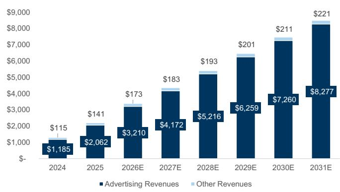
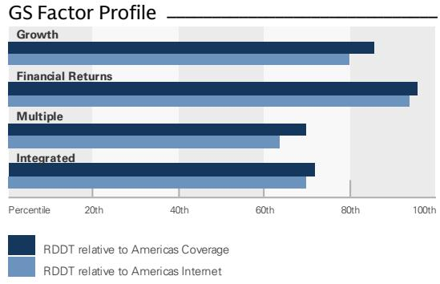
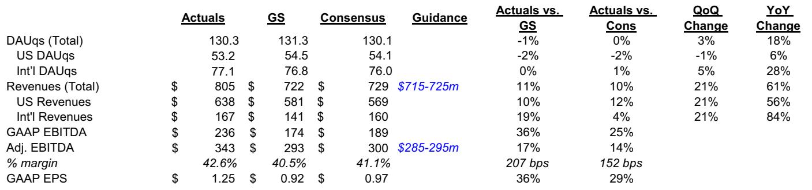

# Reddit 季度业绩揭示真正的战略权衡：商业化速度超越用户增长，这一差距成为核心研究焦点

Reddit 公布2026年第二季度营收为8.05亿美元，较市场一致预期的7.29亿美元高出11%；调整后EBITDA为3.43亿美元，超出预期14%，对应利润率42.6%。在交出这份财务成绩单的同时，公司美国日活跃用户（DAU）环比出现下滑——美国DAU环比下降1%至5320万。这种组合——商业化加速与公司最有价值市场的用户活跃度走软并存——并非一个混杂的信号。它清晰地揭示了Reddit当前的处境：广告业务已达到一定规模，但用户增长引擎仍受制于其无法完全掌控的外部因素。

市场对这一张力的反应将决定该公司报价在未来十二个月的走向。管理层将第三季度营收指引上调至8.6-8.7亿美元，较此前预期高出约9%；同时将2026全年营收预期从31.6亿美元上调至33.8亿美元。这些调整所蕴含的盈利能量相当可观——全年调整后EBITDA现预计为15.3亿美元，同比增长81%。然而，美国DAU的环比下滑以及搜索引荐流量的持续波动表明，用户基数——尤其是在价值最高的地理市场——并未与营收引擎同步增长。一份全球投资银行研究报告维持的观点反映了一个基本事实：Reddit在可控变量上执行出色，而不可控变量——搜索流量、AI驱动的内容消费变化以及用户转化速度——仍未得到解决。

战略问题已不再是Reddit能否将现有受众变现。答案显然是肯定的。问题在于，公司能否以足够快的速度扩大受众规模，以支撑一个已计入多年复利增长的估值。基于当前的运营轨迹，答案比头条营收超预期所暗示的要更为复杂。

## 广告引擎已具规模，但增长机制正在变化

Reddit的核心广告业务已不再是一个有前景的实验。它是一台规模化、多元化的营收机器，仅第二季度就超出内部指引8000万美元，营收同比增长61%。增长的结构比头条数字更重要。管理层报告称，整个广告漏斗、行业垂直领域和销售渠道均呈现广泛增长，其中规模化渠道营收同比弹性较高。这并非依赖单一广告主群体或单一产品创新的业务，而是一个已建立起足够广告基础设施——定向能力、衡量工具和自助平台——能够同时捕捉多个细分市场需求的企业。

最有力的数据点是Reddit Max（公司高端广告产品）的采用轨迹。管理层披露，Reddit Max带动广告主增长超过60%，营收环比增长超过150%。该产品不仅比以往有增量改进，更在结构性改变广告主在平台上的预算分配方式。当一个高端产品以三位数速度环比增长时，这表明平台已跨越了广告主信任和衡量可信度的门槛。广告主不再是在测试Reddit，而是在Reddit上规模化投放。

营收增长中蕴含的运营杠杆同样显著。第二季度调整后EBITDA为3.43亿美元，对应42.6%的利润率，较上季度提升207个基点，同比增长106%。公司成本结构的扩张速度低于营收增速，这意味着每一美元的增量广告支出正以递增的比率转化为利润。2026全年EBITDA利润率现预计为30%，高于此前估计的28.7%。这一利润率扩张并非单季现象，而是拥有91%毛利率、固定成本基础增速低于营收的企业所具有的结构性特征。

然而，营收增长日益依赖国际市场，而那里的经济性尚未得到充分验证。第二季度国际营收同比增长84%，是美国增速（56%）的两倍多。国际DAU同比增长28%至7710万，占总DAU近60%。这对长期规模化是积极进展，但也引入了不同的风险特征。国际广告库存的变现率通常低于美国库存，且国际搜索和社交市场的竞争动态与美国有显著差异。公司实际上是在用美国广告利润为国际扩张提供资金——这是一个理性的策略，但如果国际商业化成熟速度慢于预期，则存在执行风险。

广告业务的根本转变在于，Reddit已从验证模式转向优化模式。下一阶段的增长将来自更深入的广告主渗透、通过AI/ML投资改善定向能力，以及持续的产品创新——管理层均将这些列为第二季度业绩的可衡量贡献因素。风险已不再是模式是否有效，而是优化速度能否抵消用户增长的波动。

## 用户增长是约束条件，美国环比下滑并非暂时现象

美国DAU从第一季度的5370万降至第二季度的5320万，是本季度最具影响力的数据点。这代表着公司最有价值用户基数1%的下降，且发生在管理层明确聚焦用户获取并加大营销投入的背景下。公司总DAU环比仅净增3%至1.303亿，全部增长来自国际市场。美国用户基数——以41%的总DAU贡献约79%的总营收——并未增长。

管理层将波动归因于搜索引荐流量模式，该因素在第二季度仍是逆风，预计将继续缓和但会持续到第三季度。这不是一个新问题，但其持续性令人关注。自AI驱动的搜索行为变化开始重塑互联网流量格局以来，搜索引荐一直是Reddit用户获取波动的来源。公司已承认AI在互联网平台（包括搜索）的扩散影响仍是非线性和不确定的。这种不确定性现在正体现在公司报告的最重要指标中。

管理层的战略回应是通过产品改进、移动应用互动、留存和个性化，将搜索驱动用户转化为直接用户。这是正确的方法，但它是解决短期问题的长期方案。直接使用和定期互动是需要持续产品投入和行为改变的结构性结果。移动应用尤其关键——应用用户通常互动频率更高，对外部流量来源的依赖更少。但应用采用和习惯养成需要时间，而美国环比下滑表明转化引擎的运转速度尚不足以抵消搜索波动。

用户增长问题因2026年总DAU预估被下调1%（预测期内）而进一步复杂化，其中美国DAU在第三季度被下调3%，2027年和2028年被下调4%。国际DAU预估未变。这不是大幅修正，但表明卖方观点开始纳入对美国用户增长更为保守的预期。市场实际上正在定价：Reddit美国用户基数将以低于此前预期的速度增长，而国际增长继续以更快速度推进。

张力在于营收引擎跑在了用户引擎前面。Reddit第二季度以1.303亿DAU产生8.05亿美元营收，意味着每DAU每季度约6.18美元。在美国，这一数字接近每DAU每季度12美元。每一个增量美国用户都具有不成比例的价值，这使得美国DAU的环比下降尤为代价高昂。公司并非因广告产品缺陷而留下营收空白，而是因为用户基数在商业化较强的地理区域没有扩张。

## AI敞口是一把双刃剑：数据授权价值上升，但搜索扰动真实存在

管理层对AI的评论反映出对机遇和风险的成熟理解。一方面，随着AI采用范围的扩大，Reddit内容的价值正在上升。该平台按主题和社区组织的人类对话语料，是AI系统可用的最有价值的训练数据之一。这是公司数据授权业务的基础，管理层继续将其描述为具有显著长期增长潜力。另一方面，AI在搜索平台的扩散正在扰乱历史上驱动用户获取的流量来源。同一项技术在提升Reddit内容价值的同时，也在减少搜索驱动用户流向平台的流量。

第二季度没有新的大规模数据授权合作值得关注，尤其是读者关于续约和核心授权伙伴关系的疑问持续上升。管理层未提供数据授权续约进展的更新，使市场无法了解未来交易的时机或条款。公司现有授权协议被认为是营收的重要贡献者，但续约条款和扩展合作的可能性仍不透明。这种不确定性对估值倍数构成拖累，因为读者无法充分评估一个未来规模未知的营收流。

AI搜索扰动比简单的逆风更为复杂。Reddit的内容越来越多地出现在AI生成的搜索答案中，这可以在不要求点击进入平台的情况下满足用户查询。这减少了搜索引荐流量，即使它提升了平台的内容价值。公司正通过在平台内投资AI搜索产品来应对，这可以捕捉目前分散在更广泛AI生态系统中的部分价值。如果Reddit能在自有平台上构建引人注目的AI原生搜索体验，它可以将AI扰动从威胁转化为机遇。

二阶含义是Reddit的AI战略必须是双轨的。第一轨是通过数据授权和合作将内容价值变现，这需要在AI公司寻求高质量训练数据时谈判有利条款。第二轨是构建将用户留在平台上的AI产品，这需要与当前正在捕获用户注意力的AI系统本身竞争。这两条轨道并非相互排斥，但需要不同的能力和投资优先级。管理层承认AI扩散的影响是非线性和不确定的，这表明公司仍处于寻找正确平衡的早期阶段。

数据授权的机遇是真实的，但其时机不确定。公司本季度未宣布新的大规模合作，现有交易的续约条款未知。市场被要求相信：随着AI采用的扩大，Reddit内容的价值将继续上升，且公司将捕获其中有意义的一部分。这种信念可能有其依据，但尚未得到可见证据的支持。

## 运营杠杆是连接营收增长与用户波动的桥梁

第二季度最重要的战略洞见是，运营杠杆正在强劲营收增长与波动用户趋势之间提供桥梁。公司EBITDA利润率在第二季度扩大至42.6%，2026全年利润率现预计为30%，高于此前估计的28.7%。这一利润率扩张并非削减成本的结果，而是营收增速快于成本基础的商业模式的自然产物。公司在平台和产品计划以及用户转化方案上持续投入，但这些投入正被营收的超预期表现所充分抵消。

财务预测展示了这一杠杆的力量。2026全年营收现预计为33.8亿美元，较此前估计上调7%；调整后EBITDA预计为15.3亿美元，较此前估计上调9%。EBITDA利润率在单一修正周期内从28.7%扩张至30%意义重大。2027年预测显示持续杠杆效应，EBITDA为21.4亿美元，营收为43.6亿美元，对应49.2%的EBIT利润率。到2028年，公司预计在54.1亿美元营收基础上产生27.9亿美元EBITDA，EBIT利润率为51.6%。

这些预测所蕴含的现金流生成能力相当可观。自由现金流预计从2025年的6.84亿美元增长至2026年的13.5亿美元、2027年的19.4亿美元和2028年的24.7亿美元。公司无债务，现金储备预计到2028年底将达到62.4亿美元。这一财务实力为公司提供了战略灵活性——可以在不受约束的情况下投资用户增长计划、进行收购或向股东返还资本。

运营杠杆还为用户增长波动提供了缓冲。即使DAU增长进一步放缓，每用户营收正以可抵消用户停滞的速度增长。第二季度业绩展示了这一动态：美国DAU环比下降，但美国营收环比增长21%。公司正从每个用户身上提取更多价值，这在一定程度上弥补了用户增长的不足。这不是一个可持续的长期策略——最终每用户营收将达到天花板——但它为用户增长计划发挥作用赢得了时间。

关键风险在于，如果用户增长持续令人失望，市场可能开始对营收增长打折。当前估值约为前瞻收益的22.5倍（基于2026年每股收益7.90美元），假设公司将在2027年继续以约29%、2028年以约24%的速度增长营收。如果用户增长停滞，这些预测可能过于乐观，估值倍数可能压缩。运营杠杆提供近期支撑，但无法无限期抵消用户基数的停滞。

## 未来十二个月的决策框架

围绕Reddit的研究讨论可以围绕三个变量来构建，每个变量在决定该公司报价未来十二个月走向方面具有不同权重。

第一个变量是广告营收增长，其可见性最高、过往记录较强。第二季度的超预期和第三季度指引上调提供了核心广告业务执行良好的信心。关键监测指标是规模化渠道营收是否继续同比弹性较高，以及Reddit Max是否保持三位数增长轨迹。如果这些趋势持续，营收上行空间可能继续。

第二个变量是美国用户增长，其可见性最低、近期趋势最令人担忧。美国DAU的环比下降和美国DAU预估的下调表明用户增长问题并未改善。关键监测指标是移动应用和个性化投资是否开始将搜索驱动用户转化为直接用户。这是一个较长周期的变量，市场可能需数个季度才能看到改善的证据。

第三个变量是数据授权和AI变现，其潜在上行空间最大但可见性最低。第二季度没有新的合作公告以及续约缺乏透明度造成了不确定性。关键监测指标是管理层是否提供授权交易的时机或条款更新。一项大规模的新合作将是重要催化剂，但时机未知。

这些变量之间的相互作用决定了研究结论。如果广告营收增长持续超预期而美国用户增长企稳，该公司报价可能获得更高评价。如果广告营收增长放缓而美国用户增长仍为负值，该公司报价可能被重新评估。当前卖方观点反映了这些情景之间的平衡——广告引擎足够强劲以支撑当前估值，但用户增长问题也足够显著以阻止更积极的态度。

未来几个季度最值得关注的不是营收超预期或EBITDA利润率，而是美国DAU的轨迹。公司可以控制其广告执行、产品路线图和成本结构。它无法控制搜索引荐流量或AI驱动用户行为变化的速度。市场最终将根据Reddit能否将强劲的商业化转化为可持续的用户增长来给予回报。这一转化是研究讨论的核心，且尚未得到解决。

*仅供参考。部分内容可能基于源材料由AI辅助生成、翻译、总结或编辑，可能包含遗漏或错误。请独立核实。本文不构成投资、法律、税务、会计或其他专业建议。*

仅供参考。部分内容可能基于源材料由AI辅助生成、翻译、总结或编辑，可能包含遗漏或错误。请独立核实。本文不构成投资、法律、税务、会计或其他专业建议。

