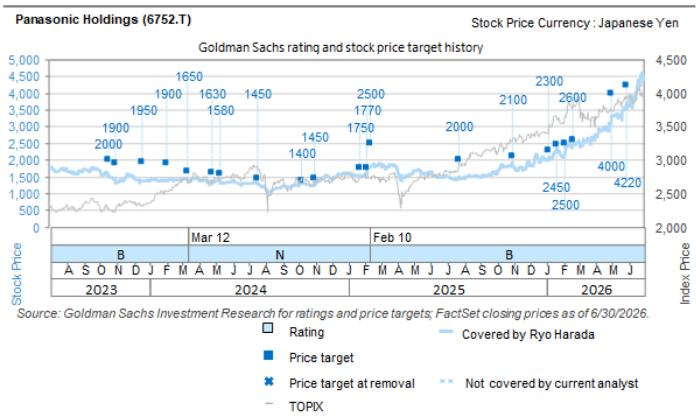

# Panasonic HD（6752.T）：集团CFO及业务公司CEO会议纪要——以生成式AI相关产品构建竞争优势；给予报告评级

7月31日，我们与（1）Panasonic Energy及Panasonic Industry的CEO（CEO Kazuo Tadanobu与CEO Masato Ozawa），以及（2）集团CFO Akira Waniko举行了会议，作为2026财年第一季度业绩的后续跟进。

最核心的要点在于，除了持续推进的业务组合转型外，整个控股公司已开始着手强化其在AI相关产品领域的竞争力——这些产品目前仍保持着旺盛的需求。从历史上看，尽管公司在技术和产品能力上具备先发优势，但作为综合型企业集团的复杂性在一定程度上阻碍了其进行聚焦且及时的资源投入，使得部分竞争对手得以追赶。据CFO所述，公司内部的心态正在发生转变，我们认为关键看点在于公司能否执行一项聚焦于在电池备份单元（BBU）、电容器以及用于生成式AI的多层电路板材料（CCL、MEGTRON）领域取胜的战略。在BBU方面，公司将通过电池电芯的自产以及新产品电容器备份单元（CBU）来强化竞争力。对于MEGTRON，公司将继续推进产能扩张，并利用其柔性生产线进一步提升高附加值产品的占比。

Ryo Harada
+81(3)4587-9865 | ryo.harada@gs.com
GS Japan Co., Ltd.

Hiroki Muramatsu
+81(3)4587-9872 |
hiroki.muramatsu@gs.com
GS Japan Co., Ltd.

## CFO会议要点

## 从结构改革转向增长模式

公司表示内部心态正在发生变化，正在摆脱传统上缺乏聚焦的综合型企业集团架构。

■ MEGTRON是一个具有象征意义的例子——此前产能扩张未能及时跟进，导致近年来与台湾竞争对手之间的差距逐渐显现。对于超大规模云服务商而言，确保制造产能至关重要，公司目前正在内部讨论进一步的产能扩张投入以获取市场份额。相关细节将在决策确定后公布。

除了业务组合最终形态（结构改革）的讨论外，关于业务增长的讨论也日趋活跃。

## 全年指引

汇率：公司自第二季度起采用了较为保守的假设。若日元贬值，主要可能在Panasonic Industry和Panasonic Energy板块存在上行空间。

关税返还：会计结构较为复杂。公司为2026财年汽车关税计提了拨备（与客户各承担50%），但该拨备将被转回。第一季度金额为70亿日元，但也有可能在某个季度突然收到超过100亿日元的返还。

## HVAC与CC业务（第一季度销售增长但利润增长偏弱的原因）

主要原因在于2026财年高利润率的环境工程项目出现回落。此外，在日本（节能法规实施前的末班车需求）和亚洲需求旺盛的背景下，定价/促销策略效率有所不足。公司表示这一问题将从第二季度起得到修正。A2W产品主要作为供暖系统使用，但通过加装冷却单元也可用于制冷，欧洲的酷热天气正在扩大业务机会。

## Electric Works业务（上调预期的背景）

公司在国内电气建材领域拥有强势地位，价格上调幅度超过了成本上涨的传导效应，取得了积极进展。

## Panasonic Energy/Panasonic Industry CEO会议要点

## Panasonic Industry

## 多层电路板材料（CCL、MEGTRON）

Meg9量产时间：目前正在小批量生产供客户验证，全面量产将从2028财年开始。

向高性能产品转移：MEGTRON 6及以下与MEGTRON 7及以上（高性能）的生产比例目前约为各占一半。但高性能产品的占比目标是在2027财年达到约60%，公司计划从2028财年起进一步提升该比例。生产线为共用设计，可根据订单灵活切换。

■ 产能扩张投入：除广州、苏州和Ayutthaya外，追加扩张正在内部讨论中。公司预计将在适当时机发布公告。

■ MEGTRON的应用正在从主板/基板扩展至半导体测试领域。

## 导电性电容器

SP-CAP在半导体周边设备中表现良好，POSCAP在SSD备份应用中的市场份额约为80%。

钽和稀有金属价格上涨，但客户已接受价格调整。

## FA解决方案

约30%的销售面向半导体生产设备。日本、台湾、韩国和中国是主要市场，公司目前在手订单排期超过六个月。

## Panasonic Energy（AI相关）

Rubin世代：用于Rubin的新型容量电芯已部分开始量产（出货自6-7月启动），并已获得早期采用。公司认为即使在Rubin世代也能基本维持80%的市场份额。Rubin的设计已完成，Rubin Ultra也处于最终设计阶段。

销售增长：模块销售不会简单地随着机架功耗从130 kW提升至200 kW而增长1.5倍，而是将通过机架集成和增值功能在价值基础上实现增长。公司表示，接近产能增幅的增长可作为参考指引。

自产化：BMS几乎全部为自产，公司正在强化生产体系，同时也在准备DC/DC转换器的部分自产。

CBU：相比此前，能见度有所提升。公司表示销售存在上行空间。

客户拓展：公司已赢得几乎所有BBU订单。随着CBU的加入，公司还预计将扩大新客户基础。

## Panasonic Energy（汽车相关）

堪萨斯工厂启动延迟的背景：存在运营层面的挑战（人员保障和熟练度问题）。因此，公司未能充分响应实际需求。

第一季度汽车业务亏损（约150亿日元，不含IRA补贴）与全年亏损（超过700亿日元）之间的差距：主要因素为关税影响（每年约300亿日元，自第二季度起按无返还的保守假设计入）。

## 投资论点——Panasonic Holdings

Panasonic Holdings拥有广泛的业务组合，包括家电、汽车电池、工业设备、汽车设备和电子元器件。其传统核心业务为家电（占销售和利润的30-40%）、主要供应给Tesla的汽车电池，以及2021年成为全资子公司的Blue Yonder，而近期市场关注点已转向数据中心相关产品，如BBU、CCL和高性能电容器。我们认为，生成式AI相关产品的利润贡献在2027财年将上升至EBITDA基础的约20%。此外，随着结构改革的红利释放以及汽车电池和Blue Yonder投资高峰的过去，我们认为公司将产生强劲的现金流，可能带来大规模的回购。我们给予报告评级。

## 目标价风险与方法——Panasonic Holdings

我们给予报告评级。12个月目标价为5,100日元。我们采用9.0倍的EV/EBITDA倍数（基于2028财年预期基准年，参考EV/EBITDA与EBITDA利润率之间的历史相关性）。风险因素：公司整体：（1）固定成本削减进展不及预期或业务改革红利未能充分实现；（2）固定成本削减过程中关键人员流失导致增长前景减弱；（3）业务组合重组进展慢于预期（因买家筛选延迟）；（4）圆柱形电池需求增加带来的额外投入和折旧负担；（5）汇率走势（我们估算日元兑美元/欧元/人民币每升值1日元，分别影响年度调整后营业利润-9亿日元/-10亿日元/+47亿日元）。Lifestyle updates业务：全球经济下行导致住宅/商用空调需求减弱，或在与竞争对手更受欢迎或更便宜的产品竞争中失去市场份额。Panasonic Connect：（1）如果商用飞机机上娱乐系统“自带设备”趋势更加普及，公司航空服务业务将出现下滑；（2）被收购公司Blue Yonder（独立基础）销售增长弱于预期；（3）如果利率上升、需求放缓或其他因素导致计算现值需要更高WACC，Blue Yonder将产生重大减值损失（每季度检查减值迹象）；（4）用于流程自动化（如PC和智能手机制造）的各种安装系统的需求下滑时间超出预期。Panasonic Energy：Tesla增加使用其他公司生产的电池，导致定价压力增强、EV市场进一步放缓，或生成式AI相关电池备份单元（BBU）业务竞争加剧。Panasonic Industry：工厂自动化相关需求弱于预期、生成式AI相关混合电容器和电路板材料业务竞争加剧，或智能手机和其他消费电子需求下滑时间超出预期。

<table><tr><td>6752.T</td><td>12个月目标价：5,100日元</td><td colspan="2">现价：3,584日元</td><td colspan="2">上行空间：42.3%</td></tr><tr><td>买入</td><td>GS预测</td><td></td><td></td><td></td><td></td></tr><tr><td></td><td></td><td>2026/3</td><td>2027/3E</td><td>2028/3E</td><td>2029/3E</td></tr><tr><td>市值：8.4万亿日元 / 525亿美元</td><td>营收（十亿日元）</td><td>8,048.7</td><td>7,907.8</td><td>8,545.5</td><td>9,230.4</td></tr><tr><td>企业价值：9.0万亿日元 / 563亿美元</td><td>营业利润（十亿日元）</td><td>236.4</td><td>607.0</td><td>831.4</td><td>1,049.4</td></tr><tr><td>3个月日均交易量：501亿日元 / 3.119亿美元</td><td>营业利润CoE（十亿日元）</td><td>290.0</td><td>590.0</td><td>-</td><td>-</td></tr><tr><td>日本</td><td>每股收益（日元）</td><td>81.2</td><td>213.3</td><td>290.3</td><td>375.2</td></tr><tr><td rowspan="2">日本工业电子 M&A排名：3</td><td>市盈率（倍）</td><td>22.5</td><td>16.8</td><td>12.3</td><td>9.6</td></tr><tr><td>市净率（倍）</td><td>0.8</td><td>1.5</td><td>1.4</td><td>1.2</td></tr><tr><td rowspan="3">租赁包含在净债务及EV中：是</td><td>股息回报表现（%）</td><td>2.2</td><td>1.5</td><td>2.0</td><td>2.5</td></tr><tr><td>净债务/EBITDA（不含租赁，倍）</td><td>1.3</td><td>0.4</td><td>0.1</td><td>(0.2)</td></tr><tr><td>CROCI（%）</td><td>8.1</td><td>9.2</td><td>11.1</td><td>13.7</td></tr><tr><td></td><td></td><td>2026/6</td><td>2026/9E</td><td>2026/12E</td><td>2027/3E</td></tr><tr><td></td><td>每股收益（日元）</td><td>57.9</td><td>48.1</td><td>52.7</td><td>50.6</td></tr></table>

资料来源：公司数据、GS预测、FactSet。价格为2026年7月30日收盘价。

## 披露附录

## Reg AC

我们，Ryo Harada和Hiroki Muramatsu，特此证明本报告中表达的所有观点均准确反映了我们个人对标的公司及其证券的看法。我们还证明，我们的薪酬中没有任何部分直接或间接与本报告中表达的具体建议或观点相关。

除非另有说明，本报告封面所列人员均为GS全球投资研究部门的分析师。

撰稿作者：Ryo Harada GS Japan Co., Ltd.，Hiroki Muramatsu GS Japan Co., Ltd.。

除非另有说明，本报告“撰稿作者”披露中列出的个人均为GS全球投资研究部门的分析师。

## GS因子画像

GS因子画像通过将股票的关键属性与市场（即我们的评级股票池）及其行业同行进行比较，为个股提供投资背景参考。所展示的四个关键属性为：增长、财务回报、估值倍数（如估值）和综合（增长、财务回报和估值倍数的复合指标）。增长、财务回报和估值倍数通过每只股票特定指标的标准化排名计算得出。各指标的标准化排名随后取平均值并转换为相应属性的百分位。每个指标的具体计算方式可能因财年、行业和地区而异，但标准方法如下：

增长基于股票的前瞻性销售增长、EBITDA增长和EPS增长（对于金融股，仅使用EPS和销售增长），百分位越高表示增长性越强。财务回报基于股票的前瞻性ROE、ROCE和CROCI（对于金融股，仅使用ROE），百分位越高表示财务回报越高。估值倍数基于股票的前瞻性P/E、P/B、价格/股息（P/D）、EV/EBITDA、EV/FCF和EV/债务调整后现金流（DACF）（对于金融股，仅使用P/E、P/B和P/D），百分位越高表示估值倍数越高。综合百分位按增长百分位、财务回报百分位和（100% - 估值倍数百分位）的平均值计算。

财务回报和估值倍数使用GS分析师对未来至少三个季度后的财年末的预测。增长使用未来至少七个季度后的财年与至少三个季度后的财年相比的输入数据（所有指标均按每股基础计算）。

有关GS因子画像计算方式的更详细说明，请联系您的GS代表。

## M&A排名

在我们的全球覆盖范围内，我们使用M&A框架审视股票，综合考虑定性因素和定量因素（可能因行业和地区而异），以纳入某些公司可能被收购的潜在可能性。然后我们对评级覆盖范围内的公司进行1至3分的M&A排名，其中1分表示公司成为收购目标的可能性较高（30%-50%），2分表示中等可能性（15%-30%），3分表示较低可能性（0%-15%）。对于排名为1或2的公司，按照我们的标准部门指引，我们将M&A因素纳入目标价。M&A排名为3的公司被视为不重要，因此不计入目标价，可能在研究报告中提及或不提及。

## Quantum

Quantum是GS的专有数据库，提供详细的财务报表历史、预测和比率数据。可用于对单一公司进行深入分析，或对不同行业和市场的公司进行比较。

## 披露

Panasonic Holdings的评级相对于其覆盖范围内的其他公司：Anritsu、Daihen、Fuji Electric Co.、Fujikura、Furukawa Electric、Hitachi、Meidensha、Mitsubishi Electric、Panasonic Holdings、SWCC、Sumitomo Electric Industries

## 公司特定监管披露

以下披露涉及GS Group, Inc.（及其关联公司，“GS”）与GS全球投资研究覆盖的公司之间的关系。

GS在本报告发布前一个月末实益持有普通股1%或以上（不包括根据美国证券法无需汇总的关联公司和业务部门管理的持仓）：Panasonic Corp.（7.24美元）和Panasonic Holdings（3,584日元）

GS在过去12个月内因投资银行服务获得报酬：Panasonic Corp.（7.24美元）和Panasonic Holdings（3,584日元）

GS预计在未来3个月内将获得或打算寻求投资银行服务报酬：Panasonic Corp.（7.24美元）和Panasonic Holdings（3,584日元）

GS在过去12个月内与以下公司存在投资银行服务客户关系：Panasonic Corp.（7.24美元）和Panasonic Holdings（3,584日元）

GS在过去12个月内与以下公司存在非投资银行证券相关服务客户关系：Panasonic Corp.（7.24美元）和Panasonic Holdings（3,584日元）

GS在过去12个月内与以下公司存在非证券服务客户关系：Panasonic Corp.（7.24美元）和Panasonic Holdings（3,584日元）

## 评级分布/投资银行关系

GS投资研究全球股票覆盖范围

<table><tr><td rowspan="2"></td><td colspan="3">评级分布</td><td colspan="3">投资银行关系</td></tr><tr><td>买入</td><td>持有</td><td>卖出</td><td>买入</td><td>持有</td><td>卖出</td></tr><tr><td>全球</td><td>50%</td><td>34%</td><td>16%</td><td>65%</td><td>59%</td><td>43%</td></tr></table>

截至2026年7月1日，GS全球投资研究对3,104只股票进行了投资评级。GS将股票分配为各区域投资清单上的买入和卖出；未分配至此类的股票被视为中性。这些分配等同于FINRA规则要求的上述披露中的买入、持有和卖出。请参见下文“评级、覆盖范围和相关定义”。投资银行关系图表反映了每个评级类别中GS在过去十二个月内提供投资银行服务的标的公司百分比。

## 目标价和评级历史图表

所示目标价应结合GS此前所有已发布报告（可能包含或不包含目标价）以及公司、行业和金融市场相关进展来理解。

## 目标价历史表 Panasonic Holdings（6752.T）

报告日期 目标价（日元） 收盘价（日元）

<table><tr><td>2026年7月30日</td><td>5,100</td><td>3,584</td></tr><tr><td>2026年7月7日</td><td>5,000</td><td>4,400</td></tr><tr><td>2026年5月29日</td><td>4,220</td><td>3,700</td></tr><tr><td>2026年4月30日</td><td>4,000</td><td>3,203</td></tr><tr><td>2026年2月19日</td><td>2,600</td><td>2,525</td></tr><tr><td>2026年2月4日</td><td>2,500</td><td>2,194</td></tr><tr><td>2026年1月19日</td><td>2,450</td><td>2,351</td></tr><tr><td>2026年1月5日</td><td>2,300</td><td>2,079</td></tr><tr><td>2025年10月30日</td><td>2,100</td><td>1,924</td></tr><tr><td>2025年7月23日</td><td>2,000</td><td>1,506</td></tr><tr><td>2025年2月10日</td><td>2,500</td><td>1,784</td></tr><tr><td>2025年2月4日</td><td>1,770</td><td>1,530</td></tr><tr><td>2025年1月23日</td><td>1,750</td><td>1,548</td></tr><tr><td>2024年10月31日</td><td>1,450</td><td>1,238</td></tr><tr><td>2024年10月7日</td><td>1,400</td><td>1,318</td></tr><tr><td>2024年7月18日</td><td>1,450</td><td>1,318</td></tr><tr><td>2024年5月9日</td><td>1,580</td><td>1,387</td></tr><tr><td>2024年4月24日</td><td>1,630</td><td>1,393</td></tr><tr><td>2024年3月12日</td><td>1,650</td><td>1,394</td></tr><tr><td>2024年2月2日</td><td>1,900</td><td>1,383</td></tr><tr><td>2023年12月19日</td><td>1,950</td><td>1,370</td></tr><tr><td>2023年10月30日</td><td>1,900</td><td>1,437</td></tr><tr><td>2023年10月17日</td><td>2,000</td><td>1,585</td></tr></table>

表中所示目标价未针对公司行为进行调整。

## 监管披露

## 美国法律法规要求的披露

有关本报告提及公司的以下任何披露，请参见上述公司特定监管披露：待处理交易中的主承销商或联合主承销商；1%或以上所有权；特定服务报酬；客户关系类型；此前期间的承销/联合承销公开发行；董事职位；对于股票证券，做市和/或专家角色。GS交易或可能作为本金交易本报告讨论的发行人的债务证券（或相关衍生品）。

以下为额外要求的披露：所有权和重大利益冲突：GS政策禁止其分析师、向分析师汇报的专业人员及其家庭成员持有分析师覆盖范围内的任何公司的证券。分析师薪酬：分析师的薪酬部分基于GS的盈利能力，其中包括投资银行收入。分析师作为高管或董事：GS政策通常禁止其分析师、向分析师汇报的人员或其家庭成员在分析师覆盖范围内的任何公司担任高管、董事或顾问。非美国分析师：非美国分析师可能不是GS & Co. LLC的关联人员，因此可能不受FINRA规则2241或FINRA规则2242关于与标的公司沟通、公开露面以及交易分析师所覆盖证券的限制。

## 美国以外司法管辖区法律和法规要求的额外披露

以下披露为指定司法管辖区要求的披露，但已根据美国法律法规在上文作出的披露除外。澳大利亚：GS Australia Pty Ltd及其关联公司不是澳大利亚的授权存款机构（该术语定义见《1959年银行法》（联邦）），不在澳大利亚提供银行服务或开展银行业务。本研究及对其的任何访问仅面向澳大利亚《公司法》含义内的“批发客户”，除非GS另有约定。在撰写研究报告时，GS Australia全球投资研究部门的成员可能参加由其研究报告标的公司和其他实体主办或主持的实地考察和会议。在某些情况下，如果GS Australia认为在实地考察或会议的具体情况下适当且合理，此类实地考察或会议的部分或全部费用可能由相关发行人承担。如果本文件内容包含任何金融产品建议，则仅为一般性建议，由GS在未考虑客户的目标、财务状况或需求的情况下编制。客户在根据任何此类建议采取行动前，应考虑该建议相对于自身目标、财务状况和需求的适当性。GS Australia和New Zealand的某些利益披露副本以及GS澳大利亚卖方研究独立性政策声明副本可在以下网址获取：https://www.goldmansachs.com/disclosures/australia-new-zealand/index.html。巴西：有关CVM Resolution n. 20的披露信息可在https://www.gs.com/worldwide/brazil/area/gir/index.html获取。如适用，本研究报告内容的主要负责巴西注册分析师（定义见CVM Resolution n. 20第20条）为本报告开头列出的第一作者，除非文末另有说明。加拿大：此信息仅供您参考，在任何情况下均不应被解释为GS & Co. LLC为在加拿大购买证券的客户对任何加拿大证券进行广告、要约或招揽。GS & Co. LLC未在加拿大任何司法管辖区注册为交易商（根据适用的加拿大证券法），通常不被允许交易加拿大证券，并可能被禁止在加拿大的某些司法管辖区销售某些证券和产品。如果您希望在加拿大交易任何加拿大证券或其他产品，请联系GS Group Inc.的关联公司GS Canada Inc.或另一家注册的加拿大交易商。香港：可向GS (Asia) L.L.C.索取本研究中提及的所覆盖公司证券的进一步信息。印度：可从GS (India) Securities Private Limited获取本研究中提及的标的公司的进一步信息，SEBI注册号INH000001493，地址：10th Floor, Ascent-Worli, Sudam Kalu Ahire Marg, Worli, Mumbai-400 025, India，公司识别号U74140MH2006FTC160634，电话+91 22 6616 9000，传真+91 22 6616 9001。GS可能实益拥有本研究报告提及的标的公司1%或以上的证券（该术语定义见印度《1956年证券合约（监管）法》第2(h)条）。SEBI颁发的注册和NISM的认证不以任何方式保证中介机构的业绩或向读者提供回报保证。GS (India) Securities Private Limited的合规官和读者投诉联系方式、年度合规审计报告副本以及其他相关信息和披露可在以下链接找到：

https://www.goldmansachs.com/worldwide/india/research-analyst。日本：见下文。韩国：本研究及对其的任何访问仅面向《金融服务和资本市场法》含义内的“专业读者”，除非GS另有约定。可从GS (Asia) L.L.C.首尔分行获取本研究中提及的标的公司的进一步信息。新西兰：GS New Zealand Limited及其关联公司不是新西兰的“注册银行”或“存款接受者”（定义见《1988年新西兰储备银行法》）。本研究及对其的任何访问面向《2008年金融顾问法》定义的“批发客户”，除非GS另有约定。GS Australia和New Zealand的某些利益披露副本可在以下网址获取：https://www.goldmansachs.com/disclosures/australia-new-zealand/index.html。俄罗斯：在俄罗斯联邦分发的研究报告不是俄罗斯法律定义的广告，而是信息和分析，不以推广产品为主要目的，不提供俄罗斯评估活动法律含义内的评估。研究报告不构成俄罗斯法律法规定义的个人化研究交流，不针对特定客户，且未分析客户的财务状况、投资概况或风险概况而编制。GS不对客户或任何其他人基于本研究报告可能做出的任何投资决策承担责任。新加坡：GS (Singapore) Pte.（公司编号：198602165W），受新加坡金融管理局监管，对本研究承担法律责任，如有任何与本研究报告相关的事宜，请联系该公司。台湾：本材料仅供参考，未经许可不得转载。读者应仔细考虑自身的投资风险。投资结果由个人读者自行负责。英国：在英国将被归类为零售客户的个人（该术语定义见金融行为监管局规则）应结合GS此前关于本研究所涉覆盖公司的报告阅读本研究，并应参阅GS International已发送给他们的风险警告。这些风险警告的副本以及本报告中使用的某些金融术语词汇表可向GS International索取。

欧盟和英国：有关欧盟委员会授权法规（EU）（2016/958）第6条第(2)款的披露信息（该法规补充了欧洲议会和理事会法规（EU）No 596/2014，包括该授权法规在英国退出欧盟和欧洲经济区后纳入英国国内法律和法规的情况），涉及研究交流或建议投资策略的其他信息的客观呈现技术安排以及特定利益或利益冲突迹象的披露，可在https://www.gs.com/disclosures/europeanpolicy.html获取，该页面载有GS关于投资研究利益冲突管理的欧洲政策。

日本：GS Japan Co., Ltd.是在关东财务局注册的金融工具交易商，注册号Kinsho 69，是日本证券业协会、日本金融期货协会第二类金融工具交易商协会和日本投资管理协会的会员。股票买卖需支付与客户预先确定的佣金加消费税。有关日本证券交易所、日本证券业协会或日本证券金融公司要求的任何适用披露，请参见公司特定披露。

## 评级、覆盖范围和相关定义

买入（B）、中性（N）、卖出（S）分析师建议将股票作为买入或卖出纳入各区域投资清单。被分配为投资清单上的买入或卖出取决于股票相对于其覆盖范围的总回报潜力。任何未被分配为投资清单上的买入或卖出且具有有效评级（即未被暂停评级、未评级、早期生物科技、暂停覆盖或未覆盖）的股票被视为中性。每个区域管理区域信念清单，该清单从各自区域投资清单上的报告评级股票中选出，代表侧重于总回报潜力大小和/或实现回报可能性的研究交流。此类信念清单中股票的添加或移除由各区域的投资审查委员会或其他指定委员会管理，不构成分析师对该等股票投资评级的变更。

总回报潜力代表当前股价与目标价之间的上行或下行差异，包括在目标价相关时间范围内预期支付或预计的所有股息。所有覆盖股票均需设定目标价。总回报潜力、目标价和相关时间范围在每份添加或重申投资清单成员资格的报告中有明确说明。

覆盖范围：每个覆盖范围内的所有股票列表可按主要分析师、股票和覆盖范围在https://www.gs.com/research/hedge.html获取。

未评级（NR）。当GS在涉及该公司的合并或战略交易中担任顾问角色、因GS参与交易而存在法律、监管或政策限制，以及在某些其他情况下，投资评级、目标价和盈利预测（如相关）将根据GS政策移除。早期生物科技（ES）。当该公司既没有通过II期临床试验的药物、治疗或医疗设备，也没有分销II期后药物、治疗或医疗设备的许可时，根据GS政策不分配投资评级和目标价。评级暂停（RS）。GS已暂停对该股票的投资评级和目标价，因为没有足够的基本面基础来确定投资评级或目标价。此前的投资评级和目标价（如有）不再对该股票生效，不应依赖。覆盖暂停（CS）。GS已暂停对该公司的覆盖。未覆盖（NC）。GS不覆盖该公司。

## 全球产品；分发实体

GS全球投资研究在全球范围内为GS客户制作和分发研究产品。GS在全球各地的办事处设有分析师，对行业和公司进行研究，并对宏观经济、货币、大宗商品和组合策略进行研究。本研究由GS Australia Pty Ltd（ABN 21 006 797 897）在澳大利亚分发；由GS do Brasil Corretora de Títulos e Valores Mobiliários S.A.在巴西分发；GS巴西公共沟通渠道：0800 727 5764和/或contatogoldmanbrasil@gs.com。工作日（节假日除外）上午9点至下午6点开放。Canal de Comunicação com o Público GS Brasil：0800 727 5764 e/ou contatogoldmanbrasil@gs.com。工作时间：周一至周五（节假日除外），9:00至18:00；由GS & Co. LLC在加拿大分发；由GS (Asia) L.L.C.在香港分发；由GS (India) Securities Private Ltd.在印度分发；由GS Japan Co., Ltd.在日本分发；由GS (Asia) L.L.C.首尔分店在韩国分发；由GS New Zealand Limited在新西兰分发；由OOO GS在俄罗斯分发；由GS (Singapore) Pte.（公司编号：198602165W）在新加坡分发；由GS & Co. LLC在美国分发。GS International已批准本研究在英国的分发。

GS International（“GSI”），由审慎监管局（“PRA”）授权并由金融行为监管局（“FCA”）和PRA监管，已批准本研究在英国的分发。

欧洲经济区：GS Bank Europe SE（“GSBE”）是一家在德国注册的信贷机构，在单一监管机制下受欧洲中央银行直接审慎监管，并在其他方面受德国联邦金融服务监管局（Bundesanstalt für Finanzdienstleistungsaufsicht，BaFin）和德意志联邦银行监管，在欧洲经济区内分发研究。

## 一般披露

本研究仅供我们的客户使用。除与GS相关的披露外，本研究基于我们认为可靠的当前公开信息，但我们不声明其准确或完整，也不应依赖于此。本文所含信息、观点、估计和预测截至本文日期，如有变更恕不另行通知。我们寻求适时更新研究，但各种法规可能阻止我们这样做。除某些定期发布的行业报告外，大多数报告在分析师判断认为适当的不定期时间发布。

GS开展全球全方位服务、综合投资银行、投资管理和经纪业务。我们与全球投资研究覆盖的相当大比例公司存在投资银行和其他业务关系。GS & Co. LLC是美国经纪交易商，是SIPC成员（https://www.sipc.org）。

我们的销售人员、交易员和其他专业人员可能向我们的客户和自营交易台提供口头或书面的市场评论或交易策略，反映与本研究中表达的观点相反的观点。我们的资产管理领域、自营交易台和投资业务可能做出与本研究中包含的建议或观点不一致的投资决策。

本报告中提到的分析师可能不时与我们的客户（包括GS销售人员和交易员）讨论，或可能在本报告中讨论交易策略，这些策略涉及可能对本报告讨论的股票证券市场价格产生近期影响的事件或催化剂，该影响可能与分析师发布的该等股票目标价预期方向相反。任何此类交易策略均不同于且不影响分析师对该等股票的基本面股票评级，该评级反映股票相对于其覆盖范围的总回报潜力，如本文所述。

我们及我们的关联公司、高级管理人员、董事和员工将不时持有本研究中提到的证券或衍生品（如有）的多头或空头头寸、作为本金交易、买入或卖出，除非法规或GS政策另有禁止。

在GS安排的会议上第三方演讲者所持观点，包括来自GS其他部门的个人，不一定反映全球投资研究的观点，也不是GS的官方观点。

本文引用的任何第三方，包括任何销售人员、交易员和其他专业人员或其家庭成员，可能持有与分析师在本报告中表达的观点不一致的所提及产品的头寸。

本研究不构成在任何司法管辖区出售或招揽购买任何证券的要约，也不构成个人建议或考虑个人客户的具体投资目标、财务状况或需求。客户应考虑本研究中的任何建议或推荐是否适合其具体情况，并在适当情况下寻求专业建议（包括税务建议）。本研究中提到的投资的价格和价值及其产生的收入可能会波动。过往表现不是未来表现的指引，未来回报不保证，可能发生原始资本损失。汇率波动可能对某些投资的价值或价格或产生的收入产生不利影响。

某些交易（包括涉及期货、期权和其他衍生品的交易）具有重大风险，不适合所有读者。读者应查看当前期权和期货披露文件，可从GS销售代表或https://www.theocc.com/about/publications/character-risks.jsp和https://www.goldmansachs.com/disclosures/cftc_fcm_disclosures获取。期权策略（如价差策略）涉及多次买入和卖出期权，交易成本可能很高。支持文件可根据要求提供。

全球投资研究提供的不同服务级别：GS全球投资研究向您提供的服务级别和类型可能与向GS内部和其他外部客户提供的服务不同，取决于多种因素，包括您个人对沟通频率和方式的偏好、风险偏好和投资重点及视角（如全市场、特定行业、长期、短期）、您与GS整体客户关系的规模和范围，以及法律和监管限制。例如，某些客户可能要求在特定证券研究报告发布时收到通知，某些客户可能要求将分析师基本面分析所依据的特定数据从我们的内部客户网站通过数据源或其他方式以电子方式传送给他们。分析师基本面研究观点（如评级、目标价或股票盈利预测的重大变更）的任何变更，在通过电子发布到我们内部客户网站或以其他必要方式向所有有权接收此类报告的所有客户广泛传播之前，不会向任何客户传达。

所有研究报告同时通过电子发布到我们的内部客户网站向所有客户传播。并非所有研究内容都会重新分发给我们的客户或提供给第三方聚合商，GS也不对第三方聚合商重新分发我们的研究负责。有关与一只或多只证券、市场或资产类别相关的研究、模型或其他数据（包括相关服务），请联系您的GS代表或访问https://research.gs.com。

披露信息也可在https://www.gs.com/research/hedge.html或联系Research Compliance, 200 West Street, New York, NY 10282获取。

## © 2026 GS。

您仅可为本人的使用目的存储、展示、分析、修改、重新格式化并打印通过本服务获得的信息。未经GS明确书面同意，您不得转售或逆向工程此信息以计算或开发任何指数用于披露和/或营销，或创建任何其他衍生作品或商业产品、数据或服务。未经GS明确书面同意，您不得以任何格式向任何第三方发布、传输或以其他方式复制此信息的全部或部分。前述限制包括但不限于使用、提取、下载或检索此信息的全部或部分，用于训练或微调机器学习或人工智能系统，或作为任何此类系统的提示或输入提供或复制此信息的全部或部分。
