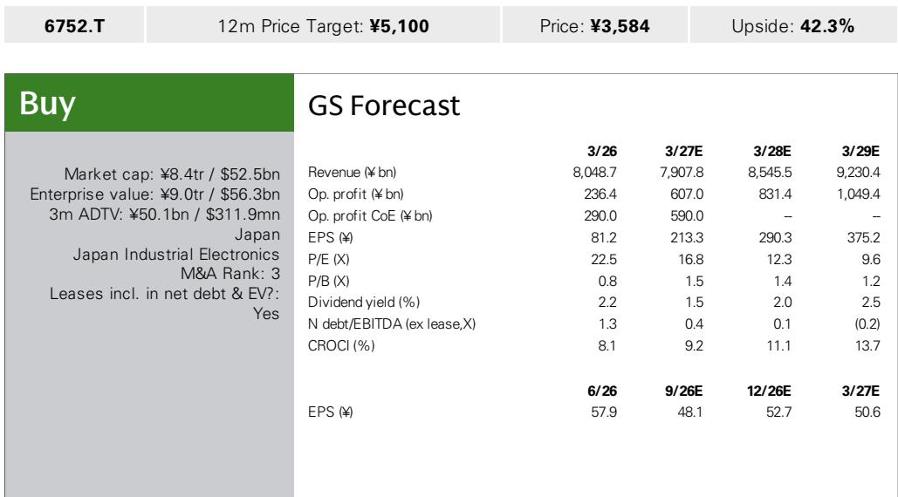

# 松下控股：从集团化复杂架构走向聚焦AI组件的战略转型

松下控股近期最显著的变化，并非某一款新产品、一次重组公告或一份修正后的业绩预测，而是一种坦诚的自我认知——公司管理层在与集团CFO及松下能源、松下工业CEO的多次会议中承认，公司历史上的问题并非技术短板，而是组织层面的摩擦。管理层现在明确表示，内部思维模式正在转变——从传统、分散的集团架构，转向更具成长导向的姿态。对于一家多年来持续推进业务组合优化的公司而言，这标志着从守势转向攻势。

这一转变的意义具体且可衡量。松下认为，在生成式AI数据中心所用的电池备份单元（BBU）领域，即使行业进入下一代硬件平台，公司仍能大体维持80%的市场份额。与此同时，公司正积极推进MEGTRON电路板材料的产能扩张——此前多年的产能布局延迟，让台湾竞争对手建立了明显的领先优势。松下CFO也坦言，MEGTRON正是产能扩张未能及时跟上的典型案例。当前的关键问题在于，松下能否在窗口期再次关闭之前，将技术先发优势转化为市场份额的实际增长。

这一议题之所以重要，是因为AI基础设施建设正进入一个组件层面的瓶颈决定项目进度的阶段。超大规模云服务商不仅采购GPU，还在锁定电力供应、热管理和高速信号完整性等关键环节。松下的产品组合——BBU、导电性电容和多层电路板材料——恰好处于这些约束条件的交汇点。公司能否执行既定战略，将决定其能否在预计到2027年3月财年占集团EBITDA约20%的生成式AI相关产品市场中，获取有意义的份额。

## MEGTRON的启示：技术领先如何被产能犹豫所削弱

MEGTRON是松下历史上执行落差最清晰的案例。公司在高性能多层电路板材料领域拥有先发优势，但未能及时扩大产能。正如CFO所承认的，结果是与台湾竞争对手的差距在近年来逐渐显现。这并非技术问题，而是资本配置问题。超大规模云服务商既关注性能指标，也同样重视制造产能的保障，而松下的犹豫让竞争对手得以锁定供应协议，这些协议如今构成了进入壁垒。

公司正在尝试纠正方向。管理层正在就进一步的产能扩张投资进行内部讨论，具体细节将在决策确定后披露。广州、苏州和泰国Ayutthaya的生产线采用共享模式，可根据订单灵活切换，这为松下应对需求结构变化提供了运营上的灵活性。公司还计划调整产品结构：目前MEGTRON 6及以下与MEGTRON 7及以上产品的生产比例约为各半，高性能产品的占比目标是在2027年3月财年达到约60%，并计划从下一年起继续提升。

应用场景正在从主板和基板扩展到半导体测试设备领域。这是一个值得关注的二阶效应：随着芯片复杂度提升，测试接口本身成为性能瓶颈，松下的材料正被纳入该环节的规格设计中。公司还在小批量生产下一代Meg9材料供客户验证，预计从2028年3月财年起进入全面量产。战略问题不在于松下是否拥有技术——事实显然如此——而在于能否以足够快的速度从内部讨论推进到实际资本支出，避免再次出现竞争差距。

## BBU业务：通过垂直整合与产品扩展捍卫80%份额

松下能源在AI数据中心BBU领域的地位，是公司技术领先优势仍然稳固的最有力证据。管理层认为，即使在下一代主要硬件平台中，公司仍能大体维持80%的市场份额。新一代电池单元的量产已部分启动，6-7月开始出货，设计工作已完成。这不是一家在等待市场的公司，而是一家已经在为下一代产品供货的公司。

该业务的单位经济性正在改善，即使出货量在增长。模块销售不会简单地随机架功耗从130千瓦提升至200千瓦而增长1.5倍，而是会因机架集成和增值功能而在价值层面上升。公司将增长目标设定为接近产能增幅的水平，这表明在规模扩大的同时定价能力仍在维持。垂直整合正在深化：电池管理系统几乎全部自产，公司还准备将DC/DC转换器部分转为自产。这是一种利润率保护策略，同时也增强了供应链控制力——对于关注组件供应稳定性的超大规模云服务商而言，这一考量日益重要。

产品组合正在从传统BBU扩展到电容备份单元（CBU）——这是一种提供替代或补充电源备份方案的新产品。管理层表示，与之前相比，需求可见度有所改善，并认为销售存在上行空间。客户扩展逻辑清晰：松下已赢得几乎所有BBU订单，随着CBU的加入，公司预计将扩大新客户基础。风险在于竞争——如果生成式AI相关BBU业务吸引激进的新进入者，或客户为降低集中度风险而采取多源采购策略，80%的份额假设可能过于乐观。但就目前而言，公司的早期设计优势和垂直整合提供了可防御的护城河。

## 电容与被动元件：AI基础设施的静默赋能者

导电性电容业务不像BBU或电路板材料那样引人注目，但它是AI基础设施的关键赋能环节，也是松下定价能力的体现。SP-CAP在半导体周边设备中表现良好，POSCAP在SSD备份应用中拥有约80%的市场份额。这种主导地位往往在供应中断发生时才被外界察觉，届时客户才会意识到更换供应商的成本。

原材料成本上涨正在顺利传导。钽和稀有金属价格上涨，但客户已接受价格调整。这对利润率可持续性而言是一个有意义的信号：表明松下的组件被视为关键任务级产品，客户愿意吸收价格上涨，而不愿冒供应中断或认证延迟的风险。在当前AI基础设施项目争分夺秒部署的环境下，项目中途更换供应商的成本极高，这为松下等现有供应商提供了暂时但宝贵的定价能力。

电容业务同样受益于与BBU和电路板材料相同的AI需求驱动因素。半导体周边设备、SSD备份和电力供应都需要高性能被动元件。松下将这些产品整合为成套解决方案的能力——BBU搭配CBU、电容组及相关控制电子——创造了单一产品竞争对手难以复制的交叉销售机会。公司历史上的集团化架构，在资本配置方面曾是负担，在解决方案广度方面则成为资产。

## 汽车电池业务的挑战：关税、产能爬坡与盈利路径

松下能源的汽车电池业务仍是集团盈利的最大拖累，第一季度业绩反映了挑战的规模。扣除IRA补贴后，汽车业务板块第一季度亏损约150亿日元，全年亏损指引超过700亿日元。缺口主要来自关税：每年约300亿日元，从第二季度起按保守假设计入，且未考虑退税可能。会计处理较为复杂，汽车关税拨备与客户各承担50%，但退税可能带来正向意外。公司第一季度录得70亿日元的转回，管理层指出某个季度可能突然收到超过100亿日元的退税。

堪萨斯工厂的延迟投产是另一个独立的运营问题。管理层将延迟归因于人员招聘和熟练度方面的运营挑战，导致公司无法充分响应实际需求。这是一个典型的产能爬坡问题——在新地区招聘和培训需要时间，而需求环境的变化快于运营建设进度。这意味着堪萨斯工厂对盈利的贡献将集中在后期，公司能否抓住需求增长将取决于能否解决这些运营约束。

汽车电池业务还面临松下无法控制的结构性风险。客户可能增加使用其他厂商的电池，从而加剧价格竞争压力。电动汽车市场可能进一步调整，减少整体需求。生成式AI相关BBU业务可能吸引更多竞争，侵蚀更广泛电池组合的盈利能力。松下能源的研究逻辑日益分化：AI相关产品是增长引擎，汽车业务则是价值拖累。公司能否管理好这种双重性，将决定市场是认可各部分之和的价值，还是继续施加集团折价。

## 评估框架：如何判断松下的执行力是否真正改变

对于观察者而言，关键问题不在于松下是否拥有合适的产品——证据表明确实如此——而在于组织变革是否真实且可持续。CFO关于内部思维模式正在转变的表态令人鼓舞，但需要通过可观察的行为来验证。跟踪这一转型的实用框架包括四个具体指标。

第一，资本支出公告。MEGTRON产能扩张是最清晰的检验标准。如果松下在未来两个季度内宣布对广州、苏州和Ayutthaya的追加投资，将表明MEGTRON延迟的教训已被内化。如果公司继续停留在内部讨论而不做出承诺，则说明旧的犹豫模式仍在延续。

第二，产品结构演变。到2027年3月财年将MEGTRON高性能产品占比提升至60%的目标，是一个具体、可衡量的承诺。生产比例的季度披露将反映公司是在执行既定战略，还是仅仅在表述愿景。同样，BBU模块销售相对于产能增幅的价值增长，将揭示定价能力是否得以维持。

第三，新产品推出的节奏。CBU需求可见度的改善和下一代平台设计的完成是积极信号，但公司需要证明能够在多代产品中保持这一节奏。半导体行业变化迅速，单一设计胜利并不能构成持久的业务优势。问题在于松下能否在后续平台中维持80%的份额。

第四，汽车电池拖累的演变。关税退税情况难以预测，但堪萨斯工厂的运营爬坡更具可控性。如果公司能在人员配置和熟练度方面取得进展，盈亏平衡的路径将更加清晰。如果运营挑战持续，对集团盈利的拖累将继续掩盖AI相关业务的表现。

公司自身指引所隐含的财务轨迹支持AI相关业务正成为主要价值驱动力的判断。预测显示，营业利润将从2026年3月财年的2364亿日元上升至2027年3月财年的6070亿日元，以及2028年3月财年的8314亿日元。生成式AI相关产品对EBITDA的贡献预计到2027年3月财年将达到约20%。随着汽车电池和Blue Yonder的投资高峰过去，公司预计将产生强劲的现金流，可能支持大规模的回购计划。资产负债表也提供支撑：净债务与EBITDA之比预计将从1.3倍下降至2027年3月财年的0.4倍，到2029年3月财年转为-0.2倍。

风险分布并不对称。公司面临产能扩张的执行风险、AI相关组件市场的竞争风险，以及汽车电池业务的持续拖累。基于2028年3月财年估算，估值约为9倍EV/EBITDA，并未充分反映AI相关增长如期实现时的潜在盈利能力。市场正在施加集团折价，这一折价是否合理，取决于执行节奏。未来四个季度将提供判断依据——松下是否真正从结构性改革进入增长模式，还是旧的犹豫和组织摩擦模式将重新显现。

*仅供参考。部分内容可能基于原始材料由AI辅助生成、翻译、摘要或编辑，可能存在遗漏或错误。请独立核实。本文不构成投资、法律、税务、会计或其他专业建议。*
