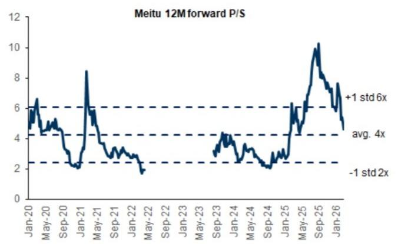
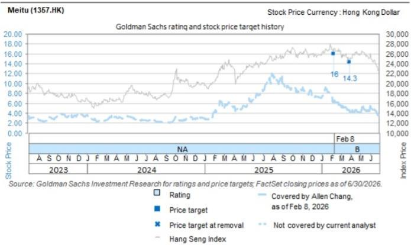

## 美图公司（1357.HK）：AI新品与功能有望推动经常性收入增长；2026年上半年生产力/娱乐工具收入同比+40%/+32%

美图公司公布2026年上半年影像、视频与设计产品收入同比增长31%至人民币18亿元，其中生产力应用同比增长40%，娱乐应用同比增长32%。由于退出传统业务（素材图库），该收入较此前预期低9%。截至2026年6月底，公司月活跃用户数达2.82亿（2025年底为2.76亿），付费订阅用户数同比增长约20%至1,840万，其中生产力应用付费用户数截至6月同比增长30%。公司预计2026年上半年净利润同比增长不低于35%，主要受增长动能和经营杠杆改善推动。我们持续看好美图基于MoE模型的新AI功能带来的工具采用率提升，以及新产品（人像精修AI代理、AI音乐视频等）的增量贡献。维持报告评级。

图表1：AI功能与新产品有望推动美图付费用户增长

  
资料来源：公司数据，GS全球投资研究

新产品带来强劲经常性收入增长：截至2026年6月，公司AI驱动生产力工具的年度经常性收入（ARR）同比增长48%至人民币6.2亿元（2026年3月为同比增长56%至人民币5.8亿元），主要由开拍和Vmake的强劲增长推动。管理层强调，AI音乐视频生成新产品MVLand在发布后3个月内ARR弹性较高，反映出用户需求以及公司开发新产品带来增量收入的能力。除订阅收入外，AI创作用户参与度持续提升，带动AI积分消耗收入在第二季度环比增长46%（2026年第一季度为46%）。

盈利预测调整：我们纳入美图2026年上半年指引，将2026-28年盈利预测下调7%/5%/8%，主要反映公司退出传统业务带来的收入调整，同时我们仍对公司新AI功能和新产品扩展推动付费率提升持积极看法。

图表2：盈利预测调整

<table><tr><td rowspan="2">人民币百万元</td><td colspan="3">2026E</td><td colspan="3">2027E</td><td colspan="3">2028E</td></tr><tr><td>原预测</td><td>新预测</td><td>变动</td><td>原预测</td><td>新预测</td><td>变动</td><td>原预测</td><td>新预测</td><td>变动</td></tr><tr><td>收入</td><td>5,096</td><td>4,842</td><td>-5%</td><td>6,811</td><td>6,524</td><td>-4%</td><td>8,984</td><td>8,492</td><td>-5%</td></tr><tr><td>毛利</td><td>3,803</td><td>3,611</td><td>-5%</td><td>5,139</td><td>4,915</td><td>-4%</td><td>6,815</td><td>6,431</td><td>-6%</td></tr><tr><td>经营利润</td><td>1,308</td><td>1,202</td><td>-8%</td><td>2,043</td><td>1,926</td><td>-6%</td><td>2,980</td><td>2,728</td><td>-8%</td></tr><tr><td>净利润</td><td>1,293</td><td>1,205</td><td>-7%</td><td>1,905</td><td>1,801</td><td>-5%</td><td>2,752</td><td>2,528</td><td>-8%</td></tr><tr><td>每股收益</td><td>0.28</td><td>0.26</td><td>-7%</td><td>0.42</td><td>0.39</td><td>-5%</td><td>0.60</td><td>0.55</td><td>-8%</td></tr><tr><td>利润率</td><td></td><td></td><td></td><td></td><td></td><td></td><td></td><td></td><td></td></tr><tr><td>毛利率</td><td>74.6%</td><td>74.6%</td><td></td><td>75.4%</td><td>75.3%</td><td></td><td>75.9%</td><td>75.7%</td><td></td></tr><tr><td>净利率</td><td>25.4%</td><td>24.9%</td><td></td><td>28.0%</td><td>27.6%</td><td></td><td>30.6%</td><td>29.8%</td><td></td></tr></table>

资料来源：公司数据，GS全球投资研究

估值：我们的目标价基于DCF方法（未变），以反映长期现金流创造能力。我们假设2032E-2036E第二阶段自由现金流增长率为12%，终值增长率为2%，与我们对科技板块的整体假设一致。我们以11.5%的WACC进行折现（beta为1.3，无风险利率为3.0%，市场风险溢价为6.5%）。基于下调后的自由现金流预测，DCF目标价为12.3港元（此前为14.3港元）。

图表3：美图DCF估值

<table><tr><td></td><td colspan="11">第一阶段</td><td colspan="5">第二阶段</td></tr><tr><td>人民币百万元</td><td>2021</td><td>2022</td><td>2023</td><td>2024</td><td>2025E</td><td>2026E</td><td>2027E</td><td>2028E</td><td>2029E</td><td>2030E</td><td>2031E</td><td>2032E</td><td>2033E</td><td>2034E</td><td>2035E</td><td>2036E</td></tr><tr><td colspan="17">损益表</td></tr><tr><td>收入</td><td>1,666</td><td>2,085</td><td>2,696</td><td>2,996</td><td>3,859</td><td>4,842</td><td>6,524</td><td>8,492</td><td>10,794</td><td>13,570</td><td>17,099</td><td></td><td></td><td></td><td></td><td></td></tr><tr><td>同比</td><td>40%</td><td>25%</td><td>29%</td><td>11%</td><td>29%</td><td>25%</td><td>35%</td><td>30%</td><td>27%</td><td>26%</td><td>26%</td><td></td><td></td><td></td><td></td><td></td></tr><tr><td>费用率</td><td>72.1%</td><td>60.5%</td><td>50.6%</td><td>59.6%</td><td>51.7%</td><td>49.7%</td><td>45.8%</td><td>43.6%</td><td>42.3%</td><td>40.7%</td><td>38.7%</td><td></td><td></td><td></td><td></td><td></td></tr><tr><td>经营利润</td><td>(76)</td><td>(74)</td><td>291</td><td>493</td><td>842</td><td>1,202</td><td>1,926</td><td>2,728</td><td>3,642</td><td>4,831</td><td>6,464</td><td></td><td></td><td></td><td></td><td></td></tr><tr><td>同比</td><td></td><td>不适用</td><td>不适用</td><td>不适用</td><td>不适用</td><td>43%</td><td>60%</td><td>42%</td><td>33%</td><td>33%</td><td>34%</td><td></td><td></td><td></td><td></td><td></td></tr><tr><td>税前利润</td><td>(11)</td><td>175</td><td>438</td><td>816</td><td>905</td><td>1,321</td><td>2,001</td><td>2,827</td><td>3,739</td><td>4,959</td><td>6,592</td><td></td><td></td><td></td><td></td><td></td></tr><tr><td>净利润</td><td>(45)</td><td>94</td><td>378</td><td>799</td><td>698</td><td>1,205</td><td>1,801</td><td>2,528</td><td>3,331</td><td>4,404</td><td>6,036</td><td></td><td></td><td></td><td></td><td></td></tr><tr><td>同比</td><td></td><td>不适用</td><td>不适用</td><td>不适用</td><td>不适用</td><td>73%</td><td>49%</td><td>40%</td><td>32%</td><td>32%</td><td>37%</td><td></td><td></td><td></td><td></td><td></td></tr><tr><td>毛利率</td><td>67.5%</td><td>56.9%</td><td>61.4%</td><td>76.0%</td><td>73.6%</td><td>74.6%</td><td>75.3%</td><td>75.7%</td><td>76.0%</td><td>76.3%</td><td>76.5%</td><td></td><td></td><td></td><td></td><td></td></tr><tr><td>经营利润率</td><td>-4.6%</td><td>-3.6%</td><td>10.8%</td><td>16.5%</td><td>21.8%</td><td>24.8%</td><td>29.5%</td><td>32.1%</td><td>33.7%</td><td>35.6%</td><td>37.8%</td><td></td><td></td><td></td><td></td><td></td></tr><tr><td>净利率</td><td>-2.7%</td><td>4.5%</td><td>14.0%</td><td>26.7%</td><td>18.1%</td><td>24.9%</td><td>27.6%</td><td>29.8%</td><td>30.9%</td><td>32.5%</td><td>35.3%</td><td></td><td></td><td></td><td></td><td></td></tr><tr><td>研发支出（人民币百万元）</td><td>545</td><td>586</td><td>635</td><td>911</td><td>945</td><td>1,218</td><td>1,583</td><td>2,041</td><td>2,600</td><td>3,274</td><td>3,420</td><td></td><td></td><td></td><td></td><td></td></tr><tr><td>研发占比</td><td>32.7%</td><td>28.1%</td><td>23.6%</td><td>30.4%</td><td>24.5%</td><td>25.1%</td><td>24.3%</td><td>24.0%</td><td>24.1%</td><td>24.1%</td><td>20.0%</td><td></td><td></td><td></td><td></td><td></td></tr><tr><td>开拍用户（千）</td><td></td><td></td><td>5</td><td>84</td><td>330</td><td>581</td><td>1,033</td><td>1,735</td><td>2,629</td><td>4,061</td><td>4,467</td><td></td><td></td><td></td><td></td><td></td></tr><tr><td>付费率</td><td></td><td></td><td>10.0%</td><td>12.0%</td><td>14.3%</td><td>15.5%</td><td>19.0%</td><td>22.0%</td><td>23.0%</td><td>24.5%</td><td>24.7%</td><td></td><td></td><td></td><td></td><td></td></tr><tr><td>ARPU（人民币）</td><td></td><td></td><td>40</td><td>143</td><td>188</td><td>217</td><td>236</td><td>268</td><td>315</td><td>360</td><td>380</td><td></td><td></td><td></td><td></td><td></td></tr><tr><td>美图秀秀用户（千）</td><td></td><td></td><td>3,921</td><td>5,387</td><td>7,148</td><td>8,038</td><td>10,357</td><td>12,247</td><td>14,192</td><td>16,243</td><td>17,055</td><td></td><td></td><td></td><td></td><td></td></tr><tr><td>付费率</td><td></td><td></td><td>3.1%</td><td>4.0%</td><td>5.3%</td><td>5.6%</td><td>7.0%</td><td>8.0%</td><td>9.0%</td><td>10.0%</td><td>10.5%</td><td></td><td></td><td></td><td></td><td></td></tr><tr><td>ARPU（人民币）</td><td></td><td></td><td>174</td><td>179</td><td>189</td><td>208</td><td>205</td><td>207</td><td>208</td><td>208</td><td>208</td><td></td><td></td><td></td><td></td><td></td></tr><tr><td colspan="17">现金流</td></tr><tr><td>现金转换周期</td><td>(414)</td><td>(244)</td><td>(194)</td><td>(306)</td><td>(213)</td><td>(189)</td><td>(180)</td><td>(170)</td><td>(150)</td><td>(100)</td><td>(98)</td><td></td><td></td><td></td><td></td><td></td></tr><tr><td>资本支出</td><td>(688)</td><td>(51)</td><td>(56)</td><td>(53)</td><td>(50)</td><td>(53)</td><td>(71)</td><td>(93)</td><td>(118)</td><td>(148)</td><td>(168)</td><td></td><td></td><td></td><td></td><td></td></tr><tr><td>资本支出/收入</td><td>41%</td><td>2%</td><td>2%</td><td>2%</td><td>1%</td><td>1%</td><td>1%</td><td>1%</td><td>1%</td><td>1%</td><td>2%</td><td></td><td></td><td></td><td></td><td></td></tr><tr><td>自由现金流</td><td>(714)</td><td>183</td><td>357</td><td>693</td><td>1,207</td><td>1,252</td><td>1,720</td><td>2,474</td><td>3,012</td><td>3,648</td><td>4,925</td><td>5,496</td><td>6,133</td><td>6,845</td><td>7,639</td><td>8,525</td></tr><tr><td>同比</td><td></td><td></td><td>95%</td><td>94%</td><td>74%</td><td>4%</td><td>37%</td><td>44%</td><td>22%</td><td>21%</td><td>35%</td><td>12%</td><td>12%</td><td>12%</td><td>12%</td><td>12%</td></tr><tr><td>终值增长率</td><td></td><td></td><td></td><td></td><td></td><td></td><td></td><td></td><td></td><td></td><td></td><td></td><td></td><td></td><td></td><td>2%</td></tr><tr><td>终值</td><td></td><td></td><td></td><td></td><td></td><td></td><td></td><td></td><td></td><td></td><td></td><td></td><td></td><td></td><td></td><td>92,014</td></tr><tr><td>折现因子</td><td></td><td></td><td></td><td></td><td></td><td>1.00</td><td>0.78</td><td>0.69</td><td>0.61</td><td>0.54</td><td>0.48</td><td>0.42</td><td>0.37</td><td>0.33</td><td>0.29</td><td>0.26</td></tr><tr><td>自由现金流现值</td><td></td><td></td><td></td><td></td><td></td><td>1,252</td><td>1,342</td><td>1,705</td><td>1,835</td><td>1,962</td><td>2,340</td><td>2,307</td><td>2,275</td><td>2,243</td><td>2,211</td><td>2,180</td></tr><tr><td>2026E企业价值（人民币百万元）</td><td></td><td></td><td></td><td></td><td></td><td>45,177</td><td></td><td></td><td></td><td></td><td></td><td></td><td></td><td></td><td></td><td></td></tr><tr><td>现金及等价物（净额）</td><td></td><td></td><td></td><td></td><td></td><td>5,158</td><td></td><td></td><td></td><td></td><td></td><td></td><td></td><td></td><td></td><td></td></tr><tr><td>2026E股权价值（人民币百万元）</td><td></td><td></td><td></td><td></td><td></td><td>50,336</td><td></td><td></td><td></td><td></td><td></td><td></td><td></td><td></td><td></td><td></td></tr><tr><td>每股价值（港元）</td><td></td><td></td><td></td><td></td><td></td><td>12.3</td><td></td><td></td><td></td><td></td><td></td><td></td><td></td><td></td><td></td><td></td></tr><tr><td colspan="17">WACC假设（2026E）</td></tr><tr><td>无风险利率</td><td>3.0%</td><td></td><td></td><td></td><td></td><td></td><td></td><td></td><td></td><td></td><td></td><td></td><td></td><td></td><td></td><td></td></tr><tr><td>Beta</td><td>1.30</td><td></td><td></td><td></td><td></td><td></td><td></td><td></td><td></td><td></td><td></td><td></td><td></td><td></td><td></td><td></td></tr><tr><td>市场风险溢价</td><td>6.5%</td><td></td><td></td><td></td><td></td><td></td><td></td><td></td><td></td><td></td><td></td><td></td><td></td><td></td><td></td><td></td></tr><tr><td>WACC</td><td>11.5%</td><td></td><td></td><td></td><td></td><td></td><td></td><td></td><td></td><td></td><td></td><td></td><td></td><td></td><td></td><td></td></tr></table>

资料来源：公司数据，GS全球投资研究

图表4：美图12个月前瞻市销率  
  
资料来源：Eikon Datastream

## 目标价风险与方法论——1357.HK

我们得出12个月目标价12.3港元，基于两阶段DCF模型，其中WACC为11.5%，终值增长率为2%。我们对美图给予报告评级。

主要风险包括：1）AI采用和商业化进展慢于预期；2）付费率低于预期；3）竞争加剧超出预期。

<table><tr><td>1357.HK</td><td>12个月目标价：12.30港元</td><td colspan="2">现价：4.28港元</td><td colspan="2">上行空间：187.4%</td></tr><tr><td>买入</td><td colspan="5">GS预测</td></tr><tr><td></td><td></td><td>12/25</td><td>12/26E</td><td>12/27E</td><td>12/28E</td></tr><tr><td rowspan="9">市值：195亿港元 / 25亿美元 企业价值：145亿港元 / 18亿美元 3个月日均成交量：4.834亿港元 / 6,170万美元 中国科技并购排名：3 净债务及EV中包含租赁？：是</td><td>收入（人民币百万元）新</td><td>3,858.7</td><td>4,841.8</td><td>6,524.1</td><td>8,492.3</td></tr><tr><td>收入（人民币百万元）原</td><td>3,858.7</td><td>5,095.6</td><td>6,811.4</td><td>8,983.9</td></tr><tr><td>EBITDA（人民币百万元）</td><td>895.1</td><td>1,255.4</td><td>1,973.3</td><td>2,772.7</td></tr><tr><td>每股收益（人民币）新</td><td>0.15</td><td>0.27</td><td>0.40</td><td>0.56</td></tr><tr><td>每股收益（人民币）原</td><td>0.15</td><td>0.29</td><td>0.42</td><td>0.61</td></tr><tr><td>市盈率（倍）</td><td>44.0</td><td>13.9</td><td>9.3</td><td>6.6</td></tr><tr><td>市净率（倍）</td><td>5.4</td><td>2.6</td><td>2.1</td><td>1.7</td></tr><tr><td>股息率（%）</td><td>0.7</td><td>2.1</td><td>3.1</td><td>4.4</td></tr><tr><td>CROCI（%）</td><td>68.4</td><td>125.3</td><td>175.3</td><td>228.0</td></tr><tr><td></td><td></td><td>12/25</td><td>6/26E</td><td>12/26E</td><td>6/27E</td></tr><tr><td></td><td>每股收益（人民币）</td><td>0.07</td><td>0.12</td><td>0.15</td><td>0.18</td></tr></table>

资料来源：公司数据，GS预测，FactSet。价格截至2026年7月30日收盘。

## 披露附录

## Reg AC

我们，Allen Chang、Verena Jeng和Ting Song，特此证明本报告中表达的所有观点准确反映了我们个人对相关公司及其证券的看法。我们还证明，我们的薪酬中没有任何部分直接或间接与本次报告中表达的具体建议或观点相关。

除非另有说明，本报告封面上列出的个人均为GS全球投资研究部分析师。

供稿作者：Allen Chang GS（亚洲）有限责任公司，Verena Jeng GS（亚洲）有限责任公司，Ting Song GS（亚洲）有限责任公司。

除非另有说明，本报告供稿作者披露中列出的个人均为GS全球投资研究部分析师。

## GS因子画像

GS因子画像通过将股票的关键属性与市场（即我们的评级股票池）及其行业同行进行比较，为个股提供研究背景。所描绘的四个关键属性为：成长性、财务回报、估值倍数（即估值）和综合（成长性、财务回报和估值倍数的复合）。成长性、财务回报和估值倍数通过每只股票特定指标的标准化排名计算。各指标的标准化排名随后取平均值并转换为相应属性的百分位。各指标的具体计算可能因财年、行业和地区而异，但标准方法如下：

成长性基于股票的前瞻性销售增长、EBITDA增长和每股收益增长（对于金融类公司，仅每股收益和销售增长），百分位越高表示成长性越强。财务回报基于股票的前瞻性ROE、ROCE和CROCI（对于金融类公司，仅ROE），百分位越高表示财务回报越高。估值倍数基于股票的前瞻性市盈率、市净率、价格/股息（P/D）、EV/EBITDA、EV/FCF和EV/债务调整后现金流（DACF）（对于金融类公司，仅市盈率、市净率和P/D），百分位越高表示估值倍数越高。综合百分位计算为成长性百分位、财务回报百分位和（100% - 估值倍数百分位）的平均值。

财务回报和估值倍数使用GS分析师对未来至少三个季度后的财年末预测。成长性使用未来至少七个季度后的财年与未来至少三个季度后的财年相比的输入（所有指标均按每股基础计算）。

有关GS因子画像计算方式的更详细说明，请联系您的GS代表。

## 并购排名

在我们的全球覆盖范围内，我们使用并购框架审视公司，综合考虑定性因素和定量因素（可能因行业和地区而异），以纳入某些公司可能被收购的可能性。然后我们对评级覆盖下的公司进行并购排名，从1到3，其中1代表公司成为收购目标的可能性较高（30%-50%），2代表中等可能性（15%-30%），3代表较低可能性（0%-15%）。对于排名为1或2的公司，按照我们的标准部门指引，我们将并购因素纳入目标价。并购排名为3的公司被视为不重要，因此不计入目标价，可能在研究中讨论也可能不讨论。

## Quantum

Quantum是GS的专有数据库，提供详细的财务报表历史、预测和比率。可用于对单一公司进行深入分析，或比较不同行业和市场的公司。

## 披露

美图的评级相对于其覆盖范围内的其他公司：AAC、ACM Research、AMEC、ASMPT、AVC、AccoTest、Anji Micro、Asus、Auras、BOE、BYDE、Biren、CR Micro、Cambricon、Chenbro、中国移动（香港）、中国电信、中国铁塔、中国联通、中软国际、Compal、德赛西威、E Ink、E-Town Semis、EHang、华大九天、Eoptolink、FOCI、Fositek、富士康工业互联网、技嘉、Gigadevice、广联达、HTC、海康威视、鸿海、地平线、华虹、华测导航、华勤技术（A）、华勤技术（H）、华海清科、Iluvatar、英诺赛科、浪潮、Insta360、英业达、长电科技、Kematik、King Slide、金蝶、金山办公、LandMark、大立光、联想、领益、卓胜微、美图、MetaX、Mitac、Montage（A）、Montage（H）、北方华创、NSIG、Nexchip、豪威、和硕、小马智行（ADR）、小马智行（H）、广达、RoboTechnik、锐捷网络、圣邦微、中芯国际（A）、中芯国际（H）、SZS、深信服、商汤、生益科技、深南电路、斯达半导、舜宇光学、TFC Optical、中科创达、通宇通讯、传音、UMT、UNIS、VPEC、Vanchip、韦尔股份、Victory Giant、启碁、WUS、文远知行、纬创、纬颖、燕东微、长飞光纤、用友、中兴通讯（A）、中兴通讯（H）、科大讯飞

## 公司特定监管披露

以下披露涉及GS集团（及其关联方，"GS"）与GS全球投资研究部所覆盖公司之间的关系。

截至本报告前一个月末，GS实益拥有普通股1%或以上（不包括根据美国证券法无需汇总的关联方和业务部门管理的头寸）：美图（4.28港元）

GS预计在未来3个月内收取或寻求收取投资银行服务报酬：美图（4.28港元）

GS在过去12个月内与以下公司存在投资银行服务客户关系：美图（4.28港元）

评级/投资银行关系分布 GS投资研究全球股票覆盖范围

<table><tr><td rowspan="2"></td><td colspan="3">评级分布</td><td colspan="3">投资银行关系</td></tr><tr><td>买入</td><td>持有</td><td>卖出</td><td>买入</td><td>持有</td><td>卖出</td></tr><tr><td>全球</td><td>50%</td><td>34%</td><td>16%</td><td>65%</td><td>59%</td><td>43%</td></tr></table>

截至2026年7月1日，GS全球投资研究部对3,104只股票有投资评级。GS将股票评为买入和卖出，纳入各区域投资清单；未纳入清单的股票视为中性。该等分类等同于上述FINRA规则要求的披露中的买入、持有和卖出。请参阅下方"评级、覆盖范围和相关定义"。投资银行关系图表反映了各评级类别中GS在过去十二个月内提供投资银行服务的公司百分比。

## 目标价和评级历史图表

  
所示目标价应结合GS此前所有已发布报告（可能包含或不包含目标价）以及公司、行业和金融市场的发展情况来考虑。

## 目标价历史表

## 美图（1357.HK）

报告日期 目标价（港元） 收盘价（港元）

2026年3月31日 14.30 4.29

2026年2月8日 16.00 6.24

表中所示目标价未针对公司行动进行调整。

## 监管披露

## 美国法律法规要求的披露

有关本报告提及公司的以下任何披露要求，请参阅上述公司特定监管披露：待处理交易中的主承销商或联合主承销商；1%或其他所有权；特定服务的报酬；客户关系类型；此前期间的承销公开发行；董事职位；对于股票，做市和/或专家角色。GS作为主体交易或可能交易本报告讨论的发行人债务证券（或相关衍生品）。

以下为额外要求的披露：所有权和重大利益冲突：GS政策禁止其分析师、向分析师汇报的专业人员及其家庭成员持有分析师覆盖范围内任何公司的证券。分析师薪酬：分析师薪酬部分基于GS的盈利能力，其中包括投资银行收入。分析师作为高管或董事：GS政策通常禁止其分析师、向分析师汇报的人员或其家庭成员在分析师覆盖范围内的任何公司担任高管、董事或顾问。非美国分析师：非美国分析师可能不是GS & Co. LLC的关联人员，因此可能不受FINRA规则2241或FINRA规则2242关于与标的公司沟通、公开露面以及交易所覆盖证券的限制。

## 美国以外司法管辖区法律和法规要求的额外披露

以下为指定司法管辖区要求的披露，除非已根据美国法律法规在上方作出。澳大利亚：GS Australia Pty Ltd及其关联公司不是澳大利亚的授权存款机构（该术语在1959年银行法（联邦）中定义），不提供银行服务，也不在澳大利亚开展银行业务。本研究及其访问权限仅面向澳大利亚公司法定义的"批发客户"，除非GS另有约定。在撰写研究报告时，GS Australia全球投资研究部的成员可能参加由其研究报告标的公司和实体主办或组织的实地考察和会议。在某些情况下，如果GS Australia认为在实地考察或会议的具体情况下适当且合理，此类实地考察或会议的费用可能部分或全部由发行人承担。如果本文件内容包含任何金融产品建议，则仅为一般性建议，由GS在未考虑客户的目标、财务状况或需求的情况下编制。客户在根据任何此类建议采取行动前，应考虑该
