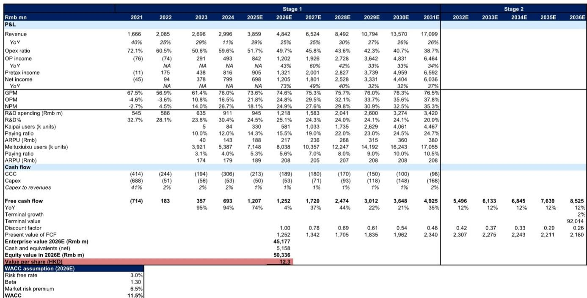
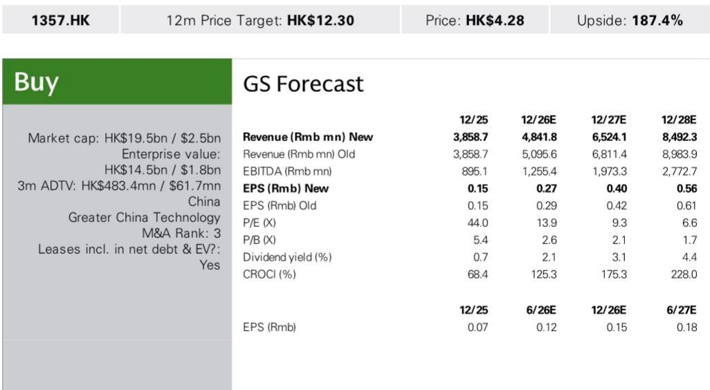
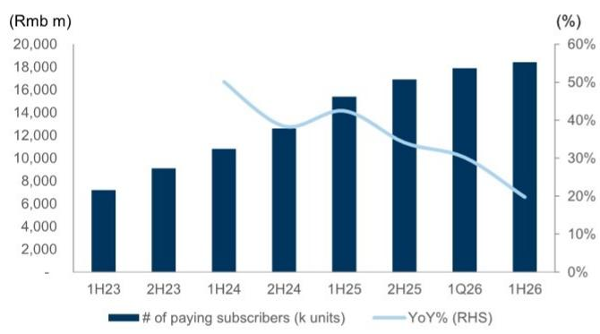

# 美图AI产品引擎增速超过原有业务，市场尚未充分反映这一变化

2026年上半年，美图影像与设计产品业务收入达18亿元人民币，同比增长31%。表面数字背后隐藏着更重要的信息：生产力应用增长40%，休闲应用增长32%，公司AI驱动生产力工具的年度经常性收入加速至6.2亿元人民币，同比增长48%。公司股价约4.28港元，对应2026年预期市盈率13.9倍——这一估值水平尚未充分反映公司AI商业化引擎的规模与增长轨迹。

核心矛盾很清晰。美图正在同步推进两件事：退出原有业务（素材授权），同时扩展新的AI产品矩阵，其中包括一款上线三个月内年度经常性收入弹性较高的AI音乐视频生成工具。管理层预计上半年净利润同比增长不低于35%，经营杠杆推动经营利润率从2025年的21.8%提升至2026年预期的24.8%。有研究报告指出，市场目前将美图定位为成熟的消费类应用公司，而经营数据表明它更像是一家具备分发优势的早期AI软件供应商。

这不是一个关于用户增长的故事。截至2026年6月底，月活跃用户达2.82亿，较2025年底的2.76亿增长约2%。关键在于转化：付费订阅用户同比增长20%至1840万，其中生产力应用付费用户同比增长30%。美图正在将庞大的活跃用户基础转化为规模虽小但快速扩张的高价值订阅群体，AI产品周期正是推动这一转化的机制。

## 生产力转型是核心驱动力，而非附属实验

整份报告中最重要的数据点是生产力应用与休闲应用增速之间的差异。生产力应用同比增长40%，休闲应用增长32%。这8个百分点的差距并非产品组合的偶然结果，而是主动的战略选择——优先推动解决具体工作流程问题的AI工具，包括面向专业人士的人像精修、面向创作者的音乐视频生成，以及面向小微企业的设计自动化，而非纯娱乐导向的功能。

年度经常性收入数据印证了这一方向。AI驱动生产力工具在2026年6月达到6.2亿元人民币，同比增长48%。增速较2026年3月的56%有所回落，但相对增量——单季度4000万元——表明基数在扩大，即便百分比增速趋于正常化。主要驱动力来自开拍和Vmake两款产品，它们在专业及半专业创作者群体中正获得越来越多的认可。

战略意义在于，美图的竞争对象已不再是其他消费类影像应用，而是一组更广泛的创意软件工具，且其成本结构是消费软件公司通常难以匹敌的。公司研发支出占收入比重预计从2024年的30.4%降至2026年预期的25.1%。这一下降并不代表AI投入减少，而是表明收入增速快于人员扩张需求。支撑新AI功能的MoE（混合专家）模型正在各产品间部署，意味着增量功能的边际成本低于分散式模型架构下的水平。

市场的误判在于将美图的生产力转型视为功能增强，而非商业模式转变。一家年订阅费30-40元的消费应用公司与一家能为专业人士节省数小时工作、年订阅费200-300元的生产力软件供应商，是两种不同的经济实体。报告中的DCF模型假设美图核心订阅产品美图秀秀的整体付费率从2026年预期的5.6%升至2031年的10.5%，ARPU从208元微调至208元——基本持平。相比之下，生产力产品的ARPU同期从217元升至380元。向生产力方向的组合迁移，正是利润率故事的核心。

## AI消耗积分正成为第二个商业化引擎

订阅收入是基础，但报告揭示了第二个值得关注的收入来源：按使用量付费的AI积分消耗。这类消耗型收入在2026年第二季度环比增长46%，与第一季度的46%持平。这是独立于订阅的另一种商业化机制，它改变了收入模型，而市场尚未充分认识到这一点。

AI积分的逻辑在于，用户生成图像、编辑视频或创作音乐视频时消耗计算资源。美图选择按消耗计量，而非完全打包进订阅层级。这创造了一条随使用强度增长的收入流，而不仅仅依赖订阅用户数量。对于拥有2.82亿月活跃用户的公司而言，即使只有一小部分用户偶尔购买增量AI积分，也能产生可观的收入——46%的季度增速表明使用强度在上升，而非仅用户数量在增长。

战略意义在于，AI积分对订阅疲劳形成了自然对冲。如果用户不愿承诺年度计划，仍可通过消耗产生收入。反过来，重度用户会发现订阅方案更具性价比，从而促进转化。两种机制相互强化而非相互蚕食。报告指出AI积分收入在第一和第二季度均实现46%的环比增长，这表明并非一次性促销效应，而是结构性的采用模式。

第二层含义是，随着AI积分收入规模扩大，公司毛利率有望改善。2026年预期毛利率为74.6%，与2025年基本持平。但AI积分收入的边际成本低于订阅收入，因为计算成本在生成时已发生。随着收入组合向消耗型收入倾斜，毛利率扩张可能超出当前预期。报告中的DCF模型假设毛利率到2031年达到76.5%，但如果AI积分继续以40%以上的季度增速增长，这一假设可能偏保守。

## MVLand的推出验证了产品引擎，而非仅仅是产品本身

报告中最具启示性的数据点是AI音乐视频生成工具MVLand的表现。管理层表示，这款新产品上线三个月内年度经常性收入弹性较高。这不仅是成功的产品发布，更证明了公司具备可重复的能力：识别创作者未被满足的需求，构建AI工具加以解决，并通过订阅和积分两种方式实现商业化。

在消费软件领域，能在三个月内将新产品推至可观的年度经常性收入水平是罕见的。大多数消费应用需要数年才能找到产品市场契合点。MVLand的轨迹表明，美图已形成一套内部AI产品开发流程，缩短了从概念到收入的周期。这正是复利增长的基础——每个新产品为年度经常性收入基数做出贡献，而基数又为下一轮产品开发提供资金。

报告还提到了一款人像精修AI代理，表明美图正从单一功能工具向代理式AI迈进——即能执行多步骤任务而非仅响应单一指令的软件。一个能完成人像精修全流程——识别瑕疵、调整光线、平滑皮肤、准备发布图像——的AI代理，与套用预设效果的滤镜有本质区别。它是为专业人士节省劳动力的工具，而专业人士为节省劳动力的工具支付的费用高于消费者为娱乐支付的费用。

模式很清晰：美图并非在发布孤立的功能，而是在构建覆盖创意工作流不同环节的AI能力组合。MVLand面向音乐视频制作，人像代理面向专业摄影，开拍面向设计，Vmake面向电商内容。每款产品针对不同的用户需求，但共享同一套底层AI基础设施。这正是MoE模型优势的体现——相同的基础能力在各产品间复用，在扩大可触达市场的同时控制研发成本。

## 原有业务退出是积极信号，而非收入隐忧

分析师将美图2026-2028年收入预期分别下调5%、4%和5%，理由是原有素材授权业务退出。这造成了美图在收缩的印象，而事实恰恰相反。公司是在主动剥离低增长、低利润的原有业务，聚焦于增长更快、利润率更高的AI驱动产品。

数据清晰地说明了这一取舍。2026年上半年影像与设计产品总收入同比增长31%至18亿元，即便素材授权业务已退出。生产力应用增长40%，休闲应用增长32%。原有业务对增长形成拖累——将其剥离后，剩余组合的有机增长率反而提升。收入预期调整是机械性修正，而非基本面的恶化。

经营杠杆的故事支持这一解读。2026年上半年净利润预计同比增长至少35%，快于收入增速。经营利润率预计从2025年的21.8%扩张至2026年预期的24.8%，并进一步升至2028年预期的32.1%。这一利润率扩张正是收入组合从低利润原有业务向高利润AI产品转移的直接结果。素材授权业务需要授权费用、内容策划和销售支持；AI产品需要算力，但以接近零的边际成本扩展。

市场对收入预期调整的关注忽略了更重要的一点：收入质量在提升。一家以25%增速增长、毛利率75%、经营杠杆持续扩张的公司，其价值高于一家增速30%但利润率较低、原有业务日渐式微的公司。报告中的DCF估值隐含187%的上行空间。问题不在于美图能否增长，而在于市场是否会最终认识到，这种增长的价值高于当前估值倍数所反映的水平。

## 评估AI消费软件商业化的分析框架

美图的案例提供了一个可迁移的框架，用于评估向AI驱动商业化转型的消费软件公司。框架包含四个组成部分，每个部分需单独评估，而非混入单一增长指标。

第一个组成部分是生产力与休闲应用的区分。能为用户节省时间或金钱的生产力应用，与提供娱乐的休闲应用具有根本不同的定价能力。生产力应用增长40%对休闲应用增长32%，是报告中最关键的单一指标，因为它指明了公司收入的来源。分析时应始终按使用场景拆分收入，而非仅按产品线，因为使用场景决定了ARPU的上限。

第二个组成部分是订阅与消耗的区分。订阅收入可预测，但受限于付费用户数量及其续费意愿。消耗型收入波动较大，但随使用强度增长。同时拥有两种机制的公司——如美图的订阅加AI积分——其收入模型比依赖单一机制的公司更具韧性。AI积分46%的季度增速是使用强度上升的领先指标，最终应转化为更高的订阅转化率。

第三个组成部分是新产品的发布速度。MVLand的数据点——三个月内年度经常性收入弹性较高——是可重复流程的证据，而非一次性成功。分析时应追踪新产品发布数量、从发布到实现可观年度经常性收入的时间，以及过去12个月内发布产品对年度经常性收入的贡献比例。一家能持续从过去一年发布的产品中获得20-30%年度经常性收入的公司，拥有难以复制的复利引擎。

第四个组成部分是利润率轨迹。报告显示经营利润率从2025年的21.8%扩张至2031年预期的37.8%，驱动力来自收入组合转移和经营杠杆。这是检验AI商业化是否真实有效的最终标准：如果公司能在收入增长的同时扩张利润率，说明AI产品具备真正的差异化；如果增长需要持续再投入而利润率持平，则AI产品很可能已同质化。

将这一框架应用于美图，结论清晰。生产力应用占比有利，订阅与消耗的组合均衡且增长，新产品发布速度突出，利润率轨迹强劲向上。市场对原有业务退出和收入预期调整的关注，是对形势的误读。公司并非在收缩，而是在转型，且转型正在加速。

剩余的风险在于竞争。报告将AI采用速度慢于预期、付费率低于预期以及竞争激烈程度高于预期列为主要风险。这些是真实存在的担忧，尤其是当更大的AI平台开始将创意工具纳入更广泛的订阅服务时。但DCF估值已通过11.5%的加权平均资本成本和2%的终值增长率对这些风险进行了折现。187%的隐含上行空间表明，市场定价反映的是美图AI战略未能成功的场景，而非成功的场景。

美图的轨迹不仅是一家公司产品周期的故事。它是消费软件公司如何借助AI实现转型的案例研究：从低ARPU的娱乐应用转向高ARPU的生产力工具，从纯订阅模式转向订阅与消耗混合模式，从缓慢的产品周期转向快速的AI驱动发布节奏。市场尚未调整其估值框架以反映这些变化。这正是机会所在。

*仅供参考。部分内容可能基于原始材料由AI辅助生成、翻译、摘要或编辑，可能存在遗漏或错误。请独立核实。本文不构成投资、法律、税务、会计或其他专业建议。*

仅供参考。部分内容可能基于原始材料由AI辅助生成、翻译、摘要或编辑，可能存在遗漏或错误。请独立核实。本文不构成投资、法律、税务、会计或其他专业建议。

