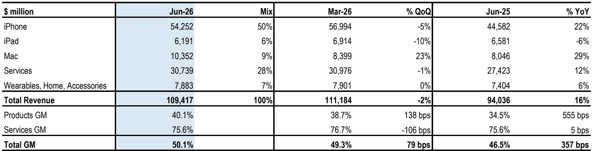
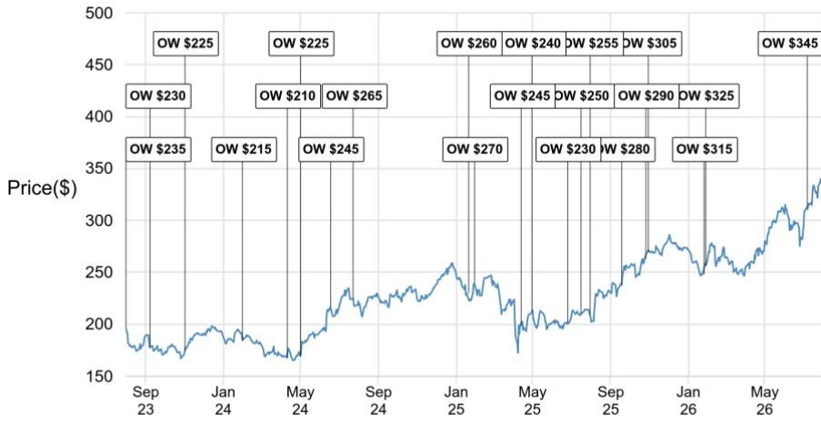
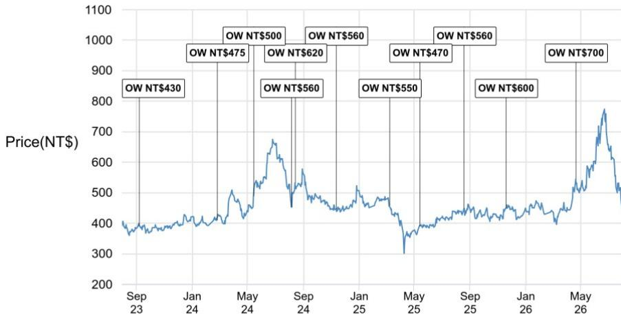

# JPM：苹果业务与近期数据观察

苹果六月季度财报交出营收1094亿美元、同比增长16%的成绩单，落在管理层此前14%-17%指引区间的高端。产品收入增长18%，iPhone 17系列与MacBook Neo的需求在供应受限下仍然坚挺。这份JPM科技团队的报告没有停留在对苹果本身的确认上，它更想回答的问题是：在内存成本持续攀升、新品节奏变化的2026年，供应链上哪些环节还能守住利润率。

报告给出的核心判断是：iPhone需求韧性仍在，但内存涨价正在改变整条供应链的成本分配。苹果指引九月季度营收同比增长9%-11%，低于市场一致预期的12%，原因包括2.5个百分点的汇率逆风，以及iPhone、Mac、iPad全线面临的供应约束——尤其是SoC。管理层预计iPhone收入在下一季度仍能实现中双位数同比增长，支撑来自份额提升带来的需求韧性。但内存成本上涨持续影响产品毛利率，新款iPhone潜在的定价调整可能带来需求不确定性，尽管iPhone的价格弹性相对较低。与此同时，非内存组件的降本不确定性也会传导至相关供应商。

## 1. 下半年iPhone组装量预估同比下滑7%

报告对2026年下半年iPhone EMS组装量的预估是：三季度5200万台，四季度8500万台，合计1.14亿台，同比下滑7%。其中iPhone 18系列（含Pro、Pro Max和折叠款）贡献8800万台，比2025年下半年iPhone 17系列的9700万台低10%。差异主要来自新品数量——2025年下半年有4款iPhone 17系列机型，而2026年下半年只有3款iPhone 18系列机型。

折叠屏iPhone是今年供应链最大的变量。报告预计2026年折叠屏iPhone组装量为700万至800万台。全年来看，iPhone EMS组装总量预估维持在2.5亿台左右，与2025年持平。这个数字本身说明问题：在Android智能手机整体承压的背景下，iPhone的份额仍在扩大。

> **KC评论：** 全年总量持平、下半年同比下滑7%，这两个数字放在一起看，意味着上半年的组装节奏比去年同期更紧凑。折叠屏iPhone的700-800万台虽然相对量不大，但对供应链来说是一条全新的增量产线，相关零组件的价值量结构值得单独拆开看。

## 2. 六月季度产品收入增长由iPhone与Mac共同驱动

分产品看，六月季度iPhone收入环比下滑5%、同比增长22%，iPhone 17系列需求好于预期是主要支撑。Mac收入环比增长23%、同比增长29%，创下六月季度新高，MacBook Neo在供应受限的情况下仍实现了稳固的份额增长。iPad收入环比下滑10%、同比下滑6%，主要受高基数影响。可穿戴设备收入环比持平、同比增长6%，Apple Watch换机需求稳健。

产品毛利率40.1%，同比提升555个基点、环比提升138个基点，其中关税退税贡献了2.5个百分点的正向影响。这个数字需要留意：如果没有关税退税，产品毛利率的同比改善幅度会明显收窄。服务毛利率75.6%，环比下滑106个基点，同比基本持平。

## 3. 内存涨价重塑供应链成本结构，镜头供应商相对受益

报告对供应链的态度是选择性的。内存价格持续上涨意味着部分组件供应商的ASP和毛利率将面临不确定性。在这种环境下，报告更偏好镜头供应商，理由是它们除了受益于iPhone需求外，还通过CPO FAU实现了产品多元化。

这里的关键逻辑是：内存成本上涨对苹果来说是毛利率不确定性，对内存供应商来说是利润弹性，但对非内存组件供应商来说，苹果为了对冲内存涨价，必然会在其他组件上施加更严格的降本要求。镜头供应商的差异化在于，它们的产品线不只有手机镜头，CPO FAU打开了新的增长空间，因此对苹果单一客户的议价不确定性不那么敏感。

> **KC评论：** 内存涨价对供应链的影响不是均匀分布的。苹果要保住整机毛利率，就会把降本不确定性转嫁给非内存组件供应商。镜头厂商的相对优势在于产品线更宽，CPO FAU这类新业务提供了缓冲。看供应链标的时，产品多元化程度比单一客户订单量更能说明问题。

## 4. 观察框架：从组装量、新品节奏与成本传导三个维度跟踪

这份报告提供了一个可复用的分析框架。第一，组装量是需求侧的锚，但要看结构——新品数量、折叠屏占比、上下半年节奏，比总量数字更有信息量。第二，新品节奏决定供应链的产能安排，iPhone 18系列从4款减到3款，意味着部分产线的利用率会受到影响。第三，成本传导是利润侧的过滤器，内存涨价的背景下，哪些环节能转嫁成本、哪些环节只能被动承受，决定了供应链内部的利润再分配。

报告对2026年全年iPhone组装量维持2.5亿台的预估，隐含的判断是苹果在Android阵营份额流失的背景下仍有增长空间。但内存成本与新品定价之间的张力，是下半年需要持续跟踪的变量。iPhone的价格弹性虽然相对较低，但并非不存在——如果定价调整幅度超出市场预期，需求韧性本身也需要重新检验。

这份报告的结论可以概括为一句话：iPhone需求为供应链提供了底部支撑，但内存涨价与新品节奏变化正在制造新的分化。分化不在苹果与Android之间，而在供应链内部——谁能转嫁成本、谁有第二增长曲线，谁就能在2026年下半年保持相对优势。

For informational purposes only. Portions may be generated,translated,summarized,or edited with AI assistance based on source materials and may contain omissions or errors. Please verify independently. This is not investment,legal,tax,accounting,or other professional advice.

