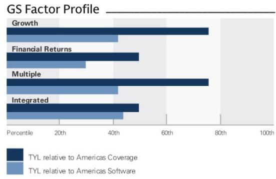
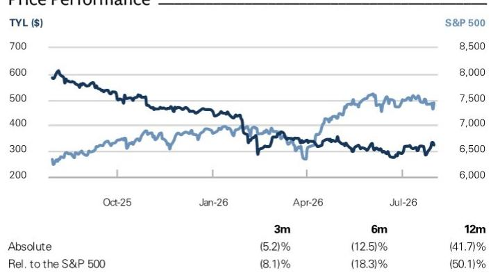
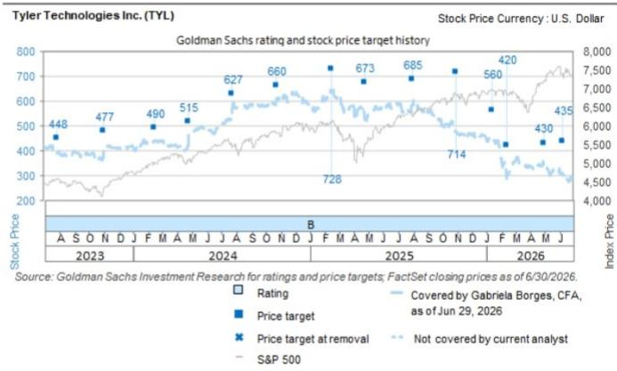

<table><tr><td>Key Data</td></tr><tr><td>Market cap: $13.5bnEnterprise value: $13.5bn3m ADTV: $262.4mnUnited StatesAmericas SoftwareM&A Rank: 3</td></tr></table>

# Tyler Technologies Inc. (TYL)

2Q26: Cloud trendline likely continues to move higher, with AI contributing in the next 2 years

TYL

12m Price Target: \$395.00

Price: \$323.31

Upside: $22.2\%$

TYL was down 3% on 7/30 post 2Q EPS (v. NASDAQ +3%). Revenue was 0.4% below the Street, EBIT margins were in line, and FY26 guidance was maintained (Visible Alpha). The stock reaction likely reflects a) weaker subscription revenue at 12% yoy (vs. Street at 14%), and b) the delta between accelerating bookings and unchanged revenue guidance, which Tyler attributed largely to typical puts and takes to implementation and cloud conversion timing. We are Buy rated: cloud conversions are still trending up (with stronger share/LTV/margins). We believe Tyler's stronger product portfolio vs. the competition will drive ongoing share gains, and AI and cloud adoption are likely to ultimately catalyze more modernization projects.

1. Cloud transition: Tyler continues to make progress on its cloud transition. Given the nature of Tyler's government exposure, the timing of deals drives unevenness in KPIs from quarter to quarter. SaaS revenue was $+22\%$ yoy (from $+23\%$ in 1Q on a 50bp harder comp). Total SaaS bookings was $+21\%$ (vs. $+40\%$ in 1Q). Management discussed a growing set of incentives designed to accelerate migrations. AI functionality will increasingly be cloud only, joining a broader set of cloud exclusive capabilities that management believes will drive customer migrations over the next several years. While AI is not yet a major driver of cloud conversions, Tyler expects it to become increasingly important over the next 12 to 18 months as more agentic functionality is embedded across the product portfolio.

2. Margins: Tyler reported 26% EBIT margins (with a \~\$5mn/80bp one time impact from litigation expenses) on margin tailwinds from the cloud transition, continued mix shift to higher margin SaaS revenues and away from professional services and hardware, and leverage in opex. FCF margin was 18%, and

## BUY

Gabriela Borges, CFA
+1(212)902-7839 | gabriela.borges@gs.com
GS & Co. LLC

Maura Hager
+1(212)9028724 | maura.hager@gs.com
GS & Co. LLC

Greyson Sklba
+1(212)357-2534 | greyson.sklba@gs.com
GS & Co. LLC

GS Forecast

<table><tr><td colspan="5">CS Forecast</td></tr><tr><td></td><td>12/25</td><td>12/26E</td><td>12/27E</td><td>12/28E</td></tr><tr><td>Revenue ($ mn) New</td><td>2,332.3</td><td>2,564.7</td><td>2,819.0</td><td>3,098.8</td></tr><tr><td>Revenue ($ mn) Old</td><td>2,332.3</td><td>2,565.2</td><td>2,818.1</td><td>3,097.7</td></tr><tr><td>EBITDA ($ mn)</td><td>650.4</td><td>742.6</td><td>864.3</td><td>1,006.8</td></tr><tr><td>EBIT ($ mn)</td><td>606.7</td><td>698.8</td><td>818.2</td><td>958.8</td></tr><tr><td>EPS ($) New</td><td>11.31</td><td>13.14</td><td>15.77</td><td>18.55</td></tr><tr><td>EPS ($) Old</td><td>11.31</td><td>12.99</td><td>15.70</td><td>18.48</td></tr><tr><td>P/E (X)</td><td>48.5</td><td>24.6</td><td>20.5</td><td>17.4</td></tr><tr><td>Dividend yield (%)</td><td>-</td><td>-</td><td>-</td><td>-</td></tr><tr><td>Net debt/EBITDA (X)</td><td>(0.8)</td><td>(0.1)</td><td>(1.0)</td><td>(1.8)</td></tr><tr><td></td><td>6/26</td><td>9/26E</td><td>12/26E</td><td>3/27E</td></tr><tr><td>EPS ($)</td><td>3.08</td><td>3.56</td><td>3.41</td><td>3.61</td></tr></table>

GS Factor Profile

  
Source: Company data, GS estimates. See disclosures for details.

## Tyler Technologies Inc. (TYL)

Rating since Apr 18, 2023

Ratios & Valuation

<table><tr><td></td><td>12/25</td><td>12/26E</td><td>12/27E</td><td>12/28E</td></tr><tr><td>P/E (X)</td><td>48.5</td><td>24.6</td><td>20.5</td><td>17.4</td></tr><tr><td>EV/EBITDA (X)</td><td>35.6</td><td>18.2</td><td>14.7</td><td>11.9</td></tr><tr><td>EV/sales (X)</td><td>9.9</td><td>5.3</td><td>4.5</td><td>3.9</td></tr><tr><td>FCF yield (%)</td><td>2.7</td><td>5.3</td><td>6.1</td><td>6.9</td></tr><tr><td>EV/DACF (X)</td><td>35.8</td><td>19.6</td><td>17.6</td><td>14.3</td></tr><tr><td>CROCI (%)</td><td>15.5</td><td>16.1</td><td>16.7</td><td>19.4</td></tr><tr><td>ROE (%)</td><td>8.9</td><td>10.7</td><td>13.1</td><td>13.8</td></tr><tr><td>Net debt/EBITDA (X)</td><td>(0.8)</td><td>(0.1)</td><td>(1.0)</td><td>(1.8)</td></tr><tr><td>Net debt/equity (%)</td><td>(13.4)</td><td>(1.4)</td><td>(21.9)</td><td>(38.2)</td></tr><tr><td>Interest cover (X)</td><td>71.6</td><td>39.6</td><td>39.9</td><td>49.3</td></tr><tr><td>Inventory days</td><td>NM</td><td>NM</td><td>NM</td><td>NM</td></tr><tr><td>Receivable days</td><td>96.0</td><td>93.8</td><td>91.5</td><td>90.7</td></tr><tr><td>Days payable outstanding</td><td>48.4</td><td>49.9</td><td>50.5</td><td>51.9</td></tr></table>

Growth & Margins (%)

<table><tr><td></td><td>12/25</td><td>12/26E</td><td>12/27E</td><td>12/28E</td></tr><tr><td>Total revenue growth</td><td>9.1</td><td>10.0</td><td>9.9</td><td>9.9</td></tr><tr><td>EBITDA growth</td><td>12.9</td><td>14.2</td><td>16.4</td><td>16.5</td></tr><tr><td>EPS growth</td><td>18.4</td><td>16.2</td><td>20.1</td><td>17.6</td></tr><tr><td>DPS growth</td><td>NM</td><td>NM</td><td>NM</td><td>NM</td></tr><tr><td>Gross margin</td><td>46.5</td><td>48.6</td><td>50.4</td><td>52.6</td></tr><tr><td>EBIT margin</td><td>15.3</td><td>17.4</td><td>20.4</td><td>22.9</td></tr></table>

<table><tr><td colspan="5">Balance Sheet ($ mn)</td></tr><tr><td></td><td>12/25</td><td>12/26E</td><td>12/27E</td><td>12/28E</td></tr><tr><td>Cash &amp; cash equivalents</td><td>1,097.2</td><td>1,458.9</td><td>2,281.7</td><td>3,224.2</td></tr><tr><td>Accounts receivable</td><td>638.8</td><td>679.9</td><td>733.0</td><td>807.8</td></tr><tr><td>Inventory</td><td>-</td><td>-</td><td>-</td><td>-</td></tr><tr><td>Other current assets</td><td>107.9</td><td>121.7</td><td>138.7</td><td>158.2</td></tr><tr><td>Total current assets</td><td>1,843.9</td><td>2,260.5</td><td>3,153.3</td><td>4,190.3</td></tr><tr><td>Net PP&amp;E</td><td>196.0</td><td>192.1</td><td>182.9</td><td>172.7</td></tr><tr><td>Net intangibles</td><td>3,438.8</td><td>3,604.0</td><td>3,499.5</td><td>3,397.1</td></tr><tr><td>Total investments</td><td>0.0</td><td>0.0</td><td>0.0</td><td>0.0</td></tr><tr><td>Other long-term assets</td><td>160.3</td><td>144.0</td><td>144.0</td><td>144.0</td></tr><tr><td>Total assets</td><td>5,638.9</td><td>6,200.6</td><td>6,979.7</td><td>7,904.0</td></tr><tr><td>Accounts payable</td><td>174.7</td><td>186.1</td><td>201.0</td><td>217.2</td></tr><tr><td>Short-term debt</td><td>599.7</td><td>-</td><td>-</td><td>-</td></tr><tr><td>Current lease liabilities</td><td>9.6</td><td>9.3</td><td>10.1</td><td>11.2</td></tr><tr><td>Other current liabilities</td><td>190.7</td><td>213.9</td><td>234.7</td><td>261.1</td></tr><tr><td>Total current liabilities</td><td>974.6</td><td>409.3</td><td>445.8</td><td>489.4</td></tr><tr><td>Long-term debt</td><td>0.0</td><td>1,412.3</td><td>1,419.5</td><td>1,426.7</td></tr><tr><td>Non-current lease liabilities</td><td>33.3</td><td>35.1</td><td>35.1</td><td>35.1</td></tr><tr><td>Other long-term liabilities</td><td>126.3</td><td>143.5</td><td>143.5</td><td>143.5</td></tr><tr><td>Total long-term liabilities</td><td>961.5</td><td>2,479.8</td><td>2,591.0</td><td>2,712.2</td></tr><tr><td>Total liabilities</td><td>1,936.1</td><td>2,889.1</td><td>3,036.8</td><td>3,201.7</td></tr><tr><td>Preferred shares</td><td>-</td><td>-</td><td>-</td><td>-</td></tr><tr><td>Total common equity</td><td>3,702.8</td><td>3,311.5</td><td>3,942.9</td><td>4,702.4</td></tr><tr><td>Minority interest</td><td>-</td><td>-</td><td>-</td><td>-</td></tr><tr><td>Total liabilities &amp; equity</td><td>5,638.9</td><td>6,200.6</td><td>6,979.7</td><td>7,904.0</td></tr><tr><td>BVPS ($)</td><td>85.92</td><td>78.86</td><td>93.68</td><td>110.61</td></tr></table>

Price Performance  
  
Cash Flow (\$ mn)  
Source: FactSet. Price as of 30 Jul 2026 close.

<table><tr><td></td><td>12/25</td><td>12/26E</td><td>12/27E</td><td>12/28E</td></tr><tr><td>Net income</td><td>315.6</td><td>376.5</td><td>476.3</td><td>596.8</td></tr><tr><td>D&amp;A add-back</td><td>138.4</td><td>140.2</td><td>133.8</td><td>133.2</td></tr><tr><td>Minority interest add-back</td><td>-</td><td>-</td><td>-</td><td>-</td></tr><tr><td>Net (inc)/dec working capital</td><td>(19.8)</td><td>21.9</td><td>77.6</td><td>70.4</td></tr><tr><td>Others</td><td>219.4</td><td>191.1</td><td>155.0</td><td>162.7</td></tr><tr><td>Cash flow from operations</td><td>653.5</td><td>729.7</td><td>842.8</td><td>963.1</td></tr><tr><td>Capital expenditures</td><td>(16.0)</td><td>(13.5)</td><td>(13.4)</td><td>(13.2)</td></tr><tr><td>Acquisitions</td><td>-</td><td>-</td><td>-</td><td>-</td></tr><tr><td>Divestitures</td><td>121.9</td><td>73.8</td><td>-</td><td>-</td></tr><tr><td>Others</td><td>(328.4)</td><td>(271.8)</td><td>(6.6)</td><td>(7.3)</td></tr><tr><td>Cash flow from investing</td><td>(222.5)</td><td>(211.5)</td><td>(20.1)</td><td>(20.5)</td></tr><tr><td>Dividends paid</td><td>-</td><td>-</td><td>-</td><td>-</td></tr><tr><td>Share issuance/(repurchase)</td><td>(152.7)</td><td>(768.0)</td><td>-</td><td>-</td></tr><tr><td>Inc/(dec) in debt</td><td>-</td><td>805.8</td><td>-</td><td>-</td></tr><tr><td>Others</td><td>50.8</td><td>(194.3)</td><td>-</td><td>-</td></tr><tr><td>Cash flow from financing</td><td>(101.8)</td><td>(156.4)</td><td>0.0</td><td>0.0</td></tr><tr><td>Total cash flow</td><td>329.2</td><td>361.7</td><td>822.7</td><td>942.6</td></tr><tr><td>Free cash flow</td><td>637.5</td><td>716.2</td><td>829.4</td><td>949.8</td></tr><tr><td>Free cash flow per share (basic) ($)</td><td>14.79</td><td>17.05</td><td>19.70</td><td>22.34</td></tr></table>

Income Statement (\$ mn)

<table><tr><td colspan="5">Income Statement ($ MM)</td></tr><tr><td></td><td>12/25</td><td>12/26E</td><td>12/27E</td><td>12/28E</td></tr><tr><td>Total revenue</td><td>2,332.3</td><td>2,564.7</td><td>2,819.0</td><td>3,098.8</td></tr><tr><td>Cost of goods sold</td><td>(1,248.6)</td><td>(1,318.7)</td><td>(1,399.6)</td><td>(1,469.4)</td></tr><tr><td>SG&amp;A</td><td>(465.0)</td><td>(497.2)</td><td>(528.1)</td><td>(582.5)</td></tr><tr><td>R&amp;D</td><td>(204.6)</td><td>(248.1)</td><td>(264.8)</td><td>(286.6)</td></tr><tr><td>Other operating inc./(exp.)</td><td>(56.4)</td><td>(55.6)</td><td>(52.7)</td><td>(51.1)</td></tr><tr><td>EBITDA</td><td>650.4</td><td>742.6</td><td>864.3</td><td>1,006.8</td></tr><tr><td>Depreciation &amp; amortization</td><td>(137.6)</td><td>(134.1)</td><td>(133.8)</td><td>(133.2)</td></tr><tr><td>EBIT</td><td>357.7</td><td>445.1</td><td>573.9</td><td>709.3</td></tr><tr><td>Net interest inc./(exp.)</td><td>32.6</td><td>20.7</td><td>48.8</td><td>70.8</td></tr><tr><td>Income/(loss) from associates</td><td>-</td><td>-</td><td>-</td><td>-</td></tr><tr><td>Pre-tax profit</td><td>390.3</td><td>490.9</td><td>622.7</td><td>780.1</td></tr><tr><td>Provision for taxes</td><td>(74.7)</td><td>(114.4)</td><td>(146.3)</td><td>(183.3)</td></tr><tr><td>Minority interest</td><td>-</td><td>-</td><td>-</td><td>-</td></tr><tr><td>Preferred dividends</td><td>-</td><td>-</td><td>-</td><td>-</td></tr><tr><td>Net inc. (pre-exceptionals)</td><td>315.6</td><td>376.5</td><td>476.3</td><td>596.8</td></tr><tr><td>Net inc. (post-exceptionals)</td><td>495.5</td><td>555.1</td><td>667.6</td><td>792.8</td></tr><tr><td>EPS (basic, pre-except) ($)</td><td>7.32</td><td>8.97</td><td>11.32</td><td>14.04</td></tr><tr><td>EPS (diluted, pre-except) ($)</td><td>7.20</td><td>8.91</td><td>11.25</td><td>13.96</td></tr><tr><td>EPS (ex-ESO exp., dil.) ($)</td><td>--</td><td>--</td><td>--</td><td>--</td></tr><tr><td>DPS ($)</td><td>-</td><td>-</td><td>-</td><td>-</td></tr><tr><td>Div. payout ratio (%)</td><td>0.0</td><td>0.0</td><td>0.0</td><td>0.0</td></tr><tr><td>Wtd avg shares out. (basic) (mn)</td><td>43.1</td><td>42.0</td><td>42.1</td><td>42.5</td></tr><tr><td>Wtd avg shares out. (diluted) (mn)</td><td>43.8</td><td>42.3</td><td>42.3</td><td>42.7</td></tr></table>

Source: Company data, GS estimates.

management maintained 2026 guidance of 26-28%. Key drivers of margin expansion over the next two years include continued revenue mix shift to SaaS and benefits of cloud optimization and version consolidation.

## EPS recap

<table><tr><td rowspan="2">($, mn unless specified otherwise)</td><td colspan="5">2Q26A</td></tr><tr><td>Actual</td><td>GSe</td><td>Street</td><td>Actual vs GSe</td><td>Actual vs Street</td></tr><tr><td>SaaS Revenue</td><td>$231</td><td>$234</td><td>$233</td><td>-1.2%</td><td>-0.9%</td></tr><tr><td>% yoy</td><td>22%</td><td>23%</td><td>23%</td><td></td><td></td></tr><tr><td>Transaction-Based Revenue</td><td>$223</td><td>$230</td><td>$228</td><td>-2.8%</td><td>-2.4%</td></tr><tr><td>% yoy</td><td>4%</td><td>6%</td><td>6%</td><td></td><td></td></tr><tr><td>Subscription Revenue</td><td>$454</td><td>$463</td><td>$461</td><td>-2.0%</td><td>-1.5%</td></tr><tr><td>% yoy</td><td>12%</td><td>14%</td><td>14%</td><td></td><td></td></tr><tr><td>Maintenance Revenue</td><td>$106</td><td>$108</td><td>$107</td><td>-1.7%</td><td>-1.5%</td></tr><tr><td>% yoy</td><td>-6%</td><td>-4%</td><td>-4%</td><td></td><td></td></tr><tr><td>Professional Services Revenue</td><td>$63</td><td>$61</td><td>$61</td><td>3.6%</td><td>3.9%</td></tr><tr><td>% yoy</td><td>8%</td><td>4%</td><td>4%</td><td></td><td></td></tr><tr><td>Other Revenues</td><td>$22</td><td>$23</td><td>$19</td><td>-0.6%</td><td>16.7%</td></tr><tr><td>% yoy</td><td>10%</td><td>11%</td><td>-6%</td><td></td><td></td></tr><tr><td>Total Revenue</td><td>$645</td><td>$654</td><td>$648</td><td>-1.4%</td><td>-0.4%</td></tr><tr><td>% yoy</td><td>8%</td><td>10%</td><td>9%</td><td></td><td></td></tr><tr><td>Operating Income</td><td>$166</td><td>$162</td><td>$170</td><td>2.2%</td><td>-2.8%</td></tr><tr><td>% margin</td><td>26%</td><td>25%</td><td>26%</td><td></td><td></td></tr><tr><td>% yoy</td><td>5%</td><td>3%</td><td></td><td></td><td></td></tr><tr><td>Earnings per Share</td><td>$3.08</td><td>$2.99</td><td>$3.05</td><td>3.0%</td><td>1.2%</td></tr><tr><td>% yoy</td><td>6%</td><td>3%</td><td>5%</td><td></td><td></td></tr><tr><td>Free Cash Flow</td><td>$119</td><td>$126</td><td>$97</td><td>-6.1%</td><td>22.3%</td></tr><tr><td>% margin</td><td>18%</td><td>19%</td><td>15%</td><td></td><td></td></tr><tr><td>% yoy</td><td>35%</td><td>43%</td><td></td><td></td><td></td></tr></table>

Source: FactSet, Company data, GS Global Investment Research

## Valuation & Risks

We maintain our Buy-rating and lower our 12-month price target to \$395 (vs. \$435 prior), based on 20.0x (vs. 23.0x prior) EV/FCF Q5-Q8, reflecting limited visibility into the timing of when AI can be additive to the growth algorithm. We adjust our 2026E/2027E/2028E revenue on the report to \$2,565/\$2,819/\$3,099mn from \$2,565/\$2,818/\$3,098mn.

Key Downside Risks: 1) TYL could face execution issues on cross-sell with its broader suite, including payments, which could result in both slowing growth and/or deterioration in unit economics; 2) Changes in government budgets as a result of changing regulations or spending priorities could weigh on TYL's growth; 3) Lower transaction volumes, and/or the inability to raise price on payments could create a headwind to growth; 4) Increasing competition; and 5) Tyler could see slower organic growth if government technology adoption slows post a COVID-catalyzed cycle of

adoption.

## Disclosure Appendix

## Reg AC

We, Gabriela Borges, CFA, Maura Hager and Greyson Sklba, hereby certify that all of the views expressed in this report accurately reflect our personal views about the subject company or companies and its or their securities. We also certify that no part of our compensation was, is or will be, directly or indirectly, related to the specific recommendations or views expressed in this report.

Unless otherwise stated, the individuals listed on the cover page of this report are analysts in GS' Global Investment Research division.

Contributing Authors: Gabriela Borges, CFA GS & Co. LLC, Maura Hager GS & Co. LLC, Greyson Sklba GS & Co. LLC.

Unless otherwise stated, the individuals listed in the Contributing Authors disclosure of this report are analysts in GS' Global Investment Research division.

## GS Factor Profile

The GS Factor Profile provides investment context for a stock by comparing key attributes to the market (i.e. our universe of rated stocks) and its sector peers. The four key attributes depicted are: Growth, Financial Returns, Multiple (e.g. valuation) and Integrated (a composite of Growth, Financial Returns and Multiple). Growth, Financial Returns and Multiple are calculated by using normalized ranks for specific metrics for each stock. The normalized ranks for the metrics are then averaged and converted into percentiles for the relevant attribute. The precise calculation of each metric may vary depending on the fiscal year, industry and region, but the standard approach is as follows:

Growth is based on a stock's forward-looking sales growth, EBITDA growth and EPS growth (for financial stocks, only EPS and sales growth), with a higher percentile indicating a higher growth company. Financial Returns is based on a stock's forward-looking ROE, ROCE and CROCI (for financial stocks, only ROE), with a higher percentile indicating a company with higher financial returns. Multiple is based on a stock's forward-looking P/E, P/B, price/dividend (P/D), EV/EBITDA, EV/FCF and EV/Debt Adjusted Cash Flow (DACF) (for financial stocks, only P/E, P/B and P/D), with a higher percentile indicating a stock trading at a higher multiple. The Integrated percentile is calculated as the average of the Growth percentile, Financial Returns percentile and (100% - Multiple percentile).

Financial Returns and Multiple use the GS analyst forecasts at the fiscal year-end at least three quarters in the future. Growth uses inputs for the fiscal year at least seven quarters in the future compared with the year at least three quarters in the future (on a per-share basis for all metrics).

For a more detailed description of how we calculate the GS Factor Profile, please contact your GS representative.

## M&A Rank

Across our global coverage, we examine stocks using an M&A framework, considering both qualitative factors and quantitative factors (which may vary across sectors and regions) to incorporate the potential that certain companies could be acquired. We then assign a M&A rank as a means of scoring companies under our rated coverage from 1 to 3, with 1 representing high (30%-50%) probability of the company becoming an acquisition target, 2 representing medium (15%-30%) probability and 3 representing low (0%-15%) probability. For companies ranked 1 or 2, in line with our standard departmental guidelines we incorporate an M&A component into our target price. M&A rank of 3 is considered immaterial and therefore does not factor into our price target, and may or may not be discussed in research.

## Quantum

Quantum is GS' proprietary database providing access to detailed financial statement histories, forecasts and ratios. It can be used for in-depth analysis of a single company, or to make comparisons between companies in different sectors and markets.

## Disclosures

The rating(s) for Tyler Technologies Inc. is/are relative to the other companies in its/their coverage universe: Adobe Inc., Akamai Technologies Inc., AvePoint, Braze Inc., Check Point, Cloudflare, Commerce.com Inc., CoreWeave Inc., CrowdStrike, Datadog Inc., DigitalOcean Holdings, EverCommerce Inc., Figma Inc., Fortinet, HubSpot Inc., Intuit Inc., Klaviyo, Microsoft Corp., Navan Inc., Octave Intelligence, Okta, Oracle Corp., Palantir Technologies, Palo Alto Networks, SailPoint Inc., Salesforce Inc., SentinelOne, ServiceNow Inc., Shopify Inc., Snowflake Inc., Twilio Inc., Tyler Technologies Inc., Veeva Systems Inc., Workday Inc., Zeta Global, Zscaler

## Company-specific regulatory disclosures

The following disclosures relate to relationships between The GS Group, Inc. (with its affiliates, “GS”) and companies covered by GS Global Investment Research and referred to in this research.

GS has received compensation for investment banking services in the past 12 months: Tyler Technologies Inc. (\$323.31)

GS expects to receive or intends to seek compensation for investment banking services in the next 3 months: Tyler Technologies Inc. (\$323.31)

GS had an investment banking services client relationship during the past 12 months with: Tyler Technologies Inc. (\$323.31)

GS had a non-securities services client relationship during the past 12 months with: Tyler Technologies Inc. (\$323.31)

GS makes a market in the securities or derivatives thereof: Tyler Technologies Inc. (\$323.31)

Distribution of ratings/investment banking relationships
GS Investment Research global Equity coverage universe

<table><tr><td rowspan="2"></td><td colspan="3">Rating Distribution</td><td colspan="3">Investment Banking Relationships</td></tr><tr><td>Buy</td><td>Hold</td><td>Sell</td><td>Buy</td><td>Hold</td><td>Sell</td></tr><tr><td>Global</td><td>50%</td><td>34%</td><td>16%</td><td>65%</td><td>59%</td><td>43%</td></tr></table>

As of July 1, 2026, GS Global Investment Research had investment ratings on 3,104 equity securities. GS assigns stocks as Buys and Sells on various regional Investment Lists; stocks not so assigned are deemed Neutral. Such assignments equate to Buy, Hold and Sell for the

purposes of the above disclosure required by the FINRA Rules. See ‘Ratings, Coverage universe and related definitions’ below. The Investment Banking Relationships chart reflects the percentage of subject companies within each rating category for whom GS has provided investment banking services within the previous twelve months.

## Price target and rating history chart(s)

  
The price
