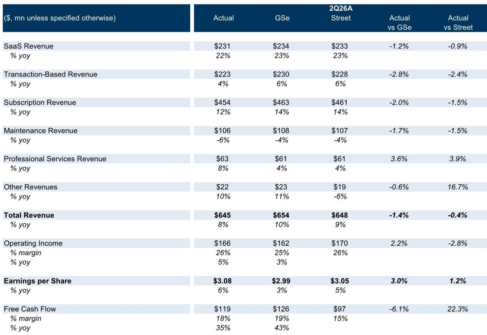
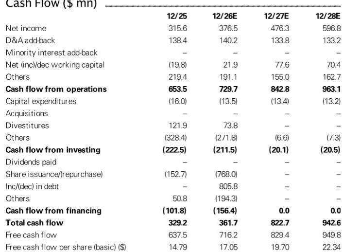

# Tyler Technologies 股价回调背后：被市场低估的长期云转型与AI潜力

Tyler Technologies在7月30日发布第二季度财报后，股价下跌3%，与当日纳斯达克指数上涨3%形成鲜明对比。市场的反应似乎很明确：订阅收入同比增长12%，未达到市场预期的14%，且管理层在订单加速的情况下选择维持而非上调2026全年指引。表面上看，这像是一家软件公司在最重要的增长指标上遇到了阻力。

但这种解读忽略了本季度背后更具意义的趋势。12%的订阅增长数据受到交易型收入同比增长仅4%（低于预期近3%）以及维护收入下降6%的拖累。核心云转型指标——SaaS收入增长22%、SaaS总订单增长21%——依然稳健，尽管订单增速较第一季度的40%有所放缓。市场正在为季度性的交易时间波动而惩罚Tyler，却忽视了其业务结构、利润率轨迹以及人工智能为政府技术现代化带来的潜在催化因素的实质性改善。

市场反应与基本面之间的张力提供了一个有价值的分析视角。Tyler并非面临需求萎缩的公司，而是收入确认时点、实施进度和云转换周期造成了季度间的波动，掩盖了其多年利润率扩张的故事。当前报价对应未来收益的24.6倍，这一倍数本身包含了市场对公司能否在从传统软件许可向经常性云收入转型过程中维持增长逻辑的怀疑。本季度的证据表明这种怀疑可能并不成立，但证明的责任现在落在管理层身上，需要展示订单加速能在未来两到三个季度转化为可见的收入增长。

## 市场将订阅收入减速误读为需求问题，而实际是时间节奏问题

12%的订阅收入增长数据在合理解读前需要先进行拆解。SaaS收入同比增长22%，较第一季度23%的增速略有放缓，但面对的是同比基数提高50个基点的比较。交易型收入作为订阅线中波动较大的组成部分，仅增长4%，比分析师预期低约700万美元。维护收入下降6%，这实际上是云转型的健康信号，反映客户正从传统维护合同迁移到SaaS平台。

市场对订阅总量数据的关注掩盖了一个事实：最高质量、最具战略性的收入流——SaaS——继续以令大多数上市软件公司羡慕的速度增长。交易型收入的疲软是政府支付量和季节性模式的结果，而非竞争地位的丧失。管理层将订单加速与收入指引不变之间的差距归因于实施和云转换时间的典型波动，考虑到政府采购周期的非均匀性，这一解释是合理的。

对于观察者而言，重要的不是某个季度是否达到一致预期，而是业务轨迹是否在改善。本季度SaaS总订单增长21%，虽然较第一季度的40%有所下降，但仍代表健康的增速，随着这些订单的转化，应在未来几个季度转化为收入增长。订单增长的减速值得关注，但尚不构成需求问题的证据。更可能反映的是与异常强劲的去年同期比较的难度，以及大型政府合同的固有非均匀性。

## 云转型正在重塑Tyler的利润率结构，并将在未来两年持续累积

Tyler本季度报告EBIT利润率为26%，其中包含约500万美元（80个基点）的诉讼费用一次性影响。剔除该影响后，利润率接近27%，代表显著的同比扩张。利润率故事并非单一季度现象，而是向高利润率SaaS收入、远离低利润率专业服务和硬件业务转变的战略性结果。

公司对2026全年26%至28% EBIT利润率的指引具有说明性。尽管存在诉讼费用和收入缺口，管理层仍维持了这一指引，表明对潜在利润率轨迹的信心。这一扩张的驱动因素是结构性的而非周期性的：收入组合正转向SaaS，其毛利率高于传统许可和维护收入；云优化工作正在降低托管成本；版本整合正在减少支持多个传统产品版本的复杂性。

报告中的财务预测展示了这一利润率扩张的幅度。毛利率预计从2025年的46.5%提升至2026年的48.6%、2027年的50.4%和2028年的52.6%。EBIT利润率预计同期从15.3%扩张至17.4%、20.4%和22.9%。这是一个复合改善的故事，已在报告数据中可见：本季度营业收入同比增长5%，收入增长8%，展示了运营杠杆效应。

自由现金流状况强化了这一叙事。本季度自由现金流利润率为18%，同比增长35%，全年预测显示自由现金流从2025年的6.37亿美元增长至2026年的7.16亿美元、2027年的8.29亿美元和2028年的9.5亿美元。自由现金流回报表现预计同期从2.7%提升至5.3%、6.1%和6.9%。对于一家以24.6倍未来收益交易的公司而言，这一现金流轨迹是支撑当前倍数的关键。

## AI功能将在未来12至18个月内成为云迁移的催化剂，延长转换跑道

本季度最具战略意义的发展不在财务结果中，而在产品路线图中。管理层表示AI功能将越来越多地仅限云端提供，加入更广泛的云专属能力组合，旨在未来几年推动客户迁移。虽然AI尚不是云转换的主要驱动力，但随着更多代理型功能嵌入产品组合，预计在未来12至18个月内其重要性将日益提升。

这是一个经典的软件平台策略：创建仅在新架构上可用的功能，然后让客户对这些功能的需求推动他们完成迁移过程。对于Tyler的政府客户而言，AI功能的吸引力可能相当可观。政府机构面临长期的人员短缺、案件量增加和改善服务交付的压力。在许可审批、案件管理和公民服务等领域的AI驱动自动化可以提供切实的效率提升，足以证明云迁移的颠覆性价值。

时机也有利。Tyler管理层已讨论AI潜力多个季度，但未来12至18个月代表代理型AI从演示和试点转向生产部署的时期。如果Tyler能够嵌入对政府机构真正有用的AI能力并使其仅限云端，公司实际上在初始成本和维护驱动的转换完成后，创造了第二波迁移激励。

市场似乎对此持谨慎态度，倍数从之前的23倍压缩至20倍，反映出对AI何时能对增长逻辑产生增量贡献的可见性有限。这是一种合理的谨慎，但也创造了不对称性：如果AI驱动的迁移按预期时间表实现，倍数压缩将被证明是不必要的，报价将获得重新评估。

## 评估Tyler云转型进展的决策框架

对于试图评估Tyler云转型是否按计划进行的观察者而言，季度财报提供了一组领先和滞后指标，应综合评估而非孤立看待。以下框架将本报告的关键指标综合为一个连贯的评估工具。

第一个指标是SaaS订单增长，代表未来SaaS收入的领先指标。第二季度21%的增长虽然较第一季度的40%有所下降，但仍代表健康的速度。关键问题是这种减速是暂时现象还是趋势的开始。应关注未来两个季度订单增长是稳定在20%区间还是继续减速至15%左右。

第二个指标是订单增长与收入增长之间的差距。当订单增长快于收入时，意味着存在转化积压，应支持未来收入加速。本季度订单增长21%，SaaS收入增长22%，表明转化管道大致平衡。管理层在订单强劲的情况下维持收入指引的决定，表明他们视转化时间为约束因素而非需求。

第三个指标是订阅收入内部的结构变化。SaaS收入增长22%而维护收入下降6%是利润率扩张的最优模式。风险在于交易型收入疲软持续，即使SaaS保持强劲也会拖累整体订阅增长率。交易收入对政府支付量和经济状况更为敏感，持续疲软值得更密切的关注。

第四个指标是利润率扩张相对于收入结构变化的程度。本季度26%的EBIT利润率，即使包含诉讼费用，也证明了结构变化正在转化为盈利能力改善。全年26%至28%的指引意味着下半年持续扩张。如果利润率达到该区间高端，将验证云转型不仅是收入故事，也是利润率故事的论点。

第五个指标是AI驱动迁移的步伐。这是最具推测性但可能最具影响力的因素。管理层关于AI功能仅限云端并在未来12至18个月成为迁移驱动力的评论，应被视为可检验的假设而非确定性。应在未来几个季度寻找AI相关迁移活动的证据，无论是通过客户公告、实施管道披露，还是关于AI在赢得新订单中作用的评论。

## 风险特征已从执行风险转向时间风险，这改变了评估方式

围绕Tyler Technologies的估值讨论历来集中在执行风险上：公司能否成功驾驭从传统软件到云的转型，而不扰乱客户基础或财务模式。本季度及过去几个季度的证据表明，执行风险已在很大程度上消除。公司SaaS收入增长22%，利润率扩张，产生强劲自由现金流，并保持净现金头寸，预计未来两年将进一步增强。

剩余的风险是时间风险：AI驱动的迁移浪潮何时实现，以及订单加速能否在证明当前倍数合理的时间表内转化为可见的收入增长。报告中的下行风险反映了这一转变。关注点不再是Tyler能否执行云转型，而是政府预算变化、交易量疲软、竞争加剧以及公共部门技术采用速度。

这一风险特征的变化对评估方式有影响。当主要风险是执行时，对季度波动的适当反应是减少敞口，直到执行问题得到解决。当主要风险是时间时，适当的反应是评估潜在价值创造是否按预期进行，以及市场倍数是否充分补偿了下一个增长拐点时间的不确定性。

在此基础上，当前估值具有吸引力。报价对应未来收益24.6倍和未来EV/EBITDA 18.2倍，随着收益增长，预计到2027年倍数将分别压缩至20.5倍和14.7倍。自由现金流回报表现预计到2028年从5.3%提升至6.9%。对于Tyler在政府软件领域的市场地位、经常性收入基础和利润率扩张轨迹而言，如果增长逻辑成立，当前倍数并不算高。

从当前价格323.31美元计算，潜在上行空间有限。对于Tyler这样品质的公司而言，这是一个合理的回报，但除非AI驱动的迁移催化剂如期实现，否则并非特别引人注目。市场对AI时间的怀疑可以理解，但风险回报特征的不对称性表明，未来12至18个月内，该报价更有可能带来意外上行而非下行。

*仅供参考。部分内容可能基于源材料由AI辅助生成、翻译、总结或编辑，可能包含遗漏或错误。请独立核实。本文不构成任何专业建议。*

仅供参考。部分内容可能基于源材料由AI辅助生成、翻译、总结或编辑，可能包含遗漏或错误。请独立核实。本文不构成任何专业建议。

