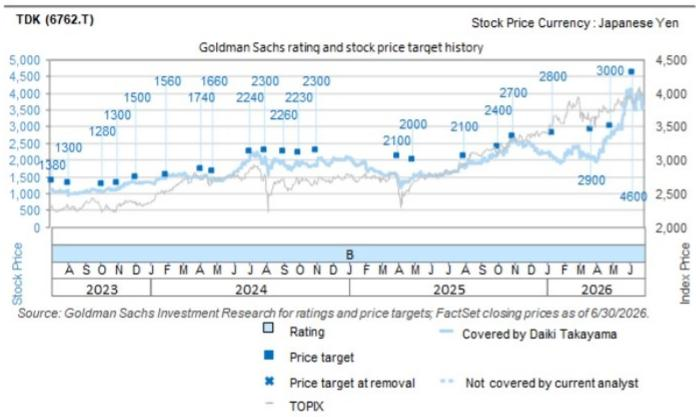

TDK (6762.T)

# 第一财季业绩超预期：各业务板块表现及展望均呈上行趋势；上调目标报价，维持报告评级

6762.T

12个月目标报价：¥4,900

当前报价：¥3,023

潜在空间：62.1%

## 报告评级

Daiki Takayama
+81(3)4587-9870 | daiki.takayama@gs.com
GS Japan Co., Ltd.

Mitsuhiro Icho
+81(3)4587-9836 | mitsuhiro.x.icho@gs.com
GS Japan Co., Ltd.

Makoto Takahara
+81(3)4587-4270 | makoto.takahara@gs.com
GS Japan Co., Ltd.

TDK于7月31日收盘后公布的第一财季营业利润为863亿日元，显著高于我们预估的688亿日元。公司维持全年2950亿日元的指引（假设汇率为150日元/美元）。电话会议要点如下：（1）无源元件：营业利润从第四财季的114亿日元升至第一财季的174亿日元。公司预计第二财季销售额环比增长2-5%（假设汇率环比持平）。汽车及AI/数据中心应用的强劲需求推动利润环比增长。MLCC和铝电解电容器是主要驱动力。电感器方面，公司预计第二财季智能手机应用将带来增长，未来增长则来自AI/数据中心应用。（2）传感器应用产品：营业利润从15亿日元升至78亿日元。公司预计第二财季销售额环比增长3-6%。除汽车需求回暖外，智能手机应用的季节性因素预计将在第二财季进一步扩大利润增长。（3）磁应用产品：营业利润从75亿日元升至96亿日元。公司预计第二财季销售额环比增长5-8%。HDD磁头出货量第一财季环比增长12%，第二财季预计增长10%；悬臂出货量第一财季环比增长8%，第二财季预计增长6%。管理层认为，从第二财季起，销售价格上调及HDD磁头前端工序产能利用率提升将对盈利产生显著贡献。（4）能源应用产品：营业利润从416亿日元升至694亿日元（营业利润率17%）。公司预计第二财季销售额环比增长9-12%。小型充电电池出货量第二财季预计增长10%，受季节性因素及高附加值产品占比提升推动，盈利有望扩大。（5）总体看法：就全年而言，管理层对HDD磁头相关业务盈利能力提升及无源元件盈利增长尤为有信心。公司正从以电池为主的盈利结构，转向各业务盈利能力均得到强化的格局。管理层表示，自各业务部门引入ROIC导向管理以来已过去三年，成效正日益显现。

我们认为，各业务板块第二财季及以后的业绩与展望呈上行趋势，这是非常积极的信号。随着经营环境的改善，TDK的管理模式正在发挥作用。公司把握AI/数据中心需求机遇的速度快于预期，为盈利作出贡献。我们将12个月目标报价从¥4,600上调至¥4,900，并维持报告评级。

## 盈利预测修正与目标报价

基于第一财季业绩及公司业绩说明会内容，我们将FY3/27-FY3/29的营业利润预测分别上调11%、9%和10%。据此，我们将12个月目标报价从¥4,600上调至¥4,900，并维持报告评级。

图表1：TDK盈利摘要

<table><tr><td colspan="3">FY3/27 - 第一财季</td><td colspan="4">FY3/27</td></tr><tr><td rowspan="2">（十亿日元）</td><td rowspan="2">GS预估</td><td rowspan="2">实际</td><td colspan="2">GS预估</td><td rowspan="2">公司指引</td><td rowspan="2">市场一致预期</td></tr><tr><td>原预测</td><td>新预测</td></tr><tr><td>销售额</td><td>647.0</td><td>741.0</td><td>2,713.5</td><td>3,009.5</td><td>2,580.0</td><td>2,698.2</td></tr><tr><td>营业利润</td><td>68.8</td><td>86.3</td><td>322.0</td><td>358.0</td><td>295.0</td><td>314.4</td></tr><tr><td>净利润</td><td>54.8</td><td>80.6</td><td>253.0</td><td>291.8</td><td>225.0</td><td>234.3</td></tr></table>

来源：公司数据、GS全球投资研究、Bloomberg

## 投资论点 - TDK

TDK是一家总部位于日本的公司，业务涵盖：无源元件业务（生产陶瓷电容器、铝电解电容器及压电材料/元件）；传感器应用产品业务（供应温度/压力传感器、磁性传感器及MEMS传感器）；磁应用产品业务（生产HDD磁头/悬臂及磁铁）；以及能源应用产品业务（生产二次电池及电源产品）。我们对TDK给予报告评级，因为我们预期电池、传感器、无源元件及磁应用业务的增长将带来均衡的盈利贡献。我们预计电池业务在材料成本和售价不变的假设下，收入和利润将逐步增长。我们预测传感器业务持续改善，有望保持稳定盈利。无源元件方面，我们看好汽车/工业MLCC驱动增长；磁应用方面，近线HDD将推动增长。考虑到公司均衡的业务驱动因素及电池业务的增长潜力，我们认为当前估值具有吸引力。

## 目标报价风险与方法论 - TDK

估值方法：我们对TDK给予报告评级，12个月目标报价为¥4,900。目标报价基于FY3/29E EV/GCI与CROCI/WACC的比较，在我们行业平均EV/DACF倍数10倍的基础上给予10%溢价（隐含FY3/28E市盈率27倍）。

主要风险：智能手机产量下降、投入成本上升以及日元升值。

## 披露附录

## Reg AC

我们，Daiki Takayama、Mitsuhiro Icho、Makoto Takahara及Yuji Hidaka，特此证明本报告中表达的所有观点均准确反映了我们个人对相关公司及其证券的看法。我们还证明，我们的薪酬中没有任何部分直接或间接与本报告中表达的具体建议或观点相关。

除非另有说明，本报告封面上列出的个人均为GS全球投资研究部门的分析师。

供稿作者：Daiki Takayama GS Japan Co., Ltd.、Mitsuhiro Icho GS Japan Co., Ltd.、Makoto Takahara GS Japan Co., Ltd.、Yuji Hidaka GS Japan Co., Ltd.。

除非另有说明，本报告供稿作者披露中列出的个人均为GS全球投资研究部门的分析师。

## GS因子概况

GS因子概况通过将股票的关键属性与市场（即我们的评级股票池）及其行业同行进行比较，提供投资背景信息。所描绘的四个关键属性为：增长、财务回报、倍数（即估值）和综合（增长、财务回报和倍数的复合指标）。增长、财务回报和倍数通过使用每只股票特定指标的标准化排名计算。各指标的标准化排名随后取平均值并转换为相关属性的百分位数。每个指标的具体计算可能因财年、行业和地区而异，但标准方法如下：

增长基于股票的前瞻性销售增长、EBITDA增长和每股盈利增长（对于金融股，仅使用每股盈利和销售增长），百分位数越高表示增长性越强。财务回报基于股票的前瞻性ROE、ROCE和CROCI（对于金融股，仅使用ROE），百分位数越高表示财务回报越高。倍数基于股票的前瞻性市盈率、市净率、股息率、EV/EBITDA、EV/FCF和EV/债务调整后现金流（对于金融股，仅使用市盈率、市净率和股息率），百分位数越高表示交易倍数越高。综合百分位数按增长百分位数、财务回报百分位数和（100% - 倍数百分位数）的平均值计算。

财务回报和倍数使用GS分析师对至少三个季度后的财年末期的预测。增长使用至少七个季度后的财年与至少三个季度后的财年相比的输入数据（所有指标均按每股基础计算）。

有关我们如何计算GS因子概况的更详细说明，请联系您的GS代表。

## 并购排名

在我们的全球覆盖范围内，我们使用并购框架审视股票，综合考虑定性因素和定量因素（可能因行业和地区而异），以纳入某些公司可能被收购的潜在可能性。然后我们分配一个并购排名，作为对我们评级覆盖范围内公司进行评分的工具，从1到3，其中1表示公司成为收购目标的可能性较高（30%-50%），2表示中等可能性（15%-30%），3表示较低可能性（0%-15%）。对于排名为1或2的公司，按照我们的标准部门指南，我们将并购因素纳入目标报价。并购排名为3被视为不重要，因此不计入目标报价，可能在研究中讨论也可能不讨论。

## Quantum

Quantum是GS的专有数据库，提供详细的财务报表历史、预测和比率。可用于对单一公司进行深入分析，或比较不同行业和市场的公司。

## 披露

TDK的评级相对于其覆盖范围内的其他公司：Alps Alpine、Dai Nippon Printing、Hirose Electric、IRISO Electronics、Ibiden、Japan Aviation Electronics Industry、Kohoku Kogyo、Kyocera、MARUWA、Mabuchi Motor、Maxell Ltd.、MinebeaMitsumi Inc.、Murata Mfg.、NGK Corp.、Nichicon、Nidec、Nippon Ceramic、Niterra、Nitto Denko、Renesas Electronics、Rohm、TDK、TOPPAN Holdings、Taiyo Yuden

## 公司特定监管披露

以下披露涉及GS集团（及其关联方，"GS"）与GS全球投资研究所覆盖公司之间的关系。

GS在过去12个月内因投资银行服务获得报酬：TDK（¥3,023）和TDK（ADR）（$45.24）

GS预计在未来3个月内寻求投资银行服务报酬：TDK（¥3,023）和TDK（ADR）（$45.24）

GS在过去12个月内与以下公司存在投资银行服务客户关系：TDK（¥3,023）和TDK（ADR）（$45.24）

GS在过去12个月内与以下公司存在非投资银行证券相关服务客户关系：TDK（¥3,023）和TDK（ADR）（$45.24）

GS在过去12个月内与以下公司存在非证券服务客户关系：TDK（¥3,023）和TDK（ADR）（$45.24）

## 评级/投资银行关系分布

GS投资研究全球股票覆盖范围

<table><tr><td rowspan="2"></td><td colspan="3">评级分布</td><td colspan="3">投资银行关系</td></tr><tr><td>买入</td><td>中性</td><td>卖出</td><td>买入</td><td>中性</td><td>卖出</td></tr><tr><td>全球</td><td>50%</td><td>34%</td><td>16%</td><td>65%</td><td>59%</td><td>43%</td></tr></table>

截至2026年7月1日，GS全球投资研究对3,104只股票进行了投资评级。GS将股票分配为各地区投资清单上的买入和卖出；未如此分配的股票被视为中性。此类分配等同于上述FINRA规则要求的披露目的下的买入、持有和卖出。请参阅下面的"评级、覆盖范围和相关定义"。投资银行关系图表反映了每个评级类别中GS在过去十二个月内提供投资银行服务的标的公司的百分比。

## 目标报价和评级历史图表

  
所示目标报价应结合GS此前所有已发布研究报告（可能包含也可能不包含目标报价）以及公司、行业和金融市场相关发展来理解。

## 目标报价历史表 TDK (6762.T)

<table><tr><td>报告日期</td><td>目标报价（¥）</td><td>收盘价（¥）</td></tr><tr><td>2026-07-31</td><td>4,900</td><td>3,023</td></tr><tr><td>2026-06-08</td><td>4,600</td><td>3,715</td></tr><tr><td>2026-04-28</td><td>3,000</td><td>2,677</td></tr><tr><td>2026-03-23</td><td>2,900</td><td>2,043</td></tr><tr><td>2026-01-12</td><td>2,800</td><td>2,142</td></tr><tr><td>2025-10-31</td><td>2,700</td><td>2,673</td></tr><tr><td>2025-10-02</td><td>2,400</td><td>2,154</td></tr><tr><td>2025-08-01</td><td>2,100</td><td>1,876</td></tr><tr><td>2025-04-28</td><td>2,000</td><td>1,460</td></tr><tr><td>2025-03-31</td><td>2,100</td><td>1,546</td></tr><tr><td>2024-11-01</td><td>2,300</td><td>1,848</td></tr><tr><td>2024-10-01</td><td>2,230</td><td>1,948</td></tr><tr><td>2024-09-02</td><td>11,300</td><td>2,023</td></tr><tr><td>2024-07-30</td><td>11,500</td><td>2,029</td></tr><tr><td>2024-07-02</td><td>11,200</td><td>2,004</td></tr><tr><td>2024-04-26</td><td>8,300</td><td>1,462</td></tr><tr><td>2024-04-03</td><td>8,700</td><td>1,488</td></tr><tr><td>2024-01-31</td><td>7,800</td><td>1,488</td></tr><tr><td>2023-12-06</td><td>7,500</td><td>1,338</td></tr><tr><td>2023-11-01</td><td>6,500</td><td>1,158</td></tr><tr><td>2023-10-04</td><td>6,400</td><td>1,052</td></tr><tr><td>2023-08-02</td><td>6,500</td><td>1,089</td></tr></table>

表中所示目标报价未针对公司行为进行调整。

## 监管披露

## 美国法律法规要求的披露

有关本报告提及公司的以下任何披露，请参阅上述公司特定监管披露：未决交易中的主承销商或联合主承销商；1%或以上的所有权；特定服务的报酬；客户关系类型；以往期间的主承销/联合主承销公开发行；董事职位；对于股票证券，做市和/或专家角色。GS作为主体交易或可能交易本报告讨论的发行人债务证券（或相关衍生品）。

以下为额外要求的披露：所有权和重大利益冲突：GS政策禁止其分析师、向分析师汇报的专业人员及其家庭成员持有分析师覆盖范围内的任何公司的证券。分析师薪酬：分析师薪酬部分基于GS的盈利能力，其中包括投资银行收入。分析师作为高管或董事：GS政策通常禁止其分析师、向分析师汇报的人员或其家庭成员在分析师覆盖范围内的任何公司担任高管、董事或顾问。非美国分析师：非美国分析师可能不是GS & Co. LLC的关联人员，因此可能不受FINRA规则2241或FINRA规则2242关于与标的公司沟通、公开露面及交易所覆盖证券的限制。

## 美国以外司法管辖区法律和法规要求的额外披露

以下披露为指定司法管辖区要求的披露，但已根据美国法律法规在上述范围内作出的披露除外。澳大利亚：GS Australia Pty Ltd及其关联公司不是澳大利亚的授权存款机构（该术语在《1959年银行法》（联邦）中定义），不提供银行服务，也不在澳大利亚开展银行业务。本研究及其任何访问权限仅面向《澳大利亚公司法》定义的"批发客户"，除非GS另有约定。在编制研究报告时，GS Australia全球投资研究部门的成员可能参加其研究报告标的公司和实体的实地考察和其他会议。在某些情况下，如果GS Australia认为在实地考察或会议的具体情况下适当且合理，此类实地考察或会议的费用可能部分或全部由相关发行人承担。如果本文件内容包含任何金融产品建议，则仅为一般性建议，由GS在未考虑客户的目标、财务状况或需求的情况下编制。客户在根据任何此类建议采取行动前，应考虑该建议是否适合其自身的目标、财务状况和需求。某些GS Australia和New Zealand利益披露副本及GS澳大利亚卖方研究独立性政策声明副本可在以下网址获取：https://www.goldmansachs.com/disclosures/australia-new-zealand/index.html。巴西：有关CVM第20号决议的披露信息可在https://www.gs.com/worldwide/brazil/area/gir/index.html获取。如适用，根据CVM第20号决议第20条定义，本研究报告内容的主要负责巴西注册分析师为本报告开头列出的第一作者，除非文末另有说明。加拿大：此信息仅供您参考，在任何情况下均不应被解释为GS & Co. LLC为在加拿大购买证券而进行的广告、要约或招揽。GS & Co. LLC未在加拿大任何司法管辖区注册为交易商，通常不被允许交易加拿大证券，并可能被禁止在加拿大某些司法管辖区出售某些证券和产品。如果您希望在加拿大交易任何加拿大证券或其他产品，请联系GS Canada Inc.（GS集团公司的关联公司）或其他注册加拿大交易商。香港：可应要求从GS (Asia) L.L.C.获取本研究中提及的所覆盖公司证券的进一步信息。印度：可从GS (India) Securities Private Limited获取本研究中提及的标的公司的进一步信息，SEBI研究分析师注册号INH000001493，地址：10th Floor, Ascent-Worli, Sudam Kalu Ahire Marg, Worli, Mumbai-400 025, India，公司识别号U74140MH2006FTC160634，电话+91 22 6616 9000，传真+91 22 6616 9001。GS可能实益拥有本研究报告中提及的标的公司1%或以上的证券（该术语在1956年《印度证券合约（监管）法》第2(h)条中定义）。SEBI注册和NISM认证不以任何方式保证中介机构的业绩或向读者提供回报保证。GS (India) Securities Private Limited的合规官和读者投诉联系方式、年度合规审计报告副本及其他相关信息和披露可在以下链接找到：https://www.goldmansachs.com/worldwide/india/research-analyst。日本：见下文。韩国：本研究及其任何访问权限仅面向《金融服务和资本市场法》定义的"专业读者"，除非GS另有约定。可从GS (Asia) L.L.C.首尔分行获取本研究中提及的标的公司的进一步信息。新西兰：GS New Zealand Limited及其关联公司不是新西兰的"注册银行"或"存款接受者"（定义见1989年《新西兰储备银行法》）。本研究及其任何访问权限面向《2008年金融顾问法》定义的"批发客户"，除非GS另有约定。某些GS Australia和New Zealand利益披露副本可在以下网址获取：https://www.goldmansachs.com/disclosures/australia-new-zealand/index.html。俄罗斯：在俄罗斯联邦分发的研究报告不是俄罗斯立法定义的广告，而是信息和分析，不以产品推广为主要目的，不提供俄罗斯评估立法意义上的评估。研究报告不构成俄罗斯法律法规定义的个人化研究交流，不针对特定客户，且未分析客户的财务状况、投资概况或风险概况。GS不对客户或任何其他人基于本研究报告可能做出的任何投资决策承担责任。新加坡：GS (Singapore) Pte.（公司编号：198602165W），受新加坡金融管理局监管，对本研究承担法律责任，如有任何与本研究报告相关的事宜，应与其联系。台湾：本材料仅供参考，未经许可不得转载。读者应仔细考虑自身的投资风险。投资结果由个人读者自行负责。英国：在英国将被归类为零售客户的个人（该术语由金融行为监管局规则定义）应结合GS此前关于本研究所覆盖公司的研究报告阅读本研究，并应参阅GS International已发送给他们的风险警告。这些风险警告的副本及本报告中使用的某些金融术语词汇表可应要求从GS International获取。

欧盟和英国：关于欧洲委员会授权条例（EU）（2016/958）第6(2)条的披露信息（该条例补充欧洲议会和理事会条例（EU）No 596/2014，包括该授权条例在英国退出欧盟和欧洲经济区后转化为英国国内法律和法规的情况），涉及研究交流或其他建议或暗示投资策略的信息的客观呈现技术安排以及特定利益或利益冲突迹象的披露，可在https://www.gs.com/disclosures/europeanpolicy.html获取，该页面陈述了与投资研究相关的利益冲突管理欧洲政策。

日本：GS Japan Co., Ltd.是在关东财务局注册的金融工具交易商，注册号Kinsho 69，是日本证券业协会、日本金融期货协会、第二类金融工具交易商协会和日本投资管理协会的会员。股票买卖需支付与客户预先确定的佣金外加消费税。有关日本证券交易所、日本证券业协会或日本证券金融公司要求的任何适用披露，请参阅公司特定披露。

## 评级、覆盖范围和相关定义

买入（B）、中性（N）、卖出（S）分析师建议将股票作为买入或卖出纳入各地区投资清单。被分配为投资清单上的买入或卖出取决于股票相对于其覆盖范围的总回报潜力。任何未被分配为投资清单上买入或卖出且具有有效评级（即未被暂停评级、未评级、早期生物科技、暂停覆盖或未覆盖的股票）的股票均被视为中性。每个地区管理区域信念清单，该清单从各自地区投资清单上的报告评级股票中选出，代表侧重于总回报潜力大小和/或在其各自覆盖区域内实现回报可能性的研究交流。此类信念清单中股票的添加或移除由各地区的投资审查委员会或其他指定委员会管理，并不代表分析师对此类股票投资评级的变更。

总回报潜力代表当前股价与目标报价之间的上行或下行差异，包括在目标报价相关时间范围内预期支付或宣告的所有股息。所有覆盖股票均需设定目标报价。总回报潜力、目标报价和相关时间范围在每份添加或重申投资清单成员资格的报告中有说明。

覆盖范围：每个覆盖范围的所有股票列表可按首席分析师、股票和覆盖范围在https://www.gs.com/research/hedge.html获取。

未评级（NR）。当GS在涉及该公司的合并或战略交易中担任顾问角色时，当由于GS参与交易而存在法律、监管或政策限制时，以及在某些其他情况下，根据GS政策移除投资评级、目标报价和盈利预测（如相关）。早期生物科技（ES）。当该公司既没有通过II期临床试验的药物、治疗或医疗设备，也没有分销后II期药物、治疗或医疗设备的许可时，根据GS政策不分配投资评级和目标报价。评级暂停（RS）。GS已暂停该股票的投资评级和目标报价，因为没有足够的基本面基础来确定投资评级或目标报价。先前的投资评级和目标报价（如有）不再对该股票有效，不应依赖。覆盖暂停（CS）。GS已暂停对该公司的覆盖。未覆盖（NC）。GS不覆盖该公司。

## 全球产品；分发实体

GS全球投资研究在全球范围内为GS客户制作和分发研究产品。GS全球各办事处的分析师对行业和公司以及宏观经济、货币、大宗商品和投资组合策略进行研究。本研究由以下机构分发：澳大利亚由GS Australia Pty Ltd（ABN 21 006 797 897）；巴西由GS do Brasil Corretora de Títulos e Valores Mobiliários S.A.；GS巴西公共沟通渠道：0800 727 5764和/或contatogoldmanbrasil@gs.com。工作日（节假日除外），上午9点至下午6点。Canal de Comunicação com o Público GS Brasil: 0800 727 5764 e/ou contatogoldmanbrasil@gs.com. Horário de funcionamento: segunda-feira à sexta-feira (exceto feriados), das 9h às 18h；加拿大由GS & Co. LLC；香港由GS (Asia) L.L.C.；印度由GS (India) Securities Private Ltd.；日本由GS Japan Co., Ltd.；韩国由GS (Asia) L.L.C.首尔分行；新西兰由GS New Zealand Limited；俄罗斯由OOO GS；新加坡由GS (Singapore) Pte.（公司编号：198602165W）；美国由GS & Co. LLC。GS International已批准本研究在英国的分发。

GS International（"GSI"），由审慎监管局（"PRA"）授权并由金融行为监管局（"FCA"）和PRA监管，已批准本研究在英国的分发。

欧洲经济区：GS Bank Europe SE（"GSBE"）是一家在德国注册的信贷机构，在单一监管机制下，受欧洲中央银行直接审慎监管，并在其他方面受德国联邦金融监管局（Bundesanstalt für Finanzdienstleistungsaufsicht, BaFin）和德意志联邦银行监管，并在欧洲经济区内分发研究。

## 一般披露

本研究仅供我们的客户使用。除与GS相关的披露外，本研究基于我们认为可靠的当前公开信息，但我们不保证其准确或完整，也不应依赖。本文所含信息、意见、估计和预测截至本文日期，如有变更恕不另行通知。我们力求适时更新研究，但各种法规可能阻止我们这样做。除某些定期发布的行业报告外，大多数报告由分析师酌情以不规则间隔发布。

GS开展全球全方位服务、综合投资银行、投资管理和经纪业务。我们与全球投资研究所覆盖的相当大比例的公司存在投资银行和其他业务关系。GS & Co. LLC是美国经纪交易商，是SIPC成员（https://www.sipc.org）。

我们的销售人员、交易员和其他专业人员可能向我们的客户和自营交易台提供与本研究中表达的意见相反的口头或书面市场评论或交易策略。我们的资产管理、自营交易台和投资业务可能做出与本研究中表达的建议或观点不一致的投资决策。

本报告中指定的分析师可能不时与我们的客户（包括GS销售人员和交易员）讨论，或可能在本报告中讨论交易策略，这些策略涉及可能对本报告讨论的股票证券市场价格产生近期影响的事件或催化剂，其影响可能与分析师对此类股票公布的预期目标报价方向相反。任何此类交易策略均不同于且不影响分析师对此类股票的基本面股票评级，该评级反映股票相对于其覆盖范围的总回报潜力，如本文所述。

我们及我们的关联方、高级管理人员、董事和员工将不时持有多头或空头头寸，作为主体参与，并买入或卖出本研究中提及的证券或衍生品（如有），除非法规或GS政策禁止。

在GS安排的会议上第三方演讲者（包括来自GS其他部门的个人）所持观点不一定反映全球投资研究的观点，也不是GS的官方观点。

本文引用的任何第三方，包括任何销售人员、交易员和其他专业人员或其家庭成员，可能持有与本报告指定分析师表达的观点不一致的上述产品的头寸。

本研究不构成在任何司法管辖区出售任何证券的要约或购买任何证券的要约邀请，在该等要约或邀请将属非法的司法管辖区除外。本研究不构成个人建议，也未考虑个别客户的具体投资目标、财务状况或需求。客户应考虑本研究中的任何建议或推荐是否适合其特定情况，并在适当时寻求专业建议，包括税务建议。本研究中提及的投资的价格和价值及其收入可能波动。过往表现并非未来表现的指引，未来回报不保证，可能损失原始资本。汇率波动可能对某些投资的价值或价格或收入产生不利影响。

某些交易，包括涉及期货、期权和其他衍生品的交易，具有重大风险，不适合所有读者。读者应查阅当前期权和期货披露文件，可从GS销售代表或https://www.theocc.com/about/publications/character-risks.jsp和https://www.goldmansachs.com/disclosures/cftc_fcm_disclosures获取。在涉及多次买卖期权的策略（如价差策略）中，交易成本可能很高。可应要求提供支持文件。

全球投资研究提供的不同服务级别：GS全球投资研究向您提供的服务级别和类型可能与向GS内部及其他外部客户提供的服务不同，取决于多种因素，包括您对沟通频率和方式的个人偏好、您的风险概况和投资重点及视角（如市场-wide、行业特定、长期、短期）、您与GS整体客户关系的规模和范围，以及法律和监管限制。例如，某些客户可能要求在特定证券研究报告发布时收到通知，某些客户可能要求将我们内部客户网站上提供的分析师基本面分析中的特定数据通过数据源或其他方式以电子方式传送给他们。分析师基本面研究观点（例如，评级、目标报价或股票盈利预测的重大变更）的任何变更，均不会在通过电子发布广泛传播至我们内部客户网站或通过其他必要方式向所有有权接收此类报告的所有客户之前传达给任何客户。

所有研究报告同时通过电子发布至我们内部客户网站向所有客户传播。并非所有研究内容都会重新分发给我们的客户或提供给第三方聚合商，GS也不对第三方聚合商重新分发我们的研究负责。有关一项或多项证券、市场或资产类别（包括相关服务）的研究、模型或其他数据，请联系您的GS代表或访问https://research.gs.com。

披露信息也可在https://www.gs.com/research/hedge.html或联系Research Compliance, 200 West Street, New York, NY 10282获取。

## © 2026 GS。

您仅可为自己使用而存储、显示、分析、修改、重新格式化及打印通过本服务获得的信息。未经GS明确书面同意，您不得转售或逆向工程此信息以计算或开发任何指数用于披露和/或营销，或创建任何其他衍生作品或商业产品、数据或服务。未经GS明确书面同意，您不得以任何格式向任何第三方发布、传输或以其他方式复制此信息的全部或部分。上述限制包括但不限于使用、提取、下载或检索此信息的全部或部分，以训练或微调机器学习或人工智能系统，或作为任何此类系统的提示或输入提供或复制此信息的全部或部分。
