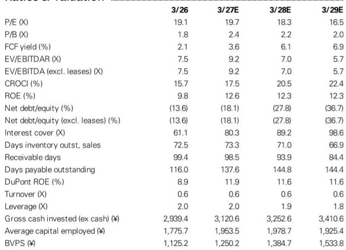
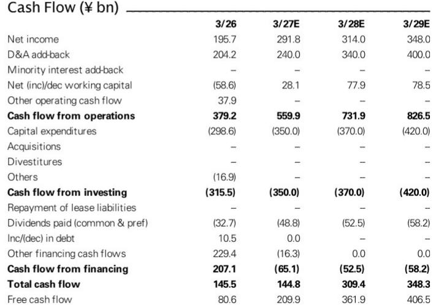
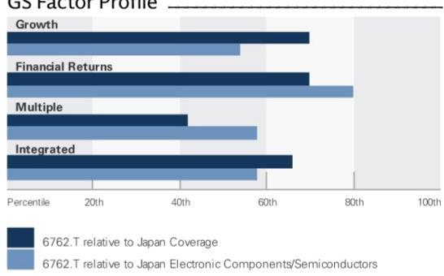

# GS：TDK一季度各业务利润全面上行

7月31日收盘后，TDK公布的一季度营业利润为863亿日元，明显高于GS此前预期的688亿日元。公司维持全年2950亿日元的指引不变，但电话会议透露的信息比数字本身更值得注意：被动元件、传感器、磁应用、能源应用四个业务板块的利润全部环比上升，且管理层对二季度及以后的增长给出了具体指引。

这份报告的核心判断是，TDK正在从以电池为主的盈利结构，转向各业务均衡发力的状态。GS认为，AI和数据中心需求带来的机会正在被公司以快于预期的速度转化为实际收益。

## 1. 被动元件与磁应用产品成为利润增长的主要来源

被动元件一季度营业利润从四季度的114亿日元升至174亿日元，汽车和AI/数据中心应用是主要驱动力，MLCC和铝电解电容贡献最大。电感方面，二季度增长主要来自智能手机应用，后续增长则依赖AI/数据中心。

磁应用产品一季度营业利润从75亿日元升至96亿日元。HDD磁头出货量环比增长12%，二季度预计再增10%；悬架出货量一季度环比增8%，二季度预计增6%。管理层认为，从二季度开始，售价上调与前道工序产能利用率上升将对收益产生显著贡献。

> **KC评论：** 磁应用业务的关键不在出货量本身，而在“售价上调”和“产能利用率”两个词。这意味着HDD相关业务正在从量增转向价量齐升，利润率弹性可能比收入增速更值得跟踪。

## 2. 能源应用产品利润率升至17%，电池业务仍是利润基石

能源应用产品一季度营业利润从416亿日元升至694亿日元，营业利润率达到17%。小型充电电池二季度出货量预计增长10%，收益扩张来自季节性因素和高附加值产品占比提升。

值得注意的是，尽管电池业务仍是利润的最大来源，但GS在报告中强调，公司正在从“以电池为中心”转向“各业务盈利能力均被强化”的结构。ROIC导向的管理模式已推行三年，管理层认为效果正在变得具体可见。

## 3. 传感器业务利润环比增长逾四倍，汽车需求回暖是主因

传感器应用产品一季度营业利润从15亿日元升至78亿日元，二季度销售环比预计增长3-6%。除了汽车需求恢复，智能手机应用的季节性也将扩大二季度的利润增长。

GS将FY3/27至FY3/29的营业利润预测分别上调11%、9%和10%，主要依据是一季度业绩和业绩说明会的内容。上调后的预测明显高于公司自身指引和彭博一致预期，说明卖方与公司之间对全年盈利节奏存在不同判断。

## 4. 观察框架：从分部利润环比变化判断盈利结构转型进度

这份报告提供了一个可复用的观察框架：与其只看公司整体利润是否符合预期，不如拆解各分部的环比利润变化和季度指引。TDK一季度四个板块利润全部环比上升，且二季度销售指引均为正增长，这种同步性比单一数字超预期更有信息量。

另一个容易被忽略的指标是HDD磁头的“前道工序产能利用率”。管理层明确表示，从二季度起这会显著贡献收益，说明产能利用率的边际变化比出货量更能预示利润率走向。

GS在估值方法上采用FY3/29E EV/GCI对CROCI/WACC的框架，并在行业平均EV/DACF倍数基础上给予10%溢价。报告列出的主要不确定性包括智能手机产量下降、投入成本上升和日元升值，这些因素在评估电子元件公司时仍需要持续跟踪。

For informational purposes only. Portions may be generated,translated,summarized,or edited with AI assistance based on source materials and may contain omissions or errors. Please verify independently. This is not investment,legal,tax,accounting,or other professional advice.

For informational purposes only. Portions may be generated,translated,summarized,or edited with AI assistance based on source materials and may contain omissions or errors. Please verify independently. This is not investment,legal,tax,accounting,or other professional advice.

