本材料无意分发给中国大陆读者，亦不构成在中国大陆境内提供证券投资咨询服务。未经JPM书面同意，不得转载、出售或再分发本材料或其任何部分。

# 中国保险行业

## 2026年上半年预览：中期分红或成行业催化剂；中国平安H股为首选

年初至今，尽管2026年一季度业绩表现强劲，但在A股和H股上市的中国保险公司中，仅中国人寿H股表现相对领先。我们认为，市场对盈利质量存在疑虑，利润强势主要被视为投资驱动，而非核心保险业务驱动。然而，资本状况依然稳健。我们预测，2026年6月末主要寿险公司的核心偿付能力充足率将高于110%，主要财险公司将高于170%，远高于50%的最低要求。8月中下旬业绩披露期间，潜在的中期分红惊喜可能成为行业重新定价的催化剂。我们预测，2026财年中期每股股息（DPS）平均同比增长15%。中国H股和A股上市保险公司的估值分别为2027财年预期市盈率的6倍和7倍，股息率分别为5.1%和4.0%。我们的首选股是中国平安H股，其次是中国人寿H股。

*   **盈利质量仍是市场关注的核心问题。** 中国人寿（链接）和新华保险（链接）在7月初发布的正面利润预警并未获得市场积极回应，这凸显了该行业盈利对国内权益市场的敏感性较高。读者似乎并不确信保险公司会将年初至今未实现的投资收益通过中期分红进行分配，而非将其留作应对2026年下半年市场波动的缓冲。我们估算，上证综指每变动10%，对2026财年市场一致预期净利润的平均敏感度约为45%。这种谨慎情绪也体现在2026财年市场一致预期盈利上调的步伐出奇缓慢。对于中国平安集团，我们预测其2026年上半年核心盈利（OPAT）为840亿元人民币，同比增长8%。

*   **中期分红惊喜或成催化剂。** 除中国平安外，中国保险公司自2024年上半年才开始引入中期分红，资本回报政策尚不完善。市场一致预期显示，2026财年每股股息平均增长4%，我们认为这一预测相对保守，而我们预测为7%。如果保险公司在资本充足的前提下，将部分未实现投资收益用于2026年上半年分红，应能提升市场信心。我们预测2026年上半年中期股息平均增长15%，其中中国人寿的中期股息预计增长20%，即每股增加0.286元人民币。

*   **基本面保持稳健。** 尽管2026年第二季度业务活动较第一季度有所放缓，但寿险销售动能依然强劲，这得益于寿险公司正转向对利率敏感度较低的分红型产品。代理人产能提升、代理人队伍企稳以及银保渠道的稳健支持，应能推动未来12个月新业务价值实现两位数增长。我们预测2026年上半年新业务价值平均同比增长17%。在财险领域，我们预测人保财险2026年上半年综合成本率为94.7%（同比下降0.1个百分点），这得益于稳健的车险承保业绩且无重大理赔损失。

*   **偏好中国平安H股和中国人寿H股。** 鉴于更广泛的回报表现支撑，H股上市保险公司相比A股提供了更好的风险回报。中国平安H股/A股提供行业最高的股息率，分别为5.8%/5.3%，对应2026财年预期市盈率均为6倍。中国人寿H股提供4.0%的股息率，但我们认为其2026财年每股股息存在上行空间，我们的预测为同比增长20%，而市场一致预期为7%，同时其在获得监管批准后存在回购股份的可能性。中国太保H股维持增持评级，其首次中期分红提案提供了支撑。最后，我们对人保财险保持谨慎，主要因为极低的存款利率和短期债券回报表现环境下，再投资风险不断累积。

MW Kim AC
(852) 2800-8517
mw.kim@JPM.com
JPM证券（亚太）有限公司/
JPM经纪（香港）有限公司

Dan Wang
(86-21) 6106-6349
dan.wang@JPM.com
SAC注册号：S1730524080001
JPM证券（中国）有限公司

Julia Kim
(852) 2800-8540
julia.c.kim@JPM.com
JPM证券（亚太）有限公司/
JPM经纪（香港）有限公司

## 分析师认证和重要披露，包括非美国分析师披露，请参见第63页。

JPM与其研究报告中所覆盖的公司开展业务并寻求开展业务。因此，读者应知悉，该公司可能存在利益冲突，影响本报告的客观性。读者应将本报告仅视为做出投资决策的单一因素。

股票评级与目标价

<table><tr><td rowspan="2">公司</td><td rowspan="2">代码</td><td rowspan="2">市值（百万美元）</td><td rowspan="2">价格货币</td><td rowspan="2">现价</td><td colspan="2">评级</td><td colspan="4">目标价</td></tr><tr><td>当前</td><td>前次</td><td>当前</td><td>截止日期</td><td>前次</td><td>截止日期</td></tr><tr><td>中国平安保险集团 - H</td><td>2318 HK</td><td>136,301</td><td>港元</td><td>58.70</td><td>增持</td><td>不变</td><td>95.00</td><td>2027年12月</td><td>90.00</td><td>2026年12月</td></tr><tr><td>中国平安保险集团 - A</td><td>601318 CH</td><td>150,149</td><td>人民币</td><td>55.80</td><td>增持</td><td>不变</td><td>88.00</td><td>2027年12月</td><td>83.00</td><td>2026年12月</td></tr><tr><td>中国人寿保险 - H</td><td>2628 HK</td><td>104,161</td><td>港元</td><td>28.90</td><td>增持</td><td>不变</td><td>40.00</td><td>2027年12月</td><td>不变</td><td>2026年12月</td></tr><tr><td>中国人寿保险 - A</td><td>601628 CH</td><td>165,982</td><td>人民币</td><td>39.74</td><td>中性</td><td>不变</td><td>39.00</td><td>2027年12月</td><td>不变</td><td>2026年12月</td></tr><tr><td>中国太平洋保险集团 - H</td><td>2601 HK</td><td>38,446</td><td>港元</td><td>31.34</td><td>增持</td><td>不变</td><td>43.00</td><td>2027年12月</td><td>不变</td><td>2026年12月</td></tr><tr><td>中国太平洋保险集团 - A</td><td>601601 CH</td><td>46,628</td><td>人民币</td><td>32.80</td><td>增持</td><td>不变</td><td>50.00</td><td>2027年12月</td><td>不变</td><td>2026年12月</td></tr><tr><td>新华人寿保险 - H</td><td>1336 HK</td><td>19,308</td><td>港元</td><td>48.54</td><td>中性</td><td>不变</td><td>46.00</td><td>2027年12月</td><td>45.00</td><td>2026年12月</td></tr><tr><td>新华人寿保险 - A</td><td>601336 CH</td><td>28,908</td><td>人民币</td><td>62.71</td><td>中性</td><td>不变</td><td>59.00</td><td>2027年12月</td><td>不变</td><td>2026年12月</td></tr><tr><td>人保集团 - H</td><td>1339 HK</td><td>31,185</td><td>港元</td><td>5.53</td><td>中性</td><td>不变</td><td>6.00</td><td>2027年12月</td><td>5.80</td><td>2026年12月</td></tr><tr><td>人保集团 - A</td><td>601319 CH</td><td>49,404</td><td>人民币</td><td>7.56</td><td>中性</td><td>不变</td><td>7.10</td><td>2027年12月</td><td>6.90</td><td>2026年12月</td></tr><tr><td>人保财险 (2328)</td><td>2328 HK</td><td>47,647</td><td>港元</td><td>16.80</td><td>中性</td><td>不变</td><td>15.00</td><td>2027年12月</td><td>14.00</td><td>2026年12月</td></tr></table>

资料来源：公司数据，彭博财经，JPM预测。n/c = 无变化。所有价格截至2026年7月30日。

表1：中国保险行业：估值比较表
本币，%，倍

<table><tr><td>公司</td><td>彭博代码</td><td>评级</td><td>现价 (2026-07-30)</td><td>目标价 (2027年12月)</td><td>上行/下行空间</td><td>市盈率 26e</td><td>市盈率 27e</td><td>市净率 26e</td><td>市净率 27e</td></tr><tr><td>中国人寿-H</td><td>2628 HK 股票</td><td>增持</td><td>28.9</td><td>40.0</td><td>41%</td><td>4.3</td><td>4.9</td><td>1.1</td><td>1.1</td></tr><tr><td>中国人寿-A</td><td>601628 CH 股票</td><td>中性</td><td>39.74</td><td>39.0</td><td>-1%</td><td>6.6</td><td>7.5</td><td>1.8</td><td>1.7</td></tr><tr><td>中国平安-H</td><td>2318 HK 股票</td><td>增持</td><td>58.7</td><td>95.0</td><td>64%</td><td>6.0</td><td>5.6</td><td>0.9</td><td>0.8</td></tr><tr><td>中国平安-A</td><td>601318 CH 股票</td><td>增持</td><td>55.8</td><td>88.0</td><td>62%</td><td>6.4</td><td>5.9</td><td>0.9</td><td>0.8</td></tr><tr><td>中国太保-H</td><td>2601 HK 股票</td><td>增持</td><td>31.34</td><td>43.0</td><td>40%</td><td>4.9</td><td>5.1</td><td>0.8</td><td>0.7</td></tr><tr><td>中国太保-A</td><td>601601 CH 股票</td><td>增持</td><td>32.8</td><td>50.0</td><td>57%</td><td>5.6</td><td>5.9</td><td>0.9</td><td>0.8</td></tr><tr><td>新华保险-H</td><td>1336 HK 股票</td><td>中性</td><td>48.54</td><td>46.0</td><td>-5%</td><td>3.6</td><td>4.4</td><td>1.1</td><td>1.0</td></tr><tr><td>新华保险-A</td><td>601336 CH 股票</td><td>中性</td><td>62.71</td><td>59.0</td><td>-6%</td><td>5.2</td><td>6.4</td><td>1.6</td><td>1.5</td></tr><tr><td>人保集团-H</td><td>1339 HK 股票</td><td>中性</td><td>5.53</td><td>6.0</td><td>11%</td><td>4.7</td><td>5.3</td><td>0.5</td><td>0.5</td></tr><tr><td>人保集团-A</td><td>601319 CH 股票</td><td>中性</td><td>7.56</td><td>7.1</td><td>-4%</td><td>7.1</td><td>8.0</td><td>0.8</td><td>0.7</td></tr><tr><td>人保财险</td><td>2328 HK 股票</td><td>中性</td><td>16.8</td><td>15.0</td><td>-10%</td><td>7.7</td><td>7.9</td><td>1.3</td><td>1.2</td></tr></table>

资料来源：彭博财经，JPM预测。

图1：中国保险-H股年初至今表现
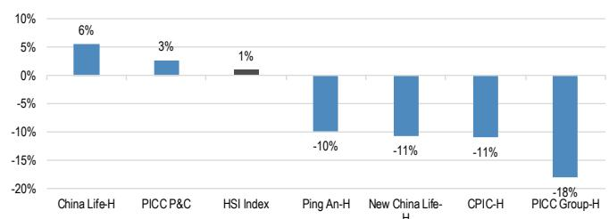
资料来源：彭博财经。价格数据截至2026年7月30日。

图2：中国保险-A股年初至今表现
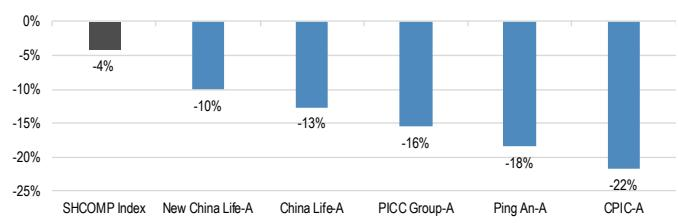
资料来源：彭博财经。价格数据截至2026年7月30日。

图3：中国保险-H股：2026/27财年预期股息率 %
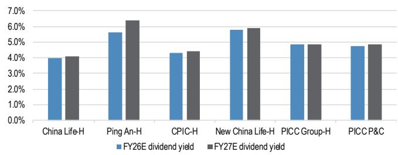
资料来源：彭博财经，JPM预测。价格数据截至2026年7月29日。

图4：中国保险-A股：2026/27财年预期股息率 %
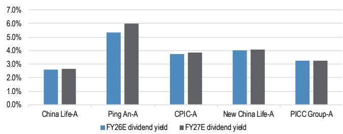
资料来源：彭博财经，JPM预测。价格数据截至2026年7月29日。

## 投资论点

## 盈利疑虑已被消化，股息上行空间可期

展望8月中下旬的2026年上半年业绩披露期，我们偏好寿险公司多于财险公司，偏好H股多于A股。我们对H股的偏好顺序为：中国平安-H、中国人寿-H、中国太保-H、人保集团-H、人保财险和新华保险-H。对于A股，估值吸引力相对较低，平均估值较H股同业溢价35%（表2），且A股保险公司2026财年预期股息率在2.6%-5.3%之间，吸引力也较弱。我们对A股的偏好顺序为：中国平安-A、中国太保-A、中国人寿-A、新华保险-A和人保集团-A。

尽管H股和A股上市保险公司的估值分别为2026财年预期市盈率的5倍和6倍，股息率分别为5%和4%，但年初至今中国保险公司仍未获得市场青睐，仅中国人寿-H和人保财险在A股和H股中表现相对领先。我们认为，关键争论已不再是盈利是否复苏，而是投资驱动的盈利强势能否转化为可见的资本回报。

我们相信，8月的中期业绩期可能成为转折点，股息指引、资本配置和核心盈利复苏的重要性可能超过整体利润增长。我们将目标价时间框架从2026年12月滚动至2027年12月，并平均上调目标价5%，这反映了业务稳步复苏、偿付能力资本增强以及核心盈利前景改善，从而提升了现金生成能力。中国平安-H仍是我们首选的增持标的，其次是中国人寿-H和中国平安-A。

表2：中国保险行业：A-H溢价时间序列

人民币/股，港元/股，%

<table><tr><td></td><td>2016</td><td>2017</td><td>2018</td><td>2019</td><td>2020</td><td>2021</td><td>2022</td><td>2023</td><td>2024</td><td>2025</td><td>2026</td></tr><tr><td colspan="12">中国人寿</td></tr><tr><td>A股 (人民币)</td><td>24.09</td><td>30.45</td><td>20.39</td><td>34.87</td><td>38.39</td><td>30.09</td><td>37.12</td><td>28.35</td><td>41.92</td><td>45.5</td><td>40.31</td></tr><tr><td>H股 (港元)</td><td>20.2</td><td>24.55</td><td>16.64</td><td>21.65</td><td>17.1</td><td>12.92</td><td>13.4</td><td>10.12</td><td>14.68</td><td>27.38</td><td>28.44</td></tr><tr><td>溢价 (A/H)</td><td>33%</td><td>49%</td><td>40%</td><td>80%</td><td>167%</td><td>186%</td><td>213%</td><td>208%</td><td>204%</td><td>85%</td><td>59%</td></tr><tr><td colspan="12">中国平安集团</td></tr><tr><td>A股 (人民币)</td><td>35.43</td><td>69.98</td><td>56.1</td><td>85.46</td><td>86.98</td><td>50.41</td><td>47</td><td>40.3</td><td>52.65</td><td>68.4</td><td>54.02</td></tr><tr><td>H股 (港元)</td><td>38.8</td><td>81.35</td><td>69.15</td><td>92.1</td><td>95</td><td>56.15</td><td>51.65</td><td>35.35</td><td>46.05</td><td>65.15</td><td>56.9</td></tr><tr><td>溢价 (A/H)</td><td>2%</td><td>3%</td><td>-8%</td><td>4%</td><td>9%</td><td>10%</td><td>3%</td><td>25%</td><td>22%</td><td>17%</td><td>8%</td></tr><tr><td colspan="12">中国太保集团</td></tr><tr><td>A股 (人民币)</td><td>27.77</td><td>41.42</td><td>28.43</td><td>37.84</td><td>38.4</td><td>27.12</td><td>24.52</td><td>23.78</td><td>34.08</td><td>41.91</td><td>31.95</td></tr><tr><td>H股 (港元)</td><td>27.05</td><td>37.55</td><td>25.35</td><td>30.7</td><td>30.35</td><td>21.15</td><td>17.38</td><td>15.76</td><td>25.2</td><td>35.2</td><td>29.76</td></tr><tr><td>溢价 (A/H)</td><td>15%</td><td>32%</td><td>28%</td><td>38%</td><td>50%</td><td>57%</td><td>60%</td><td>66%</td><td>44%</td><td>33%</td><td>21%</td></tr><tr><td colspan="12">新华保险</td></tr><tr><td>A股 (人民币)</td><td>43.78</td><td>70.2</td><td>42.24</td><td>49.15</td><td>57.97</td><td>38.88</td><td>30.08</td><td>31.13</td><td>49.7</td><td>69.7</td><td>63.12</td></tr><tr><td>H股 (港元)</td><td>35.6</td><td>53.4</td><td>31.1</td><td>33.5</td><td>30.25</td><td>20.85</td><td>19.1</td><td>15.22</td><td>23.6</td><td>54.35</td><td>48.38</td></tr><tr><td>溢价 (A/H)</td><td>37%</td><td>58%</td><td>55%</td><td>64%</td><td>128%</td><td>129%</td><td>78%</td><td>125%</td><td>124%</td><td>43%</td><td>51%</td></tr></table>

资料来源：彭博财经。注：1) 溢价 = (A-H)/H*100%（以港元计）。2) 价格数据基于年末收盘价，2026年数据基于2026年7月28日。

## 资本回报成为关注焦点

中国H股上市保险公司平均估值为2026财年预期市盈率的5倍，股息率为5.0%，考虑到估值仍不高，我们认为这具有吸引力。然而，年初至今该行业在H股和A股市场均未获得青睐，仅中国人寿-H和人保财险例外。鉴于大多数关键财务指标在2026年一季度表现强劲，这一现象值得关注，也印证了基本面仍在正轨。

我们认为，行业表现相对落后反映了报告盈利强势与读者对股息兑现信心之间的差距。大部分盈利上行似乎由投资驱动，受益于权益市场上涨，而读者仍不确定这些收益能否在宏观和政策不确定性上升的环境中转化为更高的股东回报。

在此背景下，8月中下旬的中期业绩期可能是该行业的重要窗口。我们认为，管理层关于股息、资本配置和核心盈利复苏的评论，可能促使读者重新评估风险回报，类似于2024年下半年和2025年下半年出现的行业轮动（图5/图6）。

为了框定这一机遇，我们首先关注几家主要保险公司在7月初发布的正面利润预警。在表3中，我们总结了利润预警日期、公司2026年上半年盈利指引与2026财年市场一致预期净利润的对比，以及预警后一周的股价反应。如表3所示，强劲的利润增长并未获得市场充分认可，我们将其主要归因于对盈利质量和权益市场敏感性的担忧。

更重要的是，尽管强劲的利润预警表明中国人寿和新华保险可能在2026年上半年就实现当前全年市场一致预期利润的绝大部分，但这两家公司的2026财年盈利预测上调步伐出奇缓慢（图7/图8）。基于当前中国人寿和新华保险2026财年市场一致预期净利润分别为1390亿元人民币和310亿元人民币，市场似乎已假设2026年下半年盈利贡献有限。

图5：中国H股上市保险公司：2024年下半年/2025年下半年表现 %
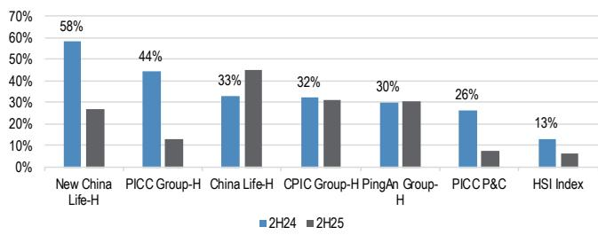
资料来源：彭博财经。

图6：中国A股上市保险公司：2024年下半年/2025年下半年表现 %
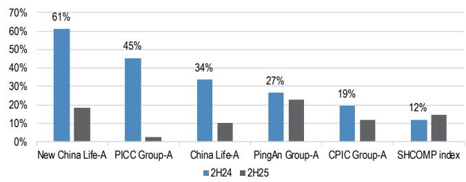
资料来源：彭博财经。

表3：中国保险行业：2026年上半年利润预警摘要
人民币百万元，%

<table><tr><td></td><td>2024年上半年</td><td>2025年上半年</td><td>2026年上半年预测 (A)</td><td>同比</td><td>2026财年市场一致预期 (B)</td><td>进度 % (=A/B)</td><td>利润预警日期</td><td>预警后一周股价表现</td></tr><tr><td>中国人寿</td><td>38,278</td><td>40,931</td><td>128,933-137,119</td><td>215%-235%</td><td>139,394</td><td>92%-98%</td><td>2026-07-14</td><td>-4%</td></tr><tr><td>新华保险</td><td>11,083</td><td>14,799</td><td>20,719-23,678</td><td>40%-60%</td><td>31,022</td><td>67%-76%</td><td>2026-07-13</td><td>9%</td></tr></table>

资料来源：各公司2024-2025年上半年中期报告、2024-25年年度报告及港交所公告，彭博财经，JPM计算。注：市场一致预期数据截至2026年7月29日。2026年上半年预测盈利数据基于公司利润预警。

图7：中国人寿：2026/27财年市场一致预期每股收益修正趋势 %
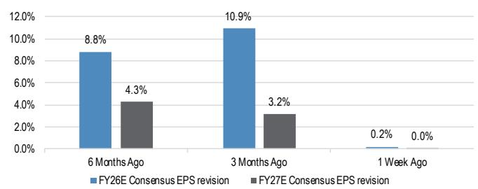
资料来源：彭博财经。数据截至2026年7月29日。

图8：新华保险：2026/27财年市场一致预期每股收益修正趋势 %
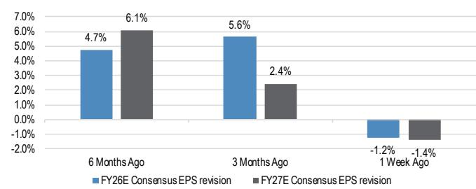
资料来源：彭博财经。数据截至2026年7月29日。

值得强调的是，与许多其他市场的保险公司不同，中国保险公司相对于账面价值持有较大规模的权益敞口，范围在0.6倍至3.5倍之间，其中相当一部分通过损益公允价值（FVTPL）核算确认（图9/图10）。这使得行业净利润对国内权益市场波动高度敏感。根据我们的估算，上证综指每变动10%，对2026财年市场一致预期净利润的平均敏感度约为45%（图11）。

图9：中国保险行业：权益敞口 vs. 账面价值（2025财年）
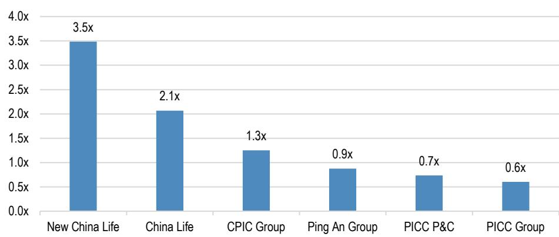
资料来源：各公司2025财年年度报告。JPM计算。

图10：中国保险行业：按会计分类的权益投资构成 %
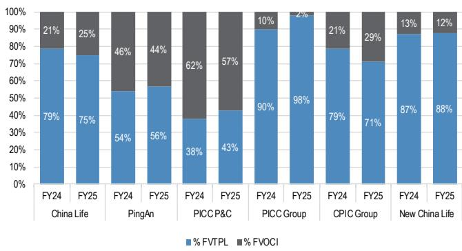
资料来源：各公司2024-25财年年度报告，JPM计算。

图11：中国保险行业：2026财年市场一致预期净利润对上证综指10%变动的敏感度
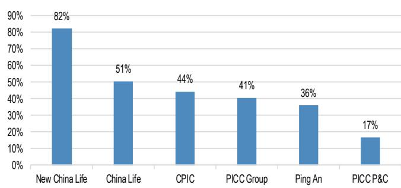
资料来源：各公司2025财年年度报告，彭博财经，JPM预测。注：市场一致预期数据截至2026年7月29日。

因此，读者似乎不确定保险公司是会通过中期分红分配部分年初至今未实现的投资收益，还是将这些收益留作应对2026年下半年权益市场潜在波动的缓冲。（关于可分配盈利与现金利润的详细信息，请参阅亚洲保险：夏季系列：寿险公司分析：股息需要现金，而不仅仅是IFRS利润）。我们认为，这种不确定性可能为中期业绩期前进入该行业创造一个有吸引力的入场机会。

## 2026年上半年可能重塑行业讨论的三个理由

我们强调进入2026年上半年业绩期的三个关键点。

## #1. 中期分红惊喜可能是关键催化剂。

除中国平安外，中国保险公司自2024年上半年才开始引入中期分红，资本管理政策尚不完善。中国H股和A股上市保险公司目前提供2026财年预期股息率分别为5.0%/4.0%，其中H股尤其具有吸引力。市场一致预期2026财年每股股息平均仅增长4%，而JPM预测为7%，考虑到偿付能力改善、资产负债表企稳和合同服务边际（CSM）复苏，我们认为市场预期保守。

中期每股股息增加可能只是温和的正面惊喜，因为中国保险公司通常在末期而非中期分配较大比例的股息，我们预测2026年中期股息平均增长15%。我们认为这是该行业股息主题的一个强劲起点。

更重要的是，我们预计管理层关于股东资本回报的评论将改善该行业的风险回报前景，因为业务复苏仍在正轨，偿付能力资本保持充足。

如果保险公司基于核心盈利而非报告净利润，通过更完善的股息政策，对可观的年末每股股息增长表现出信心，那么当前H股中国保险公司5.0%的股息率可能成为行业重新评级的关键驱动因素。我们对大型保险公司可持续股东回报的前景日益乐观。

最后，我们认为该行业充足的资本基础（如表5所示）为更积极的资本回报政策提供了坚实的根本支撑。我们预测，截至2026年6月末，主要寿险公司的核心偿付能力充足率将高于110%，主要财险公司将高于170%，远高于50%的最低要求。

表4：中国保险行业：中期股息和派息率趋势

人民币/股，%，百分点

<table><tr><td colspan="2"></td><td>2020</td><td>2021</td><td>2022</td><td>2023</td><td>2024</td><td>2025</td><td>2026E (JPM预测)</td><td>同比 (JPM预测)</td><td>2026E (市场一致预期)</td><td>同比 (市场一致预期)</td></tr><tr><td rowspan="2">中国人寿</td><td>中期股息</td><td>-</td><td>-</td><td>-</td><td>-</td><td>0.2</td><td>0.238</td><td>0.286</td><td>20%</td><td>0.26</td><td>9%</td></tr><tr><td>派息率</td><td>0%</td><td>0%</td><td>0%</td><td>0%</td><td>15%</td><td>16%</td><td>6%</td><td></td><td>10%</td><td></td></tr><tr><td rowspan="2">中国平安集团</td><td>中期股息</td><td>0.8</td><td>0.88</td><td>0.92</td><td>0.93</td><td>0.93</td><td>0.95</td><td>1.02</td><td>7%</td><td>0.99</td><td>4%</td></tr><tr><td>派息率</td><td>21%</td><td>27%</td><td>23%</td><td>24%</td><td>22%</td><td>21%</td><td>22%</td><td></td><td>不适用</td><td></td></tr><tr><td rowspan="2">中国太保集团</td><td>中期股息</td><td>-</td><td>-</td><td>-</td><td>-</td><td>-</td><td>-</td><td>0.37</td><td>不适用</td><td>不适用</td><td>不适用</td></tr><tr><td>派息率</td><td>-</td><td>-</td><td>-</td><td>-</td><td>-</td><td>-</td><td>11%</td><td></td><td>不适用</td><td></td></tr><tr><td rowspan="2">新华保险</td><td>中期股息</td><td>-</td><td>-</td><td>-</td><td>-</td><td>0.54</td><td>0.67</td><td>0.77</td><td>15%</td><td>0.91</td><td>36%</td></tr><tr><td>派息率</td><td>-</td><td>-</td><td>-</td><td>-</td><td>15%</td><td>14%</td><td>11%</td><td></td><td>20%</td><td></td></tr><tr><td rowspan="2">人保集团</td><td>中期股息</td><td>-</td><td>0.017</td><td>-</td><td>-</td><td>0.063</td><td>0.075</td><td>0.086</td><td>15%</td><td>0.09</td><td>20%</td></tr><tr><td>派息率</td><td>-</td><td>4%</td><td>-</td><td>-</td><td>12%</td><td>13%</td><td>13%</td><td></td><td>18%</td><td></td></tr><tr><td rowspan="2">人保财险</td><td>中期股息</td><td>-</td><td>-</td><td>-</td><td>-</td><td>0.208</td><td>0.24</td><td>0.28</td><td>17%</td><td>0.3</td><td>25%</td></tr><tr><td>派息率</td><td>-</td><td>-</td><td>-</td><td>-</td><td>25%</td><td>22%</td><td>21%</td><td></td><td>29%</td><td></td></tr></table>

资料来源：各公司2019-2025年上半年中期报告，JPM预测。注：市场一致预期数据截至2026年7月29日。对于除中国平安集团外的保险公司，我们根据中期股息除以中期每股收益计算中期派息率，而中国平安的派息率根据中期股息除以中期每股核心盈利（OPAT）计算。

<table><tr><td></td><td>2025年一季度</td><
