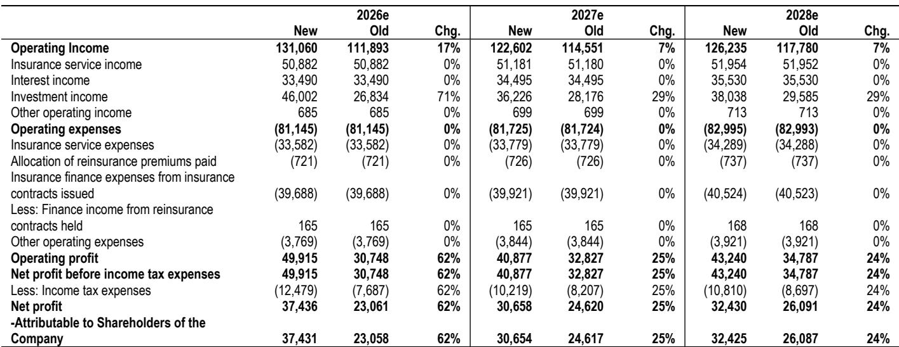
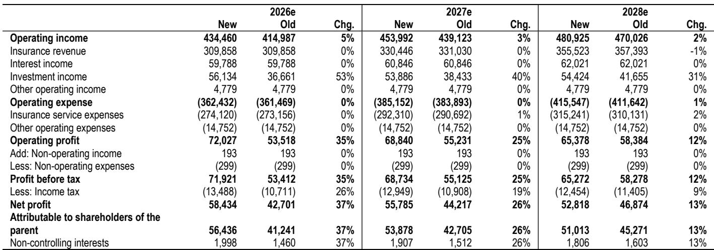
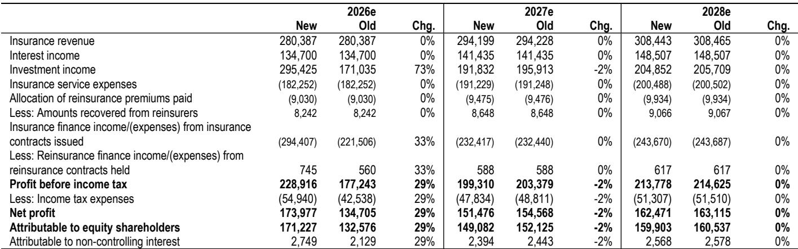

# JPM：保险与养老服务数据与主题变化观察

进入8月中下旬的1H26业绩季，中国保险板块的看点可能不在利润增速本身，而在分红。JPM在最新报告中提出一个明确判断：如果主要寿险公司在中期业绩中给出超预期的分红指引，市场对板块盈利质量的质疑有望被重新定价。报告将平安H股列为首选，其次是中国人寿H股。

这一判断的背景是，尽管1Q26多数险企核心指标表现强劲，年初至今A、H两地仅有中国人寿H股跑赢大盘。市场并非不认可盈利复苏，而是怀疑盈利成色——利润增长主要来自权益市场浮盈，而非核心承保和死差益。报告测算，上证指数每变动10%，对FY26E一致预期净利润的平均敏感度约为45%。这种高弹性让读者对利润的可持续性保持警惕。

## 1. 盈利预警发布后市场反应平淡，反映对盈利质量的疑虑

7月上旬，中国人寿和新华保险先后发布1H26盈利预警。中国人寿预告1H26净利润同比增长215%-235%，对应全年一致预期利润的92%-98%；新华保险预告同比增长40%-60%，对应全年一致预期的67%-76%。但市场反应冷淡，中国人寿发布预警后一周内报价下跌4%。

更值得注意的信号是，尽管盈利预警强劲，两家公司的FY26E一致预期盈利上调速度却异常缓慢。报告认为，这显示市场实际上在假设2H26盈利贡献有限，隐含了对上半年利润中研究浮盈占比过高的担忧。换言之，市场不是不相信数字，而是不相信这些数字能转化为可持续的股东回报。

> **KC评论：** 盈利预警后报价不涨反跌，说明市场定价的已经不是当期利润，而是利润的分配意愿。看这份报告时，建议把注意力从利润表转向分红政策和资本充足率的表述。

## 2. 中期分红超预期可能成为板块重估的触发点

报告的核心论点是，除平安外，中国险企从1H24才开始引入中期分红，资本回报政策仍不成熟。一致预期隐含FY26全年DPS平均增长4%，而JPM预测为7%。如果险企在资本充足的前提下，将部分未实现回报表现用于1H26分红，市场信心有望改善。

报告预测1H26中期股息平均同比增长15%，其中国人寿中期股息预计增长20%，对应每股0.286元人民币。这一预测显著高于一致预期的全年增速，意味着中期分红存在明显的超预期空间。报告还提到，中国人寿存在回购可能，但需监管批准。

从资本端看，报告预计主要寿险公司2026年6月核心偿付能力充足率在110%以上，主要财险公司在170%以上，远高于50%的监管最低要求。这为分红提供了充足的资本缓冲。

## 3. 基本面支撑仍在，寿险NBV预计双位数增长

报告对基本面并不悲观。寿险新单保费动能保持韧性，尽管2Q26活动率较1Q26有所节奏变化，但险企正转向对利率敏感度较低的分红型产品。代理人产能提升、代理人数量企稳以及银保渠道的稳定支持，预计将推动未来12个月NBV实现双位数增长，报告预测1H26E NBV平均同比增长17%。

财险方面，报告预测人保财险1H26E综合成本率为94.7%，同比改善0.1个百分点，主要受车险承保质量稳健且无重大赔案支撑。但报告对人保财险整体保持谨慎，原因是在低存款利率和短期债券回报表现环境下，再研究不确定性正在累积。

## 4. H股相对相关市场更具性价比，AH溢价仍处历史高位

报告强调H股相对相关市场的不确定性回报更优。目前中国H股上市险企平均交易在FY26E 6倍市盈率，股息率5.1%；相关市场对应估值为7倍市盈率，股息率4.0%。相关市场相对H股的平均溢价仍达35%，尽管较2023年超过200%的峰值已大幅收窄，但相对水平仍不低。

平安H/A提供板块最高的股息率，分别为5.8%/5.3%，对应FY26E 6倍/6倍市盈率。中国人寿H股股息率4.0%，但报告认为其FY26E DPS存在上行空间，预测增速20% vs 一致预期7%。太保H股因首次中期分红提案获得公司观点。

> **KC评论：** AH溢价收窄是过去两年H股跑赢的结果，但35%的溢价仍意味着同一家公司、同样的盈利，在两地市场的定价差异依然显著。对于能配置H股的读者，这个价差本身就是一个观察维度。

，反映业务稳步复苏、偿付能力增强和核心盈利前景改善带来的现金流生成能力提升。中期业绩季的分红指引、资本部署和核心盈利恢复，可能比 headline 利润增长更能决定板块下一阶段的定价方向。

For informational purposes only. Portions may be generated,translated,summarized,or edited with AI assistance based on source materials and may contain omissions or errors. Please verify independently. This is not investment,legal,tax,accounting,or other professional advice.

For informational purposes only. Portions may be generated,translated,summarized,or edited with AI assistance based on source materials and may contain omissions or errors. Please verify independently. This is not investment,legal,tax,accounting,or other professional advice.

