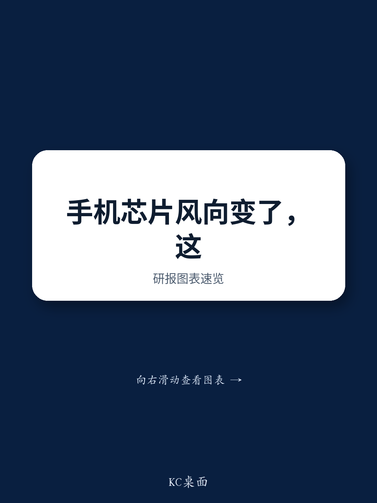

# JPM：亚洲科技——高通与Arm财报要点

高通与Arm的财报电话会刚结束，JPM亚洲科技团队随即更新了对供应链的观察。这份报告最值得关注的判断是：手机端所谓复苏更多是渠道库存出清，而非需求真正回暖；与此同时，服务器CPU正在进入一个由推理和智能体负载驱动的扩张周期，两者叠加，供应链的定价权正在从终端厂商向芯片与载板环节转移。

报告给出的时间节点很具体。高通认为中国手机市场已在6月当季触底，9月当季出货量环比有两位数增长，但管理层把这一恢复归因于渠道库存消耗，而非真实需求反弹。JPM维持2026年全球智能手机出货量同比下滑11%的预测。更值得注意的是，部分供应链在2026年上半年出现了提前拉货，原因是对存储价格继续上涨的预期，这意味着下半年的需求可能比上半年更弱。

## 1. 手机降规与BOM不确定性正在改变芯片选型

高通观察到降规（de-specing）已经开始。部分OEM在旗舰机型中选择更低一档的芯片或上一代硅片，直接原因是存储涨价推高了整机BOM成本。Arm也调整了此前的判断，需求节奏变化的范围从低端机扩大到中高端机型。JPM据此对小米等消费电子敞口较高的公司保持谨慎。

这里的关键不是降规本身，而是它揭示了定价权的流向。存储涨价挤压了主芯片的利润空间，终端厂商被迫在芯片选型上让步，而IC设计公司则借机提价。联发科和联咏都计划在2026年下半年涨价，以转嫁晶圆代工、封测和基板的成本上升。

> **KC评论：** 降规和涨价同时出现，说明这不是简单的需求周期问题，而是成本结构在重新分配。看手机供应链，下半年要盯的不是出货量，而是BOM成本变化对芯片选型和毛利率的传导。

## 2. 服务器CPU出货量预测上调至2028年6800万颗

报告对服务器CPU给出了一个清晰的增长路径：从2025年的2600万颗增至2028年的6800万颗，对应38%的年复合增速。驱动因素不再是传统的数据中心更新，而是推理负载和智能体应用的持续扩张。Arm对2027-28财年超过10亿美元的AGI CPU机会越来越有信心，并认为存在上探至20亿美元以上的可能。

这个数字的意义在于，它把服务器CPU从周期性硬件变成了结构性增长赛道。JPM认为，AMD、英伟达Vera、谷歌和亚马逊的自研CPU将占据台积电2027年大部分晶圆产能分配，而供应紧张——包括存储、测试设备、基板和先进制程晶圆——将持续到2027年。这意味着涨价叙事对台积电、日月光、欣兴电子、三星和爱德万测试等亚洲供应链公司仍然成立。

## 3. 高通数据中心定制芯片收入将在12月当季开始体现

高通的数据中心定制芯片收入将从12月当季开始贡献，JPM认为主要ASIC客户是字节跳动。但报告同时指出，在四大云服务商的AI加速器项目中，高通尚未成为关键设计服务伙伴。长期来看，高通借助Alphawave IP进入数据中心市场，可能对MediaTek、创意电子和世芯电子等现有设计服务商构成竞争。

这里需要区分短期收入和长期格局。高通的定制芯片收入开始体现，但它在AI加速器设计服务中的地位仍待验证。报告没有完全展开的是，高通与Alphawave的合作模式如何影响其毛利率结构，以及字节跳动之外是否还有第二家客户在推进中。

## 4. 供应紧张与涨价叙事的受益链条

JPM认为，存储、测试设备、基板和先进制程晶圆的供应紧张将持续到2027年，这支撑了亚洲供应链的涨价逻辑。受益者包括台积电、日月光、欣兴电子、三星和爱德万测试。服务器CPU超级周期的受益者则包括信骅科技、嘉泽、纬颖和欣兴电子。

把手机和服务器两条线放在一起看，结论更清晰：终端需求仍在调整的环境下，供应链的利润正在向具备产能稀缺性或技术壁垒的环节集中。IC设计公司的涨价能否持续，取决于终端需求是否配合；而载板、测试设备和先进制程的供应紧张，则更多由AI服务器需求驱动，与手机周期脱钩。

> **KC评论：** 这份报告最有用的框架是把手机和服务器分开看。手机链的涨价是成本转嫁，持续性有限；服务器链的供应紧张是产能约束，持续时间更长。两者对供应链公司含义完全不同。

JPM对消费电子敞口较高的公司保持谨慎，包括小米和联咏，理由是终端需求仍在调整背景下，毛利率不确定性将在未来几个季度持续。这份报告的隐含判断是：2026年下半年的手机需求可能比上半年更弱，而AI服务器相关的供应紧张和涨价叙事则能延续到2027年。

For informational purposes only. Portions may be generated,translated,summarized,or edited with AI assistance based on source materials and may contain omissions or errors. Please verify independently. This is not investment,legal,tax,accounting,or other professional advice.

For informational purposes only. Portions may be generated,translated,summarized,or edited with AI assistance based on source materials and may contain omissions or errors. Please verify independently. This is not investment,legal,tax,accounting,or other professional advice.

