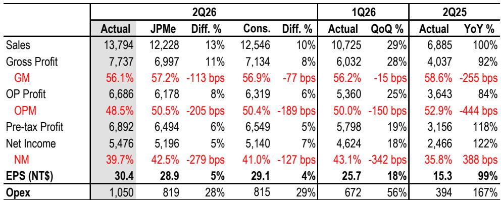
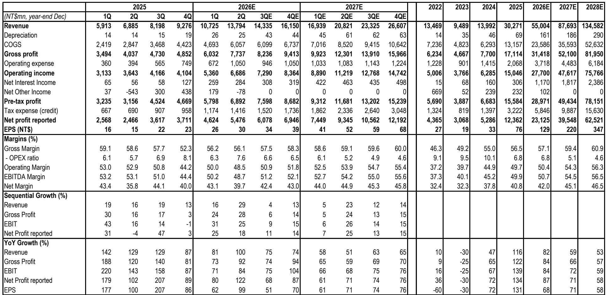
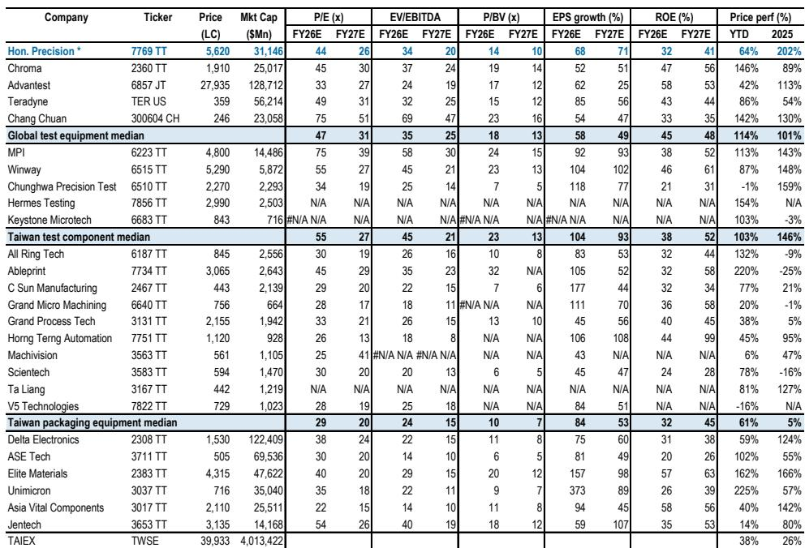

# 测试设备瓶颈正成为AI供应链的下一个定价杠杆

Hon. Precision的第二季度业绩电话会议不仅确认了AI测试设备的上行周期，更重新定义了这一周期的轮廓。该公司在全球半导体测试设备市场占有超过35%的份额，约80%的收入来自AI和高性能计算应用。公司透露，客户对其大封装ATC测试设备的需求已从最初的一两家早期采用者扩展到几乎所有主要AI客户。这一转变，加上中国区订单加速增长、CPO光电联合测试设备确认的十月出货计划，以及迈向10kW热管理能力的技术路线图，表明市场对下一代AI芯片测试基础设施重建速度的认知可能仍显不足。

以2027年预估收益的25倍计算，该股已从上市后高点回落，但基本面轨迹较三个月前已显著改善。业绩电话会议揭示了六个独立的增长方向，共同支撑2025年至2028年64%的收入复合年增长率和68%的每股收益复合年增长率。市场近期的观望态度，反映在月度回调中，更像是估值重估而非基本面逻辑的弱化。对于愿意穿越短期估值压缩的观察者而言，当前的布局可能是该公司自2025年12月在台湾证券交易所主板上市以来最具吸引力的阶段。

持有Hon. Precision的核心逻辑简单而有力：随着AI芯片在尺寸、功耗和复杂度上的持续提升，测试设备——这些在芯片出货前进行验证的关键装备——正成为价值更高、单价更高的瓶颈环节。最新业绩电话会议的变化在于，有证据表明这一瓶颈正在以超出预期的速度收紧，而Hon. Precision正从多个维度同时实现其商业价值。

## 大封装ATC测试设备拉动需求前置，带来即时的单价拐点

业绩电话会议最显著的积极信号是，客户正在评估最早于2027年采用大封装ATC测试设备，这比多数分析师建模的芯片尺寸迁移时间表更为提前。这些针对超过120x150mm芯片设计的测试设备，由于采用新的机械设计、超大托盘支持、自动化模块以及可处理约10kW功耗的先进主动热控制技术，较现有FT测试设备享有20-25%的价格溢价。

需求信号清晰明确。客户兴趣已从一两家潜在采用者扩展到几乎所有AI相关客户。管理层乐观情景显示，大封装ATC测试设备在2027年上半年可能占AI客户出货量的20-30%，下半年升至50%以上。客户的战略逻辑清晰：不必等待芯片尺寸物理迁移，现在即可采用大封装平台，因为它同时支持JEDEC托盘和超大托盘，为测试基础设施面向更大封装尺寸的明确趋势做好了前瞻性准备。

即使在保守假设下，单价提升的数学逻辑也颇具说服力。若80%出货面向AI客户，其中50%采用大封装平台，溢价维持20%，则综合单价提升约8%。但这是下限而非上限。向大封装平台的转变不仅是定价事件，更是客户份额事件。在此平台上标准化的客户正在做出多年期基础设施承诺，这加深了Hon. Precision在其测试运营中的战略地位。

出货将于2026年10月开始，采购订单最早可能在下个季度出现。近期催化剂路径异常清晰，而市场尚未完全消化这一平台迁移对2027年和2028年收益的概率加权影响。

## 中国AI需求：从利润率摊薄因素转变为增长与盈利加速器

中国历来被视为测试设备公司的低利润率市场，价格敏感的国内客户对综合盈利能力形成拖累。这一叙事现已过时。Hon. Precision的中国区订单增长正在加速，FT测试设备订单预计同比增长超过60%，SLT测试设备订单增长超过80%，由AI、高性能计算和汽车应用驱动。公司在中国高端FT和SLT测试设备细分市场占有90-100%的份额，这一主导地位正转化为商业杠杆。

质的转变同样重要。历史上，中国订单偏向低端配置。如今，大部分发往中国的ATC测试设备已转向中高端配置，反映出中国本土AI和高性能计算芯片更高的热管理需求。这已不再是大众商品市场，而是由国内AI领军企业需求驱动的优质市场，需要先进的测试基础设施。

中国可能在2026年占订单结构的20-25%，2027年略低于30%。更重要的是，管理层明确表示，中国业务未来不应成为利润率稀释因素。主导市场份额、不断提升的规格要求和改善的盈利能力，使中国成为有意义的盈利贡献者，而非增长故事的折扣项。公司还在为中国开发多站点SLT系统，集成SLT和老化测试功能，老化测试模块由外部供应商提供。据管理层称，未来几年中国总需求在单位数量上可能达到四位数。

对观察者而言，中国叙事的转变之所以重要，是因为它消除了对利润率质量的持续担忧。市场一直愿意为AI敞口支付溢价估值，但历史上因利润率和地缘因素而对拥有大量中国收入的公司给予折价。Hon. Precision正在证明，中国既可以成为增长驱动力，也可以成为利润率友好的市场。

## CPO测试插入点4按计划十月推进，确认量产级光电联合测试能力

共封装光学（CPO）一直是读者关注的热点话题，但CPO所需的测试基础设施受到的关注较少。Hon. Precision的CPO测试插入点4（ins4）光电联合测试设备计划于十月首次出货，关键的是，这些将是量产型号而非实验室验证单元。这一区别很重要，因为它表明公司已成功将其设备认证到生产环境，且客户正在批量部署这些工具。

认证路径并非一帆风顺。一个原定采用ins4光电联合测试的2027年CPO交换机项目经历了设计变更和进度延后。作为回应，终端客户使用Spectrum交换机在Hon. Precision的设备上验证和认证了光学对准及光电联合测试功能。一旦下一代CPO交换机完成，已获认证的设备平台无需额外认证周期即可部署。这既展示了Hon. Precision平台的稳健性，也体现了客户将其纳入路线图的承诺。

产能不是制约因素。Hon. Precision每月可为CPO ins4光电联合测试设备分配20-30台工具，尽管订单预测和时间安排尚不明朗。单价将较高，但会因规格和商业模式而异，特别是光学仪器等关键组件是以寄售还是买断方式提供。

CPO机遇最好被定性为期权价值。短期内量能有限，但单价可能具有变革性，战略定位也意义重大。Hon. Precision不仅是CPO采用的受益者，更是推动者，提供使CPO规模化部署成为可能的测试基础设施。对于一家收入已以三位数速度增长的公司而言，这一额外期权价值尚未完全反映在当前预估中。

## 产能扩张计划具体可信，支撑2027年持续增长

Hon. Precision的设备出货价值在2026年上半年同比增长超过45%，产能限制已将部分交付从2026年下半年推迟至2027年第一季度。公司维持此前2027年出货价值增长超过50%的指引，但现在提供了增长来源的更细颗粒度信息。

约15%的增长将来自Hota Group工厂收购，该工厂将于2026年底或2027年初爬坡。另有20%来自中国工厂，体现本地制造服务本地需求的策略。其余15%来自三个现有台中工厂的布局优化。这一分解令人安心，因为它表明公司已确定具体、可执行的产能扩张来源，而非依赖模糊的"建设更多"承诺。

需求侧同样明确。Hon. Precision强调了未来18个月多个主要OSAT产能扩张项目，包括一家IDM在泰国的后端工厂（对Hon. Precision而言总可寻址市场为300-500台）、一家台湾OSAT的美国设施、两家台湾OSAT的新加坡设施、多个中国OSAT项目以及一家韩国OSAT的美国设施。这些项目的地理多样性显著，覆盖东南亚、美国、新加坡、中国和韩国。

美国本土化趋势尤为重要。多家美国本土OSAT和终端客户正在产生可观的增量需求，Hon. Precision有望在这一建设浪潮中占据可观份额。公司以全球布局服务国内外客户的能力，是随着半导体供应链区域化而日益增值的竞争优势。

## FT测试设备仍是核心增长引擎，多重驱动并行

最终测试（FT）测试设备占Hon. Precision收入的70-80%，该细分市场的增长驱动因素正在增多。Tesla的AI芯片使用最高规格的测试设备，由三家OSAT支持，订单动能预计从2026年下半年至2027年保持强劲。TPU项目面向台湾和新加坡三至五家OSAT的量产交付预计在2026年下半年进行，一家美国TPU客户已开始规划2027年采购。

一个面向奥斯汀GPU客户的下一代服务器CPU项目已完成认证，量产交付目标为2027年。这是一个三个月前市场框架中不存在的新客户合作。中国机遇、IDM泰国工厂和大封装平台共同构成FT增长故事。

FT驱动因素的广度在战略上很重要，因为它降低了集中度风险。Hon. Precision不依赖任何单一客户、产品线或地区。增长同时来自多个客户、多个应用和多个地区。这种多元化支撑了增长轨迹的可持续性，并降低了单一项目延迟对整体故事产生重大影响的风险。

在定价方面，管理层保持务实态度。他们认为现有出货在同类基础上提价空间有限。相反，单价和利润的提升主要来自规格更高的新设备。这比全面提价更健康的定价动态，因为它反映的是创新价值而非市场支配力。

## SLT测试设备提供不对称上行空间，多线认证推进

系统级测试（SLT）测试设备占Hon. Precision业务的20-30%，该细分市场提供最具不对称性的上行潜力。公司已开始为奥斯汀GPU客户的当前一代服务器CPU出货，建立了立足点。对于同一客户，Hon. Precision继续推进未来GPU项目的认证工作，重点是改善成本结构，管理层将其视为与同行相比的主要短板。

对于Nvidia GPU项目，Hon. Precision已完成第一阶段认证并持续优化性能。公司还在为一家美国大型云服务商的下一代和再下一代ASIC进行开发和认证，突显了到2028年支持约10kW热能力的关键需求。这一热能力是Hon. Precision的核心竞争力，其护城河包括温度控制和热管理。

Tesla和中国是额外的SLT增长驱动因素。公司正在为中国开发多站点SLT系统，集成SLT和老化测试功能，这是一种满足特定市场需求的差异化产品。

SLT的底线是，GPU SLT测试设备尚未有确认的订单胜利或赢回，但中长期进展是关键观察点。竞争动态也值得关注：AMD下一代服务器CPU项目的SLT测试设备订单竞争可能成为未来六个月情绪的关键变量。对观察者而言，SLT代表了对Hon. Precision将其主导的FT特许经营权扩展到相邻测试细分市场能力的看涨期权。

## 评估AI测试设备机遇的决策框架

对于评估Hon. Precision或更广泛的AI测试设备主题的观察者，结构化框架有助于区分信号与噪音。第一个问题是公司是否拥有多个独立增长驱动因素的可见性。Hon. Precision现在至少有六个：大封装ATC测试设备、中国AI需求、CPO光电联合测试、OSAT产能扩张、FT测试设备多元化和SLT认证进展。多个驱动因素的存在降低了任何单一项目延迟破坏增长故事的风险。

第二个问题是公司是否拥有定价权。Hon. Precision在大封装测试设备上20-25%的溢价，加上其超过35%的全球市场份额和中国高端细分市场90-100%的份额，证明了植根于技术领先而非周期性稀缺的定价权。公司在现有产品上同类提价空间有限的表态，是对定价权来自新规格而非旧产品的现实认知。

第三个问题是公司是否在需求之前进行投资。Hon. Precision的产能扩张计划具体明确，确定了来自工厂收购、新设施和布局优化的增长来源。公司不是在等待需求显现；而是在确认客户项目的基础上提前建设产能。

第四个问题是公司的竞争护城河是在拓宽还是收窄。Hon. Precision在温度控制和热管理方面的核心技术，随着客户路线图在2027-28年迈向约10kW热能力而变得更加有价值。高功耗AI芯片测试的复杂性有利于拥有深厚工程专业知识和成熟业绩记录的现有参与者。

第五个问题是公司是否能够受益于当前周期之外的结构性趋势。美国半导体本土化、中国AI发展和共封装光学转型是多年期趋势，无论短期半导体周期如何波动，都将推动测试设备需求。Hon. Precision对这三个趋势的敞口为任何单一市场波动提供了对冲。

将此框架应用于Hon. Precision可得出清晰结论：公司不仅在乘周期性上升之势，更在结构上定位于受益于AI芯片测试基础设施的长期转型。业绩电话会议提供了多个增长向量同时加速的证据，当前估值尚未完全反映这些发展的概率加权影响。

第二季度业绩本身喜忧参半但方向积极。每股收益NT$30.4超出预期4-5%，得益于收入NT$138亿，环比增长29%，同比增长100%。毛利率56.1%在公司55-60%的目标范围内但低于预期，反映产品组合和新产能爬坡的影响。运营费用高于预期，原因是约NT$1.7亿的一次性员工薪酬支出，来自授予核心研发人员的库存股。公司现已无剩余库存股，消除了一个潜在悬置因素。

预估修正值得关注：2026、2027和2028年每股收益分别上调3%、4%和9%，至NT$129、NT$220和NT$347。2028年预估增幅更大，反映市场对公司盈利持久性信心的增强。

看涨逻辑简单直接：若市场滚动至2028年预估并给予35-40倍估值，股价可能挑战NT$10,000。这一情景不依赖激进假设；仅需公司执行已确定的增长驱动因素，以及市场认可盈利能力的持久性。

对于目睹股价从高点回落的观察者而言，当前入场点提供了有利的风险回报特征。公司以三位数速度增长收入、扩大利润率，并在AI供应链的关键环节构建护城河。测试设备可能不是AI生态系统中最为光鲜的部分，但它正成为战略上最重要的环节之一。Hon. Precision是该细分市场的主导者，最新业绩电话会议提供了令人信服的证据，表明其最好的年份仍在前面。

*仅供参考。部分内容可能基于原始材料由AI辅助生成、翻译、总结或编辑，可能包含遗漏或错误。请独立核实。本文不构成任何专业建议。*

仅供参考。部分内容可能基于原始材料由AI辅助生成、翻译、总结或编辑，可能包含遗漏或错误。请独立核实。本文不构成任何专业建议。

