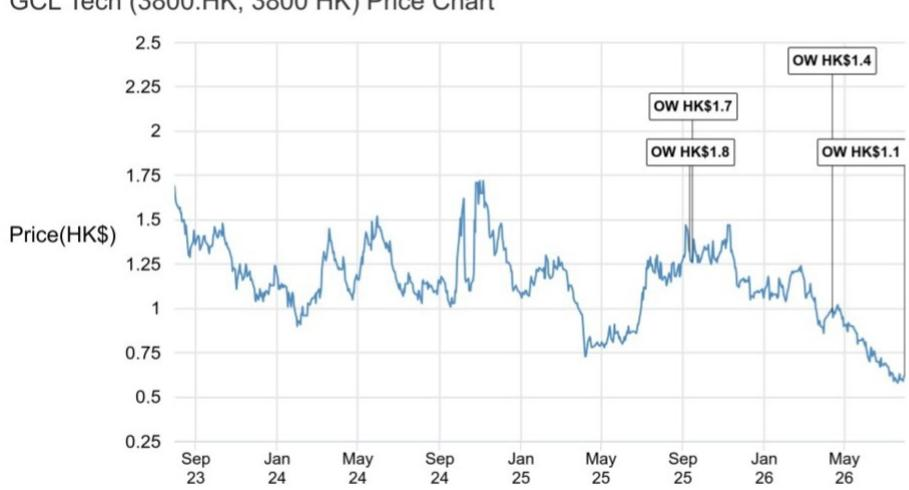

# GCL Tech的战略转向：不是多元化故事，而是将成本工程能力应用于新的正极材料体系

2026年5月中旬，GCL Tech宣布不再以颗粒硅单一业务定义自身，而是重新定位为全球化、多产品的新能源材料平台。最引人注目的变化是进入磷酸铁锂（LFP）正极材料领域，采用物理氧化铁红工艺路线，同时将硅碳负极列为第二条增长曲线。市场可能将此解读为面对多晶硅周期波动而采取的集团式对冲策略，但这种解读并不完整。战略逻辑更为聚焦和清晰：GCL Tech试图将其核心竞争力——以工艺驱动的成本领先能力——从一个供应过剩的商品领域复制到另一个领域，并精准锁定LFP市场中供应最为紧张、定价能力最具防御性的细分区间。

时机选择至关重要。多晶硅价格持续下行，库存水平上升，光伏行业强制性能耗标准的出台虽然可能淘汰约三分之一的生产产能，但供需格局仍将保持供大于求。GCL Tech管理层对此有清晰认知，指出即使在产能出清之后，行业年产能仍将超过200万吨，而需求接近150万吨。核心业务短期内难以快速恢复。因此，这一战略转向并非可选项，而是对政策干预尚未完全解决的结构性供应过剩的必然回应。

研究价值取决于公司能否在完全不同的电化学材料体系中复制其基于FBR的成本优势。早期证据具有指向性且令人鼓舞：单位资本开支约为每吨8,500元人民币，管理层指引目标为每吨7,000元，这使得LFP业务处于行业成本曲线低位。公司并非进入供应过剩严重的LFP大宗商品端，而是瞄准第四代和第四代半产品，并推进至已进入客户测试阶段的第五代正极材料。此类产品的验证周期为六至十二个月，这意味着战略成效最早要到2027年年中才能得到验证。

研究报告给出的估值约为每股0.15港元，尚未纳入基础盈利预测。报告的结构表明，市场目前对新业务几乎不需要支付溢价，上行空间取决于商业化进展的证据。这是一个合理的框架，但也意味着公司报价的重估取决于管理层可控范围内的执行里程碑：产能爬坡、客户多元化和成本下降。

## 多晶硅周期尚未反转，政策缓解力度可能不足，战略应对成为必然

对GCL Tech处境的传统看法是，它是一家等待周期反转的低成本多晶硅生产商。公司的FBR技术相比主流的西门子法实现了更低的现金成本，市场份额因此提升。研究报告证实了这一观点，指出FBR的技术颠覆既是现金成本下降的来源，也是渗透率提升的驱动因素。但周期本身并未配合。多晶硅价格持续下跌，库存水平上升，预期的政策干预尚未以足够力度落地以重新平衡市场。

中国已发布光伏行业能耗与效率强制性国家标准，预计将淘汰约三分之一的生产产能，相当于每年近100万吨。这是有意义的供给侧调整，但仍不充分。即使在削减之后，行业年产能仍将超过200万吨，而需求约为150万吨。缺口是结构性的，而非周期性的。管理层正在等待发改委的进一步指引以及物价部门严格执行价格法，但尚未表明此类执行即将到来。

对研究者的启示是，多晶硅业务在未来十二至十八个月内难以依靠其驱动盈利增长。它仍能产生现金流，尤其是对成本领先者而言，但盈利恢复在分析师基准情形下已推迟至2028财年。因此，向LFP和硅碳负极的战略转向并非传统意义上的多元化布局，而是在认识到核心市场供应过剩持续时间将超出此前预期后的必然选择。问题在于，公司能否在第一台发动机完全停转之前建立起第二台发动机。

## 物理氧化铁红法是成本策略而非化学突破，经济性是护城河所在

管理层对LFP生产工艺的描述值得关注：更简单、更环保的方法，单位资本开支显著降低。物理氧化铁红法并非新的化学体系，而是通往成熟正极材料的不同制造路线。如果竞争优势能够成立，它来自工艺工程而非产品创新。当前单位资本开支为每吨8,500元，有望降至每吨7,000元，与传统LFP生产工艺相比具有优势，后者通常需要更高的资本投入和更复杂的工艺控制。

成本优势直接转化为定价灵活性。管理层表示，在平均售价高于每吨60,000元时，当前产出可实现盈利，单位利润为每吨2,000至3,000元。定价略低于同行，但工艺优势即使在折价情况下也能支撑利润率。这与公司在多晶硅领域采用的策略一致：成为低成本生产商，以有竞争力的价格获取份额。不同之处在于，LFP市场更为分散，高端细分领域的商品化程度较低。

对高能量密度的强调具有战略意义。低端LFP供应过剩，竞争趋于价格战。高端产品——第四代、第四代半以及最终的第五代——供应相对紧张，盈利可见性更好。第五代正极材料已进入客户测试阶段，验证预计需要六至十二个月。如果测试成功，公司将拥有具备溢价能力且面临较小价格压力的产品。如果失败或延迟，公司将面临产能指向尚未有成熟产品的细分领域的局面。

## 产能快速扩张，但财务结构依赖产业资本合作而非仅靠资产负债表

产能规划颇具雄心。一个年产15万吨的设施已在管理之中，母公司集团于2022年底启动该项目，GCL Tech于2025年接管管理。四川项目年产20万吨，预计在未来两至三个月内投产，另有40万吨的扩建可能。四川项目总资本开支估计为17至18亿元人民币，但GCL Tech仅出资30%，约5亿元，其余来自地方产业基金。

这种融资结构具有两方面重要意义。首先，它减轻了GCL Tech资产负债表的压力，该公司已在应对多晶硅下行周期和可转债发行相关的执行风险。其次，它表明公司愿意利用资本合作快速扩张，而无需稀释股东权益或承担过多债务。权衡之处在于，公司并未完全拥有该产能，如果项目成功，可能会使并表或利润确认变得复杂。

母公司集团15万吨设施可能注入上市公司的安排是另一个值得关注的变量。管理层表示存在这种可能性，但尚未提供详细方案。如果注入发生，将立即增加上市公司LFP业务的规模，并可能加速期权价值的实现。如果未发生，上市公司将依赖自身的四川产能以及其选择资助的进一步扩建。

## 客户集中度是近期风险，多元化计划可信但尚未验证

报告中最突出的数据点是客户集中度：LFP总产量中约50%销售给宁德时代，其余主要供应给海辰储能和赣锋锂业。这是一把双刃剑。一方面，向全球最大电池制造商供货验证了产品质量，提供了稳定的收入基础。另一方面，这造成了显著的依赖性，宁德时代采购策略的任何变化都可能对GCL Tech的LFP收入产生超比例影响。

管理层的目标是向更多电芯制造商多元化，包括国轩高科、LG和比亚迪。这是合理的策略，但需要时间。电池供应链中新客户的认证周期较长，公司进入的市场中，湖南云能、富临精工等成熟参与者已建立了关系和业绩记录。公司的成本优势可能有助于赢得试用机会，但将试用转化为批量订单需要可靠性、一致性和规模化能力的证明。

竞争格局并非静态。低端LFP供应过剩，高端供应紧张，但这种紧张将吸引投资。如果高端细分领域在GCL Tech第五代产品完全认证之前变得拥挤，管理层预期的盈利可见性可能受到侵蚀。六至十二个月的验证窗口是关键时期；它决定了公司是以成熟供应商身份进入高端市场，还是以迟到者身份进入。

## 硅碳负极是真实的第二条曲线，但经济性不确定性更高，时间线更长

硅碳负极业务处于更早期阶段。公司正在扩建一条年产能超过1,000吨的试验生产线。技术逻辑清晰：硅碳负极比主流石墨负极具有更高的单位容量，可显著提升电池能量密度。这是一个被充分理解的优点，随着电池制造商推动更高能量密度以延长续航里程和减轻重量，硅碳负极市场预计将增长。

然而，经济性确定性较低。硅碳负极在循环寿命和充电过程中的体积膨胀方面历来面临挑战，限制了其应用。制造工艺比石墨更复杂，每千瓦时成本目前更高。GCL Tech管理层对该技术持积极态度，但报告未提供该产品线的具体成本数据或客户承诺。每年1,000吨的中试规模较小，实现商业可行性需要大量资本和工艺开发投入。

战略逻辑合理：如果公司能在硅碳负极领域建立地位，将拥有与LFP正极互补的产品，为电池制造商提供组合解决方案。但时间线更长，技术失败或采用延迟的风险更高。这是一条第二增长曲线，但它是未来的期权，而非近期的盈利驱动因素。

## 研究者的决策框架：未来四至六个季度关注什么

报告提供了足够的细节，可以构建一个评估GCL Tech转型的决策框架。框架包含四个组成部分：成本轨迹、客户多元化、产能利用率和多晶硅政策进展。

首先，关注LFP业务的单位资本开支轨迹。管理层已给出从每吨8,500元向每吨7,000元迈进的指引。每一次增量下降都会强化成本护城河，并增加即使LFP价格下跌也能维持盈利的可能性。其次，跟踪客户集中度。宁德时代份额从50%降至30-40%将表明多元化正在推进，公司不过度依赖单一买家。第三，关注四川设施投产后两个季度内的利用率。高利用率将表明需求真实且产品具有竞争力。第四，关注发改委和物价部门在多晶硅领域的行动。如果政策干预加速产能出清或提振需求，核心业务可能比预期更快恢复，为整个转型故事提供顺风。

分析师给出的每股0.15港元期权价值是保守估计，但也是一个信号。市场目前几乎不需要为LFP和硅碳负极业务支付溢价。上行空间是真实的，但取决于执行。下行风险有限，但并非为零。公司报价的重估将取决于其能否证明成本工程能力从颗粒硅成功迁移至电化学材料领域。

转型大胆但并不鲁莽。公司正在利用其核心竞争力，通过资本合作分担风险，并瞄准市场中定价能力较强的细分领域。未来四至六个季度将决定这是一次战略杰作还是一次代价高昂的绕行。

*仅供参考。部分内容可能基于源材料由AI辅助生成、翻译、摘要或编辑，可能存在遗漏或错误。请独立核实。本文不构成投资、法律、税务、会计或其他专业建议。*

仅供参考。部分内容可能基于源材料由AI辅助生成、翻译、摘要或编辑，可能存在遗漏或错误。请独立核实。本文不构成投资、法律、税务、会计或其他专业建议。

