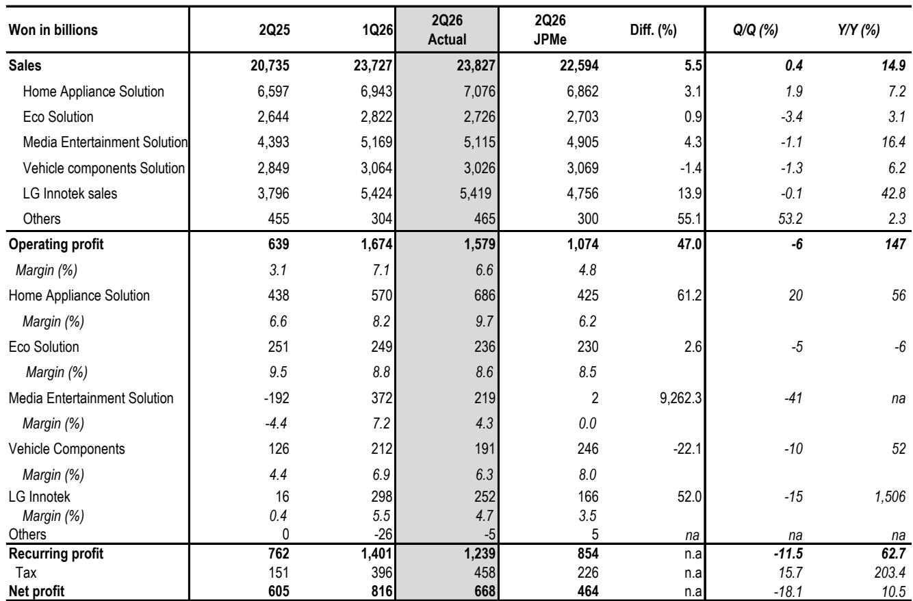
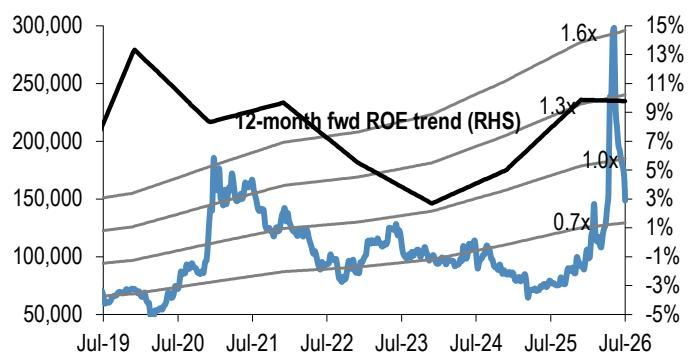
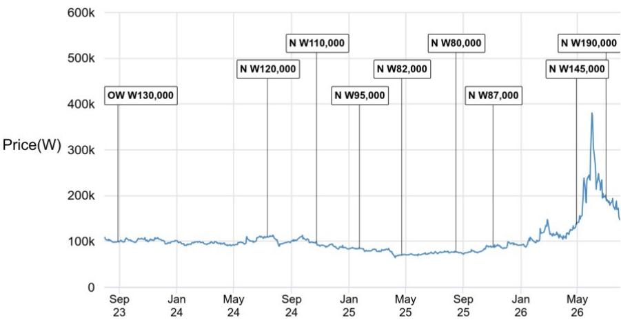

# LG电子的转型是真实的，但市场在业务落地前已提前定价机器人概念

LG电子第二季度实现营业利润1.58万亿韩元，销售额23.8万亿韩元，营业利润率6.6%，大幅超出市场一致预期，较全球投资银行自身预测高出近50%。然而，这一超预期表现并非完全来自经营性改善。一笔3000亿韩元的美国关税返还（扣除一次性费用后）推高了表面数字，而市场的关注点已经越过本季度，转向一个更大的问题：LG能否从消费电子集团转型为AI数据中心和机器人经济的供应商？

基于本季度的证据，答案是：CDU（冷却液分配单元）业务是真实的且正在规模化，而机器人业务仍停留在试点产线和谅解备忘录阶段，尚无有意义的收入可见性。管理层确认其600kW CDU已完成向英伟达认证的验证流程，并披露2026年上半年CDU订单获取达6000亿韩元，预计到年底管道订单有望达到数万亿韩元。在机器人方面，公司重申计划在下半年建设机器人数据工厂，并指出试点产线完成后已开始初步执行器生产。这两项声明中，一项有订单支撑，另一项仅有意图支撑。

股价讲述了一个市场将两者混淆的故事。LG电子股价在6月初达到年内峰值，涨幅超过60%，跑赢其子公司LG Innotek和更广泛的KOSPI指数，几乎完全由机器人叙事的预期驱动。随后，随着地缘政治风险重新浮现以及AI和机器人板块的获利了结，股价从峰值回落61%。当前股价与目标价之间的路径比表面数字所暗示的要窄，且这条路径贯穿CDU业务，而非机器人叙事。

这是读者面临的核心张力：LG电子不再是纯粹的消费电子故事，但也尚未成为AI基础设施故事。公司处于一个过渡地带——旧业务趋于稳定，新业务从较小的基数增长，而市场已经定价了一个管理层尚未交付的未来版本。正确的回应不是否定转型，而是认识到在当前估值水平下，风险回报比并不有利。

## 季度业绩真实但受一次性关税返还美化，盈利质量比表面数字更重要

第二季度实现营业利润1.58万亿韩元，销售额23.8万亿韩元，6.6%的营业利润率较投资银行预测的1.07万亿韩元高出47%。收入同比增长14.9%，营业利润较上年同期的低基数增长147%。从表面看，这像是一家全面发力的公司。但底层细节更为微妙。

家电解决方案（HS）部门表现最为突出，销售额同比增长7.2%，营业利润率达到9.7%，远高于最初的中个位数增长和利润率指引。管理层将其归因于高端产品与订阅制产品并行的双轨策略，但该部门同样受益于美国关税返还。管理层披露，扣除一次性费用后的关税返还为本季度贡献约3000亿韩元，约占整体营业利润的19%。剔除这一因素后，营业利润率降至约5.3%——这是一个稳健但远非惊艳的结果。

媒体娱乐解决方案（MS）部门（含电视和IT业务）从上年同期1920亿韩元的营业亏损转为2190亿韩元的营业利润，得益于高端产品占比提升和海外运营改善。车辆零部件解决方案（VS）部门增长6.2%，营业利润率6.3%，好于担忧但低于投资银行预测。子公司LG Innotek供应摄像头模组等零部件，收入增长42.8%，营业利润2520亿韩元，受益于内容和零部件需求。

各业务部门的模式一致：运营改善是真实的，但来自成本控制、高端产品结构转变和一次性收益，而非核心业务的结构性重估。管理层对第三季度的指引印证了这一解读。公司预计同比增长低双位数（高于季节性水平），营业利润率中个位数，得益于MS和VS部门的审慎成本控制。承载CDU和机器人计划的ES部门预计增长中个位数，利润率中个位数，受新业务投资负担制约。

第三季度将不再有关税返还的顺风，管理层已提示内存成本上升和宏观波动对MS部门构成逆风。下半年盈利路径可能从第二季度的高点向下倾斜。读者不应将6.6%的营业利润率线性外推；可持续的运营水平更接近管理层指引的第三季度中个位数区间。

## CDU业务是真正的增长引擎，英伟达认证改变竞争格局

本季度最重要的披露不在财报表格中，而在围绕AI数据中心冷却业务的评论中。管理层确认LG的600kW CDU已获得英伟达认证，这一里程碑验证了产品的技术能力，并为来自超大规模客户的实质性订单流打开了大门。公司披露2026年上半年CDU订单获取达6000亿韩元，管理层指引该积压订单不含大型科技公司。这意味着现有订单来自较小或非超大规模客户，而主要云服务提供商的加入可能在年底前将管道订单放大数倍。

投资银行的分析表明，到2026年底订单积压可能达到数万亿韩元，这将使CDU业务在2027年至2028年成为ES部门收入和利润的有意义贡献者。ES部门目前每季度销售额约2.7万亿韩元，营业利润率8.6%。如果CDU业务按订单管道所暗示的规模扩展，它可能增加一个市场尚未完全纳入估值模型的新增长向量。

区域动态有利。管理层表示北美是AI数据中心冷却的主要目标市场，IT容量预计从2026年的25GW增长至2031年的70GW，其中超过60%位于北美。云服务提供商是冷水机组和液冷组件的主要渠道合作伙伴，LG获得英伟达认证使其能够参与这一建设进程。公司还计划利用现有业绩记录和“One LG”战略拓展亚洲客户。

这是一个可信的增长故事，但需要校准其规模。CDU业务是真实的，认证是有意义的，订单管道正在建立。然而，目前6000亿韩元的订单仅占LG季度收入的一小部分，即使到2027年达到数万亿韩元的年化运营水平，仍小于HS部门每季度的贡献。CDU业务可以成为增长驱动因素和估值倍数扩张器，但尚不是能够抵消核心消费业务波动的利润引擎。

战略意义则不同。英伟达认证向市场传递了一个信号：LG具备在AI基础设施供应链中竞争的工程能力。这与推动其他亚洲科技公司重新估值的动态相同——这些公司成功定位为AI基础设施供应商。问题在于LG能否将这一技术验证转化为持续的订单流和利润率贡献，还是认证仍只是一个未能转化为可扩展收入的一次性里程碑。

## 机器人业务是有叙事而无商业模式的领域，市场已提前定价故事

机器人业务是LG投资案例中最具争议的部分。股价在6月峰值的上涨主要由机器人预期驱动，随后的61%回调反映了市场意识到这些预期为时过早。管理层在本季度的评论几乎没有缩小叙事与现实之间的差距。

公司已完成执行器试点产线，目前专注于质量测试和自动化。管理层于6月签署了一份谅解备忘录，并正在考虑额外的合作努力。公司计划在2026年下半年建设机器人数据工厂，目标是成为机器人领域定制化解决方案的提供商，而非仅仅是零部件供应商。其愿景是整合数据平台和AI代理，交付物理AI解决方案，与英伟达等大型科技公司以及领先的中国机器人企业合作。

这些都不构成一项业务。没有披露的订单簿、没有收入指引、没有利润率概况、也没有机器人业务何时对财务业绩产生有意义贡献的明确时间表。投资银行的立场是适当保守的：该业务缺乏有形战略，面临日益激烈的市场竞争，尤其是来自在成本和规模上推进更快的中国参与者。机器人机会长期来看是真实的，但现在在估值模型中给予其权重还为时过早。

与CDU业务的对比具有启发性。CDU业务拥有英伟达认证、已披露的订单管道和具有量化容量增长的明确终端市场。机器人业务拥有试点产线、一份谅解备忘录和一个愿景。一个是具有收入可见性的新兴业务；另一个是带有营销叙事的研发项目。市场未能区分这两者，是股价波动的根本原因。

还有一个值得关注的竞争动态。LG正在进入一个已经拥挤的机器人市场，亚洲已有众多成熟参与者，包括在人形和工业机器人领域积极布局的中国公司。LG与中资机器人企业合作的既定策略表明，它认识到无法正面竞争，而是寻求零部件和解决方案提供商的定位。这是一个合理的策略，但也是一个比市场叙事所暗示的集成机器人平台利润率更低的定位。

## 下半年盈利路径向下，第三季度将检验核心业务能否在无一次性收益下支撑业绩

第三季度指引是2026年剩余时间最清晰的信号。管理层指引同比增长低双位数（高于季节性水平），营业利润率中个位数。这意味着假设收入约24万亿至25万亿韩元，营业利润在1.2万亿至1.4万亿韩元区间。这将较第二季度的1.58万亿韩元环比下降，即便不考虑第二季度包含的3000亿韩元关税返还。

MS部门预计维持改善后的盈利能力，管理层指引在多年亏损后实现全年营业利润。改善归因于高端产品占比提升和海外运营表现增强，但管理层也提示下半年内存成本上升和宏观波动构成逆风。VS部门预计在强劲订单获取下维持高个位数营业利润率，但车辆市场仍存在波动，LG Magna在墨西哥和匈牙利的运营仍在爬坡。

承载CDU和机器人投资负担的ES部门预计增长中个位数，利润率中个位数。这是一个保守的指引，反映了在核心暖通空调和零部件业务面临物流成本压力时投资新业务的成本。管理层表示运费可能在第三季度见顶，第四季度将有所缓解，但近期压力是真实的。

下半年盈利路径从第二季度高点向下，市场已开始对此定价。股价从6月峰值的回调不仅反映地缘政治风险，也反映市场认识到第二季度的超预期表现受一次性项目美化，可持续的盈利运营水平低于表面数字所暗示的水平。

## 读者的决策框架：区分业务、定价转型、等待执行证据

LG电子的投资案例需要一个区分三种不同风险特征业务的框架：稳定的核心消费业务（HS和MS）、新兴的AI基础设施业务（CDU和冷却）以及投机性的机器人计划。每一项都应有不同的估值方法，而当前股价似乎以一种过度权重投机成分、低估核心业务结构性挑战的方式将它们混合在一起。

对于核心消费业务，问题是利润率扩张是否可持续。HS部门9.7%的营业利润率高于历史区间，其可持续性取决于订阅业务规模化和关税及物流成本是否保持可控。MS部门恢复盈利令人鼓舞，但该部门有与面板价格和内存成本相关的波动历史。审慎的假设是核心利润率向中个位数区间正常化，这与管理层的第三季度指引一致。

对于CDU业务，关键指标是订单获取、认证里程碑和收入转化。英伟达认证是积极信号，6000亿韩元的上半年订单提供了基础。如果大型科技公司订单落地，投资银行对年底积压订单达数万亿韩元的预期是可以实现的，但这尚未确认。CDU业务的估值取决于订单转化为收入的速度以及业务规模化后的利润率概况。ES部门目前8.6%的营业利润率提供了基准，但考虑到数据中心冷却的竞争动态，CDU利润率可能有所不同。

对于机器人业务，适当的立场是在有订单、收入或明确竞争壁垒的证据之前不赋予任何价值。市场已展示了为机器人叙事定价的意愿，6月峰值以来61%的回调显示了叙事未能兑现时的下行风险。希望参与LG机器人愿景的读者应等待执行证据，而非提前为故事买单。

当前价格的决策框架是直接的：在147,500韩元的价位，股票的交易定价反映了市场应给予CDU业务机会和核心盈利正常化的认可，但不包含机器人业务。当前价格的风险回报不利，因为机器人持续去估值的下行风险超过CDU订单获取的上行空间，且下半年盈利路径向下。

更好的入场点将在以下两种情况之一发生时出现：要么股价进一步回调至仅核心业务即可支撑估值的水平，要么CDU业务交付足以证明当前估值倍数合理的订单获取和收入——无需依赖机器人叙事。在此之前，正确的立场是保持观望，等待证据追上故事。

*仅供参考。部分内容可能基于原始材料通过AI辅助生成、翻译、摘要或编辑，可能存在遗漏或错误。请独立核实。本文不构成投资、法律、税务、会计或其他专业建议。*

仅供参考。部分内容可能基于原始材料通过AI辅助生成、翻译、摘要或编辑，可能存在遗漏或错误。请独立核实。本文不构成投资、法律、税务、会计或其他专业建议。

