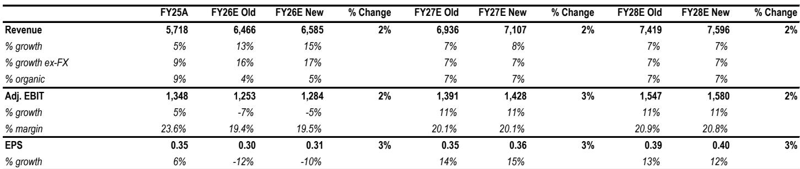
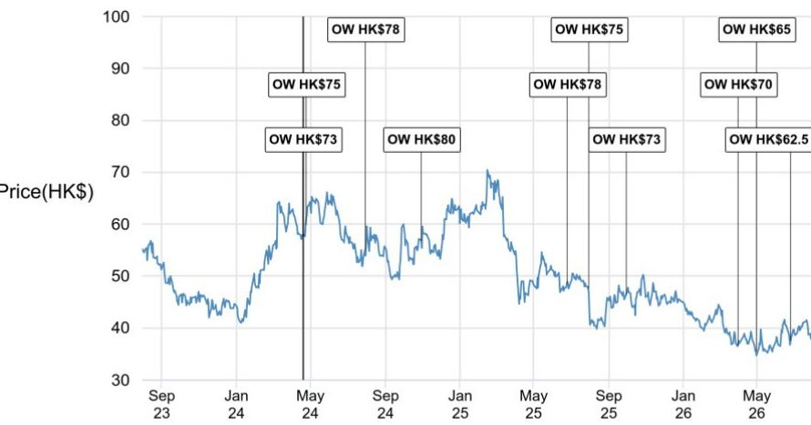
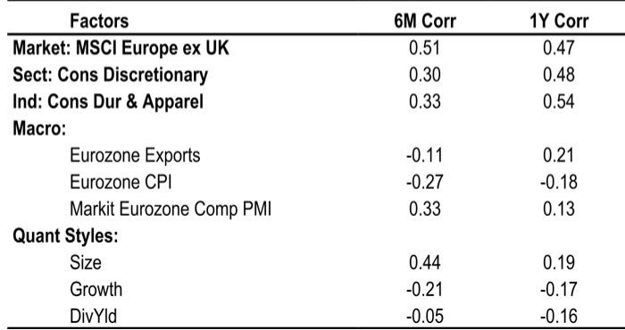

# JPM：Prada集团业务与季度数据观察

这份JPM研究材料围绕Prada集团2026财年二季度的经营表现展开。集团整体有机销售增速从一季度的3%回升至7%，高于此前预期。在奢侈品行业整体处于增速调整阶段的背景下，这一数据之所以值得关注，不仅在于其超出预期，更在于增长的结构——Prada主品牌零售销售恢复至正增长区间，且管理层明确提到增长中包含了正向的量价贡献。

报告认为，这份业绩显示集团在皮革制品品类中展现出少有的韧性，而市场当前对其定价可能仍未充分反映这一基本面变化。

## 1. Prada主品牌零售增速转正，量价结构同步改善

二季度Prada品牌零售销售按固定汇率计算增长6%，而一季度这一数字还是持平。更值得注意的是，管理层在业绩交流中表示，增长在数量层面也录得轻微正增长，这意味着并非单纯依靠提价驱动。JPM分析师特别指出，在多数品牌忙于重新校准定价架构的时候，Prada仍在沿着价格金字塔向上延伸，同时通过产品和客户关系维护来巩固不同价格带的消费者关系。

从区域数据看，增长并非依赖单一市场。管理层披露，中国消费者在二季度实现双位数增长，且较一季度进一步加速，本地消费和旅游消费均有贡献；北美需求强劲且持续加速；欧洲基本持平略有改善；日本市场则保持平稳。这种多区域同步改善的格局，与行业整体呈现的区域分化形成对比。

> **KC评论：** 量价齐升是这份业绩里最容易被忽略的细节。很多品牌在行业调整期靠提价维持报表，但Prada这次是数量也在增长，说明产品新度和客户运营确实在起作用，而不只是定价策略的功劳。

## 2. Miu Miu在高基数上实现正常化增长，中东市场影响约3个百分点

Miu Miu二季度零售销售增长3%，表面看增速不高，但需要放在基数背景下来理解：去年同期该品牌增长40%，两年前同期更是增长175%。剔除中东市场的影响后，Miu Miu实际增速为6%。JPM认为，这属于管理得当的增长正常化，品牌仍保持正的同店销售，产品力和品牌运营继续支撑需求。

管理层在业绩会上给出了一个长期指引：Miu Miu未来有机会实现5%-10%的可持续增长。考虑到该品牌过去两年的爆发式增长，这个指引既承认了基数效应，也表明集团对该品牌长期势头的判断仍然积极。

## 3. 利润率降幅小于预期，Versace并表稀释约350个基点

上半年集团EBIT利润率为17.2%，同比下降500个基点，但其中约350个基点来自Versace并表的稀释效应，以及营销费用投放节奏的影响。剔除这些因素后，集团有机毛利率实际上略有提升，主要受益于全价销售占比提高。JPM此前预计利润率降幅为590个基点，实际结果明显好于预期。

管理层还提到，Versace在2026财年下半年的稀释效应预计与上半年类似，而全年营销费用占销售比例将保持稳定或略高于去年。这意味着市场对Versace整合带来的短期财务不确定性已经有了相对清晰的预期框架。

> **KC评论：** 报告把Versace的稀释效应单独拆出来了，这是理解Prada集团当前利润率的关键。如果不看这个拆解，很容易把500个基点的利润率下滑解读为经营出现变化，但实际上核心业务的盈利能力是稳住的。

## 4. 当前估值隐含的预期低于集团核心增长水平

JPM在业绩后将2026-2027财年盈利预测上调约2%，主要反映上半年业绩超预期的部分。报告指出，Prada当前交易在2027年预期市盈率约13倍，较行业平均约20倍存在约40%的折价。而集团核心业务的盈利增长仍保持在双位数水平。

报告同时提示了一个需要跟踪的节奏问题：管理层表示6月最后一周和7月初的销售偏软，之后又恢复了较好的销售节奏。这种短期波动在奢侈品行业并不罕见，但说明下半年增长路径可能不会是一条直线。JPM目前预计三季度集团有机销售增长7%，其中Prada品牌零售增长6%，Miu Miu零售增长8%。

对于关注奢侈品行业资金配置的读者，这份报告提供了一个观察框架：当一家公司同时具备主品牌增速回升、副品牌高基数正常化、利润率稀释因素清晰可拆解这三个条件时，市场定价往往滞后于基本面变化。Prada集团当前的情况，恰好三个条件都满足。

For informational purposes only. Portions may be generated,translated,summarized,or edited with AI assistance based on source materials and may contain omissions or errors. Please verify independently. This is not investment,legal,tax,accounting,or other professional advice.

For informational purposes only. Portions may be generated,translated,summarized,or edited with AI assistance based on source materials and may contain omissions or errors. Please verify independently. This is not investment,legal,tax,accounting,or other professional advice.

