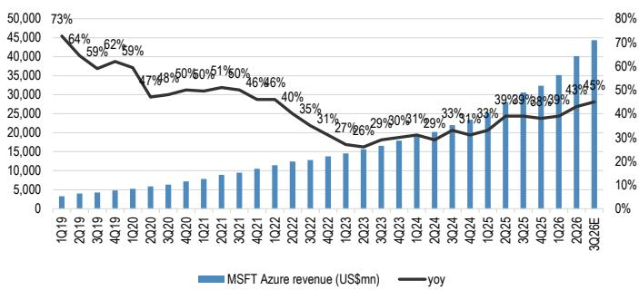
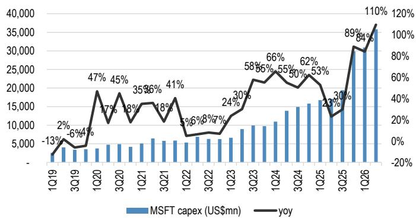

## 个人电脑与服务器

## 从微软/Meta 6月季度财报看行业趋势

微软（评级为增持，由JPM美国企业软件分析师Samik Chatterjee负责）与Meta（评级为中性，由JPM美国互联网分析师Doug Anmuth负责）在亚洲市场开盘前公布了6月季度业绩。两家美国超大规模云服务商的现金资本开支在6月季度环比增长32%、同比增长96%。Meta已将2026年资本开支指引区间收窄至此前范围的上沿，按中值计算同比增长约90%。微软本次重申了其2026财年资本开支指引，管理层预计9月季度总资本开支将环比增长超过22%（超过500亿美元），并预期2027财年资本开支将继续增加。对亚洲科技供应链的主要影响如下：

## 微软

- 微软6月季度现金资本开支约为360亿美元（环比增长16%、同比增长110%），基本符合市场预期。其中约三分之二用于短期资产（主要为GPU/CPU）。6月季度强劲的现金资本开支与我们此前对微软服务器支出强劲的研究判断一致。

- 管理层预计9月季度总资本开支将超过500亿美元（同比增长超过43%），且更多融资租赁将重新分类为经营租赁。这意味着现金资本开支将出现更显著的环比提升。全年来看，管理层重申了2026日历年总资本开支指引（1900亿美元，考虑到部分融资租赁重新分类为经营租赁后调整为1750亿美元）。微软预计2027财年总资本开支将继续增加，但未给出具体幅度。不过，9月季度强劲的季度运行率（500亿美元以上）意味着资本开支可能进一步上行。这对微软服务器供应链构成利好（AI服务器：广达、鸿海；通用服务器：纬颖、联想、鸿海）。

- 微软Azure云收入6月季度同比增长43%，较上一季度的39%有所加速，主要受强劲的云服务需求、AI产品定价提升带来的吸引力增强，以及产能交付速度快于预期推动。展望未来，管理层预计9月季度Azure业务增长动能将进一步加速至同比增长45%以上（市场预期为同比增长41%以上）。管理层强调，尽管增长动能加速，供应约束仍然存在。Azure的强劲需求为资本开支的可持续性提供了支撑。

- 微软Windows OEM收入6月季度同比下降5%，好于公司预期，主要由于组件涨价前渠道持续备货。这一表现好于中国台湾NB ODM出货量同比下降8%的趋势，表明市场份额持续从中国台湾ODM向中国大陆同行转移。展望未来，管理层预计9月季度Windows OEM收入将出现20%出头的同比下降，2027财年同比下降幅度为百分之十几，主要由于PC终端需求因负价格弹性而走弱、PC库存偏高以及Windows 10换机需求减弱。这意味着3季度PC出货量环比可能出现高个位数下降，也暗示我们此前的NB ODM出货量环比下降3%的预测存在下行可能。

## Meta

- Meta 6月季度现金资本开支约为300亿美元（环比增长59%、同比增长82%），略低于市场一致预期。管理层已将2026年总资本开支指引从此前的1250-1450亿美元区间收窄至1300-1450亿美元（中值同比增长约90%）。这意味着2026年下半年资本开支将出现强劲环比提升（环比增长约70%），并为Meta服务器供应链的收入动能带来加速。

- Meta目标是在2026/2027年最大化计算能力，以支持未来几年的业务增长，考虑到可预见未来仍存在供应约束。不过，公司将在2028年以后保持灵活且可互换的产能策略，以应对需求的不确定性。例如，公司计划提前建设长期资产（如土地、电力、设施）以应对长期需求，但会推迟短期资产的建设决策以应对不确定性。公司还将采用模块化服务器设计，可在AI与通用工作负载之间灵活切换。

- Meta 9月季度收入指引为610-640亿美元（中值同比增长22%），符合市场预期，可能受强劲的广告和智能体AI需求推动。管理层还认为，在消费者、企业和基础设施产品方面存在可观的AI商业化机会，这得益于核心应用参与度提升、AI产品线扩展、企业API需求增长以及潜在的算力直接销售。核心业务稳健增长叠加AI吸引力上升，为资本开支的可持续性提供了支撑。

## JPM对PC/服务器行业的看法

- 微软与Meta 2026日历年强劲的资本开支展望表明2026年下半年资本开支将出现强劲环比提升，并为未来几个季度AI服务器产业链的收入动能提供支撑。

- 持续的供应约束也意味着AI服务器出货量存在上行可能，并为组件供应商在中期至短期内带来有利的定价和利润率环境。

- 云服务商AI布局的扩大——无论是内部（如效率提升、核心产品性能改善、加速产品开发）还是外部（如快速增长的AI服务收入/用户基础、更高附加值/定价）——都表明未来资本开支趋势更具持续性。

- 考虑到超大规模云服务商AI驱动的收入增长强劲以及资本开支展望乐观，我们维持对服务器板块的积极看法。在服务器ODM领域，我们首选仍是纬颖，原因是通用服务器上行周期以及即将到来的AWS Trainium 3周期。在组件领域，我们看好AI电源和液冷等长期趋势标的，如台达电、健策和奇鋐。我们认为信骅和嘉泽将受益于今年强于预期的传统服务器支出。智邦也将受益于长期数据中心网络需求以及加速中的AI网络升级周期。

图1：微软Azure收入趋势  
  
来源：公司数据。3Q26E基于公司同比增长45%的指引。

图2：微软Windows OEM收入趋势  
  
来源：公司数据。3Q26E基于管理层评论。

图3：Meta现金资本开支趋势  
  
来源：公司数据。

图4：微软现金资本开支趋势  
  
来源：公司数据。

本报告讨论的公司（除非另有说明，本报告所有价格均为2026年7月29日收盘价）：信骅科技（5274.TWO/NT\$12,910.00/增持）、智邦（2345.TW/NT\$1,910.00/增持）、奇鋐科技（3017.TW/NT\$2,095.00/增持）、台达电子（2308.TW/NT\$1,495.00/增持）、鸿海精密（2317.TW/NT\$237.00/增持）、健策精密（3653.TW/NT\$3,310.00/增持）、嘉泽（3533.TW/NT\$1,725.00/增持）、Meta Platforms Inc（META/\$585.61/中性）、微软（MSFT/\$390.54/增持）、纬颖科技（6669.TW/NT\$5,135.00/增持）

分析师认证：本报告封面标注“AC”的研究分析师（或当本报告由多位研究分析师主要负责时，封面或文内标注“AC”的研究分析师分别就其负责的每只证券或发行主体认证）：(1) 本报告所表达的所有观点准确反映了研究分析师对标的证券或发行主体的个人看法；(2) 研究分析师薪酬中没有任何部分与本次报告中提出的具体推荐或观点存在直接或间接关联。封面所列韩国研究分析师（如适用）另根据KOFIA要求认证，其分析基于诚信原则，反映其独立判断，未受不当影响或干预。

本报告所列所有作者均为独立开展研究的研究分析师，除非另有说明。在欧洲，行业专家（销售与交易）可能作为联系人列示于本报告，但并非报告作者或研究部门成员。

## 重要披露

公司特定披露：JPM寻求并确实与其研究报告所覆盖的公司开展业务。因此，读者应注意，本公司可能存在影响本报告客观性的利益冲突。读者应将本报告视为其决策的单一因素。重要披露（包括价格图表和信用意见历史表，如适用）可在https://www.jpmm.com/research/disclosures 查阅，或致电1-800-477-0406，或发送邮件至research.disclosure.inquiries@JPM.com。

## 股票研究评级、分类及分析师覆盖范围说明：

JPM采用以下评级体系：增持（在本报告所示目标价期间内，预期该股票表现将优于研究分析师或其团队覆盖范围内股票的平均总回报）；中性（在本报告所示目标价期间内，预期该股票表现将与研究分析师或其团队覆盖范围内股票的平均总回报一致）；减持（在本报告所示目标价期间内，预期该股票表现将逊于研究分析师或其团队覆盖范围内股票的平均总回报）。NR为未评级。在此情况下，JPM因缺乏充分基本面依据或法律、监管或政策原因，已撤销对该股票的评级及（如适用）目标价。此前评级及（如适用）目标价不应再作为参考依据。NR标记并非推荐或评级。部分覆盖股票有评级但无目标价；在此情况下，我们预期该股票在相关期间内表现将优于/一致/逊于研究分析师或其团队覆盖范围内股票的平均总回报。在我们亚洲（除澳大利亚和印度）及英国中小盘股票研究中，每只股票的预期总回报与基准国家市场指数的预期总回报进行比较，而非与研究分析师覆盖范围进行比较。如本报告重要披露部分未列示，认证研究分析师的覆盖范围可在JPM网站https://www.JPMmarkets.com 查询。

覆盖范围：Hung, Albert：信骅科技（5274.TWO）、华硕电脑（2357.TW）、智邦（2345.TW）、仁宝电子（2324.TW）、台达电子（2308.TW）、英业达（2356.TW）、联想集团（0992）（0992.HK）、嘉泽（3533.TW）、微星科技（2377.TW）、和硕（4938.TW）、广达电脑（2382.TW）、世纪互联（VNET）、纬创（3231.TW）、纬颖科技（6669.TW）

## JPM股票研究评级分布（截至2026年7月4日）

<table><tr><td></td><td>增持（买入）</td><td>中性（持有）</td><td>减持（卖出）</td></tr><tr><td>JPM全球股票研究覆盖*</td><td>53%</td><td>36%</td><td>12%</td></tr><tr><td>投行客户**</td><td>83%</td><td>80%</td><td>73%</td></tr><tr><td>JPMS股票研究覆盖*</td><td>51%</td><td>37%</td><td>12%</td></tr><tr><td>投行客户**</td><td>95%</td><td>92%</td><td>87%</td></tr></table>

*请注意，由于四舍五入，百分比可能无法加总至100%。

**此前12个月内JPM提供投资银行服务的“买入”、“持有”和“卖出”类别中标的公司的百分比。

就FINRA评级分布规则而言，我们的增持评级属于报告评级类别；中性评级属于持有评级类别；减持评级属于报告评级类别。请注意，标记为NR的股票未包含在上表中。该信息截至最近一个日历季度末。

股票估值与风险：有关覆盖公司或目标价的估值方法和风险，请参阅http://www.JPMmarkets.com 上最新的公司特定研究报告，联系首席分析师或您的JPM代表，或发送邮件至research.disclosure.inquiries@JPM.com。有关专有模型的实质性信息，请参阅公司特定研究报告中的财务摘要和公司概览表，可在我们的客户网站http://www.JPMmarkets.com 的公司页面下载。本报告亦列示了所使用的重要基础假设。

## 投资推荐历史：

此前12个月内JPM投资推荐的历史记录可在http://www.JPMmarkets.com 的研究与评论页面查阅，也可按分析师姓名、行业或金融工具搜索。

分析师薪酬：负责编写本报告的研究分析师的薪酬基于多种因素，包括研究的质量和准确性、客户反馈、竞争因素以及公司整体收入。

非美国分析师注册：除非另有说明，本报告封面所列非美国分析师为非美国JPM证券有限责任公司关联公司的员工，可能未在FINRA规则下注册为研究分析师，可能不是JPM证券有限责任公司的关联人员，且可能不受FINRA规则2241或2242关于与覆盖公司沟通、公开露面及研究分析师账户持有证券交易限制的约束。

## 其他披露

JPM是JPM公司及其全球子公司和关联公司投资银行业务的营销名称。

英国MIFID FICC研究解除捆绑豁免：英国客户应参阅英国MIFID研究解除捆绑豁免，了解JPMFICC研究豁免的实施详情及相关FICC研究分类指引。

所有向客户提供的研究材料均同时在我们的客户网站JPM Markets上提供，除非相关法律另有特别允许。并非所有研究内容都会重新分发、通过电子邮件发送或提供给第三方聚合平台。如需获取特定股票的所有研究材料，请联系您的销售代表。

本研究材料中对中国的任何长格式称谓均指中国大陆、中国香港特别行政区、中国台湾和中国澳门特别行政区。

JPM可能不时撰写关于受美国、欧盟、英国或其他相关司法管辖区政府当局实施或管理的经济或金融制裁所针对的发行人或证券（“受制裁证券”）的内容。本报告中任何内容均无意被解读为鼓励、促进、推动或以其他方式批准对受制裁证券的投资或交易。客户在做出投资决策时应了解自身的法律和合规义务。

本研究报告中讨论的任何数字或加密资产均受快速变化的监管环境影响。有关加密资产（包括比特币和以太坊）的相关监管提示，请参阅https://www.JPM.com/disclosures/cryptoasset-disclosure。

本研究报告的作者可能未获许可在您的司法管辖区开展受监管活动，如未获许可，则不会声称具备该等能力。

交易所交易基金（ETF）：JPM证券有限责任公司（“JPMS”）作为几乎所有美国上市ETF的授权参与者。如本报告提及任何ETF，JPMS可能因分销该等ETF份额而赚取佣金和基于交易的报酬，并可能因提供其他交易相关服务（如向ETF份额卖空者提供证券借贷）而赚取费用。JPMS还可能为ETF本身提供服务，包括担任ETF的经纪商或交易商。此外，JPMS的关联公司可能为ETF提供服务，包括信托、托管、管理、借贷、指数计算和/或维护及其他服务。

期权和期货相关研究：如本报告所含信息涉及期权或期货相关研究，该等信息仅向已收到适当期权或期货风险披露文件的人士提供。请联系您的JPM代表或访问https://www.theocc.com/components/docs/riskstoc.pdf 获取期权清算公司标准化期权特征和风险文件，或访问https://www.finra.org/sites/default/files/2020-08/Security\_Futures\_Risk\_Disclosure\_Statement\_2020.pdf 获取证券期货风险披露声明。

银行间报价利率（IBOR）及其他基准利率变更：某些利率基准正在或可能在未来受到持续的国际、国内及其他监管指引、改革和改革提案的影响。更多信息请参阅：https://www.JPM.com/global/disclosures/interbank\_offered\_rates

私人银行客户：如您是JPM公司及其子公司（“JPM私人银行”）私人银行业务的客户，研究材料由JPM私人银行而非JPM任何其他部门（包括JPM企业与投资银行及其全球研究部门）提供。

研究制作和分发的法律实体：本材料作者署名下方标识的法律实体为制作本研究的法律实体。如多位Reg AC研究分析师撰写本材料且其姓名下方标识了不同法律实体，则该等法律实体共同负责制作本研究。如分析师姓名下方列示多个法律实体，除非另有说明，第一个法律实体负责制作。来自不同JPM关联公司的研究分析师可能为本材料的制作做出了贡献，但可能未获许可在您的司法管辖区开展受监管活动（且不会声称具备该等能力）。除非法律实体披露中另有说明，本材料由负责制作的法律实体分发，或当分析师姓名下方列示多个法律实体时，由第一个法律实体负责分发。如有任何疑问，请联系您所在司法管辖区的相关研究分析师或分发本研究材料的实体。

## 法律实体披露及国家/地区特定披露：

阿根廷：JPM银行布宜诺斯艾利斯分行受阿根廷中央银行（BCRA）和阿根廷国家证券委员会（CNV - ALYC y AN Integral N°51）监管。

澳大利亚：JPM证券澳大利亚有限公司（“JPMSAL”）（ABN 61 003 245 234/AFS牌照号：238066）受澳大利亚证券和投资委员会监管，为ASX Limited市场参与者、ASX Clear Pty Limited清算和结算参与者及ASX Clear（Futures）Pty Limited清算参与者。本材料由JPMSAL或代表其在澳大利亚仅向“批发客户”（定义见《2001年公司法》第761G条）发行和分发。所有覆盖金融产品清单可在https://www.jpmm.com/research/disclosures 查阅。JPM寻求覆盖与国内外读者相关的所有全球行业分类标准（GICS）行业以及不同市值规模的公司。如适用，在对标的公司进行公开尽职调查过程中，研究分析师团队可能通过公司拜访、与公司代表讨论、管理层演示等公司互动方式开展尽职调查。JPMSAL发布的研究已按照JPM澳大利亚研究独立性政策编制，该政策可在以下链接查阅：JPM澳大利亚 - 研究独立性政策。

巴西：Banco JPM S.A.受巴西证券委员会（CVM）和巴西中央银行监管。JPM监察员：0800-7700847 / 0800-7700810（听障专线）/ ouvidoria.jp.morgan@jpmchase.com。

加拿大：JPM证券加拿大有限公司为注册投资交易商，受加拿大投资监管组织和安大略省证券委员会监管，为加拿大交易所参与会员。本材料在加拿大由JPM证券加拿大有限公司或代表其分发。

智利：Inversiones JPM Limitada为在智利注册的未受监管实体。

中国：JPM证券（中国）有限公司已获中国证监会批准开展证券投资咨询业务。

哥伦比亚：Banco JPM Colombia S.A.受哥伦比亚金融监管局（SFC）监管。本材料中对哥伦比亚境外实体提供的产品或服务的任何引用仅供说明目的。该等引用不构成、也不应被解释为在哥伦比亚境内进行的促销活动或金融产品或服务的提供，定义见适用的哥伦比亚法规。

迪拜国际金融中心（DIFC）：JPM银行迪拜分行受迪拜金融服务管理局（DFSA）监管，注册地址为迪拜国际金融中心 - The Gate, West Wing, Level 3 and 9 PO Box 506551, Dubai, UAE。本材料由JPM银行迪拜分行向符合DFSA规则定义的专业客户或市场对手方分发。

欧洲经济区（EEA）：除非另有说明，研究在EEA由JPM SE（“JPM SE”）分发，JPM SE为经联邦金融监管局（BaFin）授权的信贷机构，受BaFin、德国中央银行（Deutsche Bundesbank）和欧洲中央银行（ECB）共同监管。JPM SE总部位于法兰克福，注册地址为TaunusTurm, Taunustor 1, Frankfurt am Main, 60310, Germany。本材料在EEA向符合MiFID II第4条第1款第10项及附件II及其在各自母国实施规定所定义的“EEA专业读者”（或同等资格）分发。非EEA专业读者不得依据或依赖本材料。本材料涉及的任何投资或投资活动仅面向EEA相关人士，且仅与EEA相关人士进行。

香港：JPM证券（亚太）有限公司（CE编号AAJ321）受香港金融管理局和香港证券及期货事务监察委员会监管，JPM经纪（香港）有限公司（CE编号AAB027）受香港证券及期货事务监察委员会监管。JPM银行香港分行（CE编号AAL996）受香港金融管理局和证券及期货事务监察委员会监管，根据美国法律组建，承担有限责任。如本材料的分发在香港属于受监管活动，则本材料在香港由JPM证券（亚太）有限公司和/或JPM经纪（香港）有限公司分发或通过其分发。

印度：JPM印度私人有限公司（公司识别号 - U67120MH1992FTC068724），注册办公地址为JPM Tower, Off. C.S.T. Road, Kalina, Santacruz - East, Mumbai – 400098，已在印度证券交易委员会（SEBI）注册为“研究分析师”，注册号INH000001873。JPM印度私人有限公司还已在SEBI注册为印度国家证券交易所和孟买证券交易所会员（SEBI注册号 – INZ000239730）及商人银行家（SEBI注册号 - MB/INM000002970）。电话：91-22-6157 3000，传真：91-22-6157 3990，网站：http://www.jpmipl.com。JPM银行孟买分行已获得印度储备银行（RBI）牌照（牌照号53/Licence No. BY.4/94；SEBI - IN/CUS/014/ CDSL：IN-DP-CDSL-444-2008/ IN-DP-NSDL-285-2008/ INBI00000984/ INE231311239），为在印度的持牌商业银行，该牌照为其主要牌照，允许其在印度开展银行业务及印度银行分行允许开展的其他活动。对于非本地研究材料，本材料不由JPM印度私人有限公司在印度分发。合规官：Ashutosh Sharma；ashutosh.j.sharma@jpmchase.com；+912261575002。投诉官：Ramprasadh K，jpmipl.research.feedback@JPM.com；+912261573000。SEBI注册和NISM认证不以任何方式保证中介机构的业绩或向读者提供回报保证。请访问条款和条件及最重要条款和条件（MITC）。年度合规审计报告可在http://www.jpmipl.com/#research 查阅。

印度尼西亚：PT JPM Sekuritas Indonesia为印度尼西亚证券交易所会员，受Otoritas Jasa Keuangan（OJK）注册和监管。

韩国：JPM证券（远东）有限公司首尔分行为韩国交易所（KRX）会员。JPM银行首尔分行获牌照为韩国外国银行分行（JPM银行）。两个实体均受金融服务委员会（FSC）和金融监督院（FSS）监管。对于非宏观研究材料，该材料在韩国由JPM证券（远东）有限公司首尔分行分发或通过其分发。

日本：JPM证券日本有限公司和JPM银行东京分行受日本金融厅监管。

马来西亚：本材料在马来西亚由JPM证券（马来西亚）有限公司（18146-X）发行和分发，该公司为马来西亚证券交易所参与组织，持有马来西亚证券委员会颁发的资本市场服务牌照。

墨西哥：JPM Casa de Bolsa, S.A. de C.V., JPM Grupo Financiero为墨西哥证券交易所（Bolsa Mexicana de Valores）和机构证券交易所（Bolsa Institucional de Valores）会员，获国家银行和证券委员会（Comisión Nacional Bancaria y de Valores）授权作为经纪交易商。

新西兰：本材料由JPMSAL在新西兰仅向“批发客户”（定义见《2013年金融市场行为法》）发行和分发。JPMSAL已根据《2008年金融服务提供商（注册和争议解决）法》注册为金融服务提供商。

菲律宾：JPM证券菲律宾有限公司为菲律宾证券交易所交易参与者，为菲律宾证券清算公司和证券读者保护基金会员。受证券交易委员会监管。

新加坡：本材料在新加坡由JPM证券新加坡私人有限公司（JPMSS）[MDDI (P) 057/08/2025及公司注册号：199405335R]（为新加坡交易所证券交易有限公司会员）和/或JPM银行新加坡分行（JPMCB Singapore）发行和分发，两者均受新加坡金融管理局监管。本材料在新加坡仅向《证券及期货法》（第289章）第4A条定义的认可读者、专家读者和机构读者发行和分发。本材料无意向零售读者或不属于“认可读者”、“专家读者”或“机构读者”类别的任何其他读者发行或分发。新加坡本材料的接收者如对本材料产生或与本材料相关的任何事宜，请联系JPMSS或JPMCB Singapore。

南非：JPM南非股票私人有限公司和JPM银行约翰内斯堡分行为约翰内斯堡证券交易所会员，受金融行业行为监管局（FSCA）监管。

中国台湾：JPM证券（中国台湾）有限公司为中国台湾证券交易所（公司制）参与者，受中国台湾证券期货局监管。与股票证券相关的材料在中国台湾由JPM证券（中国台湾）有限公司发行和分发，受牌照范围及中国台湾适用法律法规约束。如JPM证券（中国台湾）有限公司就非中国台湾证券交易所或台北交易所上市证券（“非中国台湾上市证券”）制作研究材料，该等材料不构成中国台湾适用法规下的证券推荐，且为免生疑问，JPM证券（中国台湾）有限公司不就非中国台湾上市证券担任经纪商。根据《证券商推介客户买卖有价证券管理办法》第7-1条第2项（经修订或补充）和/或其他适用法律法规，请注意本材料接收者不得从事与本材料相关的可能产生利益冲突的任何活动，除非本材料“重要披露”中另有披露。

泰国：本材料在泰国由JPM证券（泰国）有限公司发行和分发，该公司为泰国证券交易所会员，受财政部和证券交易委员会监管。注册地址为548 One City Center Building, 50th Floor, Ploenchit Road, Lymphini, Pathum Wan, Bangkok 10330。

英国：研究在英国由JPM证券有限公司（“JPMS plc”）制作，该公司为伦敦证券交易所会员，获审慎监管局授权并受金融行为监管局和审慎监管局监管；或由JPM Markets Limited（“JPMML Ltd”）制作，该公司获金融行为监管局授权和监管。除非另有说明，本材料在英国由JPMS plc分发，且仅面向：(a) 具有投资相关事务专业经验的人士（符合《2000年金融服务和市场法（金融促销）令》2005年第19(5)条）；(b) 该法令第49条所述人士（高净值公司、非法人协会或合伙企业、高价值信托受托人等）；或(c) 可以合法接收本通讯的任何其他人士；所有该等人士统称为“英国相关人士”。非英国相关人士不得依据或依赖本材料。本材料涉及的任何投资或投资活动仅面向英国相关人士，且仅与英国相关人士进行。JPMEMEA关于研究制作中利益冲突预防和避免政策的描述可在以下链接查阅：JPMEMEA - 研究独立性政策。

美国：JPM证券有限责任公司（“JPMS”）为纽约证券交易所、FINRA、SIPC和NFA会员。JPM银行为FDIC会员。非美国关联公司发布的材料在美国由JPMS分发，JPMS对其内容承担责任。

一般信息：如需更多信息，可应要求提供。本材料中的信息来自被认为可靠的来源。尽管已采取一切合理措施确风险自担材料所述事实准确、预测、意见和预期公平合理，JPM公司或其关联公司和/或子公司（合称“JPM”）不对所提供材料的完整性或准确性作出任何陈述或保证，但有关JPM和研究分析师与标的发行主体参与的披露除外。因此，不应依赖本材料所含信息的准确性、公平性或完整性。本材料中可能存在因计算、调整、不同语言翻译和/或当地监管限制（如适用）而产生的某些数据差异和/或内容限制。该等差异不应影响对本材料可能讨论的标的公司的整体投资分析、观点和/或推荐。人工智能工具可能已用于本材料的准备，包括协助数据分析、模式识别和研究材料的内容起草。JPM对因使用本材料或其内容而产生的任何损失不承担任何责任，JPM及其各自的董事、高级管理人员或员工不对本材料的内容承担任何责任，除非相关司法管辖区监管机构或该等监管制度可能施加的责任和义务除外。本材料中包含的意见、预测或预期仅代表JPM截至本材料日期的当前意见或判断，如有变更恕不另行通知。可能基于公司特定发展或公告、市场状况或任何其他公开信息对公司/行业提供定期更新。无法保证未来结果或事件与该等意见、预测或预期一致，该等意见、预测或预期仅代表一种可能结果。此外，该等意见、预测或预期受某些未经验证的风险、不确定性和假设影响，未来实际结果或事件可能产生重大差异。本材料所述任何投资的价值或收入可能波动和/或受汇率变动影响。除非另有说明，所有定价均为所讨论证券的市场收盘价指示性价格。过往表现不代表未来结果。因此，读者可能收回低于原始投资的金额。本材料不构成任何金融工具买卖的要约或招揽。本材料中的意见和推荐未考虑个别客户的情况、目标或需求，不构成对特定客户推荐特定证券、金融工具或策略。本材料可能包含对结构性证券、期权、期货和其他衍生品的观点。该等工具为复杂工具，可能涉及高度风险，可能仅适合能够理解和承担相关风险的成熟读者。本材料接收者必须就本材料提及的任何证券或金融工具做出独立决策，并应就其认为必要的任何事宜寻求独立财务、法律、税务或其他顾问的建议。JPM可能基于研究分析师的观点和研究进行自营交易，也可能以与本材料观点不一致的方式为其自身账户或客户账户进行交易，且JPM无义务确保该等其他通讯被本材料任何接收者知悉。JPM内部其他人（包括策略师、销售人员和其他研究分析师）可能持有与本材料观点不一致的观点。未参与本材料准备的JPM员工可能持有本材料提及的证券（或该等证券的衍生品）并可能以与本材料讨论不同的方式交易。本材料在任何司法管辖区均不构成对任何发行主体、其产品或服务或其证券的广告或营销。

保密与安全通知：本传输可能包含根据适用法律享有特权、保密、法律特权和/或豁免披露的信息。如您非预期接收者，特此通知您，对本材料所含信息的任何披露、复制、分发或使用（包括任何依赖）均被严格禁止。尽管本传输及任何附件被认为不含任何可能影响接收和打开其的计算机系统的病毒或其他缺陷，但接收者有责任确保其无病毒，JPM公司及其子公司和关联公司（如适用）不对因使用本传输而产生的任何损失或损害承担责任。如您错误收到本传输，请立即联系发件人并彻底销毁该材料（无论电子或纸质形式）。本消息受电子监控约束：https://www.JPM.com/disclosures/email

MSCI：本材料中的某些信息（“信息”）经MSCI Inc.、其关联公司和信息提供商（“MSCI”）许可复制，©2026。未经适当许可，不得复制或传播本信息。MSCI不对信息作任何明示或暗示的保证（包括适销性或适用性），并在法律允许的范围内免除所有责任。任何信息均不构成研究交流，但MSCI ESG Research的任何适用信息除外。另受msci.com/disclaimer约束。

Sustainalytics：本材料中包含的某些信息、数据、分析和意见经Sustainalytics许可复制，且：(1) 包含Sustainalytics的专有信息；(2) 除非特别授权，不得复制或再分发；(3) 不构成研究交流，也不构成对任何产品或项目的认可；(4) 仅供信息参考；且(5) 不构成
