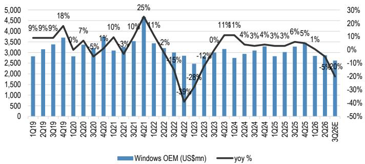
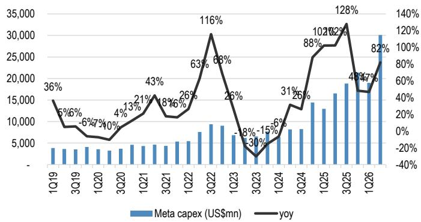

# JPM：研究主题与行业变化观察

两份财报放在一起看，结论比单看任何一家都清楚：全球两大超大规模云厂商在2026年剩余时间内的资本开支节奏没有出现放缓，反而在季度层面呈现明显抬升。JPM在6月26日微软与Meta财报发布后更新了PC与服务器行业观点，核心判断是——AI服务器供应链的收入动能将在未来几个季度延续，而传统服务器与组件环节也会获得额外支撑。

报告覆盖的亚洲硬件链条范围很具体：AI服务器代工、通用服务器、电源与液冷、网络设备。微软与Meta两家合计的现金资本开支在6月季度同比增长96%，环比增长32%。这个数字本身已经说明问题，但更值得注意的是一年维度上的指引变化。

## 1. 微软9月季度资本开支指引超过500亿美元，服务器采购节奏继续加快

微软6月季度现金资本开支约360亿美元，环比增长16%，同比增长110%，基本符合市场预期。其中约三分之二投向短期资产，主要是GPU和CPU。管理层给出的9月季度总资本开支指引超过500亿美元，同比增长超过43%，且部分融资租赁重新分类为经营租赁，这意味着现金口径的资本开支抬升幅度比账面数字更明显。

全年维度上，微软重申2026财年总资本开支约1900亿美元，剔除租赁重分类影响后约1750亿美元。管理层同时表示2027财年总资本开支将继续增长，但没有给出具体幅度。JPM认为，仅9月季度500亿美元以上的运行速率，已经隐含全年数字进一步上修的可能。

Azure收入增速在6月季度从上一季度的39%回升至43%，管理层给出的9月季度指引为同比增长45%，高于市场一致预期的41%。报告特别提到，尽管增长在加速，供应约束仍然存在。这对服务器供应链的含义是双重的：既意味着出货量有保障，也意味着组件环节的定价环境短期内不会松动。

> **KC评论：** 微软的资本开支节奏是亚洲服务器代工厂最直接的收入先行指标。9月季度500亿美元以上的指引，意味着AI服务器和通用服务器的采购都会在接下来两个季度集中释放，而不是市场此前担心的“前高后低”。

## 2. Meta将2026年资本开支指引收窄至区间上沿，下半年环比增长约七成

Meta的6月季度现金资本开支约300亿美元，环比增长59%，同比增长82%，略低于市场预期。但管理层将2026年全年资本开支指引从此前的1250-1450亿美元收窄至1300-1450亿美元，中点对应同比增长约90%。这个指引位置意味着下半年资本开支环比增长约70%，节奏明显加快。

报告还披露了Meta在产能策略上的一个细节：公司计划在2026至2027年最大化计算能力供给，以应对可预见期间的供应约束；但2028年之后的策略转向灵活和可转换，提前建设土地、电力、设施等长期资产，而短期资产（主要是计算设备）的决策则推迟。服务器设计上采用模块化方案，可以在AI负载和通用负载之间切换。

这个策略组合值得供应链参与者留意。长期资产先行意味着基础设施层面的投入不会停，但短期设备的采购节奏会根据需求信号动态调整。模块化设计则可能改变服务器ODM的订单结构——同一套硬件平台要能适配不同负载，对设计能力和供应链弹性提出了更高要求。

## 3. 通用服务器需求回升，PC出货量指引则指向环比下滑

报告对PC和通用服务器的判断出现了方向性分化。微软Windows OEM收入在6月季度同比下降5%，好于公司自身预期，原因是组件涨价前的持续补库存。但管理层给出的9月季度指引为同比下降20%出头的低段，2027财年为同比下降十几个百分点，理由是PC终端需求走弱、价格弹性为负、库存偏高，以及Windows 10替换需求消退。

JPM据此推算，3季度PC出货量环比可能下滑中高个位数百分比，这对其此前给出的NB ODM出货环比下降3%的预测构成节奏变化不确定性。报告还指出，台湾NB ODM出货同比下滑8%，而微软Windows OEM收入仅下滑5%，两者之间的缺口意味着份额继续从台湾ODM流向中国大陆同行。

通用服务器的情况则相反。JPM认为，传统服务器今年的支出强于预期，ASPEED和Lotes将从中受益。AI服务器方面，报告维持对Wiwynn的偏好，理由是通用服务器上行周期和即将到来的AWS Trainium 3周期。电源与液冷环节看好Delta、Jentech和AVC，网络设备方面Accton将受益于数据中心网络需求的持续增长和AI网络升级周期的加速。

> **KC评论：** 这份报告最容易被忽略的信息是Meta的模块化服务器策略。它不改变今年AI服务器的出货强度，但会影响2027年之后ODM的订单能见度——能同时承接AI和通用负载的厂商，在需求切换时会比单一产能的厂商更稳。

## 4. 供应约束持续存在，组件环节的定价环境短期不会松动

报告反复提到一个词：供应约束。微软在Azure增长加速的同时仍面临供给限制，Meta则明确表示可预见期间内供应紧张。JPM认为，持续的供应约束意味着AI服务器出货量仍有上行空间，组件厂商在中期内享有有利的定价和利润率环境。

这个判断的逻辑链条是：云厂商的收入增长（Azure加速、Meta广告与AI需求）支撑资本开支的可持续性，而资本开支的可持续性又反过来维持供应紧张的局面。只要需求端不出现断崖式变化，组件环节的议价能力就能维持。

报告也给出了一个观察框架：区分长期资产和短期资产的投入节奏。长期资产（土地、电力、设施）的投入是前置的、确定的，短期资产（计算设备）的投入则跟随需求信号调整。读者在跟踪云厂商资本开支时，如果只盯季度设备采购数字，可能会忽略长期资产投入对后续设备采购的预示作用。

For informational purposes only. Portions may be generated,translated,summarized,or edited with AI assistance based on source materials and may contain omissions or errors. Please verify independently. This is not investment,legal,tax,accounting,or other professional advice.

For informational purposes only. Portions may be generated,translated,summarized,or edited with AI assistance based on source materials and may contain omissions or errors. Please verify independently. This is not investment,legal,tax,accounting,or other professional advice.

