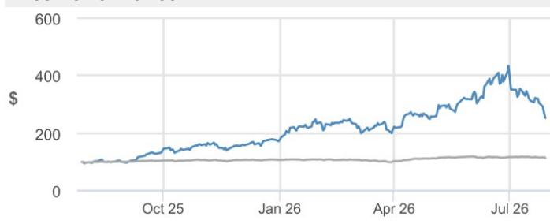
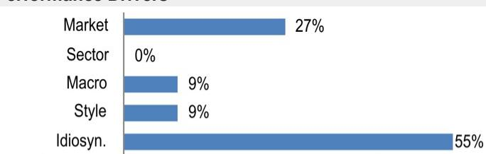
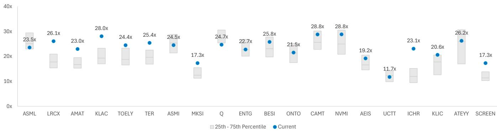

## Lam Research

**业绩超预期并上调指引：NAND需求加速，前沿逻辑与DRAM动能延续；2026年市场展望上调至1500亿美元以上，2027年展望强劲；长期毛利率目标上调至50%中段；维持增持评级**

Lam Research Corporation（LRCX）本季度再次交出超预期的成绩单，业绩表现优于市场一致预期，下一季度指引更是超出我们此前听到的买方预期上限。公司录得创纪录的营收、毛利率（约为20年来最高水平）、营业利润率及每股收益，并预计下一季度营收为81亿美元±4亿美元，意味着在创纪录基数上环比增长约20%。本季度增长动能主要来自NAND支出的显著加速、DRAM的持续强劲、前沿晶圆代工/逻辑芯片需求的改善，以及客户支持业务集团（CSBG）再创季度新高。除存储（NAND/DRAM）领域的强势外，LRCX还强调了在前沿晶圆代工/逻辑客户方面的进展，并指出正在与“美国一家新的逻辑客户”进行积极接洽。我们认为这为公司创造了又一个潜在的市场份额增长机会，增强了其在未来几年超越整体市场增长的能力。展望未来，LRCX预计下一季度营收中值为81亿美元，毛利率约52%，营业利润率约39.5%，非GAAP每股收益2.15美元——均高于市场及买方在此次业绩发布前的预期。LRCX还更新了其多年期盈利能力框架，表示未来几年目标为毛利率50%中段、营业利润率40%中段。在我们看来，这标志着市场预期的结构性积极转变，因为LRCX实际上正从证明约50%的毛利率可持续，转向建立通往50%中段毛利率的明确路径。与本周早些时候的资本设备同行类似，LRCX也将2026年市场展望从先前约1400亿美元上调至1500亿美元低段区间。这一上调反映了AI驱动下存储、晶圆代工/逻辑及先进封装领域的投资增强，以及客户找到更多洁净室产能并解决了此前产能扩张的瓶颈问题。虽然管理层未提供2027年的具体市场预测数字，但将前景描述为“非凡”，当前客户沟通显示出2027年及以后前所未有的长期需求可见度。从自下而上的角度看，LRCX预计2027年市场增长将由DRAM引领，其次是晶圆代工/逻辑，再次是NAND。管理层对其在沉积和刻蚀领域的技术领先地位、可服务市场（SAM）的持续扩大（正趋向占市场总额的30%以上）以及强大的客户合作关系保持信心，认为公司有能力继续超越整体市场增长。基于本次业绩、强劲的下一季度指引以及改善的多年期盈利能力框架，我们上调了2026年预测，并确立2027年12月的新目标价340美元（此前2026年12月目标价为315美元），该目标价基于LRCX约30倍于2027年下半年年化每股收益11.35美元的估值，与可比的大型半导体资本设备同行基本一致。

## 增持评级

LRCX，LRCX US
价格（2026年7月29日）：252.35美元

▲目标价（2027年12月）：340.00美元
此前（2026年12月）：315.00美元

半导体及半导体资本设备 / IT硬件

Harlan Sur AC
(1-415) 315-6700
harlan.sur@JPM.com

Apoorva Kumar
(1-212) 270-0668
apoorva.kumar@JPM.com

Mayur Ramdhani
(1-212) 622-1664
mayur.ramdhani@JPM.com
JPM Securities LLC

季度预测（财年截至6月）
调整后每股收益（美元）

<table><tr><td colspan="4">调整后每股收益（4）</td></tr><tr><td></td><td>2026A</td><td>2027E</td><td>2028E</td></tr><tr><td>Q1</td><td>1.26</td><td>2.15</td><td></td></tr><tr><td>Q2</td><td>1.27</td><td>2.21</td><td></td></tr><tr><td>Q3</td><td>1.47</td><td>2.42</td><td></td></tr><tr><td>Q4</td><td>1.78</td><td>2.62</td><td></td></tr><tr><td>全年</td><td>5.82</td><td>9.40</td><td></td></tr></table>

## 风格暴露

<table><tr><td rowspan="2">量化因子</td><td rowspan="2">当前%排名</td><td colspan="4">历史%排名（1=最高）</td></tr><tr><td>6个月</td><td>1年</td><td>3年</td><td>5年</td></tr><tr><td>价值</td><td>86</td><td>84</td><td>65</td><td>61</td><td>57</td></tr><tr><td>成长</td><td>54</td><td>65</td><td>75</td><td>61</td><td>76</td></tr><tr><td>动量</td><td>16</td><td>5</td><td>30</td><td>40</td><td>20</td></tr><tr><td>质量</td><td>7</td><td>4</td><td>6</td><td>6</td><td>5</td></tr><tr><td>低波动</td><td>46</td><td>45</td><td>45</td><td>44</td><td>59</td></tr></table>

价格表现

— LRCX价格（美元） — 标普500指数（重新基准）

<table><tr><td></td><td>年初至今</td><td>1个月</td><td>3个月</td><td>12个月</td></tr><tr><td>相对</td><td>47.4%</td><td>-38.6%</td><td>1.4%</td><td>155.0%</td></tr><tr><td>相对</td><td>40.5%</td><td>-36.9%</td><td>-1.1%</td><td>140.2%</td></tr></table>

公司数据

<table><tr><td>流通股数（百万）</td><td>1,269</td></tr><tr><td>52周区间（美元）</td><td>438.50-90.93</td></tr><tr><td>市值（百万美元）</td><td>320,311.10</td></tr><tr><td>汇率</td><td>1.00</td></tr><tr><td>自由流通比例（%）</td><td>99.7%</td></tr><tr><td>3个月日均成交量（百万股）</td><td>11.39</td></tr><tr><td>3个月日均成交额（百万美元）</td><td>3,781.7</td></tr><tr><td>波动率（90日）</td><td>76</td></tr><tr><td>指数</td><td>标普500</td></tr><tr><td>彭博分析师评级（买入|持有|卖出）</td><td>31|6|0</td></tr></table>

关键指标（财年截至6月）

<table><tr><td>百万美元</td><td>FY26A</td><td>FY27E</td></tr><tr><td>财务预测</td><td></td><td></td></tr><tr><td>营收</td><td>23,233</td><td>34,634</td></tr><tr><td>调整后EBIT</td><td>8,237</td><td>13,984</td></tr><tr><td>调整后EBITDA</td><td>8,237</td><td>13,984</td></tr><tr><td>调整后净利润</td><td>7,340</td><td>11,796</td></tr><tr><td>调整后每股收益</td><td>5.82</td><td>9.40</td></tr><tr><td>彭博每股收益</td><td>5.69</td><td>8.20</td></tr><tr><td>经营活动现金流</td><td>5,858</td><td>8,604</td></tr><tr><td>自由现金流（对股东）</td><td>4,891</td><td>7,045</td></tr><tr><td>利润率与增长</td><td></td><td></td></tr><tr><td>营收同比增长（%）</td><td>26.0%</td><td>49.1%</td></tr><tr><td>EBIT利润率</td><td>35.5%</td><td>40.4%</td></tr><tr><td>EBIT同比增长（%）</td><td>38.3%</td><td>69.8%</td></tr><tr><td>EBITDA利润率</td><td>35.5%</td><td>40.4%</td></tr><tr><td>EBITDA同比增长（%）</td><td>39.1%</td><td>69.8%</td></tr><tr><td>净利润率</td><td>31.6%</td><td>34.1%</td></tr><tr><td>调整后每股收益增长</td><td>40.8%</td><td>61.5%</td></tr><tr><td>比率</td><td></td><td></td></tr><tr><td>调整后税率</td><td>11.9%</td><td>15.2%</td></tr><tr><td>利息覆盖倍数</td><td>-</td><td>-</td></tr><tr><td>净债务/权益</td><td>NM</td><td>NM</td></tr><tr><td>净债务/EBITDA</td><td>NM</td><td>NM</td></tr><tr><td>净资产回报表现</td><td>66.0%</td><td>71.8%</td></tr><tr><td>估值</td><td></td><td></td></tr><tr><td>自由现金流回报表现</td><td>1.5%</td><td>2.2%</td></tr><tr><td>股息回报表现</td><td>0.1%</td><td>0.1%</td></tr><tr><td>企业价值/营收</td><td>13.7</td><td>9.1</td></tr><tr><td>企业价值/EBITDA</td><td>38.7</td><td>22.6</td></tr><tr><td>调整后市盈率</td><td>43.4</td><td>26.8</td></tr></table>

## 投资论点与估值摘要

## 投资论点

技术转型（5nm/3nm/2nm）驱动的资本支出环境：晶圆代工/逻辑、sub-20nm DRAM和3D NAND。

等离子体刻蚀、薄膜沉积（金属和介电）平台、光刻胶剥离系统以及单片晶圆湿法/等离子体清洗产品的市场领导者。

服务/装机基础业务持续在周期中表现优异。

终端市场的扩展、刻蚀/沉积/清洗领域的市场份额增长、技术领先地位以及规模效应，应能使Lam Research超越整体市场增长，并在未来两到三年内实现18-20%的每股收益年复合增长率。

## 估值

我们的2027年12月目标价假设LRCX以约30倍于其2027年下半年年化盈利能力11.35美元交易，与可比的大型半导体资本设备同行一致。

表现驱动因素

<table><tr><td>因子</td><td>6个月相关性</td><td>1年相关性</td></tr><tr><td>市场：MSCI美国</td><td>0.52</td><td>0.53</td></tr><tr><td>板块：科技</td><td>-0.09</td><td>0.02</td></tr><tr><td>行业：半导体及设备</td><td>0.37</td><td>0.36</td></tr><tr><td>宏观：</td><td></td><td></td></tr><tr><td>原油</td><td>-0.43</td><td>-0.26</td></tr><tr><td>美国10年期盈亏平衡通胀率</td><td>-0.20</td><td>-0.20</td></tr><tr><td>经济惊喜指数</td><td>-0.15</td><td>-0.19</td></tr><tr><td>量化风格：</td><td></td><td></td></tr><tr><td>动量</td><td>0.45</td><td>0.36</td></tr><tr><td>规模</td><td>0.26</td><td>0.23</td></tr><tr><td>低波动</td><td>-0.13</td><td>-0.20</td></tr></table>

\- 6月季度业绩高于市场预期，主要受NAND支出显著加速、DRAM持续强劲以及前沿晶圆代工/逻辑需求驱动... LRCX报告6月季度营收强劲，达67.2亿美元（环比+15%，同比+30%），高于此前指引中值及市场预期约66亿美元，与买方预期基本一致。这是连续第四个季度创下营收纪录，系统销售组合日益向存储倾斜（本季度约占系统营收的46%，上季度约39%）。增长主要来自NAND，环比增长超过一倍，因客户加速向256层以上器件转换以满足企业级SSD/AI存储需求。DRAM也保持强劲，约占系统营收的23%（较上季度创纪录的约27%略有回落）。其余约54%的系统销售来自晶圆代工（本季度约44%，上季度约54%）和逻辑（本季度约10%，上季度约7%）。管理层指出，在前沿晶圆代工/逻辑客户方面（特别是在2/3nm节点及先进封装）正取得进展，并正在与“美国一家新的逻辑客户”积极接洽。除系统业务外，LRCX的客户支持业务集团（CSBG）也表现强劲，连续第三个季度创下营收纪录，达24.7亿美元（环比+17%，同比+43%），得益于创纪录的升级业务（NAND）、Reliant产品线的增长以及备件需求的持续强劲。

\- 9月季度营收指引显著高于市场/买方预期，意味着增长大幅提速和持续的经营杠杆... 以中值计算，LRCX预计9月季度营收为81亿美元，意味着环比增长超过20%，毛利率约52%，营业利润率约39.5%，非GAAP每股收益2.15美元——均高于市场/买方在此次业绩发布前的预期。虽然下季度运营费用预计将上升，但LRCX指出支出增速应远低于营收增速，从而在未来继续创造经营杠杆。更重要的是，LRCX更新了多年期盈利能力框架，公司现目标为未来几年毛利率50%中段、营业利润率40%中段，两者都将由公司的规模、新产品推出、基于价值的定价以及进一步的运营效率所支撑。我们认为这是一个有意义的调整，因为LRCX已经在其2025年读者日设定的盈利目标之上运营。

\- 2026年市场展望上调至1500亿美元低段，2027年市场前景被描述为“非凡”... 与同行类似，LRCX将2026年市场展望从先前约1400亿美元上调至1500亿美元低段区间，并澄清此前的上行倾向现已有效纳入新预测。这一上调反映了AI驱动下存储、晶圆代工/逻辑及先进封装领域的投资增强，以及客户找到更多洁净室产能并解决了此前产能扩张的瓶颈问题。虽然管理层未提供2027年的具体市场预测数字，但将前景描述为“非凡”，因为当前客户沟通显示出前所未有的长期需求可见度。从自下而上的角度看，管理层表示预计2027年市场增长将由DRAM引领，其次是晶圆代工/逻辑，再次是NAND，并相信LRCX将继续超越整体市场增长，这得益于其技术领先地位（在沉积和刻蚀领域）以及强大的客户合作关系。

\- 基于新的2027年下半年年化每股收益11.35美元，目标价上调至340美元... 基于本次业绩，我们上调了2026年预测以反映管理层更强的下一季度指引和评论，并确立新的2027年12月目标价340美元。我们的新目标价假设LRCX以约30倍（同行倍数）于其2027年下半年年化盈利能力11.35美元交易，与可比的大型半导体资本设备同行一致。

图1：LRCX季度业绩及下一季度指引

<table><tr><td></td><td>F4Q26实际</td><td>JPM预测</td><td>差异</td><td>F4Q26一致预期</td><td>F1Q27指引</td><td>F1Q27一致预期</td></tr><tr><td>营收（百万美元）</td><td>$6,722.2</td><td>$6,600.0</td><td>$122.2</td><td>$6,682</td><td>$8,100 ± $400m</td><td>$7,130</td></tr><tr><td>环比变化</td><td>15.1%</td><td>13.0%</td><td>2.1%</td><td>14.4%</td><td>-</td><td>6.7%</td></tr><tr><td>毛利率（备考）</td><td>52.0%</td><td>50.5%</td><td>1.5%</td><td>50.5%</td><td>52.0% ± 1%</td><td>50.6%</td></tr><tr><td>营业利润率（备考）</td><td>38.4%</td><td>36.5%</td><td>1.9%</td><td>36.8%</td><td>39.5% ± 1%</td><td>37.1%</td></tr><tr><td>净利润（备考）</td><td>$2,280.0</td><td>$2,073.0</td><td>$207.0</td><td>-</td><td>-</td><td>-</td></tr><tr><td>备考每股收益</td><td>$1.82</td><td>$1.65</td><td>$0.16</td><td>$1.70</td><td>$2.15 ± $0.15</td><td>$1.84</td></tr></table>

来源：公司报告、JPM预测、彭博金融

图2：LRCX季度营收按业务板块划分（占总营收百分比）

<table><tr><td></td><td>F1Q26</td><td>F2Q26</td><td>F3Q26</td><td>F4Q26</td></tr><tr><td>DRAM</td><td>16%</td><td>23%</td><td>27%</td><td>23%</td></tr><tr><td>NAND</td><td>18%</td><td>11%</td><td>12%</td><td>23%</td></tr><tr><td>晶圆代工</td><td>60%</td><td>59%</td><td>54%</td><td>44%</td></tr><tr><td>逻辑及其他</td><td>6%</td><td>7%</td><td>7%</td><td>10%</td></tr></table>

注：逻辑包括CMOS图像传感器及其他。系统包括升级业务及Reliant产品线营收
来源：公司报告、JPM预测、彭博金融

## 资产负债表与现金流

LRCX在F4Q26末持有现金及短期/长期有价投资55.8亿美元（上季度为47.5亿美元），经营活动现金流为14.6亿美元（上季度为11.4亿美元）。

## 附录一：估值与可比公司

图3：半导体资本设备可比公司表

<table><tr><td rowspan="2">公司</td><td rowspan="2">代码</td><td rowspan="2">JPM评级</td><td rowspan="2">价格 2026/7/29</td><td rowspan="2">市值（百万美元）</td><td rowspan="2">企业价值（百万美元）</td><td colspan="4">非GAAP每股收益（美元）</td><td rowspan="2">2025-28年复合增长率</td><td colspan="4">市盈率</td><td colspan="4">营收（百万美元）</td><td rowspan="2">2025-28年复合增长率</td><td colspan="4">市销率</td></tr><tr><td>2025</td><td>2026</td><td>2027</td><td>2028</td><td>2025</td><td>2026</td><td>2027</td><td>2028</td><td>2025</td><td>2026</td><td>2027</td><td>2028</td><td>2025</td><td>2026</td><td>2027</td><td>2028</td></tr><tr><td>半导体资本设备：</td><td></td><td></td><td></td><td></td><td></td><td></td><td></td><td></td><td></td><td></td><td></td><td></td><td></td><td></td><td></td><td></td><td></td><td></td><td></td><td></td><td></td><td></td><td></td></tr><tr><td>应用材料</td><td>AMAT</td><td>增持</td><td>$436.45</td><td>346,524</td><td>345,551</td><td>9.42</td><td>13.81</td><td>18.82</td><td>23.88</td><td>36%</td><td>46.3x</td><td>31.6x</td><td>23.2x</td><td>18.3x</td><td>28,214</td><td>36,409</td><td>46,030</td><td>55,200</td><td>25%</td><td>12.3x</td><td>9.5x</td><td>7.5x</td><td>6.3x</td></tr><tr><td>Lam Research</td><td>LRCX</td><td>增持</td><td>$252.35</td><td>315,582</td><td>314,565</td><td>4.90</td><td>7.00</td><td>9.52</td><td>11.89</td><td>34%</td><td>51.5x</td><td>36.0x</td><td>26.5x</td><td>21.2x</td><td>20,561</td><td>27,316</td><td>34,967</td><td>41,168</td><td>26%</td><td>15.3x</td><td>11.6x</td><td>9.0x</td><td>7.7x</td></tr><tr><td>科磊</td><td>KLAC</td><td>增持</td><td>$170.19</td><td>222,315</td><td>223,300</td><td>3.63</td><td>4.38</td><td>6.00</td><td>7.57</td><td>28%</td><td>46.9x</td><td>38.9x</td><td>28.3x</td><td>22.5x</td><td>12,745</td><td>15,562</td><td>20,004</td><td>23,440</td><td>23%</td><td>17.4x</td><td>14.3x</td><td>11.1x</td><td>9.5x</td></tr><tr><td>MKS仪器</td><td>MKSI</td><td>增持</td><td>$257.61</td><td>17,400</td><td>21,189</td><td>7.88</td><td>11.81</td><td>15.45</td><td>17.27</td><td>30%</td><td>32.7x</td><td>21.8x</td><td>16.7x</td><td>14.9x</td><td>3,930</td><td>4,802</td><td>5,558</td><td>6,055</td><td>15%</td><td>4.4x</td><td>3.6x</td><td>3.1x</td><td>2.9x</td></tr><tr><td>Entegris</td><td>ENTG</td><td></td><td>$107.01</td><td>16,319</td><td>19,634</td><td>2.75</td><td>3.64</td><td>4.77</td><td>5.99</td><td>30%</td><td>38.9x</td><td>29.4x</td><td>22.4x</td><td>17.9x</td><td>3,197</td><td>3,465</td><td>3,920</td><td>4,359</td><td>11%</td><td>5.1x</td><td>4.7x</td><td>4.2x</td><td>3.7x</td></tr><tr><td>ONTO创新</td><td>ONTO</td><td></td><td>$218.31</td><td>10,860</td><td>10,237</td><td>4.94</td><td>7.22</td><td>9.94</td><td>12.31</td><td>36%</td><td>44.2x</td><td>30.2x</td><td>22.0x</td><td>17.7x</td><td>1,005</td><td>1,349</td><td>1,649</td><td>1,981</td><td>25%</td><td>10.8x</td><td>8.1x</td><td>6.6x</td><td>5.5x</td></tr><tr><td>先进能源工业</td><td>AEIS</td><td></td><td>$252.49</td><td>9,602</td><td>9,586</td><td>6.41</td><td>9.46</td><td>12.21</td><td>15.86</td><td>35%</td><td>39.4x</td><td>26.7x</td><td>20.7x</td><td>15.9x</td><td>1,799</td><td>2,242</td><td>2,665</td><td>3,122</td><td>20%</td><td>5.3x</td><td>4.3x</td><td>3.6x</td><td>3.1x</td></tr><tr><td>Ultra Clean Holdings</td><td>UCTT</td><td></td><td>$69.57</td><td>3,119</td><td>3,650</td><td>1.05</td><td>2.57</td><td>5.29</td><td>12.53</td><td>129%</td><td>66.3x</td><td>27.1x</td><td>13.2x</td><td>5.6x</td><td>2,054</td><td>2,538</td><td>3,447</td><td>5,502</td><td>39%</td><td>1.5x</td><td>1.2x</td><td>0.9x</td><td>0.6x</td></tr><tr><td>组平均</td><td></td><td></td><td></td><td></td><td></td><td></td><td></td><td></td><td></td><td>45%</td><td>45.8x</td><td>30.2x</td><td>21.6x</td><td>16.7x</td><td></td><td></td><td></td><td></td><td>23%</td><td>9.0x</td><td>7.2x</td><td>5.8x</td><td>4.9x</td></tr><tr><td>组中位数</td><td></td><td></td><td></td><td></td><td></td><td></td><td></td><td></td><td></td><td>35%</td><td>45.3x</td><td>29.8x</td><td>22.2x</td><td>17.8x</td><td></td><td></td><td></td><td></td><td>24%</td><td>8.1x</td><td>6.4x</td><td>5.4x</td><td>4.6x</td></tr><tr><td>大盘平均</td><td></td><td></td><td></td><td></td><td></td><td></td><td></td><td></td><td></td><td>33%</td><td>48.2x</td><td>35.5x</td><td>26.0x</td><td>20.7x</td><td></td><td></td><td></td><td></td><td>25%</td><td>15.0x</td><td>11.8x</td><td>9.2x</td><td>7.8x</td></tr><tr><td>大盘中位数</td><td></td><td></td><td></td><td></td><td></td><td></td><td></td><td></td><td></td><td>34%</td><td>46.9x</td><td>36.0x</td><td>26.5x</td><td>21.2x</td><td></td><td></td><td></td><td></td><td>25%</td><td>15.3x</td><td>11.6x</td><td>9.0x</td><td>7.7x</td></tr><tr><td>中小盘平均</td><td></td><td></td><td></td><td></td><td></td><td></td><td></td><td></td><td></td><td>52%</td><td>44.3x</td><td>27.0x</td><td>19.0x</td><td>14.4x</td><td></td><td></td><td></td><td></td><td>22%</td><td>5.4x</td><td>4.4x</td><td>3.7x</td><td>3.1x</td></tr><tr><td>中小盘中位数</td><td></td><td></td><td></td><td></td><td></td><td></td><td></td><td></td><td></td><td>35%</td><td>39.4x</td><td>27.1x</td><td>20.7x</td><td>15.9x</td><td></td><td></td><td></td><td></td><td>20%</td><td>5.1x</td><td>4.3x</td><td>3.6x</td><td>3.1x</td></tr></table>

注：基于日历化一致预期
来源：公司文件、彭博金融、JPM预测

图4：全球半导体资本设备估值区间（基于未来24个月市盈率）

注：上表倍数基于未来24个月（N24M）的汇总一致预期每股收益——因此，上表倍数可能与可比公司表中的日历化预测不完全对应；截至2026年7月29日收盘
来源：彭博金融

## 附录二：财务表格

图5：LRCX备考利润表

<table><tr><td>（百万美元）：财年截至6月30日</td><td>F1Q24A</td><td>F2Q24A</td><td>F3Q24A</td><td>F4Q24A</td><td>FY24A</td><td>F1Q25A</td><td>F2Q25A</td><td>F3Q25A</td><td>F4Q25A</td><td>FY25A</td><td>F1Q26A</td><td>F2Q26A</td><td>F3Q26A</td><td>F4Q26</td><td>FY26E</td><td>F1Q27E</td><td>F2Q27E</td><td>F3Q27E</td><td>F4Q27E</td><td>FY27E</td><td>F1Q28E</td><td>F2Q28E</td></tr><tr><td>营收</td><td>$3,482.1</td><td>$3,758.3</td><td>$3,793.6</td><td>$3,871.5</td><td>$14,905.4</td><td>$4,168.0</td><td>$4,376.0</td><td>$4,720.2</td><td>$5,171.4</td><td>$18,435.6</td><td>$5,324.2</td><td>$5,344.8</td><td>$5,841.5</td><td>$6,722.2</td><td>$23,232.7</td><td>$8,100.0</td><td>$8,250.0</td><td>$8,842.5</td><td>$9,441.3</td><td
