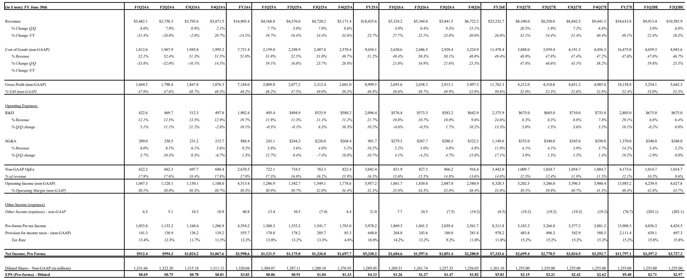
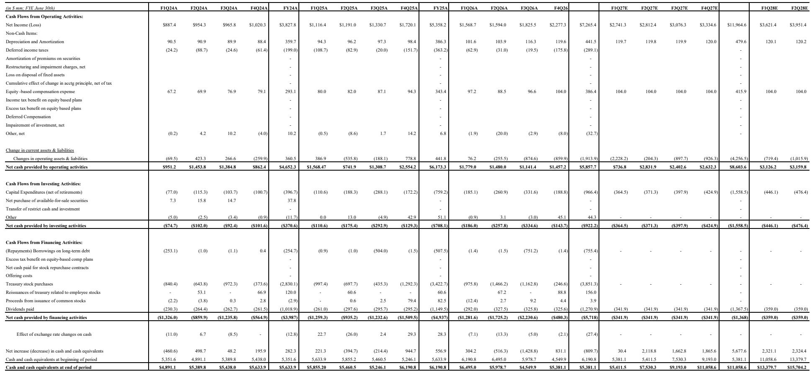
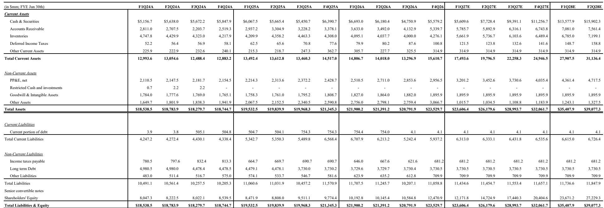

# 从Lam Research最新季报看半导体设备行业的结构性变化

Lam Research刚刚交出了连续第四个季度创纪录的营收表现，下一季度指引为81亿美元，较当前纪录水平环比增长约20%。但比 headline 数字更值得关注的是：管理层将2026年晶圆厂设备（WFE）市场展望从约1400亿美元上调至1500亿美元区间，并将2027年的市场环境描述为“非同寻常”。这不仅仅是又一次“超预期并上调指引”的季度。公司正在传递一个信号：AI驱动的资本开支周期已经从根本上改变了半导体设备的需求特征，使这个历史上呈现明显周期波动的行业，正在向更接近长期成长的故事转变。

市场对这份财报的反应，以及随后分析师的行动，都反映了这一转变。基于2027年11.35美元的年度化盈利预期，当前估值水平与大型半导体设备同行相当，但背后的盈利轨迹更值得深入研究。Lam Research预计2027财年调整后每股收益增长61.5%，而2026财年增幅为40.8%。一家以这样的速度增长、同时将毛利率推向50%中段的公司，其行为方式已不像一个周期性的设备供应商，而更像一个多年AI基础设施建设的结构性受益者。

对于读者而言，战略问题已不再是Lam Research能否执行——这一点已被反复证明。问题在于，公司扩大的可服务市场、盈利能力的重置，以及AI驱动的存储和逻辑芯片支出的持续性，是否足以支撑超越当前周期的重新定价。本季度的证据表明答案是肯定的，但路径比简单外推当前增长率要复杂得多。

## 存储结构变化预示新需求格局，工艺技术领先的设备商将受益

本季度最引人注目的数据点是系统收入的构成。NAND支出环比增长超过一倍，占系统收入的比例从12%跃升至23%，而DRAM保持强劲，占比为23%。两者合计，存储占系统销售的比例从上一季度的39%上升至46%。这不是对过去存储驱动周期的回归——过去商品价格决定资本开支——而是一个AI驱动的需求格局：超大规模计算厂商正在部署资本建设存储和计算基础设施，不再受传统存储价格信号的支配。

NAND的加速尤为明显。客户正在向256层以上设备转换，以满足企业级SSD和AI存储需求。这不是替换周期，而是由AI训练和推理工作负载对存储容量的巨大需求驱动的产能扩张周期。向256层以上NAND迁移的技术复杂性直接有利于Lam Research在沉积和刻蚀领域的优势。每增加一层就增加工艺步骤，每个工艺步骤需要更多的设备投入。公司可服务市场占WFE的比例正趋向30%以上高位，高于历史水平，因为先进存储和逻辑器件的工艺复杂性要求每片晶圆有更多的沉积和刻蚀步骤。

DRAM的持续强劲——尽管从创纪录的27%系统收入占比略有回落——反映了同样的动态。向20纳米以下DRAM节点的过渡需要每片晶圆更多的设备投入，而AI服务器对高带宽内存的需求正在加速这一过渡。报告指出DRAM的强劲是广泛的，预计2027年WFE增长将由DRAM引领。这对读者是一个关键洞察：传统的存储支出层级——NAND领先、DRAM跟随——已经反转。DRAM现在是增长引擎，因为AI工作负载需要巨大的内存带宽，而不仅仅是存储容量。

这意味着Lam Research的存储敞口不再是周期性负担，而是结构性优势。公司在等离子刻蚀和薄膜沉积方面的技术领先地位，使其能够在每一次节点转换中获取不成比例的价值，无论是NAND、DRAM还是前沿逻辑芯片。创纪录的客户支持业务集团（CSBG）收入24.7亿美元，同比增长43%，进一步印证了这一点。安装基础正在产生越来越多的服务和升级收入，因为客户比以往周期更密集地运行设备。这是一个高利润率、经常性的收入流，无论新系统采购的时机如何，都为商业模式提供了底部支撑。

## 盈利能力框架重置是建立可信度的时刻，支撑更高的盈利基线

Lam Research更新的多年盈利能力框架——目标为50%中段毛利率和40%中段营业利润率——可以说比营收超预期更具意义。公司此前在2025年读者日已概述了盈利目标，目前已在目标之上运营。新框架明确承认商业模式已结构性改善，而不仅仅是周期性受益。

6月季度报告的毛利率为52%，是约20年来的最高水平，公司指引9月季度保持类似水平。6月季度38.4%的营业利润率预计将在9月季度扩大至约39.5%。通往50%中段毛利率和40%中段营业利润率的路径由四个因素支撑：规模、新产品推出、基于价值的定价和运营效率。每一个都值得审视，因为它们决定了利润率扩张是可持续的还是仅仅是当前产能利用率的函数。

规模是最直接的驱动因素。随着收入增长——公司预计2027财年收入为346亿美元，较2026财年增长49%——固定成本分摊到更大的基数上。但这不仅仅是运营杠杆。公司正在推出能够获得溢价定价的新产品，因为它们使客户能够实现以前不可能实现的工艺结果。向256层以上NAND和20纳米以下DRAM的过渡需要几年前不存在的沉积和刻蚀能力。Lam Research的研发投入正在转化为差异化的产品，证明更高价格的合理性。

基于价值的定价是一个微妙但重要的转变。历史上，设备供应商基于成本加成或竞争基准定价。新框架表明Lam Research正在基于其设备为客户创造的价值定价——具体来说，是其沉积和刻蚀工具带来的良率提升和性能改进。这是一个更可持续的定价模式，因为它将设备定价与客户成果挂钩，而非投入成本。运营效率是最后一个组成部分，反映了公司在制造自动化和供应链优化方面的投入。

对读者而言，关键在于盈利能力的基线已经上移。2027财年每股收益预期为9.40美元，而2028财年预期为11.89美元。这些数字之间的差距反映了对利润率扩张持续全年和收入动能持续的预期。如果Lam Research到2027年实现50%中段毛利率，盈利能力将显著高于当前一致预期。这是看多论点的核心：利润率扩张尚未完全反映在当前预期中，新框架为这一结果提供了可信的路径。

## WFE展望上调验证AI资本开支超级周期论点，但2027年增长驱动因素比初始AI浪潮更为复杂

2026年WFE展望从1400亿美元上调至1500亿美元区间，与其他大型设备商本财报季的沟通一致。上调反映了AI驱动的投资在存储、代工/逻辑和先进封装领域的增强，以及客户找到增量洁净室产能并解决此前产能增加的瓶颈。“解决此前瓶颈”这一表述意义重大，因为它表明支出不仅是需求的函数，也是供给侧约束得到缓解的结果。

更具深远意义的是关于2027年的评论。管理层没有提供具体的WFE预测，但将市场环境描述为“非同寻常”，并提到“到2027年及以后的长期需求可见性前所未有”。这一措辞经过精心选择。它表明客户对话不是关于近期订单，而是关于多年产能规划。自下而上的预期是2027年WFE增长将由DRAM引领，其次是代工/逻辑，然后是NAND。这一顺序对习惯于NAND引领存储周期的读者来说是反直觉的。

DRAM引领增长的预期反映了AI服务器对高带宽内存的需求以及向DDR5的过渡。代工/逻辑的增长反映了2纳米和3纳米节点的持续爬坡，以及先进封装作为重要设备类别的出现。NAND的增长虽然仍为正面，但预计更为温和，因为256层以上的过渡已经在进行中，增量设备强度可能低于初始转换。

报告提到Lam Research正在积极接触“美国的一家新逻辑客户”。这是一个潜在的份额获取机会，可能延长公司相对于WFE增长的优异表现。半导体供应链正在经历地理重构，美国、欧洲和日本都在寻求将领先制造迁回本土。每个新晶圆厂都代表着Lam Research扩大安装基础并在未来数十年获取服务和升级收入的机会。

战略含义是WFE周期不再由单一终端市场或地区驱动。AI计算建设跨越存储、逻辑、代工和先进封装，并且正在多个地区同时发生。这种多元化使周期更具持久性，但也使预测更加复杂。试图基于历史模式来把握周期时机的读者很可能会出错，因为潜在的需求驱动因素已从根本上改变。

## 半导体设备周期定位的决策框架：区分周期性复苏与结构性扩张

Lam Research的业绩为读者导航半导体设备行业提供了一个框架。第一个区分是周期性复苏与结构性扩张。周期性复苏的特征是产能利用率回归历史常态，支出是此前期间递延的。结构性扩张的特征是存在此前周期中不存在的新需求驱动因素，支出是增量的而非递延的。当前环境显然是后者，由AI基础设施建设驱动，在存储、逻辑和先进封装领域创造新的产能需求。

第二个区分是每片晶圆的设备含量与晶圆开工量。传统的半导体设备投资论点基于晶圆开工量增长——更多的晶圆意味着更多的设备。当前的论点越来越多地基于每片晶圆的设备含量，这一含量正在上升，因为先进节点需要更多的沉积和刻蚀步骤。Lam Research可服务市场占WFE比例向30%以上高位扩张反映了这一动态。读者应关注那些在每片晶圆含量上获得增长的公司，而非那些仅仅杠杆于晶圆开工量的公司。

第三个区分是技术领先与市场份额。半导体设备行业历史上以三四家主要厂商之间稳定的市场份额为特征。当前环境正在创造份额变动的机会，因为先进节点和存储器件的工艺复杂性要求并非所有供应商都具备的能力。Lam Research与美国新逻辑客户的接触是一个潜在的份额获取机会，这在更稳定的技术环境中不会存在。

第四个区分是运营杠杆与结构性利润率改善。运营杠杆是收入增长超过固定成本增长的函数。结构性利润率改善是定价权、产品组合和运营效率的函数。当前环境两者兼有，但结构性改善更有价值，因为它跨越周期持续存在。Lam Research修订的盈利能力框架——以50%中段毛利率为目标——是结构性改善，而不仅仅是当前产能利用率的函数。

最后一个考虑是估值。半导体设备行业当前的交易倍数已嵌入显著的成长预期。问题在于盈利能力是否能证明倍数的合理性。如果Lam Research实现预期的2027财年每股收益9.40美元和2028财年11.89美元，当前价格相对于盈利能力存在显著折价。风险在于AI驱动的需求周期减速快于预期，或利润率扩张未达框架目标。机会在于周期比当前预期延伸得更远，利润率扩张超出预期。

读者的决策框架是关注那些在沉积和刻蚀领域具有已被验证的技术领先地位、可服务市场扩大、并有可信路径实现结构性利润率改善的公司。Lam Research的业绩验证了这一框架，但该框架适用于整个半导体设备行业。未来两到三年内表现优异的公司将是那些在每片晶圆含量上获得增长、扩展新客户关系并将规模转化为利润率扩张的公司。表现不佳的将是那些仅仅杠杆于周期而没有技术差异化来获取不成比例价值的公司。

## 盈利轨迹支撑更高估值倍数，但市场将要求持久性的证据

当前股价为252.35美元。目标价基于2027年下半年年化每股收益11.35美元的30倍，对于一家以60%速度增长盈利的公司来说，这是一个合理的倍数。市场在完全接受更高倍数之前，将要求增长的持久性证据。本季度的证据令人信服：创纪录的收入、创纪录的利润率、上调的WFE展望和修订的盈利能力框架。但市场此前曾被半导体设备公司伤害过——它们上调指引后几个季度又下调。

未来两到三个季度需要关注的关键证据是“非同寻常”的需求可见性转化为确定订单和收入的过程。9月季度81亿美元的指引提供了近期验证点。2027年WFE展望——当提供时——将是下一个考验。管理层已表示DRAM将引领2027年增长，其次是代工/逻辑，然后是NAND。这一路线图的执行将决定当前盈利能力假设是保守还是乐观。

资产负债表提供了缓冲。Lam Research在6月季度末持有55.8亿美元现金和有价投资，高于上一季度的47.5亿美元。本季度14.6亿美元的运营现金流支持持续的研发投入和潜在的资本回报。2026财年66%的净资产回报表现，预计2027财年升至71.8%，反映了商业模式中的资本效率。净现金头寸意味着公司不依赖债务市场为增长融资，这在利率上升环境中降低了财务风险。

与同行的估值比较具有参考意义。Lam Research的2027财年市盈率为26.5倍，而应用材料为23.2倍，KLA为28.3倍。行业平均为21.6倍。相对于行业平均的溢价反映了更强的盈利增长轨迹。相对于KLA的折价反映了市场对存储敞口周期性的认知。随着市场对AI驱动存储周期持久性的信心增强，这一折价应会收窄。

最后一个考虑是AI交易回调的风险。半导体行业一直是AI基础设施建设的主要受益者，AI相关股票的大幅回调无论基本面如何都会影响Lam Research。90天波动率76和12个月相对回报155%反映了该股的高贝塔特性。一个月回报-38.6%表明该股已经经历了显著回调，这可能已将预期重置到更合理的水平。

投资论点取决于AI驱动资本开支周期的持久性以及Lam Research从该周期中获取不成比例价值的能力。本季度的证据支持这两个组成部分。在沉积和刻蚀领域的技术领先、扩大的可服务市场、创纪录的CSBG收入和修订的盈利能力框架都指向一家在高水平执行的公司。市场最终将以更高的倍数回报这种执行，但时机取决于持续交付验证盈利能力假设的结果。

*仅供参考。部分内容可能基于源材料由AI辅助生成、翻译、总结或编辑，可能包含遗漏或错误。请独立核实。本文不构成投资、法律、税务、会计或其他专业建议。*

仅供参考。部分内容可能基于源材料由AI辅助生成、翻译、总结或编辑，可能包含遗漏或错误。请独立核实。本文不构成投资、法律、税务、会计或其他专业建议。

