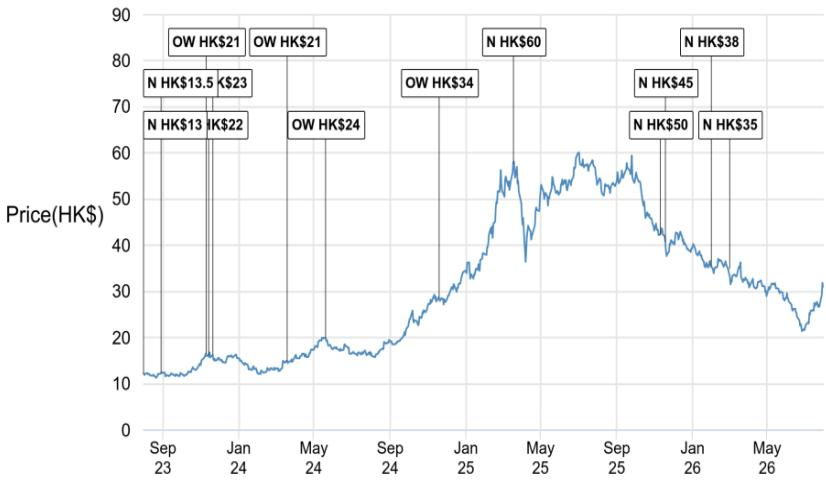

# 小米增程式布局姗姗来迟，55万目标已非关键问题

小米于7月30日发布了全新SkyNomad增程式电动车系列，最值得关注的细节不在车辆配置，而在于沉默。管理层未披露初期预订数据，这与近期SU7改款34分钟锁定1.5万订单、YU7两分钟收获12.2万订单的发布风格形成鲜明对比。对于一家惯以订单数据证明产品市场契合度的公司而言，数字的缺席比任何参数都更有说服力。

此次发布在战略层面逻辑自洽。新品牌下两款增程式SUV——七座N90 Max约30万元、五座N70 Max约26万元——定价略低于YU7 Max和Pro的约33万元和28万元。卖点在于可扩展的内部空间。但交付时间表才是问题所在。管理层确认新EREV将于9月才开始交付，这意味着实质性的交付量最早要到第四季度才能体现。

这一时间安排与数学问题相冲突。小米2026年上半年交付约18.5万辆电动车，要完成全年55万辆目标，下半年需交付36.5万辆，即月均交付超过6万辆——高于公司2025年12月创下的约5万辆月度纪录。新EREV产品线要到最后一个季度才能贡献交付量，且初期客户兴趣尚未验证。结论并非小米将无法达标，而是该目标本身已不再具有可信的约束力。

## 新产品发布在产品层面成功，但来得太晚，无法挽救2026年交付目标

SkyNomad品牌发布并非失误。这是小米电动车战略的合理延伸，瞄准以家庭为导向的细分市场，该市场购买决策的核心是内部空间而非加速性能或自动驾驶。定价纪律值得注意：N90 Max和N70 Max比YU7系列低约10%，为后续标准版留出价格空间。这是一家清楚自身在汽车市场品牌价值仍在建设中的公司，并据此定价。

但产品逻辑在交付日历面前难以成立。小米2026年上半年交付约18.5万辆。要实现全年55万辆，下半年月均交付需超过6万辆——这一速度从未实现过。此前约5万辆的月度纪录是在2025年12月创下的，当时生产线满负荷运转且积压需求集中释放。连续六个月维持高出20%的产能，不是爬坡，而是制造和供应链执行层面的跨越式提升。

新EREV产品线9月才开始交付，第四季度才是首个完整交付季度。即使市场反响出色——堪比YU7的12.2万锁定订单——也不太可能在11月或12月前转化为实质性交付。此次发布对2027年战略意义明确，但对2026年目标而言，在运营层面已无关紧要。

更重要的信号是预订数据的缺失。小米多次将早期订单数据作为营销武器。SU7改款34分钟1.5万订单和YU7两分钟12.2万订单并非无意披露，而是刻意的传播策略。对SkyNomad系列选择不公布可比数据，要么说明数字不够亮眼，要么说明管理层希望避免引起对初期反响平淡的关注。无论哪种解读，都偏负面。

## 下半年交付缺口并非预测误差，而是结构性产能天花板

55万辆目标与上半年运行速度之间的差距，常被定义为需求问题。这种框架并不完整。小米2026年上半年电动车交付约18.5万辆，月均约3.1万辆。5万辆的月度纪录仅在2025年12月实现过一次。下半年月均超6万辆的要求不是需求挑战，而是生产和物流挑战。

考虑从月均3.1万辆提升至6万辆以上需要什么。工厂产能必须扩张或重新配置。供应商合同需按更高产量重新谈判。物流网络需消化弹性较高的发运量。电池供应尤其是中国电动车行业公认的瓶颈。这些约束都不是成功发布产品能解决的，而是需要多个季度的运营执行。

新EREV产品线使问题更加复杂。增程式车辆需要不同的动力总成架构——较小电池搭配增程器——这意味着与纯电YU7和SU7不同的供应链需求。SkyNomad系列并非现有生产的简单叠加，它引入新供应商、新装配流程和新质量控制体系。新车型的学习曲线通常会在投产最初两到三个月抑制产量。

可能的结果是下调2026财年电动车交付目标。这不是传统意义上的执行失败，而是在本已激进的排产计划中推出新品牌新产品线的自然结果。目标本就激进，新EREV的发布使其明显难以实现。

## 7月股价跑赢是空头回补行情，而非基本面重估

小米7月跑赢HSTECH指数36个百分点。对于成熟的大型科技股而言，这是非同寻常的走势，值得审视。报告将跑赢归因于AI和半导体板块情绪疲弱背景下的空头回补，小米在中国科技股中被视为AI的对冲标的，加上对新SUV发布的预期。

空头回补论点之所以重要，在于它解释了价格走势与基本面之间的脱节。当读者看空AI和半导体标的时，会转向同一指数中被视为防御性的仓位。小米凭借消费电子基本盘和电动车增长故事，恰好扮演这一角色。7月的上涨因此是其他股票动态的函数，而非小米自身发生了什么。

预期效应同样是暂时的。发布活动已经结束，预订数据未披露，交付时间已确认为9月。推动7月上涨的催化剂已经耗尽，股价已脱离10-15倍市盈率、即每股24-27港元的低谷估值区间。在目前31.04港元的价位，市场已计入成功发布的预期。若SkyNomad系列表现不及预期，风险呈不对称下行。

未来缺乏明确催化剂是结构性问题。消费电子需求平淡，内存价格持续挤压利润率，电动车交付目标面临风险。这些因素单独来看都值得警惕，合在一起则不支持继续跑赢的预期。

## 三大业务线基本面同步承压，不仅限于电动车

电动车叙事占据头条，但基本面承压范围更广。智能手机利润增长预计将受到2026年第二季度内存成本持续上涨的限制。内存价格全行业上涨，小米作为主要智能手机制造商面临直接利润率压力。这不是一个季度的问题，报告显示压力预计将持续。

AIoT，即涵盖智能家居设备的物联网板块，鉴于中国需求增长放缓，2026年可能保持低迷。该板块曾是小米可靠的增长引擎，但宏观环境已发生变化。中国消费支出温和，智能家居设备属于可自由支配购买，家庭收紧预算时会推迟此类消费。

电动车业务同时面临双重约束。国内竞争加剧，更多制造商进入增程式细分市场。海外扩张可能提供新的增长方向，但至少还需12个月，且考虑到在新市场建立销售和服务渠道的复杂性，起步可能缓慢。欧洲发布准备工作正在进行，但时间表已延伸至2027年。

综合来看，这是一家三大业务线同时面临逆风的公司。智能手机利润率受投入成本挤压，AIoT增长因需求疲弱而停滞，电动车交付受产能限制和新EREV产品线迟到影响。这不是立即陷入困境的判断，但确实意味着上行空间有限。

## 2026年目标调整背景下评估小米的决策框架

对于试图围绕小米电动车轨迹布局的读者而言，关键问题不是公司今年能否实现55万辆——答案是做不到。关键问题是调整后的目标是多少，以及这对2027年业务轨迹意味着什么。

第一个变量是调整幅度。从55万辆下调至45万辆，说明需求完好但存在产能约束。下调至40万辆或以下，则暗示需求走弱，这更令人担忧。区别在于问题能否在两个季度内解决，还是反映产品线的结构性问题。

第二个变量是SkyNomad订单轨迹。管理层对初期预订数据保持沉默是一个警示信号，但并非定论。标准版尚未发布，其定价可能释放额外需求。读者应关注首个完整周的订单数据和9月的产能爬坡情况。快速产能爬坡配合稳定的订单转化将验证产品力。生产延迟或订单取消则预示问题。

第三个变量是智能手机利润率轨迹。内存价格上涨是近期风险，但压力持续时间至关重要。如果内存价格在第四季度企稳，智能手机利润率应能恢复。如果涨势延续至2027年，核心业务将面临持续挤压。这是对估值影响最不明显但最重要的变量。

第四个变量是海外电动车时间表。报告显示欧洲发布准备工作正在进行，目标2027年。渠道发展和监管审批的节奏将决定海外机遇是成为增长引擎还是长期期权。读者应预期进展缓慢，任何加速都视为积极惊喜。

最后一个考量是估值。股价已脱离24-27港元的低谷区间，该区间风险回报更具吸引力。在目前水平，市场已计入EREV成功发布和核心业务稳定表现的预期。任何一方面不及预期都会带来下行风险。

综合判断清晰明确。小米目前评级为“报告观点”，因为当前水平的风险回报相对均衡。电动车故事长期具有吸引力，但2026年目标将被下调，核心业务面临利润率压力，推动7月跑赢的催化剂已经耗尽。公司需要在多个方面同时执行——产能爬坡、订单转化、利润率稳定和海外扩张——才能支撑更高估值。未来两个季度内四者同时实现的概率较低。

SkyNomad发布从来不是2026年的转折点，它始终是2027年的故事。市场正在意识到2026年目标难以实现，股价正在适应这一现实。对读者而言，问题是调整是否已经完成，还是仍有进一步空间。

*仅供参考。部分内容可能基于原始材料由AI辅助生成、翻译、总结或编辑，可能存在遗漏或错误。请独立核实。本文不构成投资、法律、税务、会计或其他专业建议。*

仅供参考。部分内容可能基于原始材料由AI辅助生成、翻译、总结或编辑，可能存在遗漏或错误。请独立核实。本文不构成投资、法律、税务、会计或其他专业建议。

