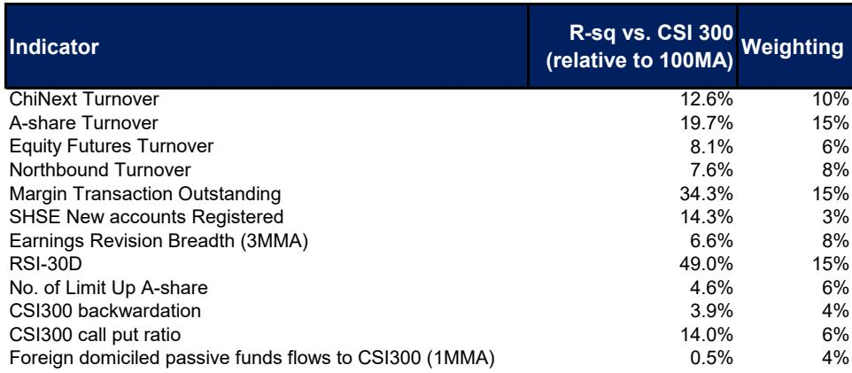
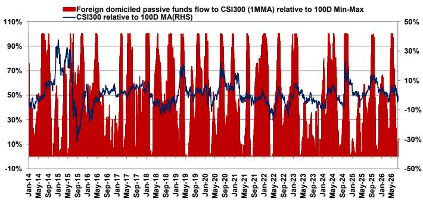
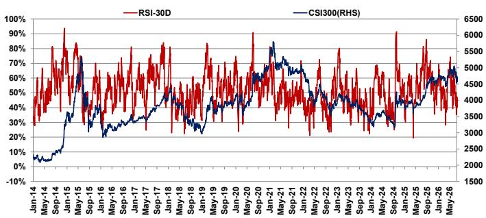

# MS：研究主题与行业变化观察

MS最新一期相关市场情绪追踪显示，截至7月29日当周，加权MSASI指标较前次统计（7月22日）下降5个百分点至32%，一个月移动均值同步回落4个百分点至53%。成交额调整是主要影响项：创业板日均成交额降至5090亿元，相关市场整体降至2.1万亿元，股指期货成交额降至5740亿元，降幅在21%至24%之间。报告同时指出，南向资金在7月23日至29日期间净流出20亿美元，但年初至今累计净流入仍达477亿美元。

这份报告的核心判断并不复杂：短期战术配置上，相关市场优于相关市场；但中长期对相关市场科技与创新板块保持积极看法。两个判断看似矛盾，实则基于不同的时间尺度和驱动因素。

## 1. 流动性事件与政策基调共同影响短期情绪

报告将本轮情绪回落归因于两个叠加因素。其一是CXMT（长鑫存储）IPO带来的流动性吸收效应——作为相关市场历史上规模最大的IPO之一，其申购冻结资金对市场短期资金面形成不确定性，可能放大近期波动。其二是7月政治局会议的政策信号：会议确认了增长不确定性上升，但重点在于加速落实约2万亿元剩余财政及准财政支持，而非推出新的措施。政策优先级仍向硬科技（"AI+"）和基础设施（"六大网络"）倾斜，对消费和住房的增量支持有限。

> **KC评论：** 这里值得注意的不是政策总量，而是政策节奏。报告认为"务实有效"措施的承诺将9月至10月保留为潜在政策调整的关键窗口，这意味着未来两个月的政策观察价值高于仓位调整价值。

## 2. 相关市场相对优势来自市场周期独立性与低拥挤度

报告维持"近期偏好相关市场"的战术判断，理由有三层。第一，相关市场对全球AI交易的拥挤敞口显著低于相关市场，对近期全球科技情绪波动的敏感度更低。第二，在全球市场波动可能导致流动性持续偏紧的背景下，其他新兴市场可能承压，而中国资产受益于此前资金平仓仍在调整的释放和极低的读者仓位。第三，相关市场内部动能正在改善：二季度业绩相对一季度和2025年出现筑底迹象，前期IPO解禁带来的供给侧冲击后流动性趋于稳定，AI交易正向数据中心和云服务扩散，受益标的集中在相关市场上市的中国超大规模云厂商。

## 3. 中长期相关市场看多逻辑建立在盈利增长而非情绪修复上

报告对相关市场长期看法保持积极，但依据不是情绪指标的回暖，而是盈利增长的持续性。报告认为，中国硬科技行业的盈利增长将继续加速，支持市场领导地位的恢复，并为周期内创新高奠定基础。这一判断与报告引用的2Q26业绩预告研究相互印证——相关市场盈利仍在调整有所缓解，而MSCI中国信号走强。

## 4. MSASI的构建逻辑提示哪些指标更值得跟踪

报告附录详细披露了MSASI的12项指标构成及权重分配，其中隐含的信息值得关注。RSI-30D与CSI 300（相对100日均线）的R平方最高，达到49%，权重为15%；融资余额的R平方为34.3%，同样权重15%；相关市场成交额R平方19.7%，权重15%。相比之下，外资被动资金流入CSI 300的R平方仅0.5%，权重仅4%。

> **KC评论：** 权重结构本身就是一个观察框架。融资余额和RSI这类高频、与市场同步性强的指标占据最高权重，意味着MSASI本质上是一个追踪市场内部动能和杠杆情绪的指标，而非预测指标。当它降至低位时，更多反映的是不确定性释放程度，而非买入信号。

报告也承认部分指标存在制度性断层，例如2015年市场稳定措施后股指期货交易受到严格监管，因此采用相对100日移动最小-最大值的标准化方法，而非相对数值，以部分吸收制度变化的影响。北向资金日度数据自2024年8月19日起停止公布，该指标的使用方式也需相应调整。

对于跟踪相关市场情绪的读者而言，这份报告提供了一个可复用的框架：将成交额、杠杆、RSI、盈利修正广度等指标按其对市场的历史解释力加权，再以100日移动区间标准化，从而判断当前情绪处于周期中的位置。当前读数指向情绪偏冷，而政策窗口和盈利趋势是下一个需要验证的变量。

For informational purposes only. Portions may be generated,translated,summarized,or edited with AI assistance based on source materials and may contain omissions or errors. Please verify independently. This is not investment,legal,tax,accounting,or other professional advice.

For informational purposes only. Portions may be generated,translated,summarized,or edited with AI assistance based on source materials and may contain omissions or errors. Please verify independently. This is not investment,legal,tax,accounting,or other professional advice.

