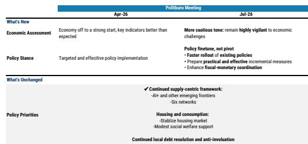
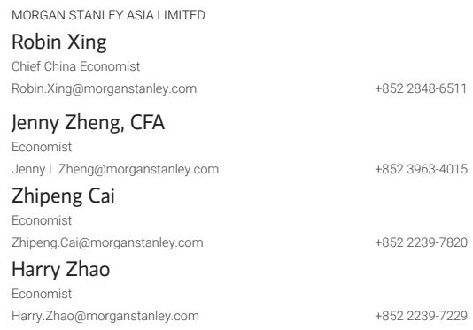

# MS：区域环境与行业变化观察

7月政治局会议的通稿已经落地。MS中国首席宏观环境学家邢自强团队在第一时间给出的判断是：这是一次“微调”，不是“转向”。报告标题写得很直白——Faster Fiscal Rollout, Not a Pivot Yet。

这个判断的锚点在于预算执行。报告测算，下半年仍有约2万亿元的预算内财政与准财政空间尚未使用。会议通稿要求加快政府债券发行和部署，并强调财政与货币政策的协调配合。在MS看来，这意味着政策性资金工具的使用节奏可能加快——今年安排8000亿元，对比2025年的5000亿元——同时利息补贴的范围可能扩大，但仍控制在1000亿元的预算额度内。

## 1. 政策组合仍以供给侧为主线

与4月会议相比，7月通稿对宏观环境形势的措辞明显更谨慎，从“开局良好、主要指标好于预期”调整为“保持高度警惕”。但政策框架没有变：支持仍然集中在“人工智能+”等新兴领域和“六大网络”基础设施研究。

消费、社会福利和房地产市场在通稿中都有提及，但MS注意到，这些领域没有给出具体的支持措施。报告认为，政策组合仍然偏供给侧，需求侧的政策工具尚未进入实质部署阶段。

> **KC评论：** 这里的关键不是通稿提没提消费和地产，而是提了但没有给数字、没有给工具。对比财政端“加快发行”“扩大使用”这类明确指令，需求侧的政策颗粒度明显更粗。

## 2. 九至十月是增量政策的观察窗口

通稿中“及时推出务实管用的增量措施”这一表述，被MS视为保留政策选项的信号。报告的逻辑是：如果7至8月的宏观环境活动数据未能企稳，9至10月推出进一步宽松措施的可能性就会上升。

这个时间窗口的判断，建立在预算执行节奏和现有政策工具的使用进度之上。报告没有给出具体的数据预测，但明确指出了观察路径——未来两个月的月度数据，将决定增量政策是否落地、以何种形式落地。

## 3. 四月与七月会议表述的可比框架

报告用一张对比表列出了两次政治局会议在政策表述上的差异。宏观环境评估从“好于预期”变为“高度警惕”，政策立场从“精准有效实施”变为“加快落地+储备增量”。不变的是供给侧框架、地产与消费的优先级排序，以及地方债务化解和反内卷的延续。

这张表的价值在于提供了一个可复用的观察框架：每次政治局会议后，先看宏观环境评估的措辞变化，再看政策立场是“加快执行”还是“推出新工具”，最后检查消费和地产有没有获得具体的政策工具。三个维度合在一起，才能判断政策是微调还是转向。

MS这份报告的结论是清晰的：当前阶段，政策重心在把已经宣布的财政工具尽快用出去，而不是设计一套新的方案。对于观察者而言，接下来的变量不是政策意愿，而是7至8月的数据能否接住这轮预算执行的效果。

For informational purposes only. Portions may be generated, translated, summarized, or edited with AI assistance based on source materials and may contain omissions or errors. Please verify independently. This is not investment, legal, tax, accounting, or other professional advice.

For informational purposes only. Portions may be generated, translated, summarized, or edited with AI assistance based on source materials and may contain omissions or errors. Please verify independently. This is not investment, legal, tax, accounting, or other professional advice.

