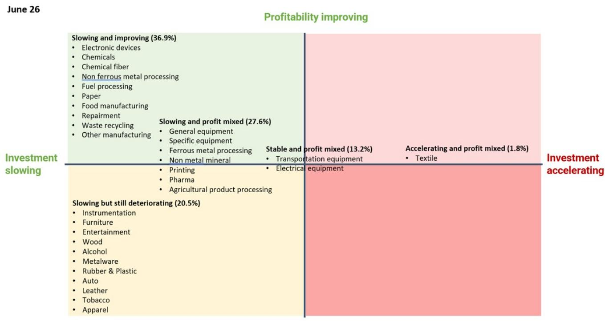
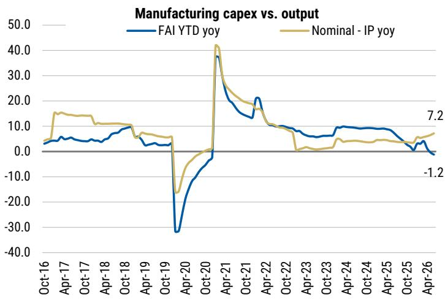
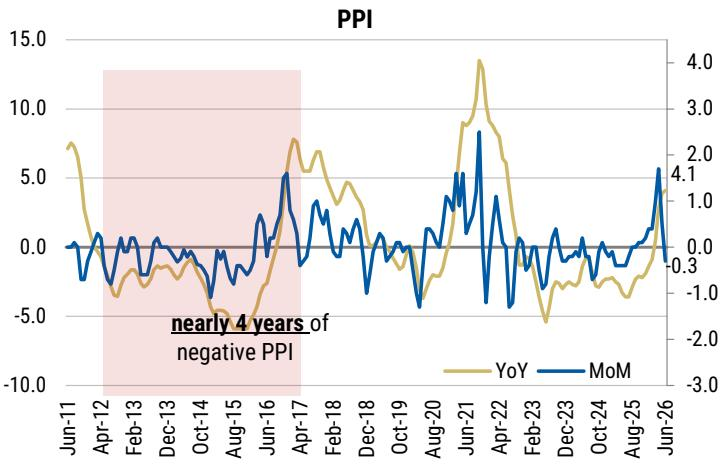

<table><tr><td colspan="2">CHINA FINANCIALS</td></tr><tr><td>Asia Pacific Industry View</td><td>Attractive</td></tr></table>

# 跟踪产业风险：6月需求增长持续显著快于供给——有利于风险消化

## 核心要点

6月名义工业产出同比增长7.2%（作为工业需求的代理指标），而制造业固定资产投资（作为供给增长的代理指标）同比下降1.2%。

6月是中国产能治理持续推进的第9个月，这在一定程度上支撑了制造业利润总额同比增长20.1%的强劲表现，利润率亦有所改善。

在出口增长较为强劲的背景下，政策层面推出了更多防止“内卷式”竞争的举措，为进一步化解宏观体系风险提供了良好契机。

工业品出厂价格环比下降0.3%，但受低基数影响，同比涨幅扩大至4.1%。

二季度工业中长期贷款增速为5.9%，较一季度的6.8%有所回落，整体保持理性，有助于工业领域信用风险的逐步消化。

制造业整体利润增长依然强劲，但行业间呈现分化。按负债规模计算，37%的行业盈利能力有所改善，约40%的行业利润趋势相对平稳，略超20%的行业出现回落，我们认为这属于健康且正常的分化格局。电子设备、化工和化学纤维等行业受益于价格连续回升，利润增长较为突出；而酒类、服装和木材加工等行业利润则继续承压。我们认为，这种分化有助于工业风险的有序消化，也有利于各行业在不同周期阶段实现更加均衡的发展。

产能治理稳步推进，固定资产投资与工业产出增速差收窄。6月，按负债规模计算，85%的行业资本开支增速放缓。基于年初至今平均工业品出厂价格涨幅测算，制造业固定资产投资与工业产出增速差在6月收窄至-8.4%，5月为-6.9%，固定资产投资增速持续收紧。这是产能治理连续推进的第9个月，我们认为这有助于进一步消化过剩产能。我们依然认为，制造业增长节奏的合理化，比单纯刺激需求更有利于中国宏观体系的长期稳健。

Richard.Xu@morganstanley.com +852 2848-6729

Chenqian.Liu@morganstanley.com +852 3963-0359

股票分析师
Chiyao.Huang@morganstanley.com +852 3963-4624

## Beryl Yang

Beryl.Yang@morganstanley.com +852 3963-2224

Asia Summer School 2026

## 相关报告：

中国3D之旅——金融业：评估持续支持产业升级的成本（2024年5月21日）

中国金融业：净息差回升早于预期，产能过剩风险下降（2026年5月25日）

中国金融业：跟踪产业风险——产业信用风险化解趋势延续，受健康的总需求和理性的投资增长支撑（2026年7月3日）

## 图表

图表1：2026年6月，85%（按负债规模计）的行业资本开支放缓；37%的行业利润趋势改善

注：括号内数字为该行业占制造业总负债的比重
资料来源：国家统计局、CEIC、MS。

图表2：制造业固定资产投资与工业产出增速差收窄至-8.4%（上月为-6.9%），固定资产投资增速进一步收紧；工业品出厂价格环比下降0.3%，同比上涨4.1%。

资料来源：国家统计局、CEIC、MS

## 披露声明

本报告中的信息和观点由MS Asia Limited（对其内容承担责任）及/或MS Asia (Singapore) Pte.（注册号199206298Z）及/或MS Asia (Singapore) Securities Pte Ltd（注册号200008434H，受新加坡金融管理局监管，对其内容承担法律责任，如有任何相关问题请联系该公司）及/或MS Taiwan Limited及/或MS & Co International plc首尔分行及/或MS Australia Limited（ABN 67 003 734 576，澳大利亚金融服务牌照号233742，对其内容承担责任）及/或MS Wealth Management Australia Pty Ltd（ABN 19 009 145 555，澳大利亚金融服务牌照号240813，对其内容承担责任）及/或MS India Company Private Limited（公司识别号CIN U22990MH1998PTC115305，受印度证券交易委员会（SEBI）监管，持有研究分析师牌照（SEBI注册号INH000001105）、股票经纪商牌照（SEBI股票经纪商注册号INZ000244438）、商人银行牌照（SEBI注册号INM000011203）以及国家证券存管有限公司存管参与人资格（SEBI注册号IN-DP-NSDL-567-2021），注册办公地址：Altimus, Level 39 & 40, Pandurang Budhkar Marg, Worli, Mumbai 400018, India；电话：+91-22-61181000；合规官联系方式：Mr. Tejarshi Hardas，电话：+91-22-61181000或电邮：tejarshi.hardas@morganstanley.com；投诉官联系方式：Mr. Tejarshi Hardas，电话：+91-22-61181000或电邮：msic-compliance@morganstanley.com）及其关联公司（合称“MS”）编制或传播。MS India Company Private Limited (MSICPL) 可能在提供研究服务时使用人工智能工具。本报告中的所有推荐意见均由具备相应资格的研究分析师作出。

有关本报告涉及公司的重要披露、股价图表和股票评级历史，请参阅MS披露网站 www.morganstanley.com/eqr/disclosures/webapp/generalresearch，或联系您的投资代表或MS，地址：1585 Broadway, (Attention: Research Management), New York, NY, 10036 USA。

有关本研究报告中所载任何推荐、评级或目标价相关的估值方法和风险，请联系客户支持团队：美国/加拿大 +1 800 303-2495；香港 +852 2848-5999；拉丁美洲 +1 718 754-5444（美国）；伦敦 +44 (0)20-7425-8169；新加坡 +65 6834-6860；悉尼 +61 (0)2-9770-1505；东京 +81 (0)3-6836-9000。或者，您也可以联系您的投资代表或MS，地址：1585 Broadway, (Attention: Research Management), New York, NY 10036 USA。

## 分析师认证

以下分析师特此证明，本报告中关于所涉公司及其证券的观点准确反映了其个人观点，且其未收到也不会收到因在本报告中发表具体推荐或观点而获得的直接或间接补偿：Chiyao Huang；Richard Xu, CFA。

## 全球研究冲突管理政策

MS已按照我们的冲突管理政策发布本报告，该政策可在 www.morganstanley.com/institutional/research/conflictpolicies 查阅。该政策的葡萄牙语版本可在 www.morganstanley.com.br 查阅。

## 关于标的公司的重要监管披露

截至2026年6月30日，MS实益持有MS所覆盖的以下公司1%或以上的普通股权益类别：中国国际金融股份有限公司、招商银行、重庆农村商业银行、富途控股有限公司、奇富科技有限公司。

在过去12个月内，MS管理或联合管理了中国银行股份有限公司的公开证券发行（或144A发行）。

在过去12个月内，MS因投资银行服务从中国农业银行股份有限公司、中国银行股份有限公司、中国工商银行获得了报酬。

在未来3个月内，MS预计将从以下公司获得或有意寻求投资银行服务报酬：中国农业银行股份有限公司、北京银行股份有限公司、中国银行股份有限公司、杭州银行股份有限公司、宁波银行股份有限公司、中信银行股份有限公司、中国建设银行股份有限公司、中国光大银行股份有限公司、中国国际金融股份有限公司、招商银行、中信股份有限公司、东方财富信息股份有限公司、富途控股有限公司、广发证券、HTSC、中国工商银行、兴业银行股份有限公司、陆金所、平安银行、中国邮政储蓄银行股份有限公司、奇富科技有限公司、上海浦东发展银行。

在过去12个月内，MS因投资银行服务以外的产品和服务从以下公司获得了报酬：中国农业银行股份有限公司、北京银行股份有限公司、中国银行股份有限公司、交通银行、杭州银行股份有限公司、宁波银行股份有限公司、中信银行股份有限公司、中国建设银行股份有限公司、中国国际金融股份有限公司、招商银行、CITIC股份有限公司、中国民生银行股份有限公司、中信股份有限公司、富途控股有限公司、银河证券、广发证券、HTSC、华夏银行、中国工商银行、兴业银行股份有限公司、平安银行、中国邮政储蓄银行股份有限公司、奇富科技有限公司、上海浦东发展银行。

在过去12个月内，MS已向或正在向以下公司提供投资银行服务，或与以下公司存在投资银行客户关系：中国农业银行股份有限公司、北京银行股份有限公司、中国银行股份有限公司、杭州银行股份有限公司、宁波银行股份有限公司、中信银行股份有限公司、中国建设银行股份有限公司、中国国际金融股份有限公司、招商银行、中信股份有限公司、东方财富信息股份有限公司、富途控股有限公司、广发证券、HTSC、中国工商银行、兴业银行股份有限公司、陆金所、平安银行、中国邮政储蓄银行股份有限公司、奇富科技有限公司、上海浦东发展银行。

在过去12个月内，MS已向或正在向以下公司提供非投资银行、证券相关服务，及/或过去已签订服务协议或与以下公司存在客户关系：中国农业银行股份有限公司、北京银行股份有限公司、中国银行股份有限公司、交通银行、杭州银行股份有限公司、宁波银行股份有限公司、中信银行股份有限公司、中国建设银行股份有限公司、中国国际金融股份有限公司、招商银行、CITIC股份有限公司、中国民生银行股份有限公司、中信股份有限公司、东方财富信息股份有限公司、富途控股有限公司、银河证券、广发证券、HTSC、华夏银行、中国工商银行、兴业银行股份有限公司、平安银行、中国邮政储蓄银行股份有限公司、奇富科技有限公司、上海浦东发展银行。

主要负责编制MS的股票研究分析师或策略师的薪酬基于多种因素，包括研究质量、读者客户反馈、选股表现、竞争因素、公司收入和整体投资银行收入。股票研究分析师或策略师的薪酬不与MS进行的投资银行或资本市场交易，或特定交易台的盈利能力或收入挂钩。

MS及其关联公司从事与MS所覆盖公司/工具相关的业务，包括做市、提供流动性、基金管理、商业银行、信贷扩展、投资服务和投资银行。MS以本金方式向客户销售和购买MS所覆盖公司的证券/工具。MS可能持有本报告所讨论公司债务或工具的头寸。MS作为本金交易或可能交易作为债务研究报告主题的债务证券（或相关衍生品）。

上述部分披露也是为了遵守非美国司法管辖区的适用法规。

## 股票评级

MS采用相对评级体系，使用“增持”、“平配”、“未评级”或“减持”等术语（定义见下文）。MS不对我们覆盖的股票给出“买入”、“持有”或“卖出”评级。“增持”、“平配”、“未评级”和“减持”并不等同于买入、持有和卖出。读者应仔细阅读MS中使用的所有评级定义。此外，由于MS包含有关分析师观点的更完整信息，读者应仔细阅读完整的MS，而不应仅从评级推断内容。在任何情况下，评级（或研究）都不应被用作或依赖为研究交流。读者买卖股票的决定应取决于个人情况（如读者现有持仓）和其他考虑因素。

## 全球股票评级分布

## （截至2026年6月30日）

下文所述的股票评级适用于MS的基本面股票研究，不适用于公司生产的债务研究。

仅为披露目的（根据FINRA要求），我们在“增持”、“平配”、“未评级”和“减持”评级旁边包含了“买入”、“持有”和“卖出”类别标题。MS不对我们覆盖的股票给出“买入”、“持有”或“卖出”评级。“增持”、“平配”、“未评级”和“减持”并不等同于买入、持有和卖出，而是代表建议的相对权重（定义见下文）。为满足监管要求，我们将“增持”（我们最正面的股票评级）对应为买入建议；将“平配”和“未评级”对应为持有建议，将“减持”对应为卖出建议。

<table><tr><td></td><td colspan="2">覆盖范围</td><td colspan="3">投资银行客户（IBC）</td><td colspan="2">其他重要投资服务客户（MISC）</td></tr><tr><td>股票评级类别</td><td>数量</td><td>占总数的%</td><td>数量</td><td>占IBC总数的%</td><td>占评级类别的%</td><td>数量</td><td>占其他MISC总数的%</td></tr><tr><td>增持/买入</td><td>1544</td><td>42%</td><td>453</td><td>49%</td><td>29%</td><td>757</td><td>44%</td></tr><tr><td>平配/持有</td><td>1577</td><td>43%</td><td>390</td><td>42%</td><td>25%</td><td>769</td><td>44%</td></tr><tr><td>未评级/持有</td><td>3</td><td>0%</td><td>1</td><td>0%</td><td>33%</td><td>1</td><td>0%</td></tr><tr><td>减持/卖出</td><td>544</td><td>15%</td><td>89</td><td>10%</td><td>16%</td><td>204</td><td>12%</td></tr><tr><td>总计</td><td>3,668</td><td></td><td>933</td><td></td><td></td><td>1731</td><td></td></tr></table>

数据包括当前已分配评级的普通股和ADR。投资银行客户是指在过去12个月内从MS获得投资银行报酬的公司。由于四舍五入，“占总数的%”列中的百分比可能不完全等于100%。

## 分析师股票评级

增持（O）：预计该股票未来12-18个月经风险调整后的总回报将超过分析师行业（或行业团队）覆盖范围的平均总回报。

平配（E）：预计该股票未来12-18个月经风险调整后的总回报将与分析师行业（或行业团队）覆盖范围的平均总回报一致。

未评级（NR）：目前分析师对该股票相对于分析师行业（或行业团队）覆盖范围平均总回报的走势没有足够的信心。

减持（U）：预计该股票未来12-18个月经风险调整后的总回报将低于分析师行业（或行业团队）覆盖范围的平均总回报。

除非另有说明，MS中包含的目标价时间范围为12至18个月。

## 分析师行业观点

具吸引力（A）：分析师预计其行业覆盖范围未来12-18个月的表现相对于相关广泛市场基准具有吸引力，如下所示。

同步（I）：分析师预计其行业覆盖范围未来12-18个月的表现将与相关广泛市场基准一致，如下所示。
谨慎（C）：分析师对其行业覆盖范围未来12-18个月相对于相关广泛市场基准的表现持谨慎态度，如下所示。
各地区基准如下：北美——标普500；拉丁美洲——相关MSCI国家指数或MSCI拉丁美洲指数；欧洲——MSCI欧洲；日本——TOPIX；亚洲——相关MSCI国家指数或MSCI次区域指数或MSCI AC亚洲太平洋（除日本）指数。

## 关于MS Smith Barney LLC客户的重要披露

关于合理预期可能影响MS Smith Barney LLC选择第三方研究提供商或第三方研究报告标的公司的任何重大利益冲突的重要披露，可在MS财富管理披露网站 www.morganstanley.com/online/researchdisclosures 查阅。关于MS的具体披露，请参阅 https://www.morganstanley.com/eqr/disclosures/webapp/generalresearch。

每份MS报告均经代表MS Smith Barney LLC的人员审核和批准。该审核和批准由代表MS审核研究报告的同一人执行。这可能产生利益冲突。

## 其他重要披露

MS的政策是，当研究分析师和研究管理层认为适当，根据对发行人、行业或市场可能对研究观点产生重大影响的事态发展，更新研究报告。此外，某些研究出版物旨在定期（每周/每月/每季度/每年）更新，通常会按该频率更新，除非研究分析师和研究管理层根据当前情况确定不同的发布时间表更合适。

MS不担任市政顾问，本报告中的观点或意见不旨在也不构成《多德-弗兰克华尔街改革和消费者保护法》第975条含义内的建议。

MS生产一种名为“战术观点”的股票研究产品。关于特定股票的“战术观点”中所含观点可能与同一股票的研究报告中的推荐或观点相矛盾。这可能是由于时间跨度、方法论、市场事件或其他因素的不同所致。如需获取特定股票的所有研究，请联系您的销售代表或访问Matrix：http://www.morganstanley.com/matrix。

MS通过我们专有的Matrix研究门户提供给客户，并由MS以电子方式分发给客户。某些（但非全部）MS产品也通过第三方供应商提供给客户，或通过替代电子方式作为便利重新分发给客户。如需访问所有可用的MS，请联系您的销售代表或访问Matrix：http://www.morganstanley.com/matrix。

对MS的任何访问和/或使用均受MS使用条款（http://www.morganstanley.com/terms.html）约束。访问和/或使用MS即表示您已阅读并同意受我们的使用条款约束。此外，您同意MS根据我们的隐私政策和全球Cookie政策（http://www.morganstanley.com/privacy_pledge.html）处理您的个人数据并使用Cookie，包括用于设置您的偏好和收集读者数据，以便我们为您提供更好、更个性化的服务和产品。如需了解有关MS如何处理个人数据、如何使用Cookie以及如何拒绝Cookie的更多信息，请参阅我们的隐私政策和全球Cookie政策（http://www.morganstanley.com/privacy_pledge.html）。请使用提供的链接查看MS India Company Private Limited的条款和条件及最重要条款和条件（https://www.morganstanley.com/assets/pdfs/about-us-global-offices/india/Terms_and_conditions.pdf），并通过以下链接查看审计报告（https://ny.matrix.ms.com/eqr/research/webapp/researchdocs/MSICPL_Morgan_Stanley_Research_Audit_Report.pdf）。

如果您不同意我们的使用条款和/或不愿同意MS处理您的个人数据或使用Cookie，请勿访问我们的研究。MS不提供个性化的研究交流。MS的编制未考虑接收者的个人情况和目标。MS建议读者独立评估特定的投资和策略，并鼓励读者寻求财务顾问的建议。投资或策略的适当性取决于读者的个人情况和目标。MS中讨论的证券、工具或策略可能不适合所有读者，某些读者可能没有资格购买或参与其中部分或全部。MS不构成买入或卖出任何证券/工具或参与任何特定交易策略的要约或招揽。您的研究价值和收入可能因利率、汇率、违约率、提前偿还率、证券/工具价格、市场指数、公司的运营或财务状况或其他因素的变化而有所不同。期权或其他证券/工具交易权利可能存在时间限制。过往表现不一定是未来表现的指引。对未来表现的估计基于可能无法实现的假设。如提供且除非另有说明，封面上的收盘价为标的公司证券/工具主要交易所的收盘价。

主要负责编制MS的固定收益研究分析师、策略师或经济学家的薪酬基于多种因素，包括研究的质量、准确性和价值、公司盈利能力或收入（包括固定收益交易和资本市场盈利能力或收入）、客户反馈和竞争因素。固定收益研究分析师、策略师或经济学家的薪酬不与MS进行的投资银行或资本市场交易，或特定交易台的盈利能力或收入挂钩。

MS中的“关于标的公司的重要监管披露”部分列出了MS拥有公司1%或以上普通股权益类别的所有提及公司。对于MS中提及的所有其他公司，MS可能持有少于1%的证券/工具或证券/工具衍生品投资，并可能以与MS中讨论不同的方式进行交易。未参与编制MS的MS员工可能持有所提及公司的证券/工具或证券/工具衍生品投资，并可能以与MS中讨论不同的方式进行交易。衍生品可能由MS或关联人士发行。

除有关MS的信息外，MS基于公开信息。MS尽一切努力使用可靠、全面的信息，但我们不对其准确性或完整性作出任何陈述。除我们打算停止对标的公司的股票研究覆盖外，我们没有义务在MS中的意见或信息发生变化时通知您。MS中提出的事实和观点未经MS其他业务领域（包括投资银行人员）的专业人士审核，可能不反映他们所知的信息。

MS人员可能参加公司活动，如实地考察，且除非经研究管理层授权成员预先批准，通常禁止接受公司支付相关费用。

MS可能做出与本报告中的推荐或观点不一致的投资决策。

致台湾读者或交易台湾证券/工具的读者：有关在台湾交易的证券/工具的信息由MS Taiwan Limited（“MSTL”）分发。此类信息仅供参考。读者应独立评估投资风险，并自行承担投资决策的全部责任。未经MS明确书面同意，MS不得分发给公共媒体，或由公共媒体引用或使用。访问和/或接收MS的台湾证券交易所推荐规范第7-1条范围内的任何非客户读者不得将MS提供给任何第三方（包括但不限于关联方、关联公司和任何其他第三方）或从事任何可能产生或看似产生利益冲突的与MS相关的活动。有关不在台湾交易的证券/工具的信息仅供参考，不构成对此类证券/工具交易的推荐或招揽。MSTL不得为客户执行这些证券/工具的交易。

MS中的某些信息由MS Asia Limited上海代表处的员工为MS Asia Limited的使用而获取。MS并非根据中国法律注册成立，与本报告相关的研究在中国境外进行。MS不构成在中国境内出售任何证券的要约或招揽购买任何证券的要约。中国读者应具备投资此类证券的相关资格，并应自行负责从相关政府机构获得所有必要的批准、许可、验证和/或注册。本报告及其任何部分均不旨在也不构成中国法律定义的证券投资咨询或顾问服务。此类信息仅供参考。

MS在巴西由MS C.T.V.M. S.A.分发，地址：Av. Brigadeiro Faria Lima, 3600, 6th floor, São Paulo - SP, Brazil；受Comissão de Valores Mobiliários监管；在墨西哥由MS México, Casa de Bolsa, S.A. de C.V分发，受Comision Nacional Bancaria y de Valores监管，地址：Paseo de los Tamarindos 90, Torre 1, Col. Bosques de las Lomas Floor 29, 05120 Mexico City；在日本由MS MUFG Securities Co., Ltd.分发，对于仅与大宗商品相关的研究报告，由MS Capital Group Japan Co., Ltd分发；在香港由MS Asia Limited（对其内容承担责任）和MS Bank Asia Limited分发；在新加坡由MS Asia (Singapore) Pte.（注册号199206298Z）和/或MS Asia (Singapore) Securities Pte Ltd（注册号200008434H，受新加坡金融管理局监管，对其内容承担法律责任，如有任何相关问题请联系该公司）和MS Bank Asia Limited新加坡分行（注册号T14FCO118J）分发；在澳大利亚向澳大利亚公司法含义内的“批发客户”由MS Australia Limited ABN 67 003 734 576（澳大利亚金融服务牌照号233742，对其内容承担责任）分发；在澳大利亚向澳大利亚公司法含义内的“批发客户”和“零售客户”由MS Wealth Management Australia Pty Ltd（ABN 19 009 145 555，澳大利亚金融服务牌照号240813，对其内容承担责任）分发；在韩国由MS & Co International plc首尔分行分发；在印度由MS India Company Private Limited分发，公司识别号CIN U22990MH1998PTC115305，受印度证券交易委员会（SEBI）监管，持有研究分析师牌照（SEBI注册号INH000001105）、股票经纪商牌照（SEBI股票经纪商注册号INZ000244438）、商人银行牌照（SEBI注册号INM000011203）以及国家证券存管有限公司存管参与人资格（SEBI注册号IN-DP-NSDL-567-2021），注册办公地址：Altimus, Level 39 & 40, Pandurang Budhkar Marg, Worli, Mumbai 400018, India；电话：+91-22-61181000；合规官联系方式：Mr. Tejarshi Hardas，电话：+91-22-61181000或电邮：tejarshi.hardas@morganstanley.com；投诉官联系方式：Mr. Tejarshi Hardas，电话：+91-22-61181000或电邮：msic-compliance@morganstanley.com。MS India Company Private Limited (MSICPL) 可能在提供研究服务时使用人工智能工具。本报告中的所有推荐意见均由具备相应资格的研究分析师作出；在加拿大由MS Canada Limited分发；在德国和欧洲经济区（如需要）由MS Europe S.E.分发，受Bundesanstalt fuer Finanzdienstleistungsaufsicht (BaFin)授权和监管，参考号149169；在美国由MS & Co. LLC分发，对其内容承担责任。MS & Co. International plc由审慎监管局授权并由金融行为监管局和审慎监管局监管，在英国仅向以下人士分发其编制的研究以及其任何关联公司编制的研究：(i) 符合《2000年金融服务和市场法（金融促进）令》2005（经修订，简称“该令”）第19(5)条的投资专业人士；(ii) 符合该令第49(2)(a)至(d)条的高净值实体；或(iii) 可以合法传达或促使其传达参与投资活动（经修订的《2000年金融服务和市场法》第21条含义内）的邀请或诱因的人士。RMB MS Proprietary Limited是JSE Limited和A2X (Pty) Ltd的成员。RMB MS Proprietary Limited是MS International Holdings Inc.和RMB Investment Advisory (Proprietary) Limited（由FirstRand Limited全资拥有）各占50%股权的合资企业。MS中的信息由MS Saudi Arabia分发，受沙特阿拉伯王国资本市场管理局监管，仅面向资深读者。

MS Hong Kong Securities Limited是以下在香港联合交易所有限公司上市的证券的流动性提供者/做市商：中国农业银行股份有限公司、中国银行股份有限公司、中国建设银行股份有限公司、招商银行、中信股份有限公司、银河证券、中国工商银行。最新名单可在港交所网站查阅：http://www.hkex.com.hk。

MS中的信息由MS & Co. International plc（DIFC分行）传达，受迪拜金融服务管理局（DFSA）监管，或由MS & Co. International plc（ADGM分行）传达，受阿布扎比金融服务监管局（FSRA）监管，且仅面向DFSA或FSRA（视情况而定）定义的专业客户。本研究所涉及的金融产品或金融服务仅向符合专业客户监管标准的客户提供。按行业划分的MS不同研究评级或推荐的百分比分布，可向您的销售代表索取。

MS中的信息由MS & Co. International plc（QFC分行）传达，受卡塔尔金融中心监管局（QFCRA）监管，仅面向商业客户和市场对手方，不面向QFCRA定义的零售客户。

根据土耳其资本市场委员会的要求，此处所述的投资信息、评论和建议不属于投资咨询活动范围。投资咨询服务仅由授权公司根据客户的风险和收益偏好专门提供。此处所述的评论和建议具有一般性。这些意见可能不适合您的财务状况、风险和收益偏好。因此，仅依赖此处信息做出投资决策可能无法产生符合您预期的结果。

MS中包含的商标和服务标志归各自所有者所有。第三方数据提供商不对其提供数据的准确性、完整性或及时性作出任何保证或陈述，也不对此类数据相关的任何损害承担责任。全球行业分类标准（GICS）由MSCI和S&P开发，是其专有财产。

未经MS书面同意，MS或其任何部分不得转载、出售或再分发。

MS中引用的指标和追踪器不得用作或视为欧盟法规2016/1011或任何其他类似框架下的基准。

某些固定收益研究报告中推荐或讨论的发行人和/或固定收益产品可能不会被持续跟踪。因此，读者应将此类固定收益研究报告视为提供独立分析，不应期望对此类发行人和/或个别固定收益产品有持续分析或额外报告。MS可能不时持有研究报告标的公司的重大财务和商业利益。

SEBI的注册和NISM的认证不以任何方式保证中介机构的业绩或向读者提供任何回报保证。证券市场投资受市场风险影响。投资前请仔细阅读所有相关文件。

## 行业覆盖：中国金融业

<table><tr><td>公司（代码）</td><td>评级（截至）</td><td>价格*（2026年7月30日）</td></tr><tr><td colspan="3">Chiyao Huang</td></tr><tr><td>中国国际金融股份有限公司 (3908.HK)</td><td>O (2025年2月28日)</td><td>HK$21.48</td></tr><tr><td>CITIC股份有限公司 (600999.SS)</td><td>U (2022年9月29日)</td><td>Rmb17.56</td></tr><tr><td>CITIC股份有限公司 (6099.HK)</td><td>U (2024年10月29日)</td><td>HK$14.45</td></tr><tr><td>中信股份有限公司 (6030.HK)</td><td>O (2026年7月10日)</td><td>HK$27.32</td></tr><tr><td>中信股份有限公司 (600030.SS)</td><td>O (2025年8月7日)</td><td>Rmb28.49</td></tr><tr><td>东方财富信息股份有限公司 (300059.SZ)</td><td>E (2025年9月19日)</td><td>Rmb19.99</td></tr><tr><td>富途控股有限公司 (FUTU.O)</td><td>O (2024年11月18日)</td><td>US$101.88</td></tr><tr><td>银河证券 (6881.HK)</td><td>E (2020年2月27日)</td><td>HK$7.65</td></tr><tr><td>银河证券 (601881.SS)</td><td>U (2022年9月29日)</td><td>Rmb12.57</td></tr><tr><td>广发证券 (000776.SZ)</td><td>E (2025年8月7日)</td><td>Rmb21.20</td></tr><tr><td>广发证券 (1776.HK)</td><td>E (2023年1月6日)</td><td>HK$17.00</td></tr><tr><td>HTSC (601688.SS)</td><td>E (2024年9月23日)</td><td>Rmb19.70</td></tr><tr><td>HTSC (6886.HK)</td><td>E (2024年9月23日)</td><td>HK$16.85</td></tr><tr><td colspan="3">Richard Xu, CFA</td></tr><tr><td>中国农业银行股份有限公司 (601288.SS)</td><td>E (2019年5月7日)</td><td>Rmb7.11</td></tr><tr><td>中国农业银行股份有限公司 (1288.HK)</td><td>O (2020年10月19日)</td><td>HK$6.51</td></tr><tr><td>百融云创 (6608.HK)</td><td>E (2025年9月9日)</td><td>HK$5.22</td></tr><tr><td>北京银行股份有限公司 (601169.SS)</td><td>E (2022年8月17日)</td><td>Rmb5.21</td></tr><tr><td>成都银行股份有限公司 (601838.SS)</td><td>O (2022年8月17日)</td><td>Rmb18.71</td></tr><tr><td>中国银行股份有限公司 (601988.SS)</td><td>E (2019年5月7日)</td><td>Rmb6.14</td></tr><tr><td>中国银行股份有限公司 (3988.HK)</td><td>O (2020年1月10日)</td><td>HK$5.54</td></tr><tr><td>交通银行 (3328.HK)</td><td>U (2022年5月20日)</td><td>HK$7.67</td></tr><tr><td>交通银行 (601328.SS)</td><td>U (2014年9月5日)</td><td>Rmb7.32</td></tr><tr><td>杭州银行股份有限公司 (600926.SS)</td><td>E (2022年8月17日)</td><td>Rmb16.50</td></tr><tr><td>宁波银行股份有限公司 (002142.SZ)</td><td>O (2022年8月17日)</td><td>Rmb32.90</td></tr><tr><td>中信银行股份有限公司 (601998.SS)</td><td>E (2025年4月16日)</td><td>Rmb7.93</td></tr><tr><td>中信银行股份有限公司 (0998.HK)</td><td>O (2025年4月16日)</td><td>HK$7.85</td></tr><tr><td>中国建设银行股份有限公司 (0939.HK)</td><td>O (2012年10月11日)</td><td>HK$9.36</td></tr><tr><td>中国建设银行股份有限公司 (601939.SS)</td><td>E (2019年5月7日)</td><td>Rmb10.97</td></tr><tr><td>中国光大银行股份有限公司 (6818.HK)</td><td>U (2023年5月12日)</td><td>HK$3.27</td></tr><tr><td>中国光大银行股份有限公司 (601818.SS)</td><td>U (2022年5月20日)</td><td>Rmb3.19</td></tr><tr><td>招商银行 (600036.SS)</td><td>O (2019年1月7日)</td><td>Rmb40.55</td></tr><tr><td>招商银行 (3968.HK)</td><td>O (2018年9月20日)</td><td>HK$51.20</td></tr><tr><td>中国民生银行股份有限公司 (600016.SS)</td><td>O (2025年8月28日)</td><td>Rmb3.63</td></tr><tr><td>中国民生银行股份有限公司 (1988.HK)</td><td>O (2023年5月12日)</td><td>HK$3.67</td></tr><tr><td>重庆农村商业银行 (3618.HK)</td><td>U (2023年5月12日)</td><td>HK$6.68</td></tr><tr><td>华夏银行 (600015.SS)</td><td>U (2015年6月30日)</td><td>Rmb7.03</td></tr><tr><td>中国工商银行 (1398.HK)</td><td>O (2013年8月9日)</td><td>HK$7.64</td></tr><tr><td>中国工商银行 (601398.SS)</td><td>E (2022年9月19日)</td><td>Rmb8.15</td></tr><tr><td>兴业银行股份有限公司 (601166.SS)</td><td>O (2019年2月25日)</td><td>Rmb19.10</td></tr><tr><td>陆金所 (LU.N)</td><td></td><td>US$1.53</td></tr><tr><td>平安银行 (000001.SZ)</td><td>O (2019年5月7日)</td><td>Rmb11.61</td></tr><tr><td>中国邮政储蓄银行股份有限公司 (1658.HK)</td><td>O (2016年11月1日)</td><td>HK$5.11</td></tr><tr><td>奇富科技有限公司 (QFIN.O)</td><td>O (2020年8月25日)</td><td>US$13.76</td></tr><tr><td>上海浦东发展银行 (600000.SS)</td><td>E (2025年8月5日)</td><td>Rmb9.71</td></tr></table>

股票评级可能发生变化。请参阅各公司最新研究。
\* 历史价格未进行拆股调整。

## © 2026 MS
