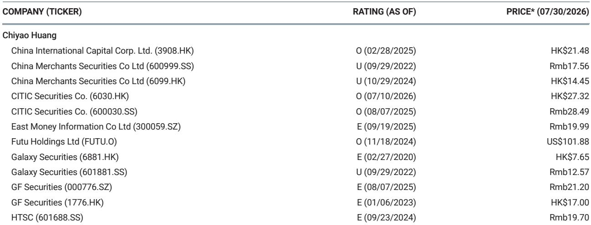

# MS：研究主题与行业变化观察

6月中国工业领域出现一个值得注意的组合：名义工业增加值同比增长7.2%，而制造业固定资产研究同比下降1.2%。需求增速继续明显快于供给，这已是连续第9个月的去产能进程。MS在最新中国资金业研报中认为，这一格局对资金系统不确定性消化是正面信号。

报告的核心判断是，制造业增长节奏的合理化比单纯刺激需求更有利于中国资金体系的稳定。6月制造业利润同比增长20.1%，利润率改善明显，部分归因于产能控制持续推进。政策层面，在出口增长强劲的同时，决策者推动更多反内卷举措，报告认为这为资金系统进一步去不确定性提供了窗口。

## 1. 制造业利润增速分化呈现正态分布

报告按负债规模统计，37%的行业利润表现改善，约40%行业利润趋势相对稳定，略超20%行业出现变化。这一分布被报告视为健康且正常的状态。电子设备、化学品和化学纤维行业因价格连续回升而录得强劲利润增长；酒类、服装和木材制造则出现进一步利润变化。

这种行业间的分化并非坏事。报告认为，不同行业处于不同周期阶段，有助于工业不确定性平稳消化，也利于产业间更均衡的发展。对观察者而言，判断制造业整体健康状况时，与其看单一行业表现，不如看利润改善、稳定、出现变化三类行业的比例结构。

> **KC评论：** 报告用负债占比而非企业数量来衡量行业分布，这意味着大型行业的利润变化对整体判断的影响权重更高。电子设备等大行业的改善，对制造业利润数据的拉动作用可能比表面数字显示的更集中。

## 2. 产能控制范围扩大至85%的行业

6月数据显示，按负债计85%的行业出现资本开支节奏变化。基于年初至今平均PPI增速计算，制造业FAI与IP的缺口从5月的-6.9%收窄至6月的-8.4%，FAI增速继续收紧。这是连续第9个月的去产能进程。

PPI环比下降0.3%，但同比增速因低基数扩大至4.1%。价格信号的组合值得留意：环比仍在节奏变化，同比却因基数效应走高。报告认为，产能控制的稳步推进有助于进一步减少过剩产能，而制造业增长节奏的合理化，比刺激需求更可持续。

## 3. 工业中长期贷款增速回落至5.9%

2Q26工业中长期贷款同比增长5.9%，较1Q26的6.8%有所节奏变化。报告认为，这一理性的信贷增速有助于工业信贷去不确定性。贷款增速的温和回落，与产能控制、利润改善形成一组相互印证的信号：信贷没有大规模流向新增产能，而是更多服务于存量优化。

对资金系统而言，工业信贷增速的理性化意味着资产质量不确定性可能逐步缓解。报告在5月曾指出净息差回升早于预期，本次数据进一步支持了工业信贷去不确定性趋势持续的判断。制造业利润强劲增长与贷款增速节奏变化并存，说明企业更多依靠内生现金流而非外部融资来支撑运营。

> **KC评论：** 工业中长期贷款增速节奏变化与制造业利润高增长同时出现，说明企业可能更多依赖内部资金而非新增信贷。这个组合对银行资产质量的含义，比单独看利润或贷款数据更完整。

## 4. 观察框架：关注FAI-IP缺口与行业利润分布

报告提供了两个可复用的观察指标。一是制造业FAI与IP的缺口，它衡量供给增速相对需求增速的偏离程度，缺口收窄意味着产能控制见效。二是按负债计的行业利润分布比例，它比整体利润增速更能反映结构性变化。

6月FAI-IP缺口为-8.4%，较5月的-6.9%进一步收窄，显示供给增速相对需求增速的偏离在缩小。报告认为，85%行业资本开支节奏变化是产能控制范围扩大的证据。这两个指标结合使用，可以判断去产能进程是在加速还是停滞，以及利润改善是普遍现象还是集中于少数行业。

报告也保留了必要的限定：PPI环比仍在下降，价格回升的持续性需要继续观察。行业利润分布虽呈正态，但酒类、服装等消费相关行业的出现变化趋势尚未扭转。这些细节提示，制造业不确定性消化的方向明确，但节奏和覆盖面仍有待后续数据验证。

For informational purposes only. Portions may be generated,translated,summarized,or edited with AI assistance based on source materials and may contain omissions or errors. Please verify independently. This is not investment,legal,tax,accounting,or other professional advice.

For informational purposes only. Portions may be generated,translated,summarized,or edited with AI assistance based on source materials and may contain omissions or errors. Please verify independently. This is not investment,legal,tax,accounting,or other professional advice.

