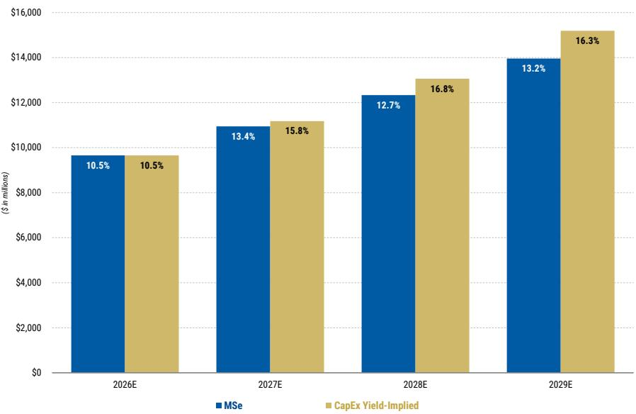

July 30, 2026 05:23 AM GMT

Equinix Inc. | North America

# 2Q26：为增长而投入——重申积极观点并维持首选标的

AlphaSignals 业绩反应

未变
对我们论点的冲击 ↑ 温和上行

财务业绩与市场一致预期对比——基本不变
未来12个月市场一致预期每股收益方向

资料来源：公司数据，MS

Equinix 基于强劲的动能和企业对容量的广泛需求，上调了2026年及长期的收入与AFFO增长指引。鉴于需求信号依然稳健，将2027-2029年的年度资本开支提高至50-70亿美元。小幅上调收入预测，目标价维持1,250美元，重申积极观点，风险回报比约为3倍。

## 关键要点

EQIX 实现年化总预订量4.24亿美元（同比增长23%），高于MSe的3.69亿美元。净互联增加9,700个，月度经常性收入同比增长11%，而MSe为同比增长11.6%。

\- 2026年收入增长指引上调50个基点至同比增长10.7%-11.6%。长期指引上调至年收入增长10%-13%，2029年调整后EBITDA利润率53%以上，年度资本开支50-70亿美元，AFFO每股增长9%-12%。

EQIX 指出，企业客户正广泛采用AI，租户在私有AI基础设施上运行开源模型、部署主权AI技术栈、训练模型并降低延迟。

全球前十大AI模型提供商中的8家以及新云服务商中的8家均在Equinix设施内运行工作负载。我们认为，规模化互联网络是关键驱动因素。

■ 重申积极观点，目标价1,250美元（2027年中），隐含约25倍前瞻AFFO和约26倍前瞻EBITDA。乐观情景下目标价1,500美元，隐含约50%的上行空间和约28倍前瞻AFFO。

对研究展望的影响：EQIX 仍是我们通信基础设施覆盖范围内的首选标的。我们持续看到AI推理工作负载在企业中加速扩散，为规模化、具备电力供应的托管数据中心运营商带来不断增长的容量需求。二季度业绩——总预订量同比增长23%，净互联新增创纪录的9,700个——进一步强化了这一观点。全球前十大AI模型提供商中的8家以及前十大新云服务商中的8家均在Equinix设施内运行关键网络工作负载。我们持续看到AI用例的扩散，尤其是对延迟敏感的需求，将成为收入和AFFO增长的顺风。我们重申积极观点，认为风险回报比具有吸引力（约3倍），并维持2027年中的目标价1,250美元，隐含约25倍前瞻AFFO或约26倍前瞻EBITDA。

尽管二季度的上行主要来自非经常性的xScale费用收入，但三季度指引与预期一致，全年总收入增长指引上调50个基点至同比增长10.7%-11.6%，AFFO每股增长展望上调至11.4%-12.9%。长期来看，Equinix 上调了去年6月分析师日设定的2027-2029年目标，目前预计年收入增长10%-13%，2029年调整后EBITDA利润率53%以上，年度资本开支50-70亿美元，AFFO每股年增长9%-12%。

Equinix 强调了其客户群中正在出现的四类企业AI用例：

\- 技术栈：企业正在私有AI基础设施上运行开源模型，以降低Token成本。

\- 主权：企业正在部署主权AI技术栈，以满足数据驻留和合规要求。

\- 批处理：客户正在Equinix部署AI“卓越中心”和AI工厂，用于模型训练和批量推理。

\- 延迟敏感：企业正在特定城市内部署推理基础设施，以降低延迟和数据回传成本。

资本开支再次上调以加速容量交付：Equinix 二季度资本开支为16亿美元，使2026年上半年支出达到约28亿美元，并将2026年总资本开支指引上调至50-60亿美元（此前我们估计为41亿美元）。季度资本开支中约90%用于扩张，Equinix 计划下半年机柜交付量弹性较高，并将原定于2027年的7,000多个机柜提前至2026年四季度（见附录2的扩张追踪）。Equinix 计划到2029年将杠杆率提高约一个回合，我们预计到2029年底净债务增加约130亿美元，净债务/EBITDA约为4.7倍。

值得注意的是，公司继续预计资产投入运营后三至四年内现金回报率约为25%，而当前稳定资产组合的回报表现为27%。维持25%左右的稳定回报表现是未来进一步上调预测的关键（此前在我们的资本开支回报表现分析中已讨论）。如果Equinix确实能够以约25%的稳定回报表现按此速度上线容量，请参见附录1对收入预测的上行空间。

鉴于机柜交付时间表加快，我们将2026年收入增长预测上调50个基点至同比增长11.6%（此前为11.1%）。资本开支指引意味着Equinix到2029年将利用其3GW控制土地储备中的1GW，其中包括约700MW在建项目和约300MW由扩大后的资本开支计划覆盖。在我们的基准情景中，我们目前预计2026-2029年收入复合年增长率为12.5%，乐观情景假设为14%，推动2029年AFFO每股约63美元。由于扩张所需的总债务增加，AFFO每股预测与之前基本持平。

二季度业绩与预期对比见附录4，预测调整见附录6。

附录1：我们的资本开支回报表现分析假设25%的稳定回报表现，意味着经常性收入同比增长16%以上，如果回报表现保持且Equinix继续应对行业范围内的电力和劳动力约束，则我们的预测存在上行空间

Equinix 经常性收入预测（含同比增速）

  
资料来源：公司数据，MS预测

附录2：IBX扩张追踪显示机柜数量从2027年提前至2026年，我们目前预计2027年基准情景收入增长12%，乐观情景为14%  
EQIX IBX扩张追踪（百万美元）

<table><tr><td rowspan="2"></td><td colspan="11">机柜</td><td rowspan="2">总资本开支（百万美元）</td></tr><tr><td>2Q26</td><td>3Q26E</td><td>4Q26E</td><td>1Q27E</td><td>2Q27E</td><td>3Q27E</td><td>4Q27E</td><td>1Q28E</td><td>2Q28E</td><td>3Q28E</td><td>4Q28E</td></tr><tr><td>美洲</td><td>900</td><td>2,825</td><td>5,875</td><td>4,475</td><td>2,475</td><td>2,350</td><td>2,775</td><td>-</td><td>4,575</td><td>1,625</td><td>1,700</td><td>$4,801</td></tr><tr><td>芝加哥</td><td>-</td><td>700</td><td>700</td><td>-</td><td>700</td><td>-</td><td>-</td><td>-</td><td>1,675</td><td>-</td><td>1,700</td><td>$1,224</td></tr><tr><td>达拉斯</td><td>-</td><td>-</td><td>1,675</td><td>-</td><td>-</td><td>-</td><td>1,850</td><td>-</td><td>1,850</td><td>-</td><td>-</td><td>$1,026</td></tr><tr><td>迈阿密</td><td>-</td><td>475</td><td>-</td><td>-</td><td>-</td><td>-</td><td>600</td><td>-</td><td>-</td><td>-</td><td>-</td><td>$158</td></tr><tr><td>纽约</td><td>-</td><td>1,100</td><td>-</td><td>-</td><td>-</td><td>-</td><td>325</td><td>-</td><td>-</td><td>1,625</td><td>-</td><td>$576</td></tr><tr><td>圣保罗</td><td>-</td><td>-</td><td>600</td><td>-</td><td>700</td><td>-</td><td>-</td><td>-</td><td>-</td><td>-</td><td>-</td><td>$109</td></tr><tr><td>硅谷</td><td>900</td><td>-</td><td>2,050</td><td>-</td><td>-</td><td>-</td><td>-</td><td>-</td><td>1,050</td><td>-</td><td>-</td><td>$708</td></tr><tr><td>华盛顿特区</td><td>-</td><td>-</td><td>-</td><td>4,475</td><td>-</td><td>2,350</td><td>-</td><td>-</td><td>-</td><td>-</td><td>-</td><td>$766</td></tr><tr><td>其他</td><td>-</td><td>550</td><td>850</td><td>-</td><td>1,075</td><td>-</td><td>-</td><td>-</td><td>-</td><td>-</td><td>-</td><td>$234</td></tr><tr><td>EMEA</td><td>825</td><td>1,850</td><td>2,925</td><td>1,425</td><td>475</td><td>325</td><td>675</td><td>4,400</td><td>2,750</td><td>1,350</td><td>775</td><td>$2,941</td></tr><tr><td>法兰克福</td><td>-</td><td>-</td><td>1,400</td><td>-</td><td>-</td><td>-</td><td>-</td><td>2,000</td><td>775</td><td>-</td><td>775</td><td>$1,019</td></tr><tr><td>伊斯坦布尔</td><td>-</td><td>-</td><td>1,325</td><td>-</td><td>-</td><td>-</td><td>-</td><td>-</td><td>-</td><td>-</td><td>-</td><td>$488</td></tr><tr><td>伦敦</td><td>-</td><td>-</td><td>-</td><td>1,425</td><td>-</td><td>-</td><td>-</td><td>1,425</td><td>-</td><td>-</td><td>-</td><td>$365</td></tr><tr><td>巴黎</td><td>-</td><td>-</td><td>200</td><td>-</td><td>475</td><td>-</td><td>-</td><td>-</td><td>600</td><td>-</td><td>-</td><td>$153</td></tr><tr><td>其他</td><td>825</td><td>1,850</td><td>-</td><td>-</td><td>-</td><td>325</td><td>675</td><td>975</td><td>1,375</td><td>1,350</td><td>-</td><td>$916</td></tr><tr><td>亚太</td><td>-</td><td>750</td><td>5,400</td><td>1,350</td><td>2,500</td><td>1,600</td><td>2,675</td><td>975</td><td>250</td><td>675</td><td>500</td><td>$1,816</td></tr><tr><td>香港</td><td>-</td><td>-</td><td>-</td><td>-</td><td>-</td><td>-</td><td>-</td><td>-</td><td>-</td><td>-</td><td>-</td><td>$0</td></tr><tr><td>柔佛</td><td>-</td><td>-</td><td>1,100</td><td>1,125</td><td>-</td><td>-</td><td>-</td><td>725</td><td>-</td><td>675</td><td>-</td><td>$511</td></tr><tr><td>大阪</td><td>-</td><td>-</td><td>-</td><td>-</td><td>-</td><td>500</td><td>400</td><td>250</td><td>250</td><td>-</td><td>500</td><td>$355</td></tr><tr><td>新加坡</td><td>-</td><td>-</td><td>1,550</td><td>-</td><td>-</td><td>-</td><td>-</td><td>-</td><td>-</td><td>-</td><td>-</td><td>$290</td></tr><tr><td>悉尼</td><td>-</td><td>-</td><td>1,350</td><td>-</td><td>-</td><td>-</td><td>-</td><td>-</td><td>-</td><td>-</td><td>-</td><td>$96</td></tr><tr><td>东京</td><td>-</td><td>750</td><td>-</td><td>225</td><td>-</td><td>-</td><td>-</td><td>-</td><td>-</td><td>-</td><td>-</td><td>$97</td></tr><tr><td>其他</td><td>-</td><td>-</td><td>1,400</td><td>-</td><td>2,500</td><td>1,100</td><td>2,275</td><td>-</td><td>-</td><td>-</td><td>-</td><td>$467</td></tr><tr><td>总计</td><td>1,725</td><td>5,425</td><td>14,200</td><td>7,250</td><td>5,450</td><td>4,275</td><td>6,125</td><td>5,375</td><td>7,575</td><td>3,650</td><td>2,975</td><td>$9,558</td></tr></table>

<table><tr><td></td><td colspan="12">较上次变动</td></tr><tr><td>美洲</td><td>-550</td><td>550</td><td>1,550</td><td>2,125</td><td>-2,600</td><td>-1,075</td><td>600</td><td>-</td><td>1,675</td><td>-</td><td>1,700</td><td>907</td></tr><tr><td>EMEA</td><td>-1,050</td><td>-275</td><td>2,725</td><td>-1,400</td><td>-</td><td>-</td><td>-</td><td>250</td><td>-</td><td>1,350</td><td>-</td><td>602</td></tr><tr><td>亚太</td><td>-</td><td>-</td><td>4,275</td><td>-2,650</td><td>-</td><td>-1,200</td><td>200</td><td>975</td><td>250</td><td>675</td><td>-850</td><td>81</td></tr><tr><td>总计</td><td>-1,600</td><td>275</td><td>8,550</td><td>-1,925</td><td>-2,600</td><td>-2,275</td><td>800</td><td>1,225</td><td>1,925</td><td>2,025</td><td>850</td><td>$1,590</td></tr></table>

资料来源：公司数据，MS预测

EQIX xScale扩张追踪（百万美元）  
附录3：xScale扩张追踪

<table><tr><td>xScale项目</td><td colspan="9">2Q26业绩</td></tr><tr><td rowspan="2"></td><td colspan="5">数值</td><td colspan="4">较上次变动</td></tr><tr><td>完工时间</td><td>容量（MW）</td><td>已租出（MW）</td><td>已租出（%）</td><td>成本</td><td>完工时间</td><td>容量（MW）</td><td>已租出（%）</td><td>成本</td></tr><tr><td>美洲</td><td></td><td>120</td><td>120</td><td>100%</td><td>$1,264</td><td></td><td></td><td></td><td></td></tr><tr><td>亚特兰大10x-1</td><td>2Q27</td><td>60</td><td>60</td><td>100%</td><td>$632</td><td>新增</td><td>+60</td><td>+100%</td><td>+$632</td></tr><tr><td>亚特兰大11x-1</td><td>4Q27</td><td>60</td><td>60</td><td>100%</td><td>$632</td><td>新增</td><td>+60</td><td>+100%</td><td>+$632</td></tr><tr><td>EMEA</td><td></td><td>42</td><td>42</td><td>100%</td><td>$578</td><td></td><td></td><td></td><td></td></tr><tr><td>巴黎12x-1</td><td>3Q26</td><td>14</td><td>14</td><td>100%</td><td>$277</td><td>延迟1个季度</td><td>-</td><td>-</td><td>-</td></tr><tr><td>米兰7x-3</td><td>2Q26</td><td>10</td><td>10</td><td>100%</td><td>$78</td><td>1Q提前完工</td><td>-</td><td>-</td><td>+$11</td></tr><tr><td>巴黎12x-2</td><td>4Q26</td><td>14</td><td>14</td><td>100%</td><td>$145</td><td>-</td><td>-</td><td>-</td><td>-</td></tr><tr><td>都柏林7x-1</td><td>4Q27</td><td>4</td><td>4</td><td>100%</td><td>$78</td><td>-</td><td>-</td><td>-</td><td>-</td></tr><tr><td>亚太</td><td></td><td>53</td><td>39</td><td>74%</td><td>$434</td><td></td><td>-</td><td></td><td></td></tr><tr><td>悉尼9x-2</td><td>3Q26</td><td>14</td><td>0</td><td>0%</td><td>$137</td><td>-</td><td>-</td><td>-</td><td>-</td></tr><tr><td>大阪5x-1</td><td>1Q27</td><td>19</td><td>19</td><td>100%</td><td>$177</td><td>-</td><td>-</td><td>-</td><td>-</td></tr><tr><td>xScale总计</td><td></td><td>215</td><td>201</td><td>93%</td><td>$2,276</td><td></td><td></td><td></td><td></td></tr></table>

资料来源：公司数据，MS

# 实际业绩与预测对比

EQUINIX
差异表
代码：EQIX
评级：积极

<table><tr><td colspan="2">（百万美元，除每股和机柜数量外）</td><td>MSe 2Q26E</td><td>实际 2Q26</td><td colspan="2">较MSe变动 $ %</td><td>市场一致预期 2Q26E</td><td colspan="2">较市场一致预期变动 $ %</td></tr><tr><td colspan="9">关键财务指标</td></tr><tr><td>总收入</td><td>2,444</td><td>2,582</td><td>2,625</td><td>43</td><td>1.7%</td><td>2,591</td><td>34</td><td>1.3%</td></tr><tr><td>同比增速</td><td>9.8%</td><td>14.5%</td><td>16.4%</td><td></td><td>189个基点</td><td>14.9%</td><td></td><td>150个基点</td></tr><tr><td>环比增速</td><td>1.0%</td><td>5.7%</td><td>7.4%</td><td></td><td>175个基点</td><td>6.0%</td><td></td><td>139个基点</td></tr><tr><td>经常性收入</td><td>2,331</td><td>2,392</td><td>2,377</td><td>(15)</td><td>(0.6%)</td><td>2,410</td><td>(33)</td><td>(1.4%)</td></tr><tr><td>同比增速</td><td>11.7%</td><td>11.6%</td><td>10.9%</td><td></td><td>(72个基点)</td><td>12.5%</td><td></td><td>(155个基点)</td></tr><tr><td>环比增速</td><td>1.6%</td><td>2.6%</td><td>2.0%</td><td></td><td>(66个基点)</td><td>3.4%</td><td></td><td>(143个基点)</td></tr><tr><td>非经常性收入</td><td>113</td><td>190</td><td>248</td><td>58</td><td>30.5%</td><td>181</td><td>67</td><td>37.1%</td></tr><tr><td>现金成本收入</td><td>765</td><td>801</td><td>790</td><td>(11)</td><td>(1.3%)</td><td>784</td><td>6</td><td>0.7%</td></tr><tr><td>现金毛利</td><td>1,679</td><td>1,782</td><td>1,835</td><td>53</td><td>3.0%</td><td>1,807</td><td>28</td><td>1.6%</td></tr><tr><td>毛利率</td><td>68.7%</td><td>69.0%</td><td>69.9%</td><td></td><td>90个基点</td><td>69.7%</td><td></td><td>18个基点</td></tr><tr><td>现金运营支出</td><td>434</td><td>424</td><td>439</td><td>15</td><td>3.7%</td><td>444</td><td>(5)</td><td>(1.2%)</td></tr><tr><td>调整后EBITDA</td><td>1,245</td><td>1,358</td><td>1,396</td><td>38</td><td>2.8%</td><td>1,362</td><td>34</td><td>2.5%</td></tr><tr><td>利润率</td><td>50.9%</td><td>52.6%</td><td>53.2%</td><td></td><td>58个基点</td><td>52.6%</td><td></td><td>60个基点</td></tr><tr><td>同比增速</td><td>16.7%</td><td>20.3%</td><td>23.6%</td><td></td><td>334个基点</td><td>20.7%</td><td></td><td>297个基点</td></tr><tr><td>折旧与摊销</td><td>544</td><td>572</td><td>557</td><td>(15)</td><td>(2.6%)</td><td>573</td><td>(16)</td><td>(2.8%)</td></tr><tr><td>利息支出</td><td>148</td><td>154</td><td>151</td><td>(3)</td><td>(2.2%)</td><td>156</td><td>(5)</td><td>(3.1%)</td></tr><tr><td>摊薄每股收益</td><td>$4.20</td><td>$4.82</td><td>$4.83</td><td>$0.01</td><td>0.2%</td><td>$4.71</td><td>$0.12</td><td>2.6%</td></tr><tr><td>调整后FFO</td><td>1,065</td><td>1,127</td><td>1,168</td><td>41</td><td>3.6%</td><td>1,125</td><td>43</td><td>3.8%</td></tr><tr><td>AFFO / 摊薄每股</td><td>$10.79</td><td>$11.39</td><td>$11.78</td><td>$0.39</td><td>3.4%</td><td>$11.36</td><td>$0.42</td><td>3.7%</td></tr><tr><td>同比增速</td><td>11.5%</td><td>14.9%</td><td>18.8%</td><td></td><td>388个基点</td><td>14.6%</td><td></td><td>420个基点</td></tr><tr><td>季度总预订量（年化）</td><td>378</td><td>369</td><td>424</td><td>55</td><td>15.0%</td><td></td><td></td><td></td></tr><tr><td>同比增速</td><td>8.6%</td><td>6.9%</td><td>22.9%</td><td></td><td>1600个基点</td><td></td><td></td><td></td></tr><tr><td colspan="9">资本开支</td></tr><tr><td>资本开支（不含xScale/土地）</td><td>1,256</td><td>764</td><td>1,578</td><td>814</td><td>106.5%</td><td>860</td><td>718</td><td>83.5%</td></tr><tr><td>占收入比例</td><td>51.4%</td><td>29.6%</td><td>60.1%</td><td></td><td>3052个基点</td><td>33.2%</td><td></td><td>2693个基点</td></tr><tr><td colspan="9">经常性收入分部</td></tr><tr><td>托管</td><td>1,730</td><td>1,780</td><td>1,772</td><td>(8)</td><td>(0.4%)</td><td>1,793</td><td>(21)</td><td>(1.1%)</td></tr><tr><td>同比增速</td><td>12.0%</td><td>12.3%</td><td>11.8%</td><td></td><td>(48个基点)</td><td>13.1%</td><td></td><td>(130个基点)</td></tr><tr><td>互联</td><td>446</td><td>455</td><td>453</td><td>(2)</td><td>(0.5%)</td><td>457</td><td>(4)</td><td>(0.9%)</td></tr><tr><td>同比增速</td><td>13.5%</td><td>11.9%</td><td>11.3%</td><td></td><td>(61个基点)</td><td>12.3%</td><td></td><td>(102个基点)</td></tr><tr><td>管理基础设施</td><td>115</td><td>119</td><td>112</td><td>(7)</td><td>(5.7%)</td><td>121</td><td>(9)</td><td>(7.4%)</td></tr><tr><td>同比增速</td><td>0.0%</td><td>1.5%</td><td>(4.3%)</td><td></td><td>(576个基点)</td><td>3.3%</td><td></td><td>(762个基点)</td></tr><tr><td>其他</td><td>40</td><td>39</td><td>40</td><td>2</td><td>3.9%</td><td>38</td><td>2</td><td>5.7%</td></tr><tr><td colspan="9">关键KPI</td></tr><tr><td colspan="9">全球</td></tr><tr><td>可售机柜</td><td>393,800</td><td>397,125</td><td>395,500</td><td>(1,625)</td><td>(0.4%)</td><td>397,274</td><td>(1,774)</td><td>(0.4%)</td></tr><tr><td>计费机柜</td><td>303,400</td><td>310,677</td><td>307,600</td><td>(3,077)</td><td>(1.0%)</td><td>309,152</td><td>(1,552)</td><td>(0.5%)</td></tr><tr><td>交叉连接</td><td>513,000</td><td>533,275</td><td>522,700</td><td>(10,575)</td><td>(2.0%)</td><td>521,896</td><td>804</td><td>0.2%</td></tr><tr><td>可售机柜同比增速</td><td>5.9%</td><td>5.6%</td><td>5.2%</td><td></td><td>(43个基点)</td><td>5.7%</td><td></td><td>(47个基点)</td></tr><tr><td>计费机柜同比增速</td><td>4.2%</td><td>6.2%</td><td>5.2%</td><td></td><td>(105个基点)</td><td>5.7%</td><td></td><td>(53个基点)</td></tr><tr><td>交叉连接同比增速</td><td>5.5%</td><td>8.3%</td><td>6.2%</td><td></td><td>(215个基点)</td><td>6.0%</td><td></td><td>16个基点</td></tr></table>

\*隐含MRR/机柜定义与EQIX报告的MRR/机柜不同  
\*\*市场一致预期全球MRR/机柜按加权平均计算

资料来源：公司数据，Visible Alpha，MS预测

## 预测

附录5：2026财年指引与MSe对比

<table><tr><td>发布季度</td><td colspan="5">2Q26（2026年7月29日）</td></tr><tr><td rowspan="2">指引年份</td><td colspan="5">2026</td></tr><tr><td>低值</td><td>高值</td><td>中值</td><td>MSe</td><td>差异</td></tr><tr><td>总收入（百万美元）</td><td>10,205</td><td>10,285</td><td>10,245</td><td>10,283</td><td>0.4%</td></tr><tr><td>同比增速（隐含）</td><td>10.7%</td><td>11.6%</td><td>11.2%</td><td>11.6%</td><td>41个基点</td></tr><tr><td>调整后EBITDA（百万美元）</td><td>5,210</td><td>5,270</td><td>5,240</td><td>5,267</td><td>0.5%</td></tr><tr><td>利润率（隐含）</td><td>51.1%</td><td>51.2%</td><td>51.1%</td><td>51.2%</td><td>8个基点</td></tr><tr><td>净利息支出（百万美元）</td><td>(440)</td><td>(440)</td><td>(440)</td><td>(449)</td><td>2.0%</td></tr><tr><td>经常性资本开支（百万美元）</td><td>(300)</td><td>(300)</td><td>(300)</td><td>(300)</td><td>(0.1%)</td></tr><tr><td>税费支出（百万美元）</td><td>(205)</td><td>(205)</td><td>(205)</td><td>(208)</td><td>1.4%</td></tr><tr
