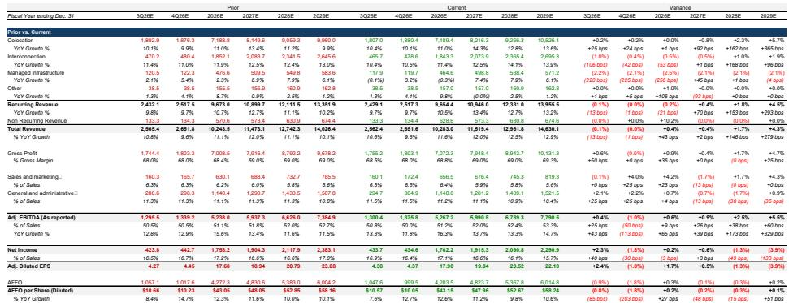
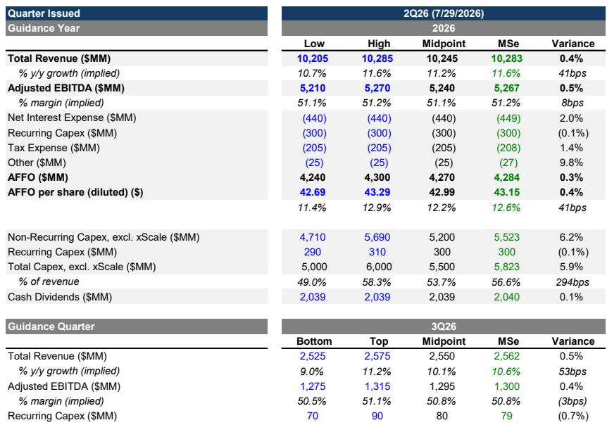
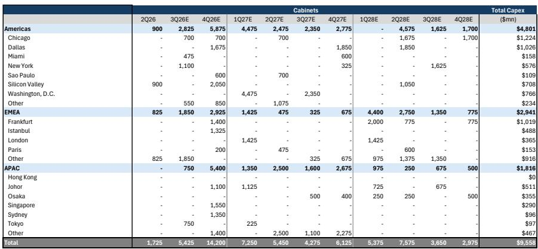

# MS：Equinix业务与季度数据观察

数据中心运营商Equinix在2026年第二季度交出了一组值得注意的数字：年化毛预订量4.24亿美元，同比增长23%，高于MS预期的3.69亿美元；净互联新增9,700个，月度经常性收入同比增长11%。更关键的是，公司把2026年收入增长指引上调50个基点至10.7%至11.6%，并将2027至2029年的年度资本开支计划提高到50亿至70亿美元。

这份MS研报认为，Equinix正在把AI推理负载的扩散转化为实际的基础设施需求。报告维持超配评级，并继续将其列为通信基础设施覆盖范围内的首选标的。报告同时指出，第二季度的超预期部分来自非经常性的xScale费用收入，第三季度指引与预期基本一致。

## 1. 企业AI采用呈现四种明确的使用模式

Equinix在客户群中识别出四类正在落地的企业AI场景。第一类是私有AI基础设施上运行开源模型，以降低token成本；第二类是主权AI部署，满足数据驻留和合规要求；第三类是模型训练和批量推理的AI工厂；第四类是对延迟敏感的推理负载，企业将基础设施放在特定城市以降低延迟和数据回传成本。

这四类场景的共同指向是：AI推理正在从云端集中走向企业分布式部署。报告特别提到，全球前十大AI模型提供商中有八家、前十大neocloud中有八家，都在Equinix设施内运行关键网络负载。互联网络规模成为承接这些负载的核心能力。

> **KC评论：** 这里值得注意的不是AI训练需求，而是推理负载的地理分布特征。当企业把推理放在离用户更近的城市，数据中心运营商的选址和互联能力就变成比单纯电力容量更重要的竞争变量。

## 2. 资本开支加速与机柜交付节奏形成匹配

Equinix第二季度资本开支16亿美元，上半年合计约28亿美元，全年指引上调至50亿至60亿美元。约90%的季度资本开支投向扩张项目。公司计划下半年将机柜交付量弹性较高，并把原定2027年交付的超过7,000个机柜提前到2026年第四季度。

MS的扩张追踪表显示，2026年第四季度单季机柜交付预计达到14,200个，其中美洲5,875个、亚太5,400个。对照此前预期，这一季度净增加了8,550个机柜的交付计划。报告认为，这一节奏意味着Equinix到2029年将使用其3吉瓦可控土地储备中的约1吉瓦，其中约700兆瓦在建、约300兆瓦由扩大的资本开支计划覆盖。

## 3. 稳定回报表现假设决定估值上修空间

报告的核心假设是新建资产投产后三至四年内实现约25%的现金回报率，而当前稳定运营组合的回报表现约为27%。MS认为，维持25%左右的稳定回报表现是后续进一步上修盈利预测的关键前提。

在25%回报表现假设下，报告测算Equinix的经常性收入同比增长可达16%以上。基准情形下，2026至2029年收入复合增速为12.5%，乐观情形为14%，对应2029年AFFO每股约63美元。值得注意的是，尽管扩张带来的债务增加，AFFO每股预测与先前基本持平——报告预计到2029年底净债务增加约130亿美元，净债务与EBITDA之比约4.7倍。

> **KC评论：** 资本开支弹性较高并不自动转化为盈利增长。真正需要跟踪的是新增产能的爬坡速度和实际回报表现能否贴近25%的假设。如果回报表现低于预期，收入上修空间会被债务成本侵蚀。

## 4. 互联网络规模成为AI负载分发的核心资产

报告反复强调的一个事实是：Equinix的互联网络规模正在成为AI推理负载分发的关键基础设施。8家高质量AI模型提供商和8家neocloud在Equinix设施内运行负载，这一集中度在传统数据中心运营商中并不常见。

对于观察数据中心行业的读者，这份报告提供了一个分析框架：区分训练集群和推理集群的基础设施需求。训练集群追求集中和电力密度，推理集群则更看重地理分布和网络互联。Equinix的扩张计划——从美洲的硅谷、华盛顿特区到亚太的新加坡、悉尼——恰好对应推理负载的城市分布逻辑。

报告也保留了必要的限定：第二季度的部分超预期来自非经常性收入，第三季度指引与市场预期一致。这意味着资本开支加速的成效仍需通过后续季度的经常性收入增长来验证。

For informational purposes only. Portions may be generated,translated,summarized,or edited with AI assistance based on source materials and may contain omissions or errors. Please verify independently. This is not investment,legal,tax,accounting,or other professional advice.

For informational purposes only. Portions may be generated,translated,summarized,or edited with AI assistance based on source materials and may contain omissions or errors. Please verify independently. This is not investment,legal,tax,accounting,or other professional advice.

