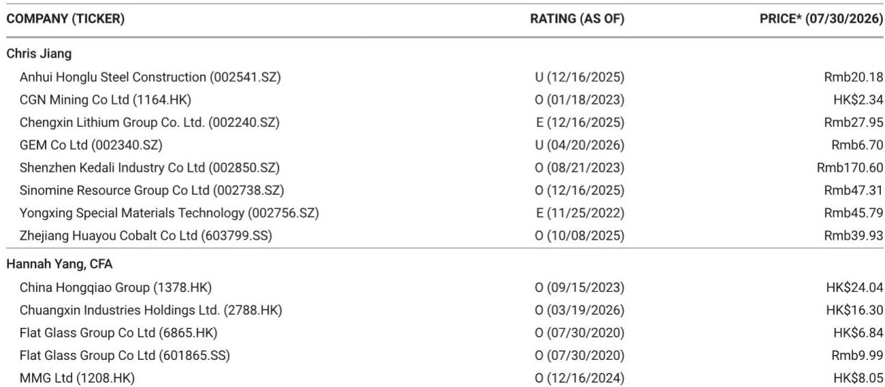
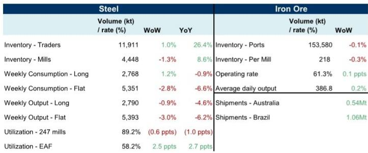
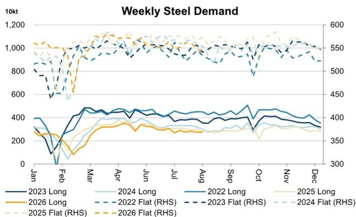

# 中国钢铁市场出现分化，这一信号或预示铁矿石下一步走向

本周中国钢铁和铁矿石数据中最重要的信息并非某个单一数字，而是一种分化。长材（建筑用螺纹钢和线材）的表观消费量环比上升1.2%，而板材（制造业用的热轧卷板和薄板）的消费量环比下降2.8%。这并非四舍五入的误差，也不是一次性的波动。这是迄今最清晰的信号，表明中国钢铁需求正从出口导向的制造业板块转向国内建筑领域——至少目前如此。关注铁矿石的读者应密切关注，因为这种轮动将决定钢厂是积极补库还是继续维持低库存。

7月20日至26日当周的数据还显示出供给端一个耐人寻味的现象。长材和板材的周产量均出现下降，分别环比减少0.9%和3.0%，Mysteel跟踪的247家综合钢厂产能利用率下降0.6个百分点至89.2%。然而，电弧炉产能利用率却跃升2.5个百分点至58.2%，同比提高2.7个百分点。以废钢为原料的产能正在扩张，而高炉路线则在收缩。这不仅是技术细节，它改变了钢铁生产的边际成本曲线，进而影响铁矿石的需求。

市场并未在定价一场崩跌或繁荣，而是在定价一次再平衡。贸易商钢材库存环比上升1.0%至1191万吨，同比高出26.4%；钢厂库存则下降1.3%至445万吨。港口铁矿石库存基本持平于1.5358亿吨，仅微降0.1%；钢厂铁矿石库存环比下滑0.3%至21.8万吨。整体呈现谨慎均衡的格局：没有人在大规模建仓，也没有人在抛售。问题在于哪一方会率先打破僵局。

本周的关键变量来自澳大利亚和巴西的供给响应。两大铁矿石出口国的合计发运量环比增加159万吨，其中澳大利亚增加54万吨，巴西增加106万吨。这一变化值得关注，因为它发生在中国钢厂并未增加铁矿石库存的背景下。 incoming supply 与国内需求之间的缺口正在扩大，而历史经验表明，这一缺口最终通过价格而非数量来弥合。

## 长材与板材的分化并非季节性扰动，而是中国增长引擎的结构性转变

长材消费上升与板材消费下降之间4.0个百分点的落差，是近期记忆中最大的周度分化。长材是城市基础设施、住宅建设和公共工程的材料；板材则是汽车、白色家电、船舶和工业机械的投入品。当两者反向运动时，意味着中国钢铁需求的两大引擎已不再同步。

同比数据使这一趋势更加清晰。长材消费同比仅下降0.9%，基本持平；板材消费则同比下降6.6%。过去一年中，制造业板块一直是相对落后的一方，本周数据证实这一拖累并未减弱。板材消费环比2.8%的降幅是该序列中最大的单周跌幅，表明上半年让中国钢厂保持忙碌的出口订单正在逐渐减少。

从战略层面看，中国钢铁需求正变得更加内需导向、更加依赖建筑驱动、更加倚重政府主导的基础设施支出。对铁矿石而言，这是一把双刃剑。建筑用钢每吨的铁矿石强度高于板材钢，因为板材生产往往掺入更多废钢。理论上，转向长材应对铁矿石需求形成温和支撑。但消费的相对水平才是关键，板材的疲弱正在拖累总量。

贸易商正在为此布局。其库存环比上升1.0%，同比高出26.4%——这是一笔规模可观的投机性押注，押注价格将上涨，但目前尚未兑现。相比之下，钢厂库存下降1.3%，表明生产商信心不足，不愿自行累积库存，而是将压力转移给贸易商。在一个生产商去风险而贸易商囤货的市场中，除非需求加速，否则下一步价格走势通常是下行。

## 综合钢厂产能利用率下降叠加电弧炉开工率上升，预示成本结构正在变化

247家高炉钢厂产能利用率下降0.6个百分点，单独看并不剧烈，但与电弧炉产能利用率2.5个百分点的跃升放在一起，意义就变得显著。消耗铁矿石和焦炭的综合钢厂在减产，消耗废钢和电力的电弧炉在增产。这是边际上的替代，对铁矿石需求有直接影响。

电弧炉产能利用率58.2%仍远低于综合钢厂的89.2%，但趋势才是关键。同比来看，电弧炉开工率上升2.7个百分点，正接近废钢基生产成为市场中具有实质影响力的变量的水平。每吨电弧炉钢产量大约替代1.6吨铁矿石需求（视品位和工艺而定）。如果电弧炉开工率继续以当前速度上升，中国钢铁行业对铁矿石的增量需求将弱于总体产量数字所暗示的水平。

成本曲线也在移动。废钢价格相对稳定，而铁矿石则因海运供给增加而承压。这使得电弧炉路线在边际上更具竞争力——这正是产能利用率数据所显示的。这不是暂时的套利机会，而是中国钢铁生产方式的结构性变化。政府推动低碳排放的政策方向利好电弧炉，而经济性现在正与政策方向趋于一致。

对铁矿石生产商而言，这是一个警示。市场关注的不仅是中国的钢铁产量，还有这些产量通过何种工艺路线生产。中国钢铁产量中电弧炉占比每提高1个百分点，每年将减少约200万吨铁矿石需求。当前数据表明这一转变正在进行中，如果废钢价格保持竞争力，这一转变还将加速。

## 海运铁矿石供给上升恰逢中国钢厂维持低库存，价格敏感的平衡正在形成

澳巴发运量环比增加159万吨，这是供给端的变量，对价格并不友好。澳大利亚增加54万吨，巴西增加106万吨——这一分布值得注意。巴西矿石通常品位更高、享有溢价，因此巴西发运量增幅更大意味着海运供给的质量结构在改善，即便总量也在增长。

中国钢厂并未消化这部分供给。钢厂铁矿石库存环比下降0.3%至21.8万吨，港口库存持平于1.5358亿吨。钢厂开工率微升0.1个百分点至61.3%，日均产量环比上升0.2%至38.68万吨，但这些边际增长不足以支撑补库行为。钢厂维持低库存运营，按需采购，让海运供给在港口累积。

这是价格修正的经典格局。当供给上升而买方不增加库存持有量时，过剩供给只能流向现货市场，对价格形成下行压力。港口库存未因发运量增加而上升，说明矿石正在被消耗，但这种消耗并未产生足够的信心来触发补库。这表明钢厂预期价格将下跌，而非上涨。

港口库存下降0.1%是关键数字。发运量增加159万吨，港口库存本应相应上升，除非消耗吸收了差额。库存持平意味着在当前价格水平下，消耗与供给保持同步。但这是一个脆弱的均衡。任何钢铁生产的放缓——产能利用率下降已暗示这一点——都将使天平倒向库存累积和价格下行。

## 贸易商与钢厂之间的库存分布是近期钢价最佳的领先指标

钢材市场发出的信号比铁矿石市场更清晰。贸易商库存环比上升1.0%至1191万吨，而钢厂库存下降1.3%至445万吨。贸易商与钢厂库存之比现为2.68，接近历史区间的高端。这一分布之所以重要，是因为贸易商和钢厂的价格激励不同。

钢厂是短期价格制定者，它们发布挂牌价并每周调整。贸易商是价格接受者，从钢厂进货再卖给终端用户。当钢厂库存低时，钢厂有底气坚持价格；当贸易商库存高时，贸易商面临出货压力，意味着打折。当前低钢厂库存与高贸易商库存的组合因此是矛盾的。它表明钢厂有信心坚持价格，但贸易商没有信心在无价格激励的情况下持有库存。

同比对比更为鲜明。贸易商库存同比上升26.4%，而钢厂库存同比仅上升8.6%。系统库存的全部增量都被贸易商吸收，他们现在承担着风险。如果需求不加速，贸易商将被迫去库存，这将推动价格下行——无论钢厂意愿如何。

这是未来两周的决策框架。关注贸易商库存数据。如果下周再次上升，意味着需求未能吸收供给，价格将走软。如果持平或下降，说明终端用户终于入场，市场可以企稳。钢厂库存数据是次要的；它已经很低，在不触发生产响应的情况下难以进一步大幅下降。

## 铁矿石或钢材读者解读周度数据的实用框架

Mysteel的周度数据噪音较大，但可以组织成一个简单的决策树。第一个节点是长材与板材的消费分化。如果长材上升而板材下降，说明建筑在引领、制造业在滞后。这在短期内利好铁矿石而非废钢，但也暗示整体需求偏弱，因为板材的体量基数更大。第二个节点是电弧炉与综合钢厂的产能利用率。如果电弧炉上升而综合钢厂下降，钢铁生产的铁矿石强度在下降，即使钢铁产量稳定，对矿石也是偏空信号。

第三个节点是库存分布。如果贸易商库存增速快于钢厂库存，投机性多头在累积，价格修正的风险在上升。如果钢厂库存下降而贸易商库存稳定，生产商在去风险，这也是偏空信号。只有当钢厂和贸易商库存同时下降时，市场才是无歧义的健康状态，因为这意味需求在链条的每一层都在吸收供给。

第四个节点是海运供给趋势。澳巴发运量环比增加在北半球夏季是正常现象，但关键在于增量是否被吸收。如果港口库存持平或下降而发运量上升，消耗是稳健的。如果港口库存上升，市场处于供给过剩状态。本周，港口库存下降0.1%，而发运量增加159万吨，这是一个温和的正面信号，但被钢材市场偏空的库存分布所抵消。

将这一框架应用于当前数据，得出谨慎的展望。长材与板材的分化对铁矿石温和利好，但电弧炉产能利用率趋势并非如此。贸易商库存累积是一个警示，海运供给增加是逆风。总体图景是一个平衡但脆弱的市场，如果上述任一因素恶化，天平将倒向价格下行。未来两周最可能的情景是钢价温和下跌，铁矿石随之承压——除非贸易商库存数据意外下降。

相对少见能改变这一判断的数据是板材消费的显著回升。那将标志着制造业反弹，能够吸收贸易商库存并支撑当前价格水平。在这一情况出现之前，审慎的立场是假设当前均衡是暂时的，市场将趋向于更低的价格。

*仅供参考。部分内容可能由AI基于原始材料生成、翻译、摘要或编辑，可能包含遗漏或错误。请独立核实。本文不构成投资、法律、税务、会计或其他专业建议。*

仅供参考。部分内容可能由AI基于原始材料生成、翻译、摘要或编辑，可能包含遗漏或错误。请独立核实。本文不构成投资、法律、税务、会计或其他专业建议。

