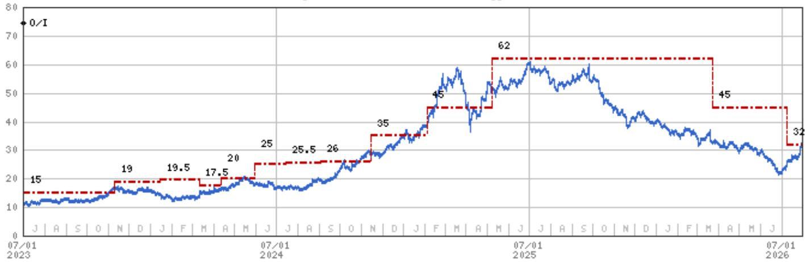

July 30, 2026 04:22 PM GMT

Xiaomi Corp | Asia Pacific

# SkyNomad定价受关注，销量前景展望积极

## 核心要点

SkyNomad潜在的销售表现是公司市场表现的一个积极因素。

小米今日为其新电动汽车品牌SkyNomad举办了技术发布会，这标志着小米首次进入增程式电动汽车领域。

SkyNomad N90 Max：旗舰七座增程式SUV，定价人民币299.9k。

SkyNomad N70 Max：大型五座全轮驱动增程式SUV，定价人民币259.9k。

正式发布及完整定价预计在2026年9月。

我们认为两款车型的"Pro"版和标准版将设定更低的价位。我们预计N70系列的价格区间为人民币200-250k，N90系列的价格区间为人民币250-300k。

小米旨在通过智能化重新定义空间，认为座舱空间不应是静态的，而应灵活适应用户的需求和偏好。有关此类设计的更多细节，请参阅小米集团：SkyNomad于7月30日在北京的技术发布会（2026年7月27日）。

凭借创新设计和有吸引力的定价，我们认为SkyNomad很有可能取得良好的销售表现。

MS ASIA LIMITED+

Andy Meng, CFA

股票分析师

Andy.Meng@morganstanley.com +852 2239-7689

Betty Chen

研究助理

Betty.H.Chen@morganstanley.com +852 2239-7213

## 亚洲暑期学校 2026

## 小米集团 (1810.HK, 1810 HK)

## 首选标的

大中华区科技硬件 | 中国

<table><tr><td>股票评级</td><td>增持</td></tr><tr><td>行业观点</td><td>同步</td></tr><tr><td>目标价</td><td>HK$32.00</td></tr><tr><td>收盘价（2026年7月30日）</td><td>HK$31.04</td></tr><tr><td>52周区间</td><td>HK$59.90-21.30</td></tr><tr><td>摊薄后股本（百万）</td><td>26,695</td></tr><tr><td>当前市值（百万）</td><td>Rmb714,965.6</td></tr><tr><td>企业价值（百万）</td><td>Rmb816,723.7</td></tr><tr><td>日均成交额（百万）</td><td>HK$6,639</td></tr></table>

MS与报告所覆盖的公司有业务往来。因此，读者应注意，该公司可能存在影响MS客观性的利益冲突。读者应将MS视为其决策的单一因素之一。

有关分析师认证和其他重要披露，请参阅本报告末尾的披露部分。

+= 非美国关联公司聘用的分析师未在FINRA注册，可能不是该成员的关联人员，并且可能不受FINRA关于与标的公司沟通、公开露面以及交易研究分析师账户持有的证券的限制。

## 估值方法与风险

## 小米集团 (1810.HK)

基准情景，分部加总。

■ 对三个业务部门采用剩余收益（RI）模型。我们对智能手机业务应用11%的股权成本，对IoT应用11%，对互联网服务应用11.4%，终端增长率分别为3%、3%和6%。

■ 电动汽车业务：DCF，概率加权20%看涨、60%基准、20%看跌，以反映电动汽车业务的可能结果。WACC 12.2%，终端增长率5%。

■ 我们加上研究价值。

## 上行风险

■ 新电动车型的订单和客户反馈好于预期

■ 在中国线下扩张的良好推进，带来可观的销量贡献

■ 海外市场份额进一步提升

## 下行风险

■ 电动汽车竞争持续激烈

■ 库存去化和需求变化对智能手机毛利率构成影响

■ 对智能电动汽车投入的关注度上升，可能带来一定影响

## 披露部分

MS中的信息和意见由MS Asia Limited（对其内容负责）和/或MS Asia (Singapore) Pte.（注册号199206298Z）和/或MS Asia (Singapore) Securities Pte Ltd（注册号200008434H）（受新加坡金融管理局监管，对其内容承担法律责任，如有任何问题请联系）和/或MS Taiwan Limited和/或MS & Co International plc首尔分行和/或MS Australia Limited（ABN 67 003 734 576，澳大利亚金融服务牌照号233742，对其内容负责）和/或MS Wealth Management Australia Pty Ltd（ABN 19 009 145 555，澳大利亚金融服务牌照号240813，对其内容负责）和/或MS India Company Private Limited（公司识别号CIN U22990MH1998PTC115305，受印度证券交易委员会（SEBI）监管，持有研究分析师牌照（SEBI注册号INH000001105）；股票经纪人（SEBI股票经纪人注册号INZ000244438）、商业银行家（SEBI注册号INM000011203）以及国家证券存管有限公司存管参与者（SEBI注册号IN-DP-NSDL-567-2021），注册办公地址为Altimus, Level 39 & 40, Pandurang Budhkar Marg, Worli, Mumbai 400018, India；电话+91-22-61181000；合规官详情：Tejarshi Hardas先生，电话+91-22-61181000或电邮tejarshi.hardas@morganstanley.com；投诉官详情：Tejarshi Hardas先生，电话+91-22-61181000或电邮msic-compliance@morganstanley.com，其负责内容，如有任何问题请联系）及其关联公司（统称"MS"）编制或传播。MS India Company Private Limited (MSICPL) 可能在使用AI工具提供研究服务。本报告中的所有建议均由具备适当资格的研究分析师做出。

有关本报告涉及公司的重大披露、股价图表和股票评级历史，请访问MS披露网站 www.morganstanley.com/eqr/disclosures/webapp/generalresearch，或联系您的投资代表或MS，地址：1585 Broadway, (Attention: Research Management), New York, NY, 10036 USA。

有关本研究报告引用的任何建议、评级或目标价相关的估值方法和风险，请联系客户支持团队：美国/加拿大 +1 800 303-2495；香港 +852 2848-5999；拉丁美洲 +1 718 754-5444（美国）；伦敦 +44 (0)20-7425-8169；新加坡 +65 6834-6860；悉尼 +61 (0)2-9770-1505；东京 +81 (0)3-6836-9000。或者，您可以联系您的投资代表或MS，地址：1585 Broadway, (Attention: Research Management), New York, NY 10036 USA。

## 分析师认证

以下分析师特此证明，他们对本报告中讨论的公司及其证券的看法准确反映了他们的观点，并且他们未曾也不会因提供具体的建议或观点而获得直接或间接的补偿：Andy Meng, CFA。

## 全球研究冲突管理政策

MS已根据我们的冲突管理政策发布，该政策可在 www.morganstanley.com/institutional/research/conflictpolicies 获取。该政策的葡萄牙语版本可在 www.morganstanley.com.br 找到。

## 关于标的公司的重要监管披露

截至2026年6月30日，MS实益拥有MS所覆盖的以下公司普通股股本1%或以上：AAC Technologies Holdings, Accton Technology Corporation, AirTAC International, AU Optronics, Auras Technology Co Ltd, Bizlink, BOE Technology, Catcher Technology, Chenbro, Chroma Ate Inc., Compal Electronics, Delta Electronics Inc., E Ink Holdings Inc., Eoptolink Technology Inc Ltd, Fositek Corp, Genius Electronic Optical Co. Ltd., Giga-Byte Technology Co. Ltd., Gold Circuit Electronics Ltd., Hiwin Technologies Corp., Innolux, LandMark Optoelectronics Corporation, Largan Precision, Lingyi Itech Guangdong Co, Lite-On Technology, Lotes Co. Ltd., Nan Ya PCB, Sunny Optical, Suzhou TFC Optical Communication Co Ltd., TCL Corp., Unimicron, Visual Photonics Epitaxy Co Ltd, Wistron Corporation, Wiwynn Corp, Xiaomi Corp, Yageo Corp., Zhejiang Crystal-Optech Co Ltd, Zhen Ding, Zhongji Innolight Co Ltd, ZTE Corporation。

在过去12个月内，MS管理或共同管理了Unimicron、Wistron Corporation、Wiwynn Corp、Zhen Ding的公开（或144A）证券发行。

在过去12个月内，MS因向Lenovo、Unimicron、Wistron Corporation、Wiwynn Corp、Xiaomi Corp、Yageo Corp.、Zhen Ding提供投资银行服务而获得报酬。

在未来3个月内，MS预计将寻求从AAC Technologies Holdings、Accton Technology Corporation、Acer Inc.、Advantech、AirTAC International、Asia Vital Components Co. Ltd.、Asustek Computer Inc.、AU Optronics、Bizlink、Catcher Technology、Chenbro、Compal Electronics、Delta Electronics Inc.、E Ink Holdings Inc.、Ennostar Inc、Eoptolink Technology Inc Ltd、FIT Hon Teng Ltd、Giga-Byte Technology Co. Ltd.、GoerTek Inc、Gold Circuit Electronics Ltd.、Hon Hai Precision、Innolux、Lenovo、Lens Technology、Lingyi Itech Guangdong Co、Lite-On Technology、Luxshare Precision Industry Co., Ltd.、Pegatron Corporation、Q Technology (Group) Company Ltd、Quanta Computer Inc.、Shanghai Conant Optical Co Ltd、Shenzhen Transsion Holdings Co Ltd、Suzhou TFC Optical Communication Co Ltd.、TCL Corp.、Unimicron、Wistron Corporation、Wiwynn Corp、Xiaomi Corp、Yageo Corp.、Yangtze Optical Fibre and Cable JSC Ltd、Zhen Ding、Zhongji Innolight Co Ltd获得投资银行服务报酬。

在过去12个月内，MS因向AAC Technologies Holdings、Accton Technology Corporation、Acer Inc.、Asustek Computer Inc.、AU Optronics、BYD Electronics、Compal Electronics、E Ink Holdings Inc.、Eoptolink Technology Inc Ltd、Giga-Byte Technology Co. Ltd.、GoerTek Inc、Hon Hai Precision、Innolux、Lenovo、Lingyi Itech Guangdong Co、Quanta Computer Inc.、Xiaomi Corp、Yageo Corp.提供投资银行服务以外的产品和服务而获得报酬。

在过去12个月内，MS已向或正在向以下公司提供投资银行服务，或与以下公司存在投资银行客户关系：AAC Technologies Holdings、Accton Technology Corporation、Acer Inc.、Advantech、AirTAC International、Asia Vital Components Co. Ltd.、Asustek Computer Inc.、AU Optronics、Bizlink、Catcher Technology、Chenbro、Compal Electronics、Delta Electronics Inc.、E Ink Holdings Inc.、Ennostar Inc、Eoptolink Technology Inc Ltd、FIT Hon Teng Ltd、Giga-Byte Technology Co. Ltd.、GoerTek Inc、Gold Circuit Electronics Ltd.、Hon Hai Precision、Innolux、Lenovo、Lens Technology、Lingyi Itech Guangdong Co、Lite-On Technology、Luxshare Precision Industry Co., Ltd.、Pegatron Corporation、Q Technology (Group) Company Ltd、Quanta Computer Inc.、Shanghai Conant Optical Co Ltd、Shenzhen Transsion Holdings Co Ltd、Suzhou TFC Optical Communication Co Ltd.、TCL Corp.、Unimicron、Wistron Corporation、Wiwynn Corp、Xiaomi Corp、Yageo Corp.、Yangtze Optical Fibre and Cable JSC Ltd、Zhen Ding、Zhongji Innolight Co Ltd。

在过去12个月内，MS已向或正在向以下公司提供非投资银行、证券相关服务，和/或过去已达成提供服务协议或与以下公司存在客户关系：AAC Technologies Holdings、Accton Technology Corporation、Acer Inc.、Asustek Computer Inc.、AU Optronics、BYD Electronics、Compal Electronics、E Ink Holdings Inc.、Eoptolink Technology Inc Ltd、Giga-Byte Technology Co. Ltd.、GoerTek Inc、Hon Hai Precision、Innolux、Lenovo、Lingyi Itech Guangdong Co、Quanta Computer Inc.、Xiaomi Corp、Yageo Corp.、Zhen Ding。

主要负责编写MS的股票研究分析师或策略师的薪酬基于多种因素，包括研究质量、读者客户反馈、选股、竞争因素、公司收入和整体投资银行收入。股票研究分析师或策略师的薪酬不与MS进行的投资银行或资本市场交易，或特定交易台的盈利能力或收入挂钩。

MS及其关联公司从事与MS所覆盖的公司/工具有关的业务，包括做市、提供流动性、基金管理、商业银行、信贷扩展、投资服务和投资银行。MS以主要身份向客户销售和购买MS所覆盖公司的证券/工具。MS可能持有本报告中讨论的公司债务或工具的头寸。MS作为主要方交易或可能交易作为债务研究报告主题的债务证券（或相关衍生品）。

上述某些披露也是为了遵守非美国司法管辖区的适用法规。

## 股票评级

MS使用相对评级体系，使用增持、平配、未评级或减持等术语（定义见下文）。MS不对我们覆盖的股票分配买入、持有或报告评级。增持、平配、未评级和减持并不等同于买入、持有和卖出。读者应仔细阅读MS中使用的所有评级的定义。此外，由于MS包含有关分析师观点的更完整信息，读者应仔细阅读完整的MS，而不应仅从评级推断内容。在任何情况下，评级（或研究）都不应被用作或依赖为研究交流。读者买卖股票的决定应取决于个人情况（例如读者现有持仓）和其他考虑因素。

## 全球股票评级分布

## （截至2026年6月30日）

下文所述的股票评级适用于MS的基本股票研究，不适用于公司生产的债务研究。

仅为披露目的（根据FINRA要求），我们在增持、平配、未评级和减持评级旁边包含了买入、持有和卖出的类别标题。MS不对我们覆盖的股票分配买入、持有或报告评级。增持、平配、未评级和减持并不等同于买入、持有和卖出，而是代表推荐的相对权重（定义见下文）。为满足监管要求，我们将增持（我们最积极的股票评级）对应为买入建议；将平配和未评级对应为持有，将减持对应为卖出建议。

<table><tr><td></td><td colspan="2">覆盖范围</td><td colspan="3">投资银行客户（IBC）</td><td colspan="2">其他重要投资服务客户（MISC）</td></tr><tr><td>股票评级类别</td><td>数量</td><td>占总数的%</td><td>数量</td><td>占IBC总数的%</td><td>占评级类别的%</td><td>数量</td><td>占其他MISC总数的%</td></tr><tr><td>增持/买入</td><td>1544</td><td>42%</td><td>453</td><td>49%</td><td>29%</td><td>757</td><td>44%</td></tr><tr><td>平配/持有</td><td>1577</td><td>43%</td><td>390</td><td>42%</td><td>25%</td><td>769</td><td>44%</td></tr><tr><td>未评级/持有</td><td>3</td><td>0%</td><td>1</td><td>0%</td><td>33%</td><td>1</td><td>0%</td></tr><tr><td>减持/卖出</td><td>544</td><td>15%</td><td>89</td><td>10%</td><td>16%</td><td>204</td><td>12%</td></tr><tr><td>总计</td><td>3,668</td><td></td><td>933</td><td></td><td></td><td>1731</td><td></td></tr></table>

数据包括当前已分配评级的普通股和ADR。投资银行客户是指过去12个月内从MS获得投资银行报酬的公司。由于小数点的四舍五入，"占总数的%"列中提供的百分比可能不完全等于100%。

## 分析师股票评级

增持（O）。预计该股票的总回报在未来12-18个月内在风险调整的基础上超过分析师行业（或行业团队）覆盖范围的平均总回报。

平配（E）。预计该股票的总回报在未来12-18个月内在风险调整的基础上与分析师的行业（或行业团队）覆盖范围的平均总回报一致。

未评级（NR）。目前分析师对该股票相对于分析师行业（或行业团队）覆盖范围的平均总回报在风险调整基础上的总回报没有足够的信心。

减持（U）。预计该股票的总回报在未来12-18个月内在风险调整的基础上低于分析师行业（或行业团队）覆盖范围的平均总回报。

除非另有说明，MS中包含的目标价的时间范围为12至18个月。

## 分析师行业观点

具吸引力（A）：分析师预计其行业覆盖范围在未来12-18个月内的表现相对于相关广泛市场基准具有吸引力，如下所示。

同步（I）：分析师预计其行业覆盖范围在未来12-18个月内的表现与相关广泛市场基准一致，如下所示。谨慎（C）：分析师对其行业覆盖范围在未来12-18个月内的表现相对于相关广泛市场基准持谨慎态度，如下所示。各地区的基准如下：北美 - 标普500；拉丁美洲 - 相关的MSCI国家指数或MSCI拉丁美洲指数；欧洲 - MSCI欧洲；日本 - TOPIX；亚洲 - 相关的MSCI国家指数或MSCI次区域指数或MSCI AC亚洲太平洋（除日本）指数。

股票价格、目标价和评级历史（参见评级定义）

小米集团 (1810.HK) - 截至 2026年7月30日 GMT，以港币计
行业：大中华区科技硬件

股票评级历史：2021年7月1日：0/I

目标价历史：2021年5月27日：33.5；2021年11月4日：31.5；2021年12月17日：27；2022年5月18日：14；2022年8月5日：13.4；2022年11月15日：12；2023年1月9日：15；2023年11月10日：19；2024年1月15日：19.5；2024年3月11日：17.5；2024年4月12日：20；2024年5月30日：25；2024年7月15日：25.5；2024年9月3日：26；2024年11月15日：35；2025年2月3日：45；2025年5月9日：62；2026年3月23日：45；2026年7月9日：32

来源：MS 日期格式：MM/DD/YY 目标价 = 未分配目标价（NA）

股价（当前分析师未覆盖）— 股价（当前分析师覆盖）

股票和行业评级（缩写如下）以♦股票评级/行业观点显示

行业观点：具吸引力（A）同步（I）谨慎（C）未评级（NR）

自2014年1月13日起，MS亚太区覆盖的股票将相对于分析师的行业（或行业团队）覆盖范围进行评级。

自2014年1月13日起，MS亚太区的行业观点基准如下：相关的MSCI国家指数或MSCI次区域指数或MSCI AC亚洲太平洋（除日本）指数。

## 对MS Smith Barney LLC客户的重要披露

关于任何可能合理预期影响MS Smith Barney LLC选择第三方研究提供商或第三方研究报告标的公司的重大利益冲突的重要披露，可在MS财富管理披露网站 www.morganstanley.com/online/researchdisclosures 获取。有关MS的具体披露，您可以参考 https://www.morganstanley.com/eqr/disclosures/webapp/generalresearch。

每份MS报告均由代表MS Smith Barney LLC的人员审查和批准。此审查和批准由审查代表MS的研究报告的同一人进行。这可能会产生利益冲突。

## 其他重要披露

截至2026年7月28日，MS实益拥有MS所覆盖的以下公司已发行股本总额超过0.5%的净多头头寸：Lingyi Itech Guangdong Co.

MS的政策是，当研究分析师和研究管理层认为适当，基于对研究观点或意见可能产生重大影响的发行人、行业或市场的发展，更新研究报告。此外，某些研究出版物旨在定期（每周/每月/每季度/每年）更新，并且通常会按该频率更新，除非研究分析师和研究管理层根据当前情况确定不同的发布时间表是适当的。

MS不担任市政顾问，本文包含的意见或观点不旨在且不构成《多德-弗兰克华尔街改革和消费者保护法》第975条含义内的建议。

MS生产一种名为"战术观点"的股票研究产品。关于特定股票的"战术观点"中包含的观点可能与同一股票的研究中的建议或观点相反。这可能是由于不同的时间范围、方法论、市场事件或其他因素造成的。有关特定股票的所有研究，请联系您的销售代表或访问Matrix http://www.morganstanley.com/matrix。

MS通过我们专有的研究门户Matrix提供给客户，并由MS以电子方式分发给客户。某些（但非全部）MS产品也通过第三方供应商提供给客户，或通过替代电子方式作为便利重新分发给客户。要访问所有可用的MS，请联系您的销售代表或访问Matrix http://www.morganstanley.com/matrix。

对MS的任何访问和/或使用均受MS使用条款（http://www.morganstanley.com/terms.html）的约束。通过访问和/或使用MS，您表示您已阅读并同意受我们的使用条款（http://www.morganstanley.com/terms.html）的约束。此外，您同意MS根据我们的隐私政策和全球Cookie政策（http://www.morganstanley.com/privacy_pledge.html）处理您的个人数据并使用Cookie，包括用于设置您的偏好和收集读者数据，以便我们为您提供更好、更个性化的服务和产品。要了解有关MS如何处理个人数据、我们如何使用Cookie以及如何拒绝Cookie的更多信息，请参阅我们的隐私政策和全球Cookie政策（http://www.morganstanley.com/privacy_pledge.html）。请使用提供的链接查看MS India Company Private Limited的条款和条件及最重要条款和条件（https://www.morganstanley.com/assets/pdfs/about-us-global-offices/india/Terms_and_conditions.pdf），并通过以下链接查看审计报告（https://ny.matrix.ms.com/eqr/research/webapp/researchdocs/MSICPL_Morgan_Stanley_Research_Audit_Report.pdf）。

如果您不同意我们的使用条款和/或不希望同意MS处理您的个人数据或使用Cookie，请不要访问我们的研究。MS不提供个性化的研究交流。MS的编写未考虑接收者的情况和目标。MS建议读者独立评估特定的投资和策略，并鼓励读者寻求财务顾问的建议。投资或策略的适当性将取决于读者的情况和目标。MS中讨论的证券、工具或策略可能不适合所有读者，某些读者可能没有资格购买或参与其中部分或全部。MS不是买入或卖出要约，也不是买入或卖出任何证券/工具或参与任何特定交易策略的要约邀请。您的研究价值和收入可能因利率、汇率、违约率、提前还款率、证券/工具价格、市场指数、公司的运营或财务状况或其他因素的变化而有所不同。期权或其他证券/工具交易的行使可能存在时间限制。过往表现并不必然预示未来表现。对未来表现的估计基于可能无法实现的假设。如果提供，除非另有说明，封面上的收盘价是标的公司证券/工具的主要交易所的收盘价。

固定收益研究分析师、策略师或经济学家主要负责编写MS的薪酬基于多种因素，包括研究的质量、准确性和价值、公司盈利能力或收入（包括固定收益交易和资本市场盈利能力或收入）、客户反馈和竞争因素。固定收益研究分析师、策略师或经济学家的薪酬不与MS进行的投资银行或资本市场交易，或特定交易台的盈利能力或收入挂钩。

MS中的"关于标的公司的重要监管披露"部分列出了MS拥有公司普通股股本1%或以上的所有提及公司。对于MS中提及的所有其他公司，MS可能持有公司证券/工具或证券/工具衍生品的不到1%的投资，并可能以与MS中讨论的方式不同的方式进行交易。未参与编写MS的MS员工可能持有提及公司的证券/工具或证券/工具衍生品的投资，并可能以与MS中讨论的方式不同的方式进行交易。衍生品可能由MS或关联人员发行。

除有关MS的信息外，MS基于公开信息。MS尽一切努力使用可靠、全面的信息，但我们不对其准确性或完整性作出任何陈述。除非我们打算停止对标的公司的股票研究覆盖，否则我们没有义务在MS中的意见或信息发生变化时告知您。MS中呈现的事实和观点未经MS其他业务领域（包括投资银行人员）的专业人士审查，可能不反映他们所知的信息。

MS人员可能参与公司活动，如实地考察，并且通常被禁止接受公司支付相关费用，除非经研究管理层的授权成员预先批准。

MS可能做出与本报告中的建议或观点不一致的投资决策。

致我们位于台湾或交易台湾证券/工具的读者：有关在台湾交易的证券/工具的信息由MS Taiwan Limited（"MSTL"）分发。此类信息仅供参考。读者应独立评估投资风险，并对其投资决策全权负责。未经MSTL明确书面同意，MS不得分发给公共媒体，或由公共媒体引用或使用。台湾证券交易所推荐规范第7-1条范围内的任何非客户读者访问和/或接收MS，不得将MS提供给任何第三方（包括但不限于关联方、关联公司和任何其他第三方）或从事任何可能产生或似乎产生利益冲突的MS相关活动。有关不在台湾交易的证券/工具的信息仅供参考，不应被解释为对此类证券/工具的交易建议或要约邀请。MSTL不得为客户执行这些证券/工具的交易。

MS中的某些信息由MS Asia Limited上海代表处的员工为MS Asia Limited的使用而获取。MS不是根据中国法律注册成立的，与本报告相关的研究在中国境外进行。MS不构成在中国境内出售任何证券的要约或购买任何证券的要约邀请。中国读者应具有投资此类证券的相关资格，并应自行负责从相关政府机构获得所有必要的批准、许可、验证和/或注册。本报告及其任何部分均不旨在或构成中国法律定义的证券投资咨询或顾问服务。此类信息仅供参考。

MS在巴西由MS C.T.V.M. S.A.分发，位于Av. Brigadeiro Faria Lima, 3600, 6th floor, São Paulo - SP, Brazil；受Comissão de Valores Mobiliários监管；在墨西哥由MS México, Casa de Bolsa, S.A. de C.V分发，受Comision Nacional Bancaria y de Valores监管。Paseo de los Tamarindos 90, Torre 1, Col. Bosques de las Lomas Floor 29, 05120 Mexico City；在日本由MS MUFG Securities Co., Ltd.分发，仅限商品相关研究报告由MS Capital Group Japan Co., Ltd分发；在香港由MS Asia Limited（对其内容负责）和MS Bank Asia Limited分发；在新加坡由MS Asia (Singapore) Pte.（注册号199206298Z）和/或MS Asia (Singapore) Securities Pte Ltd（注册号200008434H）（受新加坡金融管理局监管，对其内容承担法律责任，如有任何问题请联系）和MS Bank Asia Limited新加坡分行（注册号T14FC0118）分发；在澳大利亚向《澳大利亚公司法》含义内的"批发客户"由MS Australia Limited ABN 67 003 734 576分发，持有澳大利亚金融服务牌照号233742，对其内容负责；在澳大利亚向《澳大利亚公司法》含义内的"批发客户"和"零售客户"由MS Wealth Management Australia Pty Ltd（ABN 19 009 145 555，持有澳大利亚金融服务牌照号240813，对其内容负责）分发；在韩国由MS & Co International plc首尔分行分发；在印度由MS India Company Private Limited分发（公司识别号CIN U22990MH1998PTC115305，受印度证券交易委员会（SEBI）监管，持有研究分析师牌照（SEBI注册号INH000001105）；股票经纪人（SEBI股票经纪人注册号INZ000244438）、商业银行家（SEBI注册号INM000011203）以及国家证券存管有限公司存管参与者（SEBI注册号IN-DP-NSDL-567-2021），注册办公地址为Altimus, Level 39 & 40, Pandurang Budhkar Marg, Worli, Mumbai 400018, India；电话+91-22-61181000；合规官详情：Tejarshi Hardas先生，电话+91-22-61181000或电邮tejarshi.hardas@morganstanley.com；投诉官详情：Tejarshi Hardas先生，电话+91-22-61181000或电邮msic-compliance@morganstanley.com。MS India Company Private Limited (MSICPL) 可能在使用AI工具提供研究服务。本报告中的所有建议均由具备适当资格的研究分析师做出；在加拿大由MS Canada Limited分发；在德国和欧洲经济区（如需要）由MS Europe S.E.分发，由Bundesanstalt fuer Finanzdienstleistungsaufsicht (BaFin)授权和监管，参考号149169；在美国由MS & Co. LLC分发，其负责内容。MS & Co. International plc由审慎监管局授权并由金融行为监管局和审慎监管局监管，在英国仅向以下人员分发其编写的研究以及其任何关联公司编写的研究：(i) 符合《2000年金融服务和市场法（金融促进）令2005》（经修订，简称"该令"）第19(5)条的合格投资专业人士；(ii) 符合该令第49(2)(a)至(d)条的高净值实体；或 (iii) 可以合法传达或促使传达参与投资活动（根据经修订的《2000年金融服务和市场法》第21条的含义）的邀请或诱因的人员。RMB MS Proprietary Limited是JSE Limited和A2X (Pty) Ltd的成员。RMB MS Proprietary Limited是MS International Holdings Inc.和RMB Investment Advisory (Proprietary) Limited（由FirstRand Limited全资拥有）平等拥有的合资企业。MS中的信息由MS Saudi Arabia分发，受沙特阿拉伯王国资本市场管理局监管，仅面向专业读者。

MS Hong Kong Securities Limited是AAC Technologies Holdings、BYD Electronics、FIT Hon Teng Ltd、Hon Hai Precision、Lenovo、Lens Technology、Luxshare Precision Industry Co., Ltd.、Sunny Optical、Xiaomi Corp、Yangtze Optical Fibre and Cable JSC Ltd、ZTE Corporation在香港联合交易所有限公司上市证券的流动性提供者/做市商。最新列表可在香港交易所网站找到：http://www.hkex.com.hk。

MS中的信息由MS & Co. International plc（DIFC分行）传达，受迪拜金融服务管理局（DFSA）监管，或由MS & Co. International plc（ADGM分行）传达，受阿布扎比金融服务监管局（FSRA）监管，且仅面向专业客户（分别由DFSA或FSRA定义）。本研究所涉及的金融产品或金融服务将仅提供给我们认为符合专业客户监管标准的客户。MS不同研究评级或建议的分布，按所覆盖各行业投资的百分比，可向您的销售代表索取。

MS中的信息由MS & Co. International plc（QFC分行）传达，受卡塔尔金融中心监管局（QFCRA）监管，且仅面向业务客户和市场对手方，不面向QFCRA定义的零售客户。

根据土耳其资本市场委员会的要求，此处提供的投资信息、评论和建议不属于投资咨询服务的范围。投资咨询服务仅由授权公司根据个人的风险和收入偏好专门提供。此处的评论和建议是一般性的。这些意见可能不适合您的财务状况、风险和回报偏好。因此，仅依赖此处提供的信息做出投资决策可能不会产生符合您预期的结果。

MS中包含的商标和服务标志归其各自所有者所有。第三方数据提供商不对其提供的数据的准确性、完整性或及时性作出任何保证或陈述，并且不对此类数据相关的任何损害承担责任。全球行业分类标准（GICS）由MSCI和S&P开发，是其专有财产。

MS或其任何部分未经MS书面同意不得转载、出售或再分发。

MS中引用的指标和跟踪器不得用作或视为欧盟法规2016/1011或任何其他类似框架下的基准。

某些固定收益研究报告中推荐或讨论的发行人和/或固定收益产品可能不会持续跟踪。因此，读者应将此类固定收益研究报告视为提供独立分析，不应期望对相关发行人和/或个人固定收益产品提供持续分析或额外报告。MS可能不时对研究报告标的公司持有重大财务和商业利益。

SEBI颁发的注册和NISM的认证不以任何方式保证中介机构的业绩或向读者提供任何回报保证。证券市场投资受市场风险影响。投资前请仔细阅读所有相关文件。

行业覆盖：大中华区科技硬件

<table><tr><td>公司（代码）</td><td>评级（截至）</td><td>价格*（2026年7月30日）</td></tr><tr><td colspan="3">Andy Meng, CFA</td></tr><tr><td>AAC Technologies Holdings (2018.HK)</td><td>O (2024年1月29日)</td><td>HK$37.94</td></tr><tr><td>Accelink Technologies Co. Ltd. (002281.SZ)</td><td>U (2022年5月12日)</td><td>Rmb152.33</td></tr><tr><td>BYD Electronics (0285.HK)</td><td>O (2023年4月28日)</td><td>HK$24.02</td></tr><tr><td>China TransInfo Technology Co Ltd (002373.SZ)</td><td>E (2023年7月18日)</td><td>Rmb7.75</td></tr><tr><td>Dahua Technology Co. Ltd. (002236.SZ)</td><td>E (2024年12月12日)</td><td>Rmb16.16</td></tr><tr><td>Eoptolink Technology Inc Ltd (300502.SZ)</td><td>O (2026年2月27日)</td><td>Rmb371.10</td></tr><tr><td>Genius Electronic Optical Co. Ltd. (3406.TW)</td><td>E (2025年4月23日)</td><td>NT$447.50</td></tr><tr><td>GoerTek Inc (002241.SZ)</td><td>U (2025年4月23日)</td><td>Rmb23.06</td></tr><tr><td>Gosuncn Technology Group Co Ltd (300098.SZ)</td><td>U (2022年11月7日)</td><td>Rmb4.54</td></tr><tr><td>HIKVision Digital Technology (002415.SZ)</td><td>E (2024年12月12日)</td><td>Rmb35.62</td></tr><tr><td>Largan Precision (3008.TW)</td><td>O (2026年7月10日)</td><td>NT$3,715.00</td></tr><tr><td>LianChuang Electronic Technology Co Ltd (002036.SZ)</td><td>U (2024年6月12日)</td><td>Rmb6.88</td></tr><tr><td>Lingyi Itech Guangdong Co (002600.SZ)</td><td>U (2025年4月23日)</td><td>Rmb12.21</td></tr><tr><td>Luxshare Precision Industry Co., Ltd. (002475.SZ)</td><td>O (2016年10月24日)</td><td>Rmb58.35</td></tr><tr><td>OFILM Group Co Ltd (002456.SZ)</td><td>U (2024年6月12日)</td><td>Rmb7.03</td></tr><tr><td>Q Technology (Group) Company Ltd (1478.HK)</td><td>U (2026年3月23日)</td><td>HK$6.70</td></tr><tr><td>Quectel Wireless Solutions Co Ltd (603236.SS)</td><td>E (2024年10月9日)</td><td>Rmb45.41</td></tr><tr><td>Shanghai Conant Optical Co Ltd (2276.HK)</td><td>O (2026年4月10日)</td><td>HK$31.00</td></tr><tr><td>Shenzhen Transsion Holdings Co
